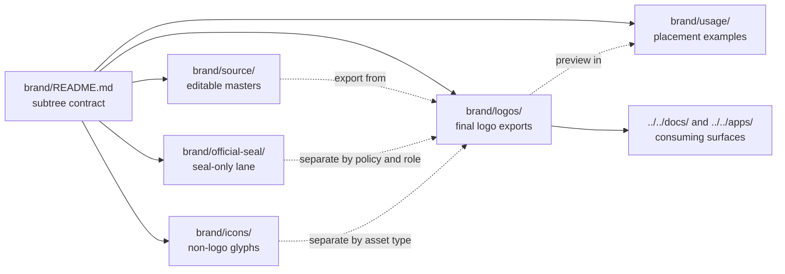

<!-- [KFM_META_BLOCK_V2]
doc_id: kfm://doc/NEEDS-VERIFICATION
title: logos
type: standard
version: v1
status: draft
owners: @bartytime4life (global CODEOWNERS fallback; narrower path ownership NEEDS VERIFICATION)
created: YYYY-MM-DD
updated: YYYY-MM-DD
policy_label: NEEDS-VERIFICATION
related: [../README.md, ../../README.md, ../../CONTRIBUTING.md, ../../.github/README.md, ../official-seal/README.md, ../icons/README.md, ../source/README.md, ../usage/README.md]
tags: [kfm, brand, logos, identity]
notes: [Current public main-branch view shows brand/logos containing only README.md; doc_id, dates, and policy label still need verification.]
[/KFM_META_BLOCK_V2] -->

# logos

Reusable KFM logo exports and lane contract for committed primary identity marks.

> **Status:** experimental  
> **Owners:** `@bartytime4life` *(global `CODEOWNERS` fallback; narrower brand ownership needs verification)*  
> **Path:** `brand/logos/README.md`  
> [](../README.md)
> [](../../.github/CODEOWNERS)
> [](./README.md)
> [](../../README.md)
> [](#current-inventory)  
> **Quick jumps:** [Scope](#scope) · [Repo fit](#repo-fit) · [Accepted inputs](#accepted-inputs) · [Exclusions](#exclusions) · [Current inventory](#current-inventory) · [Directory tree](#directory-tree) · [Quickstart](#quickstart) · [Usage](#usage) · [Tables](#tables) · [Diagram](#diagram) · [Task list](#task-list--definition-of-done) · [FAQ](#faq) · [Appendix](#appendix)

> [!IMPORTANT]
> The current public `main` view shows `brand/logos/` as a real directory, but it currently contains only this README. Treat this file as the directory contract for future logo assets, not as evidence that a reusable logo pack is already committed.

## Scope

Use `brand/logos/` for reusable KFM logo exports that are meant to be referenced from docs, app chrome, covers, and other sanctioned presentation surfaces.

This lane is narrower than `brand/`. It is for primary identity marks only—wordmarks, emblems, lockups, and their committed export variants—not for icons, seal art, editable working files, or context-heavy usage previews.

[Back to top](#logos)

## Repo fit

`brand/logos/` is a confirmed leaf directory under the live `brand/` subtree. Right now it is structurally present but asset-light.

| Field | Value |
|---|---|
| **Path status** | Confirmed live directory on public `main`; current visible inventory is placeholder-only |
| **Parent contract** | [`../README.md`](../README.md) |
| **Upstream repo docs** | [`../../README.md`](../../README.md) · [`../../CONTRIBUTING.md`](../../CONTRIBUTING.md) · [`../../.github/README.md`](../../.github/README.md) |
| **Sibling asset lanes** | [`../icons/`](../icons/) · [`../official-seal/`](../official-seal/) · [`../source/`](../source/) · [`../usage/`](../usage/) · [`../LICENSES/`](../LICENSES/) |
| **Expected downstream consumers** | [`../../docs/`](../../docs/) · [`../../apps/`](../../apps/) · reusable export/report surfaces; exact live consumers still need verification |
| **Ownership basis** | global fallback in [`../../.github/CODEOWNERS`](../../.github/CODEOWNERS) |

> [!NOTE]
> The live public tree exposes `brand/logos/` and `brand/assets/` as separate sibling directories. Until the branch-local asset layout is re-verified, treat `brand/logos/` as the concrete home for reusable logo exports and keep `brand/assets/` out of this lane’s contract.

Local rule: if a logo change alters trust-visible chrome, exported covers, or shared presentation patterns, update the nearest consuming docs in the same change stream.

[Back to top](#logos)

## Accepted inputs

Commit only reusable, final-form logo assets and the minimum support material required to use them safely:

- primary KFM logo exports such as emblem, wordmark, or approved lockups
- light, dark, inverse, or mono variants of committed logo files
- fixed-size raster exports that are clearly derived from a committed vector source
- concise placement or filename guidance that speaks directly to files in this directory
- small, review-safe preview references when they exist solely to document the committed logo set

## Exclusions

Keep this lane narrow.

- **Official seal art** does not belong here. Put it in [`../official-seal/`](../official-seal/).
- **General UI icons or glyphs** do not belong here. Put them in [`../icons/`](../icons/).
- **Editable source files** do not belong here. Put them in [`../source/`](../source/).
- **Usage mockups, cover examples, or placement previews** do not belong here. Put them in [`../usage/`](../usage/).
- **Attribution, rights notes, or third-party license records** do not belong here as the main content. Put them in [`../LICENSES/`](../LICENSES/) and link back.
- **Trust semantics** do not belong here. `brand/logos/` may shape appearance, but it must not redefine review state, evidence state, freshness, or policy meaning.

> [!CAUTION]
> A clean logo lane helps KFM stay inspectable. Do not let `brand/logos/` become a bucket for persuasive visuals, special-case screenshots, or assets with unclear rights.

## Current inventory

The current public tree shows a very small, very clear starting point.

| Path | Status | Notes |
|---|---|---|
| `./README.md` | **CONFIRMED** | The only visible file in `brand/logos/` today |
| committed `.svg` / `.png` logo exports in this directory | **NONE VISIBLE** | Add only after rights, naming, and placement review |
| `../official-seal/kfm-official-seal-transparent.png` | **CONFIRMED sibling asset** | This exists nearby, but outside the logo lane on purpose |

## Directory tree

Live public-tree view, collapsed to the brand area most relevant to this directory:

```text
brand/
├── README.md
├── LICENSES/
│   └── README.md
├── assets/
│   └── README.md
├── icons/
│   └── README.md
├── logos/
│   └── README.md            # this file; only visible file here today
├── official-seal/
│   ├── README.md
│   └── kfm-official-seal-transparent.png
├── source/
│   └── README.md
├── templates/
│   └── README.md
├── tokens/
│   └── README.md
└── usage/
    └── README.md
```

[Back to top](#logos)

## Quickstart

Inspect the live tree before adding or renaming anything.

```bash
# inspect the logo lane itself
find brand/logos -maxdepth 2 -type f 2>/dev/null | sort
```

```bash
# inspect adjacent brand lanes so assets land in the right place
find brand/{official-seal,icons,source,usage,LICENSES} -maxdepth 2 -type f 2>/dev/null | sort
```

```bash
# find current logo or seal references before changing filenames
git grep -nE 'logo|wordmark|emblem|official-seal|brand/' -- brand docs apps 2>/dev/null || true
```

```bash
# surface unresolved placeholders before merge
grep -RIn 'NEEDS VERIFICATION\|YYYY-MM-DD\|kfm://doc/NEEDS-VERIFICATION' brand .github docs apps 2>/dev/null || true
```

## Usage

Keep `brand/logos/` boring, stable, and easy to consume.

### Working rule

A file committed here should be ready to reference from a README, a governed export surface, or app chrome without requiring the reader to guess:

- whether it is final or editable
- whether it is the logo or the seal
- whether there is a better sibling location
- whether rights or reuse posture are still unresolved

### When this directory stops being empty

1. Commit final export assets here, not editable masters.
2. Keep source-of-truth working files in [`../source/`](../source/).
3. Keep seal material in [`../official-seal/`](../official-seal/), even if it is visually adjacent to logo work.
4. Record rights, attribution, or reuse constraints in [`../LICENSES/`](../LICENSES/).
5. Add or update example placements in [`../usage/`](../usage/) only after filenames stabilize.
6. Update [`../README.md`](../README.md) if the brand subtree’s visible inventory meaningfully changes.

### Doctrine-shaped usage rule

Logos may support trust-visible surfaces, but they do not own trust meaning. They can shape a header, cover, badge row, or app chrome treatment; they must not silently redefine what counts as reviewed, generalized, stale-visible, restricted, or published.

[Back to top](#logos)

## Tables

### Placement matrix

| If the asset is... | Put it here | Why |
|---|---|---|
| reusable logo export | `brand/logos/` | this lane exists for committed primary identity marks |
| official seal or formal seal derivative | `brand/official-seal/` | the repo already separates seal art from general logo storage |
| non-logo iconography | `brand/icons/` | not every reusable graphic is a logo |
| editable vector source or working master | `brand/source/` | keep final exports separate from authoring files |
| preview placements or usage mockups | `brand/usage/` | context-heavy examples should not crowd the asset lane |
| rights / attribution record | `brand/LICENSES/` | keep legal context linkable and reviewable |

### Starter export pack _(PROPOSED until real files exist)_

These are safe starter expectations, not confirmed current inventory.

| Proposed asset | Purpose | Note |
|---|---|---|
| `kfm-emblem.svg` | primary vector emblem export | already named as a parent-brand cue |
| `kfm-emblem.light.svg` | light/inverse emblem export | already named as a parent-brand cue |
| `png/24/32/48/64` pack | README and UI smoke-test exports | matches the size pack named in the parent brand contract |
| local manifest or linked note | explain variant purpose and reuse limits | keep long-form rights detail out of the file names |

> [!NOTE]
> The parent `brand/README.md` names emblem exports and PNG sizes, but it does **not** confirm that those files already exist in the live repo. Keep this table explicitly **PROPOSED** until real assets land.

## Diagram



## Task list / definition of done

### Task list

- [ ] Verify whether any reusable logo files already live elsewhere in the repo or on the active branch.
- [ ] Keep this README as contract-only until real files exist, or add the first real logo exports in the same PR.
- [ ] Verify rights, attribution, and reuse posture for every committed logo asset.
- [ ] Keep seal art and iconography in their sibling lanes instead of duplicating them here.
- [ ] Add reciprocal links from [`../README.md`](../README.md) and any consumer docs once this directory contains real assets.
- [ ] Confirm whether the repo wants a local manifest here or rights notes only in [`../LICENSES/`](../LICENSES/).

### Definition of done

This README is ready to merge when:

1. it accurately describes the live `brand/logos/` inventory
2. ownership, dates, doc ID, and policy label are verified or intentionally left as explicit placeholders
3. accepted inputs and exclusions match the actual brand subtree
4. no content here implies committed logo files that do not exist
5. seal, icon, source, usage, and license boundaries are clear from the first screenful
6. at least one consumer path is known once real logo files are added

## FAQ

### Why not put the official seal in `brand/logos/`?

Because the live repo already separates it into [`../official-seal/`](../official-seal/). Keeping that split visible avoids mixing primary brand marks with special-use seal art.

### Why is this README more detailed than the current directory contents?

Because the live directory currently exists only as a placeholder lane. The README has to carry the contract until real logo files arrive.

### Do editable `.ai`, `.fig`, or working `.svg` source files belong here?

No. Keep working masters in [`../source/`](../source/) and commit final, reusable exports here.

### Can this directory define trust chips or product-state meanings?

No. Logos may support appearance, but trust semantics remain owned by governed app, contract, policy, and verification surfaces.

[Back to top](#logos)

## Appendix

<details>
<summary>Verification backlog</summary>

### Open unknowns

- exact `doc_id`, `created`, `updated`, and `policy_label` values
- whether any real logo exports already exist outside `brand/logos/`
- whether the active branch wants `brand/logos/` to stay empty until a fuller brand asset pack is ready
- whether any downstream docs or apps currently expect filenames that are not yet visible in the public tree
- whether a local manifest is preferred here or in a shared sibling lane

### Recommended follow-up checks

1. Inspect the active branch checkout, not just the public directory view.
2. Re-read [`../README.md`](../README.md) after any asset lands here.
3. Search for all current consumers before renaming or nesting files.
4. Add or update rights notes in [`../LICENSES/`](../LICENSES/) before broad reuse.
5. If the first real logo files are added, add one placement example in [`../usage/`](../usage/) and link it back here.

</details>
