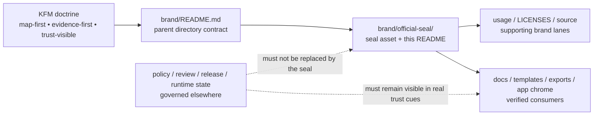

# official-seal

Directory contract for KFM’s checked-in official seal asset, its reusable variants, and the guardrails that stop a symbol from impersonating review, release, or evidence state.

<p align="center">
  
</p>

> Status: `experimental`
> Owners: `NEEDS VERIFICATION`
> Path: `brand/official-seal/README.md`
> Repo fit: directory README for the `official-seal/` subtree inside `brand/`; upstream from [../README.md](../README.md), adjacent to [../LICENSES/](../LICENSES/), [../usage/](../usage/), and [../source/](../source/), downstream into reusable docs, templates, exports, and any verified product surfaces that need the seal.
>     
> Quick jumps: [Scope](#scope) · [Repo fit](#repo-fit) · [Accepted inputs](#accepted-inputs) · [Exclusions](#exclusions) · [Directory tree](#directory-tree) · [Quickstart](#quickstart) · [Usage](#usage) · [Diagram](#diagram) · [Asset table](#asset-table) · [Task list](#task-list--definition-of-done) · [FAQ](#faq) · [Appendix](#appendix--open-unknowns)

> [!IMPORTANT]
> Use the official seal as identity, not as proof. In KFM, trust-bearing meanings still live in governed contracts, policy decisions, review artifacts, release evidence, runtime envelopes, and visible evidence access.

## Scope

`brand/official-seal/` is the narrowest reusable seal surface inside KFM’s brand layer.

Use it to document:

- the committed official seal asset(s) in this subtree
- approved reusable exports or variants of the same seal
- minimum usage, placement, and contrast rules for repeated repo use
- adjacent rights, attribution, and source-master handoffs that keep the asset auditable

Do not use it to:

- invent approval, freshness, or verification meaning
- absorb general logos, icons, or one-off campaign art
- replace [../README.md](../README.md) as the directory contract for all brand material

### Truth posture used in this README

| Label | Meaning here |
|---|---|
| **CONFIRMED** | Directly visible in the current public repo tree or in adjacent repo README surfaces inspected for this revision. |
| **INFERRED** | Seal-specific rule or consuming pattern derived from the parent `brand/` contract and KFM’s trust-visible doctrine. |
| **PROPOSED** | Safe next addition such as new variants, digest tables, or source-master documentation not yet confirmed in this subtree. |
| **NEEDS VERIFICATION** | Owners, rights details, source-master location, and exact consumer inventory still require direct branch-local inspection. |
| **UNKNOWN** | Not supported strongly enough in the current public tree or adjacent inspected docs to present as settled repo fact. |

[Back to top](#official-seal)

## Repo fit

| Item | Value |
|---|---|
| Path | `brand/official-seal/README.md` |
| Directory role | Seal-specific README for the official KFM seal subtree |
| Parent contract | [../README.md](../README.md) |
| Adjacent supporting lanes | [../LICENSES/](../LICENSES/) · [../usage/](../usage/) · [../source/](../source/) · [../templates/](../templates/) · [../tokens/](../tokens/) |
| Sibling identity lanes | [../logos/](../logos/) · [../icons/](../icons/) |
| Expected downstream consumers | Reusable docs, template covers, exports, and any verified app surface that needs the seal without changing trust semantics |

Local rule: if a seal change alters how KFM visually presents freshness, generalization, review state, evidence access, or other trust-visible cues, update the adjacent brand documentation in the same change stream.

## Accepted inputs

Place only the following here:

- committed official-seal exports intended for repeated use
- format- or variant-specific notes that stay specific to the seal
- min-size, clear-space, background, and contrast guidance for the seal
- digest, dimensions, or review notes that help maintainers verify the exact asset they are using
- narrow seal-specific usage examples that remain reusable across docs, exports, or shell-adjacent surfaces

## Exclusions

Keep these out of `brand/official-seal/`:

- alternate logos, wordmarks, or lockups that belong in [../logos/](../logos/)
- generic icons or favicon-like surfaces that belong in [../icons/](../icons/)
- raw editable source masters that are not yet approved reusable exports; keep them in a verified source-master lane such as [../source/](../source/) if that is the real home
- one-off mockups, screenshots, concept art, or campaign collateral
- policy chips, review badges, or release-state icons whose meaning is defined elsewhere
- third-party seals, marks, or fonts with unverified rights status

> [!CAUTION]
> The seal must never be used as a substitute for `released`, `reviewed`, `verified`, `current`, `policy-cleared`, or `evidence-backed`. Those states need their own governed artifacts and trust-visible UI cues.

## Directory tree

Current public-tree-shaped view:

```text
brand/
├── LICENSES/
├── assets/
├── icons/
├── logos/
├── official-seal/
│   ├── README.md
│   └── kfm-official-seal-transparent.png
├── source/
├── templates/
├── tokens/
├── usage/
└── README.md
```

Seal-local minimum tree:

```text
brand/official-seal/
├── README.md
└── kfm-official-seal-transparent.png
```

## Quickstart

Inspect first. Reuse second.

```bash
# Inspect the subtree itself
find brand/official-seal -maxdepth 2 -type f 2>/dev/null | sort

# Inspect adjacent support lanes that may govern rights, source masters, or sanctioned usage
find brand/LICENSES brand/usage brand/source -maxdepth 3 -type f 2>/dev/null | sort

# Find live consumers of the checked-in seal asset
git grep -n 'kfm-official-seal-transparent\.png' -- .

# Optional: inspect file metadata and produce a stable review digest
file brand/official-seal/kfm-official-seal-transparent.png
shasum -a 256 brand/official-seal/kfm-official-seal-transparent.png

# Surface placeholders before merge
grep -RIn 'NEEDS VERIFICATION\|TBD\|TODO\|YYYY-MM-DD' brand/official-seal brand 2>/dev/null || true
```

## Usage

Treat the official seal as a reusable identity anchor, not as a trust verdict.

### Working rules

1. Keep the seal visually secondary to map, time, evidence, and trust context.
2. Pair the seal with real scope, date, and provenance context on docs or exports.
3. Preserve legibility on light and dark backgrounds before introducing new variants.
4. Prefer repeated, auditable placements over decorative hero use.
5. Keep rights, attribution, and reuse review discoverable by maintainers.

### Surface guidance

| Surface | Guidance | Posture |
|---|---|---|
| Directory docs and reusable repo collateral | Good fit when the seal supports identity without implying approval | **CONFIRMED / INFERRED** |
| Template covers and exported front matter | Allowed if date, scope, and trust context remain visible nearby | **INFERRED** |
| App chrome or splash surfaces | Conditional; do not crowd map, timeline, or Evidence Drawer controls | **INFERRED** |
| Approval, release, or verification stamp | Not allowed unless a separate governed artifact explicitly defines that meaning | **CONFIRMED doctrine** |
| One-off screenshots or campaign art | Not here | **CONFIRMED by parent brand exclusions** |

> [!NOTE]
> A seal can make a surface feel official very quickly. In KFM, that is exactly why it needs tighter rules than a generic logo.

[Back to top](#official-seal)

## Diagram



## Asset table

| Item | Type | Current repo signal | Notes |
|---|---|---|---|
| [`./kfm-official-seal-transparent.png`](./kfm-official-seal-transparent.png) | PNG | **CONFIRMED** | Current checked-in seal asset for this subtree |
| `README.md` | Markdown | **CONFIRMED** | Directory contract and usage surface for the seal |
| Editable vector/source master | Source asset | **UNKNOWN / NEEDS VERIFICATION** | Not confirmed in the current `official-seal/` subtree; may live under a verified source-master lane |
| Additional light/dark or format-specific seal variants | Export set | **PROPOSED** | Add only when a real consuming surface needs them and review notes stay with the asset |

## Task list / definition of done

### Task list

- [ ] Verify owners for this subtree against `CODEOWNERS` or the repo’s owner-of-record mechanism.
- [ ] Verify rights, attribution, and reuse notes in [../LICENSES/](../LICENSES/) or an equivalent confirmed lane.
- [ ] Verify whether an editable source master exists under [../source/](../source/) or elsewhere.
- [ ] Confirm which docs, templates, or app surfaces currently consume the seal.
- [ ] Add digest, dimensions, and background-compatibility notes if this asset becomes a cross-surface dependency.
- [ ] Add new variants only when the consumer need is real and documented.

### Definition of done

A good `official-seal/` change is done when:

- the committed asset inventory is explicit
- no placement or filename implies trust state the repo cannot prove
- rights and reuse posture are discoverable
- consumers can find the seal without guessing between `logos/`, `icons/`, and `official-seal/`
- adjacent brand docs remain consistent with this subtree

## FAQ

### Is this directory only for the current PNG?

Today, the checked-in subtree is anchored by `kfm-official-seal-transparent.png`, but the directory can hold additional verified variants of the same seal when they are truly reusable and documented.

### Can the official seal act as a release or approval badge?

No. Release, review, verification, and runtime trust meanings must remain backed by governed artifacts and visible trust cues, not by brand symbolism alone.

### Where should alternate logos or non-seal marks go?

Use [../logos/](../logos/) for logo families and [../icons/](../icons/) for icon surfaces. Keep this directory narrow.

### Where should raw design source files live?

Not here by default. Keep editable masters in a verified source-master lane such as [../source/](../source/) if that is the repo’s actual source-of-truth location.

### Should applications consume this PNG directly?

Only after verifying that no shared asset pipeline, token layer, or alternate export format is the intended consumer path. Direct use is reasonable for simple docs or export surfaces; runtime-critical usage should be reviewed.

[Back to top](#official-seal)

## Appendix — open unknowns

<details>
<summary>Show verification backlog</summary>

These details still need direct branch inspection or adjacent-file review:

- owners for `brand/official-seal/`
- whether [../LICENSES/](../LICENSES/) already documents this asset’s reuse terms
- whether [../usage/](../usage/) already contains sanctioned placement guidance
- whether a vector or editable master exists and where it is canonically stored
- whether the current PNG needs light/dark or size-specific derivatives
- which docs, templates, or app surfaces already consume the seal
- whether seal-related tokens belong in [../tokens/](../tokens/) or should stay out of tokenized surfaces entirely

</details>
