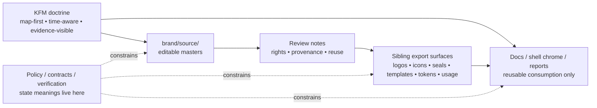

<!-- [KFM_META_BLOCK_V2]
doc_id: kfm://doc/NEEDS-VERIFICATION
title: brand/source
type: standard
version: v1
status: draft
owners: NEEDS VERIFICATION
created: YYYY-MM-DD
updated: YYYY-MM-DD
policy_label: NEEDS VERIFICATION
related: [../README.md, ../../README.md, ../../.github/README.md, ../LICENSES/, ../usage/]
tags: [kfm, brand, source, identity]
notes: [Current live path is verified, but owners, policy label, and authoritative dates still need repo-backed confirmation; this draft replaces a placeholder README.]
[/KFM_META_BLOCK_V2] -->

<a id="top"></a>

# brand/source

Editable source-of-truth artwork and working files for reusable KFM identity assets and governed visual derivatives.

[](../README.md)
[](./README.md)
[](../../.github/README.md)
[](#directory-tree)

| Field | Value |
|---|---|
| Status | experimental |
| Owners | NEEDS VERIFICATION |
| Path | `brand/source/README.md` |
| Repo fit | Directory contract for editable brand masters that sit upstream of reusable exports in the surrounding `brand/` subtree |
| Quick jumps | [Scope](#scope) · [Repo fit](#repo-fit) · [Accepted inputs](#accepted-inputs) · [Exclusions](#exclusions) · [Directory tree](#directory-tree) · [Quickstart](#quickstart) · [Usage](#usage) · [Diagram](#diagram) · [Tables](#tables) · [Task list / definition of done](#task-list--definition-of-done) · [FAQ](#faq) · [Appendix](#appendix) |

> [!IMPORTANT]
> `brand/source/` should hold **editable upstream assets only**. It is not the place where KFM defines trust semantics, policy meaning, review state, or evidence logic. Those meanings stay in governed app, contract, policy, and verification materials.

## Scope

Use `brand/source/` for the editable masters behind reusable KFM identity assets: source artwork, working lockups, construction files, review-safe source diagrams, and closely attached provenance or reuse notes.

This directory exists to keep **authoritative visual sources** separate from their **derived exports**. That split matches KFM’s broader doctrine: authoritative material stays distinct from delivery-friendly projections, and no polished derivative should quietly become the only surviving source of meaning.

[Back to top](#top)

## Repo fit

**Path:** `brand/source/README.md`  
**Path status:** **CONFIRMED live path**  
**Current local role:** the source-only complement to the broader `brand/` contract.

**Upstream references:** [`../README.md`](../README.md), [`../../README.md`](../../README.md), [`../../.github/README.md`](../../.github/README.md)

**Sibling surfaces in the live `brand/` subtree:** [`../LICENSES/`](../LICENSES/), [`../assets/`](../assets/), [`../icons/`](../icons/), [`../logos/`](../logos/), [`../official-seal/`](../official-seal/), [`../templates/`](../templates/), [`../tokens/`](../tokens/), [`../usage/`](../usage/)

**Downstream expectation:** assets prepared here should feed reusable exports or guidance in the surrounding `brand/` subtree without redefining trust-visible runtime states such as freshness, generalization, restriction, withdrawal, or review.

**Local rule:** if a source asset changes how KFM presents evidence access, correction state, review state, or other trust-visible cues, update adjacent docs in the same change stream.

## Accepted inputs

Place only material here that is both **editable** and **worth preserving as a source**:

- master wordmarks, emblems, lockups, and icon-construction files
- upstream vector or layered artwork used to generate reusable exports
- source diagrams or illustration masters reused across docs, reports, slides, or shell-adjacent collateral
- palette references, spacing studies, and other source notes used to derive sanctioned brand outputs
- rights, attribution, provenance, or reuse notes that need to stay attached to a source master
- review artifacts that belong with the master itself, such as contrast proofs or variant comparison sheets

## Exclusions

Do **not** use `brand/source/` as a generic holding area.

- Final reusable exports do not belong here when a clearer sibling destination exists. Prefer `../logos/`, `../icons/`, `../official-seal/`, `../templates/`, `../tokens/`, or `../usage/` as appropriate.
- Canonical data, evidence, source descriptors, policy artifacts, or runtime contracts do not belong here.
- One-off mockups, mood boards, research comps, and exploratory screenshots do not belong here unless they are clearly review-safe, reusable, and unlikely to be mistaken for shipped behavior.
- Unverified third-party fonts, vendor marks, or rights-unclear source material do not belong here.
- Spectacle-first 3D hero art does not belong here as default product identity. If 3D collateral exists, it must remain clearly contextual and subordinate to KFM’s 2D-first public reasoning model.

> [!CAUTION]
> A beautiful source file can still be a bad KFM artifact if its rights posture is unclear, its downstream use is ambiguous, or it visually implies shipped behavior that the repo does not actually prove.

## Directory tree

### Current live parent tree

```text
brand/
├── LICENSES/
├── assets/
├── icons/
├── logos/
├── official-seal/
├── source/
│   └── README.md
├── templates/
├── tokens/
├── usage/
└── README.md
```

### Current local state of `source/`

```text
brand/source/
└── README.md
```

### Practical reading of this tree

- `brand/source/` is the narrowest plausible place for **masters and editable sources**
- sibling directories appear positioned for **exports, reusable surfaces, or guidance**
- if a file can be regenerated from a master here, it should usually live outside `brand/source/`

## Quickstart

Inspect first. Then classify.

```bash
# Inspect the current brand subtree
find brand -maxdepth 2 -print | sort

# Confirm this directory is no longer placeholder-only
find brand/source -maxdepth 2 -type f | sort

# Surface placeholder metadata before merge
grep -RIn 'NEEDS VERIFICATION\|YYYY-MM-DD\|kfm://doc/NEEDS-VERIFICATION' brand 2>/dev/null || true

# Optional: emit digests for reviewable source assets
find brand/source -type f ! -name README.md -print0 2>/dev/null | xargs -0 shasum -a 256
```

Minimal contributor flow:

1. Add or revise the editable master in `brand/source/`.
2. Attach provenance, reuse, and review notes close to the source.
3. Generate reusable outputs into the appropriate sibling directory.
4. Verify that exported forms do not blur trust-visible meanings.
5. Supersede older source masters deliberately instead of silently overwriting them.

## Usage

### Recommended working flow

1. **Start with the source, not the export.**  
   If the editable master is missing, the derivative is already carrying too much weight.

2. **Record rights before polish.**  
   A source master with unclear reuse status is not ready for downstream propagation.

3. **Keep source and export separate.**  
   `brand/source/` should preserve the thing you can revise; sibling directories should carry the thing you can consume.

4. **Let brand shape appearance, not doctrine.**  
   Brand may influence contrast, spacing, iconography, and export quality. It must not redefine KFM trust states.

5. **Prefer explicit supersession.**  
   If a source changes materially, keep lineage legible.

### Source-owned vs. contract-owned

| Concern | `brand/source/` may own | `brand/source/` must not silently redefine |
|---|---|---|
| Wordmarks, emblems, lockups | geometry, spacing, stroke discipline, source layers, export guidance | release authority, policy classes, evidence semantics |
| Icon source art | construction grid, optical alignment, size-ready source forms | meanings of `stale-visible`, `generalized`, `restricted`, `withdrawn`, or `superseded` |
| Drawer / badge visual sources | shape language, spacing rhythm, light/dark treatment | required Evidence Drawer fields, citation rules, review logic |
| Templates and covers | layout source, safe margins, typographic hierarchy | runtime validity, release scope, or review approval state |
| Optional 3D collateral | clearly contextual source art | KFM’s default operating surface or truth model |

## Diagram



## Tables

### What belongs here vs. where it goes

| Material class | Confidence | Preferred location | Why |
|---|---|---|---|
| Editable brand masters | CONFIRMED fit | `brand/source/` | Preserve the revisable upstream asset |
| Reusable logo exports | INFERRED from live sibling dir | `brand/logos/` | Keep source separate from committed output forms |
| Reusable icon exports | INFERRED from live sibling dir | `brand/icons/` | Same separation principle, tighter runtime-facing use |
| Official seal exports or controlled variants | INFERRED from live sibling dir | `brand/official-seal/` | Keep controlled identity artifacts isolated |
| Reusable templates | INFERRED from live sibling dir | `brand/templates/` | Separate source masters from applied templates |
| Brand token references | INFERRED from live sibling dir | `brand/tokens/` | Keep reusable token-facing artifacts distinct from master art |
| Usage / attribution guidance | INFERRED from live sibling dirs | `brand/usage/` and `brand/LICENSES/` | Keep reuse and rights visible downstream |
| Generic assets with no clearer home | NEEDS VERIFICATION | `brand/assets/` | Directory exists, but exact contract should be clarified before broad use |
| Data, evidence, policy, or schema artifacts | CONFIRMED exclusion | outside `brand/` | These belong in governed system layers, not the brand layer |

### Minimum review pack for a source asset

| Field family | Minimum content | Why it matters |
|---|---|---|
| Identity | `asset_id`, title, family, primary variant | Keeps the source findable and discussable |
| Stewardship | owner or reviewer-of-record, contact path | Avoids orphaned masters |
| Rights / reuse | license, attribution needs, third-party dependencies | KFM treats rights as first-class |
| Intended use | docs, shell chrome, export collateral, badge/chip source, etc. | Prevents ambiguous downstream reuse |
| Validation | contrast check, render check, size/export check | Keeps pretty sources from failing in use |
| Lineage | upstream master refs, downstream export refs, supersession note | Preserves correction and re-export clarity |
| Publication intent | public-safe, steward-only, generalized-only, or never publish directly | Prevents accidental outward exposure |

## Task list / definition of done

### Task list

- Verify owners against the repo’s owner-of-record mechanism.
- Replace all placeholders in the KFM meta block.
- Confirm whether `brand/assets/` has a distinct contract or should be narrowed.
- Add source-side rights or reuse notes for every committed master.
- Map each committed source file to at least one real downstream export or surface.
- Confirm whether any trust-chip or badge source art here is mirrored by app-owned assets elsewhere.
- Remove or relocate one-off exploratory material.
- Add explicit supersession notes when a master is replaced.
- Keep any source asset touching trust-visible UI aligned with app, policy, and verification docs.

### Definition of done

This README is ready to merge when:

1. owners, dates, and policy label are verified
2. accepted inputs and exclusions match real repo use
3. every non-README file in `brand/source/` has a clear reason to remain editable source
4. downstream sibling destinations are used consistently for exports
5. rights and reuse status are visible for committed source assets
6. no source asset here implies unverified runtime, policy, or release behavior
7. supersession paths are clear enough that later contributors can revise assets without silent overwrite

## FAQ

### Why keep `brand/source/` separate from `brand/logos/` or `brand/icons/`?

Because source and export play different roles. `brand/source/` should preserve the editable upstream master; sibling directories are the better home for committed, reusable outputs.

### Can runtime-facing trust chips be sourced from here?

Yes as **artwork**. No as **meaning**. This directory can hold the visual source for a chip, badge, or icon treatment; it must not become the place where the semantics of that state are defined.

### Can fonts live here?

Only if the reuse posture is clear and the reason for keeping the source is strong. Rights-unclear or vendor-restricted font material should stay out.

### Can screenshots or mockups live here?

Usually no. Keep this directory for durable source assets, not disposable review material.

### Should generated SVGs or PNGs stay here?

Usually no. If they are consumption-ready rather than revision-ready, move them to the appropriate sibling directory.

## Appendix

<details>
<summary>Illustrative source-asset sidecar (PROPOSED pattern)</summary>

Use this only as a starter pattern until the repo confirms a stronger house format.

```yaml
kind: BrandSourceAsset
schema_version: 0.1.0
asset_id: brand.source.wordmark.primary.v1
title: KFM primary wordmark source
family: wordmark
steward: NEEDS VERIFICATION

rights:
  class: needs-review
  attribution: NEEDS VERIFICATION
  third_party_dependencies: []

intended_use:
  surfaces:
    - docs
    - shell-chrome
    - export-covers
  publication_intent: public-safe

validation:
  contrast_checked: false
  export_checked: false
  notes: []

lineage:
  downstream_exports:
    - ../logos/
  supersedes: null
```

</details>

[Back to top](#top)
