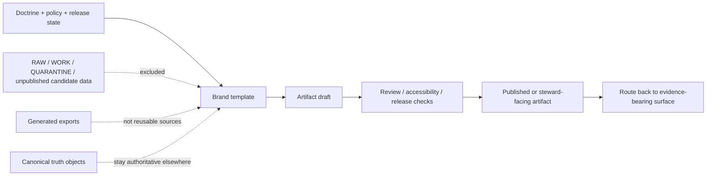

<!-- [KFM_META_BLOCK_V2]
doc_id: kfm://doc/NEEDS-VERIFICATION
title: KFM Brand Templates
type: standard
version: v1
status: draft
owners: NEEDS VERIFICATION
created: YYYY-MM-DD
updated: YYYY-MM-DD
policy_label: NEEDS VERIFICATION
related: [../README.md, ../../README.md, ../../policy/README.md, ../../contracts/README.md, ../../schemas/README.md, ../../.github/workflows/README.md]
tags: [kfm, brand, templates]
notes: [doc_id/owners/dates/policy label require repo-side verification, subtree inventory under brand/templates remains starter-level until the mounted tree is reconciled]
[/KFM_META_BLOCK_V2] -->

# KFM Brand Templates

Reusable scaffolds for branded KFM artifacts that must stay downstream of evidence, policy, review, and release state.

> [!IMPORTANT]
> **Status:** experimental · **Owners:** NEEDS VERIFICATION  
>      
> **Quick jump:** [Scope](#scope) · [Repo fit](#repo-fit) · [Inputs](#inputs) · [Exclusions](#exclusions) · [Directory tree](#directory-tree) · [Quickstart](#quickstart) · [Usage](#usage) · [Diagram](#diagram) · [Tables](#tables) · [Task list](#task-list) · [FAQ](#faq) · [Appendix](#appendix)  
> **Use this lane for:** reusable presentation shells, layout starters, disclosure fragments, and brand-consistent metadata patterns.

> [!NOTE]
> In KFM, “brand” is not decorative chrome. Templates in this lane should reinforce trust-visible presentation: purpose, state, time basis, route-back-to-evidence, and correction visibility stay legible at the point of use.

## Scope

This directory is for **reusable KFM brand-facing templates**: presentation scaffolds that make outward-facing artifacts consistent **without moving truth, policy, or release authority into the template layer**.

A template belongs here when it standardizes one or more of the following:

- branded structure for docs, briefings, cards, or similar outward surfaces
- reusable disclosure, status, or metadata placement
- trust-visible framing that should appear consistently across artifacts
- accessible starter layouts that package already-governed content

A template does **not** belong here when it becomes the place where:

- canonical truth is authored or repaired
- policy decisions are made
- review state is silently changed
- generated outputs replace the reusable source material

KFM’s doctrine is clear about the order of dependency: doctrine, evidence, policy, and release stay upstream; templates stay reusable and non-authoritative.

## Repo fit

| Facet | Value | Notes |
|---|---|---|
| Path | `brand/templates/README.md` | This file |
| Upstream | [brand/README.md][brand-readme] · [repo root README][root-readme] | Parent brand lane + repo-wide doctrine entry |
| Constraining docs | [policy/README.md][policy-readme] · [contracts/README.md][contracts-readme] · [schemas/README.md][schemas-readme] · [.github/workflows/README.md][workflows-readme] | Templates must stay downstream of policy, contract, schema, and release-gate logic |
| Downstream | INFERRED: branded docs, briefings, card assets, and other release-safe presentation surfaces assembled elsewhere | Verify exact consumer lanes locally |
| Verification note | `brand/README.md` is part of the current repo doc surface; the finer-grained `brand/templates/` inventory still needs local reconciliation | Keep this README synchronized with the mounted tree |

## Inputs

Accepted inputs here are the materials that help package already-governed content consistently.

| Accepted input | Why it belongs here | Notes |
|---|---|---|
| Reusable title, cover, and opener shells | Gives branded artifacts a consistent first scan | Release-safe only |
| Status strips and review markers | Keeps state visible instead of implied | Reusable wording/patterns only |
| Evidence-route and correction-route snippets | Preserves KFM’s traceability posture in outward surfaces | Should point back to governed surfaces |
| Reusable metadata headers or footer fragments | Prevents header drift across artifact types | Keep small and composable |
| Approved visual identity fragments | Supports consistent presentation | Verify asset location locally |
| Alt-text, caption, and accessibility placeholders | Makes starter artifacts easier to ship accessibly | Prefer mandatory placeholders over optional omission |

## Exclusions

What does **not** belong here, and where it should go instead:

| Exclude | Why it does not belong here | Put it instead |
|---|---|---|
| RAW / WORK / QUARANTINE content | Unpublished source-state material is not a brand template | Canonical source / staging lanes |
| Contracts, schemas, policy bundles | These are governing artifacts, not presentation scaffolds | [contracts/README.md][contracts-readme], [schemas/README.md][schemas-readme], [policy/README.md][policy-readme] |
| Generated PNG/PDF exports | Outputs are not reusable template sources | Publication, build, or output lane |
| One-off campaign copy with no evidence route | Creates drift and trust theater | Evidence-bearing doc or release lane |
| Truth-changing or release-changing artifacts | Templates must not silently mutate authority | Governed review / release / correction lanes |
| Hidden local style overrides that only one artifact understands | Weakens consistency and reviewability | Promote shared fragments here only after review |

## Directory tree

Starter view below preserves only what is safely implied. Reconcile it against the mounted repo before adding or removing paths.

```text
brand/
├─ README.md                  # parent brand lane
└─ templates/
   ├─ README.md               # this file
   ├─ partials/               # starter: trust/status/evidence fragments
   ├─ docs/                   # starter: page/report/opening shells
   ├─ slides/                 # starter: deck/title/opening shells
   ├─ cards/                  # starter: teaser/story/card shells
   └─ snippets/               # starter: badges, labels, metadata blocks
```

If the real tree differs, update this README first so the lane stays inspectable.

## Quickstart

1. Choose the **smallest** template family that fits the artifact.
2. Fill the trust-visible fields **before** writing decorative copy.
3. Replace placeholders only with release-safe content.
4. Link the artifact back to the governed evidence-bearing surface.
5. Store the reusable starter here, not the rendered export.

Minimal starter block for a claim-carrying artifact:

```md
# <artifact title>

<one-line purpose>

**Audience:** public | steward | internal
**State:** draft | review | published
**Time basis:** <as-of date or interval>
**Evidence route:** <relative link to dossier / report / release-backed page>
**Correction route:** <relative link to supersession / withdrawal / errata surface>

> [!NOTE]
> This artifact is a presentation surface. It does not replace the underlying evidence, policy, review, or release record.
```

## Usage

Use this lane in three passes:

1. **Select** a template family based on the outward surface you are preparing.
2. **Populate** purpose, state, time basis, evidence route, and correction route first.
3. **Export downstream** after review, leaving the reusable source template here and the rendered output elsewhere.

The working rule is simple: templates may shape **how** a governed artifact is presented, but they must not quietly redefine **what is true**, **what is approved**, or **what is publishable**.

## Diagram



## Tables

### Starter template families

| Family | Best for | Must carry | Must not do | Status |
|---|---|---|---|---|
| Docs / page starter | dossiers, briefs, report openers | purpose line, state, time basis, evidence route | become source of truth | starter |
| Slide / deck opener | review, stewardship, or briefing decks | audience, review state, date/time basis | imply public release by default | starter |
| Card / thumbnail shell | story cards, gallery tiles, teaser surfaces | short label, safe route-back link | hold standalone consequential claims | starter |
| Partial / snippet | metadata blocks, caveats, correction notes, disclosure text | stable wording and consistent placement | redefine policy semantics ad hoc | starter |

### Trust-visible minimums

| Minimum | Why it matters | Public | Steward | Internal |
|---|---|---|---|---|
| Purpose line | Makes the artifact legible on first scan | Required | Required | Recommended |
| State / review marker | Prevents false readiness | Required | Required | Required |
| Time basis | KFM is time-aware | Required | Required | Recommended |
| Evidence route | Keeps consequential claims inspectable | Required | Required | Recommended |
| Correction route | Preserves supersession / withdrawal visibility | Required | Required | Recommended |
| Rights / sensitivity cue | Prevents overexposure where burden is higher | When applicable | Required when applicable | When applicable |
| Accessibility text / alt text | Keeps outputs usable and reviewable | Required | Required | Required |

## Task list

Definition of done for this lane:

- [ ] Target subtree verified against the mounted repo
- [ ] Owners, dates, `doc_id`, and `policy_label` filled
- [ ] Parent and adjacent README links resolve locally
- [ ] Every consequential template exposes state, time basis, evidence route, and correction route
- [ ] No template stores RAW / WORK / QUARANTINE or unpublished candidate content
- [ ] Generated outputs are excluded or clearly routed elsewhere
- [ ] Accessibility pass completed for starter templates and fragments
- [ ] Any new template family is added to the matrix above before adoption

## FAQ

**Can templates hold substantive claim bodies?**  
Prefer keeping substantive claim text in evidence-bearing docs or release-backed surfaces. Templates should mostly frame, label, and route back.

**Do exported PNG, PDF, or slide builds belong here?**  
Usually no. Keep the reusable source starter here and place rendered outputs in the lane that owns publication, delivery, or review packaging.

**Can a “just visual” artifact omit the evidence route?**  
Not when it carries a consequential claim, a comparative framing, or a policy-significant summary.

**Can this lane define new schema fields or policy terms?**  
No. Reference [contracts/README.md][contracts-readme], [schemas/README.md][schemas-readme], and [policy/README.md][policy-readme] instead.

## Appendix

<details>
<summary>Starter conventions and open verification items</summary>

### Placeholder conventions

- Use `<angle-bracket placeholders>` for required substitutions.
- Use `NEEDS VERIFICATION` where repo-side confirmation is still pending.
- Remove TODO markers before promoting a template to default use.

### Open verification items

- Confirm the real `brand/templates/` subtree inventory.
- Confirm whether visual identity assets live here or in another brand lane.
- Confirm whether rendered outputs are ignored, built, or checked in.
- Reconcile this README with the parent [brand/README.md][brand-readme].
- Replace placeholder owners, `doc_id`, dates, and `policy_label`.

### Change discipline

- Prefer small, composable fragments over one oversized “master template.”
- Add new template families only when at least two consuming artifacts need them.
- When a template changes outward trust cues, update this README in the same change.
- Do not let convenience copy, badge drift, or export-only tweaks become silent defaults.

</details>

[Back to top](#kfm-brand-templates)

[root-readme]: ../../README.md
[brand-readme]: ../README.md
[policy-readme]: ../../policy/README.md
[contracts-readme]: ../../contracts/README.md
[schemas-readme]: ../../schemas/README.md
[workflows-readme]: ../../.github/workflows/README.md
