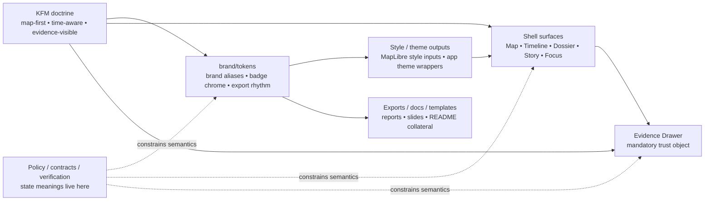

<!-- [KFM_META_BLOCK_V2]
doc_id: kfm://doc/UUID-NEEDS-VERIFICATION
title: tokens
type: standard
version: v1
status: draft
owners: @bartytime4life
created: YYYY-MM-DD
updated: YYYY-MM-DD
policy_label: NEEDS-VERIFICATION
related: [../README.md, ../../README.md, ../../CONTRIBUTING.md, ../../.github/README.md]
tags: [kfm, brand, tokens, design-system, maplibre]
notes: [global CODEOWNERS fallback is verified; brand-specific ownership split, dates, policy label, and machine-readable token inventory still need verification]
[/KFM_META_BLOCK_V2] -->

# tokens

Brand-scoped design-token guidance for KFM identity, badge chrome, and reusable presentation surfaces.

[](#scope)
[](#repo-fit)
[](#usage)
[](#directory-tree)

| Field | Value |
|---|---|
| Status | experimental |
| Owners | `@bartytime4life` _(global CODEOWNERS fallback)_ · brand-specific ownership split **NEEDS VERIFICATION** |
| Path | `brand/tokens/README.md` |
| Repo fit | Child README for brand-scoped design tokens inside `brand/`; supports reusable identity outputs and downstream docs/apps/packages without owning trust semantics |
| Quick jumps | [Scope](#scope) · [Repo fit](#repo-fit) · [Accepted inputs](#accepted-inputs) · [Exclusions](#exclusions) · [Directory tree](#directory-tree) · [Quickstart](#quickstart) · [Usage](#usage) · [Diagram](#diagram) · [Tables](#tables) · [Task list](#task-list--definition-of-done) · [FAQ](#faq) · [Appendix](#appendix) |

> [!NOTE]
> Truth labels used here: **CONFIRMED** = verified from the live repo tree or governing docs used for this task; **INFERRED** = adjacent repo fit strongly suggested by current structure; **PROPOSED** = recommended starter pattern; **UNKNOWN** = still needs direct verification.

> [!IMPORTANT]
> `brand/tokens/` may provide reusable visual inputs for badges, MapLibre theming, docs, and exports. It does **not** own policy classes, review semantics, release authority, or Evidence Drawer payload rules.

> [!CAUTION]
> The live `brand/tokens/` directory is currently README-only. Add machine-readable token files only after the source-of-truth location and at least one real consumer are verified.

## Scope

Use `brand/tokens/` for reusable, reviewable brand tokens that help KFM stay visually consistent across documentation, sanctioned collateral, shell chrome, and export surfaces.

This directory is for **brand-scoped** visual rules: color aliases, spacing, badge rhythm, icon stroke conventions, typography references, contrast variants, and similar material that can be reused safely. It is not a hiding place for app behavior, policy logic, or runtime truth-state meaning.

KFM doctrine treats the interface as part of the evidence chain. Token work here should therefore reinforce trust-visible behavior rather than compete with it.

## Repo fit

| Item | Value |
|---|---|
| Parent directory | [`../`](../) |
| Upstream references | [`../README.md`](../README.md), [`../../README.md`](../../README.md), [`../../CONTRIBUTING.md`](../../CONTRIBUTING.md), [`../../.github/README.md`](../../.github/README.md) |
| Neighbor directories | [`../assets/`](../assets/), [`../icons/`](../icons/), [`../logos/`](../logos/), [`../official-seal/`](../official-seal/), [`../source/`](../source/), [`../templates/`](../templates/), [`../usage/`](../usage/), [`../LICENSES/`](../LICENSES/) |
| Likely downstream consumers | [`../../docs/`](../../docs/), [`../../apps/`](../../apps/), [`../../packages/`](../../packages/) _(exact consuming paths still need verification)_ |
| Current live state | `brand/tokens/` exists and currently contains this README only |
| Working rule | Follow the live repo path (`brand/...`) for this directory contract; do not reintroduce stale alternate path assumptions here |

This README intentionally treats `brand/tokens/` as a **small, durable contract surface**. If token files appear later, they should exist because a real consumer needs them, not because the directory looks incomplete without them.

[Back to top](#tokens)

## Accepted inputs

Place only reusable, reviewable token material here:

- brand color aliases and named ramps used repeatedly across logos, badges, docs, and sanctioned shell chrome
- spacing, corner-radius, stroke-width, border, and elevation conventions for reusable brand treatment
- typography references, pairing guidance, weight/scale rules, and export-safe type usage notes
- light, dark, and high-contrast variants intended for repeated use
- compact token maps or snippets that can feed badge tables, contrast matrices, or generated outputs
- export-facing presentation tokens for README covers, report/slides collateral, and other sanctioned branded surfaces
- documented platform variants when a real web/native/rendering parity issue requires them

## Exclusions

Do **not** place the following here:

- policy classes, release states, review states, or trust-state meanings
- Evidence Drawer payload rules, Focus outcome contracts, or runtime envelope semantics
- MapLibre layer metadata such as business meaning, freshness, review state, evidence route, compare eligibility, or time semantics
- canonical style JSON, API payloads, route DTOs, schema registries, or verification fixtures as the source of truth
- one-off mockups, exploratory screenshots, research comps, or unreviewed concept art
- unverified third-party fonts, vendor marks, or rights-unclear assets
- spectacle-first default 3D identity material

If a token name encodes **behavior** or **authority**, it is probably in the wrong directory.

## Directory tree

### Current live tree

```text
brand/
├── LICENSES/
├── assets/
├── icons/
├── logos/
├── official-seal/
├── source/
├── templates/
├── tokens/
│   └── README.md
├── usage/
└── README.md
```

### This directory today

```text
brand/tokens/
└── README.md
```

No machine-readable token inventory is currently **CONFIRMED** in this directory.

## Quickstart

Inspect first. Normalize later.

```bash
# Show the current brand subtree before adding anything new
find brand -maxdepth 2 -type f | sort

# Look for likely token consumers or token-like material elsewhere
git grep -nE 'token|palette|badge|contrast|wordmark|official-seal|Evidence Drawer|Focus Mode|stale-visible|generalized|restricted|withdrawn|superseded' -- brand apps docs packages 2>/dev/null

# Find direct references to this subtree and adjacent brand paths
git grep -nE 'brand/tokens|brand/|logos/|icons/|official-seal/|templates/' -- . 2>/dev/null

# Surface unresolved placeholders before merge
grep -RIn 'NEEDS VERIFICATION\|YYYY-MM-DD\|UUID-NEEDS-VERIFICATION' brand .github docs apps packages 2>/dev/null || true
```

## Usage

Start with the **smallest real thing**: one token family, one verified consumer, one visible review rule.

Prefer a layered model:

1. **core identity aliases**  
   Stable brand names for color, spacing, stroke, and type rhythm.

2. **component / chrome tokens**  
   Reusable badge, border, chip, and heading treatments that can be applied consistently.

3. **export / collateral tokens**  
   Presentation-safe rules for covers, diagrams, slide/report framing, and branded collateral.

4. **platform variants**  
   Add these only when a real parity gap forces them. Shared defaults should remain the norm.

Generated CSS variables, app theme files, or MapLibre style inputs may be derived from this directory, but they should remain **downstream artifacts** unless this directory is explicitly verified as the canonical source of truth.

## Diagram



## Tables

### Token family matrix

| Family | Status | Belongs here? | Notes |
|---|---|---|---|
| Core brand aliases | CONFIRMED fit | Yes | color aliases, emblem strokes, wordmark spacing, radii, contrast variants |
| Badge / chrome tokens | INFERRED fit | Yes | reusable chip outlines, badge spacing, border weights, icon sizing for docs and sanctioned shell chrome |
| Export / collateral tokens | INFERRED fit | Yes | cover rhythm, watermark scale, title spacing, light/dark export presets |
| MapLibre-facing theme inputs | INFERRED fit | Yes, as inputs only | can feed style generation or shared theme wrappers; do not replace governed style registries |
| Platform-specific variants | PROPOSED | Conditional | add only when a proven parity gap requires `web`, `native`, or other explicit variants |
| 3D mode variants | PROPOSED | Conditional | only for burden-bearing, clearly non-default 3D collateral or contextual mode work |

### Source-of-truth boundary matrix

| Concern | `brand/tokens/` may define | Must stay elsewhere |
|---|---|---|
| Identity palette, spacing, stroke minima | visual tokens and reusable aliases | — |
| Trust chips and badges | shape, spacing, contrast, iconography | meanings of `stale-visible`, `generalized`, `restricted`, `withdrawn`, or `superseded` |
| Evidence Drawer chrome | headings, spacing, icon treatment, border rhythm | required fields, evidence linkage, resolver behavior, rights logic |
| MapLibre styling inputs | token values that feed style/theme generation | released style JSON, source registry, layer metadata registry |
| Policy / review / release cues | reserved visual severity ramps or treatment slots | actual policy classes, review rules, release authority |
| Fonts | documented references and rights notes | unverified or restricted third-party font binaries |

### Format strategy

| Format | Role | Status |
|---|---|---|
| `README.md` | canonical directory contract and human review surface | CONFIRMED |
| machine-readable token files | add only after a real consumer is verified | PROPOSED |
| generated CSS / theme / style outputs | downstream artifacts, not source of truth by default | PROPOSED |
| one-off screenshots / comps | keep elsewhere unless reusable and review-safe | EXCLUDED |

[Back to top](#tokens)

## Task list / definition of done

### Task list

- [ ] Verify whether `brand/tokens/` is the long-term source of truth or only a documentation contract.
- [ ] Identify at least one real downstream consumer before adding the first machine-readable token file.
- [ ] Verify owners beyond the repo-wide CODEOWNERS fallback.
- [ ] Confirm policy label, created date, updated date, and permanent doc identifier.
- [ ] Check whether token-like material already exists under `apps/`, `docs/`, `packages/`, or sibling brand directories.
- [ ] Add rights notes for any font, icon, emblem, or third-party dependency referenced by tokens.
- [ ] Document light/dark/high-contrast expectations for any committed token family.
- [ ] Keep token names visual, not behavioral.
- [ ] Link parent/consumer docs once real usage is verified.

### Definition of done

This README is ready to merge when:

1. the file fully replaces the current placeholder content
2. the source-of-truth location is explicit enough to prevent silent duplication
3. owners, dates, and policy label are verified or intentionally left as visible placeholders
4. at least one real consumer path is identified or the README explicitly remains contract-only
5. brand token scope is clearly separated from policy, verification, and runtime semantics
6. any added token file is diffable, reviewable, and tied to a real consumer
7. rights and contrast expectations are visible for any committed design asset dependency

## FAQ

### What belongs here instead of `apps/` or `packages/`?

Brand-scoped tokens belong here when they primarily describe **identity** or **reusable presentation treatment**. Runtime-critical UI tokens may belong in app packages or a shared surface system instead.

### Can `brand/tokens/` define trust-state meanings?

No. It can shape how trust-visible cues look, but it must not redefine what those cues mean.

### Can these tokens feed MapLibre styles?

Yes. They can be inputs to style generation or shared theming. They should not replace the governed style/source/layer boundary or become a back door for business meaning.

### Do we need separate web and native variants?

Not by default. Keep shared defaults first. Add platform variants only when a real parity gap or renderer difference is proven and documented.

### Should font binaries live here?

Only if rights are verified and version-control inclusion is intentional. Otherwise document the reference, license posture, and expected use without committing the binaries here.

### What if this directory stays README-only for a while?

That is acceptable. A strong README-only contract is better than speculative token files with no real consumer and no verified owner.

[Back to top](#tokens)

## Appendix

<details>
<summary>Open unknowns and proposed expansion sketch</summary>

### Open unknowns

- exact downstream consumers of future brand tokens
- whether the canonical machine-readable source should live here, in app/shared-package surfaces, or in a generated pipeline
- brand-specific ownership split beyond the repo-wide fallback
- policy label and verified document dates
- whether any font or third-party asset dependency requires restricted handling
- whether a MapLibre style-generation path already exists elsewhere in the repo

### Proposed expansion sketch

The following files are **not** confirmed to exist. They are a starter pattern only.

```text
brand/tokens/
├── README.md
├── color.aliases.json          # PROPOSED
├── badge.tokens.json           # PROPOSED
├── spacing.tokens.json         # PROPOSED
├── typography.tokens.md        # PROPOSED
├── contrast-matrix.md          # PROPOSED
└── variants/
    ├── web.json                # PROPOSED
    └── native.json             # PROPOSED
```

### Reciprocal links to add once usage is real

- `../README.md`
- consuming docs under `../../docs/`
- consuming app/package surfaces under `../../apps/` and `../../packages/`

</details>

[Back to top](#tokens)
