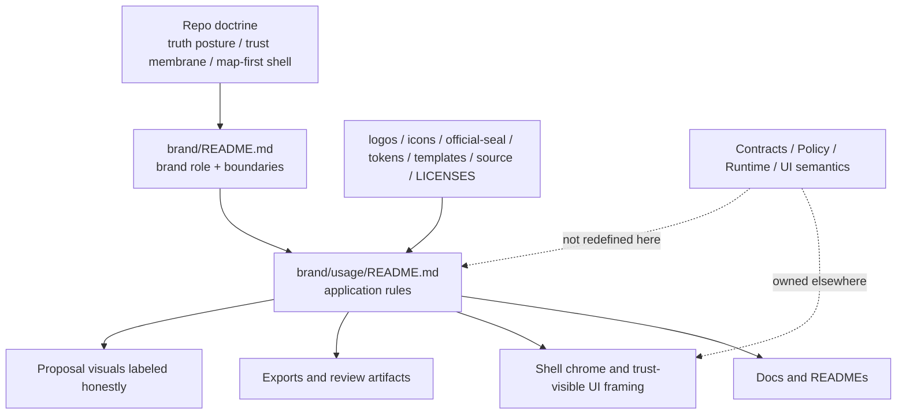

<!-- [KFM_META_BLOCK_V2]
doc_id: kfm://doc/NEEDS-VERIFICATION
title: brand/usage
type: standard
version: v1
status: draft
owners: NEEDS VERIFICATION
created: YYYY-MM-DD
updated: YYYY-MM-DD
policy_label: NEEDS VERIFICATION
related: [../README.md, ../../README.md, ../logos/, ../icons/, ../official-seal/, ../templates/, ../tokens/, ../source/, ../LICENSES/]
tags: [kfm, brand, usage]
notes: [Current main branch shows this file as a placeholder; owners, dates, and policy label still need direct repo verification.]
[/KFM_META_BLOCK_V2] -->

# brand/usage

Application rules for using KFM brand assets across docs, shell chrome, exports, and proposal surfaces without outrunning KFM’s trust-visible doctrine.


| Field | Value |
|---|---|
| Status | `draft` |
| Owners | `NEEDS VERIFICATION` |
| Path | `brand/usage/README.md` |
| Role | Usage rules for applying KFM brand material |
| Upstream | [`../README.md`](../README.md), [`../../README.md`](../../README.md) |
| Adjacent sources | [`../logos/`](../logos/), [`../icons/`](../icons/), [`../official-seal/`](../official-seal/), [`../templates/`](../templates/), [`../tokens/`](../tokens/), [`../source/`](../source/), [`../LICENSES/`](../LICENSES/) |
| Primary caution | Brand may shape presentation, but it must not redefine trust semantics, policy meaning, release authority, or evidence behavior. |

**Quick jumps:** [Scope](#scope) · [Repo fit](#repo-fit) · [Inputs](#inputs) · [Exclusions](#exclusions) · [Directory tree](#directory-tree) · [Quickstart](#quickstart) · [Usage rules](#usage-rules) · [Diagram](#diagram) · [Review matrix](#review-matrix) · [Definition of done](#definition-of-done) · [FAQ](#faq)

> [!IMPORTANT]
> `brand/usage/` is an application layer, not a truth-authority layer. It may govern how KFM visual identity is used, but it must not silently redefine trust chips, `stale-visible`/`generalized`/`withdrawn` meanings, Evidence Drawer contents, Focus outcome logic, or any other contract-owned semantics.

---

## Scope

`brand/usage/` defines **how** approved KFM brand materials are applied.

This directory should answer questions like:

- How should KFM marks, lockups, badges, and supporting visual elements appear in GitHub docs, shell chrome, exports, and review artifacts?
- What presentation moves are acceptable in map-first, time-aware, trust-visible KFM surfaces?
- What must stay outside brand ownership because it belongs to doctrine, policy, contracts, or runtime behavior?
- How should proposal-grade mockups and illustrative examples be labeled so they do not impersonate shipped behavior?

This directory should stay practical, reviewable, and reusable.

## Repo fit

KFM’s current repo doctrine treats the interface as part of the evidence chain, not as decorative chrome. Brand usage therefore belongs inside the same governed documentation space as other trust-bearing guidance. This file is the local application contract for `brand/`. It should remain narrower than [`../README.md`](../README.md), which defines the larger role of the brand layer, and subordinate to repo-wide doctrine in [`../../README.md`](../../README.md).

### Path logic

- **This file** explains brand **application**.
- [`../README.md`](../README.md) explains brand **role and boundaries**.
- `../logos/`, `../icons/`, `../official-seal/`, `../tokens/`, `../templates/`, `../source/`, and `../LICENSES/` hold the reusable materials or their neighboring rules.
- Repo-wide truth posture, trust membrane, and map-first product law belong upstream in the repo root and architecture/governance docs.

## Inputs

Accepted content for this directory includes:

- usage guidance for KFM wordmarks, emblems, lockups, and badge forms
- light/dark placement rules
- spacing, clear-space, and minimum-size rules
- approved doc, shell, export, and review-surface examples
- “do / don’t” application notes
- labeling rules for illustrative or proposal-only visuals
- attribution and reuse notes that affect **application**
- compact matrices that map use cases to approved asset families

## Exclusions

The following do **not** belong here:

| Not here | Put it instead |
|---|---|
| Master logo/icon files | [`../logos/`](../logos/), [`../icons/`](../icons/) |
| Seal-specific authoritative assets or seal policy | [`../official-seal/`](../official-seal/) |
| Source design files | [`../source/`](../source/) |
| Reusable presentation templates | [`../templates/`](../templates/) |
| Token source-of-truth | [`../tokens/`](../tokens/) |
| License texts and reuse instruments | [`../LICENSES/`](../LICENSES/) |
| Runtime semantics for trust states, Evidence Drawer, Focus, release state, or policy outcomes | contracts / policy / app / UI docs upstream |
| One-off marketing comps with no maintenance value | proposal space elsewhere, or exclude |
| Rights-unclear screenshots or third-party brand mashups | exclude until cleared |
| Decorative 3D hero treatment that overrides KFM’s 2D-first operating posture | exclude |

## Directory tree

Current confirmed local shape is minimal.

```text
brand/
├── README.md
├── LICENSES/
├── assets/
├── icons/
├── logos/
├── official-seal/
├── source/
├── templates/
├── tokens/
└── usage/
    └── README.md
```

### Working interpretation

- `brand/usage/` is currently documentation-first.
- It should become the small, stable place for **application guidance** rather than a dumping ground for screenshots or ad hoc visual experiments.
- If concrete examples are later added here, they should be clearly categorized as:
  - `CONFIRMED` shipped pattern
  - `PROPOSED` candidate pattern
  - `ILLUSTRATIVE` teaching example

## Quickstart

### 1) Review the parent brand contract first

```bash
sed -n '1,240p' brand/README.md
```

### 2) Inventory neighboring brand inputs

```bash
find brand -maxdepth 2 -mindepth 1 | sort
```

### 3) Search for trust-state language before editing visual examples

```bash
git grep -nE 'Evidence Drawer|Focus Mode|stale-visible|generalized|withdrawn|superseded|review_required'
```

### 4) Check for placeholders before opening a PR

```bash
grep -RInE 'Placeholder file|NEEDS VERIFICATION|TBD|YYYY-MM-DD' brand docs .github 2>/dev/null || true
```

## Usage rules

### 1. Brand is subordinate to doctrine

Brand can improve recognition, coherence, and readability. It cannot weaken KFM’s inspectability model.

**Allowed**
- consistent lockups
- disciplined badges
- calm shell chrome
- recognizable export framing
- readable map-adjacent headers
- clear proposal labeling

**Not allowed**
- rebranding policy outcomes as softer language
- visually hiding uncertainty, partiality, or withdrawal
- making Focus look sovereign
- making Evidence Drawer feel optional
- using style to blur release status, freshness, or correction state

### 2. Trust-visible states are not “just styling”

When a surface is `generalized`, `partial`, `stale-visible`, `withdrawn`, `denied`, or `abstained`, that meaning is contract-owned. Brand may define presentation rhythm, spacing, icon framing, or contrast treatment, but not the underlying state semantics.

### 3. Keep KFM map-first and time-aware

Usage decisions must reinforce the shell logic already established elsewhere in the repo:

- geography stays central
- time stays visible when historically material
- evidence remains one hop away from consequential claims
- panel treatment supports one shell, not disconnected apps
- comparison and review remain visibly related to the same governed substrate

### 4. Preserve 2D-first operating posture

KFM’s default operating surface is 2D. Brand usage must not drift into “3D-first identity theater.”

**Good**
- restrained terrain or volumetric references where clearly justified
- 2D-first diagrams and lockups
- 3D illustrations labeled as conditional, domain-specific, or proposal-only

**Bad**
- hero art that implies 3D is the default reasoning surface
- cinematic rendering that outruns evidence posture
- using 3D spectacle to replace trust cues

### 5. Label proposal-grade visuals honestly

If a mockup, export, or shell example is not verified as shipped behavior, say so _in place_.

Recommended labels:

- `CONFIRMED`
- `PROPOSED`
- `ILLUSTRATIVE`
- `NEEDS VERIFICATION`

Do not rely on surrounding prose alone. The label should travel with the example.

### 6. Keep non-color-only meaning

Brand usage must support legibility even when color is unavailable, muted, printed, or inaccessible.

Use at least one additional differentiator where trust state matters:

- icon shape
- border style
- label text
- pattern/fill
- grouping
- adjacency
- explicit state wording

### 7. Rights and attribution stay visible

Do not package third-party maps, scans, marks, or screenshots into a “brand example” unless their reuse posture is clear. If a usage example depends on external material, include attribution/reuse notes near the example or link to the governing license location.

## Diagram



## Review matrix

| Use case | Allowed here | Guardrail |
|---|---|---|
| README headers and badge rows | Yes | Keep compact; do not impersonate release authority |
| Doc callouts, diagrams, separators, lockups | Yes | Must preserve repo-native tone and traceability |
| Shell chrome examples | Yes | Must not redefine Evidence Drawer / Focus / review semantics |
| Trust-state chips and labels | Partially | Visual treatment only; meaning remains upstream |
| Export framing and report identity | Yes | Must keep correction/release linkage visible |
| Proposal mockups | Yes | Label clearly as `PROPOSED` or `ILLUSTRATIVE` |
| Third-party mark pairings | Usually no | Require explicit rights/reuse review |
| Runtime/API semantics | No | Keep in contracts / policy / app docs |
| Seal governance rules | No, except pointer | Keep authoritative details with `official-seal/` |

## What goes here vs elsewhere

| Content | Home |
|---|---|
| How to apply a logo on dark backgrounds | `brand/usage/` |
| Which logo files are canonical | `brand/logos/` |
| Whether a seal may appear on public artifacts | `brand/official-seal/` |
| Token names and palette/source values | `brand/tokens/` |
| Template files | `brand/templates/` |
| Source design files | `brand/source/` |
| License text or attribution package | `brand/LICENSES/` |
| Meaning of `stale-visible` | not here |
| Focus `ANSWER / ABSTAIN / DENY / ERROR` semantics | not here |
| Evidence Drawer required fields | not here |

## Definition of done

- [ ] Owners verified from current repo governance
- [ ] Meta block placeholders replaced where evidence exists
- [ ] Parent and child brand docs cross-link cleanly
- [ ] Any concrete example is labeled `CONFIRMED`, `PROPOSED`, or `ILLUSTRATIVE`
- [ ] Usage guidance does not redefine trust-state semantics
- [ ] Non-color-only meaning is preserved where status matters
- [ ] Rights / attribution notes are present where examples depend on external material
- [ ] 2D-first posture is preserved
- [ ] Proposal art does not masquerade as shipped UI
- [ ] Placeholder language removed from this directory

## FAQ

### Why have a separate `brand/usage/` README if `brand/README.md` already exists?

Because the parent file defines **brand boundaries**, while this file should define **brand application**. Keeping them separate helps prevent broad doctrine from being buried under asset-placement details.

### Does this directory define the meaning of trust chips, review states, or Focus outcomes?

No. It may shape their presentation, but not their meaning.

### Can screenshots of future UI concepts live here?

Yes, if they are reusable and clearly labeled. No, if they are rights-unclear, misleading, or effectively one-off marketing mockups.

### Can this directory introduce a new visual language for KFM?

Only inside the existing doctrinal boundaries. New application patterns should clarify KFM, not recharacterize it.

### Can 3D visuals become the main KFM identity surface?

No. KFM’s governing posture is 2D-first unless a specific 3D burden is justified.

## Appendix

<details>
<summary>Open verification items</summary>

| Item | Current status |
|---|---|
| Owners for this directory | `NEEDS VERIFICATION` |
| Created/updated dates for meta block | `NEEDS VERIFICATION` |
| Policy label used for brand docs | `NEEDS VERIFICATION` |
| Whether `brand/assets/` duplicates or complements any `assets/brand/` path elsewhere | `NEEDS VERIFICATION` |
| Whether downstream app surfaces currently consume assets from `brand/` directly | `NEEDS VERIFICATION` |
| Whether example screenshots already exist in a reusable brand path | `UNKNOWN` |

</details>

[Back to top](#brandusage)
