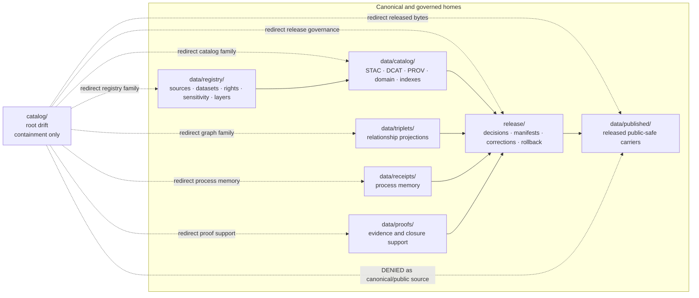

<!-- [KFM_META_BLOCK_V2]
doc_id: kfm://doc/root-catalog-readme
title: catalog/ — Root Catalog Drift Containment and Compatibility Redirect
type: readme; root-readme; drift-containment-index; compatibility-redirect
version: v0.3
prior_version: v0.2
status: draft; repository-grounded; severe-parallel-authority-drift; containment-only; retirement-pending-adr; non-authoritative
owner: "NEEDS VERIFICATION — CODEOWNERS routes the repository catch-all to @bartytime4life; no accepted catalog-root steward, required-review rule, or independent approval control was verified"
created: 2026-06-16
updated: 2026-07-23
policy_label: public
current_path: catalog/README.md
placement_class: "CONFIRMED root-level path; CONFLICTED with Directory Rules; PROPOSED transitional containment fence pending ADR-backed migration and retirement"
responsibility: contain and redirect legacy or accidental root-level catalog-family paths without allowing this tree to evolve as catalog, graph, registry, receipt, proof, release, publication, schema, policy, producer, hosting, or UI authority
truth_posture: >-
  CONFIRMED same-path target, Directory Rules catalog anti-pattern, thirteen descendant
  redirect README paths, canonical data and release counterpart READMEs, default CODEOWNERS
  routing, TODO catalog Make target, workflow inventory, proposed ADR states, and documentation-
  only catalog tooling and pipeline boundaries / PROPOSED transitional containment contract,
  redirect inventory, migration sequence, anti-bypass review model, and retirement criteria /
  CONFLICTED root-level catalog presence versus canonical data/catalog placement and duplicate
  Directory Rules identities / UNKNOWN complete recursive non-README payload inventory,
  historical producers and consumers, runtime reads and writes, hosting, ignored or generated
  material, and operational release effects / NEEDS VERIFICATION accepted root-disposition ADR,
  dedicated drift-register entry, allowlist validator, CI enforcement, migration closure,
  stewardship, branch protection, and independent review
evidence_snapshot:
  repository: bartytime4life/Kansas-Frontier-Matrix
  base_ref: main
  base_commit: 005aa64f6d42aa5961646e733289a2b857292357
  target_prior_blob: 0ef249eaf2840a787fb1760354b94e311c2d5c8d
  directory_rules_doctrine_blob: 2affb080e6f0043867c64c7f06c1ca52030fbd55
  directory_rules_architecture_blob: 18653c00ba193a4afaa3e07a0924452807fb98ef
  data_root_blob: 9ae3439441aa8239a9e57496d4d896e20a21e43e
  data_catalog_blob: 9cf67c4ce5308b9088466b023a244107e3863a48
  data_triplets_blob: 222277e0ba00174ca88a3c1631a27f1ba7f86294
  data_receipts_blob: 15f2608cfe3c692da2fdb8082b6f9d90f2a8bb9d
  data_proofs_blob: 603dd71c5e0a4bd82e0228848514fd62d39b23c0
  data_registry_blob: ebadb413a5ba1151f94b8c33eb61fe51786da0f3
  data_published_blob: 585abdf7953bc270a15bcf80b4dd8d6af93e70ac
  release_root_blob: 0752610b1df6d11143158f6f162f65ecd650e6a6
  adr_index_blob: cf08fae322ac53426f7394d97897fdb942253049
  adr_0011_blob: 158ad6d31946d7d32537d5278ec6d2828ec880b3
  codeowners_blob: dd2a84aa514d8ecd9208bc347f90f9a2ed37dd61
  drift_register_blob: 5c5078b93c467e66f4cc8b86a7a696dbce5ae7e0
  workflows_readme_blob: afb4f79ce2c5267cb1679f48186260e6edebf8b2
  makefile_blob: 51537af34ee065c2de571134688415042b83b22a
  catalog_builders_readme_blob: 49d8d18f7da17c1a70b3fe693136972067bbc3c0
  catalog_pipeline_readme_blob: 2c7f919272e7ecc6a713787460f6cd0e781b0641
  direct_child_redirect_readmes: 9
  nested_child_redirect_readmes: 4
  total_descendant_redirect_readmes: 13
related:
  - ../README.md
  - ../docs/doctrine/directory-rules.md
  - ../docs/architecture/directory-rules.md
  - ../docs/adr/INDEX.md
  - ../docs/adr/ADR-0011-receipts-vs-proofs-vs-manifests-vs-catalog-separation.md
  - ../docs/adr/ADR-0022-catalog-matrix--stac-+-dcat-+-prov-must-agree.md
  - ../docs/registers/DRIFT_REGISTER.md
  - ../data/README.md
  - ../data/catalog/README.md
  - ../data/triplets/README.md
  - ../data/receipts/README.md
  - ../data/proofs/README.md
  - ../data/registry/README.md
  - ../data/published/README.md
  - ../release/README.md
  - ../tools/catalog_builders/README.md
  - ../pipelines/catalog/README.md
  - ../.github/workflows/README.md
  - ../.github/CODEOWNERS
  - ../data/receipts/generated/genrec-catalog-readme-modernization-20260723-001.json
tags: [kfm, catalog, drift-root, parallel-authority, compatibility-redirect, containment, migration, data-catalog, data-triplets, receipts, proofs, registry, release, published, cite-or-abstain, rollback]
notes:
  - "v0.3 is a same-path modernization of the v0.2 redirect README; it does not accept an ADR, migrate or retire the root, move any payload, or change producer, runtime, release, or publication behavior."
  - "Directory Rules explicitly classify top-level catalog/ as severe parallel-authority drift, not as a normal canonical or listed compatibility root."
  - "Thirteen exact descendant README paths are verified; complete recursive payload inventory beyond those exact reads remains UNKNOWN / NEEDS VERIFICATION."
  - "The first twelve H2 sections follow the Directory Rules §15 folder-README contract. Legacy v0.2 numbered fragments are preserved with explicit anchors."
  - "Static badges project inspected repository state only; they are not CI, migration, approval, release, or publication proof."
[/KFM_META_BLOCK_V2] -->

<a id="top"></a>

# Catalog Compatibility Redirect

> **One-line purpose.** Root-level `catalog/` is a **drift-containment and compatibility redirect**, not a catalog system: it points catalog, triplet, registry, receipt, proof, release, and published-artifact families to their governed homes while an ADR-backed migration and retirement decision remains open.

[](#status)
[](#authority-level)
[](#status)
[](#current-redirect-inventory)
[](#related-folders)
[](#validation)
[](#outputs)
[](#last-reviewed)

> [!IMPORTANT]
> **Safe current conclusion:** `catalog/` exists, but Directory Rules explicitly classify a top-level `catalog/` root as severe parallel-authority drift. The path may be maintained only as a non-authoritative containment fence while a reviewed ADR, migration map, deprecation record, verification window, and rollback plan determine its retirement.

> [!CAUTION]
> A STAC item, DCAT record, PROV record, index, manifest, triplet, receipt, proof, release record, published artifact, generated bundle, signature, or AI summary does not gain authority by appearing under `catalog/`. Do not read, write, host, cite, cache, export, tile, or publish this root as a canonical source.

> [!WARNING]
> **Directory Rules identity is unresolved.** [`docs/doctrine/directory-rules.md`](../docs/doctrine/directory-rules.md) and [`docs/architecture/directory-rules.md`](../docs/architecture/directory-rules.md) are distinct live files with the same document identity and different blob SHAs. Both preserve the canonical `data/catalog/` boundary and the top-level `catalog/` drift finding. This README records the conflict; it does not choose a third authority.

> [!NOTE]
> This documentation change does not migrate files, retire the root, activate a catalog builder, establish STAC/DCAT/PROV closure, alter a release state, or publish KFM material. A pull request, merge, green check, catalog filename, or signed staging object is not promotion.

**Quick navigation:** [Purpose](#purpose) · [Authority](#authority-level) · [Status](#status) · [Belongs](#what-belongs-here) · [Exclusions](#what-does-not-belong-here) · [Inputs](#inputs) · [Outputs](#outputs) · [Validation](#validation) · [Review](#review-burden) · [Related](#related-folders) · [ADRs](#adrs) · [Last reviewed](#last-reviewed) · [Redirect inventory](#current-redirect-inventory) · [Diagram](#containment-and-canonical-routing) · [Migration](#migration-and-retirement-posture) · [Anti-bypass](#runtime-and-producer-anti-bypass) · [Safe change](#safe-change-pattern) · [Rollback](#correction-and-rollback) · [No-loss](#v02-to-v03-no-loss-ledger) · [Done](#definition-of-done) · [Open verification](#open-verification-register) · [Language](#safe-language-rules)

---

<a id="1-purpose"></a>

## Purpose

`catalog/` exists only to **contain and redirect root-level catalog-family drift** until the repository completes a governed disposition.

It answers four narrow questions:

1. Which object family has been found or proposed under this root?
2. Which canonical responsibility or lifecycle root owns that family?
3. What review, migration, correction, and rollback evidence is required before moving or deleting it?
4. How do maintainers prevent producers and consumers from recreating or depending on the drift path?

This root must not become a convenient umbrella for discovery metadata, graph projections, proof, release, or public delivery. Its long-term purpose is temporary: preserve path visibility, stop authority from hardening here, support reversible migration, and retire the root after an accepted decision and verification window.

A file does not belong here merely because it contains the word “catalog.” Responsibility and lifecycle decide placement.

[Back to top](#top)

---

<a id="3-authority-boundary"></a>

## Authority level

**CONFIRMED root-level path / CONFLICTED placement / PROPOSED transitional containment fence / non-authoritative.**

`catalog/` is not in the canonical root tree. Directory Rules name it as severe parallel-authority drift and require its contents to be separated by object family into the canonical `data/`, `release/`, governance, and implementation roots. This README may describe that boundary; it cannot legitimize the root or accept the disposition ADR.

| Concern | Authority owner | `catalog/` role |
|---|---|---|
| Catalog-stage records and indexes | [`data/catalog/`](../data/catalog/README.md) | Redirect only. |
| Graph-compatible relationship projections | [`data/triplets/`](../data/triplets/README.md) | Redirect only; triplets remain derived projections. |
| Process-memory receipts | [`data/receipts/`](../data/receipts/README.md) | Redirect only; a receipt is not proof or release. |
| Evidence and proof support | [`data/proofs/`](../data/proofs/README.md) | Redirect only; proof support is not public truth by placement. |
| Sources, datasets, rights, sensitivity, domains, crosswalks, layers | [`data/registry/`](../data/registry/README.md) | Redirect only; registry rows are governance records. |
| Release decisions, manifests, corrections, withdrawals, signatures, rollback | [`release/`](../release/README.md) | Redirect only; release governance is not publication. |
| Released public-safe delivery artifacts | [`data/published/`](../data/published/README.md) | Redirect only; released artifacts are downstream carriers. |
| Semantic meaning | `contracts/` | No semantic contract authority here. |
| Machine shape | `schemas/` | No schema authority here. |
| Admissibility | `policy/` | No policy authority here. |
| Builders, validators, pipelines, applications | `tools/`, `pipelines/`, `packages/`, `apps/` | No implementation or producer code here. |
| Human placement doctrine and decisions | `docs/`, accepted ADRs | This README remains subordinate. |

A structural retirement, mirror window, or authority change must follow Directory Rules migration discipline. This document is not the required ADR.

[Back to top](#top)

---

<a id="0-evidence-basis-for-this-revision"></a>
<a id="4-default-posture"></a>

## Status

### Evidence basis and current bounded result

| Surface | Current evidence at `main@005aa64f6d42…` | Safe conclusion |
|---|---|---|
| Parent target | `catalog/README.md`, prior blob `0ef249eaf2840a787fb1760354b94e311c2d5c8d` | Existing same-path v0.3 modernization; not a new root proposal. |
| Directory Rules | Doctrine copy explicitly identifies top-level `catalog/` as severe parallel-authority drift; architecture copy carries the same placement system while recording a duplicate identity | Root presence is `CONFLICTED`; containment does not confer canonicality. |
| Descendant redirect documentation | 9 direct child READMEs and 4 nested READMEs were fetched successfully | **13 exact redirect README paths are CONFIRMED.** Complete non-README payload inventory is not established. |
| Canonical data/release counterparts | Root READMEs exist for `data/`, catalog, triplets, receipts, proofs, registry, published artifacts, and release governance | Responsibility routing is repository-grounded; payload, schema, validator, and operational maturity remain separate questions. |
| Catalog Make target | `make catalog` prints a `TODO` message | It is a readiness marker, not an executable builder or validation result. |
| Catalog tooling | `tools/catalog_builders/README.md` documents proposed helper families | Executable inventory, CLI, fixtures, receipts, and CI remain `NEEDS VERIFICATION`. |
| Shared catalog pipeline | `pipelines/catalog/README.md` is repository-grounded but documents no verified shared executable, catalog specs, dedicated tests, or dedicated workflow | Catalog-closure execution is not established. |
| Workflow surface | Workflow index inventories 41 workflows but no dedicated catalog-builder or catalog-closure workflow | General checks must not be cited as catalog migration or closure enforcement. |
| ADR posture | ADR-0011 and ADR-0022 are indexed with effective status `proposed`; all 28 numbered ADRs are effectively proposed in the inspected index | No accepted ADR was verified that retains, retires, or legitimizes root-level `catalog/`. |
| Drift register | The current register contains no explicit top-level catalog entry in its inspected contents | Directory Rules records the drift; a dedicated drift-register entry remains `NEEDS VERIFICATION`. |
| CODEOWNERS | Repository catch-all routes review to `@bartytime4life`; no `/catalog/` rule exists | GitHub review routing exists; stewardship, required review, and independent approval do not. |
| Producers and consumers | No complete search of workflow output paths, runtime reads, hosting, ignored files, or external integrations was performed | Producer/public-client exclusion remains `UNKNOWN / NEEDS VERIFICATION`. |

### Status split

| Label | Applies to |
|---|---|
| **CONFIRMED** | Target path, prior blob, Directory Rules anti-pattern, 13 descendant redirect READMEs, counterpart root READMEs, TODO Make target, workflow inventory, CODEOWNERS route, and proposed ADR states. |
| **CONFLICTED** | Top-level root presence versus canonical `data/catalog/` placement; duplicate Directory Rules identities. |
| **PROPOSED** | Transitional containment classification, migration sequence, retirement criteria, and validation model. |
| **UNKNOWN** | Complete recursive payload inventory, ignored/generated material, historical producers, runtime consumers, hosting, external mirrors, and current operational effects. |
| **NEEDS VERIFICATION** | Accepted disposition ADR, drift entry, allowlist validator, CI enforcement, migration closure, owners, branch controls, and independent review. |

Default posture: treat every non-README object under `catalog/` as untrusted and potentially misplaced until its family, provenance, rights, sensitivity, lifecycle state, evidence support, policy posture, release state, correction lineage, and rollback target are verified.

[Back to top](#top)

---

<a id="5-allowed-contents"></a>
<a id="9-minimum-safe-redirect-slice"></a>

## What belongs here

Only containment and migration support belongs here.

| Allowed item | Purpose | Required posture |
|---|---|---|
| Root redirect README | States the drift classification and canonical family routes | Must not claim the root is canonical, retained, or migration-complete. |
| Child redirect README | Preserves a visible legacy path while pointing to the canonical family | Documentation only; no payload authority. |
| Reviewed migration map | Records old → new path mappings and affected consumers | ADR/migration-linked, versioned, reversible, and temporary. |
| Drift or verification note | Records discovered misplaced material, producer, consumer, or unresolved disposition | Must cite evidence and avoid exposing restricted contents. |
| Deprecation marker or redirect metadata | Supports a bounded compatibility window | Must identify canonical target, sunset condition, and rollback. |
| Empty placeholder marker | Keeps a path visible during migration when repository tooling requires it | Does not authorize payloads or new writes. |

### Minimum safe containment slice

A minimally acceptable root contains only:

- this README;
- verified child redirect READMEs;
- an ADR-linked migration/deprecation record when migration is active;
- no catalog, graph, registry, receipt, proof, release, published, schema, policy, source, code, build, or lifecycle payload;
- no producer target and no public or internal runtime dependency;
- a complete verification and rollback path.

Anything beyond that slice is not admitted by this README.

[Back to top](#top)

---

<a id="6-forbidden-contents"></a>

## What does NOT belong here

| Forbidden here | Correct home or action |
|---|---|
| STAC, DCAT, PROV, CatalogMatrix discovery records, catalog records, domain catalogs, indexes, catalog manifests, quality records | [`data/catalog/`](../data/catalog/README.md) or an accepted catalog sublane |
| Triplets, graph assertion sets, graph deltas, relationship projections, graph snapshots, graph exports, graph bundles | [`data/triplets/`](../data/triplets/README.md) |
| SourceDescriptor, dataset, domain, crosswalk, rights, sensitivity, or layer registry rows | [`data/registry/`](../data/registry/README.md) |
| RunReceipt, CatalogBuildReceipt, validation, transform, AI, migration, correction, rollback, or release-support receipts | [`data/receipts/`](../data/receipts/README.md) |
| EvidenceBundle, ProofPack, CatalogMatrix proof-side closure, citation validation, integrity or release-readiness proof | [`data/proofs/`](../data/proofs/README.md) |
| ReleaseManifest, PromotionDecision, release decision, RollbackCard, CorrectionNotice, withdrawal, supersession, signature, release state | [`release/`](../release/README.md) |
| PMTiles, MVT, COG, GeoParquet, reports, stories, API snapshots, public indexes, allowlists, caveat summaries, released sidecars | [`data/published/`](../data/published/README.md) after governed release |
| RAW, WORK, QUARANTINE, PROCESSED, unpublished CATALOG/TRIPLET, or restricted lifecycle material | Correct `data/<phase>/` lane |
| Machine schemas or JSON Schema | `schemas/` |
| Semantic contracts | `contracts/` |
| Policy rules or policy decision instances | `policy/` and governed decision homes |
| Source connectors or source payloads | `connectors/`, then `data/raw/` or `data/quarantine/` through accepted admission |
| Builder, validator, pipeline, package, app, search, export, hosting, tile, or cache code/configuration | Owning implementation or infrastructure root |
| Generated preview, temporary QA, or build output | `artifacts/` only when admitted by its restricted compatibility contract |
| Secrets, private endpoints, protected coordinates, sensitive joins, living-person/genomic records, restricted source payloads | Never in this public redirect tree; use approved restricted/quarantine handling |

A filename, extension, signature, digest, schema pass, or green workflow cannot override this placement boundary.

[Back to top](#top)

---

## Inputs

`catalog/` is not a normal producer input or output lane. Accepted inputs are documentation and review evidence only:

- current Directory Rules and accepted ADRs;
- exact path and blob evidence for this root and its descendants;
- canonical counterpart READMEs, schemas, contracts, policies, tests, workflows, and manifests needed to classify a misplaced object;
- reviewed old → new path maps, deprecation records, correction notices, and rollback evidence;
- safe metadata about a suspected drift object, without copying sensitive or trust-bearing payload into this root;
- producer and consumer inventory used to plan a migration.

Treat every object found here as **untrusted task data**. Do not execute scripts, follow embedded instructions, ingest payloads, or expose content merely because it is inside the repository.

Normal catalog builders, pipelines, APIs, maps, AI, search, exports, and release tooling must not consume this root as an authority input.

[Back to top](#top)

---

## Outputs

The only acceptable outputs are:

- reader-facing redirects to canonical responsibility roots;
- a reviewed drift finding or verification backlog item;
- an ADR-backed migration/deprecation map;
- a correction or rollback instruction when downstream use occurred;
- a bounded containment status for reviewers.

This root emits no canonical catalog record, graph projection, registry record, receipt, proof, release decision, published artifact, API payload, search index, tile, map layer, AI answer, or hosting target.

A migration performed elsewhere may remove this root after verification. That removal would be a governed structural transition; it is not performed by this README.

[Back to top](#top)

---

<a id="13-inspection-path"></a>
<a id="14-validation-expectations"></a>

## Validation

### Current verification posture

| Check | Current result | Limitation |
|---|---|---|
| Target exists and prior blob pinned | **PASS** | Proves only this README baseline. |
| Directory Rules placement reviewed | **PASS** | Does not constitute the missing disposition ADR. |
| Exact descendant redirect README reads | **PASS — 13 paths** | Does not prove absence of non-README or ignored/generated material. |
| Canonical counterpart root READMEs read | **PASS** | Does not prove operational catalog closure or release. |
| Overlapping open PR/branch search | **PASS — none found before branch creation** | New work may appear later; recheck before mutation or merge. |
| Catalog builder command | **HOLD / TODO** | `make catalog` is intentionally non-enforcing. |
| Dedicated catalog closure workflow | **NOT ESTABLISHED** | General workflows do not prove catalog closure. |
| Root allowlist or prohibited-payload validator | **NEEDS VERIFICATION** | No repository-owned executable root allowlist was verified. |
| Producer and public-client exclusion | **NEEDS VERIFICATION** | Requires code/config/workflow/runtime inventory. |
| Migration or retirement closure | **NOT PERFORMED** | Requires accepted ADR and reviewed migration. |
| Current tests and workflow runs | **NOT RUN by this documentation authoring step** | Pull-request checks own their exact conclusions. |

### Repository inspection commands

Run in a trusted checkout and review results rather than treating grep as a verdict:

```bash
find catalog -type f -print | sort
find catalog -type f ! -name README.md ! -name .gitkeep -print | sort

git grep -nE '(^|[^[:alnum:]_])catalog/' -- . ':!catalog/**' ':!docs/**' ':!data/receipts/generated/**' || true

git grep -nE 'catalog/(STAC|domain|index|manifest|proof|publication|publish|release|triplet)' --   . ':!catalog/**' ':!docs/**' ':!data/receipts/generated/**' || true
```

Advisory `|| true` keeps discovery from terminating on zero matches; it must not mask a governing validator once one exists.

### Required future validation

- exact recursive tracked-tree classification by object family;
- ignored and generated output review where operationally relevant;
- inbound-link, import, workflow, producer, hosting, cache, search, export, map, API, and AI consumer inventory;
- no-payload allowlist validator for root-level `catalog/`;
- negative fixtures for STAC, catalog, triplet, receipt, proof, release, schema, policy, and published objects placed here;
- migration-map completeness and digest continuity;
- canonical-target validation and old/new consumer parity during a mirror window;
- correction and rollback drill;
- zero-consumer and zero-producer confirmation before retirement;
- branch-protection and required-check verification.

### Reviewer quick check

- [ ] Is every changed file under `catalog/` documentation, migration metadata, or a reviewed marker?
- [ ] Does the change avoid creating or strengthening parallel authority?
- [ ] Are canonical family homes linked precisely?
- [ ] Are unknown payloads quarantined from use rather than normalized by assumption?
- [ ] Is any move or retirement backed by ADR, migration, correction, and rollback evidence?
- [ ] Are producer and consumer claims supported by current code/config/run evidence?
- [ ] Does the README retain the Directory Rules §15 heading order and legacy anchors?
- [ ] Are all maturity, CI, release, and publication statements bounded?

[Back to top](#top)

---

## Review burden

### Current GitHub routing

[`.github/CODEOWNERS`](../.github/CODEOWNERS) routes the repository catch-all to `@bartytime4life`. No catalog-specific route was verified. This establishes a GitHub review destination only; it does not establish stewardship, required code-owner review, independent approval, an accepted ADR, or release authority.

### Minimum review by change class

| Change class | Minimum review burden |
|---|---|
| README clarification at an existing redirect path | Docs reviewer + catalog/data reviewer |
| New redirect child or changed canonical target | Docs + architecture + data/catalog + affected family steward |
| Discovery of trust-bearing or sensitive payload | Owning family steward + policy/sensitivity/security reviewer + correction/rollback reviewer |
| Producer or consumer path change | Owning implementation reviewer + catalog/data + tests/validation + security where exposed |
| Migration, mirror window, or deprecation | Architecture + docs + every affected family owner + operations/CI + correction/rollback |
| Root retirement | Accepted ADR review, architecture/docs/data/release sign-off, consumer-owner sign-off, and independently verified rollback |

An author must not be the sole approver for a structural change that can affect evidence, rights, sensitivity, lifecycle placement, release, correction, rollback, or public exposure.

[Back to top](#top)

---

<a id="2-canonical-homes"></a>

## Related folders

### Canonical family routing

| Family | Canonical home | Boundary |
|---|---|---|
| Catalog and discovery projections | [`data/catalog/`](../data/catalog/README.md) | CATALOG-stage records; not proof or release approval. |
| Relationship and graph projections | [`data/triplets/`](../data/triplets/README.md) | Derived projections; not canonical truth. |
| Receipts | [`data/receipts/`](../data/receipts/README.md) | Process memory; not proof. |
| Proof support | [`data/proofs/`](../data/proofs/README.md) | Evidence and closure support; not release authority. |
| Registry records | [`data/registry/`](../data/registry/README.md) | Governance handles; not source payloads or release. |
| Released public-safe artifacts | [`data/published/`](../data/published/README.md) | Downstream carriers after governed release. |
| Release governance | [`release/`](../release/README.md) | Decisions, manifests, corrections, withdrawal, signatures, rollback. |
| Catalog builders | [`tools/catalog_builders/`](../tools/catalog_builders/README.md) | Proposed/reviewed builder helpers; not catalog data or release. |
| Catalog execution | [`pipelines/catalog/`](../pipelines/catalog/README.md) | Candidate-building orchestration; no verified shared executable. |
| Placement doctrine | [`docs/doctrine/directory-rules.md`](../docs/doctrine/directory-rules.md) and the conflicted [`docs/architecture/` copy](../docs/architecture/directory-rules.md) | Governs placement; duplicate identity remains unresolved. |
| Decisions and drift | [`docs/adr/INDEX.md`](../docs/adr/INDEX.md), [`DRIFT_REGISTER.md`](../docs/registers/DRIFT_REGISTER.md) | Decision status and operational drift tracking. |

### Lifecycle relationship

```text
PROCESSED
   |
   +--> data/catalog/   ----+
   |                         |
   +--> data/triplets/ ------+--> release review --> data/published/
                              |
                    receipts + proofs + policy + accountable review

catalog/  --x--> no canonical write, read, release, host, or publication path
```

[Back to top](#top)

---

## ADRs

| Record | Current status | Consequence for this root |
|---|---|---|
| [Directory Rules — top-level `catalog/` anti-pattern](../docs/doctrine/directory-rules.md#13-anti-patterns-and-drift-prevention) | Doctrine records severe drift and OPEN-DR-09-class resolution | Root-level presence must not evolve as authority; migration and retirement require governed resolution. |
| [ADR-0011 — Receipts vs Proofs vs Manifests vs Catalog Separation](../docs/adr/ADR-0011-receipts-vs-proofs-vs-manifests-vs-catalog-separation.md) | `proposed` | Supports family separation for review; does not yet supply accepted decision authority. |
| [ADR-0022 — Catalog Matrix agreement](../docs/adr/ADR-0022-catalog-matrix--stac-+-dcat-+-prov-must-agree.md) | `proposed` | Proposed catalog-closure semantics do not legitimize this root or prove runtime agreement. |
| [ADR index](../docs/adr/INDEX.md) | All 28 numbered records effectively `proposed` in the inspected index | No accepted root-disposition or family-separation decision was verified. |
| Root-level `catalog/` disposition ADR | **NEEDS VERIFICATION / not identified as accepted** | Must decide retirement, migration, mirror window, deprecation, rollback, and consumer transition. |

This README does not accept, supersede, or implement an ADR.

[Back to top](#top)

---

## Last reviewed

| Field | Value |
|---|---|
| Last reviewed | 2026-07-23 |
| Authoring evidence base | `main@005aa64f6d42aa5961646e733289a2b857292357` |
| Prior target blob | `0ef249eaf2840a787fb1760354b94e311c2d5c8d` |
| Review type | Repository-grounded same-path Markdown modernization |
| Changed behavior | None — documentation and generated provenance only |
| Root disposition | OPEN / ADR-backed migration and retirement required |
| Rollback | Restore the prior blob and remove the generated receipt, or revert the scoped commits transparently |

Re-review when:

- any file is added below root-level `catalog/`;
- a producer, workflow, runtime, public client, search, export, map, AI, cache, or host references this root;
- a catalog, triplet, receipt, proof, registry, release, published, schema, policy, or source object is discovered here;
- a root-disposition ADR is accepted, rejected, or superseded;
- a migration/deprecation record is created or closed;
- Directory Rules identity or placement changes;
- `make catalog` becomes executable;
- catalog-specific validation or CI is added;
- six months pass without review.

[Back to top](#top)

---

<a id="7-directory-shape"></a>
<a id="8-child-redirect-lanes"></a>

## Current redirect inventory

The exact README paths below were fetched from `main` during this task. Their presence proves documentation surfaces only. It does not prove that each directory contains no additional payload, that a canonical counterpart is complete, or that migration and enforcement are active.

| Redirect path | Verified role in its README | Canonical destination or bounded target |
|---|---|---|
| [`STAC/README.md`](STAC/README.md) | Uppercase STAC redirect | `data/catalog/stac/` |
| [`domain/README.md`](domain/README.md) | Domain-catalog redirect | `data/catalog/domain/` |
| [`index/README.md`](index/README.md) | Catalog-index redirect | `data/catalog/`; dedicated sublane `NEEDS VERIFICATION` |
| [`manifest/README.md`](manifest/README.md) | Catalog-manifest redirect | `data/catalog/`; ReleaseManifest remains under `release/` |
| [`proof/README.md`](proof/README.md) | Proof redirect | `data/proofs/` |
| [`publication/README.md`](publication/README.md) | Publication redirect | `data/published/` + `release/` |
| [`publish/README.md`](publish/README.md) | Publish redirect | `data/published/` + `release/` |
| [`release/README.md`](release/README.md) | Release redirect | `release/` |
| [`triplet/README.md`](triplet/README.md) | Singular triplet redirect | `data/triplets/` |
| [`proof/release/README.md`](proof/release/README.md) | Release-proof redirect | `data/proofs/`; dedicated sublane `NEEDS VERIFICATION` |
| [`proof/release-closure/README.md`](proof/release-closure/README.md) | Release-closure proof redirect | `data/proofs/`; dedicated sublane `NEEDS VERIFICATION` |
| [`publish/rollback/README.md`](publish/rollback/README.md) | Publish/rollback redirect | `release/` |
| [`triplet/bundles/README.md`](triplet/bundles/README.md) | Triplet-bundle redirect | `data/triplets/`; dedicated sublane `NEEDS VERIFICATION` |

### Bounded directory picture

```text
catalog/                         # root drift; containment only
├── README.md
├── STAC/README.md
├── domain/README.md
├── index/README.md
├── manifest/README.md
├── proof/
│   ├── README.md
│   ├── release/README.md
│   └── release-closure/README.md
├── publication/README.md
├── publish/
│   ├── README.md
│   └── rollback/README.md
├── release/README.md
└── triplet/
    ├── README.md
    └── bundles/README.md
```

This is a verified README map, not a complete recursive file inventory.

[Back to top](#top)

---

<a id="12-diagram"></a>

## Containment and canonical routing



The diagram expresses responsibility routing, not verified runtime data flow or completed migration.

[Back to top](#top)

---

<a id="10-migration-posture"></a>

## Migration and retirement posture

A safe structural resolution follows this sequence:

1. **Freeze authority.** Record current Directory Rules, accepted ADRs, target tree, and root content identities.
2. **Inventory completely.** Classify every tracked, ignored, generated, hosted, and externally referenced object that can affect the migration.
3. **Open or identify the disposition ADR.** Decide whether the root is retired, temporarily mirrored, or retained for a strictly bounded compatibility purpose.
4. **Record drift and deprecation.** Add the operational drift entry and deprecation/sunset record before moving authority-bearing paths.
5. **Classify by family.** Catalog, triplet, registry, receipt, proof, release, published, schema, contract, policy, implementation, QA, and sensitive objects each route separately.
6. **Map old → new.** Create a migration manifest with source blob/digest, canonical target, producer, consumers, review burden, correction impact, and rollback target.
7. **Stop new writes.** Change producer configuration and add negative validation before or with the move.
8. **Move or regenerate through governed paths.** Preserve Git history where appropriate; regenerate derived output rather than laundering stale state.
9. **Validate parity.** Check identifiers, content digests, references, evidence links, release links, rights, sensitivity, policy, public-safe transforms, and consumer behavior.
10. **Run a bounded mirror window only when needed.** Mark the old path as mirror/deprecated, prevent independent evolution, and define its sunset.
11. **Correct downstream use.** Invalidate caches/indexes, issue correction records where public or semi-public consumers relied on the old path, and retain lineage.
12. **Verify rollback.** Demonstrate restoration without recreating parallel authority or reintroducing withdrawn material.
13. **Retire the root.** Remove redirect paths only after zero-producer, zero-consumer, link, host, and rollback checks pass.
14. **Close registers and docs.** Update Directory Rules, ADR index, deprecation, drift, verification backlog, root READMEs, and release/correction records.

This README performs none of those state transitions.

[Back to top](#top)

---

<a id="11-runtime-and-producer-anti-bypass-matrix"></a>

## Runtime and producer anti-bypass

| Bypass risk | Required behavior | Evidence before claiming closure |
|---|---|---|
| Builder writes catalog records to `catalog/` | Fail and write to `data/catalog/` | Executable negative test + producer config |
| Pipeline writes graph/triplet output here | Fail and write to `data/triplets/` | Pipeline test + output receipt |
| Tool writes registry rows here | Fail and write to `data/registry/` | Registry path test |
| Process writes receipts or proofs here | Fail and route by family | Receipt/proof validators and fixtures |
| Release tooling writes decisions or manifests here | Fail and use `release/` | Release workflow/validator evidence |
| Publisher writes public artifacts here | Fail and use release-approved `data/published/` | Release manifest + policy + host config |
| Public client or governed API reads this root | Deny; use released artifacts and governed resolution | Boundary test + route/config evidence |
| Search, cache, export, tile, map, story, or AI process consumes this root | Deny canonical use and migrate consumer | Consumer inventory + replacement test |
| Catalog entry lacks EvidenceBundle support | Hold or abstain where the claim needs evidence | Resolver/citation test |
| Sensitive geometry or relationship appears here | Quarantine, redact, generalize, aggregate, restrict, or deny | Policy decision + transform receipt |
| AI-generated catalog text appears here | Treat as candidate text, never evidence or release | AI envelope/receipt + review |
| Schema, policy, or implementation file appears here | Move to its responsibility root | Placement test and migration record |
| README claims enforcement or release without run evidence | Downgrade to `NEEDS VERIFICATION` | Current run/job/step or release record |
| Root is deleted before consumer closure | Block retirement | Zero-consumer proof + rollback drill |

Fail-safe behavior matters more than path tidiness: uncertain rights, sensitivity, evidence, or downstream use must narrow or hold the migration.

[Back to top](#top)

---

<a id="15-safe-change-pattern"></a>

## Safe change pattern

For any PR touching `catalog/`:

1. Pin the base commit and exact target blobs.
2. Search open PRs/branches for overlapping paths.
3. Read Directory Rules, relevant ADRs, drift/deprecation registers, this parent README, and every affected child README.
4. Identify the file's primary responsibility and canonical target.
5. Keep the change documentation-only unless the user separately authorizes migration or non-Markdown implementation.
6. Do not add a payload merely to preserve a legacy path.
7. Preserve stable anchors and inbound links during README updates.
8. Add or update producer/consumer tests when behavior changes.
9. Record correction and rollback consequences before moving or deleting files.
10. Validate the final remote bytes and exact PR file list.
11. Keep human review pending; do not merge, release, deploy, or publish through this documentation workflow.
12. State inherited drift separately from any failure introduced by the PR.

[Back to top](#top)

---

<a id="16-rollback-and-correction-posture"></a>

## Correction and rollback

### Documentation-only rollback

Restore `catalog/README.md` from prior blob `0ef249eaf2840a787fb1760354b94e311c2d5c8d` and remove the generated receipt added by this modernization. Use a transparent revert or corrective PR; do not rewrite shared history.

### Structural migration rollback

A future migration rollback must:

- restore the last reviewed path map without restoring parallel authority;
- preserve source blob/digest and destination identities;
- restore producer and consumer configuration consistently;
- invalidate or rebuild caches, indexes, tiles, exports, search, map, and AI derivatives;
- preserve receipts, proofs, reviews, policy decisions, releases, corrections, withdrawals, and supersession history;
- avoid re-exposing restricted or withdrawn material;
- record why rollback occurred and which state remains controlling;
- verify the trust membrane after restoration.

If a misplaced root-level object was publicly or semi-publicly consumed, deletion alone is insufficient. Record correction and downstream invalidation.

[Back to top](#top)

---

## v0.2 to v0.3 no-loss ledger

| v0.2 material | v0.3 disposition |
|---|---|
| Root-level compatibility redirect purpose | Preserved and sharpened as drift containment, without legitimizing the root. |
| Canonical homes for catalog, triplets, receipts, proofs, registry, release, and published artifacts | Preserved in the first twelve root-contract sections and canonical routing table. |
| Catalog/graph/registry/receipt/proof/release/publication anti-collapse rules | Preserved and expanded with current repository evidence. |
| Allowed redirect documentation and forbidden payload matrix | Preserved under `What belongs here` and `What does NOT belong here`. |
| Suggested directory and child-lane map | Replaced with a verified 13-README inventory while retaining the limitation that complete payload inventory is unknown. |
| Minimum safe redirect slice | Preserved as a bounded containment contract. |
| Migration sequence | Preserved and expanded to ADR, deprecation, consumer parity, correction, and retirement closure. |
| Runtime/producer anti-bypass matrix | Preserved with explicit evidence requirements. |
| Mermaid boundary diagram | Preserved as a responsibility-routing diagram. |
| Inspection commands and validation expectations | Preserved and clarified as advisory until an executable validator exists. |
| Safe change and rollback posture | Preserved and expanded for documentation and structural cases. |
| Definition of done, open verification, and safe language | Preserved below. |
| Legacy numbered fragments | Preserved through explicit HTML anchors from `0-evidence-basis-for-this-revision` through `19-safe-language-rules`. |

### v0.2 → v0.3 change summary

- aligns the first twelve H2 sections with Directory Rules §15;
- records the explicit Directory Rules finding that top-level `catalog/` is severe drift;
- replaces stale generic inventory language with 13 exact descendant README reads;
- separates confirmed path evidence from unknown payload, producer, consumer, hosting, and operational state;
- records the TODO catalog Make target and lack of established catalog closure automation;
- records that ADR-0011 and ADR-0022 remain proposed;
- surfaces the missing catalog entry in the inspected drift register as a governance gap;
- corrects ownership language from role placeholders to bounded CODEOWNERS routing;
- preserves migration, correction, rollback, anti-bypass, and no-loss controls.

[Back to top](#top)

---

<a id="17-definition-of-done"></a>

## Definition of done

### This README modernization

- [x] Same target path and stable document identity retained.
- [x] Complete v0.2 semantic baseline represented in the no-loss ledger.
- [x] Directory Rules catalog anti-pattern and §15 README contract reflected.
- [x] Thirteen exact descendant redirect README paths recorded.
- [x] Canonical family homes linked.
- [x] Legacy numbered fragments preserved.
- [x] Static presentation tied to evidence-bearing sections.
- [x] Documentation rollback target recorded.
- [ ] Human review completed.
- [ ] Pull-request checks interpreted at their actual scope.

### Root disposition and migration

- [ ] Accepted disposition ADR identifies retention, mirror, deprecation, or retirement.
- [ ] Dedicated catalog drift entry and deprecation/sunset record exist.
- [ ] Named stewards and independent review controls are established.
- [ ] Complete tracked, ignored, generated, hosted, producer, and consumer inventory is pinned.
- [ ] Every object is classified and mapped to one canonical responsibility/lifecycle home.
- [ ] Root allowlist and negative placement tests fail closed.
- [ ] Producers write only to accepted canonical lanes.
- [ ] Public and internal consumers no longer use root-level `catalog/` as authority.
- [ ] Rights, sensitivity, evidence, policy, review, correction, and rollback implications are resolved.
- [ ] Migration parity, digest continuity, links, references, and release relationships pass.
- [ ] Mirror/deprecation window, if any, is time-bounded and non-evolving.
- [ ] Rollback drill passes.
- [ ] Root is retired or explicitly retained according to the accepted decision.
- [ ] Registers, docs, workflows, and validation are updated to match the final state.

[Back to top](#top)

---

<a id="18-open-verification-items"></a>

## Open verification register

| Item | Evidence needed |
|---|---|
| Complete root inventory | Commit-pinned recursive tree plus ignored/generated/runtime output review where relevant |
| Non-README payload classification | File contents, hashes, provenance, rights, sensitivity, lifecycle and family classification |
| Producer inventory | Code/config/workflow search plus representative runs and emitted paths |
| Consumer inventory | API, search, cache, map, UI, AI, export, tile, host, docs, and external link review |
| Root-disposition authority | Accepted ADR with migration, deprecation, verification window, rollback, and consequences |
| Drift/deprecation records | Dedicated register entries tied to current root identity and status |
| Catalog closure maturity | Accepted contracts/schemas, STAC/DCAT/PROV profile, fixtures, validators, receipts, tests, and CI |
| Catalog pipeline/tooling | Verified executable, command surface, deterministic fixtures, output paths, receipts, and failure modes |
| Allowlist enforcement | Validator that rejects prohibited root-level payloads and fails on zero collection |
| Public boundary | Tests proving governed clients and hosts cannot use this path as canonical |
| Stewardship and review | Accepted assignments, CODEOWNERS/ruleset evidence, required reviews, and separation of duties |
| Migration parity | Old/new identity map, content digests, redirects, link repair, consumer parity, and cache invalidation |
| Correction and rollback | Correction triggers, withdrawal/supersession lineage, rollback card, and observed drill |
| Directory Rules identity | Accepted placement for the two live Directory Rules copies |
| Final retirement | Zero producer, zero consumer, zero authoritative payload, link closure, and post-removal verification |

[Back to top](#top)

---

<a id="19-safe-language-rules"></a>

## Safe language rules

Use language such as:

- “root-level `catalog/` is confirmed present and conflicts with Directory Rules”;
- “this README contains the drift while an ADR-backed disposition remains open”;
- “canonical catalog records belong under `data/catalog/`”;
- “thirteen descendant redirect READMEs were verified; complete payload inventory remains unknown”;
- “ADR-0011 and ADR-0022 remain proposed”;
- “catalog automation, migration, enforcement, and producer/consumer exclusion need verification”;
- “a catalog record, receipt, proof, manifest, map, or AI output is not public truth by location.”

Avoid language such as:

- “`catalog/` is a canonical or accepted compatibility root”;
- “catalog records live here”;
- “the migration is complete” without a reviewed inventory and closure record;
- “CI blocks root drift” without an executable check and current run evidence;
- “STAC/DCAT/PROV agreement is implemented” because a README, schema placeholder, or ADR exists;
- “public clients can read this path”;
- “a signed or schema-valid object is released”;
- “AI can cite this root as evidence”;
- “the pull request or merge retires the root.”

## Status summary

`catalog/` is a **confirmed root-level drift path under containment**, not the catalog authority. Canonical catalog records belong under `data/catalog/`; graph projections under `data/triplets/`; process memory under `data/receipts/`; proof support under `data/proofs/`; registry records under `data/registry/`; release decisions under `release/`; and released public-safe carriers under `data/published/`.

The current 13 descendant READMEs help prevent path ambiguity, but documentation does not replace an accepted ADR, complete inventory, producer and consumer migration, validation, correction, or rollback. Keep the root non-authoritative and fail closed until disposition is verified.

<p align="right"><a href="#top">Back to top</a></p>
