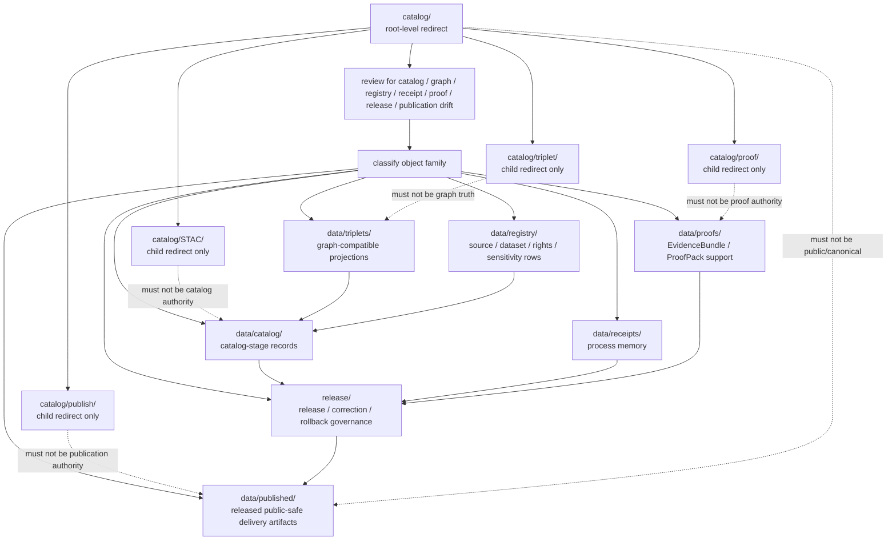

<!-- [KFM_META_BLOCK_V2]
doc_id: kfm://doc/root-catalog-readme
title: catalog/ — Catalog Compatibility Redirect
type: readme
version: v0.2
status: draft
owners: OWNER_TBD — Catalog steward · Data steward · Source steward · Registry steward · Receipt steward · Proof steward · Release steward · Publication steward · Graph steward · Policy steward · Schema steward · Docs steward
created: 2026-06-16
updated: 2026-07-10
policy_label: public
related:
  - ../data/README.md
  - ../data/catalog/README.md
  - ../data/triplets/README.md
  - ../data/receipts/README.md
  - ../data/proofs/README.md
  - ../data/published/README.md
  - ../data/registry/README.md
  - ../release/README.md
  - STAC/README.md
  - index/README.md
  - manifest/README.md
  - proof/README.md
  - proof/release/README.md
  - proof/release-closure/README.md
  - publication/README.md
  - publish/README.md
  - publish/rollback/README.md
  - release/README.md
  - triplet/README.md
  - triplet/bundles/README.md
  - ../schemas/contracts/v1/
  - ../contracts/
  - ../policy/
  - ../docs/adr/ADR-0011-receipts-vs-proofs-vs-manifests-vs-catalog-separation.md
  - ../docs/doctrine/directory-rules.md
tags: [kfm, catalog, compatibility-root, redirect, drift-fence, data-catalog, data-triplets, data-receipts, data-proofs, data-published, release-plane, registry, stac, dcat, prov, receipt-proof-catalog-publication-separation, non-authoritative, no-public-use]
notes:
  - "Refreshes the root-level catalog/ compatibility-redirect fence."
  - "Root-level catalog/ is compatibility and drift-control documentation only, not canonical catalog authority, STAC authority, manifest authority, index authority, triplet authority, proof authority, receipt authority, release authority, publication authority, registry authority, schema authority, policy authority, producer authority, hosting authority, or UI authority."
  - "Canonical catalog-stage records belong under data/catalog/; graph-compatible relationship projections belong under data/triplets/; receipts belong under data/receipts/; proof support belongs under data/proofs/; source/rights/sensitivity registry rows belong under data/registry/; release-governance records belong under release/; published delivery artifacts belong under data/published/ after governed release."
  - "Root-level catalog child directories are compatibility redirects and drift-control fences unless an accepted ADR or migration note says otherwise."
  - "Child README refreshes may exist in separate draft PRs; do not treat branch state as merged main state until verified on the target ref."
  - "ADR-0011 is proposed and is used here only as separation evidence, not accepted-rule proof."
  - "Do not add catalog records, STAC/DCAT/PROV records, manifests, indexes, triplet payloads, proofs, receipts, release records, rollback records, publication artifacts, source registry rows, schemas, policy rules, generated outputs, public artifacts, or producer targets here without an ADR/migration note."
  - "Actual current contents beyond README files, historical producers, workflow writes, migration status, CI/review enforcement, public-client/producer exclusion, hosting readiness, catalog schema maturity, STAC/profile maturity, release workflow maturity, and ADR disposition remain NEEDS VERIFICATION."
  - "v0.2 adds current evidence basis, Directory Rules placement basis, child redirect family map, canonical data/catalog alignment, related-family separation, minimum safe redirect slice, anti-bypass matrix, migration/rollback posture, and safe language rules without claiming migration or enforcement maturity."
[/KFM_META_BLOCK_V2] -->

<a id="top"></a>

<div align="center">

# Catalog Compatibility Redirect

`catalog/`

**Root-level compatibility and drift-control fence for legacy or accidental catalog-family placement. Canonical catalog records belong under `data/catalog/`; related triplet, receipt, proof, registry, release, and published artifact families stay in their own roots.**


[Evidence](#0-evidence-basis-for-this-revision) · [Purpose](#1-purpose) · [Canonical homes](#2-canonical-homes) · [Boundary](#3-authority-boundary) · [Child lanes](#8-child-redirect-lanes) · [Migration](#10-migration-posture) · [Definition of done](#17-definition-of-done)

</div>

---

> [!IMPORTANT]
> **Status:** draft / `NEEDS VERIFICATION`  
> **Path:** `catalog/README.md`  
> **Responsibility root:** compatibility redirect / drift fence only  
> **Canonical catalog home:** `data/catalog/`  
> **Triplet home:** `data/triplets/`  
> **Receipt home:** `data/receipts/`  
> **Proof home:** `data/proofs/`  
> **Registry home:** `data/registry/`  
> **Release-governance home:** `release/`  
> **Published artifact home:** `data/published/`  
> **Directory Rules basis:** file location encodes ownership, governance, and lifecycle. Root-level `catalog/` is a compatibility redirect only and must not become a parallel catalog, STAC, manifest, index, triplet, proof, receipt, release, publication, registry, schema, policy, source, pipeline, package, tool, search, hosting, or UI authority.  
> **Truth posture:** CONFIRMED current GitHub README path / CONFIRMED `data/README.md` defines `data/` as canonical lifecycle root and names catalog, triplets, receipts, proofs, published, registry, and rollback families / CONFIRMED `data/catalog/README.md` exists and treats `data/catalog/` as catalog-stage lifecycle lane / CONFIRMED `data/triplets/README.md` exists and treats `data/triplets/` as graph-compatible relationship projection lane / CONFIRMED `data/receipts/README.md` exists and marks receipts as process memory / CONFIRMED `data/proofs/README.md` exists and treats proof artifacts as support objects, not public truth by placement / CONFIRMED `data/published/README.md` exists and treats published artifacts as downstream delivery carriers / CONFIRMED `data/registry/README.md` exists and treats registry rows as source/rights/sensitivity-aware internal governance records / CONFIRMED `release/README.md` exists and treats `release/` as release-governance root / CONFIRMED Directory Rules document exists / PROPOSED root-level `catalog/` redirect contract / UNKNOWN actual files beyond README files, historical producers, workflow writes, migration status, schema/profile maturity, CI/review guard, public-client/producer exclusion, hosting readiness, and ADR disposition

> [!CAUTION]
> Do not make `catalog/` a parallel catalog authority. KFM catalog records belong under `data/catalog/`; graph-compatible triplets belong under `data/triplets/`; receipts, proofs, registry rows, release records, published artifacts, schemas, contracts, policies, source code, generated previews, and unpublished lifecycle data stay in their own owning roots.

---

## Quick jump

- [0. Evidence basis for this revision](#0-evidence-basis-for-this-revision)
- [1. Purpose](#1-purpose)
- [2. Canonical homes](#2-canonical-homes)
- [3. Authority boundary](#3-authority-boundary)
- [4. Default posture](#4-default-posture)
- [5. Allowed contents](#5-allowed-contents)
- [6. Forbidden contents](#6-forbidden-contents)
- [7. Directory shape](#7-directory-shape)
- [8. Child redirect lanes](#8-child-redirect-lanes)
- [9. Minimum safe redirect slice](#9-minimum-safe-redirect-slice)
- [10. Migration posture](#10-migration-posture)
- [11. Runtime and producer anti-bypass matrix](#11-runtime-and-producer-anti-bypass-matrix)
- [12. Diagram](#12-diagram)
- [13. Inspection path](#13-inspection-path)
- [14. Validation expectations](#14-validation-expectations)
- [15. Safe change pattern](#15-safe-change-pattern)
- [16. Rollback and correction posture](#16-rollback-and-correction-posture)
- [17. Definition of done](#17-definition-of-done)
- [18. Open verification items](#18-open-verification-items)
- [19. Safe language rules](#19-safe-language-rules)

---

## 0. Evidence basis for this revision

This README is a documentation boundary, not migration proof, catalog-schema proof, STAC-profile proof, release approval proof, publication-hosting proof, or CI enforcement proof. The 2026-07-10 revision updates an existing compatibility README and keeps maturity bounded while aligning root-level `catalog/` with the canonical `data/catalog/` catalog-stage lane, the `data/triplets/` graph projection lane, the `data/receipts/` process-memory root, the `data/proofs/` proof-support root, the `data/registry/` registry root, the `release/` release-governance root, the `data/published/` published-artifact lane, and Directory Rules placement posture.

| Evidence item | Status | What it supports | What it does not prove |
|---|---|---|---|
| `catalog/README.md` exists on `main`. | CONFIRMED | This is an existing README update, not a new path proposal. | It does not prove actual contents beyond README files, historical producers, migration status, CI enforcement, public-client exclusion, hosting readiness, or ADR disposition. |
| `data/README.md` exists and treats `data/` as the canonical lifecycle root for catalog, triplets, receipts, proofs, published artifacts, registries, and rollback support. | CONFIRMED data-root posture | Canonical catalog-family data belongs under `data/`, not root-level `catalog/`. | It does not prove payload inventories, schema maturity, validators, policy automation, CI checks, hosting, or release readiness. |
| `data/catalog/README.md` exists and treats `data/catalog/` as the catalog-stage lane for governed catalog records and indexes. | CONFIRMED catalog-root posture | Catalog records belong under `data/catalog/`. | It does not prove concrete catalog inventory, validators, receipts, route behavior, or public exposure approval. |
| `data/triplets/README.md` exists and treats `data/triplets/` as graph-compatible relationship projections. | CONFIRMED triplets-lane posture | Triplets and graph projections are not root-level catalog files. | It does not prove concrete graph inventories, schemas, graph-build receipts, or release approvals. |
| `data/receipts/README.md` exists and marks receipts as process memory, separate from proof, catalog, release, and publication. | CONFIRMED receipt-root posture | Receipts belong under `data/receipts/`. | It does not prove emitted receipt inventories, signing, validators, release integration, or CI enforcement. |
| `data/proofs/README.md` exists and treats proof artifacts as support objects, not public truth by placement. | CONFIRMED proof-root posture | EvidenceBundle and ProofPack support belong under `data/proofs/`. | It does not prove emitted proof inventories, schemas, validators, fixtures, CI workflows, or release-gate enforcement. |
| `data/published/README.md` exists and treats published artifacts as downstream delivery carriers after governed release. | CONFIRMED published-lane posture | Public-safe delivery artifacts belong under `data/published/` after release. | It does not prove artifact payload bytes, hosting, validators, release-manifest approval, or CI enforcement. |
| `data/registry/README.md` exists and treats registry rows as source/rights/sensitivity-aware internal governance records. | CONFIRMED registry-root posture | Source, rights, sensitivity, dataset, domain, crosswalk, and layer registry rows belong under `data/registry/`. | It does not prove final taxonomy, row inventories, validators, or release integration. |
| `release/README.md` exists and treats `release/` as release-governance root. | CONFIRMED release-root posture | Release decisions, manifests, correction, rollback, withdrawal, supersession, signatures, and release-state records belong under `release/`. | It does not prove release workflow maturity or active release approval. |
| `docs/adr/ADR-0011-receipts-vs-proofs-vs-manifests-vs-catalog-separation.md` exists and states the proposed separation rule `receipt ≠ proof ≠ catalog ≠ publication`. | CONFIRMED ADR document presence; PROPOSED decision status | Supports family-separation language while keeping ADR acceptance bounded. | It does not prove ADR acceptance or validator enforcement. |
| `docs/doctrine/directory-rules.md` exists and states that file location encodes ownership, governance, and lifecycle. | CONFIRMED placement doctrine | Root-level `catalog/` must remain a compatibility fence; catalog, triplet, receipt, proof, registry, release, and published records belong under their owning roots. | It does not prove live repo drift has been fully audited. |

[Back to top](#top)

---

## 1. Purpose

`catalog/` is a **root-level compatibility redirect** for catalog-family path drift.

It exists only to prevent accidental, legacy, generated, copied, or externally imported catalog-family material from becoming a parallel authority outside KFM's governed lifecycle, registry, proof, receipt, release, and publication roots.

This folder should not be used for canonical:

- STAC, DCAT, PROV, CatalogMatrix, domain catalog, layer catalog, source catalog, catalog index, catalog manifest, or discovery records;
- triplet records, graph assertion sets, relationship projection exports, graph deltas, graph bundles, or claim-support graph material;
- process receipts, catalog-build receipts, validation receipts, migration receipts, rollback receipts, release dry-run receipts, AI receipts, or telemetry receipts;
- EvidenceBundles, ProofPacks, citation-validation bundles, catalog-closure proof, release-readiness proof, graph integrity proof, rollback proof, correction proof, or claim-support records;
- release manifests, promotion decisions, rollback cards, correction notices, withdrawal notices, supersession records, signatures, release-state records, public-safe artifacts, reports, stories, tiles, PMTiles, API payload snapshots, public indexes, allowlists, caveat summaries, or digest sidecars;
- source descriptors, dataset rows, domain rows, crosswalks, rights rows, sensitivity rows, layer registry rows, schemas, contracts, policy rules, producer code, generated previews, build outputs, or unpublished lifecycle data.

This README does not prove that catalog drift currently exists here, that migration has been completed, that producer tools avoid this path, that public clients exclude this path, that catalog schemas are implemented, that CI blocks writes here, or that any ADR has finalized long-term retention of this compatibility root.

[Back to top](#top)

---

## 2. Canonical homes

Catalog-stage records and discovery/interchange carriers belong under:

```text
data/catalog/
```

Graph-compatible relationship projections belong under:

```text
data/triplets/
```

Process-memory receipts belong under:

```text
data/receipts/
```

Proof support belongs under:

```text
data/proofs/
```

Source, dataset, rights, sensitivity, crosswalk, domain, and layer registry rows belong under:

```text
data/registry/
```

Release-governance material belongs under:

```text
release/
```

Released public-safe delivery artifacts belong under:

```text
data/published/
```

The root-level `catalog/` directory is a redirect/fence only.

```text
catalog/          # compatibility redirect only; do not add catalog-family records here
data/catalog/     # catalog-stage lifecycle records
data/triplets/    # graph-compatible relationship projections
data/receipts/    # process-memory records
data/proofs/      # proof-support records
data/registry/    # source, dataset, rights, sensitivity, domain, crosswalk, and layer rows
release/          # release, correction, rollback, withdrawal, supersession, and governance records
data/published/   # released public-safe delivery artifacts
```

If a future ADR or migration changes catalog placement, this README should be updated to cite the accepted target, producer-configuration evidence, validation evidence, and any migration, correction, or rollback records.

## 3. Authority boundary

`catalog/` has **no canonical catalog authority**, **no STAC authority**, **no manifest authority**, **no index authority**, **no triplet authority**, **no proof authority**, **no receipt authority**, **no release authority**, **no publication authority**, and **no registry authority**. It may hold only redirect guidance, child redirect READMEs, migration notes, drift logs, or temporary markers while misplaced material is reviewed and moved into its proper owning root.

```text
WRONG / LEGACY ROOT        CATALOG / GRAPH HOMES         SUPPORT AND RELEASE HOMES
catalog/              -->  data/catalog/             --> data/receipts/
compatibility fence        data/triplets/                data/proofs/
not authoritative          data/registry/                release/
                                                        data/published/
```

A catalog record outside `data/catalog/` should be treated as catalog-family drift. A triplet outside `data/triplets/`, a receipt outside `data/receipts/`, a proof outside `data/proofs/`, a registry row outside `data/registry/`, a release record outside `release/`, or a public artifact outside `data/published/` should be treated as family drift until reviewed and migrated.

## 4. Default posture

Anything found under root-level `catalog/` should be treated as **NEEDS VERIFICATION** and potentially misplaced.

Do not expose, publish, index, cite, search, cache, export, tile, host, or depend on root-level catalog files as canonical catalog, graph, proof, release, registry, or published artifact records. First confirm object family, source, provenance, rights, sensitivity, evidence resolution, schema validity, policy decision, lifecycle state, receipt support, proof support, catalog closure, release state, digest/sidecar integrity, rollback path, correction path, and whether the object is actually a catalog record, triplet projection, registry row, receipt, proof, release-governance record, published artifact, or unpublished candidate.

## 5. Allowed contents

| Allowed item | Example | Required posture |
|---|---|---|
| README / redirect docs | `README.md` | Compatibility fence only |
| Child redirect README | `STAC/README.md`, `triplet/README.md`, `proof/README.md` | Child compatibility guidance only |
| Migration note | `MIGRATION.md` | Temporary and ADR/review-linked |
| Drift note | `DRIFT.md`, `OPEN-QUESTIONS.md` | Must point to canonical homes and review steps |
| Placeholder marker | `.gitkeep` | Does not authorize catalog, graph, proof, receipt, release, policy, schema, or public-output content |

## 6. Forbidden contents

| Forbidden here | Correct home |
|---|---|
| STAC, DCAT, PROV, CatalogMatrix, catalog records, catalog indexes, source catalog records, layer catalog records, catalog manifests | `data/catalog/` or accepted child lanes under it |
| Triplet records, graph assertion sets, relationship projection exports, graph deltas, graph snapshots, graph export packages, or bundle payloads | `data/triplets/` or an accepted sublane under it |
| Source descriptors, source registry rows, dataset rows, domain rows, crosswalks, rights rows, sensitivity rows, layer rows | `data/registry/` or governed registry homes |
| Receipts, catalog-build receipts, validation receipts, redaction/generalization receipts, AI receipts, release dry-run receipts, rollback receipts, migration receipts | `data/receipts/` |
| EvidenceBundles, ProofPacks, attestations, citation-validation bundles, release-readiness proof, rollback proof, correction proof, claim-support records | `data/proofs/` |
| ReleaseManifest, PromotionDecision, release decision, RollbackCard, CorrectionNotice, withdrawal, supersession, signature, release-state record | `release/` |
| Released artifacts, public-safe catalog exports, reports, stories, downloads, API payload snapshots, public indexes, allowlists, caveat summaries, digest sidecars, tiles, PMTiles | `data/published/` after governed release |
| Schemas and machine-shape contracts | `schemas/contracts/v1/` |
| Human contracts and object-meaning docs | `contracts/` |
| Policy rules and policy decisions | `policy/` and governed policy-decision homes |
| Source code, scripts, packages, pipelines, build tools, producers, preview generators | `apps/`, `packages/`, `tools/`, `scripts/`, `pipelines/` |
| RAW, WORK, QUARANTINE, PROCESSED, CATALOG, TRIPLET, unpublished candidate, or restricted lifecycle data | `data/` lifecycle subtrees |

## 7. Directory shape

Current implementation inventory remains `NEEDS VERIFICATION`.

```text
catalog/
├── README.md                 # compatibility redirect / drift fence
├── STAC/README.md            # child compatibility redirect / drift fence when present
├── index/README.md           # child compatibility redirect / drift fence when present
├── manifest/README.md        # child compatibility redirect / drift fence when present
├── proof/README.md           # child compatibility redirect / drift fence when present
├── publication/README.md     # child compatibility redirect / drift fence when present
├── publish/README.md         # child compatibility redirect / drift fence when present
├── release/README.md         # child compatibility redirect / drift fence when present
├── triplet/README.md         # child compatibility redirect / drift fence when present
├── MIGRATION.md              # PROPOSED only if migration is active
└── DRIFT.md                  # PROPOSED only if misplaced catalog-family material is found
```

> [!WARNING]
> Do not treat this suggested shape as complete repo inventory. Verify actual contents before making inventory, producer, enforcement, catalog-schema, hosting, or migration claims.

## 8. Child redirect lanes

Child lanes under root-level `catalog/` are compatibility guidance only unless an accepted ADR or migration note says otherwise.

| Child lane | Status | Canonical target | Boundary |
|---|---|---|---|
| `catalog/STAC/` | Compatibility redirect path when present | `data/catalog/stac/` or accepted catalog STAC lane under `data/catalog/` | Must not store canonical STAC records, producer output, release approval, receipts, proofs, or public artifacts. |
| `catalog/index/` | Compatibility redirect path when present | `data/catalog/` or accepted index lane under `data/catalog/` | Must not store canonical indexes or public discovery authority. |
| `catalog/manifest/` | Compatibility redirect path when present | `data/catalog/` for catalog manifests; `release/` for release manifests | Must not collapse catalog manifests with release governance. |
| `catalog/proof/` | Compatibility redirect path when present | `data/proofs/` | Must not store EvidenceBundles, ProofPacks, proof packs, receipts, catalog records, release decisions, or public artifacts. |
| `catalog/publication/` | Compatibility redirect path when present | `data/published/` and `release/` | Must not store public artifacts or release decisions. |
| `catalog/publish/` | Compatibility redirect path when present | `data/published/` and `release/` | Must not become producer target, hosting path, or release/publication authority. |
| `catalog/release/` | Compatibility redirect path when present | `release/` | Must not store ReleaseManifest, PromotionDecision, RollbackCard, CorrectionNotice, or release state. |
| `catalog/triplet/` | Compatibility redirect path when present | `data/triplets/` | Must not store graph projections, triplets, graph bundles, receipts, proofs, catalog records, release records, or public graph exports. |

A child redirect README may be updated in a separate PR before this parent is merged. Treat that as branch evidence only. Do not claim child v0.2 content is merged into `main` unless the target ref is verified.

## 9. Minimum safe redirect slice

A smallest safe `catalog/` state should prove only that the folder prevents drift; it should not contain trust-bearing catalog, graph, release, or public-delivery material.

| Slice item | Minimum requirement | Why it matters |
|---|---|---|
| Redirect README | Points to `data/catalog/` for catalog records | Prevents parallel catalog authority |
| Canonical-home map | Names `data/triplets/`, `data/receipts/`, `data/proofs/`, `data/registry/`, `release/`, and `data/published/` | Prevents family collapse |
| No catalog records | No STAC, DCAT, PROV, CatalogMatrix, source descriptor, catalog manifest, or catalog index files | Preserves catalog lifecycle root |
| No triplet records | No graph export packages, graph deltas, relationship projection bundles, triplet records, or graph snapshots | Preserves triplet lifecycle root |
| No registry records | No source, dataset, rights, sensitivity, crosswalk, domain, or layer rows | Preserves registry root |
| No receipt records | No CatalogBuildReceipt, RunReceipt, ValidationReceipt, AIReceipt, migration receipt, release dry-run receipt, rollback receipt, or redaction receipt | Preserves receipt/process-memory root |
| No proof records | No EvidenceBundle, ProofPack, release attestation, citation validation, rollback proof, correction proof, or claim-support files | Preserves proof-support root |
| No release/public artifacts | No ReleaseManifest, release decision, RollbackCard, published catalog export, public index, PMTiles, report, story, API snapshot, or digest | Preserves release and published roots |
| Child-lane guard | Child folders remain compatibility-only | Prevents nested drift from hardening into authority |
| Drift procedure | Explains how to inspect and migrate misplaced records | Keeps remediation reversible |
| Producer guard | Producers, generators, scripts, and CI should not write durable catalog-family material here | Prevents reintroducing drift |
| Public-use guard | Public clients, search services, map runtimes, exports, static hosting, and indexes must not read from this path as canonical | Preserves governed access path |
| Verification backlog | Open items stay visible | Prevents documentation from pretending migration/enforcement is complete |

## 10. Migration posture

If catalog-family files are found here:

1. Do not publish, cite, index, search, cache, export, tile, host, or depend on them.
2. Identify whether they are catalog records, STAC/DCAT/PROV records, CatalogMatrix records, indexes, manifests, source descriptors, registry rows, triplets, graph exports, receipts, proof support, release records, published-output material, schemas, policy records, unpublished lifecycle material, generated previews, temporary build artifacts, or producer outputs.
3. Determine whether the file is historical drift, generated drift, copied output, unreviewed local work, or an intentional migration marker.
4. Move catalog records into `data/catalog/`.
5. Move triplet and graph-projection records into `data/triplets/` or an accepted sublane under it.
6. Move source, dataset, rights, sensitivity, crosswalk, domain, and layer rows into `data/registry/`.
7. Move receipts into `data/receipts/`.
8. Move proof support into `data/proofs/`.
9. Move release-governance records into `release/`.
10. Move or regenerate released public-safe artifacts into `data/published/` only after governed release approval and required sidecar/digest/citation/caveat support.
11. Move schemas, contracts, policy rules, code, and producer outputs into their owning roots.
12. Preserve provenance, source refs, digests, catalog-build receipts, proof refs, catalog refs, review notes, producer identity, release refs, correction refs, and rollback path.
13. Add a drift register, migration note, or correction note if the misplaced material was previously consumed.
14. Add or update validation checks so producers do not recreate root-level catalog drift.
15. Leave `catalog/` as a redirect/fence unless an accepted ADR explicitly changes the authority model.

## 11. Runtime and producer anti-bypass matrix

| Bypass risk | Required behavior | Review signal |
|---|---|---|
| Producer writes catalog records to `catalog/` | Fail review/CI; write to `data/catalog/` instead | Producer config and output paths checked |
| Producer writes triplet/graph records here | Fail review/CI; write to `data/triplets/` instead | Graph/triplet path check passes |
| Producer writes registry rows here | Fail review/CI; write to `data/registry/` instead | Registry path check passes |
| Producer writes receipts here | Fail review/CI; write to `data/receipts/` instead | Receipt path check passes |
| Producer writes proofs here | Fail review/CI; write to `data/proofs/` instead | Proof path check passes |
| Producer writes release records here | Fail review/CI; write to `release/` instead | Release path check passes |
| Producer writes public catalog exports here | Fail review/CI; write to `data/published/` only after release | Published path and release-state checks pass |
| Public client reads root-level catalog path | Deny; route through governed API/release/public-safe path | Client/search/index/hosting config excludes this path |
| Root-level catalog file is treated as canonical truth | Mark as drift; resolve evidence/proof/catalog/release support before use | Migration note references canonical target |
| Claim-bearing catalog entry lacks EvidenceBundle support | Hold, restrict, or abstain; do not cite root-level catalog material as evidence | EvidenceRef/proof validation passes |
| Sensitive location or relationship join appears here | Deny, quarantine, redact, generalize, aggregate, or remove | Sensitivity/publication review passes |
| AI-generated catalog summary appears here | Treat as candidate or generated carrier only; route to work/quarantine/review lanes | AI boundary and evidence-review checks pass |
| Schema/profile file stored here | Move to `schemas/` or standards docs as appropriate | Schema-home review passes |
| Policy rule stored here | Move to `policy/` | Policy-root review passes |
| Search/cache/export/tile/static-hosting pipeline consumes this path | Deny as canonical; switch to governed catalog/release/published source | Producer and client config reviewed |
| Drift file already consumed downstream | Add correction/migration note and rollback path | Correction path is auditable |
| README claims CI enforcement without run/check evidence | Mark enforcement `NEEDS VERIFICATION` | Current CI evidence cited before pass claims |

## 12. Diagram



## 13. Inspection path

Actual root-level contents, child folder contents, producers, workflow writes, migration status, catalog schema maturity, STAC/profile maturity, graph-export maturity, hosting readiness, CI/review enforcement, public-client/index exclusion, and current ADR disposition remain `NEEDS VERIFICATION`.

```bash
find catalog -maxdepth 8 -type f | sort
find data/catalog data/triplets data/receipts data/proofs data/published data/registry release schemas contracts policy docs tools scripts pipelines pipeline_specs .github/workflows -maxdepth 8 -type f 2>/dev/null | grep -Ei 'catalog|stac|dcat|prov|manifest|index|triplet|triple|graph|relationship|bundle|export|delta|registry|source|dataset|rights|sensitivity|receipt|proof|EvidenceBundle|ProofPack|ReleaseManifest|PromotionDecision|RollbackCard|CorrectionNotice|schema|policy|validator|workflow|migration|drift|published|api|search|host' | sort
```

## 14. Validation expectations

Useful validation for this folder should cover:

- no catalog records, STAC, DCAT, PROV, CatalogMatrix records, catalog manifests, catalog indexes, or source descriptors are stored here;
- no triplet records, graph assertion sets, graph deltas, graph snapshots, relationship projections, graph export packages, or bundle payloads are stored here;
- no registry rows, receipts, proofs, policy rules, schemas, source code, pipelines, tools, producer outputs, release records, public artifacts, or unpublished lifecycle data are stored here;
- any non-README content is tied to an active migration, drift note, or placeholder marker;
- child redirect lanes do not store canonical catalog, triplet, receipt, proof, release, publication, schema, policy, registry, or public-output records;
- producer tools, scripts, generated outputs, workflows, indexes, search services, public clients, exports, tile jobs, static hosting, map runtimes, story/focus/evidence surfaces, and caches do not target `catalog/` as canonical;
- links point users to `data/catalog/`, `data/triplets/`, `data/receipts/`, `data/proofs/`, `data/registry/`, `release/`, `data/published/`, and other owning roots;
- CI or review checks flag root-level `catalog/` writes when enforcement exists;
- CI/pass/enforcement state is not claimed without current evidence.

## 15. Safe change pattern

For changes under `catalog/`:

1. Confirm the change is redirect documentation, migration support, drift documentation, or a non-authoritative placeholder only.
2. Confirm it does not create a parallel catalog, graph, registry, receipt, proof, release, publication, schema, policy, or public-hosting authority.
3. Confirm durable catalog records are placed under `data/catalog/`.
4. Confirm triplet projections remain under `data/triplets/`.
5. Confirm registry rows remain under `data/registry/`.
6. Confirm receipts remain under `data/receipts/`.
7. Confirm proof support remains under `data/proofs/`.
8. Confirm release-governance records remain under `release/`.
9. Confirm released public-safe artifacts are placed under `data/published/` only after governed release approval.
10. Confirm no public client, search index, map runtime, graph runtime, export job, tile job, story/focus/evidence surface, static host, publication producer, release producer, or cache reads this path as canonical.
11. Document migration, correction, and rollback if any misplaced material was moved or previously consumed.
12. Update docs and validation rules when behavior materially changes.

## 16. Rollback and correction posture

If material was added here by mistake, rollback should be small and auditable:

- remove or revert the misplaced file from `catalog/`;
- move catalog records into `data/catalog/` through the appropriate catalog-build/review path;
- move triplet projections into `data/triplets/`;
- move registry rows, receipts, proofs, release records, published artifacts, schemas, contracts, policy rules, code, and producer material into their owning roots;
- preserve digest/provenance notes for anything already referenced;
- add a correction note if public, semi-public, generated downstream, search, export, cache, release, map, story, report, API, AI, or catalog artifacts consumed the misplaced path;
- update producer configuration and tests so the drift is not recreated.

## 17. Definition of done

- [ ] Owners are confirmed and `OWNER_TBD` is replaced.
- [ ] Actual root-level `catalog/` contents are verified.
- [ ] Actual child folder contents are verified.
- [ ] Any misplaced catalog, triplet, registry, receipt, proof, release, publication, schema, policy, code, generated, or lifecycle material is migrated or documented as drift.
- [ ] `data/catalog/` is confirmed as the canonical catalog home in current docs.
- [ ] `data/triplets/`, `data/receipts/`, `data/proofs/`, `data/registry/`, `release/`, and `data/published/` are confirmed as the related-family homes before cross-family claims are made.
- [ ] No trust-bearing records live here.
- [ ] No catalog records, triplet records, registry rows, receipts, proofs, release records, published artifacts, schemas, contracts, policy rules, source code, producer outputs, or lifecycle data live here.
- [ ] Public clients, producers, caches, search, tiles, exports, static hosting, story/focus/evidence surfaces, and AI surfaces exclude root-level `catalog/` as canonical.
- [ ] CI/review behavior is verified or marked `NEEDS VERIFICATION`.
- [ ] Any accepted ADR or migration note affecting root-level catalog placement is cited.

## 18. Open verification items

| Item | Why it matters |
|---|---|
| Confirm actual files under root-level `catalog/` | Prevents overclaiming or missing drift |
| Confirm actual files under child redirect lanes | Ensures nested drift has not hardened into authority |
| Confirm whether any workflow writes here | Required before producer claims |
| Confirm catalog/STAC/DCAT/PROV schema maturity | Required before implementation claims |
| Confirm migration status to `data/catalog/` and related roots | Required before canonical-home claims beyond doctrine |
| Confirm CI/review guard exists | Required before enforcement claims |
| Confirm public clients, search, exports, hosting, map runtime, and AI surfaces exclude this path | Required before trust-membrane claims |
| Confirm no trust records are stored here | Required before Directory Rules compliance claims |
| Confirm ADR status for root-level `catalog/` and child redirect lanes | Required before long-term retention claims |

<details>
<summary>Appendix A — no-loss preservation note</summary>

The previous README established `catalog/` as a compatibility redirect and anti-parallel-authority fence. This update preserves that posture and expands it into a parent redirect map for observed child redirect lanes, without claiming inventory, migration, enforcement, producer behavior, schema maturity, hosting readiness, or ADR disposition.

</details>

## 19. Safe language rules

Use language like:

- "root-level `catalog/` is a compatibility redirect";
- "canonical catalog records belong under `data/catalog/`";
- "related families must remain separate";
- "child lanes are redirect guidance unless accepted by ADR/migration evidence";
- "migration/enforcement remains `NEEDS VERIFICATION` unless checked."

Avoid language like:

- "catalog records live here";
- "this folder is the catalog authority";
- "STAC/DCAT/PROV is approved by being in `catalog/`";
- "release/publication/proof/receipt is complete";
- "CI blocks drift" without current CI evidence;
- "public clients can read this path";
- "AI can cite this folder as evidence."

## Status summary

`catalog/` is a root-level compatibility redirect and drift fence. It is not the canonical catalog, graph, registry, receipt, proof, release, publication, schema, policy, producer, hosting, or UI home.

Catalog authority belongs under `data/catalog/`; graph projection authority belongs under `data/triplets/`; process memory belongs under `data/receipts/`; proof support belongs under `data/proofs/`; registry rows belong under `data/registry/`; release decisions belong under `release/`; released public-safe products belong under `data/published/`.

<p align="right"><a href="#top">Back to top</a></p>
