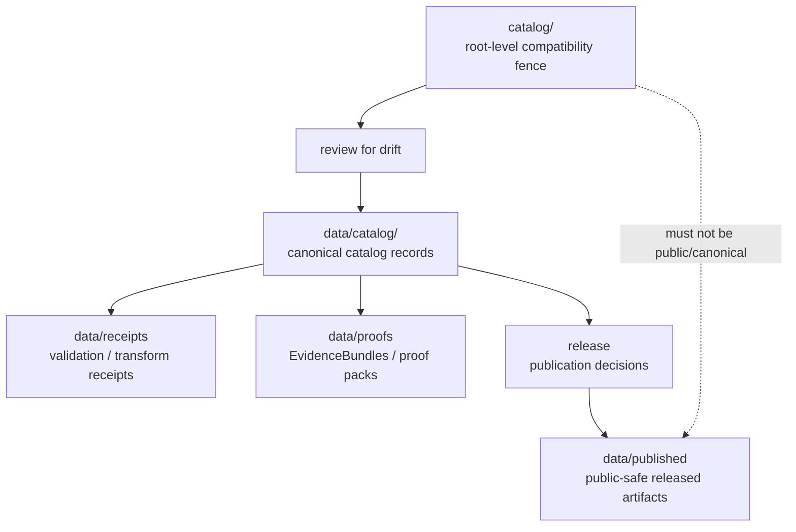

<!-- [KFM_META_BLOCK_V2]
doc_id: kfm://doc/root-catalog-readme
title: catalog/ — Catalog Compatibility Redirect
type: readme
version: v0.1
status: draft
owners: OWNER_TBD — Catalog steward · Data steward · Source steward · Docs steward
created: 2026-06-16
updated: 2026-06-16
policy_label: public
related:
  - ../data/README.md
  - ../data/catalog/README.md
  - ../data/receipts/README.md
  - ../data/proofs/README.md
  - ../data/published/README.md
  - ../data/registry/README.md
  - ../release/README.md
  - ../schemas/contracts/v1/
  - ../contracts/
  - ../policy/
  - ../docs/doctrine/directory-rules.md
tags: [kfm, catalog, compatibility-root, redirect, data-catalog, stac, dcat, prov, non-authoritative, drift-fence]
notes:
  - "Root-level catalog/ is treated as a compatibility/redirect fence, not the canonical catalog authority."
  - "Canonical catalog records belong under data/catalog/ according to the data lifecycle root boundary."
  - "Do not add STAC, DCAT, PROV, catalog indexes, source descriptors, receipts, proofs, release records, or published artifacts here without an ADR/migration note."
  - "Specific current contents, producers, migration status, and CI enforcement remain NEEDS VERIFICATION."
[/KFM_META_BLOCK_V2] -->

<a id="top"></a>

<div align="center">

# Catalog Compatibility Redirect

`catalog/`

**Compatibility / redirect fence for legacy or accidental root-level catalog placement. Canonical catalog records belong under `data/catalog/`, not this root-level folder.**


[Purpose](#1-purpose) · [Canonical home](#2-canonical-home) · [Authority boundary](#3-authority-boundary) · [Allowed contents](#5-allowed-contents) · [Forbidden contents](#6-forbidden-contents) · [Migration](#9-migration-posture) · [Definition of done](#12-definition-of-done)

</div>

---

> [!IMPORTANT]
> **Status:** draft / `NEEDS VERIFICATION`  
> **Path:** `catalog/README.md`  
> **Responsibility root:** compatibility redirect / drift fence only  
> **Canonical catalog home:** `data/catalog/`  
> **Truth posture:** CONFIRMED README path / CONFIRMED `data/` lifecycle root lists `catalog` as belonging under `data/` / PROPOSED root-level `catalog/` compatibility-redirect contract / UNKNOWN current contents, historical producers, migration status, CI enforcement, and ADR disposition

> [!CAUTION]
> Do not make `catalog/` a parallel catalog authority. KFM catalog truth, catalog indexes, STAC/DCAT/PROV records, and catalog publication state must live in the governed data lifecycle path, especially `data/catalog/`, with receipts/proofs/release records in their own canonical roots.

---

## 1. Purpose

`catalog/` is a **root-level compatibility redirect**. It exists only to prevent accidental or legacy catalog material from becoming a parallel authority outside the KFM lifecycle data root.

This folder should not be used for canonical catalog records. It should explain where catalog material belongs, identify drift if material appears here, and support a reversible migration into the correct home.

This README does not prove that any catalog material currently exists here, that a migration has been completed, or that CI currently blocks writes to this path.

[Back to top](#top)

---

## 2. Canonical home

Canonical catalog material belongs under:

```text
data/catalog/
```

The `data/` root is the lifecycle data root. Catalog is one of the data lifecycle families that belongs there, alongside raw, work, quarantine, processed, triplets, receipts, proofs, published, registry, provenance, manifests, and reports.

Root-level `catalog/` must therefore remain a redirect/fence unless a future ADR explicitly changes the root authority model.

## 3. Authority boundary

`catalog/` has **no canonical catalog authority**. It may hold only README guidance, migration notes, drift logs, or temporary redirect markers while catalog material is moved into its proper lifecycle home.

```text
WRONG / LEGACY ROOT             CANONICAL LIFECYCLE HOME            TRUST SUPPORT HOMES
catalog/                  -->   data/catalog/                  -->  data/receipts/
compatibility fence only        STAC / DCAT / PROV records          data/proofs/
not authoritative               catalog indexes / views             release/
                                                                 data/published/
```

A catalog record outside `data/catalog/` should be treated as drift until reviewed and migrated.

## 4. Default posture

Anything found under root-level `catalog/` should be treated as **NEEDS VERIFICATION** and potentially misplaced.

Do not expose, publish, index, cite, or depend on root-level catalog files as canonical records. First confirm source, provenance, rights, sensitivity, schema validity, lifecycle state, receipts, proofs, release state, rollback path, and correction path.

## 5. Allowed contents

| Allowed item | Example | Required posture |
|---|---|---|
| README / redirect docs | `README.md` | Compatibility fence only |
| Migration note | `MIGRATION.md` | Temporary and ADR/review-linked |
| Drift note | `DRIFT.md`, `OPEN-QUESTIONS.md` | Must point to canonical homes and review steps |
| Placeholder marker | `.gitkeep` | Does not authorize catalog content |

## 6. Forbidden contents

| Forbidden here | Correct home |
|---|---|
| STAC records, DCAT records, PROV records, catalog indexes | `data/catalog/` |
| Catalog-derived public products | `data/published/` after governed release |
| Source descriptors, source registry rows, rights rows, sensitivity rows | `data/registry/` or governed registry homes |
| Receipts, validation reports, redaction receipts | `data/receipts/` |
| EvidenceBundles, proof packs, attestations | `data/proofs/` |
| ReleaseManifest, PromotionDecision, RollbackCard, CorrectionNotice, signatures | `release/` |
| Schemas and machine-shape contracts | `schemas/contracts/v1/` |
| Human contracts and object-meaning docs | `contracts/` |
| Policy rules and policy decisions | `policy/` and governed policy-decision homes |
| Source code, scripts, packages, pipelines, build tools | `apps/`, `packages/`, `tools/`, `scripts/`, `pipelines/` |
| Raw, work, quarantine, processed, or published lifecycle data | `data/` lifecycle subtrees |

## 7. Directory shape

Current implementation inventory remains `NEEDS VERIFICATION`.

```text
catalog/
├── README.md                 # compatibility redirect / drift fence
├── MIGRATION.md              # PROPOSED only if migration is active
└── DRIFT.md                  # PROPOSED only if misplaced catalog material is found
```

> [!WARNING]
> Do not treat this suggested shape as repo fact. Verify actual contents before making inventory or migration claims.

## 8. Diagram



## 9. Migration posture

If catalog files are found here:

1. Do not publish or depend on them.
2. Identify whether they are STAC, DCAT, PROV, catalog index, source registry, receipt, proof, release, or published-output material.
3. Move or regenerate them into the correct owning root through a governed migration.
4. Preserve provenance, source refs, digests, receipts, review notes, and rollback path.
5. Add a drift register or migration note if the material has already been consumed.
6. Leave root-level `catalog/` as a redirect/fence unless an ADR explicitly says otherwise.

## 10. Validation expectations

Useful validation for this folder should cover:

- no catalog records or catalog indexes are stored here;
- no receipts, proofs, release records, registry records, policy rules, schemas, source code, or published artifacts are stored here;
- any non-README content is tied to an active migration or drift note;
- CI or review checks flag root-level catalog writes;
- links point users to `data/catalog/` and other canonical homes.

## 11. Safe change pattern

For changes under `catalog/`:

1. Confirm the change is redirect documentation, migration support, or drift documentation only.
2. Confirm it does not create a parallel catalog authority.
3. Confirm durable catalog data is placed under `data/catalog/`.
4. Confirm receipts/proofs/release records are placed under their owning roots.
5. Document migration and rollback if any misplaced material was moved.
6. Update docs and validation rules when behavior materially changes.

## 12. Definition of done

- [ ] Owners are confirmed and `OWNER_TBD` is replaced.
- [ ] Actual root-level `catalog/` contents are verified.
- [ ] Any misplaced catalog material is migrated or documented as drift.
- [ ] `data/catalog/` is confirmed as the canonical catalog home in current docs.
- [ ] No trust-bearing records live here.
- [ ] No catalog records, registry records, receipts, proofs, release records, published artifacts, schemas, contracts, policy rules, source code, or lifecycle data live here.
- [ ] CI/review behavior is verified or marked `NEEDS VERIFICATION`.

## 13. Open verification items

| Item | Why it matters |
|---|---|
| Confirm actual files under root-level `catalog/` | Prevents overclaiming or missing drift |
| Confirm whether any workflow writes here | Required before producer claims |
| Confirm migration status to `data/catalog/` | Required before canonical-home claims beyond doctrine |
| Confirm CI/review guard exists | Required before enforcement claims |
| Confirm no trust records are stored here | Required before Directory Rules compliance claims |
| Confirm ADR status for root-level `catalog/` | Required before long-term retention claims |

<details>
<summary>Appendix A — no-loss preservation note</summary>

The previous README was empty. This replacement adds a redirect and anti-parallel-authority contract without claiming catalog files, migration work, CI enforcement, producer workflows, or ADR disposition are implemented.

</details>

## Status summary

`catalog/` is a root-level compatibility redirect and drift fence. It is not the canonical catalog home.

Catalog authority belongs under `data/catalog/`; trust-bearing support belongs under `data/receipts/`, `data/proofs/`, and `release/`; released public-safe products belong under `data/published/`.

<p align="right"><a href="#top">Back to top</a></p>
