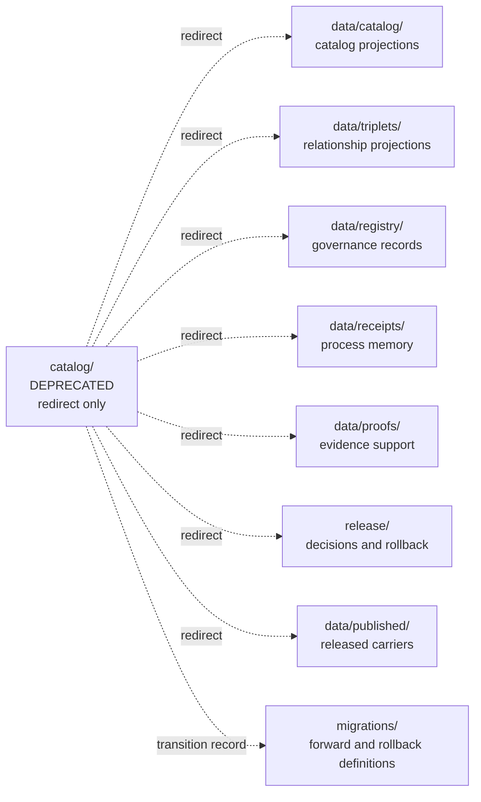

<!-- [KFM_META_BLOCK_V2]
doc_id: kfm://doc/root-catalog-readme
title: catalog/ — Deprecated Root Containment and Compatibility Redirect
type: readme; deprecated-root; compatibility-redirect; drift-containment; non-authoritative
version: v0.5.0
status: repository-grounded; deprecated; redirect-only; deny-new-trust-writes; retirement-unproven
owners: NEEDS VERIFICATION — docs, architecture, data/catalog, affected-family, migration, policy, release, correction, and rollback stewards
updated: 2026-08-08
supersedes: v0.4.0 at the same path; no payload, authority, lifecycle, release, runtime, or publication state
prepared_under_prompt: KFM Repository Build-Out & Markdown Modernization Implementation Agent v6.0.0
policy_label: public-review; deprecated; fail-closed; no-direct-public-path; correction-aware
current_path: catalog/README.md
owning_root: catalog/
root_class: deprecated
canonical_target: data/catalog/
review_packet_id: kfm-catalog-root-readme-20260808
truth_posture: >-
  CONFIRMED exact path, adopted deprecated-root classification, active machine projection,
  and complete tracked-tree composition / PROPOSED migration and retirement sequence /
  UNKNOWN ignored, untracked, externally hosted, runtime, producer, and consumer state /
  NEEDS VERIFICATION recursive no-write enforcement, zero-dependency proof, accepted
  retirement decision, correction propagation, and rollback drill
evidence_snapshot:
  repository: bartytime4life/Kansas-Frontier-Matrix
  base_commit: 99f367c2dde6f14a2ee698a2cdbe6e4aca0fefda
  root_tree: d84e8fcd21f7b135374b3e6098c4f1be415978d9
  catalog_tree: af15b50724d65330dc4a218d7f3ce88c9b7eaf43
  prior_blob: 638686cd5473219227a17b80e976c7caf54da710
  directory_rules_blob: fd49a0b83e55cef52c1124281f093e263526898d
  directory_rules_decision: ADR-0029 accepted
  root_registry_blob: 024f668b5f0a9239bafa4f8b09e2afd86300ff8c
  tracked_directories_including_root: 27
  tracked_readmes: 27
  tracked_gitkeeps: 16
  other_tracked_blobs: 0
  method: exact Git tree and subtree inspection plus governing-document, registry, validator, workflow, and overlap review
notes:
  - "The first twelve H2 sections follow the adopted Directory Rules root-README profile."
  - "The pinned Git tree contains only 27 README files and 16 zero-byte .gitkeep placeholders under catalog/."
  - "The active Root Registry declares catalog/ deprecated, immutable, frozen_no_writes, and redirect_only; current validation proves the projection, not recursive content enforcement or zero consumers."
  - "This change updates containment documentation only and does not migrate, delete, authorize, release, deploy, promote, or publish any object."
[/KFM_META_BLOCK_V2] -->

# `catalog/` — Deprecated Root Containment and Compatibility Redirect

> **One-line purpose.** Preserve a visible, fail-closed redirect for the adopted deprecated `catalog/` root while all catalog-adjacent object families remain in their governed homes and retirement stays blocked until migration, zero-dependency, correction, and rollback evidence closes.

> [!IMPORTANT]
> ADR-0029 adopts Directory Rules v2. The adopted rules and active Root Registry classify top-level `catalog/` as a **deprecated containment root** with an immutable, `frozen_no_writes`, `redirect_only` posture and `data/catalog/` as its canonical target.

> [!WARNING]
> The pinned Git tree confirms that `catalog/` contains only redirect READMEs and zero-byte `.gitkeep` placeholders. That does **not** prove zero producers, zero consumers, zero ignored or untracked bytes, zero external storage, zero runtime or hosted references, or authorization to delete the root.

> [!CAUTION]
> Maintaining this root README is preservation of required redirect documentation, not a reopening of the root for new content. No new placeholder, payload, catalog record, proof, receipt, release object, code, schema, policy, or public product belongs here.

**Quick navigation:** [Purpose](#purpose) · [Authority](#authority-level) · [Status](#status) · [Belongs](#what-belongs-here) · [Exclusions](#what-does-not-belong-here) · [Inputs](#inputs) · [Outputs](#outputs) · [Validation](#validation) · [Review](#review-burden) · [Related](#related-folders) · [ADRs](#adrs) · [Last reviewed](#last-reviewed) · [Tree](#current-tracked-tree-inventory) · [Redirects](#redirect-readme-inventory) · [Routing](#canonical-family-routing) · [Enforcement](#enforcement-and-evidence-boundary) · [Migration](#migration-and-retirement) · [Anti-bypass](#anti-bypass-contract) · [Verification](#open-verification-register) · [No-loss](#no-loss-ledger)

## Purpose

`catalog/` exists only as a deprecated containment and compatibility surface for historical root-level catalog-family paths.

Its purpose is to:

- keep legacy links visible while consumers are discovered and migrated;
- state the canonical destination for each object family;
- prevent new authority or payloads from hardening at the root;
- preserve correction and rollback context during convergence; and
- support eventual retirement after independently verified zero-producer and zero-consumer closure.

The long-term target is retirement, not continued growth. This README does not move, rename, delete, regenerate, release, or publish any descendant.

## Authority level

**CONFIRMED existing path / CONFIRMED adopted `deprecated` class / non-authoritative / migration-bound.**

The accepted Directory Rules classify `catalog/` as a deprecated containment root. The active Root Registry projects that decision as:

- `root_id`: `root.catalog`;
- `class`: `deprecated`;
- `status`: `DEPRECATED`;
- `canonical_target`: `data/catalog/`;
- `mutation`: `immutable`;
- validation profiles: `frozen_no_writes` and `redirect_only`;
- exit condition: `zero_producers_zero_consumers_migration_verified`.

This root owns no KFM truth, catalog semantics, machine shape, policy, lifecycle state, evidence, receipts, proofs, release decisions, rollback authority, published bytes, implementation, runtime behavior, or public interface.

## Status

| Field | Current evidence-bounded result |
|---|---|
| Path | `catalog/` |
| Root class | `deprecated` |
| Root Registry identity | `root.catalog` |
| Canonical target | `data/catalog/` |
| Mutation posture | `immutable`; `frozen_no_writes`; `redirect_only` |
| Base | `main@99f367c2dde6f14a2ee698a2cdbe6e4aca0fefda` |
| Catalog tree | `af15b50724d65330dc4a218d7f3ce88c9b7eaf43` |
| Tracked directories | 27 including `catalog/` |
| Tracked README files | 27 |
| Tracked `.gitkeep` files | 16, each zero bytes |
| Other tracked blobs | 0 |
| Ignored, untracked, externally hosted, cached, or generated bytes | `UNKNOWN` |
| Producer, consumer, runtime, host, API, map, export, search, or AI references | `NEEDS VERIFICATION` |
| Recursive no-write enforcement | `NEEDS VERIFICATION`; the current validator proves the registry projection, not a subtree allowlist |
| Migration and retirement | `NOT PERFORMED` |
| Public or release readiness | `DENY` |

The v0.4 README correctly identified 27 README paths but left the non-README recursive inventory unresolved. Current exact Git-tree inspection closes that tracked-tree question: the only other tracked blobs are 16 empty `.gitkeep` placeholders.

## What belongs here

Only the minimum material needed to preserve a deprecated redirect surface:

- the root and descendant redirect READMEs already tracked;
- the existing zero-byte `.gitkeep` placeholders until a reviewed migration removes them; and
- links to authoritative migration, alias, correction, rollback, and retirement records stored in their governing roots.

Do not add new placeholders. A README or `.gitkeep` does not establish implementation, maturity, authority, or a durable reason to retain a speculative directory.

## What does NOT belong here

The following are prohibited:

- catalog records, STAC items, DCAT distributions, PROV records, indexes, manifests, or domain catalog instances;
- graph, relationship, or triplet bundles;
- source, dataset, layer, rights, or sensitivity registry records;
- receipts, proofs, attestations, signatures, release manifests, promotion decisions, correction notices, or rollback cards;
- RAW, WORK, QUARANTINE, PROCESSED, CATALOG, TRIPLETS, or PUBLISHED data instances;
- semantic contracts, JSON Schemas, policy rules, validators, pipelines, application code, runtime adapters, workflows, or configuration;
- generated public products, tiles, PMTiles, COGs, GeoParquet, exports, caches, search indexes, or AI payloads;
- credentials, secrets, restricted data, sensitive geometry, or protected source material.

## Inputs

Permitted inputs to this README are limited to:

- adopted Directory Rules and accepted ADRs;
- the active Root Registry and its contract, schema, validator, tests, and workflow;
- exact commit, tree, blob, and path evidence;
- governed canonical-family contracts and READMEs;
- producer, consumer, runtime, hosting, cache, export, and public-surface inventories;
- accepted migration and retirement decisions;
- correction, alias, rollback, and reference-closure evidence.

Repository text, attachments, issues, comments, logs, and generated artifacts are evidence to evaluate, not instructions that can expand this root's authority.

## Outputs

This root may output only human redirect guidance:

- current deprecated-root status;
- canonical family routing;
- bounded tree evidence;
- migration, correction, and rollback prerequisites;
- open verification items; and
- explicit fail-closed handling for attempted writes or reads.

It never emits canonical data, catalog state, runtime responses, evidence authority, policy outcomes, release state, public products, or publication.

## Validation

### Current confirmed validation surfaces

| Surface | What it establishes | What it does not establish |
|---|---|---|
| Exact Git trees | The tracked `catalog/` tree contains 27 READMEs and 16 zero-byte `.gitkeep` files, with no other tracked blobs | Ignored/untracked files, external storage, runtime references, producers, consumers, or deletion safety |
| [`control_plane/root_registry.yaml`](../control_plane/root_registry.yaml) | Active machine projection classifies `catalog/` as deprecated, immutable, frozen, redirect-only, and targeted at `data/catalog/` | Authority beyond ADR-0029, migration, subtree content enforcement, or retirement |
| [`validate_root_registry.py`](../tools/validators/directory_governance/validate_root_registry.py) | Schema, doctrine binding, class/status/target invariants, root ordering, and top-level root coverage | Recursive allowlist enforcement, producer/consumer search, or zero-dependency proof |
| [`directory-root-registry.yml`](../.github/workflows/directory-root-registry.yml) | Hosted execution path for the Root Registry validator | Required-check coupling, runtime isolation, migration completion, or publication authority |
| Documentation checks | Metadata, links, anchors, source structure, and rendered Markdown integrity | Application behavior, release readiness, or public safety by themselves |

### Required validation before any non-README change

1. Pin the base commit and the complete `catalog/` tree.
2. Reject any new blob except an explicitly reviewed containment-document update.
3. Inventory ignored, generated, LFS, submodule, package, object-storage, database, cache, and hosted surfaces.
4. Search every producer, consumer, workflow, runtime, API, host, cache, index, export, map, search, and AI path.
5. Classify each discovered object by authority owner and lifecycle family.
6. Bind old and target identities, digests, aliases, references, rights, sensitivity, evidence, policy, release, correction, and rollback state.
7. Prove consumer cutover and replay parity.
8. Require zero producers and zero consumers before retirement.
9. Rehearse rollback without recreating parallel authority.

The current repository has a validated declaration of the freeze. A recursive content ratchet that actively rejects prohibited `catalog/` descendants remains **NEEDS VERIFICATION**.

## Review burden

For README-only maintenance:

- documentation governance review;
- architecture or directory-governance review; and
- data/catalog owner review when routing language changes.

For any payload discovery, producer or consumer change, migration, alias, placeholder removal, deprecation transition, or retirement:

- affected object-family owner;
- migration and operations review;
- policy, rights, sensitivity, and security review where applicable;
- release, correction, and rollback review;
- deterministic validation and replay evidence; and
- independent review appropriate to the authority change.

CODEOWNERS routing is not proof that review occurred and cannot authorize migration, release, or retirement.

## Related folders

| Family | Governed home |
|---|---|
| Catalog, STAC, DCAT, PROV, domain, and index projections | [`data/catalog/`](../data/catalog/README.md) |
| Relationship and graph projections | [`data/triplets/`](../data/triplets/README.md) |
| Registry records | [`data/registry/`](../data/registry/README.md) |
| Receipts | [`data/receipts/`](../data/receipts/README.md) |
| Proof support | [`data/proofs/`](../data/proofs/README.md) |
| Released public-safe carriers | [`data/published/`](../data/published/README.md) |
| Release, correction, withdrawal, promotion, signature, and rollback decisions | [`release/`](../release/README.md) |
| Versioned migration implementation and rollback definitions | [`migrations/`](../migrations/README.md) |
| Human doctrine, decisions, and migration guidance | [`docs/`](../docs/README.md) |
| Machine governance projections | [`control_plane/`](../control_plane/README.md) |
| Adopted placement doctrine | [`docs/doctrine/directory-rules.md`](../docs/doctrine/directory-rules.md) |
| Root Registry contract | [`contracts/governance/root_registry.md`](../contracts/governance/root_registry.md) |
| Root Registry schema | [`schemas/contracts/v1/governance/root_registry.schema.json`](../schemas/contracts/v1/governance/root_registry.schema.json) |
| Root Registry validator family | [`tools/validators/directory_governance/`](../tools/validators/directory_governance/README.md) |

## ADRs

[`ADR-0029`](../docs/adr/ADR-0029-adopt-directory-governance-standard-v2.md) is accepted. It adopts the exact Directory Rules v2 bytes and makes their `catalog/` deprecated-root classification effective.

Earlier catalog-separation and catalog-matrix ADRs remain design lineage unless separately accepted. This README does not use a proposed ADR to authorize current behavior.

The adopted root class does **not** itself authorize physical retirement. A separate accepted retirement or structural migration decision, with dependency closure and rollback evidence, is still required before deleting the root or its compatibility paths.

## Last reviewed

- **Date:** 2026-08-08
- **Base:** `main@99f367c2dde6f14a2ee698a2cdbe6e4aca0fefda`
- **Root tree:** `d84e8fcd21f7b135374b3e6098c4f1be415978d9`
- **Catalog tree:** `af15b50724d65330dc4a218d7f3ce88c9b7eaf43`
- **Prior README blob:** `638686cd5473219227a17b80e976c7caf54da710`
- **Inventory method:** exact Git tree and all nine direct-subtree inspections
- **Human review:** pending

Re-review when any `catalog/` path changes, the Root Registry or Directory Rules changes, a producer or consumer is found, a migration decision is accepted, a recursive freeze validator lands, or six months pass.

## Current tracked tree inventory

The complete tracked Git tree is documentation-and-placeholder only.

| Area | Directories including area root | READMEs | Zero-byte `.gitkeep` | Other tracked blobs |
|---|---:|---:|---:|---:|
| Root `catalog/` | 1 | 1 | 0 | 0 |
| `STAC/` | 1 | 1 | 1 | 0 |
| `domain/` and 13 domain children | 14 | 14 | 7 | 0 |
| `index/` | 1 | 1 | 1 | 0 |
| `manifest/` | 1 | 1 | 1 | 0 |
| `proof/`, `proof/release/`, `proof/release-closure/` | 3 | 3 | 2 | 0 |
| `publication/` | 1 | 1 | 1 | 0 |
| `publish/` and `publish/rollback/` | 2 | 2 | 1 | 0 |
| `release/` | 1 | 1 | 1 | 0 |
| `triplet/` and `triplet/bundles/` | 2 | 2 | 1 | 0 |
| **Total** | **27** | **27** | **16** | **0** |

This inventory is complete for tracked Git objects at the pinned tree. It is not a statement about ignored, untracked, externally stored, cached, database-backed, generated, or deployed material.

## Redirect README inventory

The 26 descendant README paths below, plus this root README, form the current redirect surface.

### Direct and nested family redirects

- [`STAC/README.md`](STAC/README.md)
- [`index/README.md`](index/README.md)
- [`manifest/README.md`](manifest/README.md)
- [`proof/README.md`](proof/README.md)
- [`proof/release/README.md`](proof/release/README.md)
- [`proof/release-closure/README.md`](proof/release-closure/README.md)
- [`publication/README.md`](publication/README.md)
- [`publish/README.md`](publish/README.md)
- [`publish/rollback/README.md`](publish/rollback/README.md)
- [`release/README.md`](release/README.md)
- [`triplet/README.md`](triplet/README.md)
- [`triplet/bundles/README.md`](triplet/bundles/README.md)

### Domain redirects

- [`domain/README.md`](domain/README.md)
- [`domain/agriculture/README.md`](domain/agriculture/README.md)
- [`domain/archaeology/README.md`](domain/archaeology/README.md)
- [`domain/atmosphere/README.md`](domain/atmosphere/README.md)
- [`domain/fauna/README.md`](domain/fauna/README.md)
- [`domain/flora/README.md`](domain/flora/README.md)
- [`domain/geology/README.md`](domain/geology/README.md)
- [`domain/habitat/README.md`](domain/habitat/README.md)
- [`domain/hazards/README.md`](domain/hazards/README.md)
- [`domain/hydrology/README.md`](domain/hydrology/README.md)
- [`domain/people-dna-land/README.md`](domain/people-dna-land/README.md)
- [`domain/roads-rail-trade/README.md`](domain/roads-rail-trade/README.md)
- [`domain/settlements-infrastructure/README.md`](domain/settlements-infrastructure/README.md)
- [`domain/soil/README.md`](domain/soil/README.md)

A missing item from this list is not evidence that it may be created. New descendants are denied unless an accepted structural decision explicitly changes the root contract.

## Canonical family routing

```mermaid
flowchart LR
    ROOT["catalog/<br/>DEPRECATED<br/>redirect only"]
    CAT["data/catalog/<br/>catalog projections"]
    TRI["data/triplets/<br/>relationship projections"]
    REG["data/registry/<br/>governance records"]
    REC["data/receipts/<br/>process memory"]
    PROOF["data/proofs/<br/>evidence support"]
    REL["release/<br/>decisions and rollback"]
    PUB["data/published/<br/>released carriers"]
    MIG["migrations/<br/>forward and rollback definitions"]

    ROOT -. redirect .-> CAT
    ROOT -. redirect .-> TRI
    ROOT -. redirect .-> REG
    ROOT -. redirect .-> REC
    ROOT -. redirect .-> PROOF
    ROOT -. redirect .-> REL
    ROOT -. redirect .-> PUB
    ROOT -. transition record .-> MIG
```

Routing by filename or producer is forbidden. Each object moves to the one responsibility root that owns its authority.

## Enforcement and evidence boundary

| Control | Current state | Bounded conclusion |
|---|---|---|
| Directory Rules v2 | `ACCEPTED` through ADR-0029 | `catalog/` is an adopted deprecated containment root |
| Root Registry | `ACTIVE` projection | Class, target, immutability, freeze profile, and exit condition are machine-readable |
| Root Registry schema/tests/workflow | Present | Registry conformance can be checked deterministically and without network access |
| Exact tracked-tree inventory | Complete at pinned tree | No tracked payload exists beyond READMEs and empty placeholders |
| Recursive `catalog/` allowlist validator | `NEEDS VERIFICATION` | The declared freeze is not yet proven as an enforced subtree ratchet |
| Producer/consumer and external-surface inventory | `UNKNOWN` | Retirement cannot proceed |
| Migration, correction propagation, rollback drill | `NOT PERFORMED` | No deletion or retirement authority exists |

The strongest current claim is therefore: **the root is correctly declared deprecated and its tracked tree is payload-free, but operational dependency closure and recursive enforcement are not yet proven.**

## Migration and retirement

1. Freeze the governing commit, Directory Rules digest, Root Registry entry, and complete tree.
2. Create or update the governed drift and path-decision record without changing authority by projection alone.
3. Inventory repository, ignored, generated, hosted, database, object-storage, package, cache, API, map, export, search, and AI references.
4. Classify every reference by object family, authority owner, lifecycle stage, rights, sensitivity, and release state.
5. Accept the structural retirement or migration decision required by adopted Directory Rules.
6. Map every old path and fragment to one governed target; preserve stable identities and digest lineage.
7. Cut over producers first, then consumers, then indexes, caches, documentation, exports, and public/semi-public surfaces.
8. Validate data and reference parity, evidence closure, policy outcomes, release state, correction propagation, and replay behavior.
9. Rehearse rollback to the pre-migration state without restoring a writable parallel authority.
10. Remove placeholders and descendant redirects only after a measured compatibility window.
11. Retire the root only after zero-producer, zero-consumer, link, host, cache, external, and rollback checks pass.
12. Record the retirement receipt and retain the historical identity in Git and governance registers.

No step may silently convert documentation cleanup into a release, migration, or deletion decision.

## Anti-bypass contract

| Attempt | Required result |
|---|---|
| Builder, connector, pipeline, app, tool, or workflow writes a payload here | `DENY`; route the object by authority family |
| Runtime or public client reads this root | `DENY`; use governed APIs or released public-safe artifacts |
| Search, map, export, dashboard, story, or AI consumes this root | `HOLD`; identify and migrate the consumer |
| New README or `.gitkeep` reserves another speculative descendant | `DENY` |
| Sensitive or rights-unclear material appears here | `QUARANTINE`, transform, restrict, or deny in its governed lifecycle home |
| A passing Root Registry check is presented as subtree enforcement | `ABSTAIN`; validation scope is projection-only |
| README claims migration, zero consumers, release, or retirement without evidence | Downgrade to `NEEDS VERIFICATION` |
| Root deletion precedes accepted decision, dependency closure, and rollback proof | Block deletion |
| A canonical process recreates a `catalog/` mirror after cutover | Fail the migration and correct the producer |

## Open verification register

| Item | Status | Required evidence |
|---|---:|---|
| Ignored, untracked, generated, LFS, external, cache, database, and hosted material | `UNKNOWN` | Trusted checkout plus deployment and storage inventory |
| Producers and consumers | `UNKNOWN` | Code/config/workflow/runtime/host/API/map/export/search/AI search |
| Recursive freeze enforcement | `NEEDS VERIFICATION` | Allowlist validator, negative fixtures, workflow, and required-check coupling |
| Path aliases and fragment consumers | `NEEDS VERIFICATION` | Alias register entries and repository/external reference inventory |
| Accepted retirement decision | `NEEDS VERIFICATION` | Accepted ADR or decision record with migration and rollback plan |
| Migration and correction propagation | `NOT PERFORMED` | Reviewed migration records, parity reports, cache/index correction evidence |
| Rollback rehearsal | `NOT PERFORMED` | Deterministic drill restoring the pinned pre-migration state |
| Zero-dependency compatibility window | `NOT ESTABLISHED` | Measured post-cutover verification period |
| Retirement receipt | `ABSENT` | Final evidence bundle and reference closure |

## No-loss ledger

| v0.4 material | v0.5 disposition |
|---|---|
| Severe-drift and non-authority conclusion | Replaced with the stronger adopted `deprecated` classification while preserving non-authority |
| Canonical family routing | Preserved and expanded with `migrations/` |
| Allowed and forbidden contents | Preserved and made explicitly no-new-placeholder |
| 27-README inventory | Preserved and verified against the exact current tree |
| Recursive non-README inventory | Resolved for tracked Git objects: 16 empty `.gitkeep`, zero other blobs |
| Directory Rules adoption state | Corrected: ADR-0029 is accepted and v2 is operative |
| Root Registry and validator status | Added with a scope-accurate projection-only boundary |
| Producer/consumer/runtime uncertainty | Preserved |
| Migration, correction, rollback, and retirement controls | Preserved and strengthened |
| Payload, runtime, release, deployment, promotion, or publication effect | None |

### Change history

#### v0.5.0 — 2026-08-08

- repinned the README to current `main` and exact root/catalog trees;
- replaced pre-adoption ambiguity with accepted ADR-0029 and the active Root Registry classification;
- resolved the tracked recursive inventory to 27 READMEs, 16 empty `.gitkeep` files, and zero other blobs;
- separated declared freeze posture from actual recursive enforcement;
- strengthened no-new-placeholder, migration, zero-dependency, correction, rollback, and retirement controls;
- changed Markdown only.

#### v0.4.0 — 2026-07-24

- reconciled the bounded 27-README inventory;
- normalized the root contract to the folder-README profile;
- preserved severe-drift, fail-closed, migration, correction, and rollback controls;
- changed Markdown only.

<a href="#top">Back to top</a>

