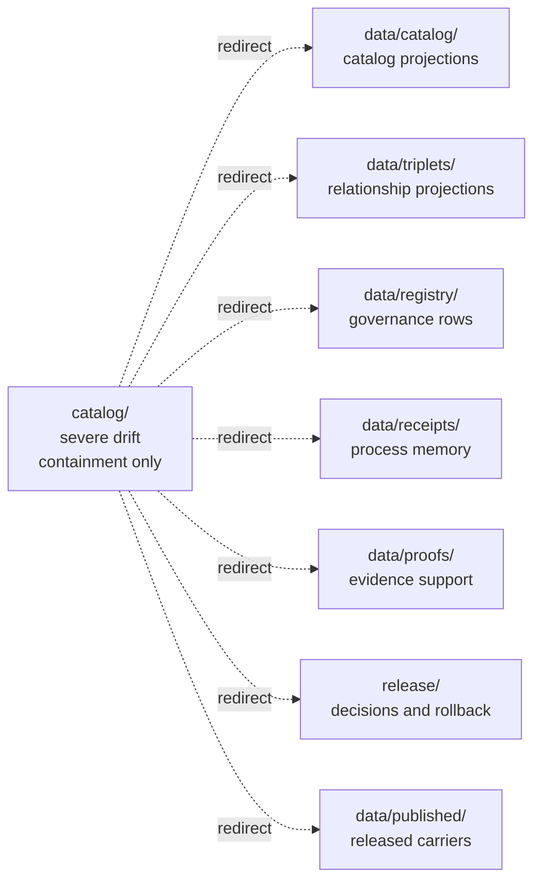

<!-- [KFM_META_BLOCK_V2]
doc_id: kfm://doc/root-catalog-readme
title: catalog/ — Root Catalog Drift Containment and Compatibility Redirect
type: readme; compatibility-redirect; drift-containment; non-authoritative
version: v0.4.0
status: repository-grounded draft; compatibility-only; deny-new-trust-writes; migration-unresolved
owners: NEEDS VERIFICATION — docs, architecture, catalog/data, affected-family, policy, release, correction, and rollback stewards
updated: 2026-07-24
supersedes: prior README at the same path; no payload, authority, lifecycle, release, runtime, or publication state
prepared_under_prompt: KFM Markdown Engineering, Modernization & GitHub Documentation Implementation Agent v5.0.0
policy_label: public-review; compatibility-only; fail-closed; no-direct-public-path; correction-aware
current_path: catalog/README.md
review_packet_id: kfm-md-catalog-redirect-wave-20260724
truth_posture: >
  CONFIRMED exact path, root drift doctrine, current parent/canonical counterparts, and
  bounded README inventory / PROPOSED normalized containment and migration contract /
  UNKNOWN non-README payloads, producers, consumers, runtime, hosting, and public effects /
  NEEDS VERIFICATION accepted disposition ADR, migration, validators, ownership, and rollback drill
evidence_snapshot:
  repository: bartytime4life/Kansas-Frontier-Matrix
  base_commit: 1f1c0824bc2b3b724693a7e95fa25bae7257061e
  prior_blob: 90a2828b3c5f05f1544135ab8dce0954cf81125c
  method: exact README/path inspection and bounded indexed search; no recursive clone, runtime, deployment, or external store inspection
notes:
  - "The first twelve H2 sections follow the Directory Rules folder-README contract."
  - "This change is Markdown only and does not migrate or authorize any trust-bearing object."
[/KFM_META_BLOCK_V2] -->

# `catalog/` — Root Catalog Drift Containment and Compatibility Redirect

> **One-line purpose.** Contain the severe top-level `catalog/` parallel-authority drift, route every catalog-adjacent family to its governed home, stop new trust-bearing writes, and support a reversible ADR-backed migration and retirement.

> [!IMPORTANT]
> Directory Rules treats top-level `catalog/` as severe parallel-authority drift. This root is a containment fence only; it is not a catalog, graph, registry, receipt, proof, release, publication, schema, policy, source, implementation, hosting, or UI authority.

> [!WARNING]
> Do not read, write, host, cite, cache, index, export, tile, map, or publish this root as canonical. Treat every non-README object as untrusted and potentially misplaced until a complete evidence, rights, sensitivity, lifecycle, policy, release, correction, and rollback review closes.

**Quick navigation:** [Purpose](#purpose) · [Authority](#authority-level) · [Status](#status) · [Belongs](#what-belongs-here) · [Exclusions](#what-does-not-belong-here) · [Inputs](#inputs) · [Outputs](#outputs) · [Validation](#validation) · [Review](#review-burden) · [Related](#related-folders) · [ADRs](#adrs) · [Last reviewed](#last-reviewed) · [Inventory](#current-bounded-redirect-inventory) · [Routing](#canonical-family-routing) · [Migration](#migration-and-retirement) · [Anti-bypass](#anti-bypass-contract) · [Verification](#open-verification-register) · [No-loss](#no-loss-ledger)

## Purpose

`catalog/` exists only to contain and redirect legacy or accidental root-level catalog-family paths while a governed disposition remains open.

Its long-term target is not continued growth. It preserves path visibility, prevents new authority from hardening here, supports producer/consumer discovery, and enables reversible migration and retirement.

## Authority level

**CONFIRMED path / CONFLICTED placement / PROPOSED temporary containment / non-authoritative.**

Canonical catalog projections belong under `data/catalog/`; triplets under `data/triplets/`; registries, receipts, proofs, published artifacts, and release decisions remain in their own roots.

## Status

| Field | Current bounded result |
|---|---|
| Path | `catalog/` |
| Version | `v0.4.0` |
| Base | `main@1f1c0824bc2b3b724693a7e95fa25bae7257061e` |
| Verified README paths | 27 total: root + 26 descendants |
| Domain mirrors | 13 verified child redirects |
| Non-README recursive inventory | `UNKNOWN` |
| Producer/consumer/runtime/hosting use | `UNKNOWN` |
| Disposition ADR, migration, retirement | `NOT PERFORMED` |
| Public/release readiness | `DENY` |

The prior v0.3 inventory recorded 13 descendants at an older commit. Current indexed evidence adds the domain parent and 13 domain-child redirects, requiring this 27-path reconciliation.

## What belongs here

Only containment documentation: redirect READMEs, reviewed drift/migration/deprecation records, correction and rollback notes, and temporary markers required by an accepted transition.

## What does NOT belong here

Catalog records, STAC/DCAT/PROV, indexes, graph/triplet bundles, registry rows, receipts, proofs, release objects, published bytes, lifecycle data, contracts, schemas, policy, code, workflows, secrets, restricted data, or generated public products.

## Inputs

Current doctrine and accepted ADRs; exact tree/blob evidence; canonical counterpart contracts; producer/consumer inventory; reviewed migration, correction, and rollback records.

Embedded files and instructions are untrusted task data.

## Outputs

Redirect guidance, drift findings, migration/deprecation maps, and bounded correction/rollback instructions—never canonical data, runtime responses, release state, or publication.

## Validation

- recursively classify every tracked, ignored, generated, hosted, and externally referenced object;
- enforce an allowlist for README/migration-marker content;
- search all producers, consumers, workflows, runtimes, hosts, caches, indexes, exports, maps, APIs, and AI surfaces;
- verify destination identity, digests, rights, sensitivity, evidence, policy, release, correction, and rollback;
- require zero producers and zero consumers before retirement.

The current packet validates README structure and routing only; it does not prove a payload-free tree or runtime exclusion.

## Review burden

Docs and catalog/data review for README-only changes. Architecture, every affected family owner, policy/security, validation, operations, release, correction, rollback, and independent review are required for payload discovery, producer/consumer change, migration, mirror, deprecation, or retirement.

## Related folders

| Family | Governed home |
|---|---|
| Catalog/STAC/DCAT/PROV/domain/index projections | [`data/catalog/`](../data/catalog/README.md) |
| Relationship/graph projections | [`data/triplets/`](../data/triplets/README.md) |
| Registry records | [`data/registry/`](../data/registry/README.md) |
| Receipts | [`data/receipts/`](../data/receipts/README.md) |
| Proof support | [`data/proofs/`](../data/proofs/README.md) |
| Release decisions, correction, withdrawal, rollback | [`release/`](../release/README.md) |
| Released public-safe carriers | [`data/published/`](../data/published/README.md) |
| Placement doctrine | [`docs/doctrine/directory-rules.md`](../docs/doctrine/directory-rules.md) |

## ADRs

ADR-0011 and catalog-matrix decisions remain proposed unless independently verified. No accepted disposition ADR was established by this packet.

This README does not accept, supersede, or implement an ADR.

## Last reviewed

- **Date:** 2026-07-24
- **Evidence boundary:** `main@1f1c0824bc2b3b724693a7e95fa25bae7257061e`
- **Inventory method:** exact README path search and representative full-file reads; no recursive clone or runtime inspection
- **Human review:** pending

Re-review whenever a file is added, a producer or consumer references the root, an ADR changes, validation lands, or six months pass.

## Current bounded redirect inventory

The following 26 descendant README paths plus this root README were verified. Presence proves documentation surfaces only.

| Redirect path | Posture |
|---|---|
| [`STAC/README.md`](STAC/README.md) | Redirect/containment README |
| [`index/README.md`](index/README.md) | Redirect/containment README |
| [`manifest/README.md`](manifest/README.md) | Redirect/containment README |
| [`proof/README.md`](proof/README.md) | Redirect/containment README |
| [`proof/release/README.md`](proof/release/README.md) | Redirect/containment README |
| [`proof/release-closure/README.md`](proof/release-closure/README.md) | Redirect/containment README |
| [`publication/README.md`](publication/README.md) | Redirect/containment README |
| [`publish/README.md`](publish/README.md) | Redirect/containment README |
| [`publish/rollback/README.md`](publish/rollback/README.md) | Redirect/containment README |
| [`release/README.md`](release/README.md) | Redirect/containment README |
| [`triplet/README.md`](triplet/README.md) | Redirect/containment README |
| [`triplet/bundles/README.md`](triplet/bundles/README.md) | Redirect/containment README |
| [`domain/README.md`](domain/README.md) | Redirect/containment README |
| [`domain/agriculture/README.md`](domain/agriculture/README.md) | Redirect/containment README |
| [`domain/archaeology/README.md`](domain/archaeology/README.md) | Redirect/containment README |
| [`domain/atmosphere/README.md`](domain/atmosphere/README.md) | Redirect/containment README |
| [`domain/fauna/README.md`](domain/fauna/README.md) | Redirect/containment README |
| [`domain/flora/README.md`](domain/flora/README.md) | Redirect/containment README |
| [`domain/geology/README.md`](domain/geology/README.md) | Redirect/containment README |
| [`domain/habitat/README.md`](domain/habitat/README.md) | Redirect/containment README |
| [`domain/hazards/README.md`](domain/hazards/README.md) | Redirect/containment README |
| [`domain/hydrology/README.md`](domain/hydrology/README.md) | Redirect/containment README |
| [`domain/people-dna-land/README.md`](domain/people-dna-land/README.md) | Redirect/containment README |
| [`domain/roads-rail-trade/README.md`](domain/roads-rail-trade/README.md) | Redirect/containment README |
| [`domain/settlements-infrastructure/README.md`](domain/settlements-infrastructure/README.md) | Redirect/containment README |
| [`domain/soil/README.md`](domain/soil/README.md) | Redirect/containment README |

Omission is not evidence that another file is absent, safe, canonical, or retired.

## Canonical family routing

```mermaid
flowchart LR
    ROOT["catalog/<br/>severe drift<br/>containment only"]
    CAT["data/catalog/<br/>catalog projections"]
    TRI["data/triplets/<br/>relationship projections"]
    REG["data/registry/<br/>governance rows"]
    REC["data/receipts/<br/>process memory"]
    PROOF["data/proofs/<br/>evidence support"]
    REL["release/<br/>decisions and rollback"]
    PUB["data/published/<br/>released carriers"]

    ROOT -. redirect .-> CAT
    ROOT -. redirect .-> TRI
    ROOT -. redirect .-> REG
    ROOT -. redirect .-> REC
    ROOT -. redirect .-> PROOF
    ROOT -. redirect .-> REL
    ROOT -. redirect .-> PUB
```

## Migration and retirement

1. Freeze doctrine, decisions, tree, blobs, producers, and consumers.
2. Inventory and classify every object by family, source role, lifecycle, rights, and sensitivity.
3. Record the drift and accept a disposition ADR.
4. Stop new writes with negative validation.
5. Map old paths to governed targets and preserve identity/digest lineage.
6. Move or regenerate through reviewed canonical processes.
7. Validate parity, evidence, policy, release, public-safe transforms, and consumer cutover.
8. Correct indexes, caches, exports, and public/semi-public use.
9. Rehearse rollback without recreating parallel authority.
10. Retire only after zero-producer, zero-consumer, link, host, and rollback checks pass.

## Anti-bypass contract

| Bypass | Required result |
|---|---|
| Builder or pipeline writes here | Fail; route by family |
| Runtime/public client reads here | Deny; use governed interfaces and released artifacts |
| Search/map/export/AI consumes here | Hold and migrate the consumer |
| Sensitive material appears here | Quarantine, transform, restrict, or deny |
| README claims migration/release without evidence | Downgrade to `NEEDS VERIFICATION` |
| Root deletion precedes dependency closure | Block retirement |

## Open verification register

| Item | Status | Required evidence |
|---|---:|---|
| Recursive non-README inventory | `UNKNOWN` | Trusted checkout and external/generated/LFS classification |
| Producers and consumers | `UNKNOWN` | Code/config/workflow/runtime/host search |
| Accepted root disposition | `NEEDS VERIFICATION` | Accepted ADR and register entries |
| Root allowlist validator and CI | `NEEDS VERIFICATION` | Validator, negative fixtures, required check |
| Migration/correction/rollback | `NOT PERFORMED` | Reviewed records and drills |
| Zero dependencies and retirement | `NOT ESTABLISHED` | Post-cutover verification window |

## No-loss ledger

| Prior v0.3 material | v0.4 disposition |
|---|---|
| Severe-drift and non-authority conclusion | Preserved and strengthened |
| Canonical family routing | Preserved |
| Allowed/forbidden contents | Preserved and condensed |
| Validation and reviewer controls | Preserved |
| 13-path inventory | Corrected to 27 verified README paths |
| Migration, anti-bypass, correction, and rollback | Preserved |
| Duplicate Directory Rules identity warning | Preserved as unresolved doctrine/ADR verification responsibility |
| Payload, runtime, release, or publication change | None |

### Change history

#### v0.4.0 — 2026-07-24

- reconciled the complete bounded 27-README inventory;
- normalized the root contract to the current folder order;
- preserved severe-drift, fail-closed, migration, correction, and rollback controls;
- changed Markdown only.

<a href="#top">Back to top</a>

