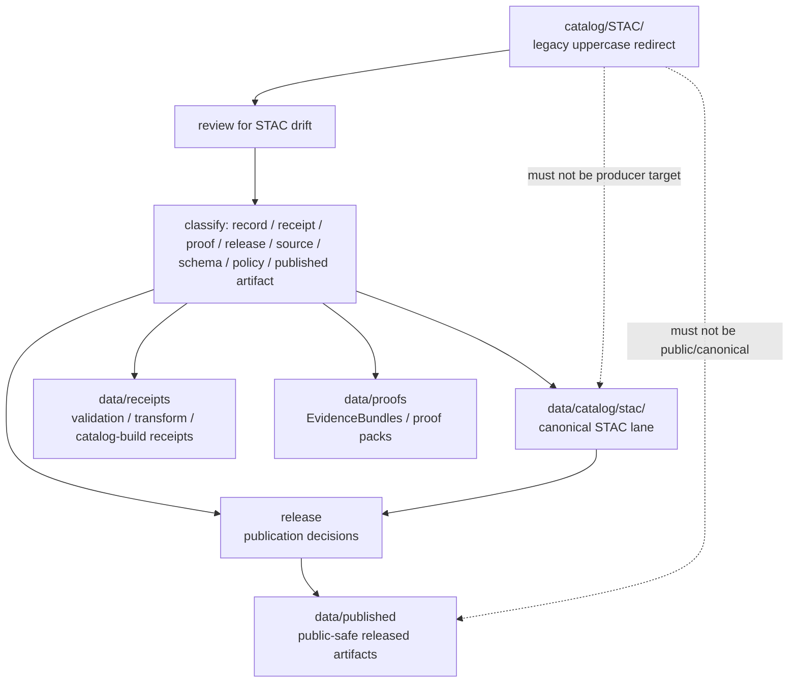

<!-- [KFM_META_BLOCK_V2]
doc_id: kfm://doc/catalog-stac-readme
title: catalog/STAC/ — STAC Compatibility Redirect
type: readme
version: v0.2
status: draft
owners: OWNER_TBD — Catalog steward · STAC steward · Data steward · Source steward · Evidence steward · Release steward · Schema steward · Policy steward · Docs steward
created: 2026-06-16
updated: 2026-07-09
policy_label: public
related:
  - ../README.md
  - ../../data/README.md
  - ../../data/catalog/README.md
  - ../../data/catalog/stac/README.md
  - ../../data/catalog/dcat/README.md
  - ../../data/catalog/prov/README.md
  - ../../data/triplets/README.md
  - ../../data/receipts/README.md
  - ../../data/proofs/README.md
  - ../../data/published/README.md
  - ../../data/registry/README.md
  - ../../release/README.md
  - ../../schemas/contracts/v1/
  - ../../contracts/
  - ../../policy/
  - ../../docs/standards/STAC.md
  - ../../docs/standards/STAC_KFM_PROFILE.md
  - ../../docs/standards/DCAT.md
  - ../../docs/standards/PROV.md
  - ../../docs/doctrine/directory-rules.md
tags: [kfm, catalog, stac, compatibility-root, redirect, data-catalog, spatiotemporal-asset-catalog, non-authoritative, drift-fence, no-trust-records, no-public-use]
notes:
  - "Refreshes the root-level catalog/STAC compatibility-redirect fence."
  - "Root-level catalog/STAC/ is treated as a compatibility and drift-control path only, not canonical STAC authority."
  - "Canonical STAC records belong under data/catalog/stac/ unless a future accepted ADR changes the catalog authority model."
  - "The uppercase STAC path is retained only as a legacy/path-drift guard; prefer lowercase data/catalog/stac/ for canonical machine paths."
  - "Do not add STAC Catalogs, Collections, Items, assets, links, source descriptors, receipts, proofs, release records, policy rules, schemas, published artifacts, or generated catalog indexes here without an ADR/migration note."
  - "Actual current contents beyond this README, historical producers, workflow writes, migration status, CI/review enforcement, lowercase-path acceptance, and ADR disposition remain NEEDS VERIFICATION."
  - "v0.2 adds current evidence basis, Directory Rules placement basis, canonical STAC lane alignment, minimum safe redirect slice, anti-bypass matrix, no-producer/no-public-use/no-trust-record safeguards, and validation/rollback guidance without claiming migration or enforcement maturity."
[/KFM_META_BLOCK_V2] -->

<a id="top"></a>

<div align="center">

# STAC Compatibility Redirect

`catalog/STAC/`

**Root-level compatibility and drift-control fence for legacy or accidental uppercase STAC placement. Canonical KFM STAC records belong under `data/catalog/stac/`, not under this root-level folder.**


[Evidence](#0-evidence-basis-for-this-revision) · [Purpose](#1-purpose) · [Canonical home](#2-canonical-home) · [Boundary](#3-authority-boundary) · [Allowed](#5-allowed-contents) · [Forbidden](#6-forbidden-contents) · [Migration](#10-migration-posture) · [Definition of done](#17-definition-of-done)

</div>

---

> [!IMPORTANT]
> **Status:** draft / `NEEDS VERIFICATION`  
> **Path:** `catalog/STAC/README.md`  
> **Responsibility root:** compatibility redirect / drift fence only  
> **Canonical STAC home:** `data/catalog/stac/`  
> **Directory Rules basis:** file location encodes ownership, governance, and lifecycle. STAC catalog records are lifecycle catalog records, so canonical STAC belongs under `data/catalog/stac/`. Root-level `catalog/STAC/` is a compatibility redirect only; it must not become a parallel catalog, schema, policy, proof, receipt, release, source-registry, published-artifact, pipeline, package, tool, or UI authority.  
> **Truth posture:** CONFIRMED current GitHub README path / CONFIRMED parent root-level `catalog/README.md` exists and treats `catalog/` as compatibility redirect / CONFIRMED canonical `data/catalog/README.md` exists and treats catalog as CATALOG-stage data / CONFIRMED canonical `data/catalog/stac/README.md` exists and defines STAC as a CATALOG/TRIPLET sublane with RELEASED ONLY exposure / CONFIRMED `docs/standards/STAC.md` exists and places STAC at CATALOG/TRIPLET / CONFIRMED Directory Rules document exists / PROPOSED root-level `catalog/STAC/` redirect contract / UNKNOWN actual files beyond README, historical producers, workflow writes, migration status, CI/review guard, lowercase-path acceptance, and ADR disposition

> [!CAUTION]
> Do not make `catalog/STAC/` a parallel STAC authority. KFM STAC Catalogs, Collections, Items, assets, links, catalog indexes, validation summaries, and publication-linked catalog records must live in the governed data lifecycle path, especially `data/catalog/stac/`, with receipts, proofs, release records, schemas, contracts, policy, and public-safe outputs in their own owning roots.

---

## Quick jump

- [0. Evidence basis for this revision](#0-evidence-basis-for-this-revision)
- [1. Purpose](#1-purpose)
- [2. Canonical home](#2-canonical-home)
- [3. Authority boundary](#3-authority-boundary)
- [4. Default posture](#4-default-posture)
- [5. Allowed contents](#5-allowed-contents)
- [6. Forbidden contents](#6-forbidden-contents)
- [7. Directory shape](#7-directory-shape)
- [8. Minimum safe redirect slice](#8-minimum-safe-redirect-slice)
- [9. Diagram](#9-diagram)
- [10. Migration posture](#10-migration-posture)
- [11. Runtime and producer anti-bypass matrix](#11-runtime-and-producer-anti-bypass-matrix)
- [12. Inspection path](#12-inspection-path)
- [13. Validation expectations](#13-validation-expectations)
- [14. Safe change pattern](#14-safe-change-pattern)
- [15. Rollback and correction posture](#15-rollback-and-correction-posture)
- [16. Safe language rules](#16-safe-language-rules)
- [17. Definition of done](#17-definition-of-done)
- [18. Open verification items](#18-open-verification-items)

---

## 0. Evidence basis for this revision

This README is a documentation boundary, not migration proof and not catalog enforcement proof. The 2026-07-09 revision updates an existing compatibility README and keeps maturity bounded while aligning the root-level `catalog/STAC/` redirect with the canonical `data/catalog/stac/` STAC lane and Directory Rules placement posture.

| Evidence item | Status | What it supports | What it does not prove |
|---|---|---|---|
| `catalog/STAC/README.md` exists on `main`. | CONFIRMED | This is an existing README update, not a new path proposal. | It does not prove actual contents beyond the README, historical producers, migration status, CI enforcement, or ADR disposition. |
| `catalog/README.md` exists and treats root-level `catalog/` as a compatibility redirect, not canonical catalog authority. | CONFIRMED document presence and redirect posture | `catalog/STAC/` should inherit root-level redirect/fence behavior. | It does not prove all root-level catalog drift has been removed. |
| `data/catalog/README.md` exists and treats `data/catalog/` as CATALOG-stage data with RELEASED ONLY public exposure. | CONFIRMED lifecycle posture | Canonical catalog records belong under the data lifecycle root. | It does not prove current STAC inventory, validators, receipts, policy gates, or public route behavior. |
| `data/catalog/stac/README.md` exists and defines STAC as a CATALOG/TRIPLET sublane with RELEASED ONLY exposure. | CONFIRMED canonical STAC-lane posture | `data/catalog/stac/` is the canonical STAC lane unless an accepted ADR changes the model. | It does not prove concrete STAC records, schemas, validators, receipts, release manifests, or routed access behavior exist. |
| `docs/standards/STAC.md` exists and explains STAC lives at the CATALOG/TRIPLET stage, with EvidenceRef, EvidenceBundle, RunReceipt, SourceDescriptor, spec hash, and policy digests threaded through STAC objects. | CONFIRMED standards posture | STAC is a catalog envelope, not source truth, release approval, or evidence authority. | It does not prove the strict profile, validators, CI gates, or namespace decision are finalized. |
| `docs/doctrine/directory-rules.md` exists and states that file location encodes ownership, governance, and lifecycle. | CONFIRMED placement doctrine | Root-level `catalog/STAC/` must remain a compatibility fence; lifecycle catalog records belong under `data/catalog/stac/`. | It does not prove live repo drift has been fully audited. |

[Back to top](#top)

---

## 1. Purpose

`catalog/STAC/` is a **root-level compatibility redirect** for STAC-specific path drift.

It exists only to prevent accidental, legacy, generated, copied, or externally imported STAC material from becoming a parallel authority outside the KFM lifecycle data root.

This folder should not be used for canonical:

- STAC Catalog records;
- STAC Collection records;
- STAC Item records;
- STAC Asset descriptors;
- STAC links;
- STAC extensions or KFM profile sidecars;
- catalog indexes, summaries, matrices, or search manifests;
- release-linked catalog records;
- validation summaries or receipt-backed catalog outputs.

This README does not prove that any STAC material currently exists here, that migration has been completed, that producer tools avoid this path, that CI blocks writes here, or that any ADR has finalized long-term retention of this compatibility root.

[Back to top](#top)

---

## 2. Canonical home

Canonical STAC material belongs under:

```text
data/catalog/stac/
```

The root-level `catalog/` directory is a redirect/fence, and `data/` is the lifecycle root where catalog material belongs. The preferred canonical path is lower-case for machine-path stability and cross-platform predictability.

```text
catalog/STAC/       # compatibility redirect only; do not add catalog records here
data/catalog/stac/  # canonical STAC catalog lane, subject to lifecycle governance
```

A path that differs only by case can create confusing behavior across operating systems, build systems, object stores, and generated indexes. Treat uppercase `STAC` under root-level `catalog/` as legacy/compatibility vocabulary, not an implementation target.

## 3. Authority boundary

`catalog/STAC/` has **no canonical STAC authority**. It may hold only redirect guidance, migration notes, drift logs, or temporary markers while misplaced STAC material is reviewed and moved into its proper lifecycle home.

```text
WRONG / LEGACY ROOT                  CANONICAL LIFECYCLE HOME              TRUST SUPPORT HOMES
catalog/STAC/                   -->  data/catalog/stac/               -->  data/receipts/
compatibility fence only             STAC Catalog / Collection / Item       data/proofs/
not authoritative                    STAC links / assets / indexes          release/
                                      release-linked catalog records         data/published/
```

A STAC record outside `data/catalog/stac/` should be treated as drift until reviewed and migrated.

## 4. Default posture

Anything found under root-level `catalog/STAC/` should be treated as **NEEDS VERIFICATION** and potentially misplaced.

Do not expose, publish, index, cite, validate as canonical, use as a source of truth, or depend on root-level STAC files as authoritative records. First confirm source, provenance, rights, sensitivity, schema validity, lifecycle state, catalog-stage receipt, evidence/proof support, release state, rollback path, correction path, and migration route.

The safe default is:

```text
found in catalog/STAC/ -> hold as drift -> inspect -> migrate/regenerate under data/catalog/stac/ -> validate -> receipt -> release gate -> publish only through governed path
```

## 5. Allowed contents

| Allowed item | Example | Required posture |
|---|---|---|
| README / redirect docs | `README.md` | Compatibility fence only |
| Migration note | `MIGRATION.md` | Temporary, review-linked, and rollback-aware |
| Drift note | `DRIFT.md`, `OPEN-QUESTIONS.md` | Must point to canonical homes and review steps |
| Placeholder marker | `.gitkeep` | Does not authorize STAC content |
| Removal note | `REMOVED.md` | Must reference migration target, review state, and rollback notes |

## 6. Forbidden contents

| Forbidden here | Correct home |
|---|---|
| STAC Catalogs | `data/catalog/stac/` |
| STAC Collections | `data/catalog/stac/` |
| STAC Items | `data/catalog/stac/` |
| STAC Assets, links, extensions, asset indexes, link indexes, collection summaries | `data/catalog/stac/` or governed catalog support homes |
| CatalogMatrix or STAC/DCAT/PROV closure artifacts | `data/catalog/` under accepted catalog-family lanes |
| DCAT or PROV records | `data/catalog/dcat/`, `data/catalog/prov/`, or accepted sibling lanes |
| Domain catalog records | `data/catalog/domain/` or accepted domain catalog lane |
| Catalog-derived public products | `data/published/` after governed release |
| Source descriptors, source registry rows, rights rows, sensitivity rows | `data/registry/` or governed registry homes |
| Receipts, validation reports, redaction receipts, catalog-build receipts, transform receipts | `data/receipts/` |
| EvidenceBundles, proof packs, attestations | `data/proofs/` |
| ReleaseManifest, PromotionDecision, RollbackCard, CorrectionNotice, signatures | `release/` |
| Schemas and machine-shape contracts | `schemas/contracts/v1/` |
| Human contracts and object-meaning docs | `contracts/` |
| Policy rules and policy decisions | `policy/` and governed policy-decision homes |
| Source code, scripts, packages, pipelines, build tools | `apps/`, `packages/`, `tools/`, `scripts/`, `pipelines/`, `pipeline_specs/` |
| Raw, work, quarantine, processed, or published lifecycle data | `data/` lifecycle subtrees |

## 7. Directory shape

Current implementation inventory remains `NEEDS VERIFICATION`.

```text
catalog/STAC/
├── README.md                 # compatibility redirect / drift fence
├── MIGRATION.md              # PROPOSED only if migration is active
├── DRIFT.md                  # PROPOSED only if misplaced STAC material is found
└── .gitkeep                  # optional marker; does not authorize catalog content
```

> [!WARNING]
> Do not treat this suggested shape as repo fact. Verify actual contents before making inventory, producer, enforcement, or migration claims.

## 8. Minimum safe redirect slice

A smallest safe `catalog/STAC/` state should prove only that the folder prevents drift; it should not contain trust-bearing material.

| Slice item | Minimum requirement | Why it matters |
|---|---|---|
| Redirect README | Points to `data/catalog/stac/` as canonical | Prevents parallel authority |
| No STAC records | No Catalog, Collection, Item, Asset, Link, extension, index, summary, or matrix files | Keeps truth-bearing catalog records in lifecycle root |
| No trust support records | No receipts, proofs, releases, registry rows, policy rules, schemas, contracts, or published artifacts | Preserves responsibility roots |
| Drift procedure | Explains how to inspect and migrate misplaced STAC | Keeps remediation reversible |
| Producer guard | Producers, generators, scripts, and CI should not write durable STAC here | Prevents reintroducing drift |
| Public-use guard | Public clients and indexes must not read from this path as canonical | Preserves governed access path |
| Case guard | Uppercase `STAC` remains compatibility vocabulary only | Avoids path-case instability |
| Verification backlog | Open items stay visible | Prevents documentation from pretending migration/enforcement is complete |

## 9. Diagram



## 10. Migration posture

If STAC files are found here:

1. Do not publish, cite, index, or depend on them.
2. Identify whether they are STAC Catalogs, Collections, Items, assets, links, extensions, catalog indexes, CatalogMatrix records, DCAT/PROV records, receipts, proofs, release records, source registry rows, schemas, policy records, published-output material, generated previews, or temporary build artifacts.
3. Determine whether the file is historical drift, generated drift, copied output, unreviewed local work, or an intentional migration marker.
4. Move or regenerate durable STAC records into `data/catalog/stac/` through a governed migration.
5. Move receipts, proofs, release records, published artifacts, schemas, contracts, policy, source descriptors, and producer code into their owning roots.
6. Normalize canonical machine-path placement to `data/catalog/stac/` unless an accepted ADR says otherwise.
7. Preserve provenance, source refs, digests, receipts, review notes, producer identity, and rollback path.
8. Add a drift register, migration note, or correction note if the misplaced material was previously consumed.
9. Add or update validation checks so producers do not recreate root-level STAC drift.
10. Leave `catalog/STAC/` as a redirect/fence unless an accepted ADR explicitly changes the authority model.

## 11. Runtime and producer anti-bypass matrix

| Bypass risk | Required behavior | Review signal |
|---|---|---|
| Producer writes STAC records to `catalog/STAC/` | Fail review/CI; write to `data/catalog/stac/` instead | Generator config and output paths checked |
| Public client reads root-level STAC | Deny; route through governed catalog/release path | Client/search/index config excludes this path |
| Root-level STAC is treated as canonical | Mark as drift and migrate/regenerate | Migration note references canonical target |
| Receipts/proofs/release records stored here | Move to owning roots | Directory review blocks trust support records |
| Schema/profile file stored here | Move to `schemas/` or standards docs as appropriate | Schema-home review passes |
| Policy rule stored here | Move to `policy/` | Policy-root review passes |
| Published artifact stored here | Move to `data/published/` after release gate | Release/publication review passes |
| Case variant `catalog/STAC` and `data/catalog/stac` both appear in tooling | Canonicalize to lowercase lifecycle path | Build/search config points to `data/catalog/stac/` |
| Drift file already consumed downstream | Add correction/migration note and rollback path | Correction path is auditable |
| README claims CI enforcement without run/check evidence | Mark enforcement `NEEDS VERIFICATION` | Current CI evidence cited before pass claims |

## 12. Inspection path

Actual root-level contents, producers, workflow writes, migration status, CI/review enforcement, and current ADR disposition remain `NEEDS VERIFICATION`.

```bash
find catalog/STAC -maxdepth 6 -type f | sort
find catalog data/catalog data/receipts data/proofs data/published data/registry release schemas contracts policy docs/standards tools scripts pipelines pipeline_specs .github/workflows -maxdepth 6 -type f 2>/dev/null | grep -Ei 'stac|spatiotemporal|catalog|collection|item|asset|link|CatalogBuildReceipt|CatalogMatrix|ReleaseManifest|EvidenceBundle|RunReceipt|SourceDescriptor|dcat|prov|schema|policy|validator|publish|workflow|migration|drift' | sort
```

## 13. Validation expectations

Useful validation for this folder should cover:

- no STAC Catalogs, Collections, Items, assets, links, extensions, indexes, or summaries are stored here;
- no DCAT, PROV, CatalogMatrix, or domain catalog records are stored here;
- no receipts, proofs, release records, registry records, policy rules, schemas, source code, pipelines, tools, or published artifacts are stored here;
- any non-README content is tied to an active migration, drift note, or placeholder marker;
- producer tools, scripts, generated outputs, workflows, indexes, and client configuration do not target `catalog/STAC/` as canonical;
- links point users to `data/catalog/stac/` and other owning roots;
- CI or review checks flag root-level `catalog/STAC/` writes when enforcement exists;
- CI/pass/enforcement state is not claimed without current evidence.

## 14. Safe change pattern

For changes under `catalog/STAC/`:

1. Confirm the change is redirect documentation, migration support, drift documentation, or a non-authoritative placeholder only.
2. Confirm it does not create a parallel STAC catalog authority.
3. Confirm durable STAC records are placed under `data/catalog/stac/`.
4. Confirm receipts, proofs, release records, registry records, schemas, contracts, policy rules, published artifacts, and code are placed under their owning roots.
5. Confirm no public client, search index, map runtime, export job, tile job, story/focus/evidence surface, or catalog producer reads this path as canonical.
6. Document migration, correction, and rollback if any misplaced material was moved or previously consumed.
7. Update docs and validation rules when behavior materially changes.

## 15. Rollback and correction posture

If material was added here by mistake, rollback should be small and auditable:

- remove or revert the misplaced file from `catalog/STAC/`;
- regenerate or move durable catalog records into `data/catalog/stac/` through a governed migration;
- preserve digest/provenance notes for anything already referenced;
- add a correction note if public, semi-public, or generated downstream artifacts consumed the misplaced path;
- update producer configuration and tests so the drift is not recreated.

## 16. Safe language rules

Use these terms carefully:

| Phrase | Allowed here? | Safer wording |
|---|---:|---|
| "canonical STAC record in `catalog/STAC/`" | No | "misplaced or legacy STAC record requiring review" |
| "published from `catalog/STAC/`" | No | "published only after release via canonical lifecycle path" |
| "CI blocks this" | Only with current evidence | "CI guard remains NEEDS VERIFICATION" |
| "migration complete" | Only with migration evidence | "migration status remains NEEDS VERIFICATION" |
| "safe to consume" | Only after release/access evidence | "do not consume as canonical from this path" |

## 17. Definition of done

- [ ] Owners are confirmed and `OWNER_TBD` is replaced.
- [ ] Actual root-level `catalog/STAC/` contents are verified.
- [ ] Any misplaced STAC material is migrated, removed, regenerated under `data/catalog/stac/`, or documented as drift.
- [ ] `data/catalog/stac/` is confirmed as the canonical STAC home in current docs and producer configuration.
- [ ] No trust-bearing records live here.
- [ ] No STAC/DCAT/PROV records, registry records, receipts, proofs, release records, published artifacts, schemas, contracts, policy rules, source code, or lifecycle data live here.
- [ ] No public client, search index, map runtime, export job, tile job, or catalog producer uses this path as canonical.
- [ ] Case-sensitive/case-insensitive path behavior is reviewed where tooling may run on multiple platforms.
- [ ] CI/review behavior is verified or marked `NEEDS VERIFICATION`.
- [ ] Any migration, correction, or rollback path is documented.

## 18. Open verification items

| Item | Why it matters |
|---|---|
| Confirm actual files under root-level `catalog/STAC/` | Prevents overclaiming or missing drift |
| Confirm whether any workflow, script, tool, or producer writes here | Required before producer-safety claims |
| Confirm whether any public client, index, export path, map layer, or catalog service reads here | Required before public-use claims |
| Confirm migration status to `data/catalog/stac/` | Required before canonical-home claims beyond doctrine |
| Confirm lowercase path convention is accepted in current ADRs/tooling | Required before finalizing migration guidance |
| Confirm CI/review guard exists and has current pass evidence | Required before enforcement claims |
| Confirm no trust records are stored here | Required before Directory Rules compliance claims |
| Confirm ADR status for root-level `catalog/STAC/` | Required before long-term retention claims |
| Confirm STAC profile namespace decision | Required before strict profile or schema claims |
| Confirm validators and schema bindings | Required before record-validity claims |

<details>
<summary>Appendix A — no-loss preservation note</summary>

The previous README already treated `catalog/STAC/` as a STAC-specific redirect and anti-parallel-authority contract. This revision preserves that posture, refreshes metadata, adds a current evidence-basis section, adds Directory Rules placement posture, aligns the redirect with `catalog/`, `data/catalog/`, `data/catalog/stac/`, and `docs/standards/STAC.md`, strengthens no-trust-record, no-producer, no-public-use, case-safety, migration, validation, correction, rollback, and anti-bypass safeguards, and keeps migration/enforcement claims bounded. It does not claim actual file inventory, migration work, CI enforcement, producer workflow behavior, lowercase path acceptance, STAC validator/profile maturity, or ADR disposition are implemented.

</details>

## Status summary

`catalog/STAC/` is a root-level compatibility redirect and STAC drift fence. It is not the canonical STAC catalog home.

STAC authority belongs under `data/catalog/stac/`; trust-bearing support belongs under `data/receipts/`, `data/proofs/`, and `release/`; released public-safe products belong under `data/published/`.

<p align="right"><a href="#top">Back to top</a></p>
