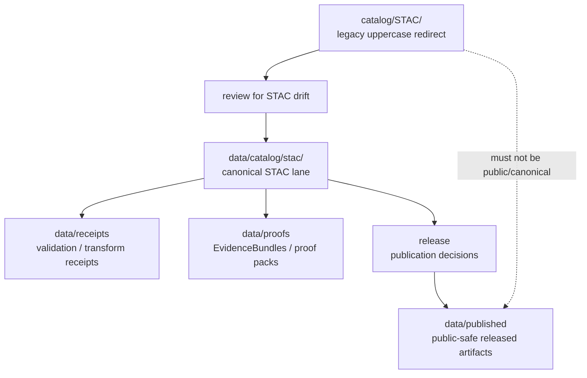

<!-- [KFM_META_BLOCK_V2]
doc_id: kfm://doc/catalog-stac-readme
title: catalog/STAC/ — STAC Compatibility Redirect
type: readme
version: v0.1
status: draft
owners: OWNER_TBD — Catalog steward · STAC steward · Data steward · Source steward · Docs steward
created: 2026-06-16
updated: 2026-06-16
policy_label: public
related:
  - ../README.md
  - ../../data/README.md
  - ../../data/catalog/README.md
  - ../../data/catalog/stac/README.md
  - ../../data/receipts/README.md
  - ../../data/proofs/README.md
  - ../../data/published/README.md
  - ../../data/registry/README.md
  - ../../release/README.md
  - ../../schemas/contracts/v1/
  - ../../contracts/
  - ../../policy/
  - ../../docs/doctrine/directory-rules.md
tags: [kfm, catalog, stac, compatibility-root, redirect, data-catalog, spatio-temporal-asset-catalog, non-authoritative, drift-fence]
notes:
  - "Root-level catalog/STAC/ is treated as a compatibility/redirect fence, not canonical STAC authority."
  - "Canonical STAC material belongs under data/catalog/stac/ unless a future ADR changes the catalog authority model."
  - "The uppercase STAC path is retained only as a legacy/path-drift guard; prefer lower-case data/catalog/stac/ for canonical machine paths."
  - "Do not add STAC Collections, Items, Catalogs, source descriptors, receipts, proofs, release records, or published artifacts here without an ADR/migration note."
  - "Specific current contents, producers, migration status, and CI enforcement remain NEEDS VERIFICATION."
[/KFM_META_BLOCK_V2] -->

<a id="top"></a>

<div align="center">

# STAC Compatibility Redirect

`catalog/STAC/`

**Compatibility / redirect fence for legacy or accidental root-level STAC placement. Canonical STAC records belong under `data/catalog/stac/`, not this root-level `catalog/STAC/` folder.**


[Purpose](#1-purpose) · [Canonical home](#2-canonical-home) · [Authority boundary](#3-authority-boundary) · [Allowed contents](#5-allowed-contents) · [Forbidden contents](#6-forbidden-contents) · [Migration](#9-migration-posture) · [Definition of done](#12-definition-of-done)

</div>

---

> [!IMPORTANT]
> **Status:** draft / `NEEDS VERIFICATION`  
> **Path:** `catalog/STAC/README.md`  
> **Responsibility root:** compatibility redirect / drift fence only  
> **Canonical STAC home:** `data/catalog/stac/`  
> **Truth posture:** CONFIRMED README path / CONFIRMED root-level `catalog/` is a compatibility redirect / CONFIRMED `data/` lifecycle root lists `catalog` as belonging under `data/` / CONFIRMED `data/catalog/stac/README.md` path exists as a stub / PROPOSED `catalog/STAC/` redirect contract / UNKNOWN current STAC files, historical producers, migration status, CI enforcement, and ADR disposition

> [!CAUTION]
> Do not make `catalog/STAC/` a parallel STAC authority. KFM STAC Collections, Items, Catalogs, assets, links, catalog indexes, and publication state must live in the governed data lifecycle path, especially `data/catalog/stac/`, with receipts/proofs/release records in their own canonical roots.

---

## 1. Purpose

`catalog/STAC/` is a **root-level compatibility redirect** for STAC-specific path drift.

It exists only to prevent accidental or legacy STAC material from becoming a parallel authority outside the KFM lifecycle data root. This folder should not be used for canonical STAC Collections, STAC Items, STAC Catalogs, STAC extensions, or STAC-derived indexes.

This README does not prove that any STAC material currently exists here, that a migration has been completed, or that CI currently blocks writes to this path.

[Back to top](#top)

---

## 2. Canonical home

Canonical STAC material belongs under:

```text
data/catalog/stac/
```

The root-level `catalog/` directory is a redirect/fence, and `data/` is the lifecycle root where catalog material belongs. The preferred canonical path is lower-case for machine-path stability.

```text
catalog/STAC/       # compatibility redirect only; do not add catalog records here
data/catalog/stac/  # canonical STAC catalog lane, subject to lifecycle governance
```

## 3. Authority boundary

`catalog/STAC/` has **no canonical STAC authority**. It may hold only README guidance, migration notes, drift logs, or temporary redirect markers while STAC material is moved into its proper lifecycle home.

```text
WRONG / LEGACY ROOT                CANONICAL LIFECYCLE HOME                 TRUST SUPPORT HOMES
catalog/STAC/                 -->  data/catalog/stac/                  -->  data/receipts/
compatibility fence only           STAC Catalog / Collection / Item         data/proofs/
not authoritative                  STAC links / assets / indexes            release/
                                                                            data/published/
```

A STAC record outside `data/catalog/stac/` should be treated as drift until reviewed and migrated.

## 4. Default posture

Anything found under root-level `catalog/STAC/` should be treated as **NEEDS VERIFICATION** and potentially misplaced.

Do not expose, publish, index, cite, or depend on root-level STAC files as canonical records. First confirm source, provenance, rights, sensitivity, schema validity, lifecycle state, receipts, proofs, release state, rollback path, and correction path.

## 5. Allowed contents

| Allowed item | Example | Required posture |
|---|---|---|
| README / redirect docs | `README.md` | Compatibility fence only |
| Migration note | `MIGRATION.md` | Temporary and ADR/review-linked |
| Drift note | `DRIFT.md`, `OPEN-QUESTIONS.md` | Must point to canonical homes and review steps |
| Placeholder marker | `.gitkeep` | Does not authorize STAC content |

## 6. Forbidden contents

| Forbidden here | Correct home |
|---|---|
| STAC Catalogs | `data/catalog/stac/` |
| STAC Collections | `data/catalog/stac/` |
| STAC Items | `data/catalog/stac/` |
| STAC extensions, asset indexes, link indexes, collection summaries | `data/catalog/stac/` or governed catalog support homes |
| DCAT or PROV records | `data/catalog/` under their proper family lanes |
| Catalog-derived public products | `data/published/` after governed release |
| Source descriptors, source registry rows, rights rows, sensitivity rows | `data/registry/` or governed registry homes |
| Receipts, validation reports, redaction receipts | `data/receipts/` |
| EvidenceBundles, proof packs, attestations | `data/proofs/` |
| ReleaseManifest, PromotionDecision, RollbackCard, CorrectionNotice, signatures | `release/` |
| Schemas and machine-shape contracts | `schemas/contracts/v1/` |
| Human contracts and object-meaning docs | `contracts/` |
| Policy rules and policy decisions | `policy/` and governed policy-decision homes |
| Source code, scripts, packages, pipelines, build tools | `apps/`, `packages/`, `tools/`, `scripts/`, `pipelines/` |
| Raw, work, quarantine, processed, or published lifecycle data | `data/` lifecycle subtrees |

## 7. Directory shape

Current implementation inventory remains `NEEDS VERIFICATION`.

```text
catalog/STAC/
├── README.md                 # compatibility redirect / drift fence
├── MIGRATION.md              # PROPOSED only if migration is active
└── DRIFT.md                  # PROPOSED only if misplaced STAC material is found
```

> [!WARNING]
> Do not treat this suggested shape as repo fact. Verify actual contents before making inventory or migration claims.

## 8. Diagram



## 9. Migration posture

If STAC files are found here:

1. Do not publish or depend on them.
2. Identify whether they are STAC Catalogs, STAC Collections, STAC Items, STAC assets, indexes, DCAT/PROV records, receipts, proofs, release records, source registry rows, or published-output material.
3. Move or regenerate them into the correct owning root through a governed migration.
4. Normalize canonical machine-path placement to `data/catalog/stac/` unless an ADR says otherwise.
5. Preserve provenance, source refs, digests, receipts, review notes, and rollback path.
6. Add a drift register or migration note if the material has already been consumed.
7. Leave root-level `catalog/STAC/` as a redirect/fence unless an ADR explicitly says otherwise.

## 10. Validation expectations

Useful validation for this folder should cover:

- no STAC Catalogs, Collections, Items, extensions, or indexes are stored here;
- no receipts, proofs, release records, registry records, policy rules, schemas, source code, or published artifacts are stored here;
- any non-README content is tied to an active migration or drift note;
- CI or review checks flag root-level `catalog/STAC/` writes;
- links point users to `data/catalog/stac/` and other canonical homes.

## 11. Safe change pattern

For changes under `catalog/STAC/`:

1. Confirm the change is redirect documentation, migration support, or drift documentation only.
2. Confirm it does not create a parallel STAC catalog authority.
3. Confirm durable STAC records are placed under `data/catalog/stac/`.
4. Confirm receipts/proofs/release records are placed under their owning roots.
5. Document migration and rollback if any misplaced material was moved.
6. Update docs and validation rules when behavior materially changes.

## 12. Definition of done

- [ ] Owners are confirmed and `OWNER_TBD` is replaced.
- [ ] Actual root-level `catalog/STAC/` contents are verified.
- [ ] Any misplaced STAC material is migrated or documented as drift.
- [ ] `data/catalog/stac/` is confirmed as the canonical STAC home in current docs.
- [ ] No trust-bearing records live here.
- [ ] No STAC/DCAT/PROV records, registry records, receipts, proofs, release records, published artifacts, schemas, contracts, policy rules, source code, or lifecycle data live here.
- [ ] CI/review behavior is verified or marked `NEEDS VERIFICATION`.

## 13. Open verification items

| Item | Why it matters |
|---|---|
| Confirm actual files under root-level `catalog/STAC/` | Prevents overclaiming or missing drift |
| Confirm whether any workflow writes here | Required before producer claims |
| Confirm migration status to `data/catalog/stac/` | Required before canonical-home claims beyond doctrine |
| Confirm lowercase path convention is accepted | Required before finalizing migration guidance |
| Confirm CI/review guard exists | Required before enforcement claims |
| Confirm no trust records are stored here | Required before Directory Rules compliance claims |
| Confirm ADR status for root-level `catalog/STAC/` | Required before long-term retention claims |

<details>
<summary>Appendix A — no-loss preservation note</summary>

The previous README was empty. This replacement adds a STAC-specific redirect and anti-parallel-authority contract without claiming STAC files, migration work, CI enforcement, producer workflows, lowercase path acceptance, or ADR disposition are implemented.

</details>

## Status summary

`catalog/STAC/` is a root-level compatibility redirect and STAC drift fence. It is not the canonical STAC catalog home.

STAC authority belongs under `data/catalog/stac/`; trust-bearing support belongs under `data/receipts/`, `data/proofs/`, and `release/`; released public-safe products belong under `data/published/`.

<p align="right"><a href="#top">Back to top</a></p>
