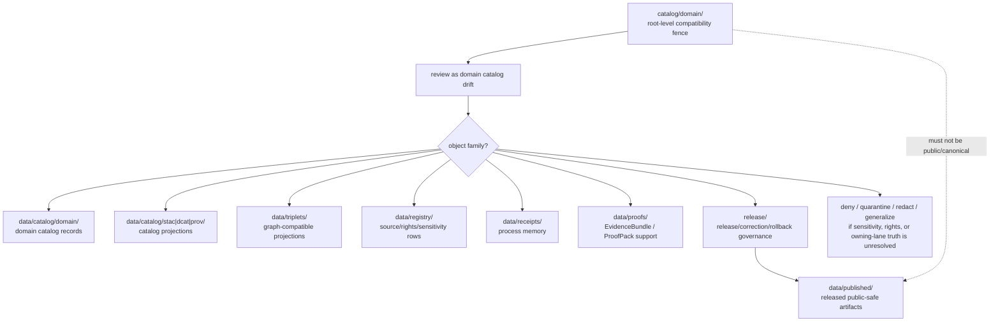

<!-- [KFM_META_BLOCK_V2]
doc_id: kfm://doc/catalog-domain-readme
title: catalog/domain/ — Domain Catalog Compatibility Redirect
type: readme
version: v0.2
status: draft
owners: OWNER_TBD — Catalog steward · Domain steward · Data steward · Registry steward · Evidence steward · Receipt steward · Proof steward · Release steward · Policy steward · Schema steward · Docs steward
created: 2026-06-16
updated: 2026-07-10
policy_label: public
related:
  - ../README.md
  - ../../data/README.md
  - ../../data/catalog/README.md
  - ../../data/catalog/domain/README.md
  - ../../data/triplets/README.md
  - ../../data/receipts/README.md
  - ../../data/proofs/README.md
  - ../../data/published/README.md
  - ../../data/registry/README.md
  - ../../release/README.md
  - ../../schemas/contracts/v1/
  - ../../contracts/
  - ../../policy/
  - ../../docs/adr/ADR-0011-receipts-vs-proofs-vs-manifests-vs-catalog-separation.md
  - ../../docs/doctrine/directory-rules.md
tags: [kfm, catalog, domain, compatibility-root, redirect, data-catalog-domain, domain-catalog, catalog-triplet, receipt-proof-catalog-publication-separation, non-authoritative, drift-fence, no-public-use]
notes:
  - "Refreshes the root-level catalog/domain/ compatibility-redirect fence."
  - "Root-level catalog/domain/ is compatibility and drift-control documentation only, not canonical domain catalog authority, domain index authority, source authority, registry authority, receipt authority, proof authority, release authority, publication authority, schema authority, policy authority, producer authority, hosting authority, search authority, or UI authority."
  - "Canonical domain catalog records and indexes belong under data/catalog/domain/; graph-compatible relationship projections belong under data/triplets/; source/rights/sensitivity registry rows belong under data/registry/; receipts belong under data/receipts/; proof support belongs under data/proofs/; release-governance records belong under release/; published delivery artifacts belong under data/published/ after governed release."
  - "Child domain paths under root-level catalog/domain/ are compatibility redirects and drift-control fences unless an accepted ADR or migration note says otherwise."
  - "Child README refreshes may exist in separate draft PRs; do not treat branch state as merged main state until verified on the target ref."
  - "ADR-0011 is proposed and is used here only as separation evidence, not accepted-rule proof."
  - "Do not add domain catalog records, domain indexes, domain manifests, source descriptors, registry rows, EvidenceBundles, receipts, release records, published artifacts, schemas, policy rules, generated outputs, public artifacts, or producer targets here without an ADR/migration note."
  - "Actual current contents beyond README files, historical producers, workflow writes, migration status, CI/review enforcement, public-client/producer exclusion, hosting readiness, domain catalog schema maturity, STAC/DCAT/PROV/triplet closure, access-control maturity, and ADR disposition remain NEEDS VERIFICATION."
  - "v0.2 adds current evidence basis, Directory Rules placement basis, canonical data/catalog/domain alignment, child redirect family map, domain-specific safety reminders, related-family separation, minimum safe redirect slice, anti-bypass matrix, migration/rollback posture, and safe language rules without claiming migration or enforcement maturity."
[/KFM_META_BLOCK_V2] -->

<a id="top"></a>

<div align="center">

# Domain Catalog Compatibility Redirect

`catalog/domain/`

**Root-level compatibility and drift-control fence for legacy or accidental domain-catalog placement. Canonical domain catalog records belong under `data/catalog/domain/`; related registry, receipt, proof, release, triplet, and published artifact families stay in their own owning roots.**


[Evidence](#0-evidence-basis-for-this-revision) · [Purpose](#1-purpose) · [Canonical homes](#2-canonical-homes) · [Boundary](#3-authority-boundary) · [Child lanes](#8-child-redirect-lanes) · [Migration](#11-migration-posture) · [Definition of done](#18-definition-of-done)

</div>

---

> [!IMPORTANT]
> **Status:** draft / `NEEDS VERIFICATION`  
> **Path:** `catalog/domain/README.md`  
> **Responsibility root:** compatibility redirect / drift fence only  
> **Canonical domain catalog home:** `data/catalog/domain/`  
> **Parent catalog home:** `data/catalog/`  
> **Triplet home:** `data/triplets/`  
> **Registry home:** `data/registry/`  
> **Receipt home:** `data/receipts/`  
> **Proof home:** `data/proofs/`  
> **Release-governance home:** `release/`  
> **Published artifact home:** `data/published/`  
> **Directory Rules basis:** file location encodes ownership, governance, and lifecycle. Root-level `catalog/domain/` is a compatibility redirect only and must not become a parallel domain catalog, domain index, source, registry, STAC, DCAT, PROV, triplet, receipt, proof, release, publication, schema, policy, pipeline, package, tool, search, hosting, or UI authority.  
> **Truth posture:** CONFIRMED current GitHub README path / CONFIRMED `catalog/README.md` on `main` treats root-level `catalog/` as a compatibility redirect and drift-control fence / CONFIRMED `data/catalog/README.md` treats `data/catalog/` as CATALOG-stage lifecycle lane with RELEASED ONLY exposure / CONFIRMED `data/catalog/domain/README.md` treats `data/catalog/domain/` as the canonical domain catalog index / CONFIRMED Directory Rules document exists / PROPOSED root-level `catalog/domain/` redirect contract / UNKNOWN actual files beyond README files, complete child-lane inventory, historical producers, workflow writes, migration status, domain catalog schema maturity, STAC/DCAT/PROV/triplet closure, CI/review guard, public-client/producer exclusion, access-control maturity, hosting readiness, and ADR disposition

> [!CAUTION]
> Do not make `catalog/domain/` a parallel domain catalog authority. Domain catalog records belong under `data/catalog/domain/`; source/rights/sensitivity rows belong under `data/registry/`; receipts, proofs, release decisions, graph/triplet payloads, published artifacts, schemas, contracts, policies, source code, generated previews, and unpublished lifecycle data stay in their own owning roots.

---

## Quick jump

- [0. Evidence basis for this revision](#0-evidence-basis-for-this-revision)
- [1. Purpose](#1-purpose)
- [2. Canonical homes](#2-canonical-homes)
- [3. Authority boundary](#3-authority-boundary)
- [4. Default posture](#4-default-posture)
- [5. Allowed contents](#5-allowed-contents)
- [6. Forbidden contents](#6-forbidden-contents)
- [7. Directory shape](#7-directory-shape)
- [8. Child redirect lanes](#8-child-redirect-lanes)
- [9. Domain-specific guardrails](#9-domain-specific-guardrails)
- [10. Minimum safe redirect slice](#10-minimum-safe-redirect-slice)
- [11. Migration posture](#11-migration-posture)
- [12. Runtime and producer anti-bypass matrix](#12-runtime-and-producer-anti-bypass-matrix)
- [13. Diagram](#13-diagram)
- [14. Inspection path](#14-inspection-path)
- [15. Validation expectations](#15-validation-expectations)
- [16. Safe change pattern](#16-safe-change-pattern)
- [17. Rollback and correction posture](#17-rollback-and-correction-posture)
- [18. Definition of done](#18-definition-of-done)
- [19. Open verification items](#19-open-verification-items)
- [20. Safe language rules](#20-safe-language-rules)

---

## 0. Evidence basis for this revision

This README is a documentation boundary, not migration proof, catalog-schema proof, child-lane inventory proof, access-control proof, sensitivity-review proof, STAC/DCAT/PROV closure proof, triplet-closure proof, release approval proof, publication-hosting proof, or CI enforcement proof. The 2026-07-10 revision updates an existing compatibility README and keeps maturity bounded while aligning root-level `catalog/domain/` with the canonical `data/catalog/domain/` domain catalog index, the `data/catalog/` catalog-stage lifecycle lane, the `data/triplets/` graph projection lane, the separate `data/registry/` registry root, the separate `data/receipts/` process-memory root, the separate `data/proofs/` proof-support root, the `release/` release-governance root, the `data/published/` published-artifact lane, and Directory Rules placement posture.

| Evidence item | Status | What it supports | What it does not prove |
|---|---|---|---|
| `catalog/domain/README.md` exists on `main`. | CONFIRMED | This is an existing README update, not a new path proposal. | It does not prove actual contents beyond the README, historical producers, migration status, CI enforcement, public-client exclusion, hosting readiness, or ADR disposition. |
| `catalog/README.md` exists on `main` and treats root-level `catalog/` as a compatibility redirect and drift-control fence. | CONFIRMED parent redirect posture | `catalog/domain/` should inherit root-level compatibility behavior. | It does not prove all root-level catalog drift has been removed or that child redirect PRs are merged. |
| `data/catalog/README.md` exists and treats `data/catalog/` as the CATALOG-stage lifecycle lane with RELEASED ONLY exposure. | CONFIRMED canonical catalog-stage posture | Canonical catalog records belong under `data/catalog/`. | It does not prove concrete catalog inventory, schemas, validators, receipts, policy gates, release manifests, or public route behavior. |
| `data/catalog/domain/README.md` exists and treats `data/catalog/domain/` as the domain catalog index. | CONFIRMED canonical domain catalog index posture | Domain-scoped catalog records and indexes belong under `data/catalog/domain/`. | It does not prove complete child-lane inventory, child README maturity, schema validity, access controls, or release state. |
| `data/registry/README.md`, `data/receipts/README.md`, `data/proofs/README.md`, `data/published/README.md`, and `release/README.md` exist. | CONFIRMED related-root posture from prior checks | Registry, receipt, proof, published, and release families remain separate from this redirect path. | Their presence does not prove emitted record inventories, validation, public route behavior, or release readiness. |
| `docs/adr/ADR-0011-receipts-vs-proofs-vs-manifests-vs-catalog-separation.md` exists and states the proposed separation rule `receipt ≠ proof ≠ catalog ≠ publication`. | CONFIRMED ADR document presence; PROPOSED decision status | Supports family-separation language while keeping ADR acceptance bounded. | It does not prove ADR acceptance or validator enforcement. |
| `docs/doctrine/directory-rules.md` exists and states that file location encodes ownership, governance, and lifecycle. | CONFIRMED placement doctrine | Root-level `catalog/domain/` must remain a compatibility fence; catalog, registry, receipt, proof, release, triplet, and published records belong under their owning roots. | It does not prove live repo drift has been fully audited. |

[Back to top](#top)

---

## 1. Purpose

`catalog/domain/` is a **root-level compatibility redirect** for domain-catalog path drift.

It exists only to prevent accidental, legacy, generated, copied, or externally imported domain catalog-family material from becoming a parallel authority outside KFM's governed lifecycle, registry, proof, receipt, release, triplet, and publication roots.

This folder should not be used for canonical:

- domain catalog records, domain indexes, domain manifests, domain crosswalks, or catalog closure records;
- source descriptors, rights rows, sensitivity rows, dataset rows, source registry rows, or source activation records;
- EvidenceBundles, ProofPacks, receipts, release records, published artifacts, STAC/DCAT/PROV projections, graph/triplet payloads, schemas, policy rules, contracts, code, generated previews, or public-hosting material;
- sensitive-domain details such as exact rare-species locations, restricted fauna/flora occurrences, archaeology/cultural heritage locations, people/DNA/land data, critical infrastructure, emergency-response context, private-well detail, or other exposure-sensitive records.

This README does not prove that a migration has been completed, that CI blocks writes to this path, that every child lane has been audited, or that root-level child READMEs are current on `main`.

[Back to top](#top)

---

## 2. Canonical homes

Canonical domain catalog material belongs under:

```text
data/catalog/domain/
```

The parent catalog-stage lifecycle lane is:

```text
data/catalog/
```

Graph-compatible relationship projections belong under:

```text
data/triplets/
```

Source, rights, sensitivity, registry, process-memory, proof, release, and public delivery families belong under their own roots:

```text
data/registry/
data/receipts/
data/proofs/
release/
data/published/
```

The root-level `catalog/domain/` directory is a redirect/fence only.

```text
catalog/domain/        # compatibility redirect only; do not add domain catalog-family records here
data/catalog/domain/   # canonical domain catalog index and child domain catalog records
data/catalog/          # parent CATALOG-stage data lane
data/triplets/         # graph-compatible relationship projections
```

If a future accepted ADR or migration changes domain catalog placement, this README should be updated to cite the accepted target, producer-configuration evidence, validation evidence, release review evidence, and any migration, correction, or rollback records.

## 3. Authority boundary

`catalog/domain/` has **no canonical domain catalog authority**, **no domain index authority**, **no source authority**, **no registry authority**, **no receipt authority**, **no proof authority**, **no release authority**, **no publication authority**, and **no schema/policy/producer authority**. It may hold only redirect guidance, migration notes, drift logs, or temporary markers while misplaced material is reviewed and moved into its proper owning root.

```text
WRONG / LEGACY ROOT          DOMAIN CATALOG HOME          SUPPORT AND RELEASE HOMES
catalog/domain/        -->   data/catalog/domain/    -->  data/registry/
compatibility fence only     domain catalog records       data/receipts/
not authoritative            indexes / closure refs       data/proofs/
                                                        release/
                                                        data/published/
```

A domain catalog record outside `data/catalog/domain/` should be treated as domain-catalog drift. A source or rights row outside `data/registry/`, a receipt outside `data/receipts/`, a proof outside `data/proofs/`, a release record outside `release/`, a graph/triplet payload outside `data/triplets/`, or a public artifact outside `data/published/` should be treated as family drift until reviewed and migrated.

## 4. Default posture

Anything found under root-level `catalog/domain/` should be treated as **NEEDS VERIFICATION** and potentially misplaced.

Do not expose, publish, index, cite, search, cache, export, tile, host, or depend on root-level domain catalog files as canonical records. First confirm domain, object family, source role, provenance, rights, sensitivity, public-geometry posture, schema validity, policy decision, lifecycle state, receipt support, proof support, catalog closure, release state, digest/sidecar integrity, rollback path, correction path, and whether the object is actually a catalog record, registry row, receipt, proof, release-governance record, published artifact, triplet projection, or unpublished candidate.

## 5. Allowed contents

| Allowed item | Example | Required posture |
|---|---|---|
| README / redirect docs | `README.md` | Compatibility fence only |
| Migration note | `MIGRATION.md` | Temporary and ADR/review-linked |
| Drift note | `DRIFT.md`, `OPEN-QUESTIONS.md` | Must point to canonical homes and review steps |
| Placeholder marker | `.gitkeep` | Does not authorize catalog, source, proof, receipt, release, policy, schema, triplet, or public-output content |

## 6. Forbidden contents

| Forbidden here | Correct home |
|---|---|
| Domain catalog records, domain indexes, domain manifests, catalog closure records, CatalogMatrix records, discovery records | `data/catalog/domain/` or accepted catalog-family lanes under `data/catalog/` |
| Domain-specific child catalog records for atmosphere, fauna, flora, geology, habitat, hazards, hydrology, soil, people, roads, settlements, archaeology, agriculture, or other domains | `data/catalog/domain/<domain>/` or accepted child lanes under it |
| STAC, DCAT, PROV records | `data/catalog/` under their proper projection lanes |
| Graph/triplet payloads, relationship bundles, graph indexes, relationship projections | `data/triplets/` |
| Source descriptors, source registry rows, dataset rows, rights rows, sensitivity rows, source/domain crosswalk rows | `data/registry/` or governed registry homes |
| Receipts, catalog-build receipts, validation receipts, redaction/generalization receipts, AI receipts, release dry-run receipts, rollback receipts, migration receipts | `data/receipts/` |
| EvidenceBundles, ProofPacks, attestations, citation-validation bundles, release-readiness proof, rollback proof, correction proof, claim-support records | `data/proofs/` |
| ReleaseManifest, PromotionDecision, release decision, RollbackCard, CorrectionNotice, withdrawal, supersession, signature, release-state record | `release/` |
| Released artifacts, public-safe layers, reports, stories, downloads, API payload snapshots, public indexes, allowlists, caveat summaries, digest sidecars, tiles, PMTiles | `data/published/` after governed release |
| Sensitive domain details, restricted locations, living-person data, precise protected-resource context, critical infrastructure, emergency-response detail | Governed lifecycle/proof/policy/review homes with redaction/generalization/staged access; never this compatibility path |
| Schemas and machine-shape contracts | `schemas/contracts/v1/` or accepted schema root |
| Human contracts and object-meaning docs | `contracts/` |
| Policy rules and policy decisions | `policy/` and governed policy-decision homes |
| Source code, scripts, packages, pipelines, build tools, producers, preview generators | `apps/`, `packages/`, `tools/`, `scripts/`, `pipelines/` |
| RAW, WORK, QUARANTINE, PROCESSED, CATALOG, TRIPLET, unpublished candidate, or restricted lifecycle data | `data/` lifecycle subtrees |

## 7. Directory shape

Current implementation inventory remains `NEEDS VERIFICATION`.

```text
catalog/domain/
├── README.md                 # compatibility redirect / drift fence
├── MIGRATION.md              # PROPOSED only if migration is active
├── DRIFT.md                  # PROPOSED only if misplaced domain catalog material is found
└── <domain>/README.md        # compatibility child redirect only; verify each child independently
```

> [!WARNING]
> Do not treat this suggested shape as complete repo inventory. Verify actual contents before making inventory, producer, enforcement, catalog-schema, access-control, sensitivity-review, public-client, hosting, or migration claims.

## 8. Child redirect lanes

The root-level child lanes under `catalog/domain/` are compatibility redirects when present. They do not become canonical because they exist. Canonical domain catalog child lanes belong under `data/catalog/domain/`.

| Root-level child path | Canonical target pattern | Parent posture |
|---|---|---|
| `catalog/domain/agriculture/` | `data/catalog/domain/agriculture/` | Agriculture domain catalog redirect; inventory and release state require verification. |
| `catalog/domain/archaeology/` | `data/catalog/domain/archaeology/` | Sensitive archaeology/cultural-heritage redirect; exact-sensitive material must fail closed. |
| `catalog/domain/atmosphere/` | `data/catalog/domain/atmosphere/` | Atmosphere catalog redirect; AQI/concentration/model/forecast source-role separation must hold. |
| `catalog/domain/fauna/` | `data/catalog/domain/fauna/` | Fauna catalog redirect; restricted/public occurrence lanes and geoprivacy must not collapse. |
| `catalog/domain/flora/` | `data/catalog/domain/flora/` | Flora catalog redirect; rare/protected/culturally sensitive plant exposure must fail closed. |
| `catalog/domain/geology/` | `data/catalog/domain/geology/` | Geology catalog redirect; occurrence/deposit/reserve/permit/model roles must not collapse. |
| `catalog/domain/habitat/` | `data/catalog/domain/habitat/` | Habitat catalog redirect; ecoregions are context and owning-lane truth must remain visible. |
| `catalog/domain/hazards/` | `data/catalog/domain/hazards/` | Hazards catalog redirect; KFM is not an emergency alerting or life-safety instruction system. |
| `catalog/domain/hydrology/` | `data/catalog/domain/hydrology/` | Hydrology catalog redirect; observed/regulatory/modeled roles and NFHL regulatory-only posture must hold. |
| `catalog/domain/people-dna-land/` | `data/catalog/domain/people-dna-land/` | Restricted people/DNA/land redirect; consent, rights, living-person, and land-title boundaries are mandatory. |
| `catalog/domain/people/` | `data/catalog/domain/people/` or accepted compatibility target | Short-segment compatibility lane; must not replace people/DNA/land governance. |
| `catalog/domain/roads-rail-trade/` | `data/catalog/domain/roads-rail-trade/` | Roads/Rail/Trade redirect; route, network, closure, story-node, and source-role boundaries must hold. |
| `catalog/domain/settlements-infrastructure/` | `data/catalog/domain/settlements-infrastructure/` | Settlements/Infrastructure redirect; critical-infrastructure exposure requires review. |
| `catalog/domain/settlement/` | accepted settlement compatibility target | Short-segment compatibility lane; does not replace Settlements/Infrastructure without ADR. |
| `catalog/domain/soil/` | `data/catalog/domain/soil/` | Soil catalog redirect; SSURGO/gSSURGO/interpretation support types must remain distinct. |

This table is an orientation map, not a completeness claim. Each child path must be fetched and reviewed before claims are made about its current README version, actual files, drift state, CI enforcement, producer exclusion, or migration status.

## 9. Domain-specific guardrails

Domain catalog drift is risky because domain indexes can look safe even when they hide source-role, rights, sensitivity, or release-state problems. Any material found here must preserve the owning domain's truth boundaries before it is migrated or used.

| Guardrail | Required posture |
|---|---|
| Catalog carrier is not claim truth | A catalog entry supports discovery and closure; it does not make a claim true, public, or release-approved by placement. |
| Child lane posture survives migration | Moving a file to a canonical catalog lane must not erase rare-species, archaeology, people/DNA/land, infrastructure, hazard, water, or rights sensitivity. |
| Source role must remain visible | Observation, regulatory, model, context, aggregate, administrative, candidate, and synthetic roles must not upgrade each other by path movement. |
| Registry remains separate | Source identity, rights, sensitivity, cadence, and activation posture belong in registry governance, not this redirect path. |
| Evidence remains separate | EvidenceBundle and ProofPack support belongs in proof homes and must be resolved before evidence-dependent claims are surfaced. |
| Receipts remain process memory | Validation, migration, redaction/generalization, AI, release dry-run, rollback, and correction receipts belong under `data/receipts/`. |
| Release is a governed decision | Release approval, rollback, correction, withdrawal, supersession, and signatures belong under `release/`, not this folder. |
| Published artifacts are downstream | Public-safe layers, reports, tiles, exports, and API snapshots belong under `data/published/` only after governed release. |
| Public clients use governed surfaces | Map runtimes, Evidence Drawer, Focus Mode, search, export, and static hosting must not read root-level compatibility paths as authority. |
| Watchers are not publishers | Watcher/source-head outputs may propose candidates; they must not publish or write durable catalog/release/public artifacts here. |

## 10. Minimum safe redirect slice

A smallest safe `catalog/domain/` state should prove only that the folder prevents drift; it should not contain trust-bearing catalog, registry, receipt, proof, release, triplet, sensitive, or public-delivery material.

| Slice item | Minimum requirement | Why it matters |
|---|---|---|
| Redirect README | Points to `data/catalog/domain/` for canonical domain catalog records | Prevents parallel domain catalog authority |
| Child redirect map | Explains child `catalog/domain/<domain>/` paths are compatibility fences | Prevents child-lane authority drift |
| No domain catalog records | No domain records, domain indexes, manifests, CatalogMatrix records, closure records, or discovery payloads | Preserves catalog lifecycle root |
| No source/registry records | No SourceDescriptor, rights row, sensitivity row, dataset row, source registry row, or source/domain crosswalk row | Preserves registry root |
| No receipts | No CatalogBuildReceipt, RunReceipt, ValidationReceipt, AIReceipt, migration receipt, release dry-run receipt, rollback receipt, or redaction/generalization receipt | Preserves receipt/process-memory root |
| No proofs | No EvidenceBundle, ProofPack, release attestation, citation validation, rollback proof, correction proof, or claim-support files | Preserves proof-support root |
| No release/public artifacts | No ReleaseManifest, release decision, RollbackCard, published layer, public index, PMTiles, report, story, API snapshot, or digest | Preserves release and published roots |
| No graph/triplet payloads | No relationship bundles, graph indexes, triplet payloads, or generated graph projections | Preserves `data/triplets/` as graph projection root |
| No sensitive exposure | No restricted locations, exact sensitive domain features, living-person data, protected-resource detail, or infrastructure/emergency-response context | Prevents exposure and policy bypass |
| Drift procedure | Explains how to inspect and migrate misplaced records | Keeps remediation reversible |
| Producer guard | Producers, generators, scripts, and CI should not write durable domain catalog material here | Prevents reintroducing drift |
| Public-use guard | Public clients, search services, map runtimes, exports, static hosting, and indexes must not read from this path as canonical | Preserves governed access path |
| Verification backlog | Open items stay visible | Prevents documentation from pretending migration/enforcement is complete |

## 11. Migration posture

If domain catalog-family files are found here:

1. Do not publish, cite, index, search, cache, export, tile, host, or depend on them.
2. Identify whether they are domain catalog records, child-domain records, STAC/DCAT/PROV records, CatalogMatrix records, graph/triplet projections, source descriptors, registry rows, receipts, proof support, release records, published-output material, schemas, policy records, unpublished lifecycle material, generated previews, temporary build artifacts, or producer outputs.
3. Determine whether the file is historical drift, generated drift, copied output, unreviewed local work, or an intentional migration marker.
4. Check domain, object family, source role, evidence, rights, sensitivity, public-safe geometry posture, policy posture, lifecycle state, receipt support, release state, and rollback path before moving or exposing anything.
5. Move domain catalog records into `data/catalog/domain/` or an accepted child lane under it.
6. Move STAC/DCAT/PROV records into accepted catalog-family lanes under `data/catalog/` when those lanes are verified.
7. Move graph/triplet projections into `data/triplets/` when accepted and verified.
8. Move source, dataset, rights, sensitivity, source crosswalk, and layer rows into `data/registry/` or accepted registry child lanes.
9. Move receipts into `data/receipts/`.
10. Move proof support into `data/proofs/`.
11. Move release-governance records into `release/`.
12. Move or regenerate released public-safe artifacts into `data/published/` only after governed release approval and required sidecar/digest/citation/caveat support.
13. Move schemas, contracts, policy rules, code, and producer outputs into their owning roots.
14. Preserve provenance, source refs, source role, object-family identity, sensitivity class, derivative lineage, digests, redaction/generalization receipts, catalog-build receipts, proof refs, catalog refs, review notes, producer identity, release refs, correction refs, and rollback path.
15. Add a drift register, migration note, or correction note if the misplaced material was previously consumed.
16. Add or update validation checks so producers do not recreate root-level domain catalog drift.
17. Leave `catalog/domain/` as a redirect/fence unless an accepted ADR explicitly changes the authority model.

## 12. Runtime and producer anti-bypass matrix

| Bypass risk | Required behavior | Review signal |
|---|---|---|
| Producer writes domain catalog records to `catalog/domain/` | Fail review/CI; write to `data/catalog/domain/` instead | Producer config and output paths checked |
| Producer writes child-domain records here | Fail review/CI; write to accepted `data/catalog/domain/<domain>/` lane | Child lane path check passes |
| Producer writes source descriptors or rights rows here | Fail review/CI; write to `data/registry/` instead | Registry path check passes |
| Producer writes receipts here | Fail review/CI; write to `data/receipts/` instead | Receipt path check passes |
| Producer writes proofs here | Fail review/CI; write to `data/proofs/` instead | Proof path check passes |
| Producer writes release records here | Fail review/CI; write to `release/` instead | Release path check passes |
| Producer writes triplet or graph payloads here | Fail review/CI; write to `data/triplets/` instead | Triplet path check passes |
| Producer writes public exports here | Fail review/CI; write to `data/published/` only after release | Published path and release-state checks pass |
| Public client reads root-level domain catalog path | Deny; route through governed API/release/public-safe path | Client/search/index/hosting config excludes this path |
| Root-level file is treated as evidence, release, or public truth | Mark as drift; resolve proof/catalog/release support before use | Migration note references owning authority |
| Sensitive domain detail appears here | Deny, quarantine, remove, redact, generalize, aggregate, or route to steward review | Sensitivity/publication review passes |
| Root-level file is used in Evidence Drawer, Focus Mode, map runtime, export, static hosting, or search index | Reject; use governed catalog/proof/release/published surfaces | Trust membrane and release checks pass |

## 13. Diagram



## 14. Inspection path

When reviewing this directory:

1. Inspect actual files under `catalog/domain/`.
2. Confirm every non-README item is a migration note, drift note, or temporary marker.
3. For any trust-bearing file, identify the correct owning root before moving it.
4. Check `data/catalog/domain/` for canonical domain catalog placement.
5. Check `data/catalog/` for STAC/DCAT/PROV or other catalog-family placement.
6. Check `data/triplets/` for graph-compatible relationship projections.
7. Check `data/registry/` for source, rights, sensitivity, and registry rows.
8. Check `data/receipts/` and `data/proofs/` for support families.
9. Check `release/` and `data/published/` for release and public-artifact separation.
10. Check domain-specific policy and sensitivity posture before exposing any path, identifier, geometry, or attribute.
11. Record drift, migration, correction, or rollback steps when material has been consumed or moved.

## 15. Validation expectations

Useful validation for this folder should cover:

- no domain catalog records, indexes, manifests, CatalogMatrix records, or discovery payloads are stored here;
- no child-domain catalog records are stored here;
- no STAC/DCAT/PROV records, graph/triplet payloads, receipts, proofs, release records, registry records, policy rules, schemas, source code, or published artifacts are stored here;
- no sensitivity-relevant exact locations, living-person data, infrastructure/emergency-response detail, archaeology/cultural heritage detail, rare species/rare plant detail, or people/DNA/land detail is stored here;
- any non-README content is tied to an active migration or drift note;
- CI or review checks flag root-level `catalog/domain/` writes;
- producer configs point to `data/catalog/domain/` or other canonical roots;
- public clients, search indexes, exports, static hosting, Focus Mode, Evidence Drawer, and map runtime do not read this path as canonical;
- links point users to `data/catalog/domain/` and other canonical homes.

## 16. Safe change pattern

For changes under `catalog/domain/`:

1. Confirm the change is redirect documentation, migration support, or drift documentation only.
2. Confirm it does not create a parallel domain catalog authority.
3. Confirm it does not claim child-lane completeness without current evidence.
4. Confirm no sensitivity-relevant domain detail is added.
5. Confirm durable domain catalog records are placed under `data/catalog/domain/`.
6. Confirm registry/receipt/proof/release/triplet/published records are placed under their owning roots.
7. Document migration and rollback if any misplaced material was moved.
8. Update docs and validation rules when behavior materially changes.

## 17. Rollback and correction posture

Rollback is required if this folder becomes a domain catalog authority, public catalog endpoint, search authority, map authority, producer output target, source registry root, proof store, receipt store, release-decision root, published-output root, schema root, policy root, contract root, validator root, implementation root, or public exposure shortcut.

Correction is required if any public or semi-public surface cited, indexed, hosted, exported, cached, or rendered a root-level `catalog/domain/` file as canonical. The correction should identify the consumed file, its true owning root, the corrected evidence/catalog/release path, the public artifact or route affected, and the rollback or supersession target.

## 18. Definition of done

- [ ] Owners are confirmed and `OWNER_TBD` is replaced.
- [ ] Actual root-level `catalog/domain/` contents are verified.
- [ ] Every child path under `catalog/domain/` is classified as redirect, migration note, drift note, placeholder, or misplaced content.
- [ ] Any misplaced domain catalog material is migrated or documented as drift.
- [ ] `data/catalog/domain/` is confirmed as the canonical domain catalog home in current docs and producer configs.
- [ ] No trust-bearing records live here.
- [ ] No domain catalog records, child-domain records, STAC/DCAT/PROV records, triplet records, registry records, receipts, proofs, release records, published artifacts, schemas, contracts, policy rules, source code, generated previews, or lifecycle data live here.
- [ ] No sensitivity-relevant domain detail lives here.
- [ ] CI/review behavior is verified or marked `NEEDS VERIFICATION`.
- [ ] Public-client, search, export, map runtime, Evidence Drawer, Focus Mode, static-hosting, and producer exclusion are verified or marked `NEEDS VERIFICATION`.

## 19. Open verification items

| Item | Why it matters |
|---|---|
| Confirm actual files under root-level `catalog/domain/` | Prevents overclaiming or missing drift |
| Confirm child redirect inventory and README versions on target ref | Avoids treating draft PR branch state as merged `main` state |
| Confirm whether any workflow writes here | Required before producer claims |
| Confirm migration status to `data/catalog/domain/` | Required before canonical-home claims beyond doctrine |
| Confirm canonical domain-catalog path convention is accepted | Required before finalizing migration guidance |
| Confirm STAC/DCAT/PROV/triplet closure expectations | Required before projection-closure claims |
| Confirm sensitivity/redaction handling for child domains | Required before safe-publication claims |
| Confirm CI/review guard exists | Required before enforcement claims |
| Confirm public-client, search, map, export, Focus Mode, and Evidence Drawer exclusion | Required before trust-membrane compliance claims |
| Confirm no trust records are stored here | Required before Directory Rules compliance claims |
| Confirm ADR status for root-level `catalog/domain/` | Required before long-term retention claims |

## 20. Safe language rules

Use bounded language in docs, PRs, and reviews touching this folder:

| Instead of saying | Say |
|---|---|
| “`catalog/domain/` contains the domain catalog.” | “`catalog/domain/` is a compatibility redirect; canonical domain catalog records belong under `data/catalog/domain/`.” |
| “This file is published because it is in catalog.” | “Catalog placement is not publication; public exposure requires release approval and governed delivery.” |
| “Child lanes are complete.” | “Child-lane completeness is `NEEDS VERIFICATION` unless independently inspected.” |
| “This README proves enforcement.” | “This README documents intended boundary; CI/review/producer enforcement remains `NEEDS VERIFICATION` unless tested.” |
| “The domain record is true.” | “The catalog record points to evidence, source role, policy/review state, receipts, and release references that must be resolved.” |
| “Safe for public use.” | “Public-safe only after sensitivity, rights, review, release, citation, rollback, and delivery checks pass.” |

<details>
<summary>Appendix A — no-loss preservation note</summary>

The previous v0.1 README established `catalog/domain/` as a root-level compatibility redirect and anti-parallel-authority contract. This v0.2 replacement preserves that boundary and adds current evidence basis, canonical `data/catalog/domain/` alignment, root `catalog/` v0.2 alignment, child-lane redirect posture, related-family separation, minimum safe redirect slice, anti-bypass matrix, migration/rollback posture, and safe language rules without claiming domain catalog files, migration work, CI enforcement, producer workflows, public-client exclusion, child-lane completeness, canonical path acceptance, sensitivity review, or ADR disposition are implemented.

</details>

## Status summary

`catalog/domain/` is a root-level compatibility redirect and domain-catalog drift fence. It is not the canonical domain catalog home.

Domain catalog authority belongs under `data/catalog/domain/`; catalog-stage parent records belong under `data/catalog/`; graph-compatible projections belong under `data/triplets/`; source/rights/sensitivity rows belong under `data/registry/`; process receipts belong under `data/receipts/`; proof support belongs under `data/proofs/`; release governance belongs under `release/`; released public-safe products belong under `data/published/`.

<p align="right"><a href="#top">Back to top</a></p>
