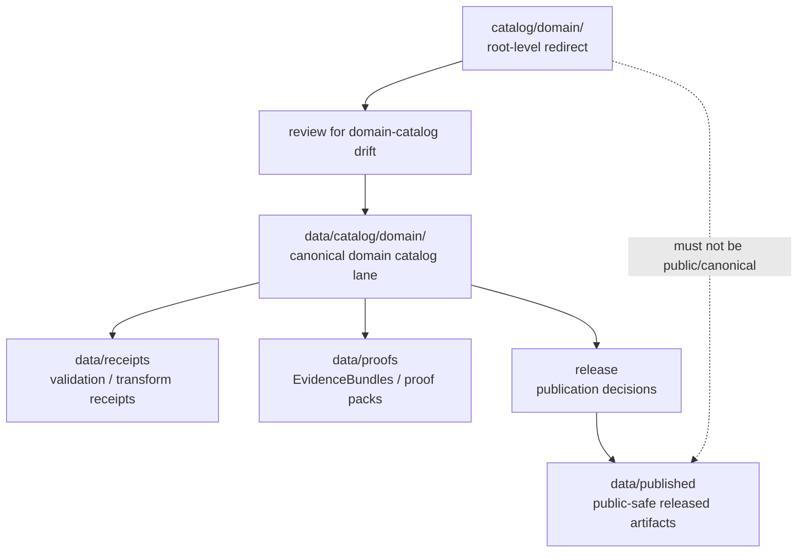

<!-- [KFM_META_BLOCK_V2]
doc_id: kfm://doc/catalog-domain-readme
title: catalog/domain/ — Domain Catalog Compatibility Redirect
type: readme
version: v0.1
status: draft
owners: OWNER_TBD — Catalog steward · Domain steward · Data steward · Source steward · Docs steward
created: 2026-06-16
updated: 2026-06-16
policy_label: public
related:
  - ../README.md
  - ../../data/README.md
  - ../../data/catalog/README.md
  - ../../data/catalog/domain/README.md
  - ../../data/receipts/README.md
  - ../../data/proofs/README.md
  - ../../data/published/README.md
  - ../../data/registry/README.md
  - ../../release/README.md
  - ../../schemas/contracts/v1/
  - ../../contracts/
  - ../../policy/
  - ../../docs/doctrine/directory-rules.md
tags: [kfm, catalog, domain, compatibility-root, redirect, data-catalog, domain-catalog, non-authoritative, drift-fence]
notes:
  - "Root-level catalog/domain/ is treated as a compatibility/redirect fence, not canonical domain catalog authority."
  - "Canonical domain catalog material belongs under data/catalog/domain/ unless a future ADR changes the catalog authority model."
  - "Do not add domain catalog records, domain indexes, source descriptors, receipts, proofs, release records, or published artifacts here without an ADR/migration note."
  - "Specific current contents, producers, migration status, and CI enforcement remain NEEDS VERIFICATION."
[/KFM_META_BLOCK_V2] -->

<a id="top"></a>

<div align="center">

# Domain Catalog Compatibility Redirect

`catalog/domain/`

**Compatibility / redirect fence for legacy or accidental root-level domain-catalog placement. Canonical domain catalog records belong under `data/catalog/domain/`, not this root-level `catalog/domain/` folder.**


[Purpose](#1-purpose) · [Canonical home](#2-canonical-home) · [Authority boundary](#3-authority-boundary) · [Allowed contents](#5-allowed-contents) · [Forbidden contents](#6-forbidden-contents) · [Migration](#9-migration-posture) · [Definition of done](#12-definition-of-done)

</div>

---

> [!IMPORTANT]
> **Status:** draft / `NEEDS VERIFICATION`  
> **Path:** `catalog/domain/README.md`  
> **Responsibility root:** compatibility redirect / drift fence only  
> **Canonical domain catalog home:** `data/catalog/domain/`  
> **Truth posture:** CONFIRMED README path / CONFIRMED root-level `catalog/` is a compatibility redirect / CONFIRMED `data/` lifecycle root lists `catalog` as belonging under `data` / CONFIRMED `data/catalog/domain/README.md` path exists as a stub / PROPOSED `catalog/domain/` redirect contract / UNKNOWN current domain catalog files, historical producers, migration status, CI enforcement, and ADR disposition

> [!CAUTION]
> Do not make `catalog/domain/` a parallel domain catalog authority. KFM domain catalog truth, domain indexes, domain-to-source mappings, domain-to-contract references, STAC/DCAT/PROV crosswalks, and publication state must live in the governed data lifecycle path, especially `data/catalog/domain/`, with receipts/proofs/release records in their own canonical roots.

---

## 1. Purpose

`catalog/domain/` is a **root-level compatibility redirect** for domain-catalog path drift.

It exists only to prevent accidental or legacy domain catalog material from becoming a parallel authority outside the KFM lifecycle data root. This folder should not be used for canonical domain catalog records, domain indexes, source crosswalks, contract crosswalks, policy mappings, or publication records.

This README does not prove that any domain catalog material currently exists here, that a migration has been completed, or that CI currently blocks writes to this path.

[Back to top](#top)

---

## 2. Canonical home

Canonical domain catalog material belongs under:

```text
data/catalog/domain/
```

The root-level `catalog/` directory is a redirect/fence, and `data/` is the lifecycle root where catalog material belongs.

```text
catalog/domain/       # compatibility redirect only; do not add catalog records here
data/catalog/domain/  # canonical domain catalog lane, subject to lifecycle governance
```

## 3. Authority boundary

`catalog/domain/` has **no canonical domain catalog authority**. It may hold only README guidance, migration notes, drift logs, or temporary redirect markers while domain catalog material is moved into its proper lifecycle home.

```text
WRONG / LEGACY ROOT                 CANONICAL LIFECYCLE HOME                  TRUST SUPPORT HOMES
catalog/domain/                -->  data/catalog/domain/                 -->  data/receipts/
compatibility fence only            domain catalog records / indexes          data/proofs/
not authoritative                   domain crosswalks / references            release/
                                                                             data/published/
```

A domain catalog record outside `data/catalog/domain/` should be treated as drift until reviewed and migrated.

## 4. Default posture

Anything found under root-level `catalog/domain/` should be treated as **NEEDS VERIFICATION** and potentially misplaced.

Do not expose, publish, index, cite, or depend on root-level domain catalog files as canonical records. First confirm source, provenance, rights, sensitivity, schema validity, lifecycle state, receipts, proofs, release state, rollback path, and correction path.

## 5. Allowed contents

| Allowed item | Example | Required posture |
|---|---|---|
| README / redirect docs | `README.md` | Compatibility fence only |
| Migration note | `MIGRATION.md` | Temporary and ADR/review-linked |
| Drift note | `DRIFT.md`, `OPEN-QUESTIONS.md` | Must point to canonical homes and review steps |
| Placeholder marker | `.gitkeep` | Does not authorize domain catalog content |

## 6. Forbidden contents

| Forbidden here | Correct home |
|---|---|
| Domain catalog records, domain indexes, domain manifests | `data/catalog/domain/` |
| Domain-to-source, domain-to-contract, domain-to-schema, or domain-to-policy catalog crosswalks | `data/catalog/domain/` or governed catalog support homes |
| STAC, DCAT, or PROV records | `data/catalog/` under their proper family lanes |
| Catalog-derived public products | `data/published/` after governed release |
| Source descriptors, source registry rows, rights rows, sensitivity rows | `data/registry/` or governed registry homes |
| Receipts, validation reports, redaction receipts | `data/receipts/` |
| EvidenceBundles, proof packs, attestations | `data/proofs/` |
| ReleaseManifest, PromotionDecision, RollbackCard, CorrectionNotice, signatures | `release/` |
| Schemas and machine-shape contracts | `schemas/contracts/v1/` |
| Human contracts and object-meaning docs | `contracts/` |
| Policy rules and policy decisions | `policy/` and governed policy-decision homes |
| Source code, scripts, packages, pipelines, build tools | `apps/`, `packages/`, `tools/`, `scripts/`, `pipelines/` |
| Raw, work, quarantine, processed, or published lifecycle data | `data/` lifecycle subtrees |

## 7. Directory shape

Current implementation inventory remains `NEEDS VERIFICATION`.

```text
catalog/domain/
├── README.md                 # compatibility redirect / drift fence
├── MIGRATION.md              # PROPOSED only if migration is active
└── DRIFT.md                  # PROPOSED only if misplaced domain catalog material is found
```

> [!WARNING]
> Do not treat this suggested shape as repo fact. Verify actual contents before making inventory or migration claims.

## 8. Diagram



## 9. Migration posture

If domain catalog files are found here:

1. Do not publish or depend on them.
2. Identify whether they are domain catalog records, domain indexes, source/contract/schema/policy crosswalks, STAC/DCAT/PROV records, receipts, proofs, release records, source registry rows, or published-output material.
3. Move or regenerate them into the correct owning root through a governed migration.
4. Normalize canonical machine-path placement to `data/catalog/domain/` unless an ADR says otherwise.
5. Preserve provenance, source refs, digests, receipts, review notes, and rollback path.
6. Add a drift register or migration note if the material has already been consumed.
7. Leave root-level `catalog/domain/` as a redirect/fence unless an ADR explicitly says otherwise.

## 10. Validation expectations

Useful validation for this folder should cover:

- no domain catalog records, indexes, manifests, or crosswalks are stored here;
- no receipts, proofs, release records, registry records, policy rules, schemas, source code, or published artifacts are stored here;
- any non-README content is tied to an active migration or drift note;
- CI or review checks flag root-level `catalog/domain/` writes;
- links point users to `data/catalog/domain/` and other canonical homes.

## 11. Safe change pattern

For changes under `catalog/domain/`:

1. Confirm the change is redirect documentation, migration support, or drift documentation only.
2. Confirm it does not create a parallel domain catalog authority.
3. Confirm durable domain catalog records are placed under `data/catalog/domain/`.
4. Confirm receipts/proofs/release records are placed under their owning roots.
5. Document migration and rollback if any misplaced material was moved.
6. Update docs and validation rules when behavior materially changes.

## 12. Definition of done

- [ ] Owners are confirmed and `OWNER_TBD` is replaced.
- [ ] Actual root-level `catalog/domain/` contents are verified.
- [ ] Any misplaced domain catalog material is migrated or documented as drift.
- [ ] `data/catalog/domain/` is confirmed as the canonical domain catalog home in current docs.
- [ ] No trust-bearing records live here.
- [ ] No domain catalog records, STAC/DCAT/PROV records, registry records, receipts, proofs, release records, published artifacts, schemas, contracts, policy rules, source code, or lifecycle data live here.
- [ ] CI/review behavior is verified or marked `NEEDS VERIFICATION`.

## 13. Open verification items

| Item | Why it matters |
|---|---|
| Confirm actual files under root-level `catalog/domain/` | Prevents overclaiming or missing drift |
| Confirm whether any workflow writes here | Required before producer claims |
| Confirm migration status to `data/catalog/domain/` | Required before canonical-home claims beyond doctrine |
| Confirm canonical domain-catalog path convention is accepted | Required before finalizing migration guidance |
| Confirm CI/review guard exists | Required before enforcement claims |
| Confirm no trust records are stored here | Required before Directory Rules compliance claims |
| Confirm ADR status for root-level `catalog/domain/` | Required before long-term retention claims |

<details>
<summary>Appendix A — no-loss preservation note</summary>

The previous README was empty. This replacement adds a domain-catalog-specific redirect and anti-parallel-authority contract without claiming domain catalog files, migration work, CI enforcement, producer workflows, canonical path acceptance, or ADR disposition are implemented.

</details>

## Status summary

`catalog/domain/` is a root-level compatibility redirect and domain-catalog drift fence. It is not the canonical domain catalog home.

Domain catalog authority belongs under `data/catalog/domain/`; trust-bearing support belongs under `data/receipts/`, `data/proofs/`, and `release/`; released public-safe products belong under `data/published/`.

<p align="right"><a href="#top">Back to top</a></p>
