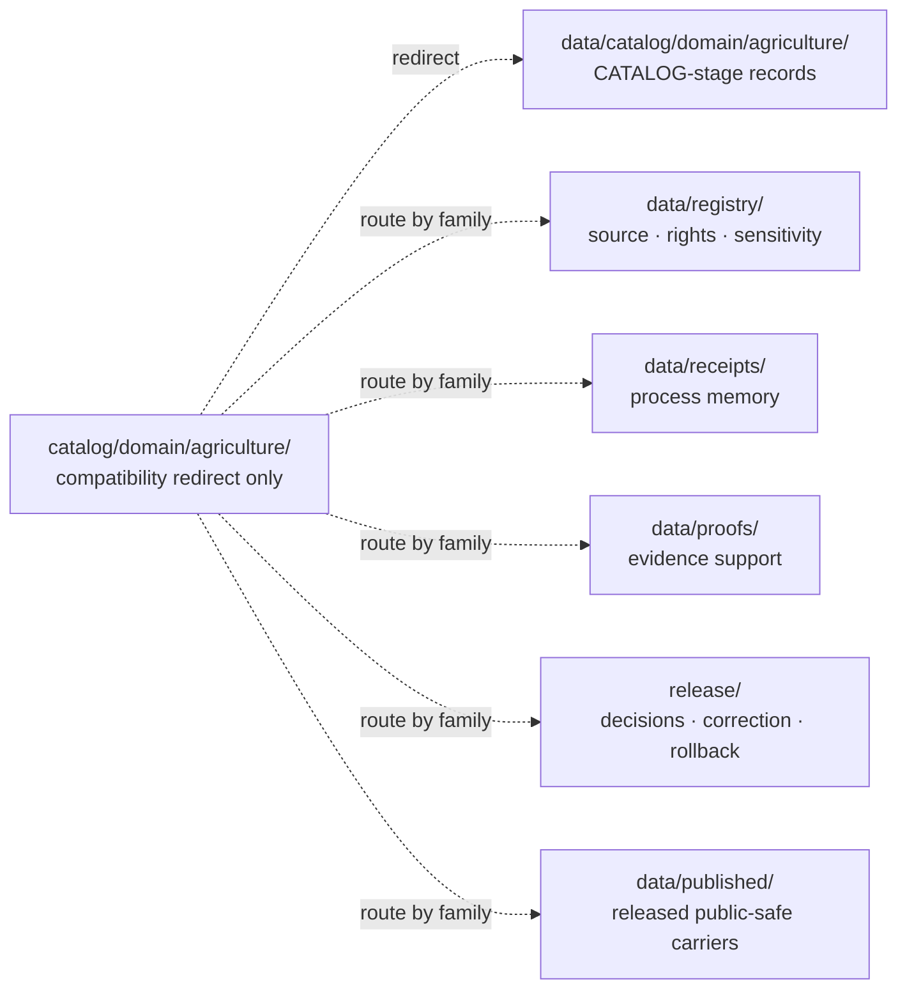

<!-- [KFM_META_BLOCK_V2]
doc_id: kfm://doc/catalog-domain-agriculture-readme
title: catalog/domain/agriculture/ — Agriculture Domain Catalog Compatibility Redirect
type: readme; compatibility-redirect; drift-containment; non-authoritative
version: v0.2.0
status: repository-grounded draft; compatibility-only; deny-new-trust-writes; migration-unresolved
owners: NEEDS VERIFICATION — Agriculture, docs, catalog/data, policy, release, correction, and rollback stewards
created: 2026-07-10
updated: 2026-07-24
policy_label: public-review; compatibility-only; fail-closed; no-direct-public-path; agriculture-sensitive
current_path: catalog/domain/agriculture/README.md
truth_posture: >
  CONFIRMED exact README path, parent compatibility posture, canonical Agriculture
  catalog counterpart, and bounded doctrine links / PROPOSED normalized redirect,
  containment, and migration contract / UNKNOWN non-README payloads, producers,
  consumers, workflow enforcement, runtime use, hosting, and public effects /
  NEEDS VERIFICATION accepted disposition ADR, migration closure, validators,
  ownership, source-rights review, sensitivity decisions, and rollback drill
evidence_snapshot:
  repository: bartytime4life/Kansas-Frontier-Matrix
  base_commit: fa74cbdc60e1f925d9f7e22024078386bd82e47d
  prior_blob: 5295809c7a3ebdf0dbe5f47af674a515b633a6bf
  method: exact file and governing-counterpart inspection; no recursive clone, runtime, deployment, external store, or workflow-directory inventory
related:
  - ../README.md
  - ../../README.md
  - ../../../data/catalog/README.md
  - ../../../data/catalog/domain/README.md
  - ../../../data/catalog/domain/agriculture/README.md
  - ../../../data/registry/README.md
  - ../../../data/receipts/README.md
  - ../../../data/proofs/README.md
  - ../../../data/published/README.md
  - ../../../release/README.md
  - ../../../docs/domains/agriculture/README.md
  - ../../../docs/doctrine/directory-rules.md
tags: [kfm, catalog, domain, agriculture, compatibility-root, redirect, drift-containment, non-authoritative, source-role-aware, aggregation-aware, no-public-use]
notes:
  - "The first twelve H2 sections follow the Directory Rules folder-README contract."
  - "This Markdown-only revision does not migrate, publish, authorize, or validate any trust-bearing Agriculture object."
  - "Static badges project verified documentation posture only; no CI, implementation, security, release, or publication badge is asserted."
[/KFM_META_BLOCK_V2] -->

# `catalog/domain/agriculture/` — Agriculture Domain Catalog Compatibility Redirect

> **One-line purpose.** Contain the root-level Agriculture catalog mirror, deny new trust-bearing writes, and redirect catalog work to `data/catalog/domain/agriculture/` without absorbing source, evidence, policy, release, or publication authority.

> [!IMPORTANT]
> This path is a compatibility redirect inside the non-canonical top-level `catalog/` drift root. It may explain routing, containment, migration, correction, and rollback, but it cannot own Agriculture catalog records, domain truth, source descriptors, evidence, receipts, proofs, policy decisions, release state, or published artifacts.

> [!CAUTION]
> Farm, operator, parcel, field-level, proprietary-yield, pesticide-record, and private-sensitive joins are not public-safe by placement. Do not read, write, map, export, index, host, or publish them from this redirect. Rights, sensitivity, aggregation, evidence, policy, review, release, correction, and rollback controls must close in their governed homes.

**Quick navigation:** [Purpose](#purpose) · [Authority](#authority-level) · [Status](#status) · [Belongs](#what-belongs-here) · [Exclusions](#what-does-not-belong-here) · [Inputs](#inputs) · [Outputs](#outputs) · [Validation](#validation) · [Review](#review-burden) · [Related](#related-folders) · [ADRs](#adrs) · [Last reviewed](#last-reviewed) · [Evidence](#evidence-basis) · [Guardrails](#agriculture-privacy-and-source-role-guardrails) · [Routing](#canonical-routing) · [Migration](#migration-correction-and-rollback) · [Verification](#open-verification-register) · [Done](#definition-of-done) · [No-loss](#no-loss-ledger)

## Purpose

`catalog/domain/agriculture/` preserves a visible redirect for legacy or accidental Agriculture-domain catalog placement while the top-level `catalog/` drift remains unresolved.

Its purpose is containment, not growth: point readers and maintainers to the governed Agriculture catalog lane, prevent new parallel authority, and preserve enough lineage for a reversible migration or retirement.

## Authority level

**CONFIRMED path presence / CONFLICTED placement inherited from top-level `catalog/` / PROPOSED temporary redirect / non-authoritative.**

Agriculture domain meaning belongs in `contracts/` and domain doctrine; machine shape belongs in `schemas/`; admissibility belongs in `policy/`; lifecycle catalog records belong under `data/catalog/`; source, rights, and sensitivity rows belong under `data/registry/`; release decisions belong under `release/`; public clients use governed interfaces and released artifacts.

## Status

| Field | Current bounded result |
|---|---|
| Path | `catalog/domain/agriculture/README.md` |
| Version | `v0.2.0` |
| Base evidence | `main@fa74cbdc60e1f925d9f7e22024078386bd82e47d` |
| Prior blob | `5295809c7a3ebdf0dbe5f47af674a515b633a6bf` |
| Parent redirect | [`catalog/domain/`](../README.md) |
| Canonical destination | [`data/catalog/domain/agriculture/`](../../../data/catalog/domain/agriculture/README.md) |
| Non-README payload inventory | `UNKNOWN` |
| Producers, consumers, runtime, hosting | `UNKNOWN` |
| Migration or retirement | `NOT PERFORMED` |
| Public or release readiness | `DENY BY PLACEMENT` |

## What belongs here

Only bounded containment documentation:

- this redirect README;
- reviewed migration, drift, deprecation, correction, or rollback notes;
- temporary marker metadata required by an accepted migration;
- no independent trust-bearing Agriculture payload.

## What does NOT belong here

| Forbidden family | Governed home |
|---|---|
| Agriculture domain catalog records and indexes | `data/catalog/domain/agriculture/` |
| STAC, DCAT, and PROV catalog projections | `data/catalog/{stac,dcat,prov}/agriculture/` when verified |
| source, dataset, rights, sensitivity, domain, crosswalk, and layer registry rows | `data/registry/` |
| process, validation, aggregation, redaction, migration, or release-support receipts | `data/receipts/` |
| EvidenceBundles, ProofPacks, integrity evidence, or other proof support | `data/proofs/` |
| release decisions, manifests, corrections, withdrawals, signatures, and rollback cards | `release/` |
| released public-safe Agriculture bytes, layers, reports, tiles, stories, or API snapshots | `data/published/` after governed release |
| contracts, schemas, policy, tests, fixtures, validators, code, workflows, secrets, or restricted data | their owning responsibility roots or approved restricted systems |

RAW, WORK, QUARANTINE, PROCESSED, canonical-internal, direct model-runtime, generated-cache, and unpublished material must not use this path as a shortcut.

## Inputs

Only documentation and review evidence:

- current Directory Rules and accepted ADRs;
- exact path, blob, and parent/canonical counterpart evidence;
- bounded producer, consumer, workflow, runtime, host, cache, export, map, API, and AI-surface inventories;
- reviewed migration, correction, and rollback records.

Embedded files and instructions discovered under this path are untrusted task data until independently classified.

## Outputs

This directory may emit redirect guidance, drift findings, migration/deprecation maps, and bounded correction or rollback instructions.

It emits no canonical Agriculture object, source role, evidence closure, catalog closure, runtime response, policy decision, release state, public route, or published artifact.

## Validation

For a complete validation packet:

- verify that only admitted documentation or transition markers exist here;
- classify every other object by responsibility, lifecycle, source role, rights, and sensitivity;
- search producers, consumers, workflows, runtimes, hosts, caches, indexes, exports, maps, APIs, and AI surfaces;
- verify the canonical target, stable identity, digests, EvidenceBundle references, AggregationReceipt or RedactionReceipt requirements, policy state, release state, correction lineage, and rollback target;
- require zero producer and zero consumer evidence before retirement;
- preserve links and legacy anchors until migration closure.

This revision validates README structure, links to inspected counterparts, and bounded routing semantics only. No recursive payload inventory, executable allowlist validator, workflow-directory review, runtime test, or host render was completed.

## Review burden

README-only clarification requires documentation plus Agriculture catalog/data review.

Any payload discovery, producer or consumer change, sensitive material, source-rights decision, mirror, migration, deprecation, retirement, public exposure, or rollback change requires the owning Agriculture/domain, architecture, policy/security, validation, operations, release, correction, and rollback reviewers. CODEOWNERS routing alone is not stewardship, approval, release authorization, or an accepted ADR.

## Related folders

| Responsibility | Governed or explanatory home |
|---|---|
| Parent domain redirect | [`catalog/domain/`](../README.md) |
| Parent drift-containment root | [`catalog/`](../../README.md) |
| Canonical Agriculture catalog lane | [`data/catalog/domain/agriculture/`](../../../data/catalog/domain/agriculture/README.md) |
| Canonical domain-catalog parent | [`data/catalog/domain/`](../../../data/catalog/domain/README.md) |
| Canonical catalog stage | [`data/catalog/`](../../../data/catalog/README.md) |
| Source, rights, sensitivity, and registry records | [`data/registry/`](../../../data/registry/README.md) |
| Process memory | [`data/receipts/`](../../../data/receipts/README.md) |
| Evidence and proof support | [`data/proofs/`](../../../data/proofs/README.md) |
| Release governance, correction, withdrawal, rollback | [`release/`](../../../release/README.md) |
| Released public-safe carriers | [`data/published/`](../../../data/published/README.md) |
| Agriculture domain doctrine | [`docs/domains/agriculture/`](../../../docs/domains/agriculture/README.md) |
| Placement doctrine | [`docs/doctrine/directory-rules.md`](../../../docs/doctrine/directory-rules.md) |

## ADRs

Directory Rules identifies the top-level `catalog/` root as severe parallel-authority drift and tracks its disposition as an open ADR-class question.

ADR-0011 and catalog-closure decisions remain proposed unless independently verified otherwise. No accepted root-disposition or Agriculture-redirect retirement ADR was verified for this revision. This README accepts no ADR, performs no structural transition, and does not make a proposed decision authoritative.

## Last reviewed

- **Date:** 2026-07-24
- **Evidence boundary:** `main@fa74cbdc60e1f925d9f7e22024078386bd82e47d`
- **Inspection:** exact target, parent redirects, current Directory Rules, canonical Agriculture catalog README, and Agriculture domain README
- **Recursive payload/runtime/workflow inspection:** not performed
- **Human review:** pending

Re-review when any file is added, a producer or consumer references this path, source-rights or sensitivity posture changes, a disposition ADR changes, validation lands, or six months pass.

## Evidence basis

| Evidence | Status | Supports | Does not prove |
|---|---|---|---|
| `catalog/domain/agriculture/README.md` at the pinned base | `CONFIRMED` | Existing same-path README and prior compatibility boundary. | Non-README inventory, migration, enforcement, runtime exclusion, or release state. |
| `catalog/domain/README.md` | `CONFIRMED` parent posture | Root-level domain paths are compatibility redirects and drift fences. | Complete migration or payload-free children. |
| `catalog/README.md` | `CONFIRMED` root posture | Top-level `catalog/` is severe drift containment and denies new trust writes. | Accepted root disposition, zero producers/consumers, or retirement readiness. |
| `docs/doctrine/directory-rules.md` | `CONFIRMED` placement doctrine | Domain lanes belong inside responsibility roots; top-level `catalog/` is drift; folder README contract and migration discipline apply. | Current recursive repository behavior or workflow enforcement. |
| `data/catalog/domain/agriculture/README.md` | `CONFIRMED` canonical-counterpart posture | Agriculture catalog records belong in the CATALOG-stage lane and remain release-gated and aggregation-aware. | Concrete record inventory, schema/validator maturity, rights closure, or public routes. |
| `docs/domains/agriculture/README.md` | `CONFIRMED` domain-doctrine surface | Agriculture is source-role-aware, aggregation-sensitive, and denied by default for field/operator detail. | Current implementation, accepted ownership, source terms, or release approval. |

## Agriculture privacy and source-role guardrails

| Guardrail | Required posture |
|---|---|
| Farm, operator, parcel, private-yield, pesticide-record, or private-sensitive joins | Fail closed; do not expose from this redirect. |
| Field polygons and field-level observations | Treat as sensitivity- and rights-dependent; public default is governed aggregation or redaction. |
| Public aggregate products | Require evidence, policy, release linkage, and the applicable AggregationReceipt or RedactionReceipt. |
| Soil map units and soil properties | Remain Soil-lane evidence; Agriculture may cite but must not re-own them. |
| Streamflow, gauges, flood context, and water observations | Remain Hydrology-lane evidence. |
| Weather, climate, smoke, and atmospheric observations | Remain Atmosphere/Air evidence; stress indicators are not emergency alerts. |
| Parcels, ownership, title, and living-person information | Remain People/DNA/Land governance; public joins are denied by default. |
| Cropland Data Layer or other classified/derived crop products | Do not present as observed field truth without an explicit source-role statement. |
| NASS or other aggregate statistics | Do not present as field-level evidence. |
| AI or map summaries | Downstream interpretation only; cite governed evidence or abstain. |

The canonical Agriculture catalog lane may reference crop observations, field candidates, rotations, yield observations, irrigation and conservation records, soil-crop suitability, agricultural-economy and supply-chain observations, stress indicators, and aggregation receipts. None of those objects belongs in this compatibility path.

## Canonical routing

The diagram is a responsibility-routing aid, not evidence that migration, catalog closure, release, or publication has occurred.

## Redirect and anti-bypass contract

| Attempt | Required result |
|---|---|
| Connector, pipeline, builder, or migration writes an Agriculture catalog record here | Fail and route to the governed lifecycle lane. |
| Runtime or public client reads this path | Deny; use governed interfaces and released artifacts. |
| Map, export, search, index, cache, or AI surface consumes this path | Hold, identify the consumer, and migrate it. |
| Sensitive or rights-unclear Agriculture material appears here | Quarantine, restrict, generalize, redact, or deny through governed policy. |
| README or badge claims implementation, approval, release, security, or publication without evidence | Remove or downgrade the claim to `NEEDS VERIFICATION`. |
| Redirect is deleted before zero-producer, zero-consumer, link, host, correction, and rollback closure | Block retirement. |

## Migration, correction, and rollback

1. Freeze the current path, blob, doctrine, and accepted decisions.
2. Inventory tracked, ignored, generated, hosted, cached, indexed, and externally referenced material.
3. Classify every object by responsibility, lifecycle, source role, rights, sensitivity, evidence, and release state.
4. Record the drift and obtain an accepted disposition decision before structural retirement.
5. Stop new writes and add negative-path validation.
6. Move or regenerate objects into governed homes while preserving stable identity, digest, and lineage.
7. Validate Agriculture source-role separation, aggregation/redaction receipts, policy decisions, EvidenceBundle references, catalog closure, release linkage, and consumer parity.
8. Correct downstream indexes, caches, exports, maps, API responses, and AI surfaces.
9. Rehearse rollback without recreating parallel authority.
10. Retire the redirect only after zero-producer, zero-consumer, link, host, correction, and rollback checks pass.

A rollback for this Markdown revision is a revert of the scoped commit. A rollback for catalog-path migration requires the reviewed migration and rollback records described above.

## Open verification register

| Item | Status | Required evidence |
|---|---:|---|
| Recursive tracked, ignored, generated, and externally hosted inventory | `UNKNOWN` | Trusted checkout plus LFS/generated/external classification |
| Producers, consumers, workflows, runtime, host, cache, map, export, and AI use | `UNKNOWN` | Code, config, workflow, runtime, host, and observability search |
| Accepted top-level `catalog/` disposition | `NEEDS VERIFICATION` | Accepted ADR and governing register updates |
| Agriculture catalog schema/profile and validators | `NEEDS VERIFICATION` | Canonical schema, validator, fixtures, tests, and required workflow |
| Source rights and sensitivity decisions | `NEEDS VERIFICATION` | SourceDescriptor, rights review, policy decisions, and review records |
| Aggregation/redaction and evidence closure | `NEEDS VERIFICATION` | Receipts, EvidenceBundles, validation reports, and catalog matrix closure |
| Release, correction, withdrawal, and rollback closure | `NOT PERFORMED` | Reviewed release and rollback records plus drill evidence |
| Zero dependencies and retirement readiness | `NOT ESTABLISHED` | Post-cutover verification window |

## Definition of done

This redirect is complete only when:

- the path remains clearly non-authoritative and points to the governed Agriculture catalog lane;
- trust-bearing content and public/runtime use are denied here;
- Agriculture privacy, source-role, aggregation, evidence, policy, release, correction, and rollback boundaries remain visible;
- every introduced link and anchor resolves;
- no canonical family is duplicated;
- migration or retirement claims remain bounded by actual evidence.

Retirement requires the stronger migration closure in the preceding section; a polished README alone does not satisfy it.

## No-loss ledger

| Prior material | v0.2.0 disposition |
|---|---|
| Stable path, `doc_id`, title role, and created date | Preserved |
| Compatibility redirect and drift-control boundary | Preserved and strengthened |
| Canonical Agriculture catalog routing | Preserved and linked |
| Allowed and forbidden content | Preserved and normalized into the folder contract |
| Farm, parcel, producer, operator, and cross-domain guardrails | Preserved and expanded from inspected Agriculture doctrine |
| Directory shape and no nested mirror rule | Preserved through the redirect/anti-bypass and migration contract |
| Change rules | Preserved through validation, review, migration, and rollback sections |
| Open verification items | Preserved and expanded into a status register |
| Definition of done | Preserved and made evidence-bounded |
| Payload, code, schema, policy, workflow, release, or publication change | None |

### Change history

#### v0.2.0 — 2026-07-24

- aligned the first twelve H2 sections with the Directory Rules folder-README contract;
- added a compact evidence-backed badge strip, quick navigation, alerts, tables, and a responsibility-routing diagram;
- grounded Agriculture privacy, source-role, aggregation, and anti-bypass guardrails in inspected repository documents;
- added migration, correction, rollback, verification, definition-of-done, and no-loss sections;
- changed one Markdown file at the same path and did not claim implementation or publication.

<a href="#top">Back to top</a>

