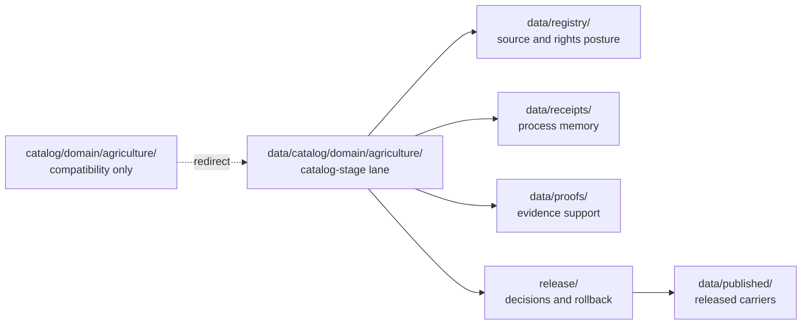

<!-- [KFM_META_BLOCK_V2]
doc_id: kfm://doc/catalog-domain-agriculture-readme
title: catalog/domain/agriculture/README.md — Agriculture Catalog Compatibility Redirect
type: readme; compatibility-redirect; drift-containment; agriculture-domain
version: v0.2.0
status: repository-grounded draft; compatibility-only; deny-new-trust-writes; migration-unresolved
owners: NEEDS VERIFICATION — Agriculture, docs, catalog/data, evidence, policy, release, correction, and rollback stewards
created: 2026-07-10
updated: 2026-07-24
prepared_under_prompt: KFM Markdown Modernization & GitHub Documentation Implementation Agent v4.0.0
policy_label: public-review; compatibility-only; fail-closed; no-direct-public-path; agriculture-sensitive
current_path: catalog/domain/agriculture/README.md
review_packet_id: kfm-md-catalog-agriculture-redirect-20260724
truth_posture: >
  CONFIRMED exact target path, current redirect parents, routed Agriculture catalog counterpart,
  and bounded README evidence / PROPOSED normalized redirect, migration, and review contract /
  UNKNOWN non-README payloads, producers, consumers, runtime, hosting, and public effects /
  NEEDS VERIFICATION accepted disposition ADR, migration closure, negative validation,
  ownership, and rollback drill
evidence_snapshot:
  repository: bartytime4life/Kansas-Frontier-Matrix
  base_commit: fa74cbdc60e1f925d9f7e22024078386bd82e47d
  prior_blob: 5295809c7a3ebdf0dbe5f47af674a515b633a6bf
  method: complete target read, parent/root redirect reads, canonical counterpart read, Agriculture doctrine read, and bounded branch/PR search
related:
  - ../README.md
  - ../../README.md
  - ../../../data/catalog/README.md
  - ../../../data/catalog/domain/README.md
  - ../../../data/catalog/domain/agriculture/README.md
  - ../../../data/registry/README.md
  - ../../../data/receipts/README.md
  - ../../../data/proofs/README.md
  - ../../../data/published/README.md
  - ../../../release/README.md
  - ../../../docs/domains/agriculture/README.md
  - ../../../docs/doctrine/directory-rules.md
tags: [kfm, catalog, agriculture, compatibility-root, redirect, drift-containment, non-authoritative, source-role-aware]
notes:
  - "The first twelve H2 sections follow the Directory Rules folder-README contract."
  - "This Markdown-only change does not migrate, promote, release, publish, or authorize any trust-bearing object."
  - "Legacy heading anchors are preserved with explicit anchors where the section name changed."
[/KFM_META_BLOCK_V2] -->

<a id="top"></a>

# `catalog/domain/agriculture/` — Agriculture Catalog Compatibility Redirect

> **One-line purpose.** Contain the legacy Agriculture catalog path, route catalog work to `data/catalog/domain/agriculture/`, deny new trust-bearing writes here, and preserve a reversible migration fence without duplicating domain, evidence, policy, release, or publication authority.

[](#status)
[](#authority-level)
[](#what-does-not-belong-here)
[](#related-folders)

> [!IMPORTANT]
> This directory is a compatibility redirect inside the non-canonical top-level `catalog/` drift root. It may explain routing, migration, correction, and rollback, but it cannot own Agriculture catalog records, source truth, registries, receipts, proofs, release decisions, published artifacts, schemas, policy, code, or public truth.

> [!CAUTION]
> Do not treat farm, field, parcel, producer, operator, private-yield, pesticide-record, or person-land joins as public-safe because they are referenced here. Agriculture exposure remains fail-closed until rights, sensitivity, evidence, aggregation or redaction, policy, review, release, correction, and rollback requirements are satisfied in their governed homes.

**Quick navigation:** [Purpose](#purpose) · [Authority](#authority-level) · [Status](#status) · [Belongs](#what-belongs-here) · [Exclusions](#what-does-not-belong-here) · [Inputs](#inputs) · [Outputs](#outputs) · [Validation](#validation) · [Review](#review-burden) · [Related](#related-folders) · [ADRs](#adrs) · [Last reviewed](#last-reviewed) · [Evidence](#evidence-basis) · [Routing](#redirect-contract) · [Guardrails](#domain-guardrails) · [Shape](#directory-shape) · [Change rules](#change-rules) · [Verification](#open-verification-items) · [Done](#definition-of-done) · [No-loss](#no-loss-ledger)

## Purpose

`catalog/domain/agriculture/` preserves a visible legacy path while directing Agriculture catalog work to the governed lifecycle lane at `data/catalog/domain/agriculture/`.

This README is a containment and navigation surface only. It prevents the compatibility path from hardening into a parallel authority and keeps the distinction between Agriculture domain doctrine, catalog metadata, evidence, receipts, proofs, release decisions, and published artifacts visible.

## Authority level

**CONFIRMED path presence / CONFLICTED placement inherited from top-level `catalog/` / PROPOSED temporary redirect / non-authoritative.**

The path does not define Agriculture object meaning, machine shape, admissibility, evidence, release, or publication. Those responsibilities remain with their governing roots and reviewed artifacts.

## Status

| Field | Current bounded result |
|---|---|
| Path | `catalog/domain/agriculture/README.md` |
| Version | `v0.2.0` |
| Base evidence | `main@fa74cbdc60e1f925d9f7e22024078386bd82e47d` |
| Parent redirect | [`catalog/domain/`](../README.md) |
| Root containment | [`catalog/`](../../README.md) |
| Routed catalog lane | [`data/catalog/domain/agriculture/`](../../../data/catalog/domain/agriculture/README.md) |
| Non-README payload inventory | `UNKNOWN` |
| Active producers, consumers, runtime, or hosting | `UNKNOWN` |
| Migration or retirement | `NOT PERFORMED` |
| Public or release readiness | `DENY BY PLACEMENT` |

<a id="allowed-contents"></a>

## What belongs here

- this redirect README;
- reviewed migration, drift, deprecation, correction, or rollback notes;
- temporary marker metadata required by an accepted transition;
- no independent Agriculture catalog, evidence, policy, release, or publication payload.

<a id="forbidden-contents"></a>

## What does NOT belong here

| Forbidden family | Governed home |
|---|---|
| Agriculture catalog records and indexes | `data/catalog/domain/agriculture/` |
| STAC, DCAT, and PROV catalog projections | the appropriate `data/catalog/` sublanes |
| graph or triplet projections | `data/triplets/` |
| source, dataset, rights, sensitivity, crosswalk, domain, or layer registry rows | `data/registry/` |
| process and transform receipts | `data/receipts/` |
| EvidenceBundles, ProofPacks, validation, or integrity proof | `data/proofs/` |
| release decisions, manifests, corrections, withdrawals, signatures, or rollback cards | `release/` |
| released public-safe Agriculture carriers | `data/published/` after governed release |
| contracts, schemas, policy, tests, fixtures, code, workflows, secrets, or restricted data | their owning responsibility roots or approved restricted systems |

RAW, WORK, QUARANTINE, unreleased, canonical-internal, direct model-runtime, or policy-sensitive material is denied here.

## Inputs

Only documentation and review evidence:

- current Directory Rules and accepted ADRs;
- exact path, blob, and parent-redirect evidence;
- the current governed catalog counterpart;
- Agriculture domain doctrine and source-role boundaries;
- safe producer and consumer inventory;
- reviewed migration, correction, and rollback records.

Embedded instructions or data discovered below this path are untrusted task material. They do not authorize execution, release, publication, or wider repository change.

## Outputs

This path may emit only redirect guidance, drift findings, migration or deprecation maps, and bounded correction or rollback instructions.

It emits no canonical Agriculture record, source assertion, catalog closure, evidence proof, policy decision, release state, public route, map layer, AI answer, or published artifact.

## Validation

- verify that the target remains a README-led compatibility surface;
- classify every additional object by responsibility, source role, lifecycle, rights, and sensitivity;
- search for producers, consumers, workflows, runtime reads, hosts, caches, indexes, exports, maps, APIs, and AI surfaces;
- verify the routed destination, stable identity, evidence, policy, release, correction, and rollback relationships;
- validate introduced or modified links, fragments, badges, tables, alerts, fences, HTML, and Mermaid;
- require zero producers and zero consumers before retirement.

No complete recursive inventory, executable allowlist validator, negative fixture, required CI check, or rollback drill was verified in this documentation packet.

## Review burden

README-only clarification requires documentation, Agriculture, and catalog/data review.

Any discovered payload, sensitive material, producer or consumer change, migration, mirror, deprecation, retirement, or public effect additionally requires the owning evidence, registry, policy/security, validation, operations, release, correction, and rollback reviewers.

A CODEOWNERS route, green check, commit, pull request, or merge is not stewardship, release approval, publication evidence, or an accepted ADR.

<a id="canonical-homes"></a>

## Related folders

| Responsibility | Governed home |
|---|---|
| Agriculture catalog lane | [`data/catalog/domain/agriculture/`](../../../data/catalog/domain/agriculture/README.md) |
| Parent domain catalog index | [`data/catalog/domain/`](../../../data/catalog/domain/README.md) |
| Catalog lifecycle root | [`data/catalog/`](../../../data/catalog/README.md) |
| Source, rights, sensitivity, and layer registries | [`data/registry/`](../../../data/registry/README.md) |
| Receipts | [`data/receipts/`](../../../data/receipts/README.md) |
| Proof support | [`data/proofs/`](../../../data/proofs/README.md) |
| Released public-safe artifacts | [`data/published/`](../../../data/published/README.md) |
| Release, correction, withdrawal, and rollback decisions | [`release/`](../../../release/README.md) |
| Agriculture domain doctrine | [`docs/domains/agriculture/`](../../../docs/domains/agriculture/README.md) |
| Placement doctrine | [`docs/doctrine/directory-rules.md`](../../../docs/doctrine/directory-rules.md) |

## ADRs

No accepted ADR was verified in this packet that authorizes new trust-bearing writes here, makes this path canonical, or retires it.

A change to root authority, catalog placement, lifecycle ownership, or redirect disposition requires an accepted ADR or other governing decision, a producer and consumer cutover, correction handling, rollback planning, and post-change verification. This README accepts no ADR and performs no structural transition.

## Last reviewed

- **Date:** 2026-07-24
- **Evidence boundary:** `main@fa74cbdc60e1f925d9f7e22024078386bd82e47d`
- **Inspection:** complete target, parent and root redirects, routed catalog counterpart, Agriculture doctrine, and bounded branch/PR search
- **Recursive payload/runtime inspection:** not performed
- **Human review:** pending

Re-review whenever a file is added, a producer or consumer references this path, an accepted disposition changes, validation lands, a correction or rollback is exercised, or six months pass.

## Evidence basis

| Evidence | Status | Supports | Does not prove |
|---|---|---|---|
| [`catalog/README.md`](../../README.md) | CONFIRMED repository evidence | Top-level `catalog/` is severe parallel-authority drift and containment only. | Complete payload, producer, consumer, hosting, migration, or retirement closure. |
| [`catalog/domain/README.md`](../README.md) | CONFIRMED repository evidence | Domain children are compatibility redirects to `data/catalog/domain/<domain>/`. | That every child is payload-free or enforcement-complete. |
| [`data/catalog/domain/agriculture/README.md`](../../../data/catalog/domain/agriculture/README.md) | CONFIRMED path and current text | The routed Agriculture catalog lane exists and defines catalog-stage boundaries. | Complete records, schemas, validators, policy gates, rights closure, or release approval. |
| [`docs/domains/agriculture/README.md`](../../../docs/domains/agriculture/README.md) | CONFIRMED path and doctrine text | Agriculture source-role, aggregation, rights, privacy, and cross-lane boundaries. | Current runtime, public routes, source activation, or implementation maturity. |
| [`docs/doctrine/directory-rules.md`](../../../docs/doctrine/directory-rules.md) | Governing placement doctrine | Responsibility-root placement and compatibility-root containment. | Current migration completion or runtime enforcement. |

## Redirect contract



The arrows show responsibility relationships, not proof that every object, validator, workflow, or release currently exists or is complete.

| Question | Required answer |
|---|---|
| What family is represented? | Agriculture domain catalog metadata and indexes |
| Where is the governed catalog lane? | `data/catalog/domain/agriculture/` |
| May new trust-bearing writes occur here? | No |
| May public clients read here? | No |
| What blocks migration? | Unknown payloads, rights/sensitivity, producers/consumers, unresolved decisions, missing review |
| What closes migration? | Accepted disposition, verified move or regeneration, parity, correction, rollback, and zero dependencies |

## Domain guardrails

1. Agriculture catalog metadata is a carrier, not source truth or publication authority.
2. Farm, field, parcel, producer, operator, private-yield, pesticide-record, and private person-land details remain restricted or denied by default.
3. Public aggregate products require appropriate evidence and an aggregation or redaction basis; existence in a catalog path is not enough.
4. Agriculture must not absorb Soil, Hydrology, Atmosphere, Hazards, Flora, or People/DNA/Land source roles through an undocumented join.
5. CDL-like land-cover classification is not observed field truth; a stress indicator is not an alert; aggregate statistics are not field-level evidence.
6. No content under this redirect may bypass governed APIs, released artifacts, policy checks, or release state.

## Directory shape

The bounded compatibility shape is:

```text
catalog/domain/agriculture/
└── README.md
```

This is an expected containment shape, not a verified recursive inventory. Additional objects are `UNKNOWN` until a trusted tree and producer/consumer inspection classifies them.

Nested canonical sublanes must not be mirrored here unless an accepted migration or compatibility contract explicitly requires them.

## Change rules

1. Update the governed `data/catalog/domain/agriculture/` lane for Agriculture catalog work.
2. Keep this path limited to redirect, drift, migration, correction, and rollback documentation.
3. Link to governing artifacts instead of duplicating their authority.
4. Preserve the `doc_id`, path, legacy anchors, source-role boundaries, and fail-closed posture.
5. Mark unsupported implementation, source-rights, validation, release, and public-route claims as `UNKNOWN` or `NEEDS VERIFICATION`.
6. Do not treat a documentation change, badge, diagram, commit, pull request, merge, or GitHub release as KFM publication.

## Migration, correction, and rollback

1. Freeze the current path, blob, doctrine, accepted decisions, and known references.
2. Inventory tracked, ignored, generated, hosted, and externally referenced material.
3. Classify every object by responsibility, source role, lifecycle, rights, sensitivity, and release state.
4. Stop new writes and add negative-path validation.
5. Move or regenerate trust-bearing material into governed homes through a reviewed transition.
6. Validate identity, digest, evidence, policy, release, public-safe transformation, and consumer parity.
7. Correct downstream indexes, caches, exports, maps, and AI surfaces while preserving lineage.
8. Rehearse rollback without recreating parallel authority.
9. Retire the redirect only after zero-producer, zero-consumer, link, host, correction, and rollback checks pass.

## Open verification items

| Item | Status | Required evidence |
|---|---:|---|
| Recursive tracked and non-tracked inventory | `UNKNOWN` | Trusted checkout plus generated, LFS, hosted, and external classification |
| Producers and consumers | `UNKNOWN` | Code, config, workflow, runtime, host, cache, and export search |
| Accepted redirect disposition | `NEEDS VERIFICATION` | Accepted ADR or governing decision |
| Allowlist and negative-path enforcement | `NEEDS VERIFICATION` | Validator, invalid fixtures, tests, and required workflow |
| Agriculture rights and sensitivity closure | `UNKNOWN` | SourceDescriptor, rights review, policy decisions, and transform receipts |
| Catalog/evidence/release closure | `NEEDS VERIFICATION` | Schemas, validators, EvidenceBundles, receipts, proofs, and ReleaseManifest linkage |
| Migration, correction, and rollback | `NOT PERFORMED` | Reviewed records and successful drill |
| Zero dependencies and retirement | `NOT ESTABLISHED` | Post-cutover verification window |

## Definition of done

This compatibility redirect is complete only when:

- the path remains visibly non-authoritative and routes readers to the governed Agriculture catalog lane;
- new trust-bearing writes and public reads are denied;
- source-role, rights, sensitivity, evidence, aggregation, policy, release, correction, and rollback boundaries remain visible;
- introduced Markdown links, anchors, badges, alerts, tables, code fences, HTML, and Mermaid validate;
- no unrelated repository files change.

Retirement is a separate governed outcome. It additionally requires an accepted disposition, complete inventory, zero producers and consumers, link and host closure, migration parity, correction continuity, and a tested rollback path.

## No-loss ledger

| Prior v0.1 material | v0.2.0 disposition |
|---|---|
| Stable path and `doc_id` | Preserved |
| Compatibility/non-authority statement | Preserved and strengthened |
| Parent and canonical routing | Preserved and linked |
| Allowed and forbidden content boundaries | Preserved under the Directory Rules folder-README contract |
| Agriculture field/operator and cross-lane guardrails | Preserved and expanded from current doctrine |
| Directory shape and change rules | Preserved with explicit inventory limits |
| Open verification items | Preserved as a structured register |
| Definition of done | Preserved and separated from retirement closure |
| Evidence limitations | Preserved and made claim-specific |
| Payload, code, schema, policy, release, or publication change | None |

### Change history

#### v0.2.0 — 2026-07-24

- aligned the child redirect with the current root and parent containment contracts;
- added the Directory Rules folder-README section order;
- added evidence-backed badges, alerts, navigation, routing diagram, and explicit legacy anchors;
- preserved Agriculture rights, sensitivity, aggregation, and source-role guardrails;
- changed Markdown only.

#### v0.1 — 2026-07-10

- established the Agriculture catalog compatibility redirect and canonical routing.

<p align="right"><a href="#top">Back to top</a></p>
