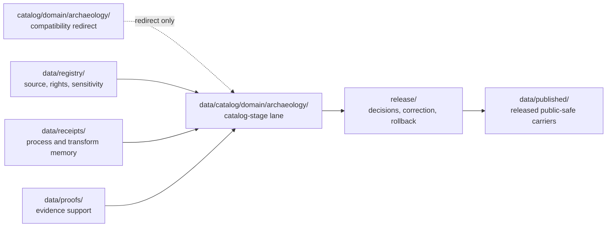

<!-- [KFM_META_BLOCK_V2]
doc_id: kfm://doc/catalog-domain-archaeology-readme
title: catalog/domain/archaeology/ - Archaeology Domain Catalog Compatibility Redirect
type: readme; compatibility-redirect; domain-lane; drift-containment; non-authoritative
version: v0.2.0
status: repository-grounded draft; compatibility-only; deny-new-trust-writes; migration-unresolved
owners: NEEDS VERIFICATION - Archaeology, cultural review, catalog/data, registry, evidence, receipt, proof, policy, release, correction, rollback, and docs stewards
created: 2026-07-10
updated: 2026-07-24
policy_label: public-review; compatibility-only; fail-closed; no-direct-public-path; archaeology-sensitive
current_path: catalog/domain/archaeology/README.md
canonical_counterpart: data/catalog/domain/archaeology/README.md
prepared_under_prompt: KFM Markdown Modernization & GitHub Documentation Implementation Agent v4.0.0
review_packet_id: kfm-md-catalog-domain-archaeology-redirect-20260724
truth_posture: >
  CONFIRMED exact path, current parent compatibility contracts, canonical counterpart,
  placement doctrine, proposed catalog-separation decisions, archaeology sensitivity
  doctrine, and bounded link evidence / PROPOSED normalized containment, validation,
  migration, correction, and rollback contract / UNKNOWN recursive non-README payloads,
  producers, consumers, runtime use, hosting, caches, and public effects / NEEDS
  VERIFICATION accepted disposition ADR, executable enforcement, stewardship,
  source-rights and cultural review closure, and rollback drill
evidence_snapshot:
  repository: bartytime4life/Kansas-Frontier-Matrix
  base_ref: main
  base_commit: f3d2d6faa379ad71a7cc9a1be3c12355e3251e7c
  prior_blob: 82a8e442fb8990d55c1dc0771f15a7f65dce8f7a
  method: complete target and governing-neighbor reads plus bounded repository search; no recursive clone, runtime, deployment, or external-store inspection
related:
  - ../README.md
  - ../../README.md
  - ../../../data/catalog/README.md
  - ../../../data/catalog/domain/README.md
  - ../../../data/catalog/domain/archaeology/README.md
  - ../../../data/registry/README.md
  - ../../../data/receipts/README.md
  - ../../../data/proofs/README.md
  - ../../../data/published/README.md
  - ../../../release/README.md
  - ../../../docs/domains/archaeology/README.md
  - ../../../docs/domains/archaeology/SENSITIVITY.md
  - ../../../docs/domains/archaeology/CULTURAL_REVIEW.md
  - ../../../docs/doctrine/directory-rules.md
  - ../../../docs/adr/ADR-0010-deny-by-default-for-dna-rare-species-archaeology-infrastructure.md
  - ../../../docs/adr/ADR-0011-receipts-vs-proofs-vs-manifests-vs-catalog-separation.md
  - ../../../docs/adr/ADR-0022-catalog-matrix--stac-+-dcat-+-prov-must-agree.md
tags: [kfm, catalog, domain, archaeology, cultural-review, sensitive-location, compatibility-redirect, drift-containment, non-authoritative, cite-or-abstain]
notes:
  - "The first twelve H2 sections follow the Directory Rules folder-README contract."
  - "Legacy section anchors are retained explicitly for link stability."
  - "This Markdown-only change does not migrate, validate, release, publish, or authorize any Archaeology object."
  - "Static badges project verified documentation posture only; they do not assert CI, security, release, or publication state."
[/KFM_META_BLOCK_V2] -->

<a id="top"></a>

# `catalog/domain/archaeology/` - Archaeology Domain Catalog Compatibility Redirect

> **One-line purpose.** Preserve a visible redirect from the legacy root-level Archaeology catalog path to `data/catalog/domain/archaeology/` while denying new trust-bearing writes and preventing this lane from becoming catalog, evidence, policy, release, or publication authority.

[](#status)
[](#authority-level)
[](#what-does-not-belong-here)
[](#related-folders)

> [!IMPORTANT]
> This path is a child redirect inside the non-canonical top-level `catalog/` drift root. It may document routing, migration, correction, and rollback, but it cannot own Archaeology catalog records, source truth, registries, receipts, proofs, release decisions, published artifacts, contracts, schemas, policy, code, or public truth.

> [!CAUTION]
> Exact or reverse-engineerable site locations, burial or human-remains context, sacred or culturally restricted material, collection-security details, looting-risk information, and private-landowner data must not be placed, indexed, mapped, exported, summarized, or exposed from this redirect. Unknown rights, sovereignty, sensitivity, evidence, review, or release state fails closed.

**Quick navigation:** [Purpose](#purpose) · [Authority](#authority-level) · [Status](#status) · [Belongs](#what-belongs-here) · [Exclusions](#what-does-not-belong-here) · [Inputs](#inputs) · [Outputs](#outputs) · [Validation](#validation) · [Review](#review-burden) · [Related](#related-folders) · [ADRs](#adrs) · [Last reviewed](#last-reviewed) · [Evidence](#evidence-basis) · [Redirect](#redirect-contract) · [Guardrails](#archaeology-safety-and-source-role-guardrails) · [Boundary](#lifecycle-and-authority-boundary) · [Migration](#migration-correction-and-rollback) · [Verification](#open-verification-register) · [Done](#definition-of-done) · [No-loss](#no-loss-ledger)

## Purpose

`catalog/domain/archaeology/` keeps a legacy or accidental root-level Archaeology catalog location visible as a **compatibility redirect and drift-control fence** while catalog work is routed to the governed lifecycle lane at `data/catalog/domain/archaeology/`.

This README preserves path identity and link continuity. It does not grant the path an ongoing catalog responsibility or authorize a mirror of the canonical lane.

## Authority level

**CONFIRMED path presence / CONFLICTED placement inherited from top-level `catalog/` / PROPOSED temporary redirect / non-authoritative.**

Archaeology domain meaning and explanatory doctrine remain outside this path; machine shape belongs under `schemas/`; admissibility belongs under `policy/`; lifecycle catalog records belong under `data/catalog/`; source, rights, and sensitivity records belong under `data/registry/`; process memory and proof support remain distinct under `data/receipts/` and `data/proofs/`; release decisions belong under `release/`; public clients use governed interfaces and released public-safe artifacts.

## Status

| Field | Bounded result |
|---|---|
| Path | `catalog/domain/archaeology/README.md` |
| Version | `v0.2.0` |
| Base evidence | `main@f3d2d6faa379ad71a7cc9a1be3c12355e3251e7c` |
| Prior blob | `82a8e442fb8990d55c1dc0771f15a7f65dce8f7a` |
| Parent posture | Compatibility redirect inside severe top-level catalog drift |
| Canonical counterpart | `data/catalog/domain/archaeology/README.md` |
| Recursive non-README inventory | `UNKNOWN` |
| Active producers, consumers, runtime reads, hosts, or caches | `UNKNOWN` |
| Migration or retirement | `NOT PERFORMED` |
| Public or release readiness | `DENY BY PLACEMENT` |
| Human review | `PENDING` |

<a id="allowed-contents"></a>

## What belongs here

Only bounded compatibility material:

- this redirect README;
- reviewed migration, deprecation, correction, or rollback notes;
- temporary marker metadata required by an accepted migration;
- no independent catalog, evidence, policy, release, runtime, or publication payload.

<a id="forbidden-contents"></a>

## What does NOT belong here

| Forbidden family | Governed home |
|---|---|
| Archaeology domain catalog records, indexes, and catalog manifests | `data/catalog/domain/archaeology/` |
| STAC, DCAT, or PROV catalog projections | governed sublanes under `data/catalog/` |
| Graph or triplet projections | `data/triplets/` |
| Source, dataset, rights, sensitivity, layer, or crosswalk registry rows | `data/registry/` |
| Process, transform, validation, redaction, or review receipts | `data/receipts/` |
| EvidenceBundles, ProofPacks, and integrity or validation proof | `data/proofs/` |
| Release decisions, manifests, corrections, withdrawals, signatures, and rollback cards | `release/` |
| Released tiles, reports, stories, API snapshots, or other public-safe carriers | `data/published/` after governed release |
| RAW, WORK, QUARANTINE, PROCESSED, unpublished, canonical-internal, or policy-sensitive data | the correct controlled lifecycle or approved restricted system |
| Contracts, schemas, policy, tests, fixtures, validators, code, workflows, secrets, caches, and runtime output | their owning responsibility roots |

## Inputs

Only documentation and review evidence:

- current Directory Rules and accepted ADRs;
- exact path, blob, parent, and canonical-counterpart evidence;
- Archaeology source-role, rights, sensitivity, cultural-review, lifecycle, and release documentation;
- verified producer, consumer, workflow, runtime, hosting, cache, index, export, map, API, and AI inventories;
- reviewed migration, correction, withdrawal, and rollback records.

Embedded files or instructions discovered beneath this path are untrusted task data. Do not execute or promote them.

## Outputs

This directory may emit only:

- redirect and canonical-routing guidance;
- drift and dependency findings;
- migration, deprecation, correction, or rollback instructions;
- bounded verification results.

It emits no canonical Archaeology object, catalog closure, evidence proof, policy decision, release state, runtime response, public route, or published artifact.

## Validation

For README-only changes:

- verify one H1, logical headings, valid tables, complete code fences, supported alerts, and stable explicit anchors;
- resolve every introduced relative link at the resulting commit;
- validate badge labels against the text source of truth;
- preserve the same path, `doc_id`, creation date, line endings, and final newline;
- perform a semantic no-loss review against the complete prior file;
- inspect the proposed diff for secrets, private data, sensitive locations, and conflict markers.

Before any structural migration or retirement:

1. recursively inventory tracked, ignored, generated, LFS-managed, hosted, cached, and externally referenced material;
2. search every producer, consumer, workflow, runtime, host, cache, index, export, map, API, AI surface, and documentation link;
3. classify every object by responsibility, lifecycle, source role, rights, sovereignty, sensitivity, evidence, review, policy, release, correction, and rollback;
4. enforce negative-path tests that deny new writes and public reads;
5. require zero producers and zero consumers before retirement.

No executable allowlist validator, complete recursive inventory, runtime exclusion proof, or public-surface test was established by this documentation packet.

## Review burden

A README-only clarification requires documentation plus Archaeology catalog/data review, with cultural-review attention for changes to sensitivity, sovereignty, or exposure posture.

The current [`CODEOWNERS`](../../../.github/CODEOWNERS) wildcard routes GitHub review to `@bartytime4life`; it does not establish steward assignments, specialist review, independent approval, release authorization, or KFM publication. Any non-README payload discovery, producer or consumer change, migration, mirror, deprecation, retirement, sensitive-data finding, canonical-counterpart change, or public effect additionally requires the affected architecture, registry, evidence, policy/security, validation, operations, release, correction, and rollback reviewers.

<a id="canonical-homes"></a>

## Related folders

| Family | Governed or explanatory location |
|---|---|
| Parent drift-containment root | [`catalog/`](../../README.md) |
| Parent domain redirect | [`catalog/domain/`](../README.md) |
| Canonical Archaeology catalog lane | [`data/catalog/domain/archaeology/`](../../../data/catalog/domain/archaeology/README.md) |
| Canonical domain-catalog parent | [`data/catalog/domain/`](../../../data/catalog/domain/README.md) |
| Catalog lifecycle stage | [`data/catalog/`](../../../data/catalog/README.md) |
| Source, rights, sensitivity, and registry records | [`data/registry/`](../../../data/registry/README.md) |
| Process memory | [`data/receipts/`](../../../data/receipts/README.md) |
| Evidence and proof support | [`data/proofs/`](../../../data/proofs/README.md) |
| Released public-safe carriers | [`data/published/`](../../../data/published/README.md) |
| Release governance, correction, withdrawal, and rollback | [`release/`](../../../release/README.md) |
| Archaeology domain doctrine | [`docs/domains/archaeology/`](../../../docs/domains/archaeology/README.md) |
| Archaeology sensitivity posture | [`SENSITIVITY.md`](../../../docs/domains/archaeology/SENSITIVITY.md) |
| Archaeology cultural-review posture | [`CULTURAL_REVIEW.md`](../../../docs/domains/archaeology/CULTURAL_REVIEW.md) |
| Placement doctrine | [`Directory Rules`](../../../docs/doctrine/directory-rules.md) |

## ADRs

- [`ADR-0010`](../../../docs/adr/ADR-0010-deny-by-default-for-dna-rare-species-archaeology-infrastructure.md) records a proposed deny-by-default decision for protected Archaeology operations and precision.
- [`ADR-0011`](../../../docs/adr/ADR-0011-receipts-vs-proofs-vs-manifests-vs-catalog-separation.md) records a proposed separation among receipts, proofs, catalogs, release governance, and published artifacts.
- [`ADR-0022`](../../../docs/adr/ADR-0022-catalog-matrix--stac-+-dcat-+-prov-must-agree.md) records a proposed catalog-closure agreement rule and explicitly separates a catalog descriptor from proof, policy, release, and publication.

All three remain **proposed** at the pinned evidence boundary. No accepted root-disposition or Archaeology-redirect retirement ADR was verified. This README accepts no ADR, performs no structural transition, and does not make a proposed decision authoritative.

## Last reviewed

- **Date:** 2026-07-24
- **Evidence boundary:** `main@f3d2d6faa379ad71a7cc9a1be3c12355e3251e7c`
- **Inspection:** complete reads of this README, parent redirects, current Directory Rules, canonical Archaeology catalog README, Archaeology domain documentation, relevant proposed ADRs, CODEOWNERS, and bounded workflow/search evidence
- **Recursive payload/runtime/deployment inspection:** not performed
- **Human review:** pending

Re-review when any file is added, a producer or consumer references this path, a canonical counterpart changes, a source-rights or cultural-review posture changes, an ADR changes the root disposition, enforcement lands, or six months pass.

## Evidence basis

| Evidence | CONFIRMED support | Does not prove |
|---|---|---|
| This README at the pinned base | Existing same-path document, identity, compatibility boundary, guardrails, and legacy anchors. | Recursive inventory, migration, enforcement, runtime exclusion, or release state. |
| [`catalog/README.md`](../../README.md) | Top-level `catalog/` is severe parallel-authority drift and containment only. | Payload-free state, dependency closure, or retirement readiness. |
| [`catalog/domain/README.md`](../README.md) | Domain children are compatibility redirects to `data/catalog/domain/<domain>/`. | Complete recursive inventory or executable enforcement. |
| [`data/catalog/domain/archaeology/README.md`](../../../data/catalog/domain/archaeology/README.md) | The counterpart Archaeology catalog-stage lane exists and documents sensitivity-deny-default, release-gated boundaries. | Accepted maturity, concrete record inventory, complete schemas/validators, rights closure, or public routes. |
| [`docs/domains/archaeology/README.md`](../../../docs/domains/archaeology/README.md) | Archaeology doctrine, source-role separation, sensitivity, cultural review, and public-safety posture live outside this redirect. | That this compatibility path may own domain doctrine or implementation. |
| [`Directory Rules`](../../../docs/doctrine/directory-rules.md) | Responsibility-root placement, domain lanes, compatibility containment, lifecycle separation, and README expectations. | That current drift is accepted or migration is complete. |
| [`domain-archaeology.yml`](../../../.github/workflows/domain-archaeology.yml) | The workflow is a read-only, GitHub-hosted readiness/hold surface with explicit non-publication boundaries. | Archaeology validation, proof closure, release readiness, or publication. |

## Redirect contract

| Question | Required answer |
|---|---|
| What family is represented? | Archaeology domain catalog compatibility routing |
| Where is the governed home? | `data/catalog/domain/archaeology/` |
| May new trust-bearing writes occur here? | No |
| May public clients, maps, exports, APIs, or AI read here? | No |
| May a watcher or pipeline publish from here? | No |
| What blocks migration? | Unknown payloads, rights/sensitivity, producers/consumers, unresolved transforms, missing review, or missing rollback |
| What closes migration? | Accepted disposition, verified move or regeneration, identity and digest parity, correction, rollback, and zero dependencies |

<a id="directory-shape"></a>

### Directory shape

```text
catalog/domain/archaeology/
└── README.md
```

This is the admitted compatibility shape, not a claim that a complete recursive inventory proved the directory contains no other object. Nested canonical sublanes must not be mirrored here unless an accepted repository contract explicitly requires a temporary redirect and defines its retirement.

<a id="domain-guardrails"></a>

## Archaeology safety and source-role guardrails

1. **Sensitive precision fails closed.** Exact or reverse-engineerable site geometry, burial and human-remains context, sacred or culturally restricted material, collection-security details, looting-risk information, and private-landowner data must not enter or be exposed from this redirect.
2. **Candidate is not site.** LiDAR candidates, remote-sensing anomalies, geophysics observations, and other candidate features must not be labeled or summarized as confirmed archaeological sites without evidence and steward review.
3. **Source roles do not collapse.** Survey, excavation, collection, oral-history, cultural-knowledge, remote-sensing, and registry records retain their distinct authority limits and provenance.
4. **Cultural authority remains separate.** Rights, sovereignty, cultural review, steward authority, consent, and public-release review are distinct gates; a catalog entry or README cannot satisfy them.
5. **Catalog metadata is not truth.** A record in the canonical catalog lane supports discovery and closure; it does not make a claim true, evidence-supported, policy-admitted, reviewed, released, or published.
6. **AI remains evidence-subordinate.** Generated wording cannot promote a candidate, reveal protected precision, replace an EvidenceBundle, or use this redirect as a retrieval shortcut.
7. **Public carriers are governed derivatives.** Any public-safe Archaeology representation requires the applicable evidence, rights, sensitivity transform, review, policy, release, correction, and rollback support in governed homes.

## Lifecycle and authority boundary



The diagram is an ownership and governance map, not proof that a complete pipeline, validator suite, release resolver, public route, or rollback drill is implemented. The compatibility path participates only through the dotted redirect.

<a id="change-rules"></a>

## Migration, correction, and rollback

1. Freeze the governing doctrine, accepted decisions, current tree, blobs, producers, consumers, and canonical counterpart.
2. Inventory and classify every object by responsibility, lifecycle, source role, rights, sovereignty, sensitivity, evidence, review, policy, and release state.
3. Record the drift and accept a disposition decision before moving or deleting anything.
4. Stop new writes and public reads with negative validation.
5. Move or regenerate trust-bearing material through the governed canonical process; preserve identity, digest, provenance, and source-role lineage.
6. Validate catalog, evidence, policy, cultural review, sensitivity transforms, release, public-safe representation, and consumer parity.
7. Correct downstream indexes, caches, links, exports, maps, API payloads, and AI retrieval surfaces.
8. Rehearse rollback without recreating parallel authority or re-exposing restricted precision.
9. Retire the redirect only after zero-producer, zero-consumer, link, host, cache, correction, and rollback checks pass.

Before merge, rollback of this README update means closing the draft pull request and abandoning its branch. After merge, use a transparent revert commit. This documentation change performs no data or authority migration.

<a id="open-verification-items"></a>

## Open verification register

| Item | Status | Required evidence |
|---|---:|---|
| Recursive tracked and non-tracked inventory | `UNKNOWN` | Trusted checkout plus generated, LFS, hosted, cached, and external-reference classification |
| Producers, consumers, runtime reads, hosts, caches, maps, exports, and AI use | `UNKNOWN` | Code, configuration, workflow, runtime, hosting, and observability search |
| Accepted top-level `catalog/` and redirect disposition | `NEEDS VERIFICATION` | Accepted ADR plus governing register and migration records |
| Canonical Archaeology catalog inventory, schema/profile, and validators | `NEEDS VERIFICATION` | Current records, contracts, schemas, validators, fixtures, tests, and steward review |
| Redirect allowlist and negative-path enforcement | `NEEDS VERIFICATION` | Validator, fixtures, tests, and required workflow |
| Archaeology rights, sovereignty, sensitivity, cultural review, and public effects | `UNKNOWN` | Per-object source and policy review plus review and release records |
| Migration, correction, retirement, and rollback closure | `NOT PERFORMED` | Reviewed migration records, consumer cutover, correction handling, and rollback drill |
| GitHub-rendered Mermaid and badge behavior | `PENDING` | Host render observation on the draft pull request |

## Definition of done

This redirect is complete only while all of the following remain true:

- the path exists solely for compatibility, migration, correction, or rollback documentation;
- it points readers and tools to `data/catalog/domain/archaeology/`;
- no trust-bearing writer, public client, map, export, API, or AI surface depends on it;
- no canonical catalog, registry, receipt, proof, release, published, schema, policy, source, test, tool, or application authority is duplicated here;
- unknown rights, sovereignty, sensitivity, evidence, review, policy, and release state fail closed;
- any future migration or retirement is accepted, validated, corrected, rollback-tested, and dependency-free.

A polished README alone does not satisfy migration or retirement closure.

## No-loss ledger

| Prior material | v0.2.0 disposition |
|---|---|
| Stable path, `doc_id`, title role, creation date, and final newline | Preserved |
| Compatibility redirect and drift-control boundary | Preserved and strengthened |
| Evidence basis and canonical-home routing | Preserved, linked, and expanded |
| Allowed and forbidden content rules | Preserved and normalized into the folder contract |
| Archaeology sensitivity, cultural-review, candidate-not-site, and public-safety guardrails | Preserved and strengthened without claiming implementation |
| Directory shape and no-nested-mirror rule | Preserved with an explicit inventory limitation |
| Change rules | Preserved through validation, review, migration, correction, and rollback sections |
| Open verification items | Preserved and expanded into a status register |
| Definition-of-done intent | Preserved and made evidence-bounded |
| Legacy section anchors | Preserved explicitly |
| Payload, schema, policy, code, workflow, release, or publication change | None |

### Change history

#### v0.2.0 - 2026-07-24

- aligned the first twelve H2 sections with the Directory Rules folder-README contract;
- preserved document identity and legacy anchors;
- added evidence-backed badges, navigation, alerts, tables, and an ownership-flow diagram;
- strengthened Archaeology-specific sensitivity, cultural-review, source-role, correction, and rollback boundaries;
- changed exactly one Markdown file and no runtime, data, schema, policy, release, or publication state.

<p align="right"><a href="#top">Back to top</a></p>
