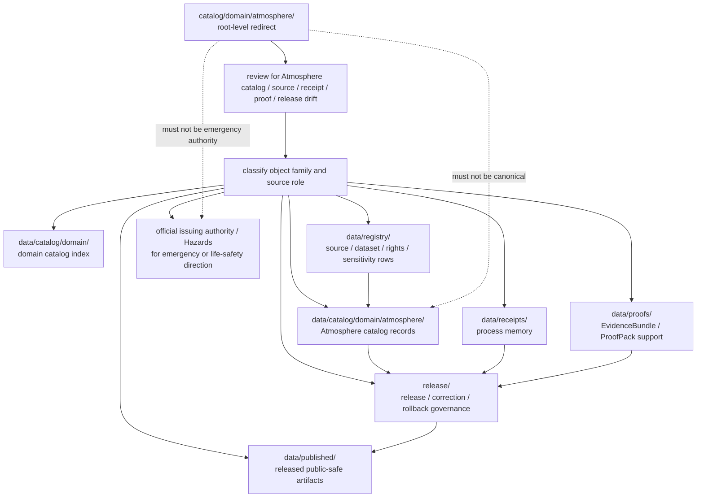

<!-- [KFM_META_BLOCK_V2]
doc_id: kfm://doc/catalog-domain-atmosphere-readme
title: catalog/domain/atmosphere/ — Atmosphere Domain Catalog Compatibility Redirect
type: readme
version: v0.2
status: draft
owners: OWNER_TBD — Atmosphere steward · Air-quality steward · Catalog steward · Data steward · Registry steward · Evidence steward · Receipt steward · Proof steward · Release steward · Policy steward · Schema steward · Docs steward
created: 2026-06-16
updated: 2026-07-10
policy_label: public
related:
  - ../README.md
  - ../../README.md
  - ../../../data/README.md
  - ../../../data/catalog/README.md
  - ../../../data/catalog/domain/README.md
  - ../../../data/catalog/domain/atmosphere/README.md
  - ../../../data/catalog/domain/atmosphere/pm25_2026/README.md
  - ../../../data/registry/README.md
  - ../../../data/receipts/README.md
  - ../../../data/proofs/README.md
  - ../../../data/published/README.md
  - ../../../release/README.md
  - ../../../docs/domains/atmosphere/README.md
  - ../../../schemas/contracts/v1/
  - ../../../contracts/
  - ../../../policy/
  - ../../../docs/adr/ADR-0011-receipts-vs-proofs-vs-manifests-vs-catalog-separation.md
  - ../../../docs/doctrine/directory-rules.md
tags: [kfm, catalog, domain, atmosphere, air, climate, weather, air-quality, pm25, compatibility-root, redirect, data-catalog-domain, receipt-proof-catalog-publication-separation, non-authoritative, drift-fence, no-public-use, source-role-aware]
notes:
  - "Refreshes the root-level catalog/domain/atmosphere compatibility-redirect fence."
  - "Root-level catalog/domain/atmosphere/ is compatibility and drift-control documentation only, not canonical atmosphere domain catalog authority, source authority, registry authority, receipt authority, proof authority, release authority, publication authority, schema authority, policy authority, producer authority, hosting authority, emergency-alert authority, or UI authority."
  - "Canonical atmosphere domain catalog records belong under data/catalog/domain/atmosphere/; parent domain catalog indexing belongs under data/catalog/domain/; source/rights/sensitivity rows belong under data/registry/; receipts belong under data/receipts/; proof support belongs under data/proofs/; release-governance records belong under release/; published delivery artifacts belong under data/published/ after governed release."
  - "Atmosphere domain doctrine says the lane is not an emergency alert or life-safety system; emergency advisories and life-safety direction belong to Hazards or official issuing authorities."
  - "Atmosphere source-role guardrails remain: AQI is not raw concentration; AOD is not PM2.5; model fields and forecasts are not observations; low-cost sensor data needs correction, caveats, confidence, limitations, policy posture, and source rights before public use."
  - "ADR-0011 is proposed and is used here only as separation evidence, not accepted-rule proof."
  - "Do not add atmosphere catalog records, STAC/DCAT/PROV records, source descriptors, registry rows, observations, station records, model outputs, advisory payloads, EvidenceBundles, receipts, release records, published artifacts, schemas, policy rules, generated outputs, or producer targets here without an ADR/migration note."
  - "Actual current contents beyond this README, historical producers, workflow writes, migration status, CI/review enforcement, public-client/producer exclusion, hosting readiness, atmosphere catalog schema maturity, STAC/DCAT/PROV closure, source-rights state, and ADR disposition remain NEEDS VERIFICATION."
  - "v0.2 adds current evidence basis, Directory Rules placement basis, canonical data/catalog/domain/atmosphere alignment, atmosphere source-role guardrails, family-separation posture, minimum safe redirect slice, anti-bypass matrix, migration/rollback posture, and safe language rules without claiming migration or enforcement maturity."
[/KFM_META_BLOCK_V2] -->

<a id="top"></a>

<div align="center">

# Atmosphere Domain Catalog Compatibility Redirect

`catalog/domain/atmosphere/`

**Root-level compatibility and drift-control fence for legacy or accidental Atmosphere-domain catalog placement. Canonical Atmosphere catalog records belong under `data/catalog/domain/atmosphere/`; related registry, receipt, proof, release, and published artifact families stay in their own roots.**


[Evidence](#0-evidence-basis-for-this-revision) · [Purpose](#1-purpose) · [Canonical homes](#2-canonical-homes) · [Boundary](#3-authority-boundary) · [Atmosphere guardrails](#8-atmosphere-source-role-guardrails) · [Migration](#11-migration-posture) · [Definition of done](#18-definition-of-done)

</div>

---

> [!IMPORTANT]
> **Status:** draft / `NEEDS VERIFICATION`  
> **Path:** `catalog/domain/atmosphere/README.md`  
> **Responsibility root:** compatibility redirect / drift fence only  
> **Canonical Atmosphere catalog home:** `data/catalog/domain/atmosphere/`  
> **Parent domain catalog home:** `data/catalog/domain/`  
> **Registry home:** `data/registry/`  
> **Receipt home:** `data/receipts/`  
> **Proof home:** `data/proofs/`  
> **Release-governance home:** `release/`  
> **Published artifact home:** `data/published/`  
> **Directory Rules basis:** file location encodes ownership, governance, and lifecycle. Root-level `catalog/domain/atmosphere/` is a compatibility redirect only and must not become a parallel atmosphere catalog, source, observation, station, model, advisory, registry, STAC, DCAT, PROV, receipt, proof, release, publication, schema, policy, pipeline, package, tool, search, hosting, emergency-alert, or UI authority.  
> **Truth posture:** CONFIRMED current GitHub README path / CONFIRMED parent root-level `catalog/domain/README.md` exists and treats `catalog/domain/` as compatibility redirect / CONFIRMED `data/catalog/domain/README.md` exists and treats `data/catalog/domain/` as domain-scoped CATALOG-stage index / CONFIRMED `data/catalog/domain/atmosphere/README.md` exists and treats `data/catalog/domain/atmosphere/` as the Atmosphere CATALOG-stage sublane / CONFIRMED `docs/domains/atmosphere/README.md` exists and states Atmosphere is not an emergency alert system / CONFIRMED `data/registry/README.md`, `data/receipts/README.md`, `data/proofs/README.md`, and `release/README.md` exist and preserve family separation / CONFIRMED Directory Rules document exists / PROPOSED root-level `catalog/domain/atmosphere/` redirect contract / UNKNOWN actual files beyond README, historical producers, workflow writes, migration status, atmosphere catalog schema maturity, STAC/DCAT/PROV closure, CI/review guard, public-client/producer exclusion, hosting readiness, and ADR disposition

> [!CAUTION]
> Do not make `catalog/domain/atmosphere/` a parallel Atmosphere catalog authority. Atmosphere catalog records belong under `data/catalog/domain/atmosphere/`; source/rights/sensitivity rows belong under `data/registry/`; receipts, proofs, release decisions, published artifacts, schemas, contracts, policies, source code, generated previews, emergency advisory payloads, and unpublished lifecycle data stay in their own owning roots.

---

## Quick jump

- [0. Evidence basis for this revision](#0-evidence-basis-for-this-revision)
- [1. Purpose](#1-purpose)
- [2. Canonical homes](#2-canonical-homes)
- [3. Authority boundary](#3-authority-boundary)
- [4. Default posture](#4-default-posture)
- [5. Allowed contents](#5-allowed-contents)
- [6. Forbidden contents](#6-forbidden-contents)
- [7. Directory shape](#7-directory-shape)
- [8. Atmosphere source-role guardrails](#8-atmosphere-source-role-guardrails)
- [9. Minimum safe redirect slice](#9-minimum-safe-redirect-slice)
- [10. Child and canonical lane posture](#10-child-and-canonical-lane-posture)
- [11. Migration posture](#11-migration-posture)
- [12. Runtime and producer anti-bypass matrix](#12-runtime-and-producer-anti-bypass-matrix)
- [13. Diagram](#13-diagram)
- [14. Inspection path](#14-inspection-path)
- [15. Validation expectations](#15-validation-expectations)
- [16. Safe change pattern](#16-safe-change-pattern)
- [17. Rollback and correction posture](#17-rollback-and-correction-posture)
- [18. Definition of done](#18-definition-of-done)
- [19. Open verification items](#19-open-verification-items)
- [20. Safe language rules](#20-safe-language-rules)

---

## 0. Evidence basis for this revision

This README is a documentation boundary, not migration proof, catalog-schema proof, source-rights proof, STAC/DCAT/PROV closure proof, release approval proof, publication-hosting proof, emergency-alert authority, or CI enforcement proof. The 2026-07-10 revision updates an existing compatibility README and keeps maturity bounded while aligning root-level `catalog/domain/atmosphere/` with the canonical `data/catalog/domain/atmosphere/` Atmosphere catalog lane, the parent `data/catalog/domain/` domain catalog index, the separate `data/registry/` registry root, the separate `data/receipts/` process-memory root, the separate `data/proofs/` proof-support root, the `release/` release-governance root, and Directory Rules placement posture.

| Evidence item | Status | What it supports | What it does not prove |
|---|---|---|---|
| `catalog/domain/atmosphere/README.md` exists on `main`. | CONFIRMED | This is an existing README update, not a new path proposal. | It does not prove actual contents beyond the README, historical producers, migration status, CI enforcement, public-client exclusion, hosting readiness, source-rights maturity, or ADR disposition. |
| `catalog/domain/README.md` exists and treats root-level `catalog/domain/` as a compatibility redirect, not canonical domain catalog authority. | CONFIRMED parent redirect posture | The Atmosphere child path should inherit compatibility-fence behavior. | It does not prove all root-level domain catalog drift has been removed. |
| `data/catalog/domain/README.md` exists and treats `data/catalog/domain/` as a domain-scoped CATALOG-stage index. | CONFIRMED domain-catalog parent posture | Domain catalog records belong under `data/catalog/domain/`, not root-level `catalog/domain/`. | It does not prove complete child inventory, validators, policy gates, receipts, release manifests, public API/map behavior, or route behavior. |
| `data/catalog/domain/atmosphere/README.md` exists and treats `data/catalog/domain/atmosphere/` as the Atmosphere-domain catalog lane. | CONFIRMED canonical Atmosphere catalog lane posture | Atmosphere catalog records belong under `data/catalog/domain/atmosphere/`. | It does not prove concrete catalog records, schemas, validators, policy gates, receipts, ReleaseManifest linkage, or governed route behavior. |
| `docs/domains/atmosphere/README.md` exists and states Atmosphere is not an emergency alert or life-safety system. | CONFIRMED domain-doctrine posture | Atmosphere catalog records must preserve context/source-role boundaries and official-source redirection for advisories. | It does not prove endpoint behavior, source rights, or real-time alerting integrations. |
| `data/registry/README.md` exists and treats registry rows as source/rights/sensitivity-aware governance records. | CONFIRMED registry-root posture | Source descriptors, rights rows, sensitivity rows, dataset rows, and related registry records belong under `data/registry/`. | It does not prove final taxonomy, row inventories, validators, or release integration. |
| `data/receipts/README.md` exists and marks receipts as process memory. | CONFIRMED receipt-root posture | Catalog-build, validation, migration, AI, correction, and release-support receipts belong under `data/receipts/`. | It does not prove emitted receipt inventories, signing, validators, release integration, or CI enforcement. |
| `data/proofs/README.md` exists and treats proof artifacts as support objects, not public truth by placement. | CONFIRMED proof-root posture | EvidenceBundle and ProofPack support belongs under `data/proofs/`, not this redirect path. | It does not prove emitted proof inventories, schemas, validators, fixtures, CI workflows, or release-gate enforcement. |
| `release/README.md` exists and treats `release/` as release-governance root. | CONFIRMED release-root posture | Release decisions, correction, rollback, withdrawal, supersession, and signatures belong under `release/`. | It does not prove release workflow maturity or active release approval. |
| `docs/adr/ADR-0011-receipts-vs-proofs-vs-manifests-vs-catalog-separation.md` exists and states the proposed separation rule `receipt ≠ proof ≠ catalog ≠ publication`. | CONFIRMED ADR document presence; PROPOSED decision status | Supports family-separation language while keeping ADR acceptance bounded. | It does not prove ADR acceptance or validator enforcement. |
| `docs/doctrine/directory-rules.md` exists and states that file location encodes ownership, governance, and lifecycle. | CONFIRMED placement doctrine | Root-level `catalog/domain/atmosphere/` must remain a compatibility fence; catalog, registry, receipt, proof, release, and published records belong under their owning roots. | It does not prove live repo drift has been fully audited. |

[Back to top](#top)

---

## 1. Purpose

`catalog/domain/atmosphere/` is a **root-level compatibility redirect** for Atmosphere-domain catalog path drift.

It exists only to prevent accidental, legacy, generated, copied, or externally imported Atmosphere catalog-family material from becoming a parallel authority outside KFM's governed lifecycle, registry, proof, receipt, release, and publication roots.

This folder should not be used for canonical:

- Atmosphere domain catalog records, station indexes, observation catalogs, PM2.5 dataset catalogs, ozone records, smoke context indexes, AOD raster catalogs, weather-station catalogs, climate-normal/anomaly catalogs, model-field catalogs, forecast context, or advisory context;
- STAC, DCAT, PROV, CatalogMatrix, layer catalog, source catalog, catalog index, catalog manifest, or discovery records;
- raw observations, corrected observations, model outputs, forecast products, advisory payloads, sensor/platform payloads, QA outputs, or generated public previews;
- process receipts, catalog-build receipts, validation receipts, migration receipts, rollback receipts, release dry-run receipts, AI receipts, or telemetry receipts;
- EvidenceBundles, ProofPacks, citation-validation bundles, catalog-closure proof, release-readiness proof, rollback proof, correction proof, or claim-support records;
- release manifests, promotion decisions, rollback cards, correction notices, withdrawal notices, supersession records, signatures, release-state records, public-safe artifacts, reports, stories, tiles, PMTiles, API payload snapshots, public indexes, allowlists, caveat summaries, or digest sidecars;
- source descriptors, dataset rows, crosswalks, rights rows, sensitivity rows, schemas, contracts, policy rules, producer code, generated previews, build outputs, or unpublished lifecycle data.

This README does not prove that Atmosphere catalog drift currently exists here, that migration has been completed, that producer tools avoid this path, that public clients exclude this path, that Atmosphere catalog schemas are implemented, that CI blocks writes here, or that any ADR has finalized long-term retention of this compatibility root.

[Back to top](#top)

---

## 2. Canonical homes

Atmosphere domain catalog records belong under:

```text
data/catalog/domain/atmosphere/
```

Parent domain-catalog indexing belongs under:

```text
data/catalog/domain/
```

Source, dataset, rights, sensitivity, and related registry rows belong under:

```text
data/registry/
```

Process-memory receipts belong under:

```text
data/receipts/
```

Proof support belongs under:

```text
data/proofs/
```

Release-governance material belongs under:

```text
release/
```

Released public-safe delivery artifacts belong under:

```text
data/published/
```

The root-level `catalog/domain/atmosphere/` directory is a redirect/fence only.

```text
catalog/domain/atmosphere/       # compatibility redirect only; do not add catalog-family records here
data/catalog/domain/atmosphere/  # Atmosphere CATALOG-stage records
data/catalog/domain/             # domain catalog index
data/registry/                   # source / dataset / rights / sensitivity rows
data/receipts/                   # process-memory records
data/proofs/                     # proof-support records
release/                         # release / correction / rollback governance
data/published/                  # released public-safe delivery artifacts
```

If a future ADR or migration changes Atmosphere catalog placement, this README should be updated to cite the accepted target, producer-configuration evidence, validation evidence, and any migration, correction, or rollback records.

## 3. Authority boundary

`catalog/domain/atmosphere/` has **no canonical Atmosphere catalog authority**, **no source authority**, **no registry authority**, **no observation authority**, **no emergency-alert authority**, **no receipt authority**, **no proof authority**, **no release authority**, and **no publication authority**. It may hold only redirect guidance, migration notes, drift logs, or temporary markers while misplaced material is reviewed and moved into its proper owning root.

```text
WRONG / LEGACY ROOT                    ATMOSPHERE CATALOG HOME                SUPPORT AND RELEASE HOMES
catalog/domain/atmosphere/        -->  data/catalog/domain/atmosphere/   -->  data/registry/
compatibility fence only                atmosphere catalog records            data/receipts/
not authoritative                        station / observation / context       data/proofs/
                                         discovery carriers                    release/
                                                                               data/published/
```

An Atmosphere catalog record outside `data/catalog/domain/atmosphere/` should be treated as Atmosphere catalog-family drift. A source or rights row outside `data/registry/`, a receipt outside `data/receipts/`, a proof outside `data/proofs/`, a release record outside `release/`, or a public artifact outside `data/published/` should be treated as family drift until reviewed and migrated.

## 4. Default posture

Anything found under root-level `catalog/domain/atmosphere/` should be treated as **NEEDS VERIFICATION** and potentially misplaced.

Do not expose, publish, index, cite, search, cache, export, tile, host, or depend on root-level Atmosphere catalog files as canonical Atmosphere, source, proof, release, registry, emergency, or published artifact records. First confirm object family, source, source role, provenance, rights, sensitivity, evidence resolution, schema validity, policy decision, lifecycle state, receipt support, proof support, catalog closure, release state, digest/sidecar integrity, rollback path, correction path, and whether the object is actually a catalog record, observation, model output, advisory context, registry row, receipt, proof, release-governance record, published artifact, or unpublished candidate.

## 5. Allowed contents

| Allowed item | Example | Required posture |
|---|---|---|
| README / redirect docs | `README.md` | Compatibility fence only |
| Migration note | `MIGRATION.md` | Temporary and ADR/review-linked |
| Drift note | `DRIFT.md`, `OPEN-QUESTIONS.md` | Must point to canonical homes and review steps |
| Placeholder marker | `.gitkeep` | Does not authorize catalog, observation, source, proof, receipt, release, policy, schema, emergency, or public-output content |

## 6. Forbidden contents

| Forbidden here | Correct home |
|---|---|
| Atmosphere domain catalog records, indexes, station catalogs, observation catalogs, model-context catalogs, advisory-context catalogs | `data/catalog/domain/atmosphere/` |
| PM2.5, ozone, smoke, AOD, weather, climate, forecast, advisory-context, sensor, station, or platform records | Correct lifecycle lane under `data/`, usually `data/catalog/domain/atmosphere/` for catalog records or upstream RAW/WORK/QUARANTINE/PROCESSED lanes for source/data payloads |
| STAC, DCAT, PROV, CatalogMatrix, catalog manifests, discovery records | `data/catalog/` or accepted child lanes under it |
| Source descriptors, source registry rows, dataset rows, rights rows, sensitivity rows, station registry rows | `data/registry/` or governed registry homes |
| Receipts, catalog-build receipts, validation receipts, redaction/generalization receipts, AI receipts, release dry-run receipts, rollback receipts, migration receipts | `data/receipts/` |
| EvidenceBundles, ProofPacks, attestations, citation-validation bundles, release-readiness proof, rollback proof, correction proof, claim-support records | `data/proofs/` |
| ReleaseManifest, PromotionDecision, release decision, RollbackCard, CorrectionNotice, withdrawal, supersession, signature, release-state record | `release/` |
| Released artifacts, public-safe atmosphere exports, reports, stories, downloads, API payload snapshots, public indexes, allowlists, caveat summaries, digest sidecars, tiles, PMTiles | `data/published/` after governed release |
| Emergency alerts, life-safety direction, official warning payloads | Official issuing authorities / Hazards lane routing, not this catalog redirect path |
| Schemas and machine-shape contracts | `schemas/contracts/v1/` |
| Human contracts and object-meaning docs | `contracts/` |
| Policy rules and policy decisions | `policy/` and governed policy-decision homes |
| Source code, scripts, packages, pipelines, build tools, producers, preview generators | `apps/`, `packages/`, `tools/`, `scripts/`, `pipelines/` |
| RAW, WORK, QUARANTINE, PROCESSED, CATALOG, TRIPLET, unpublished candidate, or restricted lifecycle data | `data/` lifecycle subtrees |

## 7. Directory shape

Current implementation inventory remains `NEEDS VERIFICATION`.

```text
catalog/domain/atmosphere/
├── README.md                 # compatibility redirect / drift fence
├── MIGRATION.md              # PROPOSED only if migration is active
└── DRIFT.md                  # PROPOSED only if misplaced Atmosphere catalog material is found
```

> [!WARNING]
> Do not treat this suggested shape as complete repo inventory. Verify actual contents before making inventory, producer, enforcement, catalog-schema, source-rights, hosting, or migration claims.

## 8. Atmosphere source-role guardrails

Atmosphere catalog drift is especially risky because observation, report, model, proxy, advisory, and emergency-context records can look similar in a catalog index. Any material found here must preserve source role before it is migrated or used.

| Guardrail | Required posture |
|---|---|
| Atmosphere is not an emergency alert system | Do not represent this path as warning, alert, or life-safety authority. Redirect emergency guidance to official issuing authorities and Hazards workflows. |
| AQI is not raw concentration | Keep AQI/report context separate from measured concentration records and proof support. |
| AOD is not PM2.5 | Satellite/aerosol proxy material must not be treated as surface PM2.5 observation without evidence, model, uncertainty, and caveat support. |
| Model fields are not observations | Forecast, reanalysis, interpolation, and modeled fields must be labeled as model or forecast context. |
| Advisory context is not authority by placement | Advisory context must keep official-source, timestamp, jurisdiction, caveat, and redirect posture visible. |
| Low-cost sensor data is caveated | Require correction, confidence, limitations, source rights, policy posture, and release review before public use. |
| Public exposure is release-gated | A catalog record is not public merely because it exists under a catalog lane. |

## 9. Minimum safe redirect slice

A smallest safe `catalog/domain/atmosphere/` state should prove only that the folder prevents drift; it should not contain trust-bearing catalog, source, observation, release, emergency, or public-delivery material.

| Slice item | Minimum requirement | Why it matters |
|---|---|---|
| Redirect README | Points to `data/catalog/domain/atmosphere/` for Atmosphere catalog records | Prevents parallel Atmosphere catalog authority |
| No catalog records | No station catalog, observation catalog, PM2.5 record, ozone record, smoke/AOD catalog, model-field catalog, advisory-context catalog, or catalog manifest | Preserves catalog lifecycle root |
| No source/registry records | No SourceDescriptor, rights row, sensitivity row, dataset row, source registry row, or station registry row | Preserves registry root |
| No source payloads | No raw observation, model output, corrected dataset, raster, station dump, or generated preview | Preserves lifecycle and pipeline boundaries |
| No receipt records | No CatalogBuildReceipt, RunReceipt, ValidationReceipt, AIReceipt, migration receipt, release dry-run receipt, rollback receipt, or redaction receipt | Preserves receipt/process-memory root |
| No proof records | No EvidenceBundle, ProofPack, release attestation, citation validation, rollback proof, correction proof, or claim-support files | Preserves proof-support root |
| No release/public artifacts | No ReleaseManifest, release decision, RollbackCard, published atmosphere export, public index, PMTiles, report, story, API snapshot, or digest | Preserves release and published roots |
| No emergency authority | No alert, warning, advisory directive, life-safety recommendation, or official issuer replacement | Prevents authority confusion |
| Drift procedure | Explains how to inspect and migrate misplaced records | Keeps remediation reversible |
| Producer guard | Producers, generators, scripts, and CI should not write durable Atmosphere catalog material here | Prevents reintroducing drift |
| Public-use guard | Public clients, search services, map runtimes, exports, static hosting, and indexes must not read from this path as canonical | Preserves governed access path |
| Verification backlog | Open items stay visible | Prevents documentation from pretending migration/enforcement is complete |

## 10. Child and canonical lane posture

| Lane | Status | Boundary |
|---|---|---|
| `catalog/domain/atmosphere/` | Compatibility redirect path | Root-level drift fence only; not canonical. |
| `data/catalog/domain/atmosphere/` | CONFIRMED README path / draft catalog lane | Canonical Atmosphere catalog placement for domain catalog records; still implementation-bounded. |
| `data/catalog/domain/atmosphere/pm25_2026/` | Referenced child lane in canonical Atmosphere catalog README | Dataset-family catalog lane; does not prove source inventory or release state without child evidence. |

Do not claim payload inventory, source descriptors, rights clearance, schema validity, release state, route behavior, map behavior, or hosting readiness from README presence alone.

## 11. Migration posture

If Atmosphere catalog-family files are found here:

1. Do not publish, cite, index, search, cache, export, tile, host, or depend on them.
2. Identify whether they are Atmosphere catalog records, station catalogs, observation catalogs, model-field catalogs, advisory context, STAC/DCAT/PROV records, CatalogMatrix records, source descriptors, registry rows, receipts, proof support, release records, published-output material, schemas, policy records, unpublished lifecycle material, generated previews, temporary build artifacts, or producer outputs.
3. Determine whether the file is historical drift, generated drift, copied output, unreviewed local work, or an intentional migration marker.
4. Move Atmosphere catalog records into `data/catalog/domain/atmosphere/` or an accepted child lane under it.
5. Move generic domain catalog index material into `data/catalog/domain/`.
6. Move source, dataset, rights, sensitivity, crosswalk, station, and layer rows into `data/registry/` or accepted registry child lanes.
7. Move receipts into `data/receipts/`.
8. Move proof support into `data/proofs/`.
9. Move release-governance records into `release/`.
10. Move or regenerate released public-safe Atmosphere artifacts into `data/published/` only after governed release approval and required sidecar/digest/citation/caveat support.
11. Move schemas, contracts, policy rules, code, and producer outputs into their owning roots.
12. Preserve provenance, source refs, source role, station identity, dataset identity, digests, catalog-build receipts, proof refs, catalog refs, review notes, producer identity, release refs, correction refs, and rollback path.
13. Add a drift register, migration note, or correction note if the misplaced material was previously consumed.
14. Add or update validation checks so producers do not recreate root-level Atmosphere catalog drift.
15. Leave `catalog/domain/atmosphere/` as a redirect/fence unless an accepted ADR explicitly changes the authority model.

## 12. Runtime and producer anti-bypass matrix

| Bypass risk | Required behavior | Review signal |
|---|---|---|
| Producer writes Atmosphere catalog records to `catalog/domain/atmosphere/` | Fail review/CI; write to `data/catalog/domain/atmosphere/` instead | Producer config and output paths checked |
| Producer writes source descriptors or rights rows here | Fail review/CI; write to `data/registry/` instead | Registry path check passes |
| Producer writes receipts here | Fail review/CI; write to `data/receipts/` instead | Receipt path check passes |
| Producer writes proofs here | Fail review/CI; write to `data/proofs/` instead | Proof path check passes |
| Producer writes release records here | Fail review/CI; write to `release/` instead | Release path check passes |
| Producer writes public Atmosphere exports here | Fail review/CI; write to `data/published/` only after release | Published path and release-state checks pass |
| Public client reads root-level Atmosphere catalog path | Deny; route through governed API/release/public-safe path | Client/search/index/hosting config excludes this path |
| Root-level Atmosphere file is treated as canonical measurement truth | Mark as drift; resolve evidence/proof/catalog/release support before use | Migration note references canonical target |
| AQI, AOD, model, forecast, advisory, or sensor context loses source-role labels | Hold, restrict, or abstain until role is restored | Source-role validation passes |
| Emergency or life-safety direction appears here | Remove or reroute to official authority/Hazards posture | Emergency-authority review passes |
| Claim-bearing catalog entry lacks EvidenceBundle support | Hold, restrict, or abstain; do not cite root-level material as evidence | EvidenceRef/proof validation passes |
| Sensitive location, infrastructure, health, or relationship join appears here | Deny, quarantine, redact, generalize, aggregate, or remove | Sensitivity/publication review passes |
| AI-generated Atmosphere catalog summary appears here | Treat as candidate or generated carrier only; route to work/quarantine/review lanes | AI boundary and evidence-review checks pass |
| Schema/profile file stored here | Move to `schemas/` or standards docs as appropriate | Schema-home review passes |
| Policy rule stored here | Move to `policy/` | Policy-root review passes |
| Search/cache/export/tile/static-hosting pipeline consumes this path | Deny as canonical; switch to governed catalog/release/published source | Producer and client config reviewed |
| Drift file already consumed downstream | Add correction/migration note and rollback path | Correction path is auditable |
| README claims CI enforcement without run/check evidence | Mark enforcement `NEEDS VERIFICATION` | Current CI evidence cited before pass claims |

## 13. Diagram



## 14. Inspection path

Actual root-level contents, producers, workflow writes, migration status, catalog schema maturity, source-rights maturity, STAC/DCAT/PROV closure, hosting readiness, CI/review enforcement, public-client/index exclusion, and current ADR disposition remain `NEEDS VERIFICATION`.

```bash
find catalog/domain/atmosphere -maxdepth 6 -type f | sort
find data/catalog/domain/atmosphere data/catalog/domain data/catalog data/registry data/receipts data/proofs data/published release schemas contracts policy docs tools scripts pipelines pipeline_specs .github/workflows -maxdepth 7 -type f 2>/dev/null | grep -Ei 'atmosphere|air|pm25|pm2|ozone|smoke|aod|weather|climate|forecast|advisory|catalog|stac|dcat|prov|registry|source|rights|sensitivity|receipt|proof|EvidenceBundle|ProofPack|ReleaseManifest|PromotionDecision|RollbackCard|CorrectionNotice|schema|policy|validator|workflow|migration|drift|published|api|search|host' | sort
```

## 15. Validation expectations

Useful validation for this folder should cover:

- no Atmosphere catalog records, station indexes, observation indexes, PM2.5 records, ozone records, smoke/AOD catalogs, climate records, model context, forecast context, advisory context, or catalog manifests are stored here;
- no STAC/DCAT/PROV records, source registry rows, rights rows, sensitivity rows, receipts, proofs, policy rules, schemas, source code, pipelines, tools, producer outputs, release records, public artifacts, emergency alerts, or unpublished lifecycle data are stored here;
- any non-README content is tied to an active migration, drift note, or placeholder marker;
- AQI/concentration, AOD/PM2.5, model/observation, advisory/official-authority, low-cost sensor/corrected observation, and public/unreleased distinctions remain visible;
- producer tools, scripts, generated outputs, workflows, indexes, search services, public clients, exports, tile jobs, static hosting, map runtimes, story/focus/evidence surfaces, and caches do not target `catalog/domain/atmosphere/` as canonical;
- links point users to `data/catalog/domain/atmosphere/`, `data/catalog/domain/`, `data/registry/`, `data/receipts/`, `data/proofs/`, `release/`, `data/published/`, and other owning roots;
- CI or review checks flag root-level `catalog/domain/atmosphere/` writes when enforcement exists;
- CI/pass/enforcement state is not claimed without current evidence.

## 16. Safe change pattern

For changes under `catalog/domain/atmosphere/`:

1. Confirm the change is redirect documentation, migration support, drift documentation, or a non-authoritative placeholder only.
2. Confirm it does not create a parallel Atmosphere catalog, source, registry, receipt, proof, release, publication, schema, policy, emergency, or public-hosting authority.
3. Confirm durable Atmosphere catalog records are placed under `data/catalog/domain/atmosphere/`.
4. Confirm source/rights/sensitivity registry rows remain under `data/registry/` or accepted registry sublanes.
5. Confirm receipts remain under `data/receipts/`.
6. Confirm proof support remains under `data/proofs/`.
7. Confirm release-governance records remain under `release/`.
8. Confirm released public-safe Atmosphere artifacts are placed under `data/published/` only after governed release approval.
9. Confirm emergency or life-safety direction is not represented as KFM Atmosphere authority.
10. Confirm no public client, search index, map runtime, export job, tile job, story/focus/evidence surface, static host, publication producer, release producer, or cache reads this path as canonical.
11. Document migration, correction, and rollback if any misplaced material was moved or previously consumed.
12. Update docs and validation rules when behavior materially changes.

## 17. Rollback and correction posture

If material was added here by mistake, rollback should be small and auditable:

1. Remove or quarantine the misplaced file.
2. Identify the owning root and correct lifecycle state.
3. Preserve hashes, source refs, timestamps, producer identity, and review notes.
4. Add a drift or migration note when downstream consumers may have seen the material.
5. Add a correction note if a public or semi-public surface consumed the material.
6. Add a rollback target for any generated artifact, search index, map layer, tile, cache, or API payload that used the misplaced file.
7. Update producer paths or validation checks so the drift cannot be recreated quietly.

## 18. Definition of done

- [ ] Owners are confirmed and `OWNER_TBD` is replaced.
- [ ] Actual root-level `catalog/domain/atmosphere/` contents are verified.
- [ ] Any misplaced Atmosphere catalog material is migrated or documented as drift.
- [ ] Canonical Atmosphere catalog placement under `data/catalog/domain/atmosphere/` is confirmed for the target ref.
- [ ] No trust-bearing records live here.
- [ ] No Atmosphere catalog records, STAC/DCAT/PROV records, registry records, observations, model outputs, advisory payloads, receipts, proofs, release records, published artifacts, schemas, contracts, policy rules, source code, producer outputs, emergency authority, or lifecycle data live here.
- [ ] Public-client, search, export, tile, static-hosting, and producer configs exclude this path as canonical.
- [ ] Atmosphere source-role guardrails are validated where material is migrated or referenced.
- [ ] CI/review behavior is verified or marked `NEEDS VERIFICATION`.

## 19. Open verification items

| Item | Why it matters |
|---|---|
| Confirm actual files under root-level `catalog/domain/atmosphere/` | Prevents overclaiming or missing drift |
| Confirm whether any workflow writes here | Required before producer claims |
| Confirm migration status to `data/catalog/domain/atmosphere/` | Required before canonical-home claims beyond README/path evidence |
| Confirm Atmosphere catalog schemas/profiles and validators | Required before implementation claims |
| Confirm source descriptors, rights rows, sensitivity rows, and source-role validation | Required before public or release-linked use |
| Confirm STAC/DCAT/PROV/triplet closure where projections exist | Required before release closure claims |
| Confirm CI/review guard exists | Required before enforcement claims |
| Confirm no trust records are stored here | Required before Directory Rules compliance claims |
| Confirm ADR status for root-level `catalog/domain/atmosphere/` | Required before long-term retention claims |
| Confirm emergency-alert and official-authority routing posture | Required before any advisory-context public surface |

## 20. Safe language rules

Use language that preserves compatibility and evidence boundaries:

| Avoid saying | Safer wording |
|---|---|
| "This folder contains Atmosphere catalog records." | "This folder is a compatibility redirect; canonical Atmosphere catalog records belong under `data/catalog/domain/atmosphere/`." |
| "Atmosphere catalog records here are valid." | "Any material found here is drift until reviewed and migrated." |
| "This path is public." | "Public exposure requires governed release and public-safe delivery artifacts under approved paths." |
| "AQI proves PM2.5 concentration." | "AQI/report context and concentration observations must remain distinct." |
| "AOD is PM2.5." | "AOD is a proxy/context signal and must not be treated as surface PM2.5 without evidence, model, and caveat support." |
| "Forecast/model fields are observations." | "Forecast/model fields are model or forecast context and must stay labeled." |
| "This folder can host advisories." | "Emergency or life-safety direction belongs to official issuing authorities/Hazards posture, not this catalog redirect path." |
| "CI blocks this." | "CI/review enforcement is `NEEDS VERIFICATION` unless current checks are cited." |

<details>
<summary>Appendix A — no-loss preservation note</summary>

The prior v0.1 README already established `catalog/domain/atmosphere/` as a compatibility redirect and warned that canonical Atmosphere catalog material belongs under the governed `data/catalog/domain/` tree. This v0.2 update preserves that posture and adds current evidence basis, confirmed canonical `data/catalog/domain/atmosphere/` README alignment, source-role guardrails, family separation, anti-bypass checks, migration/rollback expectations, and safe language rules without claiming migration work, CI enforcement, producer behavior, public-client exclusion, catalog schema maturity, release readiness, or ADR disposition are implemented.

</details>

## Status summary

`catalog/domain/atmosphere/` is a root-level compatibility redirect and Atmosphere-domain catalog drift fence. It is not the canonical Atmosphere catalog, source, registry, receipt, proof, release, publication, schema, policy, emergency-alert, producer, hosting, or UI home.

Atmosphere catalog authority belongs under `data/catalog/domain/atmosphere/`; source, rights, and sensitivity governance belongs under `data/registry/`; receipt support belongs under `data/receipts/`; proof support belongs under `data/proofs/`; release decisions belong under `release/`; released public-safe products belong under `data/published/`.

<p align="right"><a href="#top">Back to top</a></p>
