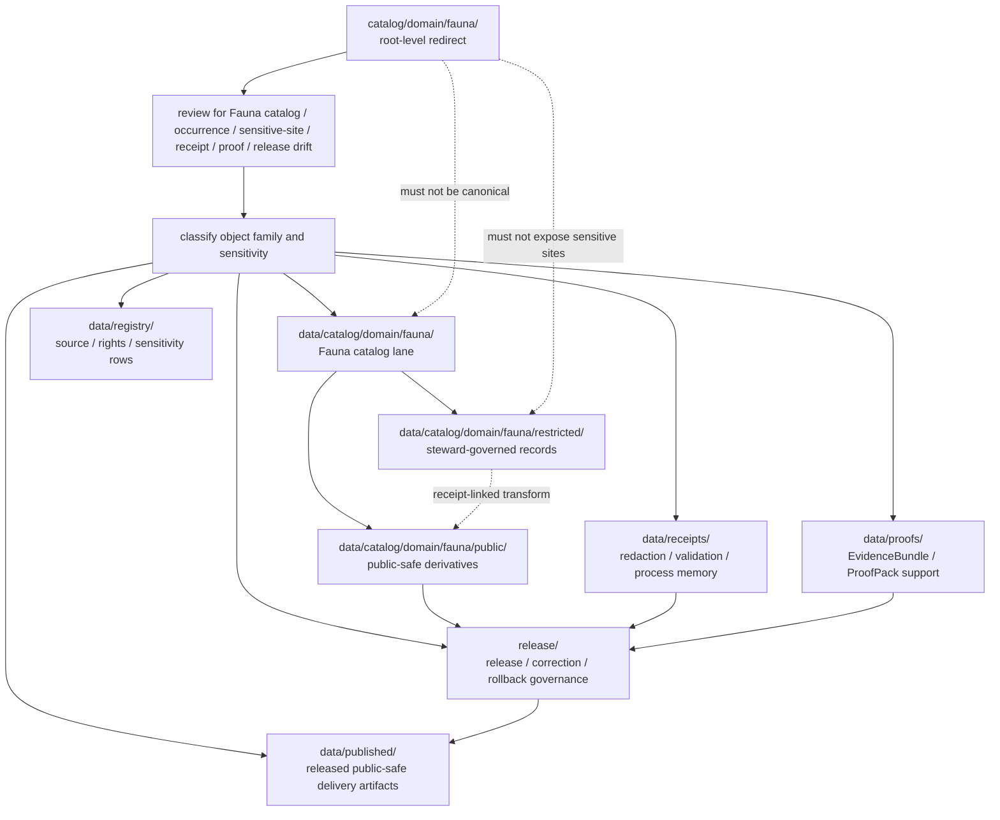

<!-- [KFM_META_BLOCK_V2]
doc_id: kfm://doc/catalog-domain-fauna-readme
title: catalog/domain/fauna/ — Fauna Domain Catalog Compatibility Redirect
type: readme
version: v0.2
status: draft
owners: OWNER_TBD — Fauna steward · Ecology sensitivity steward · Catalog steward · Data steward · Registry steward · Evidence steward · Receipt steward · Proof steward · Release steward · Policy steward · Schema steward · Docs steward
created: 2026-06-16
updated: 2026-07-10
policy_label: public
related:
  - ../README.md
  - ../../README.md
  - ../../../data/README.md
  - ../../../data/catalog/README.md
  - ../../../data/catalog/domain/README.md
  - ../../../data/catalog/domain/fauna/README.md
  - ../../../data/catalog/domain/fauna/public/README.md
  - ../../../data/catalog/domain/fauna/restricted/README.md
  - ../../../data/registry/README.md
  - ../../../data/receipts/README.md
  - ../../../data/proofs/README.md
  - ../../../data/published/README.md
  - ../../../release/README.md
  - ../../../docs/domains/fauna/ARCHITECTURE.md
  - ../../../schemas/contracts/v1/
  - ../../../contracts/
  - ../../../policy/
  - ../../../docs/adr/ADR-0011-receipts-vs-proofs-vs-manifests-vs-catalog-separation.md
  - ../../../docs/doctrine/directory-rules.md
tags: [kfm, catalog, domain, fauna, ecology, biodiversity, geoprivacy, sensitivity, rare-species, occurrence-restricted, occurrence-public, compatibility-root, redirect, data-catalog-domain, receipt-proof-catalog-publication-separation, non-authoritative, drift-fence, no-public-use]
notes:
  - "Refreshes the root-level catalog/domain/fauna compatibility-redirect fence."
  - "Root-level catalog/domain/fauna/ is compatibility and drift-control documentation only, not canonical fauna domain catalog authority, occurrence authority, source authority, registry authority, receipt authority, proof authority, release authority, publication authority, schema authority, policy authority, producer authority, hosting authority, or UI authority."
  - "Canonical fauna domain catalog records belong under data/catalog/domain/fauna/; public-safe catalog records belong under data/catalog/domain/fauna/public/; restricted catalog records belong under data/catalog/domain/fauna/restricted/; source/rights/sensitivity rows belong under data/registry/; receipts belong under data/receipts/; proof support belongs under data/proofs/; release-governance records belong under release/; published delivery artifacts belong under data/published/ after governed release."
  - "Fauna architecture marks this as a sensitive lane with deny-by-default posture for sensitive occurrences and sites. Exact occurrence, nest, den, roost, hibernaculum, spawning, lek, telemetry, and steward-flagged site details must not be exposed through this compatibility path."
  - "ADR-0011 is proposed and is used here only as separation evidence, not accepted-rule proof."
  - "Do not add fauna catalog records, occurrence records, sensitive-site records, STAC/DCAT/PROV records, source descriptors, registry rows, EvidenceBundles, receipts, release records, published artifacts, schemas, policy rules, generated outputs, or producer targets here without an ADR/migration note."
  - "Actual current contents beyond this README, historical producers, workflow writes, migration status, CI/review enforcement, public-client/producer exclusion, hosting readiness, fauna catalog schema maturity, STAC/DCAT/PROV closure, access-control maturity, sensitivity/redaction decisions, and ADR disposition remain NEEDS VERIFICATION."
  - "v0.2 adds current evidence basis, Directory Rules placement basis, canonical data/catalog/domain/fauna alignment, public/restricted lane posture, fauna sensitivity guardrails, family-separation posture, minimum safe redirect slice, anti-bypass matrix, migration/rollback posture, and safe language rules without claiming migration or enforcement maturity."
[/KFM_META_BLOCK_V2] -->

<a id="top"></a>

<div align="center">

# Fauna Domain Catalog Compatibility Redirect

`catalog/domain/fauna/`

**Root-level compatibility and drift-control fence for legacy or accidental Fauna-domain catalog placement. Canonical Fauna catalog records belong under `data/catalog/domain/fauna/`; public-safe and restricted catalog sublanes stay under that canonical data-catalog lane.**


[Evidence](#0-evidence-basis-for-this-revision) · [Purpose](#1-purpose) · [Canonical homes](#2-canonical-homes) · [Boundary](#3-authority-boundary) · [Sensitivity guardrails](#8-fauna-sensitivity-and-geoprivacy-guardrails) · [Migration](#11-migration-posture) · [Definition of done](#18-definition-of-done)

</div>

---

> [!IMPORTANT]
> **Status:** draft / `NEEDS VERIFICATION`  
> **Path:** `catalog/domain/fauna/README.md`  
> **Responsibility root:** compatibility redirect / drift fence only  
> **Canonical Fauna catalog home:** `data/catalog/domain/fauna/`  
> **Public-safe catalog sublane:** `data/catalog/domain/fauna/public/`  
> **Restricted catalog sublane:** `data/catalog/domain/fauna/restricted/`  
> **Parent domain catalog home:** `data/catalog/domain/`  
> **Registry home:** `data/registry/`  
> **Receipt home:** `data/receipts/`  
> **Proof home:** `data/proofs/`  
> **Release-governance home:** `release/`  
> **Published artifact home:** `data/published/`  
> **Directory Rules basis:** file location encodes ownership, governance, and lifecycle. Root-level `catalog/domain/fauna/` is a compatibility redirect only and must not become a parallel fauna catalog, occurrence, sensitive-site, source, registry, STAC, DCAT, PROV, receipt, proof, release, publication, schema, policy, pipeline, package, tool, search, hosting, or UI authority.  
> **Truth posture:** CONFIRMED current GitHub README path / CONFIRMED parent root-level `catalog/domain/README.md` exists and treats `catalog/domain/` as compatibility redirect / CONFIRMED `data/catalog/domain/fauna/README.md` exists and treats `data/catalog/domain/fauna/` as the Fauna CATALOG-stage sublane / CONFIRMED `data/catalog/domain/fauna/public/README.md` and `data/catalog/domain/fauna/restricted/README.md` exist and preserve public/restricted separation / CONFIRMED `docs/domains/fauna/ARCHITECTURE.md` exists and marks Fauna as sensitive with deny-by-default posture for sensitive occurrences/sites / CONFIRMED `data/registry/README.md`, `data/receipts/README.md`, `data/proofs/README.md`, and `release/README.md` exist and preserve family separation / CONFIRMED Directory Rules document exists / PROPOSED root-level `catalog/domain/fauna/` redirect contract / UNKNOWN actual files beyond README, historical producers, workflow writes, migration status, fauna catalog schema maturity, STAC/DCAT/PROV closure, CI/review guard, public-client/producer exclusion, access-control maturity, hosting readiness, and ADR disposition

> [!CAUTION]
> Do not make `catalog/domain/fauna/` a parallel Fauna catalog authority. Fauna catalog records belong under `data/catalog/domain/fauna/`; restricted and public-safe catalog records must remain distinguishable and linked; source/rights/sensitivity rows belong under `data/registry/`; receipts, proofs, release decisions, published artifacts, schemas, contracts, policies, source code, generated previews, and unpublished lifecycle data stay in their own owning roots.

---

## Quick jump

- [0. Evidence basis for this revision](#0-evidence-basis-for-this-revision)
- [1. Purpose](#1-purpose)
- [2. Canonical homes](#2-canonical-homes)
- [3. Authority boundary](#3-authority-boundary)
- [4. Default posture](#4-default-posture)
- [5. Allowed contents](#5-allowed-contents)
- [6. Forbidden contents](#6-forbidden-contents)
- [7. Directory shape](#7-directory-shape)
- [8. Fauna sensitivity and geoprivacy guardrails](#8-fauna-sensitivity-and-geoprivacy-guardrails)
- [9. Minimum safe redirect slice](#9-minimum-safe-redirect-slice)
- [10. Public and restricted lane posture](#10-public-and-restricted-lane-posture)
- [11. Migration posture](#11-migration-posture)
- [12. Runtime and producer anti-bypass matrix](#12-runtime-and-producer-anti-bypass-matrix)
- [13. Diagram](#13-diagram)
- [14. Inspection path](#14-inspection-path)
- [15. Validation expectations](#15-validation-expectations)
- [16. Safe change pattern](#16-safe-change-pattern)
- [17. Rollback and correction posture](#17-rollback-and-correction-posture)
- [18. Definition of done](#18-definition-of-done)
- [19. Open verification items](#19-open-verification-items)
- [20. Safe language rules](#20-safe-language-rules)

---

## 0. Evidence basis for this revision

This README is a documentation boundary, not migration proof, catalog-schema proof, access-control proof, sensitivity-review proof, redaction proof, STAC/DCAT/PROV closure proof, release approval proof, publication-hosting proof, or CI enforcement proof. The 2026-07-10 revision updates an existing compatibility README and keeps maturity bounded while aligning root-level `catalog/domain/fauna/` with the canonical `data/catalog/domain/fauna/` Fauna catalog lane, the `public/` and `restricted/` child catalog lanes, the separate `data/registry/` registry root, the separate `data/receipts/` process-memory root, the separate `data/proofs/` proof-support root, the `release/` release-governance root, and Directory Rules placement posture.

| Evidence item | Status | What it supports | What it does not prove |
|---|---|---|---|
| `catalog/domain/fauna/README.md` exists on `main`. | CONFIRMED | This is an existing README update, not a new path proposal. | It does not prove actual contents beyond the README, historical producers, migration status, CI enforcement, public-client exclusion, hosting readiness, sensitivity decisions, or ADR disposition. |
| `catalog/domain/README.md` exists and treats root-level `catalog/domain/` as a compatibility redirect, not canonical domain catalog authority. | CONFIRMED parent redirect posture | The Fauna child path should inherit compatibility-fence behavior. | It does not prove all root-level domain catalog drift has been removed. |
| `data/catalog/domain/fauna/README.md` exists and treats `data/catalog/domain/fauna/` as the Fauna-domain catalog lane. | CONFIRMED canonical Fauna catalog lane posture | Fauna catalog records belong under `data/catalog/domain/fauna/`. | It does not prove concrete catalog records, schemas, validators, policy gates, receipts, release manifests, access controls, or route behavior. |
| `data/catalog/domain/fauna/public/README.md` exists and excludes restricted exact occurrence and SensitiveSite material. | CONFIRMED public-safe child lane posture | Public-safe Fauna catalog records belong under the canonical public child lane. | It does not prove concrete public catalog records, release state, schemas, validators, receipts, or route behavior. |
| `data/catalog/domain/fauna/restricted/README.md` exists and treats restricted Fauna catalog records as steward-governed, not public. | CONFIRMED restricted child lane posture | Restricted Fauna catalog records belong under the canonical restricted child lane when accepted for that lane. | It does not prove concrete restricted inventory, access policy, validators, receipt paths, or release workflows. |
| `docs/domains/fauna/ARCHITECTURE.md` exists and marks Fauna as a sensitive lane with deny-by-default posture for sensitive occurrences/sites. | CONFIRMED domain-doctrine posture | Fauna catalog drift must preserve geoprivacy, public/restricted separation, source role, review, redaction, and release gates. | It does not prove endpoint behavior, validator wiring, public route behavior, or real access-control enforcement. |
| `data/registry/README.md` exists and treats registry rows as source/rights/sensitivity-aware governance records. | CONFIRMED registry-root posture | Source descriptors, rights rows, sensitivity rows, dataset rows, and related registry records belong under `data/registry/`. | It does not prove final taxonomy, row inventories, validators, or release integration. |
| `data/receipts/README.md` exists and marks receipts as process memory. | CONFIRMED receipt-root posture | Catalog-build, validation, migration, AI, redaction, correction, and release-support receipts belong under `data/receipts/`. | It does not prove emitted receipt inventories, signing, validators, release integration, or CI enforcement. |
| `data/proofs/README.md` exists and treats proof artifacts as support objects, not public truth by placement. | CONFIRMED proof-root posture | EvidenceBundle and ProofPack support belongs under `data/proofs/`, not this redirect path. | It does not prove emitted proof inventories, schemas, validators, fixtures, CI workflows, or release-gate enforcement. |
| `release/README.md` exists and treats `release/` as release-governance root. | CONFIRMED release-root posture | Release decisions, correction, rollback, withdrawal, supersession, and signatures belong under `release/`. | It does not prove release workflow maturity or active release approval. |
| `docs/adr/ADR-0011-receipts-vs-proofs-vs-manifests-vs-catalog-separation.md` exists and states the proposed separation rule `receipt ≠ proof ≠ catalog ≠ publication`. | CONFIRMED ADR document presence; PROPOSED decision status | Supports family-separation language while keeping ADR acceptance bounded. | It does not prove ADR acceptance or validator enforcement. |
| `docs/doctrine/directory-rules.md` exists and states that file location encodes ownership, governance, and lifecycle. | CONFIRMED placement doctrine | Root-level `catalog/domain/fauna/` must remain a compatibility fence; catalog, registry, receipt, proof, release, and published records belong under their owning roots. | It does not prove live repo drift has been fully audited. |

[Back to top](#top)

---

## 1. Purpose

`catalog/domain/fauna/` is a **root-level compatibility redirect** for Fauna-domain catalog path drift.

It exists only to prevent accidental, legacy, generated, copied, or externally imported Fauna catalog-family material from becoming a parallel authority outside KFM's governed lifecycle, registry, proof, receipt, release, and publication roots.

This folder should not be used for canonical:

- Fauna domain catalog records, species indexes, occurrence indexes, monitoring-event catalogs, range/seasonal-range catalogs, sensitive-site indexes, invasive-species catalogs, mortality/disease catalogs, public-safe indicator catalogs, or catalog manifests;
- restricted occurrences, public occurrence derivatives, SensitiveSite records, exact telemetry summaries, nest, den, roost, hibernaculum, spawning, lek, steward-flagged site detail, or other exposure-sensitive material;
- STAC, DCAT, PROV, CatalogMatrix, layer catalog, source catalog, catalog index, catalog manifest, or discovery records;
- raw observations, corrected observations, survey outputs, telemetry outputs, disease/mortality payloads, QA outputs, generated public previews, or published map/download/API payloads;
- process receipts, catalog-build receipts, validation receipts, redaction receipts, geoprivacy receipts, migration receipts, rollback receipts, release dry-run receipts, AI receipts, or telemetry receipts;
- EvidenceBundles, ProofPacks, citation-validation bundles, catalog-closure proof, release-readiness proof, rollback proof, correction proof, or claim-support records;
- release manifests, promotion decisions, rollback cards, correction notices, withdrawal notices, supersession records, signatures, release-state records, public-safe artifacts, reports, stories, tiles, PMTiles, API payload snapshots, public indexes, allowlists, caveat summaries, or digest sidecars;
- source descriptors, dataset rows, crosswalks, rights rows, sensitivity rows, schemas, contracts, policy rules, producer code, generated previews, build outputs, or unpublished lifecycle data.

This README does not prove that Fauna catalog drift currently exists here, that migration has been completed, that producer tools avoid this path, that public clients exclude this path, that Fauna catalog schemas are implemented, that sensitivity decisions are final, that access controls are enforced, that CI blocks writes here, or that any ADR has finalized long-term retention of this compatibility path.

[Back to top](#top)

---

## 2. Canonical homes

Fauna domain catalog records belong under:

```text
data/catalog/domain/fauna/
```

Public-safe Fauna catalog records belong under:

```text
data/catalog/domain/fauna/public/
```

Restricted Fauna catalog records belong under:

```text
data/catalog/domain/fauna/restricted/
```

Source, dataset, rights, sensitivity, and registry rows belong under:

```text
data/registry/
```

Process-memory receipts belong under:

```text
data/receipts/
```

Proof support belongs under:

```text
data/proofs/
```

Release-governance material belongs under:

```text
release/
```

Released public-safe delivery artifacts belong under:

```text
data/published/
```

The root-level `catalog/domain/fauna/` directory is a redirect/fence only.

```text
catalog/domain/fauna/              # compatibility redirect only; do not add catalog-family records here
data/catalog/domain/fauna/         # Fauna CATALOG-stage records
data/catalog/domain/fauna/public/  # public-safe Fauna catalog records
data/catalog/domain/fauna/restricted/ # restricted steward-governed Fauna catalog records
data/registry/                     # source / dataset / rights / sensitivity rows
data/receipts/                     # process-memory records
data/proofs/                       # proof-support records
release/                           # release / correction / rollback governance
data/published/                    # released public-safe delivery artifacts
```

If a future ADR or migration changes Fauna catalog placement, this README should be updated to cite the accepted target, producer-configuration evidence, validation evidence, sensitivity/release review evidence, and any migration, correction, or rollback records.

## 3. Authority boundary

`catalog/domain/fauna/` has **no canonical Fauna catalog authority**, **no occurrence authority**, **no sensitive-site authority**, **no source authority**, **no registry authority**, **no receipt authority**, **no proof authority**, **no release authority**, and **no publication authority**. It may hold only redirect guidance, migration notes, drift logs, or temporary markers while misplaced material is reviewed and moved into its proper owning root.

```text
WRONG / LEGACY ROOT             FAUNA CATALOG HOMES                  SUPPORT AND RELEASE HOMES
catalog/domain/fauna/      -->  data/catalog/domain/fauna/      -->  data/registry/
compatibility fence only        public/ · restricted/                data/receipts/
not authoritative               catalog records / indexes            data/proofs/
                                public-safe / restricted split       release/
                                                                      data/published/
```

A Fauna catalog record outside `data/catalog/domain/fauna/` should be treated as Fauna catalog-family drift. A restricted or public-safe record outside the proper child lane, a source or rights row outside `data/registry/`, a receipt outside `data/receipts/`, a proof outside `data/proofs/`, a release record outside `release/`, or a public artifact outside `data/published/` should be treated as family drift until reviewed and migrated.

## 4. Default posture

Anything found under root-level `catalog/domain/fauna/` should be treated as **NEEDS VERIFICATION** and potentially misplaced.

Do not expose, publish, index, cite, search, cache, export, tile, host, or depend on root-level Fauna catalog files as canonical Fauna, occurrence, sensitive-site, source, proof, release, registry, or published artifact records. First confirm object family, source, source role, provenance, rights, sensitivity, geoprivacy posture, evidence resolution, schema validity, policy decision, lifecycle state, receipt support, proof support, catalog closure, release state, digest/sidecar integrity, rollback path, correction path, and whether the object is actually a catalog record, restricted occurrence, public derivative, registry row, receipt, proof, release-governance record, published artifact, or unpublished candidate.

## 5. Allowed contents

| Allowed item | Example | Required posture |
|---|---|---|
| README / redirect docs | `README.md` | Compatibility fence only |
| Migration note | `MIGRATION.md` | Temporary and ADR/review-linked |
| Drift note | `DRIFT.md`, `OPEN-QUESTIONS.md` | Must point to canonical homes and review steps |
| Placeholder marker | `.gitkeep` | Does not authorize catalog, occurrence, sensitive-site, source, proof, receipt, release, policy, schema, or public-output content |

## 6. Forbidden contents

| Forbidden here | Correct home |
|---|---|
| Fauna domain catalog records, indexes, species catalogs, occurrence catalogs, monitoring-event catalogs, range/seasonal-range catalogs, sensitive-site catalogs | `data/catalog/domain/fauna/` |
| Public-safe Fauna catalog records and release-linked public catalog subsets | `data/catalog/domain/fauna/public/` |
| Restricted Fauna catalog records, `OccurrenceRestricted`, exact occurrence, telemetry, sensitive-site, nest, den, roost, hibernaculum, spawning, lek, and steward-flagged site records | `data/catalog/domain/fauna/restricted/`, governed processed/proof/restricted homes, or other accepted protected lanes |
| Raw observation, survey, monitoring, telemetry, disease, mortality, or invasive-species source payloads | Correct lifecycle lane under `data/`, not this root-level compatibility path |
| STAC, DCAT, PROV, CatalogMatrix, catalog manifests, discovery records | `data/catalog/` or accepted child lanes under it |
| Source descriptors, source registry rows, dataset rows, rights rows, sensitivity rows, species/source crosswalk rows | `data/registry/` or governed registry homes |
| Receipts, catalog-build receipts, validation receipts, redaction/generalization receipts, geoprivacy receipts, AI receipts, release dry-run receipts, rollback receipts, migration receipts | `data/receipts/` |
| EvidenceBundles, ProofPacks, attestations, citation-validation bundles, release-readiness proof, rollback proof, correction proof, claim-support records | `data/proofs/` |
| ReleaseManifest, PromotionDecision, release decision, RollbackCard, CorrectionNotice, withdrawal, supersession, signature, release-state record | `release/` |
| Released artifacts, public-safe Fauna layers, reports, stories, downloads, API payload snapshots, public indexes, allowlists, caveat summaries, digest sidecars, tiles, PMTiles | `data/published/` after governed release |
| Schemas and machine-shape contracts | `schemas/contracts/v1/` |
| Human contracts and object-meaning docs | `contracts/` |
| Policy rules and policy decisions | `policy/` and governed policy-decision homes |
| Source code, scripts, packages, pipelines, build tools, producers, preview generators | `apps/`, `packages/`, `tools/`, `scripts/`, `pipelines/` |
| RAW, WORK, QUARANTINE, PROCESSED, CATALOG, TRIPLET, unpublished candidate, or restricted lifecycle data | `data/` lifecycle subtrees |

## 7. Directory shape

Current implementation inventory remains `NEEDS VERIFICATION`.

```text
catalog/domain/fauna/
├── README.md                 # compatibility redirect / drift fence
├── MIGRATION.md              # PROPOSED only if migration is active
└── DRIFT.md                  # PROPOSED only if misplaced Fauna catalog material is found
```

> [!WARNING]
> Do not treat this suggested shape as complete repo inventory. Verify actual contents before making inventory, producer, enforcement, catalog-schema, sensitivity-review, access-control, hosting, or migration claims.

## 8. Fauna sensitivity and geoprivacy guardrails

Fauna catalog drift is especially risky because exact occurrence, sensitive site, survey, telemetry, disease, mortality, and public derivative records can look similar in an index. Any material found here must preserve sensitivity class and public/restricted lineage before it is migrated or used.

| Guardrail | Required posture |
|---|---|
| Fauna is sensitive by default for protected occurrences/sites | Fail closed when sensitivity, rights, steward review, or geoprivacy posture is unresolved. |
| `OccurrenceRestricted` is not `OccurrencePublic` | Keep restricted and public-safe records distinguishable and linked by identifier, digest, receipt, or release reference. |
| Exact sensitive geometry must not be exposed here | Do not place exact nest, den, roost, hibernaculum, spawning, lek, telemetry, steward-flagged site, or rare/vulnerable species location detail in this compatibility path. |
| Public derivatives require transform evidence | Public-safe derivatives should be generalized, redacted, delayed, aggregated, or otherwise transformed with receipt chains preserved. |
| Source role stays visible | Aggregator, survey, authority, observation, telemetry, model, and derived records must not collapse into a false authority claim. |
| Rights and sovereignty review can block publication | When rights, sovereignty, stewardship, or access terms are unclear, route to review, quarantine, redaction, or denial rather than publication. |
| Public exposure is release-gated | A catalog record is not public merely because it exists under a catalog lane. |

## 9. Minimum safe redirect slice

A smallest safe `catalog/domain/fauna/` state should prove only that the folder prevents drift; it should not contain trust-bearing catalog, source, occurrence, release, sensitive, or public-delivery material.

| Slice item | Minimum requirement | Why it matters |
|---|---|---|
| Redirect README | Points to `data/catalog/domain/fauna/` for Fauna catalog records | Prevents parallel Fauna catalog authority |
| Public/restricted map | Points to `data/catalog/domain/fauna/public/` and `data/catalog/domain/fauna/restricted/` | Preserves sensitive/public derivative separation |
| No catalog records | No species catalog, occurrence catalog, public derivative catalog, restricted catalog, sensitive-site catalog, or catalog manifest | Preserves catalog lifecycle root |
| No source/registry records | No SourceDescriptor, rights row, sensitivity row, dataset row, source registry row, or taxon crosswalk row | Preserves registry root |
| No source payloads | No raw observation, survey output, telemetry, disease/mortality data, processed dataset, raster, or generated preview | Preserves lifecycle and pipeline boundaries |
| No receipt records | No CatalogBuildReceipt, RunReceipt, ValidationReceipt, RedactionReceipt, AIReceipt, migration receipt, release dry-run receipt, rollback receipt, or geoprivacy receipt | Preserves receipt/process-memory root |
| No proof records | No EvidenceBundle, ProofPack, release attestation, citation validation, rollback proof, correction proof, or claim-support files | Preserves proof-support root |
| No release/public artifacts | No ReleaseManifest, release decision, RollbackCard, published Fauna layer, public index, PMTiles, report, story, API snapshot, or digest | Preserves release and published roots |
| No sensitive exposure | No exact protected occurrence, SensitiveSite geometry, telemetry, nest/den/roost/hibernaculum/spawning/lek location, or steward-flagged site detail | Prevents location exposure and policy bypass |
| Drift procedure | Explains how to inspect and migrate misplaced records | Keeps remediation reversible |
| Producer guard | Producers, generators, scripts, and CI should not write durable Fauna catalog material here | Prevents reintroducing drift |
| Public-use guard | Public clients, search services, map runtimes, exports, static hosting, and indexes must not read from this path as canonical | Preserves governed access path |
| Verification backlog | Open items stay visible | Prevents documentation from pretending migration/enforcement is complete |

## 10. Public and restricted lane posture

| Lane | Status | Boundary |
|---|---|---|
| `catalog/domain/fauna/` | Compatibility redirect path | Root-level drift fence only; not canonical. |
| `data/catalog/domain/fauna/` | CONFIRMED README path / draft catalog lane | Canonical Fauna catalog placement for domain catalog records; still implementation-bounded. |
| `data/catalog/domain/fauna/public/` | CONFIRMED README path / public-safe child lane | Catalog lane for public-safe derivatives only; does not prove concrete public inventory or release state. |
| `data/catalog/domain/fauna/restricted/` | CONFIRMED README path / restricted child lane | Catalog lane for restricted review and public-safe derivative creation; does not prove actual restricted inventory, access controls, or release workflow. |

Do not claim payload inventory, source descriptors, rights clearance, sensitivity decisions, access-control enforcement, schema validity, release state, route behavior, map behavior, or hosting readiness from README presence alone.

## 11. Migration posture

If Fauna catalog-family files are found here:

1. Do not publish, cite, index, search, cache, export, tile, host, or depend on them.
2. Identify whether they are Fauna catalog records, public-safe catalog records, restricted catalog records, occurrence records, sensitive-site records, monitoring-event catalogs, STAC/DCAT/PROV records, CatalogMatrix records, source descriptors, registry rows, receipts, proof support, release records, published-output material, schemas, policy records, unpublished lifecycle material, generated previews, temporary build artifacts, or producer outputs.
3. Determine whether the file is historical drift, generated drift, copied output, unreviewed local work, or an intentional migration marker.
4. Check sensitivity, rights, source-role, stewardship, and geoprivacy posture before moving or exposing anything.
5. Move Fauna catalog records into `data/catalog/domain/fauna/` or an accepted child lane under it.
6. Move public-safe Fauna catalog records into `data/catalog/domain/fauna/public/` only when public-safe derivative, receipt, and release posture are appropriate.
7. Move restricted Fauna catalog records into `data/catalog/domain/fauna/restricted/` or an accepted restricted/review lane, preserving access controls and parent-child linkage.
8. Move source, dataset, rights, sensitivity, taxon crosswalk, and layer rows into `data/registry/` or accepted registry child lanes.
9. Move receipts into `data/receipts/`.
10. Move proof support into `data/proofs/`.
11. Move release-governance records into `release/`.
12. Move or regenerate released public-safe Fauna artifacts into `data/published/` only after governed release approval and required sidecar/digest/citation/caveat support.
13. Move schemas, contracts, policy rules, code, and producer outputs into their owning roots.
14. Preserve provenance, source refs, source role, taxon identity, occurrence identity, sensitivity class, derivative lineage, digests, redaction/generalization receipts, catalog-build receipts, proof refs, catalog refs, review notes, producer identity, release refs, correction refs, and rollback path.
15. Add a drift register, migration note, or correction note if the misplaced material was previously consumed.
16. Add or update validation checks so producers do not recreate root-level Fauna catalog drift.
17. Leave `catalog/domain/fauna/` as a redirect/fence unless an accepted ADR explicitly changes the authority model.

## 12. Runtime and producer anti-bypass matrix

| Bypass risk | Required behavior | Review signal |
|---|---|---|
| Producer writes Fauna catalog records to `catalog/domain/fauna/` | Fail review/CI; write to `data/catalog/domain/fauna/` instead | Producer config and output paths checked |
| Producer writes public-safe Fauna catalog records here | Fail review/CI; write to `data/catalog/domain/fauna/public/` only when derivative and release posture are appropriate | Public derivative and release checks pass |
| Producer writes restricted Fauna catalog records here | Fail review/CI; write to `data/catalog/domain/fauna/restricted/` or accepted restricted lane | Restricted-lane and access-control checks pass |
| Producer writes source descriptors or rights rows here | Fail review/CI; write to `data/registry/` instead | Registry path check passes |
| Producer writes receipts here | Fail review/CI; write to `data/receipts/` instead | Receipt path check passes |
| Producer writes proofs here | Fail review/CI; write to `data/proofs/` instead | Proof path check passes |
| Producer writes release records here | Fail review/CI; write to `release/` instead | Release path check passes |
| Producer writes public Fauna exports here | Fail review/CI; write to `data/published/` only after release | Published path and release-state checks pass |
| Public client reads root-level Fauna catalog path | Deny; route through governed API/release/public-safe path | Client/search/index/hosting config excludes this path |
| Root-level Fauna file is treated as canonical occurrence truth | Mark as drift; resolve evidence/proof/catalog/release support before use | Migration note references canonical target |
| Restricted/public class is lost | Hold, restrict, or abstain until linkage and class are restored | Public/restricted validation passes |
| Sensitive site or exact location appears here | Remove, quarantine, redact, generalize, aggregate, or deny publication | Sensitivity and geoprivacy review passes |
| Claim-bearing catalog entry lacks EvidenceBundle support | Hold, restrict, or abstain; do not cite root-level material as evidence | EvidenceRef/proof validation passes |
| AI-generated Fauna catalog summary appears here | Treat as candidate or generated carrier only; route to work/quarantine/review lanes | AI boundary and evidence-review checks pass |
| Schema/profile file stored here | Move to `schemas/` or standards docs as appropriate | Schema-home review passes |
| Policy rule stored here | Move to `policy/` | Policy-root review passes |
| Search/cache/export/tile/static-hosting pipeline consumes this path | Deny as canonical; switch to governed catalog/release/published source | Producer and client config reviewed |
| Drift file already consumed downstream | Add correction/migration note and rollback path | Correction path is auditable |
| README claims CI enforcement without run/check evidence | Mark enforcement `NEEDS VERIFICATION` | Current CI evidence cited before pass claims |

## 13. Diagram



## 14. Inspection path

Actual root-level contents, producers, workflow writes, migration status, Fauna catalog schema maturity, STAC/DCAT/PROV closure, hosting readiness, access-control enforcement, CI/review enforcement, public-client/index exclusion, sensitivity/redaction decisions, and current ADR disposition remain `NEEDS VERIFICATION`.

```bash
find catalog/domain/fauna -maxdepth 6 -type f | sort
find data/catalog/domain/fauna data/registry data/receipts data/proofs data/published release schemas contracts policy docs tools scripts pipelines pipeline_specs .github/workflows -maxdepth 7 -type f 2>/dev/null | grep -Ei 'fauna|taxon|occurrence|restricted|public|sensitive|nest|den|roost|hibernaculum|spawning|lek|telemetry|redaction|geoprivacy|catalog|receipt|proof|EvidenceBundle|ProofPack|ReleaseManifest|PromotionDecision|RollbackCard|CorrectionNotice|rights|sensitivity|schema|policy|validator|workflow|migration|drift|published|api|search|host' | sort
```

## 15. Validation expectations

Useful validation for this folder should cover:

- no Fauna catalog records, species indexes, occurrence indexes, monitoring-event catalogs, sensitive-site catalogs, STAC/DCAT/PROV records, CatalogMatrix records, or catalog manifests are stored here;
- no restricted occurrence, public derivative, sensitive-site, exact-location, telemetry, nest, den, roost, hibernaculum, spawning, lek, steward-flagged site, or rare/vulnerable species location detail is stored here;
- no source descriptors, registry rows, receipts, proofs, release records, policy rules, schemas, source code, published artifacts, or lifecycle data are stored here;
- any non-README content is tied to an active migration or drift note;
- producers, preview generators, indexes, exports, caches, tiles, static hosting, search services, and public clients exclude this root-level path;
- the canonical lane `data/catalog/domain/fauna/` and child public/restricted lanes remain the intended targets;
- public/restricted linkage, redaction/generalization receipts, EvidenceBundle support, sensitivity decisions, policy posture, release refs, correction path, and rollback path are present before public use;
- CI or review checks flag root-level `catalog/domain/fauna/` writes;
- links point users to `data/catalog/domain/fauna/`, `data/catalog/domain/fauna/public/`, `data/catalog/domain/fauna/restricted/`, `data/registry/`, `data/receipts/`, `data/proofs/`, `release/`, and `data/published/`.

## 16. Safe change pattern

For changes under `catalog/domain/fauna/`:

1. Confirm the change is redirect documentation, migration support, or drift documentation only.
2. Confirm it does not create a parallel Fauna domain catalog authority.
3. Confirm it does not store public-safe catalog records outside `data/catalog/domain/fauna/public/`.
4. Confirm it does not store restricted catalog records outside `data/catalog/domain/fauna/restricted/` or another accepted restricted lane.
5. Confirm no precise protected Fauna location, exposure-sensitive detail, restricted occurrence, SensitiveSite, telemetry, nest, den, roost, hibernaculum, spawning, lek, or steward-flagged site detail is added.
6. Confirm durable Fauna catalog records are placed under the governed `data/catalog/` tree.
7. Confirm registry, receipt, proof, release, published, schema, contract, policy, code, and lifecycle records are placed under their owning roots.
8. Document migration and rollback if any misplaced material was moved.
9. Update docs and validation rules when behavior materially changes.

## 17. Rollback and correction posture

Rollback is required if this compatibility path becomes a Fauna source-data root, work area, quarantine store, processed-data store, proof store, release-decision root, published-output root, schema root, policy root, validator root, implementation root, public exposure shortcut, restricted-store shortcut, public-client source, search index source, static-hosting path, or producer target.

If misplaced material here has already been consumed:

1. Record what consumed it and when.
2. Identify the object family and correct owning root.
3. Move or regenerate the material through governed migration.
4. Add correction, withdrawal, supersession, or rollback records when public or downstream artifacts were affected.
5. Preserve evidence, receipt, release, and rollback links.

## 18. Definition of done

- [ ] Owners are confirmed and `OWNER_TBD` is replaced.
- [ ] Actual root-level `catalog/domain/fauna/` contents are verified.
- [ ] Any misplaced Fauna catalog material is migrated or documented as drift.
- [ ] Canonical Fauna catalog placement under `data/catalog/domain/fauna/` is verified on the target ref.
- [ ] Public and restricted child lane usage is verified on the target ref.
- [ ] No trust-bearing records live here.
- [ ] No Fauna catalog records, restricted records, public derivative records, protected Fauna detail, exact sensitive locations, STAC/DCAT/PROV records, registry records, receipts, proofs, release records, published artifacts, schemas, contracts, policy rules, source code, or lifecycle data live here.
- [ ] Sensitivity, rights, source-role, geoprivacy, and redaction/generalization handling are verified or marked `NEEDS VERIFICATION`.
- [ ] CI/review behavior is verified or marked `NEEDS VERIFICATION`.
- [ ] Public-client, producer, search, tile, export, cache, and hosting exclusion is verified or marked `NEEDS VERIFICATION`.

## 19. Open verification items

| Item | Why it matters |
|---|---|
| Confirm actual files under root-level `catalog/domain/fauna/` | Prevents overclaiming or missing drift |
| Confirm whether any workflow writes here | Required before producer claims |
| Confirm accepted canonical Fauna catalog placement | Required before final migration claims |
| Confirm public/restricted child-lane behavior | Required before release and access claims |
| Confirm sensitivity/redaction/geoprivacy handling | Required before safe-publication claims |
| Confirm access-control enforcement for restricted catalog records | Required before security claims |
| Confirm migration status to `data/catalog/domain/fauna/` | Required before canonical-home claims beyond README evidence |
| Confirm CI/review guard exists | Required before enforcement claims |
| Confirm no trust records are stored here | Required before Directory Rules compliance claims |
| Confirm ADR status for root-level `catalog/domain/fauna/` | Required before long-term retention claims |

## 20. Safe language rules

Use these phrases:

- "root-level compatibility redirect"
- "drift-control fence"
- "canonical Fauna catalog records belong under `data/catalog/domain/fauna/`"
- "public-safe catalog records belong under `data/catalog/domain/fauna/public/`"
- "restricted catalog records belong under `data/catalog/domain/fauna/restricted/`"
- "README/path evidence only"
- "NEEDS VERIFICATION for payloads, validators, access controls, release state, and public route behavior"

Avoid these phrases unless separately proven:

- "catalog/domain/fauna contains Fauna catalog records"
- "catalog/domain/fauna is canonical"
- "public clients can read this path"
- "restricted records are access-controlled"
- "all sensitive occurrences are redacted"
- "release-approved"
- "CI blocks drift"
- "producer-safe"
- "published"

<details>
<summary>Appendix A — no-loss preservation note</summary>

The previous README established `catalog/domain/fauna/` as a compatibility redirect and included sensitivity posture, forbidden content, migration posture, validation expectations, and open verification items. This v0.2 revision preserves that posture while adding current evidence basis, Directory Rules placement basis, canonical `data/catalog/domain/fauna/` alignment, public/restricted child-lane posture, stronger geoprivacy and sensitivity guardrails, family-separation posture, anti-bypass matrix, rollback/correction posture, and safe language rules without claiming migration or enforcement maturity.

</details>

## Status summary

`catalog/domain/fauna/` is a root-level compatibility redirect and Fauna-domain drift fence. It is not the canonical Fauna domain catalog home, not a restricted catalog home, not a public-safe catalog home, not a proof or receipt store, not release authority, and not a public exposure path.

Fauna catalog authority belongs under `data/catalog/domain/fauna/`; public-safe catalog records belong under `data/catalog/domain/fauna/public/`; restricted catalog records belong under `data/catalog/domain/fauna/restricted/`; trust-bearing support belongs under `data/receipts/`, `data/proofs/`, `data/registry/`, and `release/`; released public-safe products belong under `data/published/` after governed release.

<p align="right"><a href="#top">Back to top</a></p>
