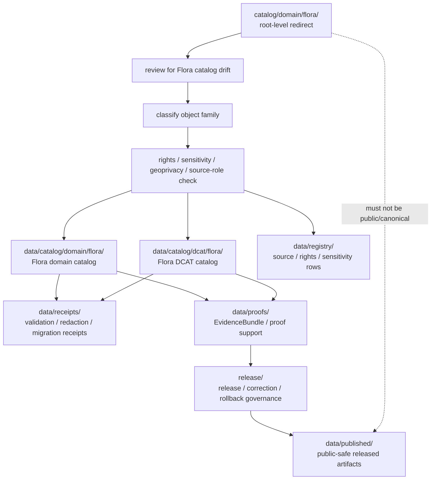

<!-- [KFM_META_BLOCK_V2]
doc_id: kfm://doc/catalog-domain-flora-readme
title: catalog/domain/flora/ — Flora Domain Catalog Compatibility Redirect
type: readme
version: v0.2
status: draft
owners: OWNER_TBD — Flora steward · Ecology sensitivity steward · Catalog steward · Data steward · Registry steward · Evidence steward · Receipt steward · Proof steward · Release steward · Policy steward · Schema steward · Docs steward
created: 2026-06-16
updated: 2026-07-10
policy_label: public
related:
  - ../README.md
  - ../../README.md
  - ../../../data/README.md
  - ../../../data/catalog/README.md
  - ../../../data/catalog/domain/README.md
  - ../../../data/catalog/domain/flora/README.md
  - ../../../data/catalog/dcat/flora/README.md
  - ../../../data/registry/README.md
  - ../../../data/receipts/README.md
  - ../../../data/proofs/README.md
  - ../../../data/published/README.md
  - ../../../release/README.md
  - ../../../docs/domains/flora/DATA_LIFECYCLE.md
  - ../../../docs/domains/flora/SENSITIVITY.md
  - ../../../schemas/contracts/v1/
  - ../../../contracts/
  - ../../../policy/
  - ../../../docs/adr/ADR-0011-receipts-vs-proofs-vs-manifests-vs-catalog-separation.md
  - ../../../docs/doctrine/directory-rules.md
tags: [kfm, catalog, domain, flora, botany, plants, rare-plants, geoprivacy, sensitivity, compatibility-root, redirect, data-catalog-domain, dcat, receipt-proof-catalog-publication-separation, non-authoritative, drift-fence, no-public-use]
notes:
  - "Refreshes the root-level catalog/domain/flora compatibility-redirect fence."
  - "Root-level catalog/domain/flora/ is compatibility and drift-control documentation only, not canonical flora domain catalog authority, occurrence authority, specimen authority, source authority, registry authority, receipt authority, proof authority, release authority, publication authority, schema authority, policy authority, producer authority, hosting authority, or UI authority."
  - "Canonical flora domain catalog records belong under data/catalog/domain/flora/; Flora DCAT records belong under data/catalog/dcat/flora/; source/rights/sensitivity rows belong under data/registry/; receipts belong under data/receipts/; proof support belongs under data/proofs/; release-governance records belong under release/; published delivery artifacts belong under data/published/ after governed release."
  - "Flora lifecycle and sensitivity docs mark rare-plant, culturally sensitive, join-sensitive, and rights-restricted details as fail-closed until policy-approved representation, redaction/generalization, steward review, and release support are present."
  - "ADR-0011 is proposed and is used here only as separation evidence, not accepted-rule proof."
  - "Do not add flora catalog records, occurrence/specimen records, rare-plant locations, STAC/DCAT/PROV records, source descriptors, registry rows, EvidenceBundles, receipts, release records, published artifacts, schemas, policy rules, generated outputs, or producer targets here without an ADR/migration note."
  - "Actual current contents beyond this README, historical producers, workflow writes, migration status, CI/review enforcement, public-client/producer exclusion, hosting readiness, flora catalog schema maturity, STAC/DCAT/PROV closure, sensitivity/redaction decisions, access-control maturity, and ADR disposition remain NEEDS VERIFICATION."
  - "v0.2 adds current evidence basis, Directory Rules placement basis, canonical data/catalog/domain/flora alignment, DCAT sibling posture, Flora sensitivity and geoprivacy guardrails, family-separation posture, minimum safe redirect slice, anti-bypass matrix, migration/rollback posture, and safe language rules without claiming migration or enforcement maturity."
[/KFM_META_BLOCK_V2] -->

<a id="top"></a>

<div align="center">

# Flora Domain Catalog Compatibility Redirect

`catalog/domain/flora/`

**Root-level compatibility and drift-control fence for legacy or accidental Flora-domain catalog placement. Canonical Flora catalog records belong under `data/catalog/domain/flora/`; related DCAT, registry, receipt, proof, release, and published artifact families stay in their own owning roots.**


[Evidence](#0-evidence-basis-for-this-revision) · [Purpose](#1-purpose) · [Canonical homes](#2-canonical-homes) · [Boundary](#3-authority-boundary) · [Sensitivity guardrails](#8-flora-sensitivity-and-geoprivacy-guardrails) · [Migration](#11-migration-posture) · [Definition of done](#18-definition-of-done)

</div>

---

> [!IMPORTANT]
> **Status:** draft / `NEEDS VERIFICATION`  
> **Path:** `catalog/domain/flora/README.md`  
> **Responsibility root:** compatibility redirect / drift fence only  
> **Canonical Flora catalog home:** `data/catalog/domain/flora/`  
> **Flora DCAT catalog home:** `data/catalog/dcat/flora/`  
> **Parent domain catalog home:** `data/catalog/domain/`  
> **Registry home:** `data/registry/`  
> **Receipt home:** `data/receipts/`  
> **Proof home:** `data/proofs/`  
> **Release-governance home:** `release/`  
> **Published artifact home:** `data/published/`  
> **Directory Rules basis:** file location encodes ownership, governance, and lifecycle. Root-level `catalog/domain/flora/` is a compatibility redirect only and must not become a parallel Flora catalog, occurrence, specimen, rare-plant, source, registry, STAC, DCAT, PROV, receipt, proof, release, publication, schema, policy, pipeline, package, tool, search, hosting, or UI authority.  
> **Truth posture:** CONFIRMED current GitHub README path / CONFIRMED `data/catalog/domain/flora/README.md` exists and treats `data/catalog/domain/flora/` as the Flora CATALOG-stage sublane / CONFIRMED `data/catalog/dcat/flora/README.md` exists and points to Flora DCAT catalog posture / CONFIRMED Flora lifecycle docs identify `data/catalog/domain/flora/` as a proposed catalog path and mark rare-plant sensitivity as deny-default / CONFIRMED Flora sensitivity docs state exact rare, protected, or culturally sensitive plant locations are denied on public surfaces by default / CONFIRMED `data/registry/README.md`, `data/receipts/README.md`, `data/proofs/README.md`, and `release/README.md` exist and preserve family separation / CONFIRMED Directory Rules document exists / PROPOSED root-level `catalog/domain/flora/` redirect contract / UNKNOWN actual files beyond README, historical producers, workflow writes, migration status, Flora catalog schema maturity, STAC/DCAT/PROV closure, CI/review guard, public-client/producer exclusion, access-control maturity, hosting readiness, and ADR disposition

> [!CAUTION]
> Do not make `catalog/domain/flora/` a parallel Flora catalog authority. Flora catalog records belong under `data/catalog/domain/flora/`; source/rights/sensitivity rows belong under `data/registry/`; receipts, proofs, release decisions, published artifacts, schemas, contracts, policies, source code, generated previews, and unpublished lifecycle data stay in their own owning roots.

---

## Quick jump

- [0. Evidence basis for this revision](#0-evidence-basis-for-this-revision)
- [1. Purpose](#1-purpose)
- [2. Canonical homes](#2-canonical-homes)
- [3. Authority boundary](#3-authority-boundary)
- [4. Default posture](#4-default-posture)
- [5. Allowed contents](#5-allowed-contents)
- [6. Forbidden contents](#6-forbidden-contents)
- [7. Directory shape](#7-directory-shape)
- [8. Flora sensitivity and geoprivacy guardrails](#8-flora-sensitivity-and-geoprivacy-guardrails)
- [9. Minimum safe redirect slice](#9-minimum-safe-redirect-slice)
- [10. Related Flora catalog lane posture](#10-related-flora-catalog-lane-posture)
- [11. Migration posture](#11-migration-posture)
- [12. Runtime and producer anti-bypass matrix](#12-runtime-and-producer-anti-bypass-matrix)
- [13. Diagram](#13-diagram)
- [14. Inspection path](#14-inspection-path)
- [15. Validation expectations](#15-validation-expectations)
- [16. Safe change pattern](#16-safe-change-pattern)
- [17. Rollback and correction posture](#17-rollback-and-correction-posture)
- [18. Definition of done](#18-definition-of-done)
- [19. Open verification items](#19-open-verification-items)
- [20. Safe language rules](#20-safe-language-rules)

---

## 0. Evidence basis for this revision

This README is a documentation boundary, not migration proof, catalog-schema proof, access-control proof, sensitivity-review proof, redaction proof, STAC/DCAT/PROV closure proof, release approval proof, publication-hosting proof, or CI enforcement proof. The 2026-07-10 revision updates an existing compatibility README and keeps maturity bounded while aligning root-level `catalog/domain/flora/` with the canonical `data/catalog/domain/flora/` Flora catalog lane, the Flora DCAT sibling lane, the separate `data/registry/` registry root, the separate `data/receipts/` process-memory root, the separate `data/proofs/` proof-support root, the `release/` release-governance root, and Directory Rules placement posture.

| Evidence item | Status | What it supports | What it does not prove |
|---|---|---|---|
| `catalog/domain/flora/README.md` exists on `main`. | CONFIRMED | This is an existing README update, not a new path proposal. | It does not prove actual contents beyond the README, historical producers, migration status, CI enforcement, public-client exclusion, hosting readiness, sensitivity decisions, or ADR disposition. |
| `catalog/domain/README.md` exists and treats root-level `catalog/domain/` as a compatibility redirect, not canonical domain catalog authority. | CONFIRMED parent redirect posture | The Flora child path should inherit compatibility-fence behavior. | It does not prove all root-level domain catalog drift has been removed. |
| `data/catalog/domain/flora/README.md` exists and treats `data/catalog/domain/flora/` as the Flora-domain catalog lane. | CONFIRMED canonical Flora catalog lane posture | Flora catalog records belong under `data/catalog/domain/flora/`. | It does not prove concrete catalog records, schemas, validators, policy gates, receipts, release manifests, access controls, or route behavior. |
| `data/catalog/dcat/flora/README.md` exists and treats `data/catalog/dcat/flora/` as a Flora-specific DCAT catalog sublane. | CONFIRMED Flora DCAT sibling posture | Flora DCAT records belong under the DCAT catalog family, not this redirect path. | It does not prove concrete DCAT records, schema validity, validators, receipts, ReleaseManifest linkage, or public route behavior. |
| `docs/domains/flora/DATA_LIFECYCLE.md` exists and identifies rare-plant sensitivity as deny-default while binding Flora to RAW → WORK/QUARANTINE → PROCESSED → CATALOG/TRIPLET → PUBLISHED. | CONFIRMED lifecycle and sensitivity posture | Flora catalog drift must not bypass lifecycle, sensitivity, watcher, receipt, proof, and release gates. | It does not prove implementation maturity, exact producer behavior, validators, or CI integration. |
| `docs/domains/flora/SENSITIVITY.md` exists and states exact rare, protected, or culturally sensitive plant locations are denied on public surfaces by default. | CONFIRMED sensitivity posture | Exact sensitive Flora location exposure must fail closed unless reviewed, transformed, receipted, and released. | It does not prove final policy implementation, access controls, or a single reconciled sensitivity authority. |
| `data/registry/README.md` exists and treats registry rows as source/rights/sensitivity-aware governance records. | CONFIRMED registry-root posture | Source descriptors, rights rows, sensitivity rows, dataset rows, and related registry records belong under `data/registry/`. | It does not prove final taxonomy, row inventories, validators, or release integration. |
| `data/receipts/README.md` exists and marks receipts as process memory. | CONFIRMED receipt-root posture | Catalog-build, validation, migration, AI, redaction, correction, and release-support receipts belong under `data/receipts/`. | It does not prove emitted receipt inventories, signing, validators, release integration, or CI enforcement. |
| `data/proofs/README.md` exists and treats proof artifacts as support objects, not public truth by placement. | CONFIRMED proof-root posture | EvidenceBundle and ProofPack support belongs under `data/proofs/`, not this redirect path. | It does not prove emitted proof inventories, schemas, validators, fixtures, CI workflows, or release-gate enforcement. |
| `release/README.md` exists and treats `release/` as release-governance root. | CONFIRMED release-root posture | Release decisions, correction, rollback, withdrawal, supersession, and signatures belong under `release/`. | It does not prove release workflow maturity or active release approval. |
| `docs/adr/ADR-0011-receipts-vs-proofs-vs-manifests-vs-catalog-separation.md` exists and states the proposed separation rule `receipt ≠ proof ≠ catalog ≠ publication`. | CONFIRMED ADR document presence; PROPOSED decision status | Supports family-separation language while keeping ADR acceptance bounded. | It does not prove ADR acceptance or validator enforcement. |
| `docs/doctrine/directory-rules.md` exists and states that file location encodes ownership, governance, and lifecycle. | CONFIRMED placement doctrine | Root-level `catalog/domain/flora/` must remain a compatibility fence; catalog, registry, receipt, proof, release, and published records belong under their owning roots. | It does not prove live repo drift has been fully audited. |

[Back to top](#top)

---

## 1. Purpose

`catalog/domain/flora/` is a **root-level compatibility redirect** for Flora-domain catalog path drift.

It exists only to prevent accidental, legacy, generated, copied, or externally imported Flora catalog-family material from becoming a parallel authority outside KFM's governed lifecycle, registry, proof, receipt, release, and publication roots.

This folder should not be used for canonical:

- Flora domain catalog records, plant indexes, taxon/specimen/occurrence catalogs, vegetation-community catalogs, invasive-plant catalogs, phenology catalogs, restoration-context catalogs, or catalog manifests;
- rare-plant exact locations, protected plant locations, culturally sensitive plant locations, join-sensitive plant-habitat-location records, collection-site details, steward-flagged site detail, or other exposure-sensitive material;
- STAC, DCAT, PROV, CatalogMatrix, layer catalog, source catalog, catalog index, catalog manifest, or discovery records;
- raw observations, corrected observations, herbarium/source payloads, vegetation-index outputs, phenology outputs, QA outputs, generated public previews, or published map/download/API payloads;
- process receipts, catalog-build receipts, validation receipts, migration receipts, rollback receipts, redaction receipts, release dry-run receipts, AI receipts, or telemetry receipts;
- EvidenceBundles, ProofPacks, citation-validation bundles, catalog-closure proof, release-readiness proof, rollback proof, correction proof, or claim-support records;
- release manifests, promotion decisions, rollback cards, correction notices, withdrawal notices, supersession records, signatures, release-state records, public-safe artifacts, reports, stories, tiles, PMTiles, API payload snapshots, public indexes, allowlists, caveat summaries, or digest sidecars;
- source descriptors, dataset rows, crosswalks, rights rows, sensitivity rows, schemas, contracts, policy rules, producer code, generated previews, build outputs, or unpublished lifecycle data.

This README does not prove that Flora catalog drift currently exists here, that migration has been completed, that producer tools avoid this path, that public clients exclude this path, that Flora catalog schemas are implemented, that sensitivity policy is enforced, or that CI blocks writes here.

[Back to top](#top)

---

## 2. Canonical homes

Flora domain catalog records belong under:

```text
data/catalog/domain/flora/
```

Flora DCAT records belong under:

```text
data/catalog/dcat/flora/
```

Source, dataset, rights, sensitivity, and registry rows belong under:

```text
data/registry/
```

Process-memory receipts belong under:

```text
data/receipts/
```

Proof support belongs under:

```text
data/proofs/
```

Release-governance material belongs under:

```text
release/
```

Released public-safe delivery artifacts belong under:

```text
data/published/
```

The root-level `catalog/domain/flora/` directory is a redirect/fence only.

```text
catalog/domain/flora/              # compatibility redirect only; do not add catalog-family records here
data/catalog/domain/flora/         # Flora CATALOG-stage domain records
data/catalog/dcat/flora/           # Flora DCAT catalog records
data/registry/                     # source / dataset / rights / sensitivity rows
data/receipts/                     # process-memory records
data/proofs/                       # proof-support records
release/                           # release / correction / rollback governance
data/published/                    # released public-safe delivery artifacts
```

If a future ADR or migration changes Flora catalog placement, this README should be updated to cite the accepted target, producer-configuration evidence, validation evidence, sensitivity/release review evidence, and any migration, correction, or rollback records.

## 3. Authority boundary

`catalog/domain/flora/` has **no canonical Flora catalog authority**, **no occurrence authority**, **no specimen authority**, **no rare-plant authority**, **no source authority**, **no registry authority**, **no receipt authority**, **no proof authority**, **no release authority**, and **no publication authority**. It may hold only redirect guidance, migration notes, drift logs, or temporary markers while misplaced material is reviewed and moved into its proper owning root.

```text
WRONG / LEGACY ROOT             FLORA CATALOG HOMES                 SUPPORT AND RELEASE HOMES
catalog/domain/flora/      -->  data/catalog/domain/flora/    -->  data/registry/
compatibility fence only        data/catalog/dcat/flora/            data/receipts/
not authoritative               catalog records / indexes           data/proofs/
                                rare-plant-safe representation      release/
                                                                       data/published/
```

A Flora catalog record outside `data/catalog/domain/flora/` should be treated as Flora catalog-family drift. A DCAT record outside `data/catalog/dcat/flora/`, a source or rights row outside `data/registry/`, a receipt outside `data/receipts/`, a proof outside `data/proofs/`, a release record outside `release/`, or a public artifact outside `data/published/` should be treated as family drift until reviewed and migrated.

## 4. Default posture

Anything found under root-level `catalog/domain/flora/` should be treated as **NEEDS VERIFICATION** and potentially misplaced.

Do not expose, publish, index, cite, search, cache, export, tile, host, or depend on root-level Flora catalog files as canonical Flora, occurrence, specimen, rare-plant, source, proof, release, registry, or published artifact records. First confirm object family, source, source role, provenance, rights, sensitivity, geoprivacy posture, evidence resolution, schema validity, policy decision, lifecycle state, receipt support, proof support, catalog closure, release state, digest/sidecar integrity, rollback path, correction path, and whether the object is actually a catalog record, rare-plant record, public derivative, registry row, receipt, proof, release-governance record, published artifact, or unpublished candidate.

## 5. Allowed contents

| Allowed item | Example | Required posture |
|---|---|---|
| README / redirect docs | `README.md` | Compatibility fence only |
| Migration note | `MIGRATION.md` | Temporary and ADR/review-linked |
| Drift note | `DRIFT.md`, `OPEN-QUESTIONS.md` | Must point to canonical homes and review steps |
| Placeholder marker | `.gitkeep` | Does not authorize catalog, occurrence, specimen, rare-plant, source, proof, receipt, release, policy, schema, or public-output content |

## 6. Forbidden contents

| Forbidden here | Correct home |
|---|---|
| Flora domain catalog records, indexes, plant/taxon catalogs, specimen catalogs, occurrence catalogs, vegetation-community catalogs, invasive-plant catalogs, phenology catalogs, restoration-context catalogs | `data/catalog/domain/flora/` |
| Flora DCAT records, dataset/distribution catalog records, DCAT validation outputs | `data/catalog/dcat/flora/` or accepted DCAT lanes |
| Rare-plant exact locations, protected plant locations, culturally sensitive plant locations, join-sensitive site context, collection-site detail, or steward-flagged site records | Governed lifecycle, proof, policy, or protected-review homes with policy/redaction gates; never this compatibility path |
| Raw observation, specimen, herbarium, vegetation, phenology, invasive-plant, or restoration-context source payloads | Correct lifecycle lane under `data/`, not this root-level compatibility path |
| STAC, PROV, CatalogMatrix, catalog manifests, discovery records | `data/catalog/` or accepted child lanes under it |
| Source descriptors, source registry rows, dataset rows, rights rows, sensitivity rows, taxon/source crosswalk rows | `data/registry/` or governed registry homes |
| Receipts, catalog-build receipts, validation receipts, redaction/generalization receipts, geoprivacy receipts, AI receipts, release dry-run receipts, rollback receipts, migration receipts | `data/receipts/` |
| EvidenceBundles, ProofPacks, attestations, citation-validation bundles, release-readiness proof, rollback proof, correction proof, claim-support records | `data/proofs/` |
| ReleaseManifest, PromotionDecision, release decision, RollbackCard, CorrectionNotice, withdrawal, supersession, signature, release-state record | `release/` |
| Released artifacts, public-safe Flora layers, reports, stories, downloads, API payload snapshots, public indexes, allowlists, caveat summaries, digest sidecars, tiles, PMTiles | `data/published/` after governed release |
| Schemas and machine-shape contracts | `schemas/contracts/v1/` |
| Human contracts and object-meaning docs | `contracts/` |
| Policy rules and policy decisions | `policy/` and governed policy-decision homes |
| Source code, scripts, packages, pipelines, build tools, producers, preview generators | `apps/`, `packages/`, `tools/`, `scripts/`, `pipelines/` |
| RAW, WORK, QUARANTINE, PROCESSED, CATALOG, TRIPLET, unpublished candidate, or restricted lifecycle data | `data/` lifecycle subtrees |

## 7. Directory shape

Current implementation inventory remains `NEEDS VERIFICATION`.

```text
catalog/domain/flora/
├── README.md                 # compatibility redirect / drift fence
├── MIGRATION.md              # PROPOSED only if migration is active
└── DRIFT.md                  # PROPOSED only if misplaced Flora catalog material is found
```

> [!WARNING]
> Do not treat this suggested shape as complete repo inventory. Verify actual contents before making inventory, producer, enforcement, catalog-schema, sensitivity-review, access-control, hosting, or migration claims.

## 8. Flora sensitivity and geoprivacy guardrails

Flora catalog drift is especially risky because exact rare-plant, protected-plant, culturally sensitive, specimen, collection-site, habitat-join, and public derivative records can look similar in an index. Any material found here must preserve sensitivity class and public-safe derivative lineage before it is migrated or used.

| Guardrail | Required posture |
|---|---|
| Rare/protected/culturally sensitive plants fail closed | Do not expose exact sensitive plant locations on public surfaces by default. |
| Source quality does not override sensitivity | A well-sourced record can still be denied, generalized, redacted, delayed, or quarantined. |
| Public derivatives require transform evidence | Public-safe derivatives should be generalized, redacted, aggregated, or withheld with receipt chains preserved. |
| Join-induced sensitivity must be preserved | Joining plant records with habitat, land, infrastructure, stewardship, or repeated observations can create a more sensitive object than either input alone. |
| Rights and sovereignty review can block publication | When rights, sovereignty, stewardship, or access terms are unclear, route to review, quarantine, redaction, or denial rather than publication. |
| Watchers are not publishers | Watcher/source-head outputs may propose candidates; they must not publish or write durable catalog/release/public artifacts here. |
| Public exposure is release-gated | A catalog record is not public merely because it exists under a catalog lane. |

## 9. Minimum safe redirect slice

A smallest safe `catalog/domain/flora/` state should prove only that the folder prevents drift; it should not contain trust-bearing catalog, source, occurrence, release, sensitive, or public-delivery material.

| Slice item | Minimum requirement | Why it matters |
|---|---|---|
| Redirect README | Points to `data/catalog/domain/flora/` for Flora catalog records | Prevents parallel Flora catalog authority |
| DCAT map | Points to `data/catalog/dcat/flora/` for Flora DCAT records | Prevents catalog-family collapse |
| No catalog records | No plant catalog, occurrence catalog, specimen catalog, vegetation catalog, phenology catalog, invasive-plant catalog, restoration catalog, or catalog manifest | Preserves catalog lifecycle root |
| No source/registry records | No SourceDescriptor, rights row, sensitivity row, dataset row, source registry row, or taxon crosswalk row | Preserves registry root |
| No source payloads | No raw observation, specimen payload, herbarium archive, vegetation-index output, processed dataset, raster, or generated preview | Preserves lifecycle and pipeline boundaries |
| No receipt records | No CatalogBuildReceipt, RunReceipt, ValidationReceipt, RedactionReceipt, AIReceipt, migration receipt, release dry-run receipt, rollback receipt, or geoprivacy receipt | Preserves receipt/process-memory root |
| No proof records | No EvidenceBundle, ProofPack, release attestation, citation validation, rollback proof, correction proof, or claim-support files | Preserves proof-support root |
| No release/public artifacts | No ReleaseManifest, release decision, RollbackCard, published Flora layer, public index, PMTiles, report, story, API snapshot, or digest | Preserves release and published roots |
| No sensitive exposure | No exact rare/protected/culturally sensitive plant location, collection-site detail, stewardship-sensitive record, or join-sensitive site context | Prevents location exposure and policy bypass |
| Drift procedure | Explains how to inspect and migrate misplaced records | Keeps remediation reversible |
| Producer guard | Producers, generators, scripts, and CI should not write durable Flora catalog material here | Prevents reintroducing drift |
| Public-use guard | Public clients, search services, map runtimes, exports, static hosting, and indexes must not read from this path as canonical | Preserves governed access path |
| Verification backlog | Open items stay visible | Prevents documentation from pretending migration/enforcement is complete |

## 10. Related Flora catalog lane posture

| Lane | Status | Boundary |
|---|---|---|
| `catalog/domain/flora/` | Compatibility redirect path | Root-level drift fence only; not canonical. |
| `data/catalog/domain/flora/` | CONFIRMED README path / draft catalog lane | Canonical Flora catalog placement for domain catalog records; still implementation-bounded. |
| `data/catalog/dcat/flora/` | CONFIRMED README path / draft DCAT lane | Flora DCAT catalog sublane; does not prove concrete DCAT inventory or release state. |
| `data/catalog/stac/flora/` | PROPOSED in canonical Flora catalog README | Spatiotemporal catalog lane when accepted and verified. |
| `data/catalog/prov/flora/` | PROPOSED in canonical Flora catalog README | Provenance catalog lane when accepted and verified. |

Do not claim payload inventory, source descriptors, rights clearance, sensitivity decisions, access-control enforcement, schema validity, release state, route behavior, map behavior, or hosting readiness from README presence alone.

## 11. Migration posture

If Flora catalog-family files are found here:

1. Do not publish, cite, index, search, cache, export, tile, host, or depend on them.
2. Identify whether they are Flora catalog records, DCAT/STAC/PROV records, CatalogMatrix records, rare-plant records, specimen catalogs, occurrence catalogs, vegetation-community catalogs, invasive-plant catalogs, phenology catalogs, source descriptors, registry rows, receipts, proof support, release records, published-output material, schemas, policy records, unpublished lifecycle material, generated previews, temporary build artifacts, or producer outputs.
3. Determine whether the file is historical drift, generated drift, copied output, unreviewed local work, or an intentional migration marker.
4. Check sensitivity, rights, source-role, stewardship, sovereignty, join-induced sensitivity, and geoprivacy posture before moving or exposing anything.
5. Move Flora domain catalog records into `data/catalog/domain/flora/` or an accepted child lane under it.
6. Move Flora DCAT records into `data/catalog/dcat/flora/` or an accepted DCAT lane.
7. Move source, dataset, rights, sensitivity, taxon crosswalk, and layer rows into `data/registry/` or accepted registry child lanes.
8. Move receipts into `data/receipts/`.
9. Move proof support into `data/proofs/`.
10. Move release-governance records into `release/`.
11. Move or regenerate released public-safe Flora artifacts into `data/published/` only after governed release approval and required sidecar/digest/citation/caveat support.
12. Move schemas, contracts, policy rules, code, and producer outputs into their owning roots.
13. Preserve provenance, source refs, source role, taxon identity, occurrence identity, sensitivity class, derivative lineage, digests, redaction/generalization receipts, catalog-build receipts, proof refs, catalog refs, review notes, producer identity, release refs, correction refs, and rollback path.
14. Add a drift register, migration note, or correction note if the misplaced material was previously consumed.
15. Add or update validation checks so producers do not recreate root-level Flora catalog drift.
16. Leave `catalog/domain/flora/` as a redirect/fence unless an accepted ADR explicitly changes the authority model.

## 12. Runtime and producer anti-bypass matrix

| Bypass risk | Required behavior | Review signal |
|---|---|---|
| Producer writes Flora catalog records to `catalog/domain/flora/` | Fail review/CI; write to `data/catalog/domain/flora/` instead | Producer config and output paths checked |
| Producer writes Flora DCAT records here | Fail review/CI; write to `data/catalog/dcat/flora/` instead | DCAT path check passes |
| Producer writes source descriptors or rights rows here | Fail review/CI; write to `data/registry/` instead | Registry path check passes |
| Producer writes receipts here | Fail review/CI; write to `data/receipts/` instead | Receipt path check passes |
| Producer writes proofs here | Fail review/CI; write to `data/proofs/` instead | Proof path check passes |
| Producer writes release records here | Fail review/CI; write to `release/` instead | Release path check passes |
| Producer writes public Flora exports here | Fail review/CI; write to `data/published/` only after release | Published path and release-state checks pass |
| Public client reads root-level Flora catalog path | Deny; route through governed API/release/public-safe path | Client/search/index/hosting config excludes this path |
| Root-level Flora file is treated as canonical occurrence truth | Mark as drift; resolve evidence/proof/catalog/release support before use | Migration note references canonical target |
| Rare/protected/culturally sensitive plant location appears here | Deny, quarantine, remove, redact, generalize, or route to steward review | Sensitivity/publication review passes |
| Join-sensitive context appears here | Hold until joined-risk posture is reviewed and documented | Join-sensitivity validation passes |
| Claim-bearing catalog entry lacks EvidenceBundle support | Hold, restrict, or abstain; do not cite root-level material as evidence | EvidenceRef/proof validation passes |
| AI-generated Flora catalog summary appears here | Treat as candidate or generated carrier only; route to work/quarantine/review lanes | AI boundary and evidence-review checks pass |
| Schema/profile file stored here | Move to `schemas/` or standards docs as appropriate | Schema-home review passes |
| Policy rule stored here | Move to `policy/` | Policy-root review passes |
| Search/cache/export/tile/static-hosting pipeline consumes this path | Deny as canonical; switch to governed catalog/release/published source | Producer and client config reviewed |
| Drift file already consumed downstream | Add correction/migration note and rollback path | Correction path is auditable |
| README claims CI enforcement without run/check evidence | Mark enforcement `NEEDS VERIFICATION` | Current CI evidence cited before pass claims |

## 13. Diagram



## 14. Inspection path

When reviewing this folder:

1. Verify actual contents of `catalog/domain/flora/`.
2. Confirm any non-README file has an explicit migration, drift, or ADR note.
3. Check whether producer configs or workflow outputs reference this path.
4. Check whether public clients, search indexes, map runtimes, export jobs, or hosting jobs reference this path.
5. Verify canonical target references under `data/catalog/domain/flora/`, `data/catalog/dcat/flora/`, `data/registry/`, `data/receipts/`, `data/proofs/`, `release/`, and `data/published/` before making migration claims.
6. Confirm rare-plant, culturally sensitive, join-sensitive, rights-restricted, and exact-location material is not stored here.
7. If drift was consumed downstream, create correction and rollback notes before deleting evidence of the mistake.

## 15. Validation expectations

Useful validation for this folder should cover:

- no Flora catalog records, indexes, manifests, occurrence catalogs, specimen catalogs, rare-plant records, DCAT/STAC/PROV records, or habitat references are stored here;
- no rare/protected/culturally sensitive plant locations, exact public geometry, join-sensitive details, collection-site details, or rights-restricted payloads are stored here;
- no receipts, proofs, release records, registry records, policy rules, schemas, source code, lifecycle data, or published artifacts are stored here;
- any non-README content is tied to an active migration, ADR, or drift note;
- CI or review checks flag root-level `catalog/domain/flora/` writes;
- links point users to `data/catalog/domain/flora/`, `data/catalog/dcat/flora/`, and other canonical homes.

## 16. Safe change pattern

For changes under `catalog/domain/flora/`:

1. Confirm the change is redirect documentation, migration support, or drift documentation only.
2. Confirm it does not create a parallel Flora domain catalog authority.
3. Confirm no rare-plant, culturally sensitive, join-sensitive, rights-restricted, exact-location, or exposure-sensitive detail is added.
4. Confirm durable Flora catalog records are placed under the governed `data/catalog/` tree.
5. Confirm receipts/proofs/release records are placed under their owning roots.
6. Confirm producers and public clients do not target this compatibility path.
7. Document migration and rollback if any misplaced material was moved.
8. Update docs and validation rules when behavior materially changes.

## 17. Rollback and correction posture

Rollback is required if this folder becomes any of the following:

- a Flora catalog-record root;
- a Flora DCAT/STAC/PROV root;
- a rare-plant, occurrence, specimen, vegetation, phenology, or invasive-plant data root;
- a source registry, rights, sensitivity, receipt, proof, release, or published artifact root;
- a schema, contract, policy, validator, implementation, search, hosting, or public-client root;
- a route around Flora sensitivity, rights, review, release, correction, or rollback gates.

A correction should preserve the old path, misplaced file identity, source refs, digest, consumer list, migration target, reviewer, release impact, and rollback target.

## 18. Definition of done

- [ ] Owners are confirmed and `OWNER_TBD` is replaced.
- [ ] Actual root-level `catalog/domain/flora/` contents are verified.
- [ ] Any misplaced Flora catalog material is migrated or documented as drift.
- [ ] Canonical Flora catalog placement under `data/catalog/domain/flora/` is accepted and documented.
- [ ] Flora DCAT placement under `data/catalog/dcat/flora/` is accepted and documented.
- [ ] No trust-bearing records live here.
- [ ] No Flora catalog records, rare/protected/culturally sensitive plant locations, join-sensitive details, STAC/DCAT/PROV records, registry records, receipts, proofs, release records, published artifacts, schemas, contracts, policy rules, source code, or lifecycle data live here.
- [ ] Producer configs and public-client configs are checked for this path.
- [ ] CI/review behavior is verified or marked `NEEDS VERIFICATION`.

## 19. Open verification items

| Item | Why it matters |
|---|---|
| Confirm actual files under root-level `catalog/domain/flora/` | Prevents overclaiming or missing drift |
| Confirm whether any workflow writes here | Required before producer claims |
| Confirm accepted canonical Flora catalog placement | Required before final migration claims |
| Confirm Flora STAC/DCAT/PROV closure posture | Required before catalog-projection claims |
| Confirm sensitivity/redaction handling | Required before safe-publication claims |
| Confirm migration status to `data/catalog/domain/flora/` | Required before canonical-home claims beyond README evidence |
| Confirm CI/review guard exists | Required before enforcement claims |
| Confirm no trust records are stored here | Required before Directory Rules compliance claims |
| Confirm ADR status for root-level `catalog/domain/flora/` | Required before long-term retention claims |

## 20. Safe language rules

Use these phrases:

- "compatibility redirect";
- "drift fence";
- "canonical Flora catalog records belong under `data/catalog/domain/flora/`";
- "Flora DCAT records belong under `data/catalog/dcat/flora/`";
- "rare-plant and culturally sensitive location exposure fails closed";
- "README presence does not prove payload inventory, validator maturity, policy enforcement, route behavior, or release approval."

Avoid these phrases unless current evidence proves them:

- "this folder contains the Flora catalog";
- "public clients read Flora catalog files here";
- "CI blocks all writes here";
- "Flora catalog migration is complete";
- "all rare-plant records are safe for public display";
- "DCAT/STAC/PROV closure is implemented";
- "policy gates are enforced";
- "release approval exists."

<details>
<summary>Appendix A — no-loss preservation note</summary>

This v0.2 rewrite preserves the previous redirect intent while expanding the evidence basis, canonical target map, Flora sensitivity/geoprivacy posture, related catalog-lane map, anti-bypass rules, migration guidance, rollback/correction posture, and safe language rules. It does not claim Flora catalog files, migration work, CI enforcement, producer workflows, sensitivity decisions, access controls, release state, or ADR disposition are implemented.

</details>

## Status summary

`catalog/domain/flora/` is a root-level compatibility redirect and Flora-domain drift fence. It is not the canonical Flora domain catalog home.

Flora catalog authority belongs under `data/catalog/domain/flora/`; Flora DCAT catalog records belong under `data/catalog/dcat/flora/`; source/rights/sensitivity records belong under `data/registry/`; trust-bearing support belongs under `data/receipts/`, `data/proofs/`, and `release/`; released public-safe products belong under `data/published/`.

<p align="right"><a href="#top">Back to top</a></p>
