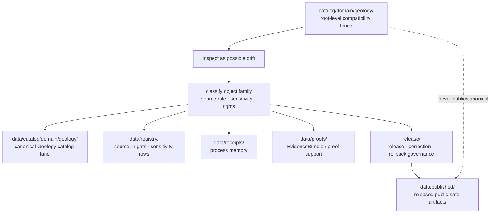

<!-- [KFM_META_BLOCK_V2]
doc_id: kfm://doc/catalog-domain-geology-readme
title: catalog/domain/geology/ — Geology Domain Catalog Compatibility Redirect
type: readme
version: v0.2
status: draft
owners: OWNER_TBD — Geology steward · Natural resources steward · Catalog steward · Data steward · Registry steward · Evidence steward · Receipt steward · Proof steward · Release steward · Policy steward · Schema steward · Docs steward
created: 2026-06-16
updated: 2026-07-10
policy_label: public
related:
  - ../README.md
  - ../../README.md
  - ../../../data/README.md
  - ../../../data/catalog/README.md
  - ../../../data/catalog/domain/README.md
  - ../../../data/catalog/domain/geology/README.md
  - ../../../data/registry/README.md
  - ../../../data/receipts/README.md
  - ../../../data/proofs/README.md
  - ../../../data/published/README.md
  - ../../../release/README.md
  - ../../../docs/domains/geology/README.md
  - ../../../docs/domains/geology/DATA_LIFECYCLE.md
  - ../../../docs/domains/geology/CANONICAL_PATHS.md
  - ../../../docs/domains/geology/POLICY.md
  - ../../../schemas/contracts/v1/
  - ../../../contracts/
  - ../../../policy/
  - ../../../docs/adr/ADR-0011-receipts-vs-proofs-vs-manifests-vs-catalog-separation.md
  - ../../../docs/doctrine/directory-rules.md
tags: [kfm, catalog, domain, geology, natural-resources, stratigraphy, lithology, subsurface, minerals, extraction, reclamation, source-role-aware, compatibility-root, redirect, data-catalog-domain, receipt-proof-catalog-publication-separation, non-authoritative, drift-fence, no-public-use]
notes:
  - "Refreshes the root-level catalog/domain/geology compatibility-redirect fence."
  - "Root-level catalog/domain/geology/ is compatibility and drift-control documentation only, not canonical geology domain catalog authority, occurrence authority, deposit authority, reserve authority, permit authority, production authority, source authority, registry authority, receipt authority, proof authority, release authority, publication authority, schema authority, policy authority, producer authority, hosting authority, or UI authority."
  - "Canonical geology domain catalog records belong under data/catalog/domain/geology/; source/rights/sensitivity rows belong under data/registry/; receipts belong under data/receipts/; proof support belongs under data/proofs/; release-governance records belong under release/; published delivery artifacts belong under data/published/ after governed release."
  - "Geology records must preserve source-role discipline: occurrence, deposit, estimate, permit, production, reserve, model, observation, and interpretation records are not interchangeable."
  - "Sensitive geology or natural-resource context, including exact subsurface, private-well, sample, mine/quarry, lease, title, extraction, reclamation, infrastructure-adjacent, and resource-location details, must not be exposed through this compatibility path."
  - "ADR-0011 is proposed and is used here only as separation evidence, not accepted-rule proof."
  - "Do not add geology catalog records, resource indexes, stratigraphy crosswalks, STAC/DCAT/PROV records, source descriptors, registry rows, EvidenceBundles, receipts, release records, published artifacts, schemas, policy rules, generated outputs, or producer targets here without an ADR/migration note."
  - "Actual current contents beyond this README, historical producers, workflow writes, migration status, CI/review enforcement, public-client/producer exclusion, hosting readiness, geology catalog schema maturity, STAC/DCAT/PROV closure, source-role enforcement, sensitivity/redaction decisions, access-control maturity, and ADR disposition remain NEEDS VERIFICATION."
  - "v0.2 adds current evidence basis, Directory Rules placement basis, canonical data/catalog/domain/geology alignment, geology source-role and sensitivity guardrails, family-separation posture, minimum safe redirect slice, anti-bypass matrix, migration/rollback posture, and safe language rules without claiming migration or enforcement maturity."
[/KFM_META_BLOCK_V2] -->

<a id="top"></a>

<div align="center">

# Geology Domain Catalog Compatibility Redirect

`catalog/domain/geology/`

**Root-level compatibility and drift-control fence for legacy or accidental Geology/Natural Resources-domain catalog placement. Canonical Geology catalog records belong under `data/catalog/domain/geology/`; related registry, receipt, proof, release, and published artifact families stay in their own owning roots.**


[Evidence](#0-evidence-basis-for-this-revision) · [Purpose](#1-purpose) · [Canonical homes](#2-canonical-homes) · [Boundary](#3-authority-boundary) · [Source-role guardrails](#8-geology-source-role-and-sensitivity-guardrails) · [Migration](#11-migration-posture) · [Definition of done](#18-definition-of-done)

</div>

---

> [!IMPORTANT]
> **Status:** draft / `NEEDS VERIFICATION`  
> **Path:** `catalog/domain/geology/README.md`  
> **Responsibility root:** compatibility redirect / drift fence only  
> **Canonical Geology catalog home:** `data/catalog/domain/geology/`  
> **Parent domain catalog home:** `data/catalog/domain/`  
> **Registry home:** `data/registry/`  
> **Receipt home:** `data/receipts/`  
> **Proof home:** `data/proofs/`  
> **Release-governance home:** `release/`  
> **Published artifact home:** `data/published/`  
> **Directory Rules basis:** file location encodes ownership, governance, and lifecycle. Root-level `catalog/domain/geology/` is a compatibility redirect only and must not become a parallel geology catalog, natural-resource catalog, occurrence, deposit, reserve, permit, production, model, interpretation, source, registry, STAC, DCAT, PROV, receipt, proof, release, publication, schema, policy, pipeline, package, tool, search, hosting, or UI authority.  
> **Truth posture:** CONFIRMED current GitHub README path / CONFIRMED `data/catalog/domain/geology/README.md` exists and treats `data/catalog/domain/geology/` as the Geology CATALOG-stage sublane / CONFIRMED `docs/domains/geology/README.md` exists and defines anti-collapse and deny-by-default posture for exact subsurface/private-well/resource-location exposure / CONFIRMED `docs/domains/geology/DATA_LIFECYCLE.md` exists and maps `data/catalog/domain/geology/` under the data lifecycle lane pattern / CONFIRMED `data/registry/README.md`, `data/receipts/README.md`, `data/proofs/README.md`, and `release/README.md` exist and preserve family separation / CONFIRMED Directory Rules document exists / PROPOSED root-level `catalog/domain/geology/` redirect contract / UNKNOWN actual files beyond README, historical producers, workflow writes, migration status, Geology catalog schema maturity, STAC/DCAT/PROV closure, CI/review guard, public-client/producer exclusion, source-role enforcement, access-control maturity, hosting readiness, and ADR disposition

> [!CAUTION]
> Do not make `catalog/domain/geology/` a parallel Geology catalog authority. Geology catalog records belong under `data/catalog/domain/geology/`; source/rights/sensitivity rows belong under `data/registry/`; receipts, proofs, release decisions, published artifacts, schemas, contracts, policies, source code, generated previews, and unpublished lifecycle data stay in their own owning roots.

---

## Quick jump

- [0. Evidence basis for this revision](#0-evidence-basis-for-this-revision)
- [1. Purpose](#1-purpose)
- [2. Canonical homes](#2-canonical-homes)
- [3. Authority boundary](#3-authority-boundary)
- [4. Default posture](#4-default-posture)
- [5. Allowed contents](#5-allowed-contents)
- [6. Forbidden contents](#6-forbidden-contents)
- [7. Directory shape](#7-directory-shape)
- [8. Geology source-role and sensitivity guardrails](#8-geology-source-role-and-sensitivity-guardrails)
- [9. Minimum safe redirect slice](#9-minimum-safe-redirect-slice)
- [10. Related Geology catalog lane posture](#10-related-geology-catalog-lane-posture)
- [11. Migration posture](#11-migration-posture)
- [12. Runtime and producer anti-bypass matrix](#12-runtime-and-producer-anti-bypass-matrix)
- [13. Diagram](#13-diagram)
- [14. Inspection path](#14-inspection-path)
- [15. Validation expectations](#15-validation-expectations)
- [16. Safe change pattern](#16-safe-change-pattern)
- [17. Rollback and correction posture](#17-rollback-and-correction-posture)
- [18. Definition of done](#18-definition-of-done)
- [19. Open verification items](#19-open-verification-items)
- [20. Safe language rules](#20-safe-language-rules)

---

## 0. Evidence basis for this revision

This README is a documentation boundary, not migration proof, catalog-schema proof, access-control proof, sensitivity-review proof, redaction proof, STAC/DCAT/PROV closure proof, release approval proof, publication-hosting proof, or CI enforcement proof. The 2026-07-10 revision updates an existing compatibility README and keeps maturity bounded while aligning root-level `catalog/domain/geology/` with the canonical `data/catalog/domain/geology/` Geology catalog lane, the separate `data/registry/` registry root, the separate `data/receipts/` process-memory root, the separate `data/proofs/` proof-support root, the `release/` release-governance root, and Directory Rules placement posture.

| Evidence item | Status | What it supports | What it does not prove |
|---|---|---|---|
| `catalog/domain/geology/README.md` exists on `main`. | CONFIRMED | This is an existing README update, not a new path proposal. | It does not prove actual contents beyond the README, historical producers, migration status, CI enforcement, public-client exclusion, hosting readiness, source-role enforcement, sensitivity decisions, or ADR disposition. |
| `catalog/domain/README.md` exists and treats root-level `catalog/domain/` as a compatibility redirect, not canonical domain catalog authority. | CONFIRMED parent redirect posture | The Geology child path should inherit compatibility-fence behavior. | It does not prove all root-level domain catalog drift has been removed. |
| `data/catalog/domain/geology/README.md` exists and treats `data/catalog/domain/geology/` as the Geology/Natural Resources domain catalog lane. | CONFIRMED canonical Geology catalog lane posture | Geology catalog records belong under `data/catalog/domain/geology/`. | It does not prove concrete catalog records, schemas, validators, policy gates, receipts, release manifests, access controls, or route behavior. |
| `docs/domains/geology/README.md` exists and defines Geology scope, anti-collapse source-role discipline, public trust path, and sensitivity posture. | CONFIRMED domain-doctrine posture | Geology catalog drift must preserve anti-collapse, source-role, evidence, sensitivity, public trust, and release gates. | It does not prove endpoint behavior, validator wiring, public route behavior, or real access-control enforcement. |
| `docs/domains/geology/DATA_LIFECYCLE.md` exists and maps `data/catalog/domain/geology/` under the Geology data lifecycle lane pattern. | CONFIRMED lifecycle/path posture | Geology catalog placement belongs under the `data/` lifecycle root, not root-level `catalog/`. | It does not prove file inventory, producer behavior, validators, or CI integration. |
| `data/registry/README.md` exists and treats registry rows as source/rights/sensitivity-aware governance records. | CONFIRMED registry-root posture | Source descriptors, rights rows, sensitivity rows, dataset rows, and related registry records belong under `data/registry/`. | It does not prove final taxonomy, row inventories, validators, or release integration. |
| `data/receipts/README.md` exists and marks receipts as process memory. | CONFIRMED receipt-root posture | Catalog-build, validation, migration, AI, redaction/generalization, correction, and release-support receipts belong under `data/receipts/`. | It does not prove emitted receipt inventories, signing, validators, release integration, or CI enforcement. |
| `data/proofs/README.md` exists and treats proof artifacts as support objects, not public truth by placement. | CONFIRMED proof-root posture | EvidenceBundle and ProofPack support belongs under `data/proofs/`, not this redirect path. | It does not prove emitted proof inventories, schemas, validators, fixtures, CI workflows, or release-gate enforcement. |
| `release/README.md` exists and treats `release/` as release-governance root. | CONFIRMED release-root posture | Release decisions, correction, rollback, withdrawal, supersession, and signatures belong under `release/`. | It does not prove release workflow maturity or active release approval. |
| `docs/adr/ADR-0011-receipts-vs-proofs-vs-manifests-vs-catalog-separation.md` exists and states the proposed separation rule `receipt ≠ proof ≠ catalog ≠ publication`. | CONFIRMED ADR document presence; PROPOSED decision status | Supports family-separation language while keeping ADR acceptance bounded. | It does not prove ADR acceptance or validator enforcement. |
| `docs/doctrine/directory-rules.md` exists and states that file location encodes ownership, governance, and lifecycle. | CONFIRMED placement doctrine | Root-level `catalog/domain/geology/` must remain a compatibility fence; catalog, registry, receipt, proof, release, and published records belong under their owning roots. | It does not prove live repo drift has been fully audited. |

[Back to top](#top)

---

## 1. Purpose

`catalog/domain/geology/` is a **root-level compatibility redirect** for Geology/Natural Resources-domain catalog path drift.

It exists only to prevent accidental, legacy, generated, copied, or externally imported Geology catalog-family material from becoming a parallel authority outside KFM's governed lifecycle, registry, proof, receipt, release, and publication roots.

This folder should not be used for canonical:

- Geology domain catalog records, geologic-unit indexes, stratigraphy/lithology indexes, structure catalogs, geomorphology catalogs, subsurface observation catalogs, geochemistry/geophysics catalogs, mineral/resource/deposit/extraction/reclamation catalogs, or catalog manifests;
- occurrence, deposit, estimate, permit, production, reserve, model, observation, interpretation, lease, title, well-log, borehole, core, sample, private-well, mine, quarry, reclamation, or infrastructure-adjacent records;
- STAC, DCAT, PROV, CatalogMatrix, layer catalog, source catalog, catalog index, catalog manifest, or discovery records;
- raw observations, corrected observations, survey outputs, well-log/source payloads, interpreted maps, model outputs, QA outputs, generated public previews, or published map/download/API payloads;
- process receipts, catalog-build receipts, validation receipts, migration receipts, rollback receipts, redaction/generalization receipts, release dry-run receipts, AI receipts, or telemetry receipts;
- EvidenceBundles, ProofPacks, citation-validation bundles, release-readiness proof, catalog-closure proof, rollback proof, correction proof, or claim-support records;
- release manifests, promotion decisions, rollback cards, correction notices, withdrawal notices, supersession records, signatures, release-state records, public-safe artifacts, reports, stories, tiles, PMTiles, API payload snapshots, public indexes, allowlists, caveat summaries, or digest sidecars;
- source descriptors, dataset rows, crosswalks, rights rows, sensitivity rows, schemas, contracts, policy rules, producer code, generated previews, build outputs, or unpublished lifecycle data.

This README does not prove that Geology catalog drift currently exists here, that migration has been completed, that producer tools avoid this path, that public clients exclude this path, that Geology catalog schemas are mature, or that source-role/sensitivity/release policy is enforced.

[Back to top](#top)

---

## 2. Canonical homes

Canonical Geology domain catalog records belong under:

```text
data/catalog/domain/geology/
```

Parent domain catalog indexing belongs under:

```text
data/catalog/domain/
```

Source, dataset, rights, sensitivity, and registry rows belong under:

```text
data/registry/
```

Process-memory receipts belong under:

```text
data/receipts/
```

Proof support belongs under:

```text
data/proofs/
```

Release-governance material belongs under:

```text
release/
```

Released public-safe delivery artifacts belong under:

```text
data/published/
```

The root-level `catalog/domain/geology/` directory is a redirect/fence only.

```text
catalog/domain/geology/          # compatibility redirect only; do not add catalog-family records here
data/catalog/domain/geology/     # Geology CATALOG-stage domain records
data/catalog/domain/             # domain catalog index
data/registry/                   # source / dataset / rights / sensitivity rows
data/receipts/                   # process-memory records
data/proofs/                     # proof-support records
release/                         # release / correction / rollback governance
data/published/                  # released public-safe delivery artifacts
```

If a future ADR or migration changes Geology catalog placement, this README should be updated to cite the accepted target, producer-configuration evidence, validation evidence, source-role/sensitivity/release review evidence, and any migration, correction, or rollback records.

## 3. Authority boundary

`catalog/domain/geology/` has **no canonical Geology catalog authority**, **no occurrence authority**, **no deposit authority**, **no estimate authority**, **no permit authority**, **no production authority**, **no reserve authority**, **no model authority**, **no source authority**, **no registry authority**, **no receipt authority**, **no proof authority**, **no release authority**, and **no publication authority**. It may hold only redirect guidance, migration notes, drift logs, or temporary markers while misplaced material is reviewed and moved into its proper owning root.

```text
WRONG / LEGACY ROOT               GEOLOGY CATALOG HOME              SUPPORT AND RELEASE HOMES
catalog/domain/geology/      -->  data/catalog/domain/geology/ -->  data/registry/
compatibility fence only          catalog records / indexes         data/receipts/
not authoritative                 source-role-preserved records     data/proofs/
                                  public-safe representations       release/
                                                                      data/published/
```

A Geology catalog record outside `data/catalog/domain/geology/` should be treated as Geology catalog-family drift. A source or rights row outside `data/registry/`, a receipt outside `data/receipts/`, a proof outside `data/proofs/`, a release record outside `release/`, or a public artifact outside `data/published/` should be treated as family drift until reviewed and migrated.

## 4. Default posture

Anything found under root-level `catalog/domain/geology/` should be treated as **NEEDS VERIFICATION** and potentially misplaced.

Do not expose, publish, index, cite, search, cache, export, tile, host, or depend on root-level Geology catalog files as canonical Geology, occurrence, deposit, reserve, source, proof, release, registry, or published artifact records. First confirm object family, source, source role, provenance, rights, sensitivity, public-geometry posture, evidence resolution, schema validity, policy decision, lifecycle state, receipt support, proof support, catalog closure, release state, digest/sidecar integrity, rollback path, correction path, and whether the object is actually a catalog record, resource record, registry row, receipt, proof, release-governance record, published artifact, or unpublished candidate.

## 5. Allowed contents

| Allowed item | Example | Required posture |
|---|---|---|
| README / redirect docs | `README.md` | Compatibility fence only |
| Migration note | `MIGRATION.md` | Temporary and ADR/review-linked |
| Drift note | `DRIFT.md`, `OPEN-QUESTIONS.md` | Must point to canonical homes and review steps |
| Placeholder marker | `.gitkeep` | Does not authorize catalog, occurrence, deposit, reserve, source, proof, receipt, release, policy, schema, or public-output content |

## 6. Forbidden contents

| Forbidden here | Correct home |
|---|---|
| Geology domain catalog records, indexes, geologic-unit catalogs, stratigraphy catalogs, lithology catalogs, structure catalogs, geomorphology catalogs, subsurface catalogs, natural-resource catalogs | `data/catalog/domain/geology/` |
| Occurrence, deposit, estimate, permit, production, reserve, model, observation, interpretation, lease, title, extraction, or reclamation records | Correct governed lifecycle, catalog, registry, proof, or release homes; never this compatibility path |
| Exact subsurface, private-well, borehole, sample, core, mine, quarry, sensitive resource, lease/title, or infrastructure-risk locations | Governed lifecycle, proof, policy, or protected-review homes with policy/redaction gates; never this compatibility path |
| Raw survey, well-log, borehole, geochemistry, geophysics, mineral, production, or model source payloads | Correct lifecycle lane under `data/`, not this root-level compatibility path |
| STAC, DCAT, PROV, CatalogMatrix, catalog manifests, discovery records | `data/catalog/` or accepted child lanes under it |
| Source descriptors, source registry rows, dataset rows, rights rows, sensitivity rows, stratigraphy/source crosswalk rows | `data/registry/` or governed registry homes |
| Receipts, catalog-build receipts, validation receipts, redaction/generalization receipts, AI receipts, release dry-run receipts, rollback receipts, migration receipts | `data/receipts/` |
| EvidenceBundles, ProofPacks, attestations, citation-validation bundles, release-readiness proof, rollback proof, correction proof, claim-support records | `data/proofs/` |
| ReleaseManifest, PromotionDecision, release decision, RollbackCard, CorrectionNotice, withdrawal, supersession, signature, release-state record | `release/` |
| Released artifacts, public-safe Geology layers, reports, stories, downloads, API payload snapshots, public indexes, allowlists, caveat summaries, digest sidecars, tiles, PMTiles | `data/published/` after governed release |
| Schemas and machine-shape contracts | `schemas/contracts/v1/` |
| Human contracts and object-meaning docs | `contracts/` |
| Policy rules and policy decisions | `policy/` and governed policy-decision homes |
| Source code, scripts, packages, pipelines, build tools, producers, preview generators | `apps/`, `packages/`, `tools/`, `scripts/`, `pipelines/` |
| RAW, WORK, QUARANTINE, PROCESSED, CATALOG, TRIPLET, unpublished candidate, or restricted lifecycle data | `data/` lifecycle subtrees |

## 7. Directory shape

Current implementation inventory remains `NEEDS VERIFICATION`.

```text
catalog/domain/geology/
├── README.md                 # compatibility redirect / drift fence
├── MIGRATION.md              # PROPOSED only if migration is active
└── DRIFT.md                  # PROPOSED only if misplaced Geology catalog material is found
```

> [!WARNING]
> Do not treat this suggested shape as complete repo inventory. Verify actual contents before making inventory, producer, enforcement, catalog-schema, source-role enforcement, sensitivity-review, access-control, hosting, or migration claims.

## 8. Geology source-role and sensitivity guardrails

Geology catalog drift is especially risky because interpreted maps, direct observations, resource occurrences, legal/permit records, estimates, production histories, models, and public derivatives can look similar in an index. Any material found here must preserve source role, claim class, geometry sensitivity, and public-safe representation before it is migrated or used.

| Guardrail | Required posture |
|---|---|
| Source-role anti-collapse | Keep occurrence, deposit, estimate, permit, production, reserve, model, observation, and interpretation records distinct. |
| Catalog carrier is not claim truth | A catalog entry can support discovery and closure; it does not make a resource claim true or extraction-authoritative by placement. |
| Generalized map polygon is not a deposit proof | Do not let a mapped unit, AI summary, or generalized polygon stand in for a dated, role-typed, cited observation or reserve claim. |
| Exact subsurface/private-well/resource locations fail closed when unclear | Hold, redact, generalize, aggregate, or deny public exposure when sensitivity, rights, or review state is unresolved. |
| Permits, leases, titles, production records, and reserve estimates are separate claim families | Do not merge legal/administrative context with physical geology or resource existence claims. |
| Infrastructure-adjacent and extraction context needs review | Mine, quarry, well, reclamation, and infrastructure-risk context may require staged access, aggregation, or denial. |
| Rights and stewardship review can block publication | When source rights, sovereignty, stewardship, or access terms are unclear, route to review, quarantine, redaction, or denial rather than publication. |
| Public exposure is release-gated | A catalog record is not public merely because it exists under a catalog lane. |

## 9. Minimum safe redirect slice

A smallest safe `catalog/domain/geology/` state should prove only that the folder prevents drift; it should not contain trust-bearing catalog, source, occurrence, deposit, reserve, release, sensitive, or public-delivery material.

| Slice item | Minimum requirement | Why it matters |
|---|---|---|
| Redirect README | Points to `data/catalog/domain/geology/` for Geology catalog records | Prevents parallel Geology catalog authority |
| No catalog records | No geologic-unit catalog, stratigraphy catalog, occurrence catalog, deposit catalog, resource catalog, production catalog, reserve catalog, or catalog manifest | Preserves catalog lifecycle root |
| No source/registry records | No SourceDescriptor, rights row, sensitivity row, dataset row, source registry row, or stratigraphy/source crosswalk row | Preserves registry root |
| No source payloads | No raw survey output, well-log payload, borehole/core/sample data, geophysics/geochemistry output, processed dataset, raster, or generated preview | Preserves lifecycle and pipeline boundaries |
| No receipt records | No CatalogBuildReceipt, RunReceipt, ValidationReceipt, AIReceipt, migration receipt, release dry-run receipt, rollback receipt, or redaction/generalization receipt | Preserves receipt/process-memory root |
| No proof records | No EvidenceBundle, ProofPack, release attestation, citation validation, rollback proof, correction proof, or claim-support files | Preserves proof-support root |
| No release/public artifacts | No ReleaseManifest, release decision, RollbackCard, published Geology layer, public index, PMTiles, report, story, API snapshot, or digest | Preserves release and published roots |
| No sensitive exposure | No exact private well, subsurface sample, core, borehole, mine/quarry, lease/title, sensitive resource location, or infrastructure-risk detail | Prevents exposure and policy bypass |
| Drift procedure | Explains how to inspect and migrate misplaced records | Keeps remediation reversible |
| Producer guard | Producers, generators, scripts, and CI should not write durable Geology catalog material here | Prevents reintroducing drift |
| Public-use guard | Public clients, search services, map runtimes, exports, static hosting, and indexes must not read from this path as canonical | Preserves governed access path |
| Verification backlog | Open items stay visible | Prevents documentation from pretending migration/enforcement is complete |

## 10. Related Geology catalog lane posture

| Lane | Status | Boundary |
|---|---|---|
| `catalog/domain/geology/` | Compatibility redirect path | Root-level drift fence only; not canonical. |
| `data/catalog/domain/geology/` | CONFIRMED README path / draft catalog lane | Canonical Geology catalog placement for domain catalog records; still implementation-bounded. |
| `data/catalog/stac/geology/` | PROPOSED in canonical Geology catalog README | Spatiotemporal catalog lane when accepted and verified. |
| `data/catalog/dcat/geology/` | PROPOSED in canonical Geology catalog README | Dataset/distribution catalog lane when accepted and verified. |
| `data/catalog/prov/geology/` | PROPOSED in canonical Geology catalog README | Provenance catalog lane when accepted and verified. |

Do not claim payload inventory, source descriptors, rights clearance, sensitivity decisions, source-role enforcement, access-control enforcement, schema validity, release state, route behavior, map behavior, or hosting readiness from README presence alone.

## 11. Migration posture

If Geology catalog-family files are found here:

1. Do not publish, cite, index, search, cache, export, tile, host, or depend on them.
2. Identify whether they are Geology catalog records, STAC/DCAT/PROV records, CatalogMatrix records, geologic-unit catalogs, stratigraphy catalogs, occurrence records, deposit records, estimate records, permit records, production records, reserve records, model records, interpretation records, source descriptors, registry rows, receipts, proof support, release records, published-output material, schemas, policy records, unpublished lifecycle material, generated previews, temporary build artifacts, or producer outputs.
3. Determine whether the file is historical drift, generated drift, copied output, unreviewed local work, or an intentional migration marker.
4. Check source role, sensitivity, rights, stewardship, legal/administrative context, extraction/reclamation context, infrastructure-adjacent risk, and public-safe geometry posture before moving or exposing anything.
5. Move Geology domain catalog records into `data/catalog/domain/geology/` or an accepted child lane under it.
6. Move STAC/DCAT/PROV Geology records into accepted catalog-family lanes under `data/catalog/` when those lanes are verified.
7. Move source, dataset, rights, sensitivity, stratigraphy/source crosswalk, and layer rows into `data/registry/` or accepted registry child lanes.
8. Move receipts into `data/receipts/`.
9. Move proof support into `data/proofs/`.
10. Move release-governance records into `release/`.
11. Move or regenerate released public-safe Geology artifacts into `data/published/` only after governed release approval and required sidecar/digest/citation/caveat support.
12. Move schemas, contracts, policy rules, code, and producer outputs into their owning roots.
13. Preserve provenance, source refs, source role, claim class, geologic unit identity, occurrence/deposit/estimate/permit/production/reserve identity, sensitivity class, derivative lineage, digests, redaction/generalization receipts, catalog-build receipts, proof refs, catalog refs, review notes, producer identity, release refs, correction refs, and rollback path.
14. Add a drift register, migration note, or correction note if the misplaced material was previously consumed.
15. Add or update validation checks so producers do not recreate root-level Geology catalog drift.
16. Leave `catalog/domain/geology/` as a redirect/fence unless an accepted ADR explicitly changes the authority model.

## 12. Runtime and producer anti-bypass matrix

| Bypass risk | Required behavior | Review signal |
|---|---|---|
| Producer writes Geology catalog records to `catalog/domain/geology/` | Fail review/CI; write to `data/catalog/domain/geology/` instead | Producer config and output paths checked |
| Producer writes source descriptors or rights rows here | Fail review/CI; write to `data/registry/` instead | Registry path check passes |
| Producer writes receipts here | Fail review/CI; write to `data/receipts/` instead | Receipt path check passes |
| Producer writes proofs here | Fail review/CI; write to `data/proofs/` instead | Proof path check passes |
| Producer writes release records here | Fail review/CI; write to `release/` instead | Release path check passes |
| Producer writes public Geology exports here | Fail review/CI; write to `data/published/` only after release | Published path and release-state checks pass |
| Public client reads root-level Geology catalog path | Deny; route through governed API/release/public-safe path | Client/search/index/hosting config excludes this path |
| Root-level Geology file is treated as canonical observation or resource truth | Mark as drift; resolve evidence/proof/catalog/release support before use | Migration note references canonical target |
| Occurrence/deposit/estimate/permit/production/reserve/model/interpretation roles collapse | Hold until source-role class is restored and validated | Source-role validation passes |
| Generalized map polygon is treated as reserve/deposit proof | Deny or abstain until claim class and EvidenceBundle support are resolved | Evidence and claim-class review passes |
| Sensitive subsurface/private-well/sample/resource/infrastructure location appears here | Deny, quarantine, remove, redact, generalize, or route to steward review | Sensitivity/publication review passes |
| Claim-bearing catalog entry lacks EvidenceBundle support | Hold, restrict, or abstain; do not cite root-level material as evidence | EvidenceRef/proof validation passes |
| AI-generated Geology summary appears here | Treat as candidate or generated carrier only; route to work/quarantine/review lanes | AI boundary and evidence-review checks pass |
| Schema/profile file stored here | Move to `schemas/` or standards docs as appropriate | Schema-home review passes |
| Policy rule stored here | Move to `policy/` | Policy-root review passes |
| Search/cache/export/tile/static-hosting pipeline consumes this path | Deny as canonical; switch to governed catalog/release/published source | Producer and client config reviewed |
| Drift file already consumed downstream | Add correction/migration note and rollback path | Correction path is auditable |

## 13. Diagram



## 14. Inspection path

Before adding, moving, or interpreting any file under `catalog/domain/geology/`, reviewers should inspect:

1. `docs/doctrine/directory-rules.md` for placement authority.
2. `catalog/README.md` and `catalog/domain/README.md` for root-level compatibility posture.
3. `data/catalog/README.md`, `data/catalog/domain/README.md`, and `data/catalog/domain/geology/README.md` for canonical catalog lane posture.
4. `docs/domains/geology/README.md` and `docs/domains/geology/DATA_LIFECYCLE.md` for Geology source-role, anti-collapse, sensitivity, and lifecycle posture.
5. `data/registry/README.md` for source/rights/sensitivity registry records.
6. `data/receipts/README.md` for process-memory receipts.
7. `data/proofs/README.md` for proof support.
8. `release/README.md` for release/correction/rollback governance.
9. `data/published/README.md` or accepted published child lanes for public-safe released artifacts.
10. Relevant schemas, contracts, policies, tests, fixtures, and producer configs before claiming enforcement.

## 15. Validation expectations

Useful validation for this folder should cover:

- no Geology catalog records, indexes, manifests, occurrence/deposit/estimate/permit/production/reserve/model/interpretation records, or natural-resource references are stored here;
- no source descriptors, registry rows, receipts, proofs, release records, policy rules, schemas, source code, producer outputs, or published artifacts are stored here;
- no exact subsurface, private-well, borehole/core/sample, mine/quarry, lease/title, sensitive-resource, extraction, reclamation, or infrastructure-risk location details are stored here;
- any non-README content is tied to an active migration or drift note;
- CI or review checks flag root-level `catalog/domain/geology/` writes;
- producer configs never target this path for durable catalog, registry, receipt, proof, release, or published output;
- public clients, search indexes, map runtimes, exports, and static hosting do not consume this path as canonical;
- links point users to `data/catalog/domain/geology/` and other canonical homes.

## 16. Safe change pattern

For changes under `catalog/domain/geology/`:

1. Confirm the change is redirect documentation, migration support, or drift documentation only.
2. Confirm it does not create a parallel Geology domain catalog authority.
3. Confirm no source-role-significant or sensitivity-relevant Geology or natural-resource detail is added.
4. Confirm durable Geology catalog records are placed under the governed `data/catalog/` tree.
5. Confirm source/rights/sensitivity rows, receipts, proofs, release records, and published artifacts are placed under their owning roots.
6. Document migration, correction, and rollback if any misplaced material was moved or previously consumed.
7. Update docs and validation rules when behavior materially changes.

## 17. Rollback and correction posture

Rollback is required if this path becomes any of the following:

- canonical Geology catalog home;
- occurrence, deposit, estimate, permit, production, reserve, model, observation, interpretation, lease, title, extraction, or reclamation authority;
- source/rights/sensitivity registry home;
- receipt, proof, release, or publication home;
- schema, contract, policy, code, pipeline, producer, fixture, test, or public UI home;
- static-hosting, search, tile, export, map, report, API payload, or public-download source;
- hidden store for exact subsurface, private-well, mine/quarry, sample, core, borehole, sensitive resource, or infrastructure-adjacent details.

Correction should include:

1. a drift or migration note identifying the misplaced object family;
2. a canonical target path under the owning root;
3. provenance and digest preservation;
4. source-role and sensitivity review;
5. receipt/proof/release reference preservation where relevant;
6. downstream consumer audit if anything already used the misplaced path;
7. rollback target and removal/redirect plan.

## 18. Definition of done

- [ ] Owners are confirmed and `OWNER_TBD` is replaced.
- [ ] Actual root-level `catalog/domain/geology/` contents are verified.
- [ ] Any misplaced Geology catalog material is migrated or documented as drift.
- [ ] Canonical Geology catalog placement under `data/catalog/domain/geology/` is accepted and documented.
- [ ] No trust-bearing records live here.
- [ ] No Geology catalog records, source-role-bearing resource records, sensitivity-relevant geology detail, STAC/DCAT/PROV records, registry records, receipts, proofs, release records, published artifacts, schemas, contracts, policy rules, source code, or lifecycle data live here.
- [ ] Producer configs and public-client/search/map/export/static-hosting configs exclude this path as canonical input.
- [ ] CI/review behavior is verified or marked `NEEDS VERIFICATION`.

## 19. Open verification items

| Item | Why it matters |
|---|---|
| Confirm actual files under root-level `catalog/domain/geology/` | Prevents overclaiming or missing drift |
| Confirm whether any workflow writes here | Required before producer claims |
| Confirm accepted canonical Geology catalog placement | Required before final migration claims |
| Confirm source-role and anti-collapse validation | Required before safe resource/observation claims |
| Confirm sensitivity/redaction handling | Required before safe-publication claims |
| Confirm migration status to `data/catalog/domain/geology/` | Required before canonical-home claims beyond README evidence |
| Confirm STAC/DCAT/PROV sibling lane status | Required before interoperability and closure claims |
| Confirm CI/review guard exists | Required before enforcement claims |
| Confirm no trust records are stored here | Required before Directory Rules compliance claims |
| Confirm ADR status for root-level `catalog/domain/geology/` | Required before long-term retention claims |

## 20. Safe language rules

Use these phrases for this folder:

- "compatibility redirect"
- "drift-control fence"
- "root-level path is non-authoritative"
- "canonical Geology catalog records belong under `data/catalog/domain/geology/`"
- "source-role, sensitivity, evidence, receipts, release, and rollback remain required"
- "README presence does not prove payload inventory or enforcement"

Avoid these phrases unless backed by separate evidence:

- "canonical catalog home" for `catalog/domain/geology/`
- "published Geology catalog"
- "release-ready"
- "validated"
- "CI-enforced"
- "safe for public use"
- "all drift migrated"
- "all producers updated"
- "source-role enforcement implemented"
- "STAC/DCAT/PROV closure complete"

<details>
<summary>Appendix A — no-loss preservation note</summary>

The previous README already established root-level `catalog/domain/geology/` as a compatibility redirect and warned against storing canonical Geology catalog records, resource indexes, source descriptors, receipts, proofs, release records, or published artifacts here. This v0.2 refresh preserves that boundary and adds current-session evidence basis, canonical lane alignment, source-role anti-collapse guardrails, sensitive-resource safeguards, stronger family separation, runtime/producer anti-bypass checks, and explicit migration/rollback posture.

</details>

## Status summary

`catalog/domain/geology/` is a root-level compatibility redirect and Geology-domain drift fence. It is not the canonical Geology domain catalog home.

Geology catalog authority belongs under `data/catalog/domain/geology/`; trust-bearing support belongs under `data/receipts/`, `data/proofs/`, and `release/`; released public-safe products belong under `data/published/`.

<p align="right"><a href="#top">Back to top</a></p>
