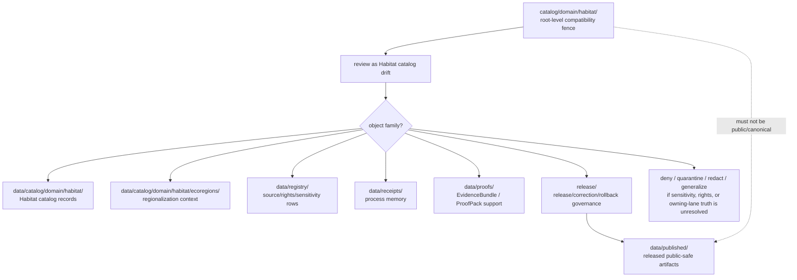

<!-- [KFM_META_BLOCK_V2]
doc_id: kfm://doc/catalog-domain-habitat-readme
title: catalog/domain/habitat/ — Habitat Domain Catalog Compatibility Redirect
type: readme
version: v0.2
status: draft
owners: OWNER_TBD — Habitat steward · Ecoregions steward · Ecology sensitivity steward · Catalog steward · Data steward · Registry steward · Evidence steward · Receipt steward · Proof steward · Release steward · Policy steward · Schema steward · Docs steward
created: 2026-06-16
updated: 2026-07-10
policy_label: public
related:
  - ../README.md
  - ../../README.md
  - ../../../data/README.md
  - ../../../data/catalog/README.md
  - ../../../data/catalog/domain/README.md
  - ../../../data/catalog/domain/habitat/README.md
  - ../../../data/catalog/domain/habitat/ecoregions/README.md
  - ../../../data/registry/README.md
  - ../../../data/receipts/README.md
  - ../../../data/proofs/README.md
  - ../../../data/published/README.md
  - ../../../release/README.md
  - ../../../docs/domains/habitat/DATA_LIFECYCLE.md
  - ../../../docs/domains/habitat/sublanes/ecoregions.md
  - ../../../schemas/contracts/v1/
  - ../../../contracts/
  - ../../../policy/
  - ../../../docs/adr/ADR-0011-receipts-vs-proofs-vs-manifests-vs-catalog-separation.md
  - ../../../docs/doctrine/directory-rules.md
tags: [kfm, catalog, domain, habitat, ecology, ecoregions, restoration, land-cover, connectivity, corridor, stewardship, geoprivacy, sensitivity, compatibility-root, redirect, data-catalog-domain, receipt-proof-catalog-publication-separation, non-authoritative, drift-fence, no-public-use]
notes:
  - "Refreshes the root-level catalog/domain/habitat compatibility-redirect fence."
  - "Root-level catalog/domain/habitat/ is compatibility and drift-control documentation only, not canonical habitat domain catalog authority, habitat-patch authority, land-cover authority, ecoregion authority, species-occurrence authority, rare-plant authority, source authority, registry authority, receipt authority, proof authority, release authority, publication authority, schema authority, policy authority, producer authority, hosting authority, or UI authority."
  - "Canonical habitat domain catalog records belong under data/catalog/domain/habitat/; Habitat ecoregion catalog records belong under data/catalog/domain/habitat/ecoregions/; source/rights/sensitivity rows belong under data/registry/; receipts belong under data/receipts/; proof support belongs under data/proofs/; release-governance records belong under release/; published delivery artifacts belong under data/published/ after governed release."
  - "Habitat catalog records must preserve owning-lane truth for Fauna, Flora, Soil, Hydrology, Hazards, Agriculture, Archaeology, Spatial Foundation, and People/Land joins. Ecoregions are regionalization context, not occurrence truth, species presence, rare-plant presence, habitat-patch quality, or release approval."
  - "Rare-species habitat, breeding/nesting/denning/roosting context, restoration sites, protected habitat, private-land context, indigenous/sovereign stewardship context, infrastructure-adjacent context, and join-induced sensitivity must not be exposed through this compatibility path."
  - "ADR-0011 is proposed and is used here only as separation evidence, not accepted-rule proof."
  - "Do not add habitat catalog records, ecoregion records, land-cover/restoration/connectivity records, STAC/DCAT/PROV records, source descriptors, registry rows, EvidenceBundles, receipts, release records, published artifacts, schemas, policy rules, generated outputs, or producer targets here without an ADR/migration note."
  - "Actual current contents beyond this README, historical producers, workflow writes, migration status, CI/review enforcement, public-client/producer exclusion, hosting readiness, habitat catalog schema maturity, STAC/DCAT/PROV closure, cross-lane join enforcement, sensitivity/redaction decisions, access-control maturity, and ADR disposition remain NEEDS VERIFICATION."
  - "v0.2 adds current evidence basis, Directory Rules placement basis, canonical data/catalog/domain/habitat alignment, ecoregions child-lane posture, Habitat cross-lane and sensitivity guardrails, family-separation posture, minimum safe redirect slice, anti-bypass matrix, migration/rollback posture, and safe language rules without claiming migration or enforcement maturity."
[/KFM_META_BLOCK_V2] -->

<a id="top"></a>

<div align="center">

# Habitat Domain Catalog Compatibility Redirect

`catalog/domain/habitat/`

**Root-level compatibility and drift-control fence for legacy or accidental Habitat-domain catalog placement. Canonical Habitat catalog records belong under `data/catalog/domain/habitat/`; related ecoregions, registry, receipt, proof, release, and published artifact families stay in their own owning roots.**


[Evidence](#0-evidence-basis-for-this-revision) · [Purpose](#1-purpose) · [Canonical homes](#2-canonical-homes) · [Boundary](#3-authority-boundary) · [Cross-lane guardrails](#8-habitat-cross-lane-and-sensitivity-guardrails) · [Migration](#11-migration-posture) · [Definition of done](#18-definition-of-done)

</div>

---

> [!IMPORTANT]
> **Status:** draft / `NEEDS VERIFICATION`  
> **Path:** `catalog/domain/habitat/README.md`  
> **Responsibility root:** compatibility redirect / drift fence only  
> **Canonical Habitat catalog home:** `data/catalog/domain/habitat/`  
> **Habitat ecoregions catalog home:** `data/catalog/domain/habitat/ecoregions/`  
> **Parent domain catalog home:** `data/catalog/domain/`  
> **Registry home:** `data/registry/`  
> **Receipt home:** `data/receipts/`  
> **Proof home:** `data/proofs/`  
> **Release-governance home:** `release/`  
> **Published artifact home:** `data/published/`  
> **Directory Rules basis:** file location encodes ownership, governance, and lifecycle. Root-level `catalog/domain/habitat/` is a compatibility redirect only and must not become a parallel Habitat catalog, ecoregion catalog, habitat-patch, land-cover, suitability, connectivity, corridor, restoration, stewardship, source, registry, STAC, DCAT, PROV, receipt, proof, release, publication, schema, policy, pipeline, package, tool, search, hosting, or UI authority.  
> **Truth posture:** CONFIRMED current GitHub README path / CONFIRMED `data/catalog/domain/habitat/README.md` exists and treats `data/catalog/domain/habitat/` as the Habitat CATALOG-stage sublane / CONFIRMED `data/catalog/domain/habitat/ecoregions/README.md` exists and treats ecoregions as context, not occurrence truth / CONFIRMED Habitat lifecycle docs bind Habitat to the RAW → WORK/QUARANTINE → PROCESSED → CATALOG/TRIPLET → PUBLISHED lifecycle, governed promotion, trust membrane, and watcher non-publisher posture / CONFIRMED `data/registry/README.md`, `data/receipts/README.md`, `data/proofs/README.md`, and `release/README.md` exist and preserve family separation / CONFIRMED Directory Rules document exists / PROPOSED root-level `catalog/domain/habitat/` redirect contract / UNKNOWN actual files beyond README, historical producers, workflow writes, migration status, Habitat catalog schema maturity, STAC/DCAT/PROV closure, CI/review guard, public-client/producer exclusion, cross-lane join enforcement, access-control maturity, hosting readiness, and ADR disposition

> [!CAUTION]
> Do not make `catalog/domain/habitat/` a parallel Habitat catalog authority. Habitat catalog records belong under `data/catalog/domain/habitat/`; ecoregion catalog records belong under `data/catalog/domain/habitat/ecoregions/`; source/rights/sensitivity rows belong under `data/registry/`; receipts, proofs, release decisions, published artifacts, schemas, contracts, policies, source code, generated previews, and unpublished lifecycle data stay in their own owning roots.

---

## Quick jump

- [0. Evidence basis for this revision](#0-evidence-basis-for-this-revision)
- [1. Purpose](#1-purpose)
- [2. Canonical homes](#2-canonical-homes)
- [3. Authority boundary](#3-authority-boundary)
- [4. Default posture](#4-default-posture)
- [5. Allowed contents](#5-allowed-contents)
- [6. Forbidden contents](#6-forbidden-contents)
- [7. Directory shape](#7-directory-shape)
- [8. Habitat cross-lane and sensitivity guardrails](#8-habitat-cross-lane-and-sensitivity-guardrails)
- [9. Minimum safe redirect slice](#9-minimum-safe-redirect-slice)
- [10. Related Habitat catalog lane posture](#10-related-habitat-catalog-lane-posture)
- [11. Migration posture](#11-migration-posture)
- [12. Runtime and producer anti-bypass matrix](#12-runtime-and-producer-anti-bypass-matrix)
- [13. Diagram](#13-diagram)
- [14. Inspection path](#14-inspection-path)
- [15. Validation expectations](#15-validation-expectations)
- [16. Safe change pattern](#16-safe-change-pattern)
- [17. Rollback and correction posture](#17-rollback-and-correction-posture)
- [18. Definition of done](#18-definition-of-done)
- [19. Open verification items](#19-open-verification-items)
- [20. Safe language rules](#20-safe-language-rules)

---

## 0. Evidence basis for this revision

This README is a documentation boundary, not migration proof, catalog-schema proof, access-control proof, sensitivity-review proof, redaction proof, STAC/DCAT/PROV closure proof, release approval proof, publication-hosting proof, or CI enforcement proof. The 2026-07-10 revision updates an existing compatibility README and keeps maturity bounded while aligning root-level `catalog/domain/habitat/` with the canonical `data/catalog/domain/habitat/` Habitat catalog lane, the `ecoregions/` child catalog lane, the separate `data/registry/` registry root, the separate `data/receipts/` process-memory root, the separate `data/proofs/` proof-support root, the `release/` release-governance root, and Directory Rules placement posture.

| Evidence item | Status | What it supports | What it does not prove |
|---|---|---|---|
| `catalog/domain/habitat/README.md` exists on `main`. | CONFIRMED | This is an existing README update, not a new path proposal. | It does not prove actual contents beyond the README, historical producers, migration status, CI enforcement, public-client exclusion, hosting readiness, sensitivity decisions, or ADR disposition. |
| `catalog/domain/README.md` exists and treats root-level `catalog/domain/` as a compatibility redirect, not canonical domain catalog authority. | CONFIRMED parent redirect posture | The Habitat child path should inherit compatibility-fence behavior. | It does not prove all root-level domain catalog drift has been removed. |
| `data/catalog/domain/habitat/README.md` exists and treats `data/catalog/domain/habitat/` as the Habitat-domain catalog lane. | CONFIRMED canonical Habitat catalog lane posture | Habitat catalog records belong under `data/catalog/domain/habitat/`. | It does not prove concrete catalog records, schemas, validators, policy gates, receipts, release manifests, access controls, or route behavior. |
| `data/catalog/domain/habitat/ecoregions/README.md` exists and treats ecoregions as regionalization context, not occurrence/species truth. | CONFIRMED child catalog lane posture | Ecoregion catalog records belong under the canonical Habitat child lane and must stay context-bound. | It does not prove concrete ecoregion catalog inventory, schemas, validators, release state, or route behavior. |
| `docs/domains/habitat/DATA_LIFECYCLE.md` exists and profiles Habitat against the KFM lifecycle, trust membrane, and watcher non-publisher posture. | CONFIRMED lifecycle posture | Habitat catalog drift must not bypass lifecycle, policy, evidence, catalog closure, release, correction, rollback, or public-governed-route gates. | It does not prove implementation maturity, exact producer behavior, validators, or CI integration. |
| `docs/domains/habitat/sublanes/ecoregions.md` exists and states that ecoregion polygons are context, not occurrence or species truth. | CONFIRMED sublane doctrine posture | Habitat joins must preserve owning-lane truth and fail closed when joins touch sensitive occurrence or rare-plant material. | It does not prove route behavior, access controls, or catalog records. |
| `data/registry/README.md` exists and treats registry rows as source/rights/sensitivity-aware governance records. | CONFIRMED registry-root posture | Source descriptors, rights rows, sensitivity rows, dataset rows, and related registry records belong under `data/registry/`. | It does not prove final taxonomy, row inventories, validators, or release integration. |
| `data/receipts/README.md` exists and marks receipts as process memory. | CONFIRMED receipt-root posture | Catalog-build, validation, migration, AI, redaction/generalization, correction, and release-support receipts belong under `data/receipts/`. | It does not prove emitted receipt inventories, signing, validators, release integration, or CI enforcement. |
| `data/proofs/README.md` exists and treats proof artifacts as support objects, not public truth by placement. | CONFIRMED proof-root posture | EvidenceBundle and ProofPack support belongs under `data/proofs/`, not this redirect path. | It does not prove emitted proof inventories, schemas, validators, fixtures, CI workflows, or release-gate enforcement. |
| `release/README.md` exists and treats `release/` as release-governance root. | CONFIRMED release-root posture | Release decisions, correction, rollback, withdrawal, supersession, and signatures belong under `release/`. | It does not prove release workflow maturity or active release approval. |
| `docs/adr/ADR-0011-receipts-vs-proofs-vs-manifests-vs-catalog-separation.md` exists and states the proposed separation rule `receipt ≠ proof ≠ catalog ≠ publication`. | CONFIRMED ADR document presence; PROPOSED decision status | Supports family-separation language while keeping ADR acceptance bounded. | It does not prove ADR acceptance or validator enforcement. |
| `docs/doctrine/directory-rules.md` exists and states that file location encodes ownership, governance, and lifecycle. | CONFIRMED placement doctrine | Root-level `catalog/domain/habitat/` must remain a compatibility fence; catalog, registry, receipt, proof, release, and published records belong under their owning roots. | It does not prove live repo drift has been fully audited. |

[Back to top](#top)

---

## 1. Purpose

`catalog/domain/habitat/` is a **root-level compatibility redirect** for Habitat-domain catalog path drift.

It exists only to prevent accidental, legacy, generated, copied, or externally imported Habitat catalog-family material from becoming a parallel authority outside KFM's governed lifecycle, registry, proof, receipt, release, and publication roots.

This folder should not be used for canonical:

- Habitat domain catalog records, habitat-patch indexes, land-cover observation catalogs, ecological-system catalogs, suitability-surface catalogs, connectivity/corridor catalogs, restoration-opportunity catalogs, stewardship-zone catalogs, uncertainty-surface catalogs, ecoregion catalogs, or catalog manifests;
- species occurrence truth, plant occurrence truth, rare-plant records, animal taxonomy, plant taxonomy, soil truth, hydrology truth, hazard truth, agriculture truth, archaeology truth, land/title truth, or spatial-reference truth;
- rare-species habitat, breeding, nesting, denning, roosting, spawning, lek, restoration, protected habitat, private-land, stewardship-sensitive, indigenous/sovereign, or join-sensitive site details;
- STAC, DCAT, PROV, CatalogMatrix, layer catalog, source catalog, catalog index, catalog manifest, or discovery records;
- raw observations, corrected observations, land-cover rasters, suitability models, connectivity outputs, restoration model outputs, QA outputs, generated public previews, or published map/download/API payloads;
- process receipts, catalog-build receipts, validation receipts, migration receipts, rollback receipts, redaction/generalization receipts, release dry-run receipts, AI receipts, or telemetry receipts;
- EvidenceBundles, ProofPacks, citation-validation bundles, release-readiness proof, catalog-closure proof, rollback proof, correction proof, or claim-support records;
- ReleaseManifest, PromotionDecision, RollbackCard, CorrectionNotice, withdrawal, supersession, signature, release-state record, or published artifact.

[Back to top](#top)

---

## 2. Canonical homes

Canonical Habitat domain catalog material belongs under:

```text
data/catalog/domain/habitat/
```

Habitat ecoregion catalog records belong under:

```text
data/catalog/domain/habitat/ecoregions/
```

Source, dataset, rights, sensitivity, and registry rows belong under:

```text
data/registry/
```

Process-memory receipts belong under:

```text
data/receipts/
```

Proof support belongs under:

```text
data/proofs/
```

Release-governance material belongs under:

```text
release/
```

Released public-safe delivery artifacts belong under:

```text
data/published/
```

The root-level `catalog/domain/habitat/` directory is a redirect/fence only.

```text
catalog/domain/habitat/              # compatibility redirect only; do not add catalog-family records here
data/catalog/domain/habitat/         # Habitat CATALOG-stage domain records
data/catalog/domain/habitat/ecoregions/ # Habitat ecoregion context catalog records
data/registry/                       # source / dataset / rights / sensitivity rows
data/receipts/                       # process-memory records
data/proofs/                         # proof-support records
release/                             # release / correction / rollback governance
data/published/                      # released public-safe delivery artifacts
```

If a future ADR or migration changes Habitat catalog placement, this README should be updated to cite the accepted target, producer-configuration evidence, validation evidence, cross-lane/sensitivity/release review evidence, and any migration, correction, or rollback records.

## 3. Authority boundary

`catalog/domain/habitat/` has **no canonical Habitat catalog authority**, **no habitat-patch authority**, **no land-cover authority**, **no ecoregion authority**, **no occurrence authority**, **no species authority**, **no rare-plant authority**, **no source authority**, **no registry authority**, **no receipt authority**, **no proof authority**, **no release authority**, and **no publication authority**. It may hold only redirect guidance, migration notes, drift logs, or temporary markers while misplaced material is reviewed and moved into its proper owning root.

```text
WRONG / LEGACY ROOT             HABITAT CATALOG HOMES                     SUPPORT AND RELEASE HOMES
catalog/domain/habitat/    -->  data/catalog/domain/habitat/       -->    data/registry/
compatibility fence only        data/catalog/domain/habitat/ecoregions/   data/receipts/
not authoritative               catalog records / context records          data/proofs/
                                public-safe representations                release/
                                                                               data/published/
```

A Habitat catalog record outside `data/catalog/domain/habitat/` should be treated as Habitat catalog-family drift. An ecoregion catalog record outside `data/catalog/domain/habitat/ecoregions/`, a source or rights row outside `data/registry/`, a receipt outside `data/receipts/`, a proof outside `data/proofs/`, a release record outside `release/`, or a public artifact outside `data/published/` should be treated as family drift until reviewed and migrated.

## 4. Default posture

Anything found under root-level `catalog/domain/habitat/` should be treated as **NEEDS VERIFICATION** and potentially misplaced.

Do not expose, publish, index, cite, search, cache, export, tile, host, or depend on root-level Habitat catalog files as canonical Habitat, occurrence, species, rare-plant, source, proof, release, registry, or published artifact records. First confirm object family, source, source role, provenance, rights, sensitivity, geoprivacy posture, cross-lane owning authority, evidence resolution, schema validity, policy decision, lifecycle state, receipt support, proof support, catalog closure, release state, digest/sidecar integrity, rollback path, correction path, and whether the object is actually a catalog record, ecoregion context record, habitat patch record, public derivative, registry row, receipt, proof, release-governance record, published artifact, or unpublished candidate.

## 5. Allowed contents

| Allowed item | Example | Required posture |
|---|---|---|
| README / redirect docs | `README.md` | Compatibility fence only |
| Migration note | `MIGRATION.md` | Temporary and ADR/review-linked |
| Drift note | `DRIFT.md`, `OPEN-QUESTIONS.md` | Must point to canonical homes and review steps |
| Placeholder marker | `.gitkeep` | Does not authorize catalog, ecoregion, habitat-patch, occurrence, species, source, proof, receipt, release, policy, schema, or public-output content |

## 6. Forbidden contents

| Forbidden here | Correct home |
|---|---|
| Habitat domain catalog records, indexes, HabitatPatch catalogs, LandCoverObservation catalogs, EcologicalSystem catalogs, suitability/corridor/restoration/stewardship catalogs | `data/catalog/domain/habitat/` |
| Habitat ecoregion catalog records, EcoregionFramework, EcoregionSnapshot, EcoregionLevel, EcoregionContextJoin records | `data/catalog/domain/habitat/ecoregions/` |
| Species occurrence truth, animal taxonomy, plant occurrence truth, rare-plant records, soil truth, hydrology truth, hazard truth, agriculture truth, archaeology truth, land/title truth | Owning domain lifecycle/catalog/proof homes; never this compatibility path |
| Rare-species habitat, breeding/nesting/denning/roosting context, protected habitat, restoration site detail, private-land context, stewardship-sensitive context, indigenous/sovereign context, or join-sensitive context | Governed lifecycle, proof, policy, or protected-review homes with policy/redaction gates; never this compatibility path |
| Raw habitat source payloads, land-cover rasters, connectivity outputs, suitability models, restoration outputs, monitoring records, processed datasets, generated previews | Correct lifecycle lane under `data/`, not this root-level compatibility path |
| STAC, DCAT, PROV, CatalogMatrix, catalog manifests, discovery records | `data/catalog/` or accepted child lanes under it |
| Source descriptors, source registry rows, dataset rows, rights rows, sensitivity rows, source/land-cover/ecoregion crosswalk rows | `data/registry/` or governed registry homes |
| Receipts, catalog-build receipts, validation receipts, redaction/generalization receipts, AI receipts, release dry-run receipts, rollback receipts, migration receipts | `data/receipts/` |
| EvidenceBundles, ProofPacks, attestations, citation-validation bundles, release-readiness proof, rollback proof, correction proof, claim-support records | `data/proofs/` |
| ReleaseManifest, PromotionDecision, release decision, RollbackCard, CorrectionNotice, withdrawal, supersession, signature, release-state record | `release/` |
| Released artifacts, public-safe Habitat layers, reports, stories, downloads, API payload snapshots, public indexes, allowlists, caveat summaries, digest sidecars, tiles, PMTiles | `data/published/` after governed release |
| Schemas and machine-shape contracts | `schemas/contracts/v1/` |
| Human contracts and object-meaning docs | `contracts/` |
| Policy rules and policy decisions | `policy/` and governed policy-decision homes |
| Source code, scripts, packages, pipelines, build tools, producers, preview generators | `apps/`, `packages/`, `tools/`, `scripts/`, `pipelines/` |
| RAW, WORK, QUARANTINE, PROCESSED, CATALOG, TRIPLET, unpublished candidate, or restricted lifecycle data | `data/` lifecycle subtrees |

## 7. Directory shape

Current implementation inventory remains `NEEDS VERIFICATION`.

```text
catalog/domain/habitat/
├── README.md                 # compatibility redirect / drift fence
├── MIGRATION.md              # PROPOSED only if migration is active
└── DRIFT.md                  # PROPOSED only if misplaced Habitat catalog material is found
```

> [!WARNING]
> Do not treat this suggested shape as complete repo inventory. Verify actual contents before making inventory, producer, enforcement, catalog-schema, cross-lane enforcement, sensitivity-review, access-control, hosting, or migration claims.

## 8. Habitat cross-lane and sensitivity guardrails

Habitat catalog drift is especially risky because habitat context, species occurrence, rare-plant context, land cover, ecoregions, restoration opportunity, stewardship zones, and public derivatives can look similar in an index. Any material found here must preserve owning-lane truth, sensitivity class, source role, and public-safe derivative lineage before it is migrated or used.

| Guardrail | Required posture |
|---|---|
| Habitat records are context/evidence-bound | A catalog entry supports discovery and closure; it does not make a Habitat claim true or public by placement. |
| Ecoregions are context, not occurrence truth | Ecoregions classify places by source framework/version; they do not prove species presence, rare-plant presence, habitat-patch quality, regulatory status, or release approval. |
| Owning-lane truth must remain visible | Fauna owns animal occurrence truth; Flora owns plant and rare-plant truth; Soil, Hydrology, Hazards, Agriculture, Archaeology, Spatial Foundation, and People/Land keep their own authority. |
| Cross-lane joins can raise sensitivity | Joining habitat with occurrence, rare plants, private land, stewardship, infrastructure, archaeology, or repeated observations can create a more sensitive object than either input alone. |
| Sensitive habitat context fails closed when unclear | Hold, redact, generalize, aggregate, delay, quarantine, or deny public exposure when sensitivity, rights, or review state is unresolved. |
| Restoration and stewardship sites require review | Restoration opportunity, protected habitat, private-land, and steward-managed site context may require staged access, aggregation, or denial. |
| Rights and sovereignty review can block publication | When source rights, sovereignty, stewardship, or access terms are unclear, route to review, quarantine, redaction, or denial rather than publication. |
| Watchers are not publishers | Watcher/source-head outputs may propose candidates; they must not publish or write durable catalog/release/public artifacts here. |
| Public exposure is release-gated | A catalog record is not public merely because it exists under a catalog lane. |

## 9. Minimum safe redirect slice

A smallest safe `catalog/domain/habitat/` state should prove only that the folder prevents drift; it should not contain trust-bearing catalog, source, habitat-patch, ecoregion, release, sensitive, or public-delivery material.

| Slice item | Minimum requirement | Why it matters |
|---|---|---|
| Redirect README | Points to `data/catalog/domain/habitat/` for Habitat catalog records | Prevents parallel Habitat catalog authority |
| Ecoregions map | Points to `data/catalog/domain/habitat/ecoregions/` for Habitat ecoregion catalog records | Prevents child-lane collapse |
| No catalog records | No HabitatPatch catalog, LandCoverObservation catalog, EcologicalSystem catalog, suitability catalog, connectivity catalog, restoration catalog, stewardship catalog, ecoregion catalog, or catalog manifest | Preserves catalog lifecycle root |
| No source/registry records | No SourceDescriptor, rights row, sensitivity row, dataset row, source registry row, or source/ecoregion/land-cover crosswalk row | Preserves registry root |
| No source payloads | No raw habitat source payload, land-cover raster, model output, processed dataset, monitoring record, PMTiles, or generated preview | Preserves lifecycle and pipeline boundaries |
| No receipt records | No CatalogBuildReceipt, RunReceipt, ValidationReceipt, RedactionReceipt, AIReceipt, migration receipt, release dry-run receipt, rollback receipt, or geoprivacy receipt | Preserves receipt/process-memory root |
| No proof records | No EvidenceBundle, ProofPack, release attestation, citation validation, rollback proof, correction proof, or claim-support files | Preserves proof-support root |
| No release/public artifacts | No ReleaseManifest, release decision, RollbackCard, published Habitat layer, public index, PMTiles, report, story, API snapshot, or digest | Preserves release and published roots |
| No sensitive exposure | No rare-species habitat, breeding/nesting/denning/roosting context, protected habitat, private-land detail, stewardship-sensitive record, or join-sensitive site context | Prevents exposure and policy bypass |
| Drift procedure | Explains how to inspect and migrate misplaced records | Keeps remediation reversible |
| Producer guard | Producers, generators, scripts, and CI should not write durable Habitat catalog material here | Prevents reintroducing drift |
| Public-use guard | Public clients, search services, map runtimes, exports, static hosting, and indexes must not read from this path as canonical | Preserves governed access path |
| Verification backlog | Open items stay visible | Prevents documentation from pretending migration/enforcement is complete |

## 10. Related Habitat catalog lane posture

| Lane | Status | Boundary |
|---|---|---|
| `catalog/domain/habitat/` | Compatibility redirect path | Root-level drift fence only; not canonical. |
| `data/catalog/domain/habitat/` | CONFIRMED README path / draft catalog lane | Canonical Habitat catalog placement for domain catalog records; still implementation-bounded. |
| `data/catalog/domain/habitat/ecoregions/` | CONFIRMED README path / draft child catalog lane | Habitat ecoregion catalog sublane; context, not occurrence/species truth. |
| `data/catalog/stac/habitat/` | PROPOSED in canonical Habitat catalog README | Spatiotemporal catalog lane when accepted and verified. |
| `data/catalog/dcat/habitat/` | PROPOSED in canonical Habitat catalog README | Dataset/distribution catalog lane when accepted and verified. |
| `data/catalog/prov/habitat/` | PROPOSED in canonical Habitat catalog README | Provenance catalog lane when accepted and verified. |

Do not claim payload inventory, source descriptors, rights clearance, sensitivity decisions, cross-lane enforcement, access-control enforcement, schema validity, release state, route behavior, map behavior, or hosting readiness from README presence alone.

## 11. Migration posture

If Habitat catalog-family files are found here:

1. Do not publish, cite, index, search, cache, export, tile, host, or depend on them.
2. Identify whether they are Habitat catalog records, ecoregion catalog records, STAC/DCAT/PROV records, CatalogMatrix records, habitat-patch records, land-cover records, suitability/connectivity/corridor records, restoration/stewardship records, source descriptors, registry rows, receipts, proof support, release records, published-output material, schemas, policy records, unpublished lifecycle material, generated previews, temporary build artifacts, or producer outputs.
3. Determine whether the file is historical drift, generated drift, copied output, unreviewed local work, or an intentional migration marker.
4. Check source role, owning-lane truth, sensitivity, rights, stewardship, sovereignty, join-induced sensitivity, private-land context, restoration/protected-habitat context, and public-safe geometry posture before moving or exposing anything.
5. Move Habitat domain catalog records into `data/catalog/domain/habitat/` or an accepted child lane under it.
6. Move Habitat ecoregion catalog records into `data/catalog/domain/habitat/ecoregions/` or an accepted child lane under it.
7. Move STAC/DCAT/PROV Habitat records into accepted catalog-family lanes under `data/catalog/` when those lanes are verified.
8. Move source, dataset, rights, sensitivity, source crosswalk, and layer rows into `data/registry/` or accepted registry child lanes.
9. Move receipts into `data/receipts/`.
10. Move proof support into `data/proofs/`.
11. Move release-governance records into `release/`.
12. Move or regenerate released public-safe Habitat artifacts into `data/published/` only after governed release approval and required sidecar/digest/citation/caveat support.
13. Move schemas, contracts, policy rules, code, and producer outputs into their owning roots.
14. Preserve provenance, source refs, source role, object-family identity, habitat-patch identity, ecoregion framework/version/level identity, owning-lane truth, sensitivity class, derivative lineage, digests, redaction/generalization receipts, catalog-build receipts, proof refs, catalog refs, review notes, producer identity, release refs, correction refs, and rollback path.
15. Add a drift register, migration note, or correction note if the misplaced material was previously consumed.
16. Add or update validation checks so producers do not recreate root-level Habitat catalog drift.
17. Leave `catalog/domain/habitat/` as a redirect/fence unless an accepted ADR explicitly changes the authority model.

## 12. Runtime and producer anti-bypass matrix

| Bypass risk | Required behavior | Review signal |
|---|---|---|
| Producer writes Habitat catalog records to `catalog/domain/habitat/` | Fail review/CI; write to `data/catalog/domain/habitat/` instead | Producer config and output paths checked |
| Producer writes ecoregion catalog records here | Fail review/CI; write to `data/catalog/domain/habitat/ecoregions/` instead | Ecoregion path check passes |
| Producer writes source descriptors or rights rows here | Fail review/CI; write to `data/registry/` instead | Registry path check passes |
| Producer writes receipts here | Fail review/CI; write to `data/receipts/` instead | Receipt path check passes |
| Producer writes proofs here | Fail review/CI; write to `data/proofs/` instead | Proof path check passes |
| Producer writes release records here | Fail review/CI; write to `release/` instead | Release path check passes |
| Producer writes public Habitat exports here | Fail review/CI; write to `data/published/` only after release | Published path and release-state checks pass |
| Public client reads root-level Habitat catalog path | Deny; route through governed API/release/public-safe path | Client/search/index/hosting config excludes this path |
| Root-level Habitat file is treated as canonical occurrence or species truth | Mark as drift; route to owning Fauna/Flora or Habitat catalog/proof support before use | Migration note references owning authority |
| Ecoregion context is treated as occurrence truth | Mark as drift; keep ecoregions context-bound | Review confirms context-not-occurrence language |
| Sensitive habitat or cross-lane join appears here | Deny, quarantine, remove, redact, generalize, aggregate, or route to steward review | Sensitivity/publication review passes |
| Root-level file is used in Evidence Drawer, Focus Mode, map runtime, export, static hosting, or search index | Reject; use governed catalog/proof/release/published surfaces | Trust membrane and release checks pass |

## 13. Diagram



## 14. Inspection path

When reviewing this directory:

1. Inspect actual files under `catalog/domain/habitat/`.
2. Confirm every non-README item is a migration note, drift note, or temporary marker.
3. For any trust-bearing file, identify the correct owning root before moving it.
4. Check `data/catalog/domain/habitat/` and `data/catalog/domain/habitat/ecoregions/` for canonical catalog placement.
5. Check `data/registry/`, `data/receipts/`, `data/proofs/`, `release/`, and `data/published/` for separated support families.
6. Confirm no public client, map runtime, search index, export, static host, or producer reads or writes this root-level path as canonical.
7. Preserve migration receipts, drift notes, correction notes, and rollback targets.

## 15. Validation expectations

Useful validation for this folder should cover:

- no Habitat catalog records, indexes, manifests, ecoregion records, land-cover crosswalks, habitat-patch records, suitability/connectivity/corridor records, restoration records, or stewardship-zone records are stored here;
- no sensitivity-relevant habitat, rare-species habitat, protected habitat, private-land, stewardship-sensitive, or join-sensitive details are stored here;
- no STAC/DCAT/PROV records, source descriptors, registry rows, receipts, proofs, release records, policy rules, schemas, source code, producer outputs, or published artifacts are stored here;
- any non-README content is tied to an active migration, drift note, or correction note;
- CI or review checks flag root-level `catalog/domain/habitat/` writes;
- links point users to `data/catalog/domain/habitat/`, `data/catalog/domain/habitat/ecoregions/`, and other canonical homes;
- no public client or producer treats this compatibility path as canonical.

## 16. Safe change pattern

For changes under `catalog/domain/habitat/`:

1. Confirm the change is redirect documentation, migration support, or drift documentation only.
2. Confirm it does not create a parallel Habitat domain catalog authority.
3. Confirm it does not collapse ecoregions, habitat patches, species occurrence truth, rare-plant truth, land-cover context, restoration context, or stewardship context.
4. Confirm no sensitivity-relevant Habitat detail is added.
5. Confirm durable Habitat catalog records are placed under `data/catalog/domain/habitat/` or an accepted child lane.
6. Confirm receipts/proofs/release records are placed under their owning roots.
7. Document migration, correction, and rollback if any misplaced material was moved or previously consumed.
8. Update docs and validation rules when behavior materially changes.

## 17. Rollback and correction posture

Rollback is required if this directory becomes a Habitat catalog root, ecoregion catalog root, source registry root, proof store, receipt store, release-decision root, published-output root, schema root, policy root, producer target, public UI path, or public exposure shortcut.

Rollback should restore this folder to a redirect-only state and move or remove misplaced files through a documented migration. If any misplaced file was consumed by a public client, search index, export, map runtime, Evidence Drawer, Focus Mode, report, or release candidate, add a correction note and link the rollback target.

## 18. Definition of done

- [ ] Owners are confirmed and `OWNER_TBD` is replaced.
- [ ] Actual root-level `catalog/domain/habitat/` contents are verified.
- [ ] Any misplaced Habitat catalog material is migrated or documented as drift.
- [ ] Canonical Habitat catalog placement under `data/catalog/domain/habitat/` is accepted and documented.
- [ ] Ecoregion catalog records are routed to `data/catalog/domain/habitat/ecoregions/` when that child lane is accepted for the record family.
- [ ] No trust-bearing records live here.
- [ ] No Habitat catalog records, ecoregion records, sensitivity-relevant Habitat detail, cross-lane join output, STAC/DCAT/PROV records, registry records, receipts, proofs, release records, published artifacts, schemas, contracts, policy rules, source code, or lifecycle data live here.
- [ ] CI/review behavior is verified or marked `NEEDS VERIFICATION`.
- [ ] Public clients, search, export, map runtime, static hosting, and producers are confirmed not to read or write this path as canonical.

## 19. Open verification items

| Item | Why it matters |
|---|---|
| Confirm actual files under root-level `catalog/domain/habitat/` | Prevents overclaiming or missing drift |
| Confirm whether any workflow writes here | Required before producer claims |
| Confirm accepted canonical Habitat catalog placement | Required before final migration claims |
| Confirm accepted ecoregion catalog sublane placement | Required before child-lane migration claims |
| Confirm sensitivity/redaction handling | Required before safe-publication claims |
| Confirm migration status to `data/catalog/domain/habitat/` | Required before canonical-home claims beyond README evidence |
| Confirm CI/review guard exists | Required before enforcement claims |
| Confirm no trust records are stored here | Required before Directory Rules compliance claims |
| Confirm no public client, producer, search index, export, static host, or map runtime reads this path | Required before public trust claims |
| Confirm ADR status for root-level `catalog/domain/habitat/` | Required before long-term retention claims |

## 20. Safe language rules

Use:

- "compatibility redirect"
- "drift-control fence"
- "canonical Habitat catalog records belong under `data/catalog/domain/habitat/`"
- "ecoregion catalog records belong under `data/catalog/domain/habitat/ecoregions/`"
- "README evidence only"
- "NEEDS VERIFICATION for inventory, validators, CI, producer behavior, access controls, route behavior, and release state"

Avoid:

- "this directory contains Habitat catalog records"
- "this path is canonical"
- "public-safe because it is under catalog"
- "ecoregions prove species presence"
- "habitat context proves rare-plant or animal occurrence"
- "migration complete"
- "CI enforces this"
- "producer-safe"
- "release-approved"
- "public API reads from here"

<details>
<summary>Appendix A — no-loss preservation note</summary>

The previous v0.1 README already established `catalog/domain/habitat/` as a compatibility/redirect fence and warned against parallel catalog authority. This v0.2 update preserves that boundary and expands it with current evidence basis, canonical `data/catalog/domain/habitat/` and `ecoregions/` alignment, family separation, cross-lane sensitivity posture, migration/rollback posture, and safe language rules without claiming catalog files, migration work, CI enforcement, producer workflows, sensitivity decisions, access controls, release state, or ADR disposition are implemented.

</details>

## Status summary

`catalog/domain/habitat/` is a root-level compatibility redirect and Habitat-domain drift fence. It is not the canonical Habitat domain catalog home.

Habitat catalog authority belongs under `data/catalog/domain/habitat/`; ecoregion catalog context belongs under `data/catalog/domain/habitat/ecoregions/`; trust-bearing support belongs under `data/registry/`, `data/receipts/`, `data/proofs/`, and `release/`; released public-safe products belong under `data/published/`.

<p align="right"><a href="#top">Back to top</a></p>
