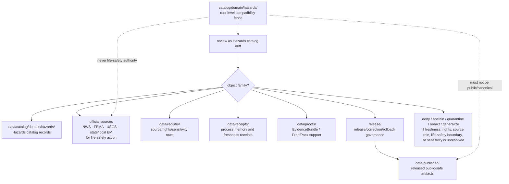

<!-- [KFM_META_BLOCK_V2]
doc_id: kfm://doc/catalog-domain-hazards-readme
title: catalog/domain/hazards/ — Hazards Domain Catalog Compatibility Redirect
type: readme
version: v0.2
status: draft
owners: OWNER_TBD — Hazards steward · Emergency-management reviewer · Catalog steward · Data steward · Registry steward · Evidence steward · Receipt steward · Proof steward · Release steward · Policy steward · Schema steward · Docs steward
created: 2026-06-16
updated: 2026-07-10
policy_label: public
related:
  - ../README.md
  - ../../README.md
  - ../../../data/README.md
  - ../../../data/catalog/README.md
  - ../../../data/catalog/domain/README.md
  - ../../../data/catalog/domain/hazards/README.md
  - ../../../data/registry/README.md
  - ../../../data/receipts/README.md
  - ../../../data/proofs/README.md
  - ../../../data/published/README.md
  - ../../../release/README.md
  - ../../../docs/domains/hazards/ARCHITECTURE.md
  - ../../../docs/domains/hazards/DATA_LIFECYCLE.md
  - ../../../schemas/contracts/v1/
  - ../../../contracts/
  - ../../../policy/
  - ../../../docs/adr/ADR-0011-receipts-vs-proofs-vs-manifests-vs-catalog-separation.md
  - ../../../docs/doctrine/directory-rules.md
tags: [kfm, catalog, domain, hazards, risk, resilience, emergency-management, life-safety-boundary, official-source-redirect, freshness, expiry, compatibility-root, redirect, data-catalog-domain, receipt-proof-catalog-publication-separation, non-authoritative, drift-fence, no-public-use]
notes:
  - "Refreshes the root-level catalog/domain/hazards compatibility-redirect fence."
  - "Root-level catalog/domain/hazards/ is compatibility and drift-control documentation only, not canonical hazards domain catalog authority, hazard-event authority, regulatory authority, operational-warning authority, emergency-alert authority, life-safety authority, source authority, registry authority, receipt authority, proof authority, release authority, publication authority, schema authority, policy authority, producer authority, hosting authority, or UI authority."
  - "Canonical hazards domain catalog records belong under data/catalog/domain/hazards/; source/rights/sensitivity rows belong under data/registry/; receipts belong under data/receipts/; proof support belongs under data/proofs/; release-governance records belong under release/; published delivery artifacts belong under data/published/ after governed release."
  - "Hazards records must preserve knowledge-character separation: historical events, regulatory context, operational context, scientific observations, remote-sensing detections, modeled derivatives, exposure summaries, declarations, and public derivatives are not interchangeable."
  - "KFM is not an emergency alert system. Operational warnings, advisories, and watches are context only; life-safety action must redirect to official sources."
  - "Sensitive hazards context, including emergency-response context, critical-facility context, exposure/vulnerability detail, evacuation or response planning detail, private-land context, infrastructure-adjacent context, and living-person impact context, must not be exposed through this compatibility path."
  - "ADR-0011 is proposed and is used here only as separation evidence, not accepted-rule proof."
  - "Do not add hazards catalog records, exposure indexes, operational warning records, STAC/DCAT/PROV records, source descriptors, registry rows, EvidenceBundles, receipts, release records, published artifacts, schemas, policy rules, generated outputs, or producer targets here without an ADR/migration note."
  - "Actual current contents beyond this README, historical producers, workflow writes, migration status, CI/review enforcement, public-client/producer exclusion, hosting readiness, hazards catalog schema maturity, STAC/DCAT/PROV closure, freshness/expiry enforcement, source-role enforcement, sensitivity/redaction decisions, access-control maturity, and ADR disposition remain NEEDS VERIFICATION."
  - "v0.2 adds current evidence basis, Directory Rules placement basis, canonical data/catalog/domain/hazards alignment, hazards knowledge-character and life-safety guardrails, family-separation posture, minimum safe redirect slice, anti-bypass matrix, migration/rollback posture, and safe language rules without claiming migration or enforcement maturity."
[/KFM_META_BLOCK_V2] -->

<a id="top"></a>

<div align="center">

# Hazards Domain Catalog Compatibility Redirect

`catalog/domain/hazards/`

**Root-level compatibility and drift-control fence for legacy or accidental Hazards-domain catalog placement. Canonical Hazards catalog records belong under `data/catalog/domain/hazards/`; related registry, receipt, proof, release, and published artifact families stay in their own owning roots.**


[Evidence](#0-evidence-basis-for-this-revision) · [Purpose](#1-purpose) · [Canonical homes](#2-canonical-homes) · [Boundary](#3-authority-boundary) · [Hazards guardrails](#8-hazards-knowledge-character-and-life-safety-guardrails) · [Migration](#11-migration-posture) · [Definition of done](#18-definition-of-done)

</div>

---

> [!IMPORTANT]
> **Status:** draft / `NEEDS VERIFICATION`  
> **Path:** `catalog/domain/hazards/README.md`  
> **Responsibility root:** compatibility redirect / drift fence only  
> **Canonical Hazards catalog home:** `data/catalog/domain/hazards/`  
> **Parent domain catalog home:** `data/catalog/domain/`  
> **Registry home:** `data/registry/`  
> **Receipt home:** `data/receipts/`  
> **Proof home:** `data/proofs/`  
> **Release-governance home:** `release/`  
> **Published artifact home:** `data/published/`  
> **Directory Rules basis:** file location encodes ownership, governance, and lifecycle. Root-level `catalog/domain/hazards/` is a compatibility redirect only and must not become a parallel Hazards catalog, hazard-event, regulatory-context, operational-warning, emergency-alert, life-safety, source, registry, STAC, DCAT, PROV, receipt, proof, release, publication, schema, policy, pipeline, package, tool, search, hosting, or UI authority.  
> **Truth posture:** CONFIRMED current GitHub README path / CONFIRMED `data/catalog/domain/hazards/README.md` exists and treats `data/catalog/domain/hazards/` as the Hazards CATALOG-stage sublane / CONFIRMED `docs/domains/hazards/ARCHITECTURE.md` exists and defines Hazards as analysis and resilience context, not a life-safety alerting system / CONFIRMED `docs/domains/hazards/DATA_LIFECYCLE.md` exists and binds Hazards to the RAW → WORK/QUARANTINE → PROCESSED → CATALOG/TRIPLET → PUBLISHED lifecycle, not-emergency-alert boundary, official-source redirect, and freshness posture / CONFIRMED `data/registry/README.md`, `data/receipts/README.md`, `data/proofs/README.md`, and `release/README.md` exist and preserve family separation / CONFIRMED Directory Rules document exists / PROPOSED root-level `catalog/domain/hazards/` redirect contract / UNKNOWN actual files beyond README, historical producers, workflow writes, migration status, Hazards catalog schema maturity, STAC/DCAT/PROV closure, CI/review guard, public-client/producer exclusion, freshness/expiry enforcement, source-role enforcement, access-control maturity, hosting readiness, and ADR disposition

> [!CAUTION]
> Do not make `catalog/domain/hazards/` a parallel Hazards catalog authority or life-safety surface. Hazards catalog records belong under `data/catalog/domain/hazards/`; source/rights/sensitivity rows belong under `data/registry/`; receipts, proofs, release decisions, published artifacts, schemas, contracts, policies, source code, generated previews, and unpublished lifecycle data stay in their own owning roots. Operational warning/advisory/watch material must redirect to official sources for life-safety action.

---

## Quick jump

- [0. Evidence basis for this revision](#0-evidence-basis-for-this-revision)
- [1. Purpose](#1-purpose)
- [2. Canonical homes](#2-canonical-homes)
- [3. Authority boundary](#3-authority-boundary)
- [4. Default posture](#4-default-posture)
- [5. Allowed contents](#5-allowed-contents)
- [6. Forbidden contents](#6-forbidden-contents)
- [7. Directory shape](#7-directory-shape)
- [8. Hazards knowledge-character and life-safety guardrails](#8-hazards-knowledge-character-and-life-safety-guardrails)
- [9. Minimum safe redirect slice](#9-minimum-safe-redirect-slice)
- [10. Related Hazards catalog lane posture](#10-related-hazards-catalog-lane-posture)
- [11. Migration posture](#11-migration-posture)
- [12. Runtime and producer anti-bypass matrix](#12-runtime-and-producer-anti-bypass-matrix)
- [13. Diagram](#13-diagram)
- [14. Inspection path](#14-inspection-path)
- [15. Validation expectations](#15-validation-expectations)
- [16. Safe change pattern](#16-safe-change-pattern)
- [17. Rollback and correction posture](#17-rollback-and-correction-posture)
- [18. Definition of done](#18-definition-of-done)
- [19. Open verification items](#19-open-verification-items)
- [20. Safe language rules](#20-safe-language-rules)

---

## 0. Evidence basis for this revision

This README is a documentation boundary, not migration proof, catalog-schema proof, access-control proof, freshness-enforcement proof, sensitivity-review proof, redaction proof, STAC/DCAT/PROV closure proof, release approval proof, publication-hosting proof, emergency-management integration proof, or CI enforcement proof. The 2026-07-10 revision updates an existing compatibility README and keeps maturity bounded while aligning root-level `catalog/domain/hazards/` with the canonical `data/catalog/domain/hazards/` Hazards catalog lane, the separate `data/registry/` registry root, the separate `data/receipts/` process-memory root, the separate `data/proofs/` proof-support root, the `release/` release-governance root, and Directory Rules placement posture.

| Evidence item | Status | What it supports | What it does not prove |
|---|---|---|---|
| `catalog/domain/hazards/README.md` exists on `main`. | CONFIRMED | This is an existing README update, not a new path proposal. | It does not prove actual contents beyond the README, historical producers, migration status, CI enforcement, public-client exclusion, hosting readiness, freshness enforcement, sensitivity decisions, or ADR disposition. |
| `catalog/domain/README.md` exists and treats root-level `catalog/domain/` as a compatibility redirect, not canonical domain catalog authority. | CONFIRMED parent redirect posture | The Hazards child path should inherit compatibility-fence behavior. | It does not prove all root-level domain catalog drift has been removed. |
| `data/catalog/domain/hazards/README.md` exists and treats `data/catalog/domain/hazards/` as the Hazards-domain catalog lane. | CONFIRMED canonical Hazards catalog lane posture | Hazards catalog records belong under `data/catalog/domain/hazards/`. | It does not prove concrete catalog records, schemas, validators, policy gates, receipts, release manifests, access controls, or route behavior. |
| `docs/domains/hazards/ARCHITECTURE.md` exists and defines Hazards as historical/regulatory/modeled/operational context for analysis and resilience, not life-safety alerting. | CONFIRMED domain-architecture posture | Root-level drift must not become an alerting, warning, or regulatory-determination surface. | It does not prove endpoint behavior, validator wiring, public route behavior, official-source integration, or real access-control enforcement. |
| `docs/domains/hazards/DATA_LIFECYCLE.md` exists and profiles Hazards against the KFM lifecycle, freshness posture, source-role anti-collapse, official-source redirect, and not-emergency-alert boundary. | CONFIRMED lifecycle posture | Hazards catalog drift must not bypass lifecycle, policy, evidence, catalog closure, release, correction, rollback, or public-governed-route gates. | It does not prove implementation maturity, exact producer behavior, validators, or CI integration. |
| `data/registry/README.md` exists and treats registry rows as source/rights/sensitivity-aware governance records. | CONFIRMED registry-root posture | Source descriptors, rights rows, sensitivity rows, dataset rows, and related registry records belong under `data/registry/`. | It does not prove final taxonomy, row inventories, validators, or release integration. |
| `data/receipts/README.md` exists and marks receipts as process memory. | CONFIRMED receipt-root posture | Catalog-build, validation, freshness, migration, AI, redaction/generalization, correction, and release-support receipts belong under `data/receipts/`. | It does not prove emitted receipt inventories, signing, validators, release integration, or CI enforcement. |
| `data/proofs/README.md` exists and treats proof artifacts as support objects, not public truth by placement. | CONFIRMED proof-root posture | EvidenceBundle and ProofPack support belongs under `data/proofs/`, not this redirect path. | It does not prove emitted proof inventories, schemas, validators, fixtures, CI workflows, or release-gate enforcement. |
| `release/README.md` exists and treats `release/` as release-governance root. | CONFIRMED release-root posture | Release decisions, correction, rollback, withdrawal, supersession, and signatures belong under `release/`. | It does not prove release workflow maturity or active release approval. |
| `docs/adr/ADR-0011-receipts-vs-proofs-vs-manifests-vs-catalog-separation.md` exists and states the proposed separation rule `receipt ≠ proof ≠ catalog ≠ publication`. | CONFIRMED ADR document presence; PROPOSED decision status | Supports family-separation language while keeping ADR acceptance bounded. | It does not prove ADR acceptance or validator enforcement. |
| `docs/doctrine/directory-rules.md` exists and states that file location encodes ownership, governance, and lifecycle. | CONFIRMED placement doctrine | Root-level `catalog/domain/hazards/` must remain a compatibility fence; catalog, registry, receipt, proof, release, and published records belong under their owning roots. | It does not prove live repo drift has been fully audited. |

[Back to top](#top)

---

## 1. Purpose

`catalog/domain/hazards/` is a **root-level compatibility redirect** for Hazards-domain catalog path drift.

It exists only to prevent accidental, legacy, generated, copied, or externally imported Hazards catalog-family material from becoming a parallel authority outside KFM's governed lifecycle, registry, proof, receipt, release, and publication roots.

This folder should not be used for canonical:

- Hazards domain catalog records, hazard-event indexes, regulatory-context indexes, scientific-observation catalogs, remote-sensing detection catalogs, modeled-derivative catalogs, exposure-summary catalogs, resilience timelines, declaration catalogs, or catalog manifests;
- operational warning, advisory, watch, forecast, bulletin, emergency-response, evacuation, shelter, facility, route, infrastructure-adjacent, exposure/vulnerability, living-person impact, or public-safety records;
- STAC, DCAT, PROV, CatalogMatrix, layer catalog, source catalog, catalog index, catalog manifest, or discovery records;
- raw observations, corrected observations, event feeds, warning-feed payloads, remote-sensing outputs, model outputs, QA outputs, generated public previews, or published map/download/API payloads;
- process receipts, catalog-build receipts, validation receipts, freshness receipts, migration receipts, rollback receipts, redaction/generalization receipts, release dry-run receipts, AI receipts, or telemetry receipts;
- EvidenceBundles, ProofPacks, citation-validation bundles, release-readiness proof, catalog-closure proof, rollback proof, correction proof, or claim-support records;
- release decisions, public warnings, public products, API payloads, map tiles, PMTiles, reports, stories, downloads, emergency instructions, schemas, policies, source code, producer outputs, or hosted artifacts.

[Back to top](#top)

---

## 2. Canonical homes

Canonical Hazards domain catalog material belongs under:

```text
data/catalog/domain/hazards/
```

The parent domain catalog lane is:

```text
data/catalog/domain/
```

Source, rights, dataset, sensitivity, and related registry rows belong under:

```text
data/registry/
```

Receipts belong under:

```text
data/receipts/
```

Proof support belongs under:

```text
data/proofs/
```

Release-governance material belongs under:

```text
release/
```

Released public-safe delivery artifacts belong under:

```text
data/published/
```

The root-level `catalog/domain/hazards/` directory is a redirect/fence only.

```text
catalog/domain/hazards/          # compatibility redirect only; do not add catalog-family records here
data/catalog/domain/hazards/     # Hazards CATALOG-stage domain records
data/catalog/domain/             # domain catalog index
data/registry/                   # source / dataset / rights / sensitivity rows
data/receipts/                   # process-memory records
data/proofs/                     # proof-support records
release/                         # release / correction / rollback governance
data/published/                  # released public-safe delivery artifacts
```

If a future ADR or migration changes Hazards catalog placement, this README should be updated to cite the accepted target, producer-configuration evidence, validation evidence, freshness/sensitivity/release review evidence, and any migration, correction, or rollback records.

## 3. Authority boundary

`catalog/domain/hazards/` has **no canonical Hazards catalog authority**, **no hazard-event authority**, **no regulatory authority**, **no operational-warning authority**, **no emergency-alert authority**, **no life-safety authority**, **no source authority**, **no registry authority**, **no receipt authority**, **no proof authority**, **no release authority**, and **no publication authority**. It may hold only redirect guidance, migration notes, drift logs, or temporary markers while misplaced material is reviewed and moved into its proper owning root.

```text
WRONG / LEGACY ROOT              HAZARDS CATALOG HOME             SUPPORT AND RELEASE HOMES
catalog/domain/hazards/     -->  data/catalog/domain/hazards/ --> data/registry/
compatibility fence only         catalog records / indexes        data/receipts/
not authoritative                freshness-bounded context        data/proofs/
                                 not life-safety authority        release/
                                                                    data/published/
```

A Hazards catalog record outside `data/catalog/domain/hazards/` should be treated as Hazards catalog-family drift. A source or rights row outside `data/registry/`, a receipt outside `data/receipts/`, a proof outside `data/proofs/`, a release record outside `release/`, or a public artifact outside `data/published/` should be treated as family drift until reviewed and migrated.

## 4. Default posture

Anything found under root-level `catalog/domain/hazards/` should be treated as **NEEDS VERIFICATION** and potentially misplaced.

Do not expose, publish, index, cite, search, cache, export, tile, host, or depend on root-level Hazards catalog files as canonical Hazards, warning, emergency-alert, regulatory, observation, model, source, proof, release, registry, or published artifact records. First confirm object family, source, source role, knowledge-character class, provenance, rights, sensitivity, public-geometry posture, issue time, expiry time, freshness state, official-source link, evidence resolution, schema validity, policy decision, lifecycle state, receipt support, proof support, catalog closure, release state, digest/sidecar integrity, rollback path, correction path, and whether the object is actually a catalog record, operational-context record, public-safety record, registry row, receipt, proof, release-governance record, published artifact, or unpublished candidate.

## 5. Allowed contents

| Allowed item | Example | Required posture |
|---|---|---|
| README / redirect docs | `README.md` | Compatibility fence only |
| Migration note | `MIGRATION.md` | Temporary and ADR/review-linked |
| Drift note | `DRIFT.md`, `OPEN-QUESTIONS.md` | Must point to canonical homes and review steps |
| Placeholder marker | `.gitkeep` | Does not authorize catalog, warning, alert, hazard-event, source, proof, receipt, release, policy, schema, or public-output content |

## 6. Forbidden contents

| Forbidden here | Correct home |
|---|---|
| Hazards domain catalog records, indexes, hazard-event catalogs, regulatory-context catalogs, scientific-observation catalogs, remote-sensing catalogs, modeled-derivative catalogs, exposure/resilience catalogs | `data/catalog/domain/hazards/` |
| Operational warning, advisory, watch, bulletin, alert, forecast, emergency-response, evacuation, shelter, route, facility, or public-safety records | Correct governed lifecycle/catalog/proof/release homes for context; official authorities for life-safety action; never this compatibility path |
| Warning/advisory/watch records missing source, issue time, expiry time, freshness state, official-source link, or not-for-life-safety posture | Hold, quarantine, or deny; never this compatibility path |
| Sensitive hazard-response, facility, exposure/vulnerability, evacuation, infrastructure-adjacent, private-land, living-person impact, or critical-service details | Governed lifecycle, proof, policy, or protected-review homes with policy/redaction gates; never this compatibility path |
| Raw event feeds, radar/satellite output, model output, warning-feed payloads, sensor/source payloads, processed datasets, generated previews | Correct lifecycle lane under `data/`, not this root-level compatibility path |
| STAC, DCAT, PROV, CatalogMatrix, catalog manifests, discovery records | `data/catalog/` or accepted child lanes under it |
| Source descriptors, source registry rows, dataset rows, rights rows, sensitivity rows, hazard/source crosswalk rows | `data/registry/` or governed registry homes |
| Receipts, catalog-build receipts, validation receipts, freshness receipts, redaction/generalization receipts, AI receipts, release dry-run receipts, rollback receipts, migration receipts | `data/receipts/` |
| EvidenceBundles, ProofPacks, attestations, citation-validation bundles, release-readiness proof, rollback proof, correction proof, claim-support records | `data/proofs/` |
| ReleaseManifest, PromotionDecision, release decision, RollbackCard, CorrectionNotice, withdrawal, supersession, signature, release-state record | `release/` |
| Released artifacts, public-safe Hazards layers, reports, stories, downloads, API payload snapshots, public indexes, allowlists, caveat summaries, digest sidecars, tiles, PMTiles | `data/published/` after governed release |
| Schemas and machine-shape contracts | `schemas/contracts/v1/` |
| Human contracts and object-meaning docs | `contracts/` |
| Policy rules and policy decisions | `policy/` and governed policy-decision homes |
| Source code, scripts, packages, pipelines, build tools, producers, preview generators | `apps/`, `packages/`, `tools/`, `scripts/`, `pipelines/` |
| RAW, WORK, QUARANTINE, PROCESSED, CATALOG, TRIPLET, unpublished candidate, or restricted lifecycle data | `data/` lifecycle subtrees |

## 7. Directory shape

Current implementation inventory remains `NEEDS VERIFICATION`.

```text
catalog/domain/hazards/
├── README.md                 # compatibility redirect / drift fence
├── MIGRATION.md              # PROPOSED only if migration is active
└── DRIFT.md                  # PROPOSED only if misplaced Hazards catalog material is found
```

> [!WARNING]
> Do not treat this suggested shape as complete repo inventory. Verify actual contents before making inventory, producer, enforcement, catalog-schema, freshness-enforcement, life-safety-boundary, sensitivity-review, access-control, hosting, or migration claims.

## 8. Hazards knowledge-character and life-safety guardrails

Hazards catalog drift is especially risky because historical events, operational warnings, advisories, watches, regulatory areas, scientific observations, remote-sensing detections, model derivatives, exposure summaries, declarations, and public derivatives can look similar in an index. Any material found here must preserve knowledge-character class, source role, freshness state, official-source link, sensitivity class, and public-safe representation before it is migrated or used.

| Guardrail | Required posture |
|---|---|
| KFM is not an emergency alert system | Do not issue, reinterpret, rank, suppress, replace, or host life-safety alerts or action instructions. Redirect life-safety action to official sources. |
| Operational context is context only | Warnings, advisories, and watches may be cataloged only as source-bound context with issue time, expiry time, freshness state, and official-source link. |
| Knowledge-character separation | Keep historical event, regulatory context, operational context, scientific observation, remote-sensing detection, model derivative, exposure summary, and declaration records distinct. |
| Regulatory context is not observed hazard truth | FEMA NFHL or similar regulatory records are regulatory context from issuing authorities, not observed inundation, forecast, or KFM legal determination. |
| Model output is not observation | Modeled flood, smoke, fire, drought, wind, or exposure outputs must not become observation truth by catalog placement. |
| Freshness and expiry fail closed | Real-time or low-latency public use requires freshness, expiry, source identity, official-source link, policy gates, and safe display posture; otherwise hold, abstain, deny, or redirect. |
| Sensitive exposure context requires review | Critical facilities, response assets, evacuation/shelter/route context, infrastructure-adjacent risk, private-land exposure, and living-person impact may require aggregation, redaction, staging, or denial. |
| Owning-lane truth must remain visible | Hydrology owns gauges/flow; Atmosphere owns weather/smoke/AQI observations; Infrastructure and Roads own facility/route identity; Geology, Soil, Agriculture, Archaeology, and People/Land keep their own authority. |
| Watchers are not publishers | Watcher/source-head outputs may propose candidates; they must not publish or write durable catalog/release/public artifacts here. |
| Public exposure is release-gated | A catalog record is not public merely because it exists under a catalog lane. |

## 9. Minimum safe redirect slice

A smallest safe `catalog/domain/hazards/` state should prove only that the folder prevents drift; it should not contain trust-bearing catalog, source, operational-warning, release, sensitive, or public-delivery material.

| Slice item | Minimum requirement | Why it matters |
|---|---|---|
| Redirect README | Points to `data/catalog/domain/hazards/` for Hazards catalog records | Prevents parallel Hazards catalog authority |
| Life-safety boundary | States KFM is not an emergency alerting or life-safety instruction surface | Prevents dangerous public-use confusion |
| No catalog records | No hazard-event catalog, regulatory-context catalog, warning/advisory/watch catalog, scientific-observation catalog, remote-sensing catalog, exposure catalog, or catalog manifest | Preserves catalog lifecycle root |
| No source/registry records | No SourceDescriptor, rights row, sensitivity row, dataset row, source registry row, or source/hazard crosswalk row | Preserves registry root |
| No source payloads | No raw event feed, warning feed, radar/satellite output, model output, processed dataset, PMTiles, or generated preview | Preserves lifecycle and pipeline boundaries |
| No receipt records | No CatalogBuildReceipt, RunReceipt, ValidationReceipt, FreshnessReceipt, AIReceipt, migration receipt, release dry-run receipt, rollback receipt, or redaction/generalization receipt | Preserves receipt/process-memory root |
| No proof records | No EvidenceBundle, ProofPack, release attestation, citation validation, rollback proof, correction proof, or claim-support files | Preserves proof-support root |
| No release/public artifacts | No ReleaseManifest, release decision, RollbackCard, published Hazards layer, public index, PMTiles, report, story, API snapshot, or digest | Preserves release and published roots |
| No sensitive exposure | No critical-facility, response, evacuation, shelter, route, infrastructure-adjacent, private-land, exposure/vulnerability, or living-person impact detail | Prevents exposure and policy bypass |
| Drift procedure | Explains how to inspect and migrate misplaced records | Keeps remediation reversible |
| Producer guard | Producers, generators, scripts, and CI should not write durable Hazards catalog material here | Prevents reintroducing drift |
| Public-use guard | Public clients, search services, map runtimes, exports, static hosting, and indexes must not read from this path as canonical | Preserves governed access path |
| Verification backlog | Open items stay visible | Prevents documentation from pretending migration/enforcement is complete |

## 10. Related Hazards catalog lane posture

| Lane | Status | Boundary |
|---|---|---|
| `catalog/domain/hazards/` | Compatibility redirect path | Root-level drift fence only; not canonical. |
| `data/catalog/domain/hazards/` | CONFIRMED README path / draft catalog lane | Canonical Hazards catalog placement for domain catalog records; still implementation-bounded. |
| `data/catalog/stac/hazards/` | PROPOSED in canonical Hazards catalog README | Spatiotemporal catalog lane when accepted and verified. |
| `data/catalog/dcat/hazards/` | PROPOSED in canonical Hazards catalog README | Dataset/distribution catalog lane when accepted and verified. |
| `data/catalog/prov/hazards/` | PROPOSED in canonical Hazards catalog README | Provenance catalog lane when accepted and verified. |

Do not claim payload inventory, source descriptors, rights clearance, sensitivity decisions, freshness/expiry enforcement, official-source integration, access-control enforcement, schema validity, release state, route behavior, map behavior, emergency-management behavior, or hosting readiness from README presence alone.

## 11. Migration posture

If Hazards catalog-family files are found here:

1. Do not publish, cite, index, search, cache, export, tile, host, or depend on them.
2. Identify whether they are Hazards catalog records, STAC/DCAT/PROV records, CatalogMatrix records, historical event records, regulatory-context records, operational-warning/advisory/watch records, scientific observations, remote-sensing detections, modeled derivatives, exposure summaries, administrative declarations, source descriptors, registry rows, receipts, proof support, release records, published-output material, schemas, policy records, unpublished lifecycle material, generated previews, temporary build artifacts, or producer outputs.
3. Determine whether the file is historical drift, generated drift, copied output, unreviewed local work, or an intentional migration marker.
4. Check knowledge-character class, source role, issue time, expiry time, freshness state, official-source link, sensitivity, rights, emergency-response context, infrastructure-adjacent risk, private-land context, living-person impact posture, and public-safe geometry posture before moving or exposing anything.
5. Move Hazards domain catalog records into `data/catalog/domain/hazards/` or an accepted child lane under it.
6. Move STAC/DCAT/PROV Hazards records into accepted catalog-family lanes under `data/catalog/` when those lanes are verified.
7. Move source, dataset, rights, sensitivity, source crosswalk, and layer rows into `data/registry/` or accepted registry child lanes.
8. Move receipts into `data/receipts/`.
9. Move proof support into `data/proofs/`.
10. Move release-governance records into `release/`.
11. Move or regenerate released public-safe Hazards artifacts into `data/published/` only after governed release approval and required sidecar/digest/citation/caveat support.
12. Move schemas, contracts, policy rules, code, and producer outputs into their owning roots.
13. Preserve provenance, source refs, source role, knowledge-character class, event identity, regulatory-source identity, warning/advisory/watch identity, issue/expiry/freshness state, official-source URL, sensitivity class, derivative lineage, digests, redaction/generalization receipts, catalog-build receipts, proof refs, catalog refs, review notes, producer identity, release refs, correction refs, and rollback path.
14. Add a drift register, migration note, or correction note if the misplaced material was previously consumed.
15. Add or update validation checks so producers do not recreate root-level Hazards catalog drift.
16. Leave `catalog/domain/hazards/` as a redirect/fence unless an accepted ADR explicitly changes the authority model.

## 12. Runtime and producer anti-bypass matrix

| Bypass risk | Required behavior | Review signal |
|---|---|---|
| Producer writes Hazards catalog records to `catalog/domain/hazards/` | Fail review/CI; write to `data/catalog/domain/hazards/` instead | Producer config and output paths checked |
| Producer writes operational warning/advisory/watch context here | Fail review/CI; write to governed lifecycle/catalog lanes with source, issue, expiry, freshness, official-source link, and not-for-life-safety posture | Freshness and official-source checks pass |
| Producer writes source descriptors or rights rows here | Fail review/CI; write to `data/registry/` instead | Registry path check passes |
| Producer writes receipts here | Fail review/CI; write to `data/receipts/` instead | Receipt path check passes |
| Producer writes proofs here | Fail review/CI; write to `data/proofs/` instead | Proof path check passes |
| Producer writes release records here | Fail review/CI; write to `release/` instead | Release path check passes |
| Producer writes public Hazards exports here | Fail review/CI; write to `data/published/` only after release | Published path and release-state checks pass |
| Public client reads root-level Hazards catalog path | Deny; route through governed API/release/public-safe path | Client/search/index/hosting config excludes this path |
| Root-level Hazards file is treated as emergency instruction | DENY; redirect life-safety action to official sources | Runtime response carries not-for-life-safety boundary |
| Regulatory context is treated as observed hazard truth or legal determination | Mark as drift; cite issuing authority and preserve source role | Review confirms knowledge-character class |
| Model output is treated as observation truth | Mark as drift; preserve model/detection/observation separation | Source-role review passes |
| Sensitive hazard, facility, response, exposure, or impact context appears here | Deny, quarantine, remove, redact, generalize, aggregate, or route to steward review | Sensitivity/publication review passes |
| Root-level file is used in Evidence Drawer, Focus Mode, map runtime, export, static hosting, or search index | Reject; use governed catalog/proof/release/published surfaces | Trust membrane and release checks pass |

## 13. Diagram



## 14. Inspection path

When reviewing this directory:

1. Inspect actual files under `catalog/domain/hazards/`.
2. Confirm every non-README item is a migration note, drift note, or temporary marker.
3. For any trust-bearing file, identify the correct owning root before moving it.
4. Check `data/catalog/domain/hazards/` for canonical catalog placement.
5. Check `data/registry/`, `data/receipts/`, `data/proofs/`, `release/`, and `data/published/` for family separation.
6. Check hazard knowledge-character class before rehoming: historical, regulatory, operational context, scientific observation, remote-sensing detection, model derivative, exposure summary, declaration, or public derivative.
7. Check operational-context fields: issue time, expiry time, freshness state, source identity, official-source link, and not-for-life-safety posture.
8. Check whether the material contains emergency-response, critical-facility, infrastructure-adjacent, private-land, vulnerable-population, living-person, evacuation/shelter/route, or exposure/vulnerability detail.
9. Record migration, correction, or rollback notes if anything was consumed from the wrong path.
10. Add validation if the drift was produced by a repeatable workflow.

## 15. Validation expectations

Useful validation for this folder should cover:

- no Hazards catalog records, indexes, manifests, exposure crosswalks, operational-context records, or resilience references are stored here;
- no emergency-alerting, life-safety instruction, official-warning replacement, or regulatory-determination content is stored here;
- no sensitivity-relevant Hazards, facility, response, evacuation, exposure, infrastructure, private-land, or living-person impact detail is stored here;
- no receipts, proofs, release records, registry records, policy rules, schemas, source code, or published artifacts are stored here;
- any non-README content is tied to an active migration or drift note;
- CI or review checks flag root-level `catalog/domain/hazards/` writes;
- public clients, static hosting, map runtimes, exports, search indexes, Evidence Drawer, Focus Mode, and generated summaries do not read this path as canonical;
- links point users to `data/catalog/domain/hazards/`, `data/registry/`, `data/receipts/`, `data/proofs/`, `release/`, `data/published/`, and official sources for life-safety action.

## 16. Safe change pattern

For changes under `catalog/domain/hazards/`:

1. Confirm the change is redirect documentation, migration support, or drift documentation only.
2. Confirm it does not create a parallel Hazards domain catalog authority.
3. Confirm it does not create emergency-alert, life-safety, or regulatory-determination authority.
4. Confirm no sensitivity-relevant Hazards, facility, response, exposure, infrastructure, private-land, or living-person impact detail is added.
5. Confirm durable Hazards catalog records are placed under the governed `data/catalog/` tree.
6. Confirm receipts/proofs/release records are placed under their owning roots.
7. Confirm public or urgent-use language redirects to official sources rather than KFM surfaces.
8. Document migration and rollback if any misplaced material was moved.
9. Update docs and validation rules when behavior materially changes.

## 17. Rollback and correction posture

Rollback is required if this directory becomes:

- a Hazards domain catalog root;
- a warning/advisory/watch feed root;
- a life-safety alerting or emergency-instruction surface;
- a regulatory-determination surface;
- a source registry, receipt, proof, release, or published-artifact root;
- a raw/work/quarantine/processed lifecycle data root;
- a schema, contract, policy, code, pipeline, package, tool, preview, search, tile, hosting, or UI root;
- a public bypass around governed APIs, official-source redirects, release state, freshness checks, evidence resolution, policy checks, or review state.

Correction posture:

1. Remove or quarantine misplaced sensitive or trust-bearing records.
2. Preserve the blob SHA, source path, destination path, reason, steward, timestamp, and rollback target.
3. Rehome records into the correct owning root only after family classification and sensitivity review.
4. Update any producer, test, validation rule, search config, hosting config, map config, or public client that referenced the wrong path.
5. If public or semi-public consumers used this path, create a correction note and release/rollback record as appropriate.

## 18. Definition of done

- [ ] Owners are confirmed and `OWNER_TBD` is replaced.
- [ ] Actual root-level `catalog/domain/hazards/` contents are verified.
- [ ] Any misplaced Hazards catalog material is migrated or documented as drift.
- [ ] Canonical Hazards catalog placement under `data/catalog/domain/hazards/` is accepted and documented.
- [ ] No trust-bearing records live here.
- [ ] No Hazards catalog records, operational-context records, emergency-alerting content, life-safety instructions, regulatory determinations, sensitivity-relevant hazard detail, STAC/DCAT/PROV records, registry records, receipts, proofs, release records, published artifacts, schemas, contracts, policy rules, source code, or lifecycle data live here.
- [ ] Public clients, map runtimes, Evidence Drawer, Focus Mode, exports, static hosting, generated summaries, and search indexes do not read this path as canonical.
- [ ] CI/review behavior is verified or marked `NEEDS VERIFICATION`.

## 19. Open verification items

| Item | Why it matters |
|---|---|
| Confirm actual files under root-level `catalog/domain/hazards/` | Prevents overclaiming or missing drift |
| Confirm whether any workflow writes here | Required before producer claims |
| Confirm accepted canonical Hazards catalog placement | Required before final migration claims |
| Confirm freshness/expiry validation | Required before operational-context public-use claims |
| Confirm official-source redirect behavior | Required before safe public Hazards UX claims |
| Confirm sensitivity/redaction handling | Required before safe-publication claims |
| Confirm migration status to `data/catalog/domain/hazards/` | Required before canonical-home claims beyond README evidence |
| Confirm CI/review guard exists | Required before enforcement claims |
| Confirm no trust records are stored here | Required before Directory Rules compliance claims |
| Confirm ADR status for root-level `catalog/domain/hazards/` | Required before long-term retention claims |

## 20. Safe language rules

Use careful language:

- Say `compatibility redirect`, not `Hazards catalog`.
- Say `catalog record`, not `truth record`.
- Say `operational context`, not `KFM warning`.
- Say `official-source redirect`, not `KFM emergency guidance`.
- Say `regulatory context`, not `KFM legal determination`.
- Say `model derivative`, `remote-sensing detection`, or `scientific observation` only when the source role supports that class.
- Say `NEEDS VERIFICATION` for producer behavior, CI enforcement, route behavior, public-client exclusion, hosting readiness, access control, schema maturity, and migration state unless verified in current evidence.

Do not write language that implies this directory is canonical, public, released, policy-approved, evidence-complete, freshness-validated, official, alerting-capable, legally authoritative, or safe for life-safety action.

<details>
<summary>Appendix A — no-loss preservation note</summary>

The previous README already established this path as a root-level Hazards-domain catalog compatibility redirect. This revision preserves that intent while adding current evidence basis, canonical `data/catalog/domain/hazards/` alignment, life-safety boundary, knowledge-character separation, official-source redirect posture, family-separation posture, migration and rollback posture, producer/public-client anti-bypass expectations, and safe language rules. It does not claim Hazards catalog files, migration work, CI enforcement, producer workflows, freshness enforcement, official-source integration, sensitivity decisions, release approval, hosting readiness, or ADR disposition are implemented.

</details>

## Status summary

`catalog/domain/hazards/` is a root-level compatibility redirect and Hazards-domain drift fence. It is not the canonical Hazards domain catalog home, not an operational warning surface, and not a life-safety authority.

Hazards catalog authority belongs under `data/catalog/domain/hazards/`; trust-bearing support belongs under `data/receipts/`, `data/proofs/`, and `release/`; released public-safe products belong under `data/published/`; urgent life-safety action belongs with official sources.

<p align="right"><a href="#top">Back to top</a></p>
