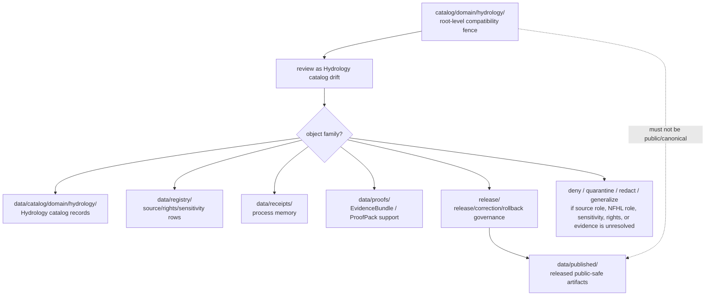

<!-- [KFM_META_BLOCK_V2]
doc_id: kfm://doc/catalog-domain-hydrology-readme
title: catalog/domain/hydrology/ — Hydrology Domain Catalog Compatibility Redirect
type: readme
version: v0.2
status: draft
owners: OWNER_TBD — Hydrology steward · Catalog steward · Data steward · Registry steward · Evidence steward · Receipt steward · Proof steward · Release steward · Policy steward · Schema steward · Docs steward · Sensitivity reviewer
created: 2026-06-16
updated: 2026-07-10
policy_label: public
related:
  - ../README.md
  - ../../README.md
  - ../../../data/README.md
  - ../../../data/catalog/README.md
  - ../../../data/catalog/domain/README.md
  - ../../../data/catalog/domain/hydrology/README.md
  - ../../../data/registry/README.md
  - ../../../data/registry/sources/hydrology/
  - ../../../data/receipts/README.md
  - ../../../data/proofs/README.md
  - ../../../data/published/README.md
  - ../../../release/README.md
  - ../../../contracts/domains/hydrology/README.md
  - ../../../docs/domains/hydrology/SOURCE_REGISTRY.md
  - ../../../docs/domains/hydrology/OBJECT_FAMILIES.md
  - ../../../docs/domains/hydrology/IDENTITY_MODEL.md
  - ../../../docs/domains/hydrology/API_CONTRACTS.md
  - ../../../docs/adr/ADR-0009-hydrology-is-the-first-proof-bearing-lane.md
  - ../../../schemas/contracts/v1/
  - ../../../contracts/
  - ../../../policy/
  - ../../../docs/adr/ADR-0011-receipts-vs-proofs-vs-manifests-vs-catalog-separation.md
  - ../../../docs/doctrine/directory-rules.md
tags: [kfm, catalog, domain, hydrology, water, watershed, huc, gauge, flow-observation, water-level, water-quality, nfhl, source-role-aware, evidence-bound, flood, aquifer, sensitivity, compatibility-root, redirect, data-catalog-domain, receipt-proof-catalog-publication-separation, non-authoritative, drift-fence, no-public-use]
notes:
  - "Refreshes the root-level catalog/domain/hydrology compatibility-redirect fence."
  - "Root-level catalog/domain/hydrology/ is compatibility and drift-control documentation only, not canonical Hydrology catalog authority, watershed authority, HUC authority, gauge authority, observation authority, NFHL authority, flood-warning authority, emergency authority, source authority, registry authority, receipt authority, proof authority, release authority, publication authority, schema authority, policy authority, producer authority, hosting authority, or UI authority."
  - "Canonical Hydrology domain catalog records belong under data/catalog/domain/hydrology/; source/rights/sensitivity rows belong under data/registry/; SourceDescriptor rows for Hydrology belong under data/registry/sources/hydrology/ when that lane is accepted and verified; receipts belong under data/receipts/; proof support belongs under data/proofs/; release-governance records belong under release/; published delivery artifacts belong under data/published/ after governed release."
  - "Hydrology records must preserve source-role separation: observed, regulatory, modeled, aggregate, administrative, candidate, and synthetic records are not interchangeable."
  - "NFHL/FEMA flood-hazard material is regulatory context only and must not be presented as observed flooding, forecast inundation, hydraulic-model output, or real-time flood status."
  - "KFM Hydrology is not an emergency flood-warning or life-safety instruction system. Emergency warning, evacuation, and life-safety action must redirect to official authorities."
  - "Sensitive Hydrology context, including water-system context, monitoring-station context, private-well or groundwater context, contamination context, water-supply context, facility or infrastructure-adjacent context, emergency-response context, private-land context, and living-person or property-inference context, must not be exposed through this compatibility path."
  - "ADR-0011 is proposed and is used here only as separation evidence, not accepted-rule proof."
  - "Do not add Hydrology catalog records, watershed/HUC indexes, gauge records, flow or water-level observations, NFHL records, STAC/DCAT/PROV records, source descriptors, registry rows, EvidenceBundles, receipts, release records, published artifacts, schemas, policy rules, generated outputs, or producer targets here without an ADR/migration note."
  - "Actual current contents beyond this README, historical producers, workflow writes, migration status, CI/review enforcement, public-client/producer exclusion, hosting readiness, Hydrology catalog schema maturity, STAC/DCAT/PROV closure, source-role enforcement, NFHL-role enforcement, sensitivity/redaction decisions, access-control maturity, and ADR disposition remain NEEDS VERIFICATION."
  - "v0.2 adds current evidence basis, Directory Rules placement basis, canonical data/catalog/domain/hydrology alignment, Hydrology source-role and NFHL guardrails, family-separation posture, minimum safe redirect slice, anti-bypass matrix, migration/rollback posture, and safe language rules without claiming migration or enforcement maturity."
[/KFM_META_BLOCK_V2] -->

<a id="top"></a>

<div align="center">

# Hydrology Domain Catalog Compatibility Redirect

`catalog/domain/hydrology/`

**Root-level compatibility and drift-control fence for legacy or accidental Hydrology-domain catalog placement. Canonical Hydrology catalog records belong under `data/catalog/domain/hydrology/`; related registry, receipt, proof, release, and published artifact families stay in their own owning roots.**


[Evidence](#0-evidence-basis-for-this-revision) · [Purpose](#1-purpose) · [Canonical homes](#2-canonical-homes) · [Boundary](#3-authority-boundary) · [Hydrology guardrails](#8-hydrology-source-role-nfhl-and-sensitivity-guardrails) · [Migration](#11-migration-posture) · [Definition of done](#18-definition-of-done)

</div>

---

> [!IMPORTANT]
> **Status:** draft / `NEEDS VERIFICATION`  
> **Path:** `catalog/domain/hydrology/README.md`  
> **Responsibility root:** compatibility redirect / drift fence only  
> **Canonical Hydrology catalog home:** `data/catalog/domain/hydrology/`  
> **Parent domain catalog home:** `data/catalog/domain/`  
> **Registry home:** `data/registry/`  
> **Hydrology source registry home:** `data/registry/sources/hydrology/` when accepted and verified  
> **Receipt home:** `data/receipts/`  
> **Proof home:** `data/proofs/`  
> **Release-governance home:** `release/`  
> **Published artifact home:** `data/published/`  
> **Directory Rules basis:** file location encodes ownership, governance, and lifecycle. Root-level `catalog/domain/hydrology/` is a compatibility redirect only and must not become a parallel Hydrology catalog, watershed, HUC, gauge, observation, NFHL, flood-warning, emergency-warning, source, registry, STAC, DCAT, PROV, receipt, proof, release, publication, schema, policy, pipeline, package, tool, search, hosting, or UI authority.  
> **Truth posture:** CONFIRMED current GitHub README path / CONFIRMED `data/catalog/domain/hydrology/README.md` exists and treats `data/catalog/domain/hydrology/` as the Hydrology CATALOG-stage sublane / CONFIRMED `contracts/domains/hydrology/README.md` exists and defines Hydrology as evidence-bound, source-role-aware, not emergency-warning, NFHL-regulatory-not-observed, release-gated, and rollback-aware / CONFIRMED `docs/domains/hydrology/SOURCE_REGISTRY.md` exists and defines source-role admission as fail-closed and fixed at admission / CONFIRMED `data/registry/README.md`, `data/receipts/README.md`, `data/proofs/README.md`, and `release/README.md` exist and preserve family separation / CONFIRMED Directory Rules document exists / PROPOSED root-level `catalog/domain/hydrology/` redirect contract / UNKNOWN actual files beyond README, historical producers, workflow writes, migration status, Hydrology catalog schema maturity, STAC/DCAT/PROV closure, CI/review guard, public-client/producer exclusion, source-role enforcement, NFHL-role enforcement, access-control maturity, hosting readiness, and ADR disposition

> [!CAUTION]
> Do not make `catalog/domain/hydrology/` a parallel Hydrology catalog authority or emergency-warning surface. Hydrology catalog records belong under `data/catalog/domain/hydrology/`; source/rights/sensitivity rows belong under `data/registry/`; receipts, proofs, release decisions, published artifacts, schemas, contracts, policies, source code, generated previews, and unpublished lifecycle data stay in their own owning roots. Emergency flood warnings, evacuation advice, and life-safety action must redirect to official authorities.

---

## Quick jump

- [0. Evidence basis for this revision](#0-evidence-basis-for-this-revision)
- [1. Purpose](#1-purpose)
- [2. Canonical homes](#2-canonical-homes)
- [3. Authority boundary](#3-authority-boundary)
- [4. Default posture](#4-default-posture)
- [5. Allowed contents](#5-allowed-contents)
- [6. Forbidden contents](#6-forbidden-contents)
- [7. Directory shape](#7-directory-shape)
- [8. Hydrology source-role, NFHL, and sensitivity guardrails](#8-hydrology-source-role-nfhl-and-sensitivity-guardrails)
- [9. Minimum safe redirect slice](#9-minimum-safe-redirect-slice)
- [10. Related Hydrology catalog lane posture](#10-related-hydrology-catalog-lane-posture)
- [11. Migration posture](#11-migration-posture)
- [12. Runtime and producer anti-bypass matrix](#12-runtime-and-producer-anti-bypass-matrix)
- [13. Diagram](#13-diagram)
- [14. Inspection path](#14-inspection-path)
- [15. Validation expectations](#15-validation-expectations)
- [16. Safe change pattern](#16-safe-change-pattern)
- [17. Rollback and correction posture](#17-rollback-and-correction-posture)
- [18. Definition of done](#18-definition-of-done)
- [19. Open verification items](#19-open-verification-items)
- [20. Safe language rules](#20-safe-language-rules)

---

## 0. Evidence basis for this revision

This README is a documentation boundary, not migration proof, catalog-schema proof, access-control proof, source-role-enforcement proof, NFHL-role-enforcement proof, sensitivity-review proof, redaction proof, STAC/DCAT/PROV closure proof, release approval proof, publication-hosting proof, emergency-management integration proof, or CI enforcement proof. The 2026-07-10 revision updates an existing compatibility README and keeps maturity bounded while aligning root-level `catalog/domain/hydrology/` with the canonical `data/catalog/domain/hydrology/` Hydrology catalog lane, the separate `data/registry/` registry root, the separate `data/receipts/` process-memory root, the separate `data/proofs/` proof-support root, the `release/` release-governance root, and Directory Rules placement posture.

| Evidence item | Status | What it supports | What it does not prove |
|---|---|---|---|
| `catalog/domain/hydrology/README.md` exists on `main`. | CONFIRMED | This is an existing README update, not a new path proposal. | It does not prove actual contents beyond the README, historical producers, migration status, CI enforcement, public-client exclusion, hosting readiness, sensitivity decisions, or ADR disposition. |
| `catalog/domain/README.md` exists and treats root-level `catalog/domain/` as a compatibility redirect, not canonical domain catalog authority. | CONFIRMED parent redirect posture | The Hydrology child path should inherit compatibility-fence behavior. | It does not prove all root-level domain catalog drift has been removed. |
| `data/catalog/domain/hydrology/README.md` exists and treats `data/catalog/domain/hydrology/` as the Hydrology-domain catalog lane. | CONFIRMED canonical Hydrology catalog lane posture | Hydrology catalog records belong under `data/catalog/domain/hydrology/`. | It does not prove concrete catalog records, schemas, validators, policy gates, receipts, release manifests, access controls, or route behavior. |
| `contracts/domains/hydrology/README.md` exists and defines Hydrology contract boundaries, object families, NFHL regulatory-only posture, source-role separation, no emergency-warning posture, and responsibility-root separation. | CONFIRMED contract-lane posture | Root-level catalog drift must not collapse semantic contracts, catalog data, source registry rows, emergency guidance, or release authority. | It does not prove catalog payloads, schemas, policy enforcement, route behavior, or release state. |
| `docs/domains/hydrology/SOURCE_REGISTRY.md` exists and treats source registry as admission/authority control with source role fixed at admission and fail-closed rights/role gaps. | CONFIRMED source-registry doctrine posture | Hydrology source/rights/sensitivity records belong under registry governance, not this compatibility path. | It does not prove descriptor instances, exact endpoints, current terms, activation decisions, or validator behavior. |
| `data/registry/README.md` exists and treats registry rows as source/rights/sensitivity-aware governance records. | CONFIRMED registry-root posture | Source descriptors, rights rows, sensitivity rows, dataset rows, and related registry records belong under `data/registry/`. | It does not prove final taxonomy, row inventories, validators, or release integration. |
| `data/receipts/README.md` exists and marks receipts as process memory. | CONFIRMED receipt-root posture | Catalog-build, validation, migration, AI, redaction/generalization, correction, and release-support receipts belong under `data/receipts/`. | It does not prove emitted receipt inventories, signing, validators, release integration, or CI enforcement. |
| `data/proofs/README.md` exists and treats proof artifacts as support objects, not public truth by placement. | CONFIRMED proof-root posture | EvidenceBundle and ProofPack support belongs under `data/proofs/`, not this redirect path. | It does not prove emitted proof inventories, schemas, validators, fixtures, CI workflows, or release-gate enforcement. |
| `release/README.md` exists and treats `release/` as release-governance root. | CONFIRMED release-root posture | Release decisions, correction, rollback, withdrawal, supersession, and signatures belong under `release/`. | It does not prove release workflow maturity or active release approval. |
| `docs/adr/ADR-0011-receipts-vs-proofs-vs-manifests-vs-catalog-separation.md` exists and states the proposed separation rule `receipt ≠ proof ≠ catalog ≠ publication`. | CONFIRMED ADR document presence; PROPOSED decision status | Supports family-separation language while keeping ADR acceptance bounded. | It does not prove ADR acceptance or validator enforcement. |
| `docs/doctrine/directory-rules.md` exists and states that file location encodes ownership, governance, and lifecycle. | CONFIRMED placement doctrine | Root-level `catalog/domain/hydrology/` must remain a compatibility fence; catalog, registry, receipt, proof, release, and published records belong under their owning roots. | It does not prove live repo drift has been fully audited. |

[Back to top](#top)

---

## 1. Purpose

`catalog/domain/hydrology/` is a **root-level compatibility redirect** for Hydrology-domain catalog path drift.

It exists only to prevent accidental, legacy, generated, copied, or externally imported Hydrology catalog-family material from becoming a parallel authority outside KFM's governed lifecycle, registry, proof, receipt, release, and publication roots.

This folder should not be used for canonical:

- Hydrology domain catalog records, watershed indexes, HUC indexes, hydro-feature indexes, reach indexes, gauge catalogs, flow-observation catalogs, water-level catalogs, water-quality catalogs, groundwater catalogs, aquifer catalogs, NFHL catalogs, flood-context catalogs, hydrograph catalogs, upstream-trace catalogs, cross-domain link catalogs, or catalog manifests;
- observed, regulatory, modeled, aggregate, administrative, candidate, or synthetic hydrology records;
- emergency flood warnings, evacuation guidance, current alert replacement, life-safety instruction, public-safety records, or unofficial operational status;
- STAC, DCAT, PROV, CatalogMatrix, layer catalog, source catalog, catalog index, catalog manifest, or discovery records;
- raw observations, corrected observations, gauge outputs, well/source payloads, monitoring records, interpreted maps, model outputs, QA outputs, generated public previews, or published map/download/API payloads;
- process receipts, catalog-build receipts, validation receipts, migration receipts, rollback receipts, redaction/generalization receipts, release dry-run receipts, AI receipts, or telemetry receipts;
- EvidenceBundles, ProofPacks, citation-validation bundles, release-readiness proof, catalog-closure proof, rollback proof, correction proof, or claim-support records;
- release decisions, release manifests, rollback cards, correction notices, withdrawal/supersession records, signatures, or changelog material;
- schemas, contracts, policy rules, policy decisions, source code, pipeline outputs, generated previews, public artifacts, tiles, PMTiles, or hosted payloads.

This README does not prove that any Hydrology catalog material currently exists here, that a migration has been completed, that producers avoid this path, that public clients exclude this path, that CI blocks writes to this path, or that an ADR has accepted this root-level path as durable.

[Back to top](#top)

---

## 2. Canonical homes

Canonical Hydrology domain catalog material belongs under the governed data catalog domain lane:

```text
data/catalog/domain/hydrology/
```

Parent domain catalog indexes belong under:

```text
data/catalog/domain/
```

Source, rights, sensitivity, dataset, layer, and source-admission rows belong under the registry family:

```text
data/registry/
data/registry/sources/hydrology/   # when accepted and verified
```

Receipts belong under:

```text
data/receipts/
```

Proof support belongs under:

```text
data/proofs/
```

Release-governance material belongs under:

```text
release/
```

Released public-safe delivery artifacts belong under:

```text
data/published/
```

The root-level `catalog/domain/hydrology/` directory is a redirect/fence only.

```text
catalog/domain/hydrology/          # compatibility redirect only; do not add catalog-family records here
data/catalog/domain/hydrology/     # Hydrology CATALOG-stage domain records
data/catalog/domain/               # domain catalog index
data/registry/                     # source / dataset / rights / sensitivity rows
data/registry/sources/hydrology/   # Hydrology SourceDescriptor lane when accepted and verified
data/receipts/                     # process-memory records
data/proofs/                       # proof-support records
release/                           # release / correction / rollback governance
data/published/                    # released public-safe delivery artifacts
```

If a future ADR or migration changes Hydrology catalog placement, this README should be updated to cite the accepted target, producer-configuration evidence, validation evidence, source-role/NFHL/sensitivity/release review evidence, and any migration, correction, or rollback records.

## 3. Authority boundary

`catalog/domain/hydrology/` has **no canonical Hydrology catalog authority**, **no watershed authority**, **no HUC authority**, **no gauge authority**, **no observation authority**, **no NFHL authority**, **no flood-warning authority**, **no emergency authority**, **no source authority**, **no registry authority**, **no receipt authority**, **no proof authority**, **no release authority**, and **no publication authority**. It may hold only redirect guidance, migration notes, drift logs, or temporary markers while misplaced material is reviewed and moved into its proper owning root.

```text
WRONG / LEGACY ROOT                HYDROLOGY CATALOG HOME             SUPPORT AND RELEASE HOMES
catalog/domain/hydrology/     -->  data/catalog/domain/hydrology/ --> data/registry/
compatibility fence only           catalog records / indexes          data/receipts/
not authoritative                  source-role-preserved records      data/proofs/
                                   not emergency-warning authority    release/
                                                                      data/published/
```

A Hydrology catalog record outside `data/catalog/domain/hydrology/` should be treated as Hydrology catalog-family drift. A source or rights row outside `data/registry/`, a receipt outside `data/receipts/`, a proof outside `data/proofs/`, a release record outside `release/`, or a public artifact outside `data/published/` should be treated as family drift until reviewed and migrated.

## 4. Default posture

Anything found under root-level `catalog/domain/hydrology/` should be treated as **NEEDS VERIFICATION** and potentially misplaced.

Do not expose, publish, index, cite, search, cache, export, tile, host, or depend on root-level Hydrology catalog files as canonical Hydrology, watershed, HUC, gauge, observation, NFHL, emergency-warning, source, proof, release, registry, or published artifact records. First confirm object family, source, source role, provenance, rights, sensitivity, geometry posture, temporal basis, units, qualifier flags, evidence resolution, schema validity, policy decision, lifecycle state, receipt support, proof support, catalog closure, release state, digest/sidecar integrity, rollback path, correction path, and whether the object is actually a catalog record, observation record, regulatory record, public-safety record, registry row, receipt, proof, release-governance record, published artifact, or unpublished candidate.

## 5. Allowed contents

| Allowed item | Example | Required posture |
|---|---|---|
| README / redirect docs | `README.md` | Compatibility fence only |
| Migration note | `MIGRATION.md` | Temporary and ADR/review-linked |
| Drift note | `DRIFT.md`, `OPEN-QUESTIONS.md` | Must point to canonical homes and review steps |
| Placeholder marker | `.gitkeep` | Does not authorize catalog, watershed, HUC, gauge, observation, NFHL, source, proof, receipt, release, policy, schema, or public-output content |

## 6. Forbidden contents

| Forbidden here | Correct home |
|---|---|
| Hydrology domain catalog records, indexes, watershed catalogs, HUC catalogs, hydro-feature catalogs, reach catalogs, gauge catalogs, observation catalogs, groundwater catalogs, NFHL catalogs, flood-context catalogs, hydrograph catalogs, upstream-trace catalogs | `data/catalog/domain/hydrology/` |
| Observed, regulatory, modeled, aggregate, administrative, candidate, or synthetic Hydrology records | Correct governed lifecycle/catalog/proof/release homes; never this compatibility path |
| NFHL records presented as observed flooding, forecast inundation, hydraulic-model output, or real-time flood status | Hold, quarantine, deny, or correct; NFHL is regulatory context only |
| Emergency flood warnings, evacuation advice, life-safety instructions, current emergency status, or alert replacement | Official issuing authorities and their public channels; never this compatibility path |
| Sensitive hydrology, water-system, monitoring-station, private-well, groundwater, contamination, water-supply, emergency-response, infrastructure-adjacent, private-land, property-inference, or living-person-impact details | Governed lifecycle, proof, policy, or protected-review homes with policy/redaction gates; never this compatibility path |
| Raw gauge feeds, water-quality payloads, well payloads, flood evidence payloads, terrain/model output, warning-feed payloads, processed datasets, generated previews | Correct lifecycle lane under `data/`, not this root-level compatibility path |
| STAC, DCAT, PROV, CatalogMatrix, catalog manifests, discovery records | `data/catalog/` or accepted child lanes under it |
| Source descriptors, source registry rows, dataset rows, rights rows, sensitivity rows, Hydrology/source crosswalk rows | `data/registry/` or governed registry homes |
| Receipts, catalog-build receipts, validation receipts, source-admission receipts, redaction/generalization receipts, AI receipts, release dry-run receipts, rollback receipts, migration receipts | `data/receipts/` |
| EvidenceBundles, ProofPacks, attestations, citation-validation bundles, release-readiness proof, rollback proof, correction proof, claim-support records | `data/proofs/` |
| ReleaseManifest, PromotionDecision, release decision, RollbackCard, CorrectionNotice, withdrawal, supersession, signature, release-state record | `release/` |
| Released artifacts, public-safe Hydrology layers, reports, stories, downloads, API payload snapshots, public indexes, allowlists, caveat summaries, digest sidecars, tiles, PMTiles | `data/published/` after governed release |
| Schemas and machine-shape contracts | `schemas/contracts/v1/` |
| Human contracts and object-meaning docs | `contracts/` |
| Policy rules and policy decisions | `policy/` and governed policy-decision homes |
| Source code, scripts, packages, pipelines, build tools, producers, preview generators | `apps/`, `packages/`, `tools/`, `scripts/`, `pipelines/` |
| RAW, WORK, QUARANTINE, PROCESSED, CATALOG, TRIPLET, unpublished candidate, or restricted lifecycle data | `data/` lifecycle subtrees |

## 7. Directory shape

Current implementation inventory remains `NEEDS VERIFICATION`.

```text
catalog/domain/hydrology/
├── README.md                 # compatibility redirect / drift fence
├── MIGRATION.md              # PROPOSED only if migration is active
└── DRIFT.md                  # PROPOSED only if misplaced Hydrology catalog material is found
```

> [!WARNING]
> Do not treat this suggested shape as complete repo inventory. Verify actual contents before making inventory, producer, enforcement, catalog-schema, source-role enforcement, NFHL-role enforcement, sensitivity-review, access-control, hosting, or migration claims.

## 8. Hydrology source-role, NFHL, and sensitivity guardrails

Hydrology catalog drift is especially risky because observed readings, regulatory flood layers, modeled hydrographs, aggregate rollups, administrative water records, candidate watcher outputs, synthetic reconstructions, and public derivatives can look similar in an index. Any material found here must preserve source role, temporal basis, geometry scope, sensitivity class, and public-safe representation before it is migrated or used.

| Guardrail | Required posture |
|---|---|
| Source role is fixed at admission | Observed, regulatory, modeled, aggregate, administrative, candidate, and synthetic records must remain distinct. |
| Catalog carrier is not claim truth | A catalog entry supports discovery and closure; it does not make a Hydrology claim true or public by placement. |
| NFHL is regulatory context only | FEMA NFHL / MSC material must not be presented as observed flooding, forecast inundation, hydraulic-model output, or real-time flood status. |
| Observation, model, and regulation do not upgrade each other | Gauge observations do not become regulatory determinations; modeled hydrographs do not become observations; HUC rollups do not become per-place truth. |
| Emergency guidance is out of scope | Hydrology catalog records do not provide emergency flood warnings, evacuation advice, or life-safety guidance. |
| Temporal basis must stay visible | Observation time, valid time, retrieval time, release time, correction time, and stale state should not collapse into a single generic date. |
| Units and qualifiers matter | Flow, stage, water quality, datum, qualifier, censoring, uncertainty, and source flags must be preserved or the claim should abstain/deny. |
| Sensitive Hydrology context fails closed when unclear | Hold, redact, generalize, aggregate, delay, quarantine, or deny public exposure when sensitivity, rights, or review state is unresolved. |
| Water-system and private context require review | Water-supply, private well, groundwater, contamination, infrastructure-adjacent, emergency-response, private-land, and living-person/property-inference context may require staged access, aggregation, or denial. |
| Owning-lane truth must remain visible | Hazards owns hazard-event and warning context; Soil, Agriculture, Geology, Infrastructure, Habitat, Fauna, Flora, People/Land, and Spatial Foundation keep their own authority. |
| Watchers are not publishers | Watcher/source-head outputs may propose candidates; they must not publish or write durable catalog/release/public artifacts here. |
| Public exposure is release-gated | A catalog record is not public merely because it exists under a catalog lane. |

## 9. Minimum safe redirect slice

A smallest safe `catalog/domain/hydrology/` state should prove only that the folder prevents drift; it should not contain trust-bearing catalog, source, observation, NFHL, release, sensitive, or public-delivery material.

| Slice item | Minimum requirement | Why it matters |
|---|---|---|
| Redirect README | Points to `data/catalog/domain/hydrology/` for Hydrology catalog records | Prevents parallel Hydrology catalog authority |
| Source-role boundary | States observed, regulatory, modeled, aggregate, administrative, candidate, and synthetic records are distinct | Prevents role-collapse claims |
| NFHL boundary | States NFHL is regulatory context only, not observed flood truth or real-time status | Prevents unsafe flood-context collapse |
| Emergency-warning boundary | States KFM Hydrology is not an emergency warning or life-safety instruction surface | Prevents dangerous public-use confusion |
| No catalog records | No watershed catalog, HUC catalog, gauge catalog, observation catalog, NFHL catalog, hydrograph catalog, upstream-trace catalog, or catalog manifest | Preserves catalog lifecycle root |
| No source/registry records | No SourceDescriptor, rights row, sensitivity row, dataset row, source registry row, or source/hydrology crosswalk row | Preserves registry root |
| No source payloads | No raw gauge feed, well payload, water-quality payload, model output, processed dataset, PMTiles, or generated preview | Preserves lifecycle and pipeline boundaries |
| No receipt records | No CatalogBuildReceipt, RunReceipt, ValidationReceipt, SourceAdmissionReceipt, AIReceipt, migration receipt, release dry-run receipt, rollback receipt, or redaction/generalization receipt | Preserves receipt/process-memory root |
| No proof records | No EvidenceBundle, ProofPack, release attestation, citation validation, rollback proof, correction proof, or claim-support files | Preserves proof-support root |
| No release/public artifacts | No ReleaseManifest, release decision, RollbackCard, published Hydrology layer, public index, PMTiles, report, story, API snapshot, or digest | Preserves release and published roots |
| No sensitive exposure | No private-well, water-supply, contamination, facility, emergency-response, infrastructure-adjacent, private-land, property-inference, or living-person-impact detail | Prevents exposure and policy bypass |
| Drift procedure | Explains how to inspect and migrate misplaced records | Keeps remediation reversible |
| Producer guard | Producers, generators, scripts, and CI should not write durable Hydrology catalog material here | Prevents reintroducing drift |
| Public-use guard | Public clients, search services, map runtimes, exports, static hosting, and indexes must not read from this path as canonical | Preserves governed access path |
| Verification backlog | Open items stay visible | Prevents documentation from pretending migration/enforcement is complete |

## 10. Related Hydrology catalog lane posture

| Lane | Status | Boundary |
|---|---|---|
| `catalog/domain/hydrology/` | Compatibility redirect path | Root-level drift fence only; not canonical. |
| `data/catalog/domain/hydrology/` | CONFIRMED README path / draft catalog lane | Canonical Hydrology catalog placement for domain catalog records; still implementation-bounded. |
| `data/catalog/stac/hydrology/` | PROPOSED in canonical Hydrology catalog README | Spatiotemporal catalog lane when accepted and verified. |
| `data/catalog/dcat/hydrology/` | PROPOSED in canonical Hydrology catalog README | Dataset/distribution catalog lane when accepted and verified. |
| `data/catalog/prov/hydrology/` | PROPOSED in canonical Hydrology catalog README | Provenance catalog lane when accepted and verified. |
| `data/registry/sources/hydrology/` | CONFIRMED pattern in docs / NEEDS VERIFICATION for final leaf maturity | Hydrology source descriptors, rights, roles, cadence, and activation posture when accepted and verified. |

Do not claim payload inventory, source descriptors, rights clearance, sensitivity decisions, source-role enforcement, NFHL-role enforcement, access-control enforcement, schema validity, release state, route behavior, map behavior, emergency-management behavior, or hosting readiness from README presence alone.

## 11. Migration posture

If Hydrology catalog-family files are found here:

1. Do not publish, cite, index, search, cache, export, tile, host, or depend on them.
2. Identify whether they are Hydrology catalog records, STAC/DCAT/PROV records, CatalogMatrix records, watershed records, HUC records, hydro-feature records, reach records, gauge records, flow observations, water-level observations, water-quality observations, groundwater records, aquifer records, NFHL records, observed-flood evidence, hydrographs, upstream traces, source descriptors, registry rows, receipts, proof support, release records, published-output material, schemas, policy records, unpublished lifecycle material, generated previews, temporary build artifacts, or producer outputs.
3. Determine whether the file is historical drift, generated drift, copied output, unreviewed local work, or an intentional migration marker.
4. Check source role, temporal basis, units, qualifiers, evidence, sensitivity, rights, water-system context, monitoring-station context, private-well/groundwater context, contamination context, infrastructure-adjacent risk, emergency-response context, living-person/property-inference posture, and public-safe geometry posture before moving or exposing anything.
5. Move Hydrology domain catalog records into `data/catalog/domain/hydrology/` or an accepted child lane under it.
6. Move STAC/DCAT/PROV Hydrology records into accepted catalog-family lanes under `data/catalog/` when those lanes are verified.
7. Move source, dataset, rights, sensitivity, source crosswalk, and layer rows into `data/registry/` or accepted registry child lanes.
8. Move receipts into `data/receipts/`.
9. Move proof support into `data/proofs/`.
10. Move release-governance records into `release/`.
11. Move or regenerate released public-safe Hydrology artifacts into `data/published/` only after governed release approval and required sidecar/digest/citation/caveat support.
12. Move schemas, contracts, policy rules, code, and producer outputs into their owning roots.
13. Preserve provenance, source refs, source role, object-family identity, watershed/HUC identity, reach identity, gauge identity, observation identity, units, datum, qualifier flags, observation/valid/retrieval/release/correction time, NFHL regulatory-source identity, sensitivity class, derivative lineage, digests, redaction/generalization receipts, catalog-build receipts, proof refs, catalog refs, review notes, producer identity, release refs, correction refs, and rollback path.
14. Add a drift register, migration note, or correction note if the misplaced material was previously consumed.
15. Add or update validation checks so producers do not recreate root-level Hydrology catalog drift.
16. Leave `catalog/domain/hydrology/` as a redirect/fence unless an accepted ADR explicitly changes the authority model.

## 12. Runtime and producer anti-bypass matrix

| Bypass risk | Required behavior | Review signal |
|---|---|---|
| Producer writes Hydrology catalog records to `catalog/domain/hydrology/` | Fail review/CI; write to `data/catalog/domain/hydrology/` instead | Producer config and output paths checked |
| Producer writes source descriptors or rights rows here | Fail review/CI; write to `data/registry/` instead | Registry path check passes |
| Producer writes receipts here | Fail review/CI; write to `data/receipts/` instead | Receipt path check passes |
| Producer writes proofs here | Fail review/CI; write to `data/proofs/` instead | Proof path check passes |
| Producer writes release records here | Fail review/CI; write to `release/` instead | Release path check passes |
| Producer writes public Hydrology exports here | Fail review/CI; write to `data/published/` only after release | Published path and release-state checks pass |
| Public client reads root-level Hydrology catalog path | Deny; route through governed API/release/public-safe path | Client/search/index/hosting config excludes this path |
| Root-level Hydrology file is treated as canonical observation truth | Mark as drift; resolve evidence/proof/catalog/release support before use | Migration note references canonical target |
| NFHL is treated as observed flood or real-time flood status | Mark as drift or DENY; keep NFHL regulatory-only | Review confirms regulatory-only boundary |
| Modeled hydrograph or aggregate HUC rollup is treated as observation/per-place truth | Mark as drift; preserve role and scope | Source-role and scope checks pass |
| Sensitive Hydrology context appears here | Deny, quarantine, remove, redact, generalize, aggregate, or route to steward review | Sensitivity/publication review passes |
| Root-level file is used in Evidence Drawer, Focus Mode, map runtime, export, static hosting, or search index | Reject; use governed catalog/proof/release/published surfaces | Trust membrane and release checks pass |

## 13. Diagram



## 14. Inspection path

When reviewing this directory:

1. Inspect actual files under `catalog/domain/hydrology/`.
2. Confirm every non-README item is a migration note, drift note, or temporary marker.
3. For any trust-bearing file, identify the correct owning root before moving it.
4. Check `data/catalog/domain/hydrology/` for canonical catalog placement.
5. Check `data/registry/` and `data/registry/sources/hydrology/` for source/rights/sensitivity rows before using any source-bearing material.
6. Check `data/receipts/`, `data/proofs/`, `release/`, and `data/published/` for family-specific support.
7. If a file has already been consumed, write or update a drift/migration/correction note with rollback target.
8. Keep public clients, search indexes, exports, static hosting, and map runtimes away from this root-level path.

## 15. Validation expectations

Useful validation for this folder should cover:

- no Hydrology catalog records, watershed indexes, HUC indexes, gauge catalogs, flow/water-level/water-quality observations, NFHL records, flood-context records, hydrograph records, upstream traces, source descriptors, STAC/DCAT/PROV records, or catalog manifests are stored here;
- no emergency flood warning, evacuation advice, life-safety instruction, or current alert replacement material is stored here;
- no sensitivity-relevant hydrology, water-system, monitoring-station, private-well, groundwater, contamination, facility, infrastructure, emergency-response, private-land, property-inference, or living-person-impact details are stored here;
- no receipts, proofs, release records, registry records, policy rules, schemas, source code, generated previews, public indexes, tiles, PMTiles, or published artifacts are stored here;
- any non-README content is tied to an active migration or drift note;
- CI or review checks flag root-level `catalog/domain/hydrology/` writes;
- links point users to `data/catalog/domain/hydrology/`, `data/registry/`, `data/receipts/`, `data/proofs/`, `release/`, and `data/published/`;
- README language avoids claiming implementation maturity not verified by code, validators, manifests, receipts, logs, dashboards, or release records.

## 16. Safe change pattern

For changes under `catalog/domain/hydrology/`:

1. Confirm the change is redirect documentation, migration support, or drift documentation only.
2. Confirm it does not create a parallel Hydrology domain catalog authority.
3. Confirm it does not create emergency flood-warning, evacuation, or life-safety instruction behavior.
4. Confirm no sensitivity-relevant Hydrology, water-system, facility, private-well, groundwater, contamination, infrastructure, emergency-response, property-inference, or living-person-impact detail is added.
5. Confirm durable Hydrology catalog records are placed under `data/catalog/domain/hydrology/`.
6. Confirm SourceDescriptor, rights, sensitivity, dataset, and layer rows are placed under `data/registry/` or accepted registry child lanes.
7. Confirm receipts/proofs/release records are placed under their owning roots.
8. Confirm released public-safe artifacts go to `data/published/` only after release approval.
9. Document migration and rollback if any misplaced material was moved.
10. Update docs and validation rules when behavior materially changes.

## 17. Rollback and correction posture

Rollback is required if this directory becomes any of the following:

- Hydrology raw-data root;
- work or quarantine area;
- processed-data store;
- canonical catalog record store;
- source-registry root;
- proof store;
- receipt store;
- release-decision root;
- published-output root;
- schema root;
- policy root;
- validator root;
- implementation root;
- emergency-warning surface;
- life-safety instruction source;
- public exposure shortcut;
- search/index/export/static-hosting source;
- AI context source without resolved EvidenceBundle/release posture.

Correction posture:

- If root-level Hydrology material was consumed as canonical, mark the consumption as drift.
- Identify affected public or internal artifacts.
- Rebuild from canonical owning roots.
- Preserve old/new digests, evidence refs, receipts, release refs, and rollback refs.
- Add or update correction notices when public or semi-public material was affected.

## 18. Definition of done

- [ ] Owners are confirmed and `OWNER_TBD` is replaced.
- [ ] Actual root-level `catalog/domain/hydrology/` contents are verified.
- [ ] Any misplaced Hydrology catalog material is migrated or documented as drift.
- [ ] Canonical Hydrology catalog placement under `data/catalog/domain/hydrology/` is accepted and documented.
- [ ] Hydrology source registry placement under `data/registry/sources/hydrology/` is reconciled with registry topology.
- [ ] No trust-bearing records live here.
- [ ] No Hydrology catalog records, NFHL records, observation records, emergency-warning records, sensitivity-relevant Hydrology detail, STAC/DCAT/PROV records, registry records, receipts, proofs, release records, published artifacts, schemas, contracts, policy rules, source code, generated previews, or lifecycle data live here.
- [ ] CI/review behavior is verified or marked `NEEDS VERIFICATION`.
- [ ] Public clients, search services, map runtimes, exports, static hosting, and AI surfaces are verified not to read this path as canonical.
- [ ] Any migration has a rollback target and, where needed, a correction path.

## 19. Open verification items

| Item | Why it matters |
|---|---|
| Confirm actual files under root-level `catalog/domain/hydrology/` | Prevents overclaiming or missing drift |
| Confirm whether any workflow writes here | Required before producer claims |
| Confirm accepted canonical Hydrology catalog placement | Required before final migration claims |
| Confirm source registry topology for `data/registry/sources/hydrology/` | Required before final source-lane claims |
| Confirm source-role enforcement | Required before safe use of observed/regulatory/modeled/aggregate/administrative/candidate/synthetic material |
| Confirm NFHL regulatory-only validation | Required before flood-context public release |
| Confirm sensitivity/redaction handling | Required before safe-publication claims |
| Confirm migration status to `data/catalog/domain/hydrology/` | Required before canonical-home claims beyond doctrine |
| Confirm CI/review guard exists | Required before enforcement claims |
| Confirm no trust records are stored here | Required before Directory Rules compliance claims |
| Confirm public-client and producer exclusion | Required before trust-membrane compliance claims |
| Confirm ADR status for root-level `catalog/domain/hydrology/` | Required before long-term retention claims |

## 20. Safe language rules

Use precise language:

- Say **compatibility redirect** or **drift fence**, not Hydrology catalog root.
- Say **canonical Hydrology catalog records belong under `data/catalog/domain/hydrology/`**, not here.
- Say **source role is fixed at admission**, not promoted by lifecycle movement.
- Say **NFHL is regulatory context only**, not observed flood, forecast inundation, hydraulic model, or real-time status.
- Say **KFM Hydrology is not an emergency flood-warning or life-safety instruction system**.
- Say **release-gated public-safe artifact**, not public by path.
- Say **NEEDS VERIFICATION** for producer behavior, CI enforcement, payload inventory, access controls, schema maturity, source-role enforcement, NFHL enforcement, release state, and hosting readiness unless those are verified from current implementation evidence.
- Say **ADR-0011 is proposed** unless acceptance is separately verified.

Do not say:

- `catalog/domain/hydrology/` is the Hydrology catalog home.
- A file here is canonical because it is under `catalog/`.
- A catalog record proves a Hydrology claim true.
- NFHL proves observed flooding or current flood status.
- A modeled hydrograph is an observation.
- A gauge observation is a regulatory determination.
- Hydrology catalog records provide emergency warning, evacuation, or life-safety guidance.
- Public clients may read this path directly.
- CI or producer exclusion exists unless verified.

<details>
<summary>Appendix A — no-loss preservation note</summary>

The previous v0.1 README already framed `catalog/domain/hydrology/` as a compatibility/redirect fence. This v0.2 update preserves that boundary while adding current evidence basis, canonical `data/catalog/domain/hydrology/` alignment, registry/receipt/proof/release/publication separation, Hydrology source-role and NFHL guardrails, minimum safe redirect slice, producer anti-bypass posture, migration and rollback expectations, and safe language rules. It does not claim migration work, CI enforcement, producer workflows, payload inventory, source-role enforcement, NFHL enforcement, sensitivity decisions, access-control maturity, public-client exclusion, hosting readiness, or ADR disposition are implemented.

</details>

## Status summary

`catalog/domain/hydrology/` is a root-level compatibility redirect and Hydrology-domain drift fence. It is not the canonical Hydrology domain catalog home.

Hydrology catalog authority belongs under `data/catalog/domain/hydrology/`; source, rights, and sensitivity governance belongs under `data/registry/`; trust-bearing support belongs under `data/receipts/`, `data/proofs/`, and `release/`; released public-safe products belong under `data/published/`.

<p align="right"><a href="#top">Back to top</a></p>
