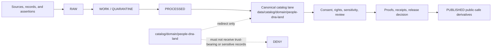

<!-- [KFM_META_BLOCK_V2]
doc_id: kfm://doc/catalog-domain-people-dna-land-readme
title: catalog/domain/people-dna-land/ - People DNA Land Domain Catalog Compatibility Redirect
type: readme
version: v0.2
status: draft
owners: OWNER_TBD - People/DNA/Land steward; Consent steward; Catalog steward; Registry steward; Evidence steward; Receipt steward; Proof steward; Release steward; Policy steward; Docs steward
created: 2026-07-10
updated: 2026-07-10
policy_label: public
related:
  - ../README.md
  - ../../README.md
  - ../../../data/README.md
  - ../../../data/catalog/README.md
  - ../../../data/catalog/domain/README.md
  - ../../../data/catalog/domain/people-dna-land/README.md
  - ../../../data/registry/README.md
  - ../../../data/registry/people-dna-land/README.md
  - ../../../data/receipts/README.md
  - ../../../data/proofs/README.md
  - ../../../data/proofs/people-dna-land/README.md
  - ../../../data/published/README.md
  - ../../../data/published/people-dna-land/README.md
  - ../../../release/README.md
  - ../../../policy/consent/people-dna-land/README.md
  - ../../../docs/domains/people-dna-land/README.md
  - ../../../docs/doctrine/directory-rules.md
tags: [kfm, catalog, domain, people-dna-land, consent, privacy, dna, genealogy, land, compatibility-root, redirect, data-catalog-domain, non-authoritative, drift-fence]
notes:
  - Root-level catalog/domain/people-dna-land/ is a compatibility redirect and drift-control fence only.
  - Canonical People DNA Land catalog records belong under data/catalog/domain/people-dna-land/.
  - This file does not prove migration completeness, validator coverage, consent validity, revocation enforcement, source-rights closure, receipt/proof closure, release approval, publication readiness, or CI enforcement.
  - v0.2 adds the required README impact block, quick navigation, explicit repo-fit links, lifecycle flow, consent and sensitivity guardrails, and maintainer checks without changing directory authority.
[/KFM_META_BLOCK_V2] -->

<a id="top"></a>

# People DNA Land Domain Catalog Compatibility Redirect

`catalog/domain/people-dna-land/` keeps the legacy root-level catalog path visibly redirected to the governed People DNA Land catalog lane without creating a second authority.


> [!IMPORTANT]
> **Status:** active compatibility redirect; document status remains `draft` pending owner confirmation.  
> **Owners:** `OWNER_TBD` — People/DNA/Land, Consent, Catalog, Registry, Evidence, Receipt, Proof, Release, Policy, and Docs stewards.  
> **Canonical catalog home:** [`data/catalog/domain/people-dna-land/`](../../../data/catalog/domain/people-dna-land/)  
> **Truth posture:** this path carries navigation and drift-control documentation only; it is not a trust-bearing catalog, consent, identity, title, evidence, or publication surface.

**Quick links:** [Scope](#scope) · [Repo fit](#repo-fit) · [Accepted inputs](#accepted-inputs) · [Exclusions](#exclusions) · [Lifecycle boundary](#lifecycle-boundary) · [Domain guardrails](#domain-guardrails) · [Change rules](#change-rules) · [Verification](#verification-checklist)

---

## Scope

This directory exists only to keep the legacy root-level `catalog/domain/` tree aligned with repository-supported domain catalog lanes. It is not the canonical People DNA Land catalog home, not a source or consent registry, not an identity graph, not a receipt or proof store, not a release or publication surface, and not a producer output target.

The durable rule is simple:

> Root-level `catalog/` may point to governed catalog authority; it must not become governed catalog authority.

## Repo fit

| Relationship | Path | Responsibility |
|---|---|---|
| Parent compatibility index | [`catalog/domain/`](../) | Defines redirect and drift-fence posture for legacy domain catalog paths. |
| Catalog compatibility root | [`catalog/`](../../) | Legacy compatibility surface; not the canonical catalog store. |
| Canonical domain catalog index | [`data/catalog/domain/`](../../../data/catalog/domain/) | Owns canonical domain catalog lanes. |
| Canonical People DNA Land lane | [`data/catalog/domain/people-dna-land/`](../../../data/catalog/domain/people-dna-land/) | Owns People DNA Land catalog records and catalog-facing indexes. |
| Domain registry lane | [`data/registry/people-dna-land/`](../../../data/registry/people-dna-land/) | Owns domain source identity, role, rights, sensitivity, consent dependencies, and activation posture. |
| Consent policy | [`policy/consent/people-dna-land/`](../../../policy/consent/people-dna-land/) | Owns consent and revocation decision rules; presence of a record here never substitutes for policy evaluation. |
| Receipts | [`data/receipts/`](../../../data/receipts/) | Owns process, policy, promotion, and correction receipts. |
| Domain proofs | [`data/proofs/people-dna-land/`](../../../data/proofs/people-dna-land/) | Owns proof-support objects and validation evidence for this lane. |
| Release governance | [`release/`](../../../release/) | Owns release decisions, rollback targets, and promotion governance. |
| Published domain artifacts | [`data/published/people-dna-land/`](../../../data/published/people-dna-land/) | Owns approved, policy-safe domain outputs. |
| Domain doctrine | [`docs/domains/people-dna-land/`](../../../docs/domains/people-dna-land/) | Owns human-facing domain doctrine and architecture guidance. |
| Placement doctrine | [`docs/doctrine/directory-rules.md`](../../../docs/doctrine/directory-rules.md) | Governs responsibility-root placement and drift handling. |

## Evidence basis

| Evidence | Supports | Does not prove |
|---|---|---|
| `catalog/domain/README.md` | Root-level `catalog/domain/` is a compatibility redirect and drift fence. | Complete migration or enforcement maturity. |
| `data/catalog/domain/README.md` | Canonical domain catalog lanes live under `data/catalog/domain/`. | That every downstream record, schema, policy, or validator is complete. |
| `data/catalog/domain/people-dna-land/README.md` | `people-dna-land/` is a repository-recognized canonical People DNA Land catalog lane. | Consent validity, source-rights closure, proof closure, release approval, or public delivery readiness. |
| `policy/consent/people-dna-land/README.md` | Consent policy has a dedicated owning surface outside this redirect. | That consent and revocation enforcement are complete at runtime. |
| `docs/domains/people-dna-land/README.md` | Domain doctrine exists outside this redirect path. | That this directory may host doctrine, implementation, or sensitive records. |
| Existing sibling redirects in `catalog/domain/` | Child compatibility README pattern is established for root-level domain lanes. | Permission to mirror every nested canonical sublane here. |

## Accepted inputs

Only the following belong here:

- `README.md` files that document redirect, compatibility, migration, correction, or drift-control posture.
- Small migration or correction notes when an owning repository document explicitly requires them here.
- Empty sentinels only when an existing repository rule explicitly requires them.

## Exclusions

The following do **not** belong here:

- Canonical catalog records, indexes, manifests, schemas, contracts, validators, source descriptors, registry rows, consent records, revocation records, identity graphs, receipts, proofs, release records, published artifacts, generated files, caches, credentials, or runtime outputs.
- RAW, WORK, QUARANTINE, unpublished, canonical-internal, direct model-runtime, or policy-sensitive data.
- Living-person records, DNA or genomic data, genealogy assertions, kinship inferences, parcel ownership records, title claims, legal determinations, sovereignty-sensitive records, or precise sensitive locations.
- AI-generated language, DNA matches, genealogy hints, assessor extracts, or graph projections presented as sovereign truth.

Move excluded material to its owning responsibility root. When ownership, consent, rights, sensitivity, or legal posture is unclear, stop and mark the placement or release decision `NEEDS VERIFICATION` or `DENY`; do not create a parallel authority here.

## Lifecycle boundary



This directory does not participate as a lifecycle stage. Promotion remains a governed state transition, not a copy into `catalog/domain/people-dna-land/`.

## Domain guardrails

- Do not store living-person, DNA, genomic, consent, revocation, identity-graph, genealogy, parcel ownership, title-claim, or sovereignty-sensitive records in this redirect path.
- Do not infer consent from availability, prior publication, kinship, household association, parcel linkage, or model output.
- Consent and revocation state must be evaluated at the consequential use or release boundary; a catalog pointer is not consent.
- Do not turn AI-generated language, genealogy hints, assessor data, graph links, or DNA matches into sovereign truth or public claims.
- Restricted evidence, policy decisions, receipts, proofs, corrections, and public-safe release derivatives must remain in their governed owning roots.
- Public outputs must minimize or generalize living-person, genomic, ownership, cultural, legal, and precise-location exposure according to policy.
- Cross-domain joins with archaeology, settlements, infrastructure, hydrology, or land evidence must preserve source roles, temporal scope, consent dependencies, and correction lineage.
- Public clients must resolve released artifacts and governed interfaces; they must never infer authority or permission from this directory's presence.

## Directory shape

Expected root-level compatibility shape:

```text
catalog/domain/people-dna-land/
└── README.md
```

Nested canonical sublanes should not be mirrored here unless a future repository contract or accepted ADR explicitly requires a root-level redirect for that child path.

## Change rules

1. Prefer updating the canonical `data/catalog/domain/people-dna-land/` lane for catalog work.
2. Keep this directory limited to redirect and drift-control documentation.
3. Link to owning repository documents instead of duplicating authority.
4. Mark unknown or unverified behavior as `NEEDS VERIFICATION` instead of implying maturity.
5. Preserve source-role separation, consent and revocation controls, governed publication, receipt/proof separation, and policy-safe public surfaces.
6. Require an ADR or migration note before this path gains any new trust-bearing responsibility.
7. Treat any proposal to place living-person, DNA, land-title, consent, or restricted evidence here as `DENY` pending policy and Directory Rules review.

## Verification checklist

- [ ] Confirm named owners and CODEOWNERS coverage.
- [ ] Confirm all relative links resolve from this README.
- [ ] Confirm no trust-bearing, personal, genomic, consent, title, or restricted files exist beneath this compatibility path.
- [ ] Confirm canonical People DNA Land catalog records remain under `data/catalog/domain/people-dna-land/`.
- [ ] Confirm consent and revocation decisions are owned and enforced outside this redirect path.
- [ ] Confirm CI or a repository validator detects forbidden content here.
- [ ] Confirm any legacy material has a migration record, correction path, and rollback target.
- [ ] Confirm public clients do not read this path as catalog, consent, identity, legal, or publication authority.

## Open verification items

- Actual migration completeness from any legacy root-level People DNA Land catalog material: `NEEDS VERIFICATION`.
- CI enforcement for this redirect boundary: `NEEDS VERIFICATION`.
- Runtime enforcement of consent, revocation, rights, sensitivity, and public-safe generalization: `NEEDS VERIFICATION`.
- Completeness of downstream schemas, examples, fixtures, validators, release manifests, proofs, receipts, and public surfaces: owned outside this directory and `NEEDS VERIFICATION` here.
- Repository search shows several adjacent compatibility and authority-looking homes for this domain, including `schemas/people-dna-land/`, `contracts/people-dna-land/`, `contracts/domains/people-dna-land/`, and `schemas/contracts/v1/domains/people-dna-land/`; their authority and migration relationships must follow accepted ADRs and Directory Rules and remain `CONFLICTED / NEEDS VERIFICATION` from this README's perspective.

## Definition of done

This redirect is complete when:

- the root-level path exists and points maintainers to the canonical People DNA Land catalog lane;
- the path contains no trust-bearing, personal, genomic, consent, ownership, title, or producer-output records;
- exclusions are enforced by review or validation;
- consent, revocation, correction, and migration history remain inspectable; and
- no authority owned by registry, consent policy, receipt, proof, release, published, schema, contract, source, tool, or application directories is duplicated here.

[Back to top](#top)
