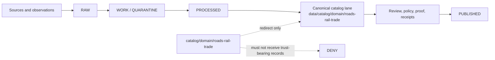

<!-- [KFM_META_BLOCK_V2]
doc_id: kfm://doc/catalog-domain-roads-rail-trade-readme
title: catalog/domain/roads-rail-trade/ - Roads Rail Trade Domain Catalog Compatibility Redirect
type: readme
version: v0.2
status: draft
owners: OWNER_TBD - Roads/Rail/Trade steward; Catalog steward; Registry steward; Evidence steward; Receipt steward; Proof steward; Release steward; Policy steward; Docs steward
created: 2026-07-10
updated: 2026-07-10
policy_label: public
related:
  - ../README.md
  - ../../README.md
  - ../../../data/README.md
  - ../../../data/catalog/README.md
  - ../../../data/catalog/domain/README.md
  - ../../../data/catalog/domain/roads-rail-trade/README.md
  - ../../../data/registry/README.md
  - ../../../data/receipts/README.md
  - ../../../data/proofs/README.md
  - ../../../data/published/README.md
  - ../../../release/README.md
  - ../../../docs/domains/roads-rail-trade/README.md
  - ../../../docs/doctrine/directory-rules.md
tags: [kfm, catalog, domain, roads-rail-trade, transportation, trade, compatibility-root, redirect, data-catalog-domain, non-authoritative, drift-fence]
notes:
  - Root-level catalog/domain/roads-rail-trade/ is a compatibility redirect and drift-control fence only.
  - Canonical Roads Rail Trade catalog records belong under data/catalog/domain/roads-rail-trade/.
  - This file does not prove migration completeness, validator coverage, source-rights closure, receipt/proof closure, release approval, publication readiness, or CI enforcement.
  - v0.2 adds the required README impact block, quick navigation, explicit repo-fit links, lifecycle flow, and maintainer checks without changing directory authority.
[/KFM_META_BLOCK_V2] -->

<a id="top"></a>

# Roads Rail Trade Domain Catalog Compatibility Redirect

`catalog/domain/roads-rail-trade/` keeps the legacy root-level catalog path visibly redirected to the governed Roads Rail Trade catalog lane without creating a second authority.


> [!IMPORTANT]
> **Status:** active compatibility redirect; document status remains `draft` pending owner confirmation.  
> **Owners:** `OWNER_TBD` — Roads/Rail/Trade, Catalog, Registry, Evidence, Receipt, Proof, Release, Policy, and Docs stewards.  
> **Canonical catalog home:** [`data/catalog/domain/roads-rail-trade/`](../../../data/catalog/domain/roads-rail-trade/)  
> **Truth posture:** this path carries navigation and drift-control documentation only; it is not a trust-bearing catalog surface.

**Quick links:** [Scope](#scope) · [Repo fit](#repo-fit) · [Accepted inputs](#accepted-inputs) · [Exclusions](#exclusions) · [Lifecycle boundary](#lifecycle-boundary) · [Change rules](#change-rules) · [Verification](#verification-checklist)

---

## Scope

This directory exists only to keep the legacy root-level `catalog/domain/` tree aligned with repository-supported domain catalog lanes. It is not the canonical Roads Rail Trade catalog home, not a registry, not a receipt or proof store, not a release or publication surface, and not a producer output target.

The durable rule is simple:

> Root-level `catalog/` may point to governed catalog authority; it must not become governed catalog authority.

## Repo fit

| Relationship | Path | Responsibility |
|---|---|---|
| Parent compatibility index | [`catalog/domain/`](../) | Defines redirect and drift-fence posture for legacy domain catalog paths. |
| Catalog compatibility root | [`catalog/`](../../) | Legacy compatibility surface; not the canonical catalog store. |
| Canonical domain catalog index | [`data/catalog/domain/`](../../../data/catalog/domain/) | Owns canonical domain catalog lanes. |
| Canonical Roads Rail Trade lane | [`data/catalog/domain/roads-rail-trade/`](../../../data/catalog/domain/roads-rail-trade/) | Owns Roads Rail Trade catalog records and catalog-facing indexes. |
| Source and rights registry | [`data/registry/`](../../../data/registry/) | Owns source identity, role, rights, cadence, sensitivity, and activation posture. |
| Receipts | [`data/receipts/`](../../../data/receipts/) | Owns process and promotion receipts. |
| Proofs | [`data/proofs/`](../../../data/proofs/) | Owns proof-support objects and validation evidence. |
| Release governance | [`release/`](../../../release/) | Owns release decisions, rollback targets, and promotion governance. |
| Published artifacts | [`data/published/`](../../../data/published/) | Owns approved public-safe outputs. |
| Domain doctrine | [`docs/domains/roads-rail-trade/`](../../../docs/domains/roads-rail-trade/) | Owns human-facing domain doctrine and architecture guidance. |
| Placement doctrine | [`docs/doctrine/directory-rules.md`](../../../docs/doctrine/directory-rules.md) | Governs responsibility-root placement and drift handling. |

## Evidence basis

| Evidence | Supports | Does not prove |
|---|---|---|
| `catalog/domain/README.md` | Root-level `catalog/domain/` is a compatibility redirect and drift fence. | Complete migration or enforcement maturity. |
| `data/catalog/domain/README.md` | Canonical domain catalog lanes live under `data/catalog/domain/`. | That every downstream record, schema, or validator is complete. |
| `data/catalog/domain/roads-rail-trade/README.md` | `roads-rail-trade/` is a repository-recognized canonical Roads Rail Trade catalog lane. | Source-rights closure, proof closure, release approval, or public delivery readiness. |
| `docs/domains/roads-rail-trade/README.md` | Domain doctrine exists outside this redirect path. | That this directory may host domain doctrine or implementation files. |
| Existing sibling redirects in `catalog/domain/` | Child compatibility README pattern is established for root-level domain lanes. | Permission to mirror every nested canonical sublane here. |

## Accepted inputs

Only the following belong here:

- `README.md` files that document redirect, compatibility, migration, or drift-control posture.
- Small migration or correction notes when an owning repository document explicitly requires them here.
- Empty sentinels only when an existing repository rule explicitly requires them.

## Exclusions

The following do **not** belong here:

- Canonical catalog records, indexes, manifests, schemas, contracts, validators, source descriptors, registry rows, receipts, proofs, release records, published artifacts, generated files, caches, credentials, or runtime outputs.
- RAW, WORK, QUARANTINE, unpublished, canonical-internal, direct model-runtime, or policy-sensitive data.
- Route, facility, story-node, legal-status, or trade-network authority records.
- AI-generated language presented as sovereign truth instead of a downstream carrier of cited evidence.

Move excluded material to its owning responsibility root. When ownership is unclear, stop and mark the placement `NEEDS VERIFICATION`; do not create a parallel authority here.

## Lifecycle boundary



This directory does not participate as a lifecycle stage. Promotion remains a governed state transition, not a copy into `catalog/domain/roads-rail-trade/`.

## Domain guardrails

- Do not make this path a route, facility, story-node, legal-status, or trade-network authority.
- Do not publish unresolved historical precision, active infrastructure risk, or legal-status claims without evidence closure and governed release.
- Cross-domain joins with hydrology, settlements, hazards, or people and land evidence must keep source roles separate.
- Public clients must resolve released artifacts and governed interfaces, never infer authority from this directory's presence.

## Directory shape

Expected root-level compatibility shape:

```text
catalog/domain/roads-rail-trade/
└── README.md
```

Nested canonical sublanes should not be mirrored here unless a future repository contract or accepted ADR explicitly requires a root-level redirect for that child path.

## Change rules

1. Prefer updating the canonical `data/catalog/domain/roads-rail-trade/` lane for catalog work.
2. Keep this directory limited to redirect and drift-control documentation.
3. Link to owning repository documents instead of duplicating authority.
4. Mark unknown or unverified behavior as `NEEDS VERIFICATION` instead of implying maturity.
5. Preserve source-role separation, governed publication, receipt/proof separation, and policy-safe public surfaces.
6. Require an ADR or migration note before this path gains any new trust-bearing responsibility.

## Verification checklist

- [ ] Confirm named owners and CODEOWNERS coverage.
- [ ] Confirm all relative links resolve from this README.
- [ ] Confirm no trust-bearing files exist beneath this compatibility path.
- [ ] Confirm canonical Roads Rail Trade catalog records remain under `data/catalog/domain/roads-rail-trade/`.
- [ ] Confirm CI or a repository validator detects forbidden content here.
- [ ] Confirm any legacy material has a migration record and rollback target.
- [ ] Confirm public clients do not read this path as catalog authority.

## Open verification items

- Actual migration completeness from any legacy root-level Roads Rail Trade catalog material: `NEEDS VERIFICATION`.
- CI enforcement for this redirect boundary: `NEEDS VERIFICATION`.
- Completeness of downstream schemas, examples, fixtures, validators, release manifests, and public surfaces: owned outside this directory and `NEEDS VERIFICATION` here.
- The parallel `data/catalog/domains/roads-rail-trade/` path visible in repository search may represent compatibility or drift and must not be treated as authority without Directory Rules and ADR review: `CONFLICTED / NEEDS VERIFICATION`.

## Definition of done

This redirect is complete when:

- the root-level path exists and points maintainers to the canonical Roads Rail Trade catalog lane;
- the path contains no trust-bearing records or producer outputs;
- exclusions are enforced by review or validation;
- migration and correction history remain inspectable; and
- no authority owned by registry, receipt, proof, release, published, schema, policy, source, tool, or application directories is duplicated here.

[Back to top](#top)
