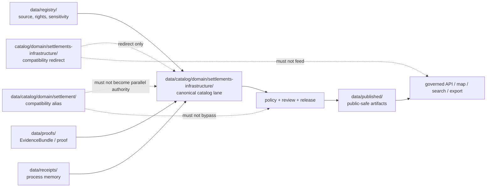

<!-- [KFM_META_BLOCK_V2]
doc_id: kfm://doc/catalog-domain-settlements-infrastructure-readme
title: catalog/domain/settlements-infrastructure/ — Settlements Infrastructure Domain Catalog Compatibility Redirect
type: readme
version: v0.2
status: draft
owners: OWNER_TBD — Settlements/Infrastructure steward · Catalog steward · Data steward · Registry steward · Evidence steward · Receipt steward · Proof steward · Release steward · Policy steward · Schema steward · Security steward · Docs steward
created: 2026-07-10
updated: 2026-07-10
policy_label: public
related:
  - ../README.md
  - ../../README.md
  - ../../../data/README.md
  - ../../../data/catalog/README.md
  - ../../../data/catalog/domain/README.md
  - ../../../data/catalog/domain/settlements-infrastructure/README.md
  - ../../../data/catalog/domain/settlement/README.md
  - ../../../data/triplets/README.md
  - ../../../data/registry/README.md
  - ../../../data/registry/sources/settlements-infrastructure/
  - ../../../data/receipts/README.md
  - ../../../data/proofs/README.md
  - ../../../data/published/README.md
  - ../../../release/README.md
  - ../../../contracts/domains/settlements-infrastructure/
  - ../../../schemas/contracts/v1/domains/settlements-infrastructure/
  - ../../../policy/domains/settlements-infrastructure/
  - ../../../docs/domains/settlements-infrastructure/README.md
  - ../../../docs/domains/settlements-infrastructure/CANONICAL_PATHS.md
  - ../../../docs/domains/settlements-infrastructure/DATA_LIFECYCLE.md
  - ../../../docs/domains/settlements-infrastructure/IDENTITY_MODEL.md
  - ../../../docs/doctrine/directory-rules.md
tags: [kfm, catalog, domain, settlements-infrastructure, settlements, infrastructure, facilities, utilities, dependencies, compatibility-root, redirect, data-catalog-domain, source-role-aware, sensitivity-aware, non-authoritative, drift-fence, release-gated]
notes:
  - "Upgrades the root-level catalog/domain/settlements-infrastructure/ compatibility redirect and drift-control fence."
  - "This path is not canonical settlement, infrastructure, facility, address, network, operator, registry, receipt, proof, release, publication, schema, policy, producer, search, hosting, API, or UI authority."
  - "Canonical Settlements/Infrastructure catalog records belong under data/catalog/domain/settlements-infrastructure/."
  - "The singular data/catalog/domain/settlement/ path is a documented compatibility alias and must not become parallel authority without an ADR-backed migration."
  - "Critical infrastructure, operator-sensitive details, condition observations, dependency relationships, private facilities, emergency facilities, exact locations, and security-relevant attributes require policy, sensitivity, review, release, and rollback controls."
  - "Current catalog inventory, migration completeness, schema and policy maturity, source-rights closure, receipts, proofs, CI enforcement, public-route behavior, map behavior, and runtime behavior remain NEEDS VERIFICATION."
  - "v0.2 adds an impact block, evidence ledger, no-loss assessment, responsibility matrix, object-family and cross-domain guardrails, minimum safe redirect slice, producer/public-client anti-bypass matrix, migration and rollback posture, validation, and safe language rules."
[/KFM_META_BLOCK_V2] -->

<a id="top"></a>

<div align="center">

# Settlements Infrastructure Domain Catalog Compatibility Redirect

`catalog/domain/settlements-infrastructure/`

**Root-level compatibility and drift-control fence for Settlements/Infrastructure catalog placement. Canonical catalog records belong under `data/catalog/domain/settlements-infrastructure/`; trust-bearing registry, receipt, proof, release, triplet, and published artifact families remain in their own responsibility roots.**


[Evidence](#0-evidence-basis) · [Scope](#1-scope) · [Repo fit](#2-repo-fit) · [Inputs](#4-accepted-inputs) · [Exclusions](#5-exclusions) · [Guardrails](#7-object-family-source-role-and-sensitivity-guardrails) · [Migration](#12-migration-posture) · [Validation](#16-validation-checklist)

</div>

---

> [!IMPORTANT]
> **Status:** experimental / draft  
> **Owners:** `OWNER_TBD — Settlements/Infrastructure steward`, `OWNER_TBD — Catalog steward`, `OWNER_TBD — Docs steward`  
> **Path:** `catalog/domain/settlements-infrastructure/README.md`  
> **Responsibility:** compatibility redirect and drift-control documentation only  
> **Canonical catalog home:** `data/catalog/domain/settlements-infrastructure/`  
> **Compatibility alias:** `data/catalog/domain/settlement/` — alias only unless ADR/migration resolves otherwise  
> **Directory Rules basis:** file location encodes ownership, governance, and lifecycle. This path must not become a parallel settlement, infrastructure, facility, address, source, registry, receipt, proof, release, publication, schema, policy, pipeline, package, runtime, hosting, search, API, or UI authority.  
> **Truth posture:** CONFIRMED target README path / CONFIRMED canonical Settlements/Infrastructure catalog README path / CONFIRMED singular settlement compatibility alias is documented / CONFIRMED Directory Rules path / PROPOSED v0.2 redirect contract / UNKNOWN actual inventory beyond README, migration completeness, producer behavior, CI enforcement, catalog inventory, validator maturity, access controls, public routes, map behavior, and runtime behavior

> [!CAUTION]
> Do not place critical-infrastructure detail, private-facility data, emergency-facility detail, operational network state, dependency vulnerabilities, credentials, exact sensitive locations, canonical catalog records, EvidenceBundles, receipts, proofs, schemas, policy, release decisions, or public delivery artifacts in this compatibility path. Treat unexpected files here as potential drift until reviewed and moved through a reversible migration.

---

## Quick jump

- [0. Evidence basis](#0-evidence-basis)
- [1. Scope](#1-scope)
- [2. Repo fit](#2-repo-fit)
- [3. Authority boundary](#3-authority-boundary)
- [4. Accepted inputs](#4-accepted-inputs)
- [5. Exclusions](#5-exclusions)
- [6. Directory shape](#6-directory-shape)
- [7. Object-family, source-role, and sensitivity guardrails](#7-object-family-source-role-and-sensitivity-guardrails)
- [8. Cross-domain truth boundaries](#8-cross-domain-truth-boundaries)
- [9. Compatibility-alias posture](#9-compatibility-alias-posture)
- [10. Minimum safe redirect slice](#10-minimum-safe-redirect-slice)
- [11. Producer and public-client anti-bypass matrix](#11-producer-and-public-client-anti-bypass-matrix)
- [12. Migration posture](#12-migration-posture)
- [13. Trust-boundary diagram](#13-trust-boundary-diagram)
- [14. Safe change pattern](#14-safe-change-pattern)
- [15. Rollback and correction](#15-rollback-and-correction)
- [16. Validation checklist](#16-validation-checklist)
- [17. Definition of done](#17-definition-of-done)
- [18. Open verification items](#18-open-verification-items)
- [19. Safe language rules](#19-safe-language-rules)
- [Appendix A — No-loss preservation](#appendix-a--no-loss-preservation)

---

## 0. Evidence basis

This README is a documentation boundary, not proof of migration, catalog inventory, schema closure, policy enforcement, source-rights closure, receipt/proof closure, release approval, public hosting, or runtime behavior.

| Source | Status | Supports | Limits |
|---|---|---|---|
| `catalog/domain/settlements-infrastructure/README.md` on `main` | **CONFIRMED** | Existing compatibility README and current path. | Does not prove files beyond the README or enforcement maturity. |
| `data/catalog/domain/settlements-infrastructure/README.md` | **CONFIRMED** | Canonical bounded-context CATALOG-stage lane, object families, sensitivity posture, and release gating. | Does not prove actual record inventory, validators, access controls, or released outputs. |
| `data/catalog/domain/settlement/README.md` | **CONFIRMED alias evidence** | Singular short-segment compatibility alias exists. | Alias does not replace the governing bounded-context lane. |
| `docs/domains/settlements-infrastructure/README.md` and related domain docs | **CONFIRMED doctrine / PROPOSED implementation** | Domain scope, object families, lifecycle posture, path conflict, and cross-lane boundaries. | Does not prove runtime implementation or release maturity. |
| `docs/doctrine/directory-rules.md` | **CONFIRMED** | Responsibility-root and lifecycle placement doctrine. | Does not prove the live repository is drift-free. |
| Sibling catalog-domain redirect pattern | **LINEAGE / current-session pattern** | Supports consistent compatibility-fence structure. | Does not make sibling implementation complete. |

### No-loss assessment

| Existing element | Disposition | Reason |
|---|---|---|
| Compatibility-only purpose | `KEEP + STRENGTHEN` | Core placement rule remains correct. |
| Canonical-home links | `KEEP + EXPAND` | Adds triplet, alias, registry, receipt, proof, release, schema, policy, and producer boundaries. |
| Sensitive-infrastructure warning | `KEEP + CLARIFY` | Expands facility, network, dependency, operator, private-property, and emergency-context controls. |
| Open verification items | `KEEP + EXPAND` | Prevents documentation from implying maturity. |
| Thin presentation | `RESTRUCTURE` | Adds impact block, navigation, tables, diagram, validation, rollback, and safe language. |
| Unsupported implementation implications | `NARROW` | Current behavior remains `UNKNOWN` or `NEEDS VERIFICATION`. |

[Back to top](#top)

---

## 1. Scope

`catalog/domain/settlements-infrastructure/` is a **root-level compatibility redirect** for legacy, copied, generated, or accidental Settlements/Infrastructure catalog placement.

Its job is to:

- direct maintainers to the canonical bounded-context catalog lane;
- prevent root-level catalog drift from becoming authority;
- explain where misplaced settlement, facility, infrastructure, network, service-area, operator, condition, and dependency records belong;
- preserve evidence, source role, sensitivity, lifecycle, release, correction, and rollback boundaries during migration;
- keep producers, public clients, map surfaces, search, exports, and AI answers away from compatibility paths.

It does **not** own settlement truth, infrastructure truth, source admission, catalog records, facility status, address authority, network operations, EvidenceBundles, receipts, proofs, policy decisions, release decisions, published artifacts, schemas, contracts, code, or runtime behavior.

[Back to top](#top)

---

## 2. Repo fit

| Responsibility | Canonical home | Boundary |
|---|---|---|
| Settlements/Infrastructure catalog records | `data/catalog/domain/settlements-infrastructure/` | Governing CATALOG-stage bounded-context lane. |
| Singular settlement alias | `data/catalog/domain/settlement/` | Compatibility alias only unless ADR/migration says otherwise. |
| Parent domain catalog index | `data/catalog/domain/` | Domain catalog navigation and closure. |
| Graph/triplet projections | `data/triplets/` | Relationship projection; not sovereign truth. |
| Domain doctrine | `docs/domains/settlements-infrastructure/` | Human-facing scope, paths, identity, lifecycle, and governance. |
| Semantic contracts | `contracts/domains/settlements-infrastructure/` | Object meaning; not data, policy, or release. |
| Machine schemas | `schemas/contracts/v1/domains/settlements-infrastructure/` or ADR-selected equivalent | Machine shape; not this path. |
| Domain policy | `policy/domains/settlements-infrastructure/` or accepted policy root | Allow, deny, restrict, abstain, sensitivity, and public-safe handling. |
| Source registry | `data/registry/sources/settlements-infrastructure/` or accepted registry root | SourceDescriptor, rights, role, sensitivity, cadence, and activation state. |
| Receipts | `data/receipts/` | Process memory and transform/validation/release receipts. |
| Evidence and proofs | `data/proofs/` | EvidenceBundle and proof support. |
| Release decisions | `release/` | Promotion, correction, withdrawal, supersession, and rollback. |
| Public-safe artifacts | `data/published/` | Released downstream delivery artifacts only. |
| Pipelines and packages | Responsibility-specific implementation roots | Executable helpers; must not write here. |

> [!NOTE]
> The canonical catalog README documents `settlements-infrastructure` as the working bounded-context slug and `settlement` as a conflicted compatibility alias. This redirect preserves that distinction rather than silently choosing a new authority path.

---

## 3. Authority boundary

```text
catalog/domain/settlements-infrastructure/
├── README.md                  # compatibility redirect / drift fence
├── MIGRATION.md               # PROPOSED only while active migration exists
└── DRIFT.md                   # PROPOSED only when misplaced material is recorded

NOT HERE:
  settlement, municipality, census-place, townsite, ghost-town, fort,
  mission, reservation-community, facility, infrastructure-asset,
  network-node, network-segment, service-area, operator, condition,
  or dependency catalog records
  source payloads or registry records
  EvidenceBundles, proofs, or receipts
  release decisions or published artifacts
  schemas, contracts, or policy rules
  pipeline/package/runtime code
  operational network state or emergency-command data
  credentials, private endpoints, or exact sensitive locations
```

A file does not become authoritative because it appears under a path named `catalog`. Compatibility placement cannot upgrade lifecycle state, evidence quality, source role, sensitivity posture, review state, or release state.

---

## 4. Accepted inputs

Only narrow compatibility material belongs here.

| Allowed item | Purpose | Required posture |
|---|---|---|
| `README.md` | Redirect and authority-boundary documentation | Must point to canonical homes. |
| `MIGRATION.md` | Temporary migration procedure | `PROPOSED`; review-linked; removable after closure. |
| `DRIFT.md` | Records discovered misplaced material | Must avoid copying sensitive content into the note. |
| `.gitkeep` | Empty sentinel where explicitly required | Does not authorize trust-bearing content. |

No settlement, facility, infrastructure, network, source, catalog, evidence, release, or generated output is an accepted input to this lane.

---

## 5. Exclusions

| Do not put here | Correct home or handling |
|---|---|
| Settlement, Municipality, CensusPlace, Townsite, GhostTown, Fort, Mission, ReservationCommunity catalog records | `data/catalog/domain/settlements-infrastructure/` |
| InfrastructureAsset, NetworkNode, NetworkSegment, Facility, ServiceArea, Operator, ConditionObservation, Dependency catalog records | `data/catalog/domain/settlements-infrastructure/` |
| RAW, WORK, QUARANTINE, or PROCESSED source payloads | Appropriate `data/<phase>/settlements-infrastructure/` lane |
| SourceDescriptor, rights, cadence, sensitivity, activation, or caveat records | `data/registry/` |
| EvidenceBundles, proof packs, attestations | `data/proofs/` |
| Receipts and validation/review records | `data/receipts/` |
| Release decisions, rollback cards, corrections, withdrawals, supersession records | `release/` |
| Public layers, tiles, exports, API snapshots, search indexes, reports | `data/published/` after governed release |
| Schemas, contracts, policy, tests, validators, packages, pipelines, runtime adapters | Their responsibility roots |
| Credentials, private endpoints, operational network status, security-sensitive facility detail | Secret/deployment or restricted governed systems; never this public redirect |

---

## 6. Directory shape

Current verified shape:

```text
catalog/domain/settlements-infrastructure/
└── README.md
```

Potential temporary files are **PROPOSED**, not current inventory:

```text
catalog/domain/settlements-infrastructure/
├── README.md
├── MIGRATION.md   # temporary and review-linked
└── DRIFT.md       # temporary, no sensitive payload copying
```

Nested canonical sublanes must not be mirrored here unless a future ADR-backed migration explicitly requires compatibility redirects.

---

## 7. Object-family, source-role, and sensitivity guardrails

| Guardrail | Required posture |
|---|---|
| Settlement identity is not address authority | A settlement, municipality, census place, historic townsite, or community record does not make addresses authoritative. |
| Facility is not infrastructure network | A facility record does not by itself establish network topology, service reach, operational status, or dependency. |
| Infrastructure asset is not operational truth | Asset existence, condition, availability, and live status remain distinct claims. |
| Service area is not ownership or entitlement | Service coverage does not establish land title, residency, jurisdiction, or legal right. |
| Dependency is not vulnerability publication | Dependency edges may be security-sensitive and require review, abstraction, staging, or denial. |
| Historic place is not current settlement | Ghost towns, forts, missions, townsites, and historic communities require temporal and source-role clarity. |
| Administrative boundary is not settlement identity | Municipality, census place, township, county, service district, and named place must not collapse. |
| Critical infrastructure fails closed | Exact geometry, access points, capacities, vulnerabilities, outage state, control systems, and operator-sensitive detail require restricted handling. |
| Private facilities fail closed | Private-property and non-public facility details require rights, necessity, and release review. |
| Emergency facilities are not command surfaces | Catalog records must not become operational dispatch, emergency-command, shelter-capacity, or live-readiness authority. |
| Source role remains visible | Observed, regulatory, modeled, aggregate, administrative, candidate, and synthetic claims must not upgrade one another by placement. |
| Public-safe derivatives are release-gated | Generalized or redacted products remain downstream derivatives, not canonical truth. |

---

## 8. Cross-domain truth boundaries

| Related lane | Boundary |
|---|---|
| Roads/Rail/Trade | Owns route, network, corridor, and transportation lineage; this lane may reference governed joins only. |
| People/DNA/Land | Owns living-person, consent, ownership, title, and sensitive land relationships. |
| Hazards | Owns hazard-event and warning truth; infrastructure exposure does not become hazard truth. |
| Hydrology | Owns water-system and hydrologic lineage; facilities may reference context without replacing it. |
| Archaeology/Cultural Heritage | Owns archaeological, sacred, burial, and culturally sensitive site truth. |
| Agriculture | Owns field, crop, farm-operation, and production claims. |
| Geology | Owns subsurface, mineral, stratigraphic, and geologic claims. |
| Settlement / administrative context | Named places, legal municipalities, census geographies, postal addresses, and historic settlements remain distinct. |

Cross-domain joins must preserve owning-lane truth, EvidenceRef/EvidenceBundle resolution, source role, sensitivity, rights, time, policy, review, and release state.

---

## 9. Compatibility-alias posture

`data/catalog/domain/settlement/` is a documented compatibility alias. It must not become parallel authority beside `data/catalog/domain/settlements-infrastructure/`.

Any future resolution requires:

1. an ADR or equivalent accepted decision;
2. a path inventory and dependency map;
3. schema, contract, policy, source-registry, test, and release impact review;
4. migration and rollback instructions;
5. correction of public routes, docs, indexes, and producer targets;
6. proof that no sensitive or unreleased content became public through the change.

---

## 10. Minimum safe redirect slice

| Slice item | Minimum requirement | Why it matters |
|---|---|---|
| README | Points to canonical bounded-context catalog lane | Prevents drift from becoming authority. |
| Authority warning | States this is compatibility-only | Prevents producer and public-client misuse. |
| Sensitivity warning | Covers critical infrastructure, private facilities, dependencies, and exact locations | Prevents unsafe exposure. |
| Alias warning | Distinguishes `settlement` from `settlements-infrastructure` | Prevents parallel catalog authority. |
| Canonical-home matrix | Identifies registry, receipts, proofs, release, published, schemas, policy, and contracts | Preserves responsibility roots. |
| Verification backlog | Keeps enforcement and migration claims bounded | Prevents false maturity claims. |
| Rollback path | Defines reversible correction | Supports governed remediation. |

---

## 11. Producer and public-client anti-bypass matrix

| Bypass risk | Required behavior | Review signal |
|---|---|---|
| Producer writes catalog records here | Reject and redirect to `data/catalog/domain/settlements-infrastructure/` | No trust-bearing payload remains. |
| Producer writes to singular alias as authority | Reject unless ADR-backed migration explicitly permits it | Alias remains compatibility-only. |
| Public API, map, search, or export reads this path | Reject; public clients use governed interfaces and released artifacts | Compatibility root excluded from public path. |
| Redirect stores critical-infrastructure details | Remove, quarantine, redact/generalize, and review | Sensitivity review passes. |
| Redirect stores operational status or dependencies | Move to governed restricted lifecycle/support homes | No live operational authority remains. |
| Redirect stores source descriptors or rights data | Move to registry | Registry remains authoritative. |
| Redirect stores receipts or proofs | Move to `data/receipts/` or `data/proofs/` | Object-family separation restored. |
| Redirect stores release decisions or public artifacts | Move to `release/` or `data/published/` | Release boundary restored. |
| AI or generated summary cites this README as factual settlement/infrastructure evidence | Abstain and resolve EvidenceRef to EvidenceBundle | Evidence, not compatibility prose, supports claims. |

---

## 12. Migration posture

If misplaced material is found here:

1. freeze new writes to the compatibility path;
2. inventory files, producers, consumers, references, and sensitivity;
3. classify each item by responsibility root and lifecycle phase;
4. quarantine sensitive or rights-uncertain material before inspection or movement;
5. identify the canonical destination;
6. preserve stable identity, provenance, source role, time, rights, evidence, review, and release references;
7. move through a small, reviewable change;
8. update producer targets and consumer references;
9. add validation that rejects future writes here;
10. record correction, supersession, and rollback information;
11. remove temporary migration notes after verified closure.

> [!WARNING]
> Promotion is a governed state transition, not a file move. Moving a record from this path to a canonical path does not make it validated, policy-admitted, reviewed, released, or public.

---

## 13. Trust-boundary diagram



---

## 14. Safe change pattern

For changes under this path:

1. confirm the change is redirect, compatibility, drift, migration, or correction documentation only;
2. confirm canonical paths from current repository evidence;
3. confirm no source data, catalog record, evidence object, receipt, proof, release object, published artifact, secret, or sensitive detail is added;
4. preserve the `settlements-infrastructure` versus `settlement` conflict visibly;
5. confirm relative links from this file;
6. mark implementation claims `UNKNOWN` or `NEEDS VERIFICATION` unless verified;
7. update validation or explain why the change is documentation-only;
8. retain a reversible rollback target.

---

## 15. Rollback and correction

Rollback is required when a change:

- weakens the compatibility-only boundary;
- creates parallel catalog authority;
- points producers or public clients to this path;
- exposes critical infrastructure, private facilities, operational state, dependency vulnerabilities, or exact sensitive locations;
- collapses receipts, proofs, catalogs, release records, or published artifacts;
- overstates migration, schema, policy, validation, release, or runtime maturity.

Rollback method: revert the documentation commit and restore the prior blob while preserving any separately required correction or security response.

For sensitive exposure, reverting the README is not sufficient. Follow repository security, correction, withdrawal, credential-rotation, or restricted-data procedures appropriate to the incident.

---

## 16. Validation checklist

- [ ] Confirm only compatibility documentation exists under this path.
- [ ] Confirm canonical catalog links resolve to `data/catalog/domain/settlements-infrastructure/`.
- [ ] Confirm the singular `settlement` alias remains visibly non-authoritative.
- [ ] Confirm no source, catalog, registry, receipt, proof, release, published, schema, policy, code, secret, or generated payload is stored here.
- [ ] Confirm no critical-infrastructure, private-facility, emergency-facility, operational-state, dependency-vulnerability, or exact sensitive-location detail is present.
- [ ] Confirm producers do not write here.
- [ ] Confirm public APIs, maps, search, exports, and AI retrieval do not treat this path as evidence or data authority.
- [ ] Confirm relative links are valid from this directory.
- [ ] Confirm migration, correction, and rollback notes are current where present.
- [ ] Confirm claims about CI, schemas, policy, catalog inventory, source rights, receipts, proofs, and release remain bounded by evidence.

---

## 17. Definition of done

- [ ] README identifies the path as compatibility-only.
- [ ] Canonical bounded-context catalog lane is explicit.
- [ ] Alias conflict is explicit and non-authoritative.
- [ ] Responsibility roots remain separate.
- [ ] Sensitive infrastructure posture fails closed.
- [ ] Producers and public clients are prohibited from using this path as authority.
- [ ] Migration and rollback are reversible and auditable.
- [ ] Open verification items remain visible.
- [ ] Owners are confirmed or remain clearly marked `OWNER_TBD`.

---

## 18. Open verification items

| Item | Status | Why it matters |
|---|---|---|
| Actual files beyond this README | `NEEDS VERIFICATION` | Required before claiming the path is clean. |
| Historical producers and consumers | `NEEDS VERIFICATION` | Required before migration closure. |
| `settlement` alias resolution | `CONFLICTED / NEEDS VERIFICATION` | Prevents parallel authority. |
| Catalog inventory and stable identities | `NEEDS VERIFICATION` | Required before catalog maturity claims. |
| Schemas, contracts, policy, fixtures, tests, and validators | `NEEDS VERIFICATION` | Required before enforcement claims. |
| Source rights, sensitivity, and activation closure | `NEEDS VERIFICATION` | Required before source or release claims. |
| Receipts, proofs, review records, release manifests, and rollback cards | `NEEDS VERIFICATION` | Required before publication claims. |
| CI checks preventing writes here | `NEEDS VERIFICATION` | Required before enforcement claims. |
| Public API, map, search, export, and AI retrieval exclusion | `NEEDS VERIFICATION` | Required before trust-boundary claims. |
| Critical-infrastructure access controls | `NEEDS VERIFICATION` | Required before safe exposure claims. |

---

## 19. Safe language rules

Use:

- “compatibility redirect”
- “drift-control fence”
- “canonical catalog lane”
- “compatibility alias”
- “release-gated”
- “public-safe derivative”
- “NEEDS VERIFICATION”
- “does not prove”
- “governed interface”

Avoid unsupported claims such as:

- “fully migrated”
- “CI-enforced”
- “safe for public use”
- “complete infrastructure inventory”
- “authoritative address database”
- “real-time operational status”
- “all critical infrastructure is protected”
- “released”
- “validated”
- “policy compliant”

unless current repository evidence, tests, workflows, receipts, proofs, reviews, and release records support the statement.

---

<details>
<summary>Appendix A — No-loss preservation</summary>

The v0.1 README already established the correct core boundary: this root-level path is a compatibility redirect, not canonical authority. The v0.2 revision preserves that purpose and expands it without changing lifecycle or publication behavior.

Preserved:

- canonical-home pointer;
- registry, receipt, proof, release, and published separation;
- no-producer-output rule;
- sensitive facility and critical-infrastructure warning;
- migration and CI uncertainty;
- definition-of-done intent.

Added:

- GitHub impact block and badges;
- evidence ledger and explicit source limits;
- no-loss assessment;
- bounded-context and alias distinction;
- full responsibility matrix;
- object-family and cross-domain truth boundaries;
- critical-infrastructure, private-facility, emergency-facility, operational-state, and dependency safeguards;
- producer/public-client anti-bypass controls;
- migration, correction, rollback, validation, and safe-language rules.

No runtime, schema, policy, data, catalog, release, or publication behavior is changed by this documentation-only revision.

</details>

<p align="right"><a href="#top">Back to top</a></p>
