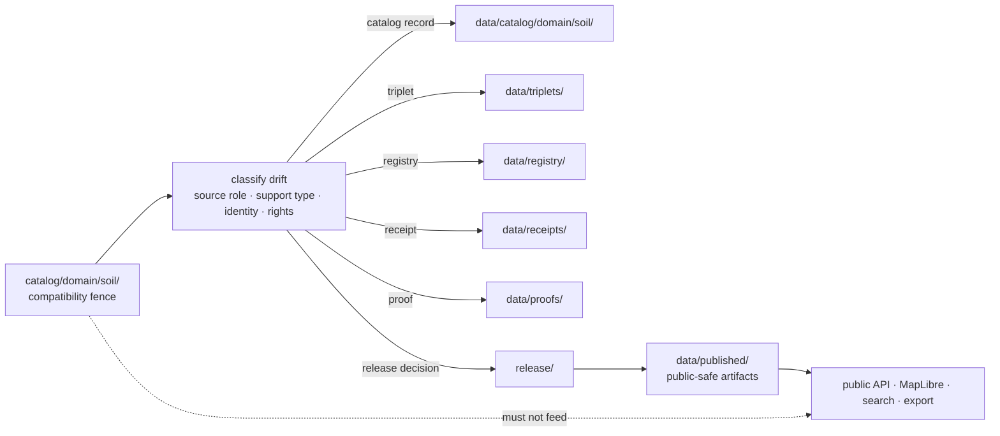

<!-- [KFM_META_BLOCK_V2]
doc_id: kfm://doc/catalog-domain-soil-readme
title: catalog/domain/soil/ — Soil Domain Catalog Compatibility Redirect
type: readme
version: v0.2
status: draft
owners: OWNER_TBD — Soil steward · Catalog steward · Data steward · Registry steward · Evidence steward · Receipt steward · Proof steward · Release steward · Policy steward · Schema steward · Docs steward
created: 2026-07-10
updated: 2026-07-10
policy_label: public
related:
  - ../README.md
  - ../../README.md
  - ../../../data/README.md
  - ../../../data/catalog/README.md
  - ../../../data/catalog/domain/README.md
  - ../../../data/catalog/domain/soil/README.md
  - ../../../data/triplets/README.md
  - ../../../data/registry/README.md
  - ../../../data/registry/sources/soil/
  - ../../../data/receipts/README.md
  - ../../../data/proofs/README.md
  - ../../../data/published/README.md
  - ../../../release/README.md
  - ../../../contracts/domains/soil/README.md
  - ../../../schemas/contracts/v1/domains/soil/
  - ../../../policy/domains/soil/
  - ../../../pipelines/domains/soil/ssurgo_ingest/README.md
  - ../../../docs/domains/soil/README.md
  - ../../../docs/sources/catalog/nrcs/ssurgo.md
  - ../../../docs/sources/catalog/nrcs/gssurgo.md
  - ../../../docs/doctrine/directory-rules.md
tags: [kfm, catalog, domain, soil, ssurgo, gssurgo, sda, SoilMapUnit, SoilComponent, Horizon, SoilProperty, HydrologicSoilGroup, Pedon, compatibility-root, redirect, data-catalog-domain, source-role-aware, support-type-aware, non-authoritative, drift-fence, release-gated]
notes:
  - "Upgrades the root-level catalog/domain/soil/ compatibility redirect and drift-control fence."
  - "Root-level catalog/domain/soil/ is not canonical Soil catalog authority, Soil survey authority, source authority, registry authority, receipt authority, proof authority, release authority, publication authority, schema authority, policy authority, producer authority, hosting authority, search authority, or UI authority."
  - "Canonical Soil catalog records belong under data/catalog/domain/soil/; graph-compatible projections belong under data/triplets/; source, rights, sensitivity, and activation records belong under data/registry/; receipts belong under data/receipts/; proof support belongs under data/proofs/; release decisions belong under release/; public-safe artifacts belong under data/published/ after governed release."
  - "Soil support types must remain separate: static survey, gridded derivative, station observation, satellite grid, pedon/profile, and interpretation are not interchangeable."
  - "SSURGO/gSSURGO/SDA-derived records must preserve source vintage, geometry scope, MUKEY/COKEY/CHKEY lineage where material, attribute provenance, units, depth, method, evidence, policy, receipts, release, correction, and rollback linkage."
  - "The inspected docs/domains/soil/README.md is only a Greenfield placeholder and does not prove current Soil domain implementation maturity."
  - "Actual current contents beyond README files, historical producers, workflow writes, migration status, CI/review enforcement, public-client/producer exclusion, catalog inventory, schema maturity, policy maturity, access-control maturity, release workflow maturity, map/API behavior, and runtime behavior remain NEEDS VERIFICATION."
  - "v0.2 adds current evidence basis, impact block, canonical-home matrix, Soil support-type and identity guardrails, allowed/forbidden content, minimum safe redirect slice, anti-bypass matrix, migration/rollback posture, validation, safe language rules, and no-loss preservation notes without claiming implementation maturity."
[/KFM_META_BLOCK_V2] -->

<a id="top"></a>

<div align="center">

# Soil Domain Catalog Compatibility Redirect

`catalog/domain/soil/`

**Root-level compatibility and drift-control fence for Soil catalog-path drift. Canonical Soil catalog records belong under `data/catalog/domain/soil/`; trust-bearing registry, receipt, proof, release, triplet, and published artifact families remain in their own responsibility roots.**


[Evidence](#0-evidence-basis) · [Scope](#1-scope) · [Repo fit](#2-repo-fit) · [Inputs](#4-accepted-inputs) · [Exclusions](#5-exclusions) · [Soil guardrails](#7-soil-source-role-support-type-and-identity-guardrails) · [Migration](#11-migration-posture) · [Validation](#15-validation-checklist)

</div>

---

> [!IMPORTANT]
> **Status:** experimental / draft  
> **Owners:** `OWNER_TBD — Soil steward`, `OWNER_TBD — Catalog steward`, `OWNER_TBD — Docs steward`  
> **Path:** `catalog/domain/soil/README.md`  
> **Responsibility:** compatibility redirect and drift-control documentation only  
> **Canonical Soil catalog home:** `data/catalog/domain/soil/`  
> **Directory Rules basis:** file location encodes ownership, governance, and lifecycle. This path must not become a parallel Soil catalog, survey, source, registry, receipt, proof, release, publication, schema, policy, pipeline, package, hosting, search, or UI authority.  
> **Truth posture:** CONFIRMED target README path / CONFIRMED canonical Soil catalog README path / CONFIRMED Soil contract-lane README path / CONFIRMED Directory Rules document path / PROPOSED v0.2 compatibility contract / UNKNOWN actual root-level inventory beyond README, migration completeness, producer behavior, CI enforcement, catalog inventory, validators, release state, public routes, and runtime behavior

> [!CAUTION]
> Do not place Soil source data, canonical catalog records, precise private-land context, credentials, generated outputs, release decisions, EvidenceBundles, receipts, proofs, schemas, policy, or public delivery artifacts in this compatibility path. Treat unexpected files here as potential drift until reviewed and moved through a reversible migration.

---

## Quick jump

- [0. Evidence basis](#0-evidence-basis)
- [1. Scope](#1-scope)
- [2. Repo fit](#2-repo-fit)
- [3. Authority boundary](#3-authority-boundary)
- [4. Accepted inputs](#4-accepted-inputs)
- [5. Exclusions](#5-exclusions)
- [6. Directory shape](#6-directory-shape)
- [7. Soil source-role, support-type, and identity guardrails](#7-soil-source-role-support-type-and-identity-guardrails)
- [8. Cross-domain truth boundaries](#8-cross-domain-truth-boundaries)
- [9. Minimum safe redirect slice](#9-minimum-safe-redirect-slice)
- [10. Producer and public-client anti-bypass matrix](#10-producer-and-public-client-anti-bypass-matrix)
- [11. Migration posture](#11-migration-posture)
- [12. Trust-boundary diagram](#12-trust-boundary-diagram)
- [13. Safe change pattern](#13-safe-change-pattern)
- [14. Rollback and correction](#14-rollback-and-correction)
- [15. Validation checklist](#15-validation-checklist)
- [16. Definition of done](#16-definition-of-done)
- [17. Open verification items](#17-open-verification-items)
- [18. Safe language rules](#18-safe-language-rules)
- [Appendix A — No-loss preservation](#appendix-a--no-loss-preservation)

---

## 0. Evidence basis

This README is a documentation boundary, not proof of migration, catalog inventory, schema closure, policy enforcement, source-rights closure, receipt/proof closure, release approval, public hosting, or runtime behavior.

| Source | Status | Supports | Limits |
|---|---|---|---|
| `catalog/domain/soil/README.md` on `main` | **CONFIRMED** | Existing compatibility README and current path. | Does not prove files beyond the README or enforcement maturity. |
| `data/catalog/domain/soil/README.md` | **CONFIRMED** | Canonical Soil CATALOG-stage lane, object families, support-type separation, MUKEY/COKEY/CHKEY lineage, release-gated posture. | Does not prove actual record inventory, validators, access controls, or released outputs. |
| `contracts/domains/soil/README.md` | **CONFIRMED** | Soil semantic-contract lane, object-family meanings, responsibility-root separation, support-type posture. | Does not prove schema, policy, tests, API, map, or runtime maturity. |
| `docs/domains/soil/README.md` | **CONFIRMED placeholder** | Confirms the path exists. | It is a Greenfield placeholder and does not establish current Soil doctrine depth or implementation. |
| `docs/doctrine/directory-rules.md` | **CONFIRMED** | Placement doctrine: responsibility root and lifecycle determine file location. | Does not prove the live repository is drift-free. |
| Prior sibling catalog-domain redirect pattern | **LINEAGE / current-session pattern** | Supports consistent compatibility-fence structure. | Does not make every sibling implementation or child lane complete. |

### No-loss assessment

| Existing element | Disposition | Reason |
|---|---|---|
| Compatibility-only purpose | `KEEP + STRENGTHEN` | Core placement rule remains correct. |
| Canonical-home links | `KEEP + EXPAND` | Adds triplet, registry, receipt, proof, release, schema, policy, and producer boundaries. |
| Soil guardrails | `KEEP + CLARIFY` | Expands support-type, identity, temporal, units, method, and cross-domain boundaries. |
| Open verification items | `KEEP + EXPAND` | Prevents documentation from implying maturity. |
| Thin presentation | `RESTRUCTURE` | Adds impact block, quick jumps, tables, diagram, validation, rollback, and safe language. |
| Unsupported implementation implications | `NARROW` | Current behavior remains `UNKNOWN` or `NEEDS VERIFICATION`. |

[Back to top](#top)

---

## 1. Scope

`catalog/domain/soil/` is a **root-level compatibility redirect** for legacy, copied, generated, or accidental Soil catalog placement.

Its job is to:

- direct maintainers to the canonical Soil catalog lane;
- prevent root-level catalog drift from becoming authority;
- explain where misplaced Soil-related object families belong;
- preserve source-role, support-type, evidence, lifecycle, release, and rollback boundaries during migration;
- keep public clients and producers away from compatibility paths.

It does **not** own Soil truth, source admission, catalog records, survey data, interpretation outputs, EvidenceBundles, receipts, proofs, policy decisions, release decisions, published artifacts, schemas, contracts, code, or runtime behavior.

[Back to top](#top)

---

## 2. Repo fit

| Responsibility | Canonical home | Boundary |
|---|---|---|
| Soil catalog records and indexes | `data/catalog/domain/soil/` | CATALOG-stage carriers; release-gated. |
| Parent domain catalog index | `data/catalog/domain/` | Domain catalog navigation and closure. |
| Graph/triplet projections | `data/triplets/` | Relationship projection; not sovereign truth. |
| Soil semantic contracts | `contracts/domains/soil/` | Object meaning; not data, policy, or release. |
| Soil schemas | `schemas/contracts/v1/domains/soil/` or ADR-selected equivalent | Machine shape; not this path. |
| Soil policy | `policy/domains/soil/` or accepted policy root | Allow, deny, restrict, abstain, public-safe handling. |
| Soil source registry | `data/registry/sources/soil/` or accepted registry root | SourceDescriptor, rights, role, sensitivity, cadence, activation. |
| Receipts | `data/receipts/` | Process memory and transform/validation/release receipts. |
| Evidence and proofs | `data/proofs/` | EvidenceBundle and proof support. |
| Release decisions | `release/` | Promotion, correction, withdrawal, supersession, rollback. |
| Public-safe artifacts | `data/published/` | Released downstream delivery artifacts only. |
| Soil pipelines | `pipelines/domains/soil/` | Executable implementation; must not write here. |

> [!NOTE]
> The `docs/domains/soil/README.md` file is currently only a Greenfield placeholder. Use the canonical Soil catalog and contract READMEs for the strongest verified Soil-specific boundaries in this revision.

---

## 3. Authority boundary

```text
catalog/domain/soil/
├── README.md                  # compatibility redirect / drift fence
├── MIGRATION.md               # PROPOSED only while active migration exists
└── DRIFT.md                   # PROPOSED only when misplaced material is recorded

NOT HERE:
  Soil catalog records or indexes
  SSURGO/gSSURGO/SDA payloads
  SourceDescriptor or rights records
  EvidenceBundles, proofs, or receipts
  Release decisions or published artifacts
  Schemas, contracts, or policy rules
  Pipeline/package/runtime code
  Generated rasters, vectors, tiles, caches, or exports
  Credentials, private endpoints, or sensitive location detail
```

A file does not become authoritative because it appears under a path named `catalog`. Root-level compatibility placement cannot upgrade lifecycle state, evidence quality, source role, support type, review state, or release state.

---

## 4. Accepted inputs

Only narrow compatibility material belongs here.

| Allowed item | Purpose | Required posture |
|---|---|---|
| `README.md` | Redirect and authority-boundary documentation | Must point to canonical homes. |
| `MIGRATION.md` | Temporary migration procedure | `PROPOSED`; review-linked; removable after closure. |
| `DRIFT.md` | Records discovered misplaced material | Must avoid copying sensitive content into the note. |
| `.gitkeep` | Empty sentinel where explicitly required | Does not authorize trust-bearing content. |

No Soil data, catalog records, source records, evidence objects, release objects, or generated outputs are accepted inputs to this lane.

---

## 5. Exclusions

| Do not put here | Correct home or handling |
|---|---|
| SoilMapUnit, SoilComponent, Horizon, SoilProperty, HydrologicSoilGroup, Pedon, SoilProfileView, ErosionRisk, SuitabilityRating catalog records | `data/catalog/domain/soil/` |
| SSURGO, gSSURGO, SDA extracts, station observations, satellite grids, pedon/profile payloads | Appropriate `data/raw|work|quarantine|processed/.../soil/` lanes |
| Graph edges, relationship bundles, triplet projections | `data/triplets/` |
| SourceDescriptor, rights, sensitivity, cadence, activation state | `data/registry/sources/soil/` or accepted registry root |
| EvidenceBundle, ProofPack, attestations | `data/proofs/` |
| RunReceipt, ValidationReceipt, CatalogBuildReceipt, transformation or release receipts | `data/receipts/` |
| ReleaseManifest, PromotionDecision, RollbackCard, CorrectionNotice | `release/` |
| Public soil layers, tiles, downloads, reports, API snapshots | `data/published/` after governed release |
| Semantic object meaning | `contracts/domains/soil/` |
| JSON Schema / machine shape | `schemas/contracts/v1/domains/soil/` or ADR-selected equivalent |
| Policy rules, sensitivity decisions, publication decisions | `policy/` and governed release decision homes |
| Pipeline, package, validator, runtime, app, or infrastructure code | Owning implementation root |
| Secrets, credentials, private endpoints, workstation paths | Never commit; use approved secret/local mechanisms |

---

## 6. Directory shape

The smallest safe compatibility shape is intentionally boring:

```text
catalog/domain/soil/
└── README.md
```

> [!WARNING]
> Do not mirror canonical child lanes, catalog indexes, object-family folders, or generated output trees here. Any expansion requires an accepted migration or compatibility decision and must remain non-authoritative.

---

## 7. Soil source-role, support-type, and identity guardrails

Soil records are easy to misread because survey, derivative, observation, profile, and interpretation products can look similar on a map. The redirect must preserve these distinctions during any drift review or migration.

### 7.1 Support types must not collapse

| Support type | What it may support | What it must not become |
|---|---|---|
| Static soil survey | Survey-era map unit and component context | Current field condition or real-time observation |
| Gridded derivative | Rasterized/generalized survey derivative | Original survey geometry or stronger source authority |
| Station observation | Time-specific measured soil condition | Survey map-unit truth or statewide completeness |
| Satellite grid | Remote-sensing observation/model context | Pedon evidence, regulatory status, or exact field truth |
| Pedon/profile | Site/profile evidence | Map-unit-wide property without supported derivation |
| Interpretation | Suitability, erosion, runoff, or management-oriented derivative | Observation, legal determination, or operational prescription |

### 7.2 Identity and lineage must remain inspectable

Where material depends on SSURGO/gSSURGO/SDA lineage, preserve as applicable:

- source product and vintage;
- survey area and geometry scope;
- `MUKEY`, `COKEY`, and `CHKEY` relationships;
- map-unit, component, and horizon separation;
- source-native fields versus normalized or derived fields;
- units, method, depth interval, aggregation, weighting, uncertainty, and caveats;
- evidence, source, policy, receipt, review, release, correction, and rollback references.

### 7.3 Interpretation boundaries

- Hydrologic Soil Group is runoff-potential classification, not flood truth.
- Erosion risk is an interpretation, not an emergency hazard declaration.
- Suitability rating is an interpretation, not crop/yield, legal, financial, or operational advice.
- A gSSURGO grid is a derivative, not original SSURGO polygon authority.
- A horizon property is not a map-unit property without explicit aggregation and derivation support.
- A catalog entry supports discovery and closure; it does not make the underlying claim true or public.

---

## 8. Cross-domain truth boundaries

| Related domain | Soil may provide | Soil must not silently replace |
|---|---|---|
| Agriculture | substrate, drainage, capability, interpretation context | crop, yield, management, ownership, or economic truth |
| Hydrology | infiltration/runoff-potential and soil-water context | streamflow, flood, groundwater, or emergency-warning truth |
| Hazards | erosion or shrink-swell context | official hazard declaration or life-safety instruction |
| Geology | parent-material or near-surface context where sourced | lithology, stratigraphy, borehole, or mineral-resource truth |
| Habitat | substrate and moisture context | habitat suitability, occurrence, critical-habitat, or stewardship truth |
| Flora / Fauna | soil context for governed joins | species occurrence, absence, range, or sensitive-site truth |
| People / Land | generalized land-context joins where permitted | title, ownership, living-person, or parcel-level authority |

Cross-domain joins must preserve owning-lane truth, source role, sensitivity, rights, time basis, release state, and evidence closure.

---

## 9. Minimum safe redirect slice

| Slice item | Minimum requirement | Why it matters |
|---|---|---|
| Redirect README | Points to `data/catalog/domain/soil/` | Prevents parallel catalog authority. |
| Canonical-home matrix | Separates catalog, registry, receipts, proofs, release, and published artifacts | Prevents object-family collapse. |
| No data records | No Soil catalog, source, lifecycle, evidence, or public artifacts | Preserves lifecycle boundaries. |
| Support-type warning | Static survey, derivative, observation, profile, and interpretation remain distinct | Prevents semantic overclaiming. |
| Identity warning | MUKEY/COKEY/CHKEY and derivation lineage preserved where material | Preserves inspectability. |
| Producer guard | No durable producer writes here | Prevents drift recurrence. |
| Public-client guard | No UI, search, export, API, or hosting read from this path as authority | Preserves governed access. |
| Migration procedure | Misplaced files are classified and moved reversibly | Preserves provenance and rollback. |

---

## 10. Producer and public-client anti-bypass matrix

| Bypass risk | Required behavior | Review signal |
|---|---|---|
| Producer writes Soil catalog records here | Reject; write to `data/catalog/domain/soil/` | Output path check passes. |
| Producer writes source or rights records here | Reject; route to registry governance | Registry path and source review pass. |
| Producer writes receipts or proofs here | Reject; use `data/receipts/` or `data/proofs/` | Object-family check passes. |
| Producer writes release or public artifacts here | Reject; use `release/` and `data/published/` after approval | Release-state and path checks pass. |
| SSURGO/gSSURGO/SDA products collapse support types | Quarantine or reject until support type and lineage are explicit | Support-type validator passes. |
| Map unit, component, and horizon identities collapse | Reject until MUKEY/COKEY/CHKEY lineage is restored | Identity/lineage validation passes. |
| Public client reads this path | Deny; use governed API or released artifact surface | Client/search/hosting configuration excludes path. |
| AI cites this path as Soil truth | Abstain or resolve to EvidenceBundle and canonical released support | Evidence and release references resolve. |
| Sensitive/private-land context appears here | Remove, quarantine, redact/generalize, and review | Sensitivity and rights review pass. |

---

## 11. Migration posture

When Soil-related files are found here:

1. **Stop use.** Do not publish, index, tile, export, cite, cache, or depend on the file as canonical.
2. **Classify the object family.** Determine whether it is source data, lifecycle data, catalog record, triplet, registry row, receipt, proof, release record, public artifact, schema, policy, contract, code, generated output, or secret.
3. **Inspect sensitivity and rights.** Check private-land context, precise locations, source terms, redistribution limits, and join-induced exposure.
4. **Inspect Soil semantics.** Preserve support type, source role, product vintage, geometry scope, units, method, depth, aggregation, and MUKEY/COKEY/CHKEY lineage where material.
5. **Move through a reviewable change.** Place the object in the correct responsibility root; do not perform a blind file move.
6. **Preserve provenance.** Retain source refs, evidence refs, digests, receipt refs, review notes, correction lineage, and prior consumer references.
7. **Record impact.** Add a drift, migration, or correction note when the misplaced file was consumed.
8. **Prevent recurrence.** Update producer configuration, tests, or CI checks where verified and appropriate.
9. **Keep this path minimal.** Remove temporary migration notes after closure unless retained as governed history.

---

## 12. Trust-boundary diagram



---

## 13. Safe change pattern

For changes under this path:

1. Confirm the change is redirect, drift, migration, or compatibility documentation.
2. Confirm no canonical Soil record, source data, trust object, release object, generated output, credential, or sensitive detail is being added.
3. Confirm all relative links point to verified or explicitly marked paths.
4. Preserve stable anchors where practical.
5. Update evidence and truth labels when repository evidence changes.
6. Validate Mermaid, tables, code fences, and relative links.
7. Keep the change reversible and scoped to this compatibility lane.

---

## 14. Rollback and correction

Rollback is required if this lane begins to function as a Soil data store, canonical catalog, registry, receipt/proof store, release surface, publication surface, schema/policy home, producer target, public-client source, or secret-bearing location.

**Rollback target:** the prior `main` blob for this file, SHA `0c52aa3ca385efc2d7469ddaae0ff8934b9eb4a7`.

Correction procedure:

1. remove or quarantine misplaced content;
2. identify affected consumers and releases;
3. preserve a correction or drift record where prior use occurred;
4. restore canonical references and governed access paths;
5. verify no public or automated surface still reads the compatibility path.

---

## 15. Validation checklist

- [ ] Confirm only compatibility documentation exists under `catalog/domain/soil/`.
- [ ] Confirm canonical Soil catalog records use `data/catalog/domain/soil/`.
- [ ] Confirm producers do not write durable outputs here.
- [ ] Confirm public clients, search, exports, and hosting do not read this path as authority.
- [ ] Confirm no credentials, private endpoints, personal paths, or sensitive location detail are present.
- [ ] Confirm support types remain separate.
- [ ] Confirm map-unit, component, horizon, and property identities remain distinct.
- [ ] Confirm MUKEY/COKEY/CHKEY lineage where applicable.
- [ ] Confirm registry, receipt, proof, release, triplet, and published object families remain in their owning roots.
- [ ] Confirm unknown implementation claims remain labeled `UNKNOWN` or `NEEDS VERIFICATION`.
- [ ] Confirm links, badges, tables, anchors, and Mermaid render correctly.

---

## 16. Definition of done

This redirect is complete when:

- the path clearly identifies itself as compatibility-only;
- canonical Soil catalog work points to `data/catalog/domain/soil/`;
- no trust-bearing or lifecycle content is stored here;
- Soil support-type, identity, lineage, temporal, units, and interpretation boundaries are visible;
- producers and public clients are explicitly prohibited from treating the path as authority;
- migration and rollback instructions are reversible and reviewable;
- implementation maturity is not overstated.

---

## 17. Open verification items

| Verification item | Why it matters |
|---|---|
| Inventory actual files under `catalog/domain/soil/` beyond this README | Confirms whether drift exists. |
| Confirm producer and workflow output paths | Required before enforcement claims. |
| Confirm CI/review checks for root-level catalog drift | Required before saying the boundary is enforced. |
| Confirm Soil catalog schemas and validators | Required before machine-shape or validation claims. |
| Confirm SourceDescriptor and rights closure for Soil sources | Required before source-admission or redistribution claims. |
| Confirm receipts, proofs, policy decisions, and release manifests | Required before publication-readiness claims. |
| Confirm public API, MapLibre, Evidence Drawer, Focus Mode, search, and export behavior | Required before public-path claims. |
| Replace the Greenfield `docs/domains/soil/README.md` with a governed domain README | Needed for a stronger human-facing Soil doctrine anchor. |
| Confirm owners and CODEOWNERS coverage | Required before maintenance ownership claims. |

---

## 18. Safe language rules

Use:

- “This path is a compatibility redirect.”
- “Canonical Soil catalog records belong under `data/catalog/domain/soil/`.”
- “Implementation remains `NEEDS VERIFICATION`.”
- “A catalog record supports discovery; it does not make a claim true or public.”
- “Support types and source roles must remain distinct.”

Avoid unless directly proven:

- “The migration is complete.”
- “CI prevents writes here.”
- “All Soil records are validated.”
- “This layer is current or authoritative.”
- “This file is safe for public use.”
- “SSURGO/gSSURGO/SDA outputs are interchangeable.”
- “The public application reads only governed surfaces.”

---

## Appendix A — No-loss preservation

<details>
<summary>Preservation and restructuring notes</summary>

The previous v0.1 README correctly established four important ideas: this path is compatibility-only, canonical Soil catalog material belongs under `data/catalog/domain/soil/`, trust-bearing families belong elsewhere, and implementation maturity remains unverified.

The v0.2 upgrade preserves those rules and adds:

- a complete README impact block;
- an evidence ledger with explicit limits;
- stronger canonical-home and responsibility-root separation;
- Soil-specific support-type, identity, lineage, units, depth, temporal, and interpretation guardrails;
- cross-domain truth boundaries;
- a minimum safe redirect slice;
- producer/public-client anti-bypass rules;
- migration, correction, validation, rollback, and safe-language sections;
- a meaningful trust-boundary diagram;
- a searchable verification backlog.

No catalog inventory, CI enforcement, runtime integration, release readiness, policy compliance, or public-client behavior is promoted from `UNKNOWN` or `NEEDS VERIFICATION` to `CONFIRMED` by this documentation change.

</details>

<p align="right"><a href="#top">Back to top</a></p>
