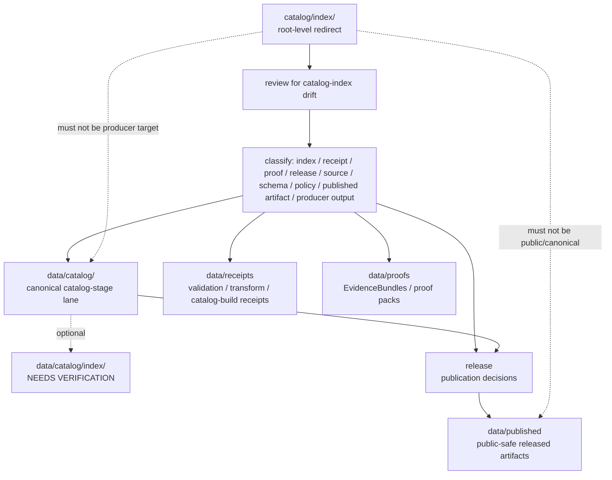

<!-- [KFM_META_BLOCK_V2]
doc_id: kfm://doc/catalog-index-readme
title: catalog/index/ — Catalog Index Compatibility Redirect
type: readme
version: v0.2
status: draft
owners: OWNER_TBD — Catalog steward · Data steward · Index steward · Source steward · Evidence steward · Release steward · Schema steward · Policy steward · Docs steward
created: 2026-06-16
updated: 2026-07-09
policy_label: public
related:
  - ../README.md
  - ../../data/README.md
  - ../../data/catalog/README.md
  - ../../data/catalog/stac/README.md
  - ../../data/catalog/dcat/README.md
  - ../../data/catalog/prov/README.md
  - ../../data/triplets/README.md
  - ../../data/receipts/README.md
  - ../../data/proofs/README.md
  - ../../data/published/README.md
  - ../../data/registry/README.md
  - ../../release/README.md
  - ../../schemas/contracts/v1/
  - ../../contracts/
  - ../../policy/
  - ../../docs/doctrine/directory-rules.md
tags: [kfm, catalog, index, compatibility-root, redirect, data-catalog, catalog-index, non-authoritative, drift-fence, no-trust-records, no-public-use]
notes:
  - "Refreshes the root-level catalog/index compatibility-redirect fence."
  - "Root-level catalog/index/ is treated as compatibility and drift-control documentation only, not canonical catalog-index authority."
  - "Canonical catalog index material belongs under the governed data catalog tree, currently data/catalog/; a dedicated data/catalog/index/ sublane was not found on main during this revision and remains NEEDS VERIFICATION until created or accepted."
  - "Do not add catalog indexes, lookup tables, search indexes, source indexes, STAC/DCAT/PROV indexes, receipts, proofs, release records, policy rules, schemas, published artifacts, generated search manifests, or producer outputs here without an ADR/migration note."
  - "Actual current contents beyond this README, historical producers, workflow writes, migration status, canonical sublane acceptance, CI/review enforcement, and ADR disposition remain NEEDS VERIFICATION."
  - "v0.2 adds current evidence basis, Directory Rules placement basis, canonical data/catalog alignment, explicit data/catalog/index absence on main, minimum safe redirect slice, anti-bypass matrix, no-producer/no-public-use/no-trust-record safeguards, migration/rollback posture, and safe language rules without claiming migration or enforcement maturity."
[/KFM_META_BLOCK_V2] -->

<a id="top"></a>

<div align="center">

# Catalog Index Compatibility Redirect

`catalog/index/`

**Root-level compatibility and drift-control fence for legacy or accidental catalog-index placement. Canonical KFM catalog indexes belong under the governed `data/catalog/` lifecycle tree, not under this root-level folder.**


[Evidence](#0-evidence-basis-for-this-revision) · [Purpose](#1-purpose) · [Canonical home](#2-canonical-home) · [Boundary](#3-authority-boundary) · [Allowed](#5-allowed-contents) · [Forbidden](#6-forbidden-contents) · [Migration](#10-migration-posture) · [Definition of done](#17-definition-of-done)

</div>

---

> [!IMPORTANT]
> **Status:** draft / `NEEDS VERIFICATION`  
> **Path:** `catalog/index/README.md`  
> **Responsibility root:** compatibility redirect / drift fence only  
> **Canonical catalog-index home:** `data/catalog/` unless an accepted sublane such as `data/catalog/index/` is created and verified  
> **Directory Rules basis:** file location encodes ownership, governance, and lifecycle. Catalog indexes are lifecycle catalog records, so canonical index material belongs under the governed `data/catalog/` tree. Root-level `catalog/index/` is a compatibility redirect only; it must not become a parallel catalog, schema, policy, proof, receipt, release, source-registry, published-artifact, pipeline, package, tool, search, or UI authority.  
> **Truth posture:** CONFIRMED current GitHub README path / CONFIRMED parent root-level `catalog/README.md` exists and treats `catalog/` as compatibility redirect / CONFIRMED canonical `data/catalog/README.md` exists and treats catalog as CATALOG-stage data including catalog indexes / CONFIRMED `data/catalog/index/README.md` was not found on `main` during this revision / CONFIRMED Directory Rules document exists / PROPOSED root-level `catalog/index/` redirect contract / UNKNOWN actual files beyond README, historical producers, workflow writes, migration status, canonical sublane acceptance, CI/review guard, public-client/index exclusion, and ADR disposition

> [!CAUTION]
> Do not make `catalog/index/` a parallel catalog-index authority. KFM catalog indexes, lookup tables, search indexes, collection summaries, domain/source indexes, publication-state indexes, crosswalk indexes, generated index manifests, and public lookup products must live in governed lifecycle homes, especially `data/catalog/` and downstream `data/published/` after release, with receipts, proofs, release records, schemas, contracts, and policy in their own owning roots.

---

## Quick jump

- [0. Evidence basis for this revision](#0-evidence-basis-for-this-revision)
- [1. Purpose](#1-purpose)
- [2. Canonical home](#2-canonical-home)
- [3. Authority boundary](#3-authority-boundary)
- [4. Default posture](#4-default-posture)
- [5. Allowed contents](#5-allowed-contents)
- [6. Forbidden contents](#6-forbidden-contents)
- [7. Directory shape](#7-directory-shape)
- [8. Minimum safe redirect slice](#8-minimum-safe-redirect-slice)
- [9. Diagram](#9-diagram)
- [10. Migration posture](#10-migration-posture)
- [11. Runtime and producer anti-bypass matrix](#11-runtime-and-producer-anti-bypass-matrix)
- [12. Inspection path](#12-inspection-path)
- [13. Validation expectations](#13-validation-expectations)
- [14. Safe change pattern](#14-safe-change-pattern)
- [15. Rollback and correction posture](#15-rollback-and-correction-posture)
- [16. Safe language rules](#16-safe-language-rules)
- [17. Definition of done](#17-definition-of-done)
- [18. Open verification items](#18-open-verification-items)

---

## 0. Evidence basis for this revision

This README is a documentation boundary, not migration proof and not catalog enforcement proof. The 2026-07-09 revision updates an existing compatibility README and keeps maturity bounded while aligning root-level `catalog/index/` with the canonical `data/catalog/` catalog-stage lane and Directory Rules placement posture.

| Evidence item | Status | What it supports | What it does not prove |
|---|---|---|---|
| `catalog/index/README.md` exists on `main`. | CONFIRMED | This is an existing README update, not a new path proposal. | It does not prove actual contents beyond the README, historical producers, migration status, CI enforcement, public-client exclusion, or ADR disposition. |
| `catalog/README.md` exists and treats root-level `catalog/` as a compatibility redirect, not canonical catalog authority. | CONFIRMED document presence and redirect posture | `catalog/index/` should inherit root-level redirect/fence behavior. | It does not prove all root-level catalog drift has been removed. |
| `data/catalog/README.md` exists and treats `data/catalog/` as CATALOG-stage data with RELEASED ONLY public exposure. It lists catalog indexes as accepted catalog contents. | CONFIRMED lifecycle posture | Canonical catalog index material belongs under the governed data catalog tree. | It does not prove concrete index inventory, validators, receipts, release manifests, or public route behavior. |
| `data/catalog/index/README.md` was not found on `main` during this revision. | CONFIRMED fetch result from current session | A dedicated `data/catalog/index/` sublane must remain `NEEDS VERIFICATION` until created or accepted. | It does not prove a future sublane is invalid or that no index files exist elsewhere under `data/catalog/`. |
| `docs/doctrine/directory-rules.md` exists and states that file location encodes ownership, governance, and lifecycle. | CONFIRMED placement doctrine | Root-level `catalog/index/` must remain a compatibility fence; lifecycle catalog records belong under `data/catalog/`. | It does not prove live repo drift has been fully audited. |

[Back to top](#top)

---

## 1. Purpose

`catalog/index/` is a **root-level compatibility redirect** for catalog-index path drift.

It exists only to prevent accidental, legacy, generated, copied, or externally imported catalog index material from becoming a parallel authority outside the KFM lifecycle data root.

This folder should not be used for canonical:

- catalog indexes or lookup tables;
- generated search indexes or search manifests;
- source indexes, domain indexes, layer indexes, crosswalk indexes, or publication-state indexes;
- STAC, DCAT, PROV, CatalogMatrix, domain-catalog, or release-catalog indexes;
- collection summaries or public discovery indexes;
- receipts, proof records, release records, schemas, policy rules, published artifacts, or producer outputs.

This README does not prove that any catalog index material currently exists here, that migration has been completed, that producer tools avoid this path, that public clients exclude this path, that CI blocks writes here, or that any ADR has finalized long-term retention of this compatibility root.

[Back to top](#top)

---

## 2. Canonical home

Canonical catalog index material belongs under the governed data catalog tree:

```text
data/catalog/
```

A dedicated index sublane may be used only when accepted and verified:

```text
data/catalog/index/   # NEEDS VERIFICATION — README not found on main during this revision
```

The root-level `catalog/index/` directory is a redirect/fence only.

```text
catalog/index/       # compatibility redirect only; do not add catalog index records here
data/catalog/        # canonical catalog-stage lifecycle lane
```

If a future ADR or migration creates `data/catalog/index/`, this README should be updated to cite the accepted target and any migration or producer-configuration evidence.

## 3. Authority boundary

`catalog/index/` has **no canonical catalog-index authority**. It may hold only redirect guidance, migration notes, drift logs, or temporary markers while misplaced catalog index material is reviewed and moved into its proper lifecycle home.

```text
WRONG / LEGACY ROOT                  CANONICAL LIFECYCLE HOME              TRUST SUPPORT HOMES
catalog/index/                  -->  data/catalog/                     -->  data/receipts/
compatibility fence only             catalog indexes / lookup tables        data/proofs/
not authoritative                    release-linked catalog indexes         release/
                                      optional accepted index sublane        data/published/
```

A catalog index outside the governed `data/catalog/` tree should be treated as drift until reviewed and migrated.

## 4. Default posture

Anything found under root-level `catalog/index/` should be treated as **NEEDS VERIFICATION** and potentially misplaced.

Do not expose, publish, index, cite, search, cache, export, tile, embed, or depend on root-level catalog-index files as canonical records. First confirm source, provenance, rights, sensitivity, schema validity, lifecycle state, receipts, proofs, release state, rollback path, correction path, and producer history.

## 5. Allowed contents

| Allowed item | Example | Required posture |
|---|---|---|
| README / redirect docs | `README.md` | Compatibility fence only |
| Migration note | `MIGRATION.md` | Temporary and ADR/review-linked |
| Drift note | `DRIFT.md`, `OPEN-QUESTIONS.md` | Must point to canonical homes and review steps |
| Placeholder marker | `.gitkeep` | Does not authorize index content |

## 6. Forbidden contents

| Forbidden here | Correct home |
|---|---|
| Catalog indexes, lookup tables, search indexes, collection summaries | `data/catalog/` or an accepted sublane under it |
| Domain, source, layer, STAC, DCAT, PROV, CatalogMatrix, publication-state, or crosswalk indexes | `data/catalog/` under their proper family lanes |
| Generated search manifests or public discovery indexes | `data/catalog/` before release, `data/published/` after governed release |
| Catalog-derived public products | `data/published/` after governed release |
| Source descriptors, source registry rows, rights rows, sensitivity rows | `data/registry/` or governed registry homes |
| Receipts, validation reports, redaction/generalization/aggregation receipts | `data/receipts/` |
| EvidenceBundles, proof packs, attestations | `data/proofs/` |
| ReleaseManifest, PromotionDecision, RollbackCard, CorrectionNotice, signatures | `release/` |
| Schemas and machine-shape contracts | `schemas/contracts/v1/` |
| Human contracts and object-meaning docs | `contracts/` |
| Policy rules and policy decisions | `policy/` and governed policy-decision homes |
| Source code, scripts, packages, pipelines, build tools, producers | `apps/`, `packages/`, `tools/`, `scripts/`, `pipelines/`, `pipeline_specs/` |
| Raw, work, quarantine, processed, catalog, triplet, or published lifecycle data | `data/` lifecycle subtrees |

## 7. Directory shape

Current implementation inventory remains `NEEDS VERIFICATION`.

```text
catalog/index/
├── README.md                 # compatibility redirect / drift fence
├── MIGRATION.md              # PROPOSED only if migration is active
└── DRIFT.md                  # PROPOSED only if misplaced catalog index material is found
```

> [!WARNING]
> Do not treat this suggested shape as repo fact. Verify actual contents before making inventory, producer, enforcement, or migration claims.

## 8. Minimum safe redirect slice

A smallest safe `catalog/index/` state should prove only that the folder prevents drift; it should not contain trust-bearing material.

| Slice item | Minimum requirement | Why it matters |
|---|---|---|
| Redirect README | Points to `data/catalog/` as canonical | Prevents parallel authority |
| No catalog index records | No durable lookup, search, source, domain, STAC/DCAT/PROV, CatalogMatrix, crosswalk, or publication-state index files | Keeps catalog records in lifecycle root |
| No trust support records | No receipts, proofs, releases, registry rows, policy rules, schemas, contracts, or published artifacts | Preserves responsibility roots |
| Drift procedure | Explains how to inspect and migrate misplaced indexes | Keeps remediation reversible |
| Producer guard | Producers, generators, scripts, and CI should not write durable indexes here | Prevents reintroducing drift |
| Public-use guard | Public clients, search services, map runtimes, exports, and indexes must not read from this path as canonical | Preserves governed access path |
| Sublane guard | `data/catalog/index/` remains `NEEDS VERIFICATION` until accepted and present | Avoids inventing canonical structure |
| Verification backlog | Open items stay visible | Prevents documentation from pretending migration/enforcement is complete |

## 9. Diagram



## 10. Migration posture

If catalog index files are found here:

1. Do not publish, cite, index, search, cache, export, tile, or depend on them.
2. Identify whether they are lookup tables, search indexes, domain/source indexes, STAC/DCAT/PROV indexes, CatalogMatrix records, crosswalks, publication-state indexes, receipts, proofs, release records, source registry rows, schemas, policy records, published-output material, generated previews, temporary build artifacts, or producer outputs.
3. Determine whether the file is historical drift, generated drift, copied output, unreviewed local work, or an intentional migration marker.
4. Move or regenerate durable catalog indexes into `data/catalog/` or an accepted, verified sublane under it.
5. Move receipts, proofs, release records, published artifacts, schemas, contracts, policy, source descriptors, and producer code into their owning roots.
6. Preserve provenance, source refs, digests, receipts, review notes, producer identity, and rollback path.
7. Add a drift register, migration note, or correction note if the misplaced material was previously consumed.
8. Add or update validation checks so producers do not recreate root-level catalog-index drift.
9. Leave `catalog/index/` as a redirect/fence unless an accepted ADR explicitly changes the authority model.

## 11. Runtime and producer anti-bypass matrix

| Bypass risk | Required behavior | Review signal |
|---|---|---|
| Producer writes catalog indexes to `catalog/index/` | Fail review/CI; write to `data/catalog/` or accepted sublane instead | Generator config and output paths checked |
| Public client reads root-level index | Deny; route through governed catalog/release path | Client/search/index config excludes this path |
| Root-level index is treated as canonical | Mark as drift and migrate/regenerate | Migration note references canonical target |
| `data/catalog/index/` is claimed canonical before it exists | Keep `NEEDS VERIFICATION` until path and README are accepted | Current fetch or PR evidence cited |
| Receipts/proofs/release records stored here | Move to owning roots | Directory review blocks trust support records |
| Schema/profile file stored here | Move to `schemas/` or standards docs as appropriate | Schema-home review passes |
| Policy rule stored here | Move to `policy/` | Policy-root review passes |
| Published artifact stored here | Move to `data/published/` after release gate | Release/publication review passes |
| Search/cache/export pipeline consumes this path | Deny as canonical; switch to governed catalog/release source | Producer and client config reviewed |
| Drift file already consumed downstream | Add correction/migration note and rollback path | Correction path is auditable |
| README claims CI enforcement without run/check evidence | Mark enforcement `NEEDS VERIFICATION` | Current CI evidence cited before pass claims |

## 12. Inspection path

Actual root-level contents, producers, workflow writes, migration status, canonical sublane acceptance, CI/review enforcement, public-client/index exclusion, and current ADR disposition remain `NEEDS VERIFICATION`.

```bash
find catalog/index -maxdepth 6 -type f | sort
find data/catalog data/receipts data/proofs data/published data/registry release schemas contracts policy docs tools scripts pipelines pipeline_specs .github/workflows -maxdepth 6 -type f 2>/dev/null | grep -Ei 'catalog|index|lookup|search|collection|summary|crosswalk|CatalogBuildReceipt|CatalogMatrix|ReleaseManifest|EvidenceBundle|RunReceipt|SourceDescriptor|stac|dcat|prov|schema|policy|validator|publish|workflow|migration|drift' | sort
```

## 13. Validation expectations

Useful validation for this folder should cover:

- no catalog indexes, lookup tables, search indexes, collection summaries, crosswalk indexes, or publication-state indexes are stored here;
- no STAC, DCAT, PROV, CatalogMatrix, or domain catalog records are stored here;
- no receipts, proofs, release records, registry records, policy rules, schemas, source code, pipelines, tools, producer outputs, or published artifacts are stored here;
- any non-README content is tied to an active migration, drift note, or placeholder marker;
- producer tools, scripts, generated outputs, workflows, indexes, search services, public clients, exports, tile jobs, and map runtimes do not target `catalog/index/` as canonical;
- links point users to `data/catalog/` and other owning roots;
- CI or review checks flag root-level `catalog/index/` writes when enforcement exists;
- CI/pass/enforcement state is not claimed without current evidence.

## 14. Safe change pattern

For changes under `catalog/index/`:

1. Confirm the change is redirect documentation, migration support, drift documentation, or a non-authoritative placeholder only.
2. Confirm it does not create a parallel catalog-index authority.
3. Confirm durable catalog indexes are placed under `data/catalog/` or an accepted and verified sublane.
4. Confirm receipts, proofs, release records, registry records, schemas, contracts, policy rules, published artifacts, and code are placed under their owning roots.
5. Confirm no public client, search index, map runtime, export job, tile job, story/focus/evidence surface, catalog producer, or cache reads this path as canonical.
6. Document migration, correction, and rollback if any misplaced material was moved or previously consumed.
7. Update docs and validation rules when behavior materially changes.

## 15. Rollback and correction posture

If material was added here by mistake, rollback should be small and auditable:

- remove or revert the misplaced file from `catalog/index/`;
- regenerate or move durable catalog indexes into `data/catalog/` through a governed migration;
- preserve digest/provenance notes for anything already referenced;
- add a correction note if public, semi-public, generated downstream, search, export, or cache artifacts consumed the misplaced path;
- update producer configuration and tests so the drift is not recreated.

## 16. Safe language rules

Use these terms carefully:

| Phrase | Allowed here? | Safer wording |
|---|---:|---|
| "canonical index in `catalog/index/`" | No | "misplaced or legacy catalog index requiring review" |
| "published from `catalog/index/`" | No | "published only after release via canonical lifecycle path" |
| "CI blocks this" | Only with current evidence | "CI guard remains NEEDS VERIFICATION" |
| "migration complete" | Only with migration evidence | "migration status remains NEEDS VERIFICATION" |
| "safe to consume" | Only after release/access evidence | "do not consume as canonical from this path" |
| "`data/catalog/index/` exists" | Only with path evidence | "dedicated index sublane remains NEEDS VERIFICATION" |

## 17. Definition of done

- [ ] Owners are confirmed and `OWNER_TBD` is replaced.
- [ ] Actual root-level `catalog/index/` contents are verified.
- [ ] Any misplaced catalog index material is migrated, removed, regenerated under `data/catalog/`, or documented as drift.
- [ ] Canonical catalog index placement under `data/catalog/` or an accepted sublane is documented with evidence.
- [ ] `data/catalog/index/` existence/absence is verified before being referenced as canonical.
- [ ] No trust-bearing records live here.
- [ ] No catalog indexes, STAC/DCAT/PROV/CatalogMatrix records, registry records, receipts, proofs, release records, published artifacts, schemas, contracts, policy rules, source code, producer outputs, or lifecycle data live here.
- [ ] No public client, search index, map runtime, export job, tile job, catalog producer, story/focus/evidence surface, or cache uses this path as canonical.
- [ ] CI/review behavior is verified or marked `NEEDS VERIFICATION`.

## 18. Open verification items

| Item | Why it matters |
|---|---|
| Confirm actual files under root-level `catalog/index/` | Prevents overclaiming or missing drift |
| Confirm whether any workflow writes here | Required before producer claims |
| Confirm accepted canonical catalog-index placement | Required before final migration claims |
| Confirm whether `data/catalog/index/` should exist | Required before sublane creation or references harden |
| Confirm migration status to `data/catalog/` | Required before canonical-home claims beyond doctrine |
| Confirm CI/review guard exists | Required before enforcement claims |
| Confirm public clients/search/export/tile jobs do not consume this path | Required before safety claims |
| Confirm no trust records are stored here | Required before Directory Rules compliance claims |
| Confirm ADR status for root-level `catalog/index/` | Required before long-term retention claims |

<details>
<summary>Appendix A — no-loss preservation note</summary>

The previous README already contained a bounded catalog-index redirect and anti-parallel-authority contract. This revision preserves that contract, refreshes metadata, adds a current evidence-basis section, adds Directory Rules placement posture, records that `data/catalog/index/README.md` was not found on `main`, strengthens canonical `data/catalog/` alignment, minimum safe redirect slice, producer/public-use anti-bypass safeguards, no-trust-record safeguards, migration/rollback guidance, safe language rules, and validation expectations, and keeps implementation/migration/enforcement claims bounded. It does not claim catalog index files, migration work, CI enforcement, producer workflow behavior, public-client exclusion, canonical sublane acceptance, or ADR disposition are implemented.

</details>

## Status summary

`catalog/index/` is a root-level compatibility redirect and catalog-index drift fence. It is not the canonical catalog-index home.

Catalog index authority belongs under the governed `data/catalog/` tree; a dedicated `data/catalog/index/` sublane remains `NEEDS VERIFICATION` until accepted and present. Trust-bearing support belongs under `data/receipts/`, `data/proofs/`, and `release/`; released public-safe products belong under `data/published/`.

<p align="right"><a href="#top">Back to top</a></p>
