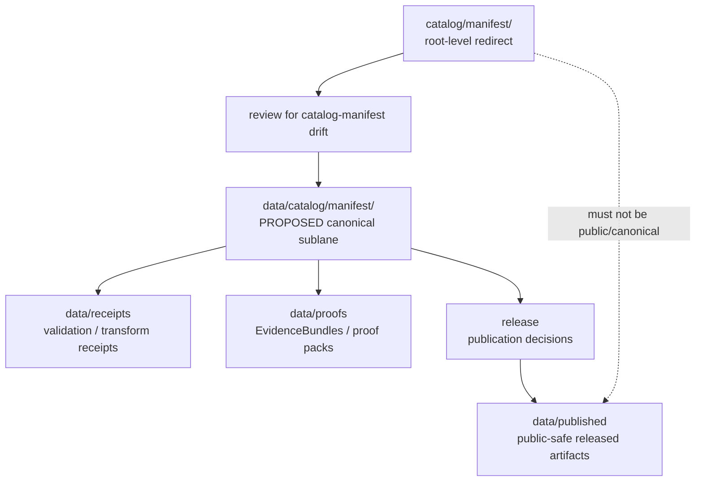

<!-- [KFM_META_BLOCK_V2]
doc_id: kfm://doc/catalog-manifest-readme
title: catalog/manifest/ — Catalog Manifest Compatibility Redirect
type: readme
version: v0.1
status: draft
owners: OWNER_TBD — Catalog steward · Data steward · Source steward · Docs steward
created: 2026-06-16
updated: 2026-06-16
policy_label: public
related:
  - ../README.md
  - ../../data/README.md
  - ../../data/catalog/README.md
  - ../../data/receipts/README.md
  - ../../data/proofs/README.md
  - ../../data/published/README.md
  - ../../data/registry/README.md
  - ../../release/README.md
  - ../../schemas/contracts/v1/
  - ../../contracts/
  - ../../policy/
  - ../../docs/doctrine/directory-rules.md
tags: [kfm, catalog, manifest, compatibility-root, redirect, data-catalog, catalog-manifest, non-authoritative, drift-fence]
notes:
  - "Root-level catalog/manifest/ is treated as a compatibility/redirect fence, not canonical catalog-manifest authority."
  - "Canonical catalog manifest material should be placed under the governed data catalog tree, currently data/catalog/ with a possible data/catalog/manifest/ sublane if accepted and verified."
  - "ReleaseManifest and release-decision records belong under release/, not under catalog/manifest/."
  - "Do not add catalog manifests, source manifests, receipts, proofs, release records, or published artifacts here without an ADR/migration note."
  - "Specific current contents, producers, canonical sublane acceptance, migration status, and CI enforcement remain NEEDS VERIFICATION."
[/KFM_META_BLOCK_V2] -->

<a id="top"></a>

<div align="center">

# Catalog Manifest Compatibility Redirect

`catalog/manifest/`

**Compatibility / redirect fence for legacy or accidental root-level catalog-manifest placement. Canonical catalog manifest material belongs under the governed `data/catalog/` tree, not this root-level `catalog/manifest/` folder.**


[Purpose](#1-purpose) · [Canonical home](#2-canonical-home) · [Authority boundary](#3-authority-boundary) · [Allowed contents](#5-allowed-contents) · [Forbidden contents](#6-forbidden-contents) · [Migration](#9-migration-posture) · [Definition of done](#12-definition-of-done)

</div>

---

> [!IMPORTANT]
> **Status:** draft / `NEEDS VERIFICATION`  
> **Path:** `catalog/manifest/README.md`  
> **Responsibility root:** compatibility redirect / drift fence only  
> **Canonical catalog manifest home:** `data/catalog/` with `data/catalog/manifest/` as a PROPOSED sublane until accepted and verified  
> **Truth posture:** CONFIRMED README path / CONFIRMED root-level `catalog/` is a compatibility redirect / CONFIRMED `data/` lifecycle root lists `catalog` as belonging under `data/` / PROPOSED catalog-manifest redirect contract / UNKNOWN current manifest files, canonical sublane acceptance, historical producers, migration status, CI enforcement, and ADR disposition

> [!CAUTION]
> Do not make `catalog/manifest/` a parallel catalog-manifest authority. KFM catalog manifests, source manifests, catalog inventories, publication-state inventories, and crosswalk manifests must live in the governed data lifecycle path, especially `data/catalog/`, with receipts/proofs/release records in their own canonical roots. ReleaseManifest records belong under `release/`.

---

## 1. Purpose

`catalog/manifest/` is a **root-level compatibility redirect** for catalog-manifest path drift.

It exists only to prevent accidental or legacy catalog manifest material from becoming a parallel authority outside the KFM lifecycle data root. This folder should not be used for canonical catalog manifests, source manifests, inventory manifests, STAC/DCAT/PROV manifests, publication-state manifests, release manifests, or public products.

This README does not prove that any catalog manifest material currently exists here, that a canonical manifest sublane has been accepted, that a migration has been completed, or that CI currently blocks writes to this path.

[Back to top](#top)

---

## 2. Canonical home

Canonical catalog manifest material should live under the governed data catalog tree:

```text
data/catalog/
```

A dedicated catalog-manifest sublane may be used when accepted and verified:

```text
data/catalog/manifest/   # PROPOSED canonical sublane; NEEDS VERIFICATION
```

Release decision manifests are different objects and belong under:

```text
release/
```

The root-level `catalog/manifest/` directory is a redirect/fence only.

## 3. Authority boundary

`catalog/manifest/` has **no canonical catalog-manifest authority**. It may hold only README guidance, migration notes, drift logs, or temporary redirect markers while catalog manifest material is moved into its proper lifecycle home.

```text
WRONG / LEGACY ROOT                  CANONICAL LIFECYCLE HOME                  TRUST SUPPORT HOMES
catalog/manifest/               -->  data/catalog/manifest/              -->  data/receipts/
compatibility fence only              or data/catalog/                         data/proofs/
not authoritative                     catalog manifests / inventories          release/
                                                                                 data/published/
```

A catalog manifest outside the governed `data/catalog/` tree should be treated as drift until reviewed and migrated.

## 4. Default posture

Anything found under root-level `catalog/manifest/` should be treated as **NEEDS VERIFICATION** and potentially misplaced.

Do not expose, publish, index, cite, or depend on root-level catalog manifest files as canonical records. First confirm source, provenance, rights, sensitivity, schema validity, lifecycle state, receipts, proofs, release state, rollback path, and correction path.

## 5. Allowed contents

| Allowed item | Example | Required posture |
|---|---|---|
| README / redirect docs | `README.md` | Compatibility fence only |
| Migration note | `MIGRATION.md` | Temporary and ADR/review-linked |
| Drift note | `DRIFT.md`, `OPEN-QUESTIONS.md` | Must point to canonical homes and review steps |
| Placeholder marker | `.gitkeep` | Does not authorize manifest content |

## 6. Forbidden contents

| Forbidden here | Correct home |
|---|---|
| Catalog manifests, source manifests, inventory manifests, publication-state manifests | `data/catalog/` or an accepted sublane under it |
| STAC, DCAT, or PROV manifests and catalog-family manifests | `data/catalog/` under their proper family lanes |
| Catalog-derived public products | `data/published/` after governed release |
| Source descriptors, source registry rows, rights rows, sensitivity rows | `data/registry/` or governed registry homes |
| Receipts, validation reports, redaction receipts | `data/receipts/` |
| EvidenceBundles, proof packs, attestations | `data/proofs/` |
| ReleaseManifest, PromotionDecision, RollbackCard, CorrectionNotice, signatures | `release/` |
| Schemas and machine-shape contracts | `schemas/contracts/v1/` |
| Human contracts and object-meaning docs | `contracts/` |
| Policy rules and policy decisions | `policy/` and governed policy-decision homes |
| Source code, scripts, packages, pipelines, build tools | `apps/`, `packages/`, `tools/`, `scripts/`, `pipelines/` |
| Raw, work, quarantine, processed, or published lifecycle data | `data/` lifecycle subtrees |

## 7. Directory shape

Current implementation inventory remains `NEEDS VERIFICATION`.

```text
catalog/manifest/
├── README.md                 # compatibility redirect / drift fence
├── MIGRATION.md              # PROPOSED only if migration is active
└── DRIFT.md                  # PROPOSED only if misplaced catalog manifest material is found
```

> [!WARNING]
> Do not treat this suggested shape as repo fact. Verify actual contents before making inventory or migration claims.

## 8. Diagram



## 9. Migration posture

If catalog manifest files are found here:

1. Do not publish or depend on them.
2. Identify whether they are catalog manifests, source manifests, inventory manifests, STAC/DCAT/PROV manifests, receipts, proofs, release records, source registry rows, or published-output material.
3. Check sensitivity, rights, and redaction/generalization requirements before moving or exposing anything.
4. Move or regenerate them into the correct owning root through a governed migration.
5. Normalize canonical placement to `data/catalog/` or an accepted `data/catalog/manifest/` sublane.
6. Preserve provenance, source refs, digests, receipts, review notes, and rollback path.
7. Add a drift register or migration note if the material has already been consumed.
8. Leave root-level `catalog/manifest/` as a redirect/fence unless an ADR explicitly says otherwise.

## 10. Validation expectations

Useful validation for this folder should cover:

- no catalog manifests, source manifests, inventory manifests, or catalog-family manifests are stored here;
- no ReleaseManifest, receipts, proofs, registry records, policy rules, schemas, source code, or published artifacts are stored here;
- any non-README content is tied to an active migration or drift note;
- CI or review checks flag root-level `catalog/manifest/` writes;
- links point users to `data/catalog/`, `release/`, and other canonical homes.

## 11. Safe change pattern

For changes under `catalog/manifest/`:

1. Confirm the change is redirect documentation, migration support, or drift documentation only.
2. Confirm it does not create a parallel catalog-manifest authority.
3. Confirm durable catalog manifest records are placed under the governed `data/catalog/` tree.
4. Confirm ReleaseManifest records remain under `release/`.
5. Confirm receipts/proofs/release records are placed under their owning roots.
6. Document migration and rollback if any misplaced material was moved.
7. Update docs and validation rules when behavior materially changes.

## 12. Definition of done

- [ ] Owners are confirmed and `OWNER_TBD` is replaced.
- [ ] Actual root-level `catalog/manifest/` contents are verified.
- [ ] Any misplaced catalog manifest material is migrated or documented as drift.
- [ ] Canonical catalog manifest placement under `data/catalog/` is accepted and documented.
- [ ] No trust-bearing records live here.
- [ ] No catalog manifests, STAC/DCAT/PROV manifests, registry records, receipts, proofs, release records, published artifacts, schemas, contracts, policy rules, source code, or lifecycle data live here.
- [ ] CI/review behavior is verified or marked `NEEDS VERIFICATION`.

## 13. Open verification items

| Item | Why it matters |
|---|---|
| Confirm actual files under root-level `catalog/manifest/` | Prevents overclaiming or missing drift |
| Confirm whether any workflow writes here | Required before producer claims |
| Confirm accepted canonical catalog-manifest placement | Required before final migration claims |
| Confirm migration status to `data/catalog/` | Required before canonical-home claims beyond doctrine |
| Confirm CI/review guard exists | Required before enforcement claims |
| Confirm no trust records are stored here | Required before Directory Rules compliance claims |
| Confirm ADR status for root-level `catalog/manifest/` | Required before long-term retention claims |

<details>
<summary>Appendix A — no-loss preservation note</summary>

The previous README was empty. This replacement adds a catalog-manifest redirect and anti-parallel-authority contract without claiming catalog manifest files, migration work, CI enforcement, producer workflows, canonical sublane acceptance, or ADR disposition are implemented.

</details>

## Status summary

`catalog/manifest/` is a root-level compatibility redirect and catalog-manifest drift fence. It is not the canonical catalog-manifest home.

Catalog manifest authority belongs under the governed `data/catalog/` tree; release decision manifests belong under `release/`; trust-bearing support belongs under `data/receipts/`, `data/proofs/`, and `release/`; released public-safe products belong under `data/published/`.

<p align="right"><a href="#top">Back to top</a></p>
