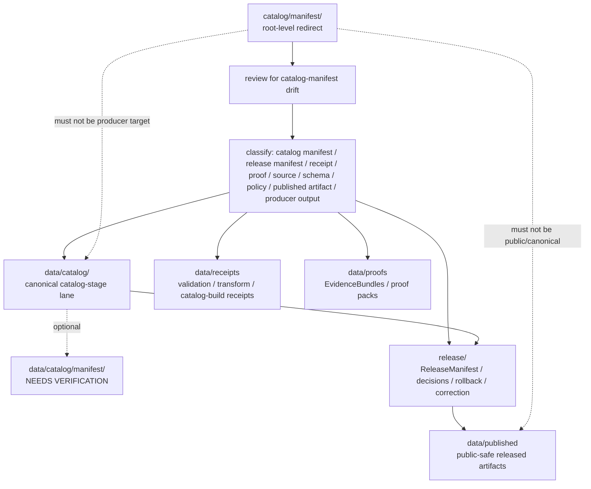

<!-- [KFM_META_BLOCK_V2]
doc_id: kfm://doc/catalog-manifest-readme
title: catalog/manifest/ — Catalog Manifest Compatibility Redirect
type: readme
version: v0.2
status: draft
owners: OWNER_TBD — Catalog steward · Data steward · Manifest steward · Source steward · Evidence steward · Release steward · Schema steward · Policy steward · Docs steward
created: 2026-06-16
updated: 2026-07-09
policy_label: public
related:
  - ../README.md
  - ../../data/README.md
  - ../../data/catalog/README.md
  - ../../data/catalog/stac/README.md
  - ../../data/catalog/dcat/README.md
  - ../../data/catalog/prov/README.md
  - ../../data/triplets/README.md
  - ../../data/receipts/README.md
  - ../../data/proofs/README.md
  - ../../data/published/README.md
  - ../../data/registry/README.md
  - ../../release/README.md
  - ../../schemas/contracts/v1/
  - ../../contracts/
  - ../../policy/
  - ../../docs/doctrine/directory-rules.md
tags: [kfm, catalog, manifest, compatibility-root, redirect, data-catalog, catalog-manifest, release-manifest-boundary, non-authoritative, drift-fence, no-trust-records, no-public-use]
notes:
  - "Refreshes the root-level catalog/manifest compatibility-redirect fence."
  - "Root-level catalog/manifest/ is treated as compatibility and drift-control documentation only, not canonical catalog-manifest authority."
  - "Canonical catalog manifest material belongs under the governed data catalog tree, currently data/catalog/; a dedicated data/catalog/manifest/ sublane was not found on main during this revision and remains NEEDS VERIFICATION until created or accepted."
  - "ReleaseManifest and release-decision manifests are separate release-governance records and belong under release/, not catalog/manifest/."
  - "Do not add catalog manifests, source manifests, inventory manifests, STAC/DCAT/PROV manifests, receipts, proofs, release records, policy rules, schemas, published artifacts, generated manifests, or producer outputs here without an ADR/migration note."
  - "Actual current contents beyond this README, historical producers, workflow writes, migration status, canonical sublane acceptance, CI/review enforcement, and ADR disposition remain NEEDS VERIFICATION."
  - "v0.2 adds current evidence basis, Directory Rules placement basis, canonical data/catalog alignment, explicit data/catalog/manifest absence on main, release-manifest boundary, minimum safe redirect slice, anti-bypass matrix, no-producer/no-public-use/no-trust-record safeguards, migration/rollback posture, and safe language rules without claiming migration or enforcement maturity."
[/KFM_META_BLOCK_V2] -->

<a id="top"></a>

<div align="center">

# Catalog Manifest Compatibility Redirect

`catalog/manifest/`

**Root-level compatibility and drift-control fence for legacy or accidental catalog-manifest placement. Canonical KFM catalog manifests belong under the governed `data/catalog/` lifecycle tree, while release decision manifests belong under `release/`.**


[Evidence](#0-evidence-basis-for-this-revision) · [Purpose](#1-purpose) · [Canonical home](#2-canonical-home) · [Boundary](#3-authority-boundary) · [Allowed](#5-allowed-contents) · [Forbidden](#6-forbidden-contents) · [Migration](#10-migration-posture) · [Definition of done](#17-definition-of-done)

</div>

---

> [!IMPORTANT]
> **Status:** draft / `NEEDS VERIFICATION`  
> **Path:** `catalog/manifest/README.md`  
> **Responsibility root:** compatibility redirect / drift fence only  
> **Canonical catalog-manifest home:** `data/catalog/` unless an accepted sublane such as `data/catalog/manifest/` is created and verified  
> **Release decision manifest home:** `release/`  
> **Directory Rules basis:** file location encodes ownership, governance, and lifecycle. Catalog manifests are lifecycle catalog records, so canonical catalog-manifest material belongs under the governed `data/catalog/` tree. ReleaseManifest and release decision manifests belong under `release/`. Root-level `catalog/manifest/` is a compatibility redirect only; it must not become a parallel catalog, schema, policy, proof, receipt, release, source-registry, published-artifact, pipeline, package, tool, manifest, search, or UI authority.  
> **Truth posture:** CONFIRMED current GitHub README path / CONFIRMED parent root-level `catalog/README.md` exists and treats `catalog/` as compatibility redirect / CONFIRMED canonical `data/catalog/README.md` exists and treats catalog as CATALOG-stage data including release-linked catalog manifests / CONFIRMED `data/catalog/manifest/README.md` was not found on `main` during this revision / CONFIRMED `release/README.md` exists and treats `release/` as release-governance root with manifest lanes / CONFIRMED Directory Rules document exists / PROPOSED root-level `catalog/manifest/` redirect contract / UNKNOWN actual files beyond README, historical producers, workflow writes, migration status, canonical sublane acceptance, CI/review guard, public-client/producer exclusion, and ADR disposition

> [!CAUTION]
> Do not make `catalog/manifest/` a parallel catalog-manifest or release-manifest authority. KFM catalog manifests, inventory manifests, source manifests, publication-state manifests, crosswalk manifests, generated manifest indexes, and public lookup products must live in governed lifecycle homes, especially `data/catalog/` and downstream `data/published/` after release. ReleaseManifest, PromotionDecision, RollbackCard, CorrectionNotice, signatures, and release decisions must live under `release/`. Receipts, proofs, schemas, contracts, and policy stay in their own owning roots.

---

## Quick jump

- [0. Evidence basis for this revision](#0-evidence-basis-for-this-revision)
- [1. Purpose](#1-purpose)
- [2. Canonical home](#2-canonical-home)
- [3. Authority boundary](#3-authority-boundary)
- [4. Default posture](#4-default-posture)
- [5. Allowed contents](#5-allowed-contents)
- [6. Forbidden contents](#6-forbidden-contents)
- [7. Directory shape](#7-directory-shape)
- [8. Minimum safe redirect slice](#8-minimum-safe-redirect-slice)
- [9. Diagram](#9-diagram)
- [10. Migration posture](#10-migration-posture)
- [11. Runtime and producer anti-bypass matrix](#11-runtime-and-producer-anti-bypass-matrix)
- [12. Inspection path](#12-inspection-path)
- [13. Validation expectations](#13-validation-expectations)
- [14. Safe change pattern](#14-safe-change-pattern)
- [15. Rollback and correction posture](#15-rollback-and-correction-posture)
- [16. Safe language rules](#16-safe-language-rules)
- [17. Definition of done](#17-definition-of-done)
- [18. Open verification items](#18-open-verification-items)

---

## 0. Evidence basis for this revision

This README is a documentation boundary, not migration proof and not catalog enforcement proof. The 2026-07-09 revision updates an existing compatibility README and keeps maturity bounded while aligning root-level `catalog/manifest/` with the canonical `data/catalog/` catalog-stage lane, the separate `release/` manifest authority, and Directory Rules placement posture.

| Evidence item | Status | What it supports | What it does not prove |
|---|---|---|---|
| `catalog/manifest/README.md` exists on `main`. | CONFIRMED | This is an existing README update, not a new path proposal. | It does not prove actual contents beyond the README, historical producers, migration status, CI enforcement, public-client exclusion, or ADR disposition. |
| `catalog/README.md` exists and treats root-level `catalog/` as a compatibility redirect, not canonical catalog authority. | CONFIRMED document presence and redirect posture | `catalog/manifest/` should inherit root-level redirect/fence behavior. | It does not prove all root-level catalog drift has been removed. |
| `data/catalog/README.md` exists and treats `data/catalog/` as CATALOG-stage data with RELEASED ONLY public exposure. It lists release-linked catalog manifests as accepted catalog contents. | CONFIRMED lifecycle posture | Canonical catalog manifest material belongs under the governed data catalog tree. | It does not prove concrete manifest inventory, validators, receipts, release manifests, or public route behavior. |
| `data/catalog/manifest/README.md` was not found on `main` during this revision. | CONFIRMED fetch result from current session | A dedicated `data/catalog/manifest/` sublane must remain `NEEDS VERIFICATION` until created or accepted. | It does not prove a future sublane is invalid or that no manifest files exist elsewhere under `data/catalog/`. |
| `release/README.md` exists and treats `release/` as release-governance root with manifest lanes. | CONFIRMED release-root posture | ReleaseManifest and release decision records belong under `release/`, not root-level `catalog/manifest/`. | It does not prove release manifest lane convention, singular/plural lane choice, or release workflow maturity is finalized. |
| `docs/doctrine/directory-rules.md` exists and states that file location encodes ownership, governance, and lifecycle. | CONFIRMED placement doctrine | Root-level `catalog/manifest/` must remain a compatibility fence; lifecycle catalog records belong under `data/catalog/`, while release governance records belong under `release/`. | It does not prove live repo drift has been fully audited. |

[Back to top](#top)

---

## 1. Purpose

`catalog/manifest/` is a **root-level compatibility redirect** for catalog-manifest path drift.

It exists only to prevent accidental, legacy, generated, copied, or externally imported catalog manifest material from becoming a parallel authority outside the KFM lifecycle data root or release-governance root.

This folder should not be used for canonical:

- catalog manifests or catalog inventory manifests;
- generated catalog manifest indexes or lookup manifests;
- source manifests, domain manifests, layer manifests, crosswalk manifests, or publication-state manifests;
- STAC, DCAT, PROV, CatalogMatrix, domain-catalog, or release-catalog manifests;
- ReleaseManifest, PromotionDecision, RollbackCard, CorrectionNotice, release signatures, or release decision records;
- collection summaries or public discovery manifests;
- receipts, proof records, schemas, policy rules, published artifacts, or producer outputs.

This README does not prove that any catalog manifest material currently exists here, that migration has been completed, that producer tools avoid this path, that public clients exclude this path, that CI blocks writes here, or that any ADR has finalized long-term retention of this compatibility root.

[Back to top](#top)

---

## 2. Canonical home

Canonical catalog manifest material belongs under the governed data catalog tree:

```text
data/catalog/
```

A dedicated manifest sublane may be used only when accepted and verified:

```text
data/catalog/manifest/   # NEEDS VERIFICATION — README not found on main during this revision
```

Release decision manifests are different objects and belong under:

```text
release/
```

The root-level `catalog/manifest/` directory is a redirect/fence only.

```text
catalog/manifest/       # compatibility redirect only; do not add catalog manifest records here
data/catalog/           # canonical catalog-stage lifecycle lane
release/                # release-governance records, including ReleaseManifest lanes
```

If a future ADR or migration creates `data/catalog/manifest/`, this README should be updated to cite the accepted target, producer-configuration evidence, and any migration or rollback records.

## 3. Authority boundary

`catalog/manifest/` has **no canonical catalog-manifest authority** and **no release-manifest authority**. It may hold only redirect guidance, migration notes, drift logs, or temporary markers while misplaced material is reviewed and moved into its proper lifecycle or release home.

```text
WRONG / LEGACY ROOT                    CANONICAL LIFECYCLE HOME              TRUST / RELEASE HOMES
catalog/manifest/                 -->  data/catalog/                     -->  data/receipts/
compatibility fence only               catalog manifests / inventories        data/proofs/
not authoritative                      optional accepted manifest sublane      release/
                                         release-linked catalog pointers        data/published/
```

A catalog manifest outside the governed `data/catalog/` tree should be treated as drift until reviewed and migrated. A ReleaseManifest outside `release/` should be treated as a release-governance drift candidate until reviewed and corrected.

## 4. Default posture

Anything found under root-level `catalog/manifest/` should be treated as **NEEDS VERIFICATION** and potentially misplaced.

Do not expose, publish, index, cite, search, cache, export, tile, or depend on root-level catalog manifest files as canonical records. First confirm source, provenance, rights, sensitivity, schema validity, lifecycle state, receipts, proofs, release state, rollback path, correction path, and whether the object is actually a catalog manifest or a release-governance manifest.

## 5. Allowed contents

| Allowed item | Example | Required posture |
|---|---|---|
| README / redirect docs | `README.md` | Compatibility fence only |
| Migration note | `MIGRATION.md` | Temporary and ADR/review-linked |
| Drift note | `DRIFT.md`, `OPEN-QUESTIONS.md` | Must point to canonical homes and review steps |
| Placeholder marker | `.gitkeep` | Does not authorize manifest content |

## 6. Forbidden contents

| Forbidden here | Correct home |
|---|---|
| Catalog manifests, inventory manifests, lookup manifests, publication-state manifests | `data/catalog/` or an accepted sublane under it |
| STAC, DCAT, PROV, CatalogMatrix, domain-catalog, or catalog-family manifests | `data/catalog/` under their proper family lanes |
| ReleaseManifest, PromotionDecision, RollbackCard, CorrectionNotice, release signatures, release decisions | `release/` |
| Catalog-derived public products | `data/published/` after governed release |
| Source descriptors, source registry rows, rights rows, sensitivity rows | `data/registry/` or governed registry homes |
| Receipts, validation reports, redaction receipts, catalog-build receipts | `data/receipts/` |
| EvidenceBundles, proof packs, attestations | `data/proofs/` |
| Schemas and machine-shape contracts | `schemas/contracts/v1/` |
| Human contracts and object-meaning docs | `contracts/` |
| Policy rules and policy decisions | `policy/` and governed policy-decision homes |
| Source code, scripts, packages, pipelines, build tools, producers | `apps/`, `packages/`, `tools/`, `scripts/`, `pipelines/` |
| Raw, work, quarantine, processed, catalog, triplet, or published lifecycle data | `data/` lifecycle subtrees |

## 7. Directory shape

Current implementation inventory remains `NEEDS VERIFICATION`.

```text
catalog/manifest/
├── README.md                 # compatibility redirect / drift fence
├── MIGRATION.md              # PROPOSED only if migration is active
└── DRIFT.md                  # PROPOSED only if misplaced catalog manifest material is found
```

> [!WARNING]
> Do not treat this suggested shape as repo fact. Verify actual contents before making inventory, producer, enforcement, or migration claims.

## 8. Minimum safe redirect slice

A smallest safe `catalog/manifest/` state should prove only that the folder prevents drift; it should not contain trust-bearing material.

| Slice item | Minimum requirement | Why it matters |
|---|---|---|
| Redirect README | Points to `data/catalog/` for catalog manifests and `release/` for ReleaseManifest records | Prevents parallel authority |
| No catalog manifest records | No durable inventory, lookup, source, domain, STAC/DCAT/PROV, CatalogMatrix, crosswalk, or publication-state manifest files | Keeps catalog records in lifecycle root |
| No release-governance records | No ReleaseManifest, PromotionDecision, RollbackCard, CorrectionNotice, signatures, or release decisions | Preserves release root authority |
| No trust support records | No receipts, proofs, releases, registry rows, policy rules, schemas, contracts, or published artifacts | Preserves responsibility roots |
| Drift procedure | Explains how to inspect and migrate misplaced manifests | Keeps remediation reversible |
| Producer guard | Producers, generators, scripts, and CI should not write durable manifests here | Prevents reintroducing drift |
| Public-use guard | Public clients, search services, map runtimes, exports, and indexes must not read from this path as canonical | Preserves governed access path |
| Sublane guard | `data/catalog/manifest/` remains `NEEDS VERIFICATION` until accepted and present | Avoids inventing canonical structure |
| Verification backlog | Open items stay visible | Prevents documentation from pretending migration/enforcement is complete |

## 9. Diagram



## 10. Migration posture

If catalog manifest files are found here:

1. Do not publish, cite, index, search, cache, export, tile, or depend on them.
2. Identify whether they are catalog manifests, source manifests, inventory manifests, lookup manifests, STAC/DCAT/PROV manifests, CatalogMatrix records, crosswalks, publication-state manifests, ReleaseManifest records, receipts, proofs, release records, source registry rows, schemas, policy records, published-output material, generated previews, temporary build artifacts, or producer outputs.
3. Determine whether the file is historical drift, generated drift, copied output, unreviewed local work, or an intentional migration marker.
4. Move or regenerate durable catalog manifests into `data/catalog/` or an accepted, verified sublane under it.
5. Move ReleaseManifest records, promotion decisions, rollback cards, correction notices, signatures, and release decisions into `release/`.
6. Move receipts, proofs, published artifacts, schemas, contracts, policy, source descriptors, and producer code into their owning roots.
7. Preserve provenance, source refs, digests, receipts, review notes, producer identity, and rollback path.
8. Add a drift register, migration note, or correction note if the misplaced material was previously consumed.
9. Add or update validation checks so producers do not recreate root-level catalog-manifest drift.
10. Leave `catalog/manifest/` as a redirect/fence unless an accepted ADR explicitly changes the authority model.

## 11. Runtime and producer anti-bypass matrix

| Bypass risk | Required behavior | Review signal |
|---|---|---|
| Producer writes catalog manifests to `catalog/manifest/` | Fail review/CI; write to `data/catalog/` or accepted sublane instead | Generator config and output paths checked |
| Producer writes ReleaseManifest records to `catalog/manifest/` | Fail review/CI; write to `release/` instead | Release manifest path check passes |
| Public client reads root-level manifest | Deny; route through governed catalog/release path | Client/search/index config excludes this path |
| Root-level manifest is treated as canonical | Mark as drift and migrate/regenerate | Migration note references canonical target |
| `data/catalog/manifest/` is claimed canonical before it exists | Keep `NEEDS VERIFICATION` until path and README are accepted | Current fetch or PR evidence cited |
| Receipts/proofs/release records stored here | Move to owning roots | Directory review blocks trust support records |
| Schema/profile file stored here | Move to `schemas/` or standards docs as appropriate | Schema-home review passes |
| Policy rule stored here | Move to `policy/` | Policy-root review passes |
| Published artifact stored here | Move to `data/published/` after release gate | Release/publication review passes |
| Search/cache/export pipeline consumes this path | Deny as canonical; switch to governed catalog/release source | Producer and client config reviewed |
| Drift file already consumed downstream | Add correction/migration note and rollback path | Correction path is auditable |
| README claims CI enforcement without run/check evidence | Mark enforcement `NEEDS VERIFICATION` | Current CI evidence cited before pass claims |

## 12. Inspection path

Actual root-level contents, producers, workflow writes, migration status, canonical sublane acceptance, CI/review enforcement, public-client/index exclusion, and current ADR disposition remain `NEEDS VERIFICATION`.

```bash
find catalog/manifest -maxdepth 6 -type f | sort
find data/catalog data/receipts data/proofs data/published data/registry release schemas contracts policy docs tools scripts pipelines pipeline_specs .github/workflows -maxdepth 6 -type f 2>/dev/null | grep -Ei 'catalog|manifest|ReleaseManifest|PromotionDecision|RollbackCard|CorrectionNotice|inventory|lookup|crosswalk|CatalogBuildReceipt|CatalogMatrix|EvidenceBundle|RunReceipt|SourceDescriptor|stac|dcat|prov|schema|policy|validator|publish|workflow|migration|drift' | sort
```

## 13. Validation expectations

Useful validation for this folder should cover:

- no catalog manifests, inventory manifests, lookup manifests, collection manifests, crosswalk manifests, or publication-state manifests are stored here;
- no STAC, DCAT, PROV, CatalogMatrix, or domain catalog records are stored here;
- no ReleaseManifest, PromotionDecision, RollbackCard, CorrectionNotice, release decisions, signatures, receipts, proofs, registry records, policy rules, schemas, source code, pipelines, tools, producer outputs, or published artifacts are stored here;
- any non-README content is tied to an active migration, drift note, or placeholder marker;
- producer tools, scripts, generated outputs, workflows, indexes, search services, public clients, exports, tile jobs, and map runtimes do not target `catalog/manifest/` as canonical;
- links point users to `data/catalog/`, `release/`, and other owning roots;
- CI or review checks flag root-level `catalog/manifest/` writes when enforcement exists;
- CI/pass/enforcement state is not claimed without current evidence.

## 14. Safe change pattern

For changes under `catalog/manifest/`:

1. Confirm the change is redirect documentation, migration support, drift documentation, or a non-authoritative placeholder only.
2. Confirm it does not create a parallel catalog-manifest authority or release-manifest authority.
3. Confirm durable catalog manifests are placed under `data/catalog/` or an accepted and verified sublane.
4. Confirm ReleaseManifest and release-governance records remain under `release/`.
5. Confirm receipts, proofs, release records, registry records, schemas, contracts, policy rules, published artifacts, and code are placed under their owning roots.
6. Confirm no public client, search index, map runtime, export job, tile job, story/focus/evidence surface, catalog producer, release producer, or cache reads this path as canonical.
7. Document migration, correction, and rollback if any misplaced material was moved or previously consumed.
8. Update docs and validation rules when behavior materially changes.

## 15. Rollback and correction posture

If material was added here by mistake, rollback should be small and auditable:

- remove or revert the misplaced file from `catalog/manifest/`;
- regenerate or move durable catalog manifests into `data/catalog/` through a governed migration;
- move release-governance manifests into `release/` through the appropriate release review path;
- preserve digest/provenance notes for anything already referenced;
- add a correction note if public, semi-public, generated downstream, search, export, cache, release, or catalog artifacts consumed the misplaced path;
- update producer configuration and tests so the drift is not recreated.

## 16. Safe language rules

Use these terms carefully:

| Phrase | Allowed here? | Safer wording |
|---|---:|---|
| "canonical manifest in `catalog/manifest/`" | No | "misplaced or legacy catalog manifest requiring review" |
| "ReleaseManifest in `catalog/manifest/`" | No | "release-governance manifest belongs under `release/`" |
| "published from `catalog/manifest/`" | No | "published only after release via canonical lifecycle path" |
| "CI blocks this" | Only with current evidence | "CI guard remains NEEDS VERIFICATION" |
| "migration complete" | Only with migration evidence | "migration status remains NEEDS VERIFICATION" |
| "safe to consume" | Only after release/access evidence | "do not consume as canonical from this path" |
| "`data/catalog/manifest/` exists" | Only with path evidence | "dedicated manifest sublane remains NEEDS VERIFICATION" |

## 17. Definition of done

- [ ] Owners are confirmed and `OWNER_TBD` is replaced.
- [ ] Actual root-level `catalog/manifest/` contents are verified.
- [ ] Any misplaced catalog manifest material is migrated, removed, regenerated under `data/catalog/`, or documented as drift.
- [ ] Any misplaced release-governance manifest is migrated, removed, regenerated under `release/`, or documented as drift.
- [ ] Canonical catalog manifest placement under `data/catalog/` or an accepted sublane is documented with evidence.
- [ ] `data/catalog/manifest/` existence/absence is verified before being referenced as canonical.
- [ ] No trust-bearing records live here.
- [ ] No catalog manifests, STAC/DCAT/PROV/CatalogMatrix records, ReleaseManifest records, registry records, receipts, proofs, release records, published artifacts, schemas, contracts, policy rules, source code, producer outputs, or lifecycle data live here.
- [ ] No public client, search index, map runtime, export job, tile job, catalog producer, release producer, story/focus/evidence surface, or cache uses this path as canonical.
- [ ] CI/review behavior is verified or marked `NEEDS VERIFICATION`.

## 18. Open verification items

| Item | Why it matters |
|---|---|
| Confirm actual files under root-level `catalog/manifest/` | Prevents overclaiming or missing drift |
| Confirm whether any workflow writes here | Required before producer claims |
| Confirm accepted canonical catalog-manifest placement | Required before final migration claims |
| Confirm whether `data/catalog/manifest/` should exist | Required before sublane creation or references harden |
| Confirm migration status to `data/catalog/` | Required before canonical-home claims beyond doctrine |
| Confirm ReleaseManifest lane convention under `release/` | Required before release-manifest placement hardens |
| Confirm CI/review guard exists | Required before enforcement claims |
| Confirm public clients/search/export/tile jobs do not consume this path | Required before safety claims |
| Confirm no trust records are stored here | Required before Directory Rules compliance claims |
| Confirm ADR status for root-level `catalog/manifest/` | Required before long-term retention claims |

<details>
<summary>Appendix A — no-loss preservation note</summary>

The previous README already contained a bounded catalog-manifest redirect and anti-parallel-authority contract. This revision preserves that contract, refreshes metadata, adds a current evidence-basis section, adds Directory Rules placement posture, records that `data/catalog/manifest/README.md` was not found on `main`, strengthens canonical `data/catalog/` alignment, clarifies that ReleaseManifest records belong under `release/`, strengthens minimum safe redirect slice, producer/public-use anti-bypass safeguards, no-trust-record safeguards, migration/rollback guidance, safe language rules, and validation expectations, and keeps implementation/migration/enforcement claims bounded. It does not claim catalog manifest files, migration work, CI enforcement, producer workflow behavior, public-client exclusion, canonical sublane acceptance, release-manifest convention finality, or ADR disposition are implemented.

</details>

## Status summary

`catalog/manifest/` is a root-level compatibility redirect and catalog-manifest drift fence. It is not the canonical catalog-manifest home and not the release-manifest home.

Catalog manifest authority belongs under the governed `data/catalog/` tree; a dedicated `data/catalog/manifest/` sublane remains `NEEDS VERIFICATION` until accepted and present. ReleaseManifest and release-governance records belong under `release/`. Trust-bearing support belongs under `data/receipts/`, `data/proofs/`, and `release/`; released public-safe products belong under `data/published/`.

<p align="right"><a href="#top">Back to top</a></p>
