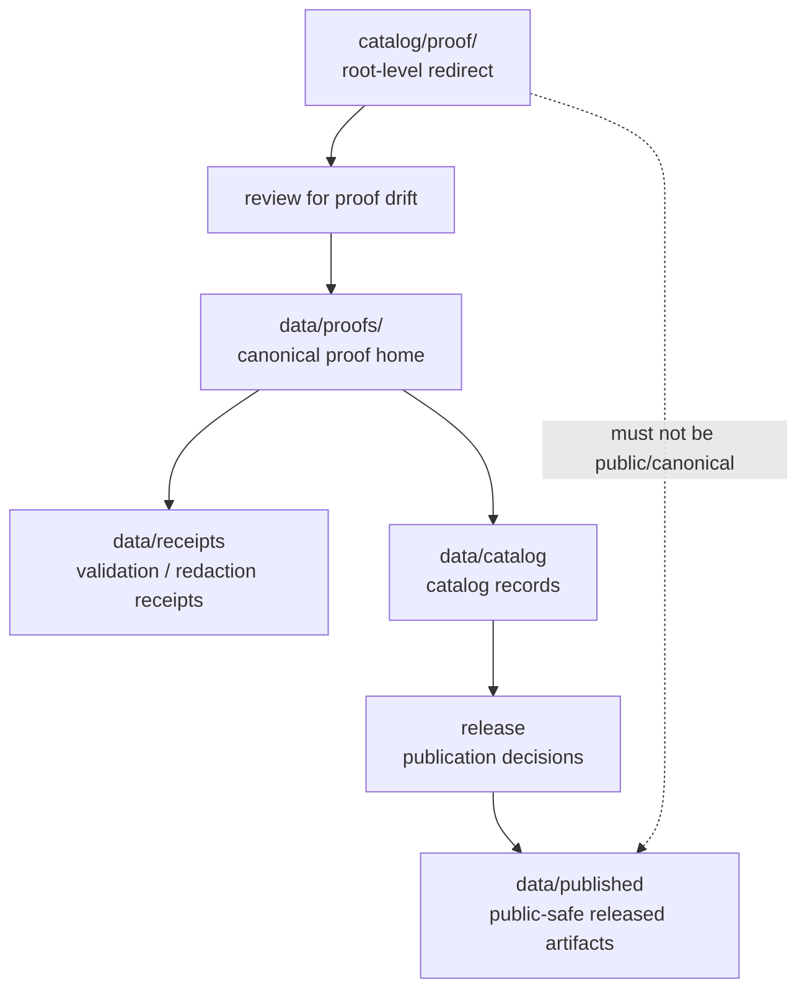

<!-- [KFM_META_BLOCK_V2]
doc_id: kfm://doc/catalog-proof-readme
title: catalog/proof/ — Proof Compatibility Redirect
type: readme
version: v0.1
status: draft
owners: OWNER_TBD — Catalog steward · Proof steward · Evidence steward · Data steward · Docs steward
created: 2026-06-16
updated: 2026-06-16
policy_label: public
related:
  - ../README.md
  - ../../data/README.md
  - ../../data/catalog/README.md
  - ../../data/proofs/README.md
  - ../../data/receipts/README.md
  - ../../data/published/README.md
  - ../../data/registry/README.md
  - ../../release/README.md
  - ../../schemas/contracts/v1/
  - ../../contracts/
  - ../../policy/
  - ../../docs/doctrine/directory-rules.md
tags: [kfm, catalog, proof, evidence, evidence-bundle, compatibility-root, redirect, data-proofs, non-authoritative, drift-fence]
notes:
  - "Root-level catalog/proof/ is treated as a compatibility/redirect fence, not canonical proof authority."
  - "Canonical proof material belongs under data/proofs/ unless a future ADR changes the proof authority model."
  - "Do not add EvidenceBundles, proof packs, attestations, receipts, release records, catalog records, or published artifacts here without an ADR/migration note."
  - "Specific current contents, producers, migration status, proof schema maturity, and CI enforcement remain NEEDS VERIFICATION."
[/KFM_META_BLOCK_V2] -->

<a id="top"></a>

<div align="center">

# Proof Compatibility Redirect

`catalog/proof/`

**Compatibility / redirect fence for legacy or accidental root-level proof placement. Canonical proof material belongs under `data/proofs/`, not this root-level `catalog/proof/` folder.**


[Purpose](#1-purpose) · [Canonical home](#2-canonical-home) · [Authority boundary](#3-authority-boundary) · [Allowed contents](#5-allowed-contents) · [Forbidden contents](#6-forbidden-contents) · [Migration](#9-migration-posture) · [Definition of done](#12-definition-of-done)

</div>

---

> [!IMPORTANT]
> **Status:** draft / `NEEDS VERIFICATION`  
> **Path:** `catalog/proof/README.md`  
> **Responsibility root:** compatibility redirect / drift fence only  
> **Canonical proof home:** `data/proofs/`  
> **Truth posture:** CONFIRMED README path / CONFIRMED root-level `catalog/` is a compatibility redirect / CONFIRMED `data/proofs/README.md` path exists as a stub / PROPOSED `catalog/proof/` redirect contract / UNKNOWN current proof files, proof schema maturity, historical producers, migration status, CI enforcement, and ADR disposition

> [!CAUTION]
> Do not make `catalog/proof/` a parallel proof authority. KFM EvidenceBundles, proof packs, attestations, claim-support records, validation proof material, and publication-support proofs must live under the governed proof home, with receipts, catalog records, release records, and published products in their own canonical roots.

---

## 1. Purpose

`catalog/proof/` is a **root-level compatibility redirect** for proof path drift.

It exists only to prevent accidental or legacy proof material from becoming a parallel authority outside the KFM lifecycle data root. This folder should not be used for canonical EvidenceBundles, proof packs, attestations, validation proof material, claim-support records, source proof material, or publication proof records.

This README does not prove that any proof material currently exists here, that a migration has been completed, that proof schemas are implemented, or that CI currently blocks writes to this path.

[Back to top](#top)

---

## 2. Canonical home

Canonical proof material belongs under:

```text
data/proofs/
```

Related records belong in separate owning roots:

```text
data/receipts/     # receipts and validation/redaction records
data/catalog/      # catalog records and catalog-family indexes
release/           # release decisions, rollback, and correction records
data/published/    # released public-safe products
```

The root-level `catalog/proof/` directory is a redirect/fence only.

## 3. Authority boundary

`catalog/proof/` has **no canonical proof authority**. It may hold only README guidance, migration notes, drift logs, or temporary redirect markers while proof material is moved into its proper lifecycle home.

```text
WRONG / LEGACY ROOT             CANONICAL PROOF HOME              SUPPORTING AUTHORITY HOMES
catalog/proof/             -->  data/proofs/                 -->  data/receipts/
compatibility fence only        EvidenceBundles / proof packs     data/catalog/
not authoritative               claim-support records             release/
                                                                    data/published/
```

A proof record outside `data/proofs/` should be treated as drift until reviewed and migrated.

## 4. Default posture

Anything found under root-level `catalog/proof/` should be treated as **NEEDS VERIFICATION** and potentially misplaced.

Do not expose, publish, index, cite, or depend on root-level proof files as canonical proof records. First confirm claim scope, source refs, provenance, rights, sensitivity, evidence resolution, schema validity, lifecycle state, receipts, release state, rollback path, and correction path.

## 5. Allowed contents

| Allowed item | Example | Required posture |
|---|---|---|
| README / redirect docs | `README.md` | Compatibility fence only |
| Migration note | `MIGRATION.md` | Temporary and ADR/review-linked |
| Drift note | `DRIFT.md`, `OPEN-QUESTIONS.md` | Must point to canonical homes and review steps |
| Placeholder marker | `.gitkeep` | Does not authorize proof content |

## 6. Forbidden contents

| Forbidden here | Correct home |
|---|---|
| EvidenceBundles, proof packs, attestations, claim-support records | `data/proofs/` |
| Citation validation proof material or claim-evidence support | `data/proofs/` and governed validation homes |
| Receipts, validation reports, redaction receipts | `data/receipts/` |
| Catalog records, catalog indexes, STAC/DCAT/PROV records | `data/catalog/` |
| Catalog-derived public products | `data/published/` after governed release |
| Source descriptors, source registry rows, rights rows, sensitivity rows | `data/registry/` or governed registry homes |
| ReleaseManifest, PromotionDecision, RollbackCard, CorrectionNotice, signatures | `release/` |
| Schemas and machine-shape contracts | `schemas/contracts/v1/` |
| Human contracts and object-meaning docs | `contracts/` |
| Policy rules and policy decisions | `policy/` and governed policy-decision homes |
| Source code, scripts, packages, pipelines, build tools | `apps/`, `packages/`, `tools/`, `scripts/`, `pipelines/` |
| Raw, work, quarantine, processed, or published lifecycle data | `data/` lifecycle subtrees |

## 7. Directory shape

Current implementation inventory remains `NEEDS VERIFICATION`.

```text
catalog/proof/
├── README.md                 # compatibility redirect / drift fence
├── MIGRATION.md              # PROPOSED only if migration is active
└── DRIFT.md                  # PROPOSED only if misplaced proof material is found
```

> [!WARNING]
> Do not treat this suggested shape as repo fact. Verify actual contents before making inventory or migration claims.

## 8. Diagram



## 9. Migration posture

If proof files are found here:

1. Do not publish or depend on them.
2. Identify whether they are EvidenceBundles, proof packs, attestations, claim-support records, receipts, catalog records, release records, source registry rows, or published-output material.
3. Check sensitivity, rights, provenance, and evidence-resolution requirements before moving or exposing anything.
4. Move or regenerate them into the correct owning root through a governed migration.
5. Normalize canonical proof placement to `data/proofs/` unless an ADR says otherwise.
6. Preserve provenance, source refs, digests, receipts, review notes, and rollback path.
7. Add a drift register or migration note if the material has already been consumed.
8. Leave root-level `catalog/proof/` as a redirect/fence unless an ADR explicitly says otherwise.

## 10. Validation expectations

Useful validation for this folder should cover:

- no EvidenceBundles, proof packs, attestations, or claim-support records are stored here;
- no receipts, release records, registry records, policy rules, schemas, source code, or published artifacts are stored here;
- any non-README content is tied to an active migration or drift note;
- CI or review checks flag root-level `catalog/proof/` writes;
- links point users to `data/proofs/`, `data/receipts/`, `data/catalog/`, `release/`, and other canonical homes.

## 11. Safe change pattern

For changes under `catalog/proof/`:

1. Confirm the change is redirect documentation, migration support, or drift documentation only.
2. Confirm it does not create a parallel proof authority.
3. Confirm durable proof records are placed under `data/proofs/`.
4. Confirm receipts/catalog/release records are placed under their owning roots.
5. Document migration and rollback if any misplaced material was moved.
6. Update docs and validation rules when behavior materially changes.

## 12. Definition of done

- [ ] Owners are confirmed and `OWNER_TBD` is replaced.
- [ ] Actual root-level `catalog/proof/` contents are verified.
- [ ] Any misplaced proof material is migrated or documented as drift.
- [ ] `data/proofs/` is confirmed as the canonical proof home in current docs.
- [ ] No trust-bearing records live here.
- [ ] No EvidenceBundles, proof packs, receipts, catalog records, release records, published artifacts, schemas, contracts, policy rules, source code, or lifecycle data live here.
- [ ] CI/review behavior is verified or marked `NEEDS VERIFICATION`.

## 13. Open verification items

| Item | Why it matters |
|---|---|
| Confirm actual files under root-level `catalog/proof/` | Prevents overclaiming or missing drift |
| Confirm whether any workflow writes here | Required before producer claims |
| Confirm proof schema and EvidenceBundle maturity | Required before implementation claims |
| Confirm migration status to `data/proofs/` | Required before canonical-home claims beyond doctrine |
| Confirm CI/review guard exists | Required before enforcement claims |
| Confirm no trust records are stored here | Required before Directory Rules compliance claims |
| Confirm ADR status for root-level `catalog/proof/` | Required before long-term retention claims |

<details>
<summary>Appendix A — no-loss preservation note</summary>

The previous README was empty. This replacement adds a proof-specific redirect and anti-parallel-authority contract without claiming proof files, EvidenceBundle implementation maturity, migration work, CI enforcement, producer workflows, or ADR disposition are implemented.

</details>

## Status summary

`catalog/proof/` is a root-level compatibility redirect and proof drift fence. It is not the canonical proof home.

Proof authority belongs under `data/proofs/`; receipts belong under `data/receipts/`; catalog records belong under `data/catalog/`; release decisions belong under `release/`; released public-safe products belong under `data/published/`.

<p align="right"><a href="#top">Back to top</a></p>
