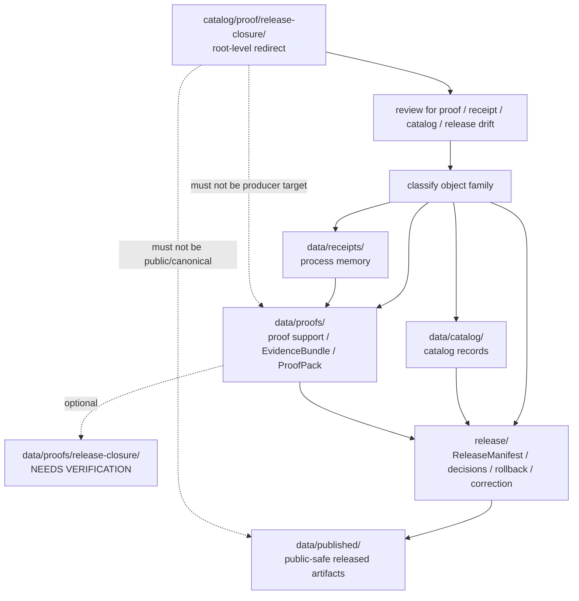

<!-- [KFM_META_BLOCK_V2]
doc_id: kfm://doc/catalog-proof-release-closure-readme
title: catalog/proof/release-closure/ — Release Closure Proof Compatibility Redirect
type: readme
version: v0.2
status: draft
owners: OWNER_TBD — Proof steward · Release steward · Catalog steward · Evidence steward · Data steward · Receipt steward · Policy steward · Schema steward · Docs steward
created: 2026-06-16
updated: 2026-07-10
policy_label: public
related:
  - ../README.md
  - ../../README.md
  - ../../../data/README.md
  - ../../../data/proofs/README.md
  - ../../../data/receipts/README.md
  - ../../../data/catalog/README.md
  - ../../../data/published/README.md
  - ../../../release/README.md
  - ../../../schemas/contracts/v1/
  - ../../../contracts/
  - ../../../policy/
  - ../../../docs/adr/ADR-0011-receipts-vs-proofs-vs-manifests-vs-catalog-separation.md
  - ../../../docs/doctrine/directory-rules.md
tags: [kfm, catalog, proof, release-closure, release, evidence, evidence-bundle, proof-pack, compatibility-root, redirect, data-proofs, release-governance, receipt-proof-separation, non-authoritative, drift-fence, no-public-use]
notes:
  - "Refreshes the root-level catalog/proof/release-closure compatibility-redirect fence."
  - "Root-level catalog/proof/release-closure/ is compatibility and drift-control documentation only, not canonical release-closure proof authority and not release-governance authority."
  - "Canonical proof-support material belongs under data/proofs/; a dedicated data/proofs/release-closure/ sublane was not found on main during this revision and remains NEEDS VERIFICATION until created or accepted."
  - "ReleaseManifest, PromotionDecision, RollbackCard, CorrectionNotice, release signatures, and release-state records belong under release/, not under this path."
  - "Receipts are process memory under data/receipts/; they are not proofs, release decisions, catalog records, or publication approval."
  - "Do not add EvidenceBundles, proof packs, closure attestations, receipts, release records, catalog records, schemas, policy rules, published artifacts, generated proof bundles, or producer outputs here without an ADR/migration note."
  - "Actual current contents beyond this README, historical producers, workflow writes, migration status, proof schema maturity, canonical sublane acceptance, CI/review enforcement, public-client/producer exclusion, and ADR disposition remain NEEDS VERIFICATION."
  - "v0.2 adds current evidence basis, Directory Rules placement basis, data/proofs alignment, explicit data/proofs/release-closure absence on main, release/ decision boundary, receipt/proof/catalog/release separation, minimum safe redirect slice, anti-bypass matrix, migration/rollback posture, and safe language rules without claiming migration or enforcement maturity."
[/KFM_META_BLOCK_V2] -->

<a id="top"></a>

<div align="center">

# Release Closure Proof Compatibility Redirect

`catalog/proof/release-closure/`

**Root-level compatibility and drift-control fence for legacy or accidental release-closure proof placement. Canonical proof support belongs under `data/proofs/`; release-governance records belong under `release/`; process receipts belong under `data/receipts/`.**


[Evidence](#0-evidence-basis-for-this-revision) · [Purpose](#1-purpose) · [Canonical homes](#2-canonical-homes) · [Boundary](#3-authority-boundary) · [Allowed](#5-allowed-contents) · [Forbidden](#6-forbidden-contents) · [Migration](#10-migration-posture) · [Definition of done](#17-definition-of-done)

</div>

---

> [!IMPORTANT]
> **Status:** draft / `NEEDS VERIFICATION`  
> **Path:** `catalog/proof/release-closure/README.md`  
> **Responsibility root:** compatibility redirect / drift fence only  
> **Canonical release-closure proof home:** `data/proofs/` unless an accepted sublane such as `data/proofs/release-closure/` is created and verified  
> **Release decision home:** `release/`  
> **Receipt home:** `data/receipts/`  
> **Directory Rules basis:** file location encodes ownership, governance, and lifecycle. Proof-support records belong under `data/proofs/`; process-memory receipts belong under `data/receipts/`; release-governance records belong under `release/`; catalog records belong under `data/catalog/`. Root-level `catalog/proof/release-closure/` is a compatibility redirect only and must not become a parallel proof, receipt, catalog, release, schema, policy, source-registry, published-artifact, pipeline, package, tool, search, or UI authority.  
> **Truth posture:** CONFIRMED current GitHub README path / CONFIRMED parent `catalog/proof/README.md` exists and treats `catalog/proof/` as compatibility redirect / CONFIRMED `data/proofs/README.md` exists and treats `data/proofs/` as proof-support root / CONFIRMED `data/proofs/release-closure/README.md` was not found on `main` during this revision / CONFIRMED `data/receipts/README.md` exists and states receipts are process memory, not proof, catalog, release, or publication approval / CONFIRMED `release/README.md` exists and treats `release/` as release-governance root / CONFIRMED Directory Rules document exists / PROPOSED root-level `catalog/proof/release-closure/` redirect contract / UNKNOWN actual files beyond README, historical producers, workflow writes, migration status, release-closure proof schema maturity, canonical proof sublane acceptance, CI/review guard, public-client/producer exclusion, and ADR disposition

> [!CAUTION]
> Do not make `catalog/proof/release-closure/` a parallel proof or release authority. KFM release-closure EvidenceBundles, ProofPacks, closure attestations, citation-validation bundles, and claim-support records belong under `data/proofs/`; process receipts belong under `data/receipts/`; release manifests, release decisions, rollback cards, correction notices, withdrawal records, signatures, and release-state records belong under `release/`.

---

## Quick jump

- [0. Evidence basis for this revision](#0-evidence-basis-for-this-revision)
- [1. Purpose](#1-purpose)
- [2. Canonical homes](#2-canonical-homes)
- [3. Authority boundary](#3-authority-boundary)
- [4. Default posture](#4-default-posture)
- [5. Allowed contents](#5-allowed-contents)
- [6. Forbidden contents](#6-forbidden-contents)
- [7. Directory shape](#7-directory-shape)
- [8. Minimum safe redirect slice](#8-minimum-safe-redirect-slice)
- [9. Diagram](#9-diagram)
- [10. Migration posture](#10-migration-posture)
- [11. Runtime and producer anti-bypass matrix](#11-runtime-and-producer-anti-bypass-matrix)
- [12. Inspection path](#12-inspection-path)
- [13. Validation expectations](#13-validation-expectations)
- [14. Safe change pattern](#14-safe-change-pattern)
- [15. Rollback and correction posture](#15-rollback-and-correction-posture)
- [16. Safe language rules](#16-safe-language-rules)
- [17. Definition of done](#17-definition-of-done)
- [18. Open verification items](#18-open-verification-items)

---

## 0. Evidence basis for this revision

This README is a documentation boundary, not migration proof, proof-validation proof, or release approval proof. The 2026-07-10 revision updates an existing compatibility README and keeps maturity bounded while aligning root-level `catalog/proof/release-closure/` with the canonical `data/proofs/` proof-support root, separate `data/receipts/` process-memory root, separate `data/catalog/` catalog root, separate `release/` governance root, and Directory Rules placement posture.

| Evidence item | Status | What it supports | What it does not prove |
|---|---|---|---|
| `catalog/proof/release-closure/README.md` exists on `main`. | CONFIRMED | This is an existing README update, not a new path proposal. | It does not prove actual contents beyond the README, historical producers, migration status, CI enforcement, public-client exclusion, or ADR disposition. |
| `catalog/proof/README.md` exists and treats root-level `catalog/proof/` as a compatibility redirect, not canonical proof authority. | CONFIRMED document presence and redirect posture | The child `release-closure/` lane should inherit root-level proof redirect/fence behavior. | It does not prove all root-level proof drift has been removed. |
| `data/proofs/README.md` exists and treats `data/proofs/` as proof-support root. | CONFIRMED proof-root posture | Canonical release-closure proof support belongs under `data/proofs/` or an accepted proof sublane. | It does not prove emitted proof inventories, schemas, validators, fixtures, CI workflows, or release-gate enforcement. |
| `data/proofs/release-closure/README.md` was not found on `main` during this revision. | CONFIRMED fetch result from current session | A dedicated `data/proofs/release-closure/` sublane must remain `NEEDS VERIFICATION` until created or accepted. | It does not prove a future sublane is invalid or that no release-closure proof files exist elsewhere under `data/proofs/`. |
| `data/receipts/README.md` exists and states receipts are process memory, not proof, catalog, release, or publication approval. | CONFIRMED receipt-root posture | Release-closure receipts must not be stored or treated as proof in this redirect path. | It does not prove emitted receipt inventories, signing, validators, or release integration. |
| `release/README.md` exists and treats `release/` as release-governance root for release decisions, manifests, corrections, rollback, and signatures. | CONFIRMED release-root posture | Release-governance closure records belong under `release/`, not root-level `catalog/proof/release-closure/`. | It does not prove release manifest lane convention, singular/plural lane choice, or release workflow maturity is finalized. |
| `docs/adr/ADR-0011-receipts-vs-proofs-vs-manifests-vs-catalog-separation.md` exists and states the proposed separation rule `receipt ≠ proof ≠ catalog ≠ publication`. | CONFIRMED ADR document presence; PROPOSED decision status | Supports separation language while keeping ADR acceptance bounded. | It does not prove ADR acceptance or validator enforcement. |
| `docs/doctrine/directory-rules.md` exists and states that file location encodes ownership, governance, and lifecycle. | CONFIRMED placement doctrine | Root-level `catalog/proof/release-closure/` must remain a compatibility fence; proof, receipt, catalog, and release records belong under their owning roots. | It does not prove live repo drift has been fully audited. |

[Back to top](#top)

---

## 1. Purpose

`catalog/proof/release-closure/` is a **root-level compatibility redirect** for release-closure proof path drift.

It exists only to prevent accidental, legacy, generated, copied, or externally imported release-closure proof material from becoming a parallel authority outside KFM's proof-support, process-memory, catalog, and release-governance roots.

This folder should not be used for canonical:

- EvidenceBundles, ProofPacks, closure attestations, or claim-support records;
- citation-validation bundles, catalog-closure proof, policy-closure proof, source-rights proof, sensitivity proof, correction proof, rollback proof, or release-readiness proof;
- process receipts, validation receipts, redaction/generalization receipts, AI receipts, release dry-run receipts, or migration receipts;
- ReleaseManifest, PromotionDecision, RollbackCard, CorrectionNotice, release signature, withdrawal, supersession, or release-decision records;
- catalog records, STAC/DCAT/PROV records, CatalogMatrix records, or discovery indexes;
- released public-safe artifacts, tiles, API payloads, stories, reports, or exports;
- schemas, contracts, policy rules, source descriptors, producer code, generated manifests, or build outputs.

This README does not prove that any release-closure proof material currently exists here, that migration has been completed, that producer tools avoid this path, that public clients exclude this path, that proof schemas are implemented, that CI blocks writes here, or that any ADR has finalized long-term retention of this compatibility root.

[Back to top](#top)

---

## 2. Canonical homes

Canonical proof-support material belongs under:

```text
data/proofs/
```

A dedicated release-closure proof sublane may be used only when accepted and verified:

```text
data/proofs/release-closure/   # NEEDS VERIFICATION — README not found on main during this revision
```

Process-memory receipts belong under:

```text
data/receipts/
```

Catalog records and discovery/interchange carriers belong under:

```text
data/catalog/
```

Release decision and release-state material belongs under:

```text
release/
```

Released public-safe artifacts belong under:

```text
data/published/
```

The root-level `catalog/proof/release-closure/` directory is a redirect/fence only.

```text
catalog/proof/release-closure/  # compatibility redirect only; do not add proof or release records here
data/proofs/                    # canonical proof-support root
data/receipts/                  # process-memory root
release/                        # release-governance root
```

If a future ADR or migration creates `data/proofs/release-closure/`, this README should be updated to cite the accepted target, producer-configuration evidence, validation evidence, and any migration, correction, or rollback records.

## 3. Authority boundary

`catalog/proof/release-closure/` has **no canonical proof authority**, **no receipt authority**, **no catalog authority**, and **no release authority**. It may hold only redirect guidance, migration notes, drift logs, or temporary markers while misplaced material is reviewed and moved into its proper owning root.

```text
WRONG / LEGACY ROOT                              CANONICAL PROOF HOME                 RECEIPT / CATALOG / RELEASE HOMES
catalog/proof/release-closure/             -->  data/proofs/                    -->  data/receipts/
compatibility fence only                         proof support / closure bundles       data/catalog/
not authoritative                                optional accepted sublane              release/
                                                                                         data/published/
```

A release-closure proof record outside `data/proofs/` should be treated as proof drift until reviewed and migrated. A receipt outside `data/receipts/` should be treated as process-memory drift. A release decision record outside `release/` should be treated as release-plane drift. A catalog record outside `data/catalog/` should be treated as catalog drift.

## 4. Default posture

Anything found under root-level `catalog/proof/release-closure/` should be treated as **NEEDS VERIFICATION** and potentially misplaced.

Do not expose, publish, index, cite, search, cache, export, tile, or depend on root-level release-closure proof files as canonical proof or release records. First confirm object family, claim scope, source refs, provenance, rights, sensitivity, evidence resolution, schema validity, policy decision, lifecycle state, receipt support, catalog closure, release state, rollback path, correction path, and whether the object is actually a proof, receipt, catalog carrier, or release-governance record.

## 5. Allowed contents

| Allowed item | Example | Required posture |
|---|---|---|
| README / redirect docs | `README.md` | Compatibility fence only |
| Migration note | `MIGRATION.md` | Temporary and ADR/review-linked |
| Drift note | `DRIFT.md`, `OPEN-QUESTIONS.md` | Must point to canonical homes and review steps |
| Placeholder marker | `.gitkeep` | Does not authorize proof, receipt, catalog, or release content |

## 6. Forbidden contents

| Forbidden here | Correct home |
|---|---|
| Release-closure EvidenceBundles, ProofPacks, closure attestations, claim-support records | `data/proofs/` or an accepted sublane under it |
| Citation-validation proof material, catalog-closure proof, evidence-closure proof, policy-closure proof | `data/proofs/` and governed validation homes |
| Receipts, validation reports, redaction/generalization receipts, AI receipts, release dry-run receipts, migration receipts | `data/receipts/` |
| Catalog records, catalog indexes, STAC/DCAT/PROV records, CatalogMatrix records | `data/catalog/` |
| Catalog-derived or proof-derived public products | `data/published/` after governed release |
| Source descriptors, source registry rows, rights rows, sensitivity rows | `data/registry/` or governed registry homes |
| ReleaseManifest, PromotionDecision, RollbackCard, CorrectionNotice, release signatures, release decisions, withdrawals, supersession records | `release/` |
| Schemas and machine-shape contracts | `schemas/contracts/v1/` |
| Human contracts and object-meaning docs | `contracts/` |
| Policy rules and policy decisions | `policy/` and governed policy-decision homes |
| Source code, scripts, packages, pipelines, build tools, producers | `apps/`, `packages/`, `tools/`, `scripts/`, `pipelines/` |
| Raw, work, quarantine, processed, catalog, triplet, or published lifecycle data | `data/` lifecycle subtrees |

## 7. Directory shape

Current implementation inventory remains `NEEDS VERIFICATION`.

```text
catalog/proof/release-closure/
├── README.md                 # compatibility redirect / drift fence
├── MIGRATION.md              # PROPOSED only if migration is active
└── DRIFT.md                  # PROPOSED only if misplaced release-closure proof material is found
```

> [!WARNING]
> Do not treat this suggested shape as repo fact. Verify actual contents before making inventory, producer, enforcement, release, proof, or migration claims.

## 8. Minimum safe redirect slice

A smallest safe `catalog/proof/release-closure/` state should prove only that the folder prevents drift; it should not contain trust-bearing material.

| Slice item | Minimum requirement | Why it matters |
|---|---|---|
| Redirect README | Points to `data/proofs/` for proof support, `data/receipts/` for process memory, and `release/` for release governance | Prevents parallel authority |
| No proof records | No EvidenceBundle, ProofPack, closure attestation, citation validation, or claim-support files | Keeps proof support in lifecycle proof root |
| No receipt records | No RunReceipt, ValidationReceipt, AIReceipt, migration receipt, release dry-run receipt, or redaction receipt | Preserves receipt/process-memory root |
| No release-governance records | No ReleaseManifest, PromotionDecision, RollbackCard, CorrectionNotice, signatures, withdrawals, or release decisions | Preserves release root authority |
| No catalog records | No STAC, DCAT, PROV, CatalogMatrix, source descriptor, or catalog index files | Preserves catalog and registry roots |
| Drift procedure | Explains how to inspect and migrate misplaced records | Keeps remediation reversible |
| Producer guard | Producers, generators, scripts, and CI should not write durable proof/release records here | Prevents reintroducing drift |
| Public-use guard | Public clients, search services, map runtimes, exports, and indexes must not read from this path as canonical | Preserves governed access path |
| Sublane guard | `data/proofs/release-closure/` remains `NEEDS VERIFICATION` until accepted and present | Avoids inventing canonical structure |
| Verification backlog | Open items stay visible | Prevents documentation from pretending migration/enforcement is complete |

## 9. Diagram



## 10. Migration posture

If release-closure files are found here:

1. Do not publish, cite, index, search, cache, export, tile, or depend on them.
2. Identify whether they are EvidenceBundles, ProofPacks, closure attestations, citation-validation records, claim-support records, receipts, catalog records, CatalogMatrix/STAC/DCAT/PROV records, release manifests, release decisions, rollback/correction records, source registry rows, schemas, policy records, published-output material, generated previews, temporary build artifacts, or producer outputs.
3. Determine whether the file is historical drift, generated drift, copied output, unreviewed local work, or an intentional migration marker.
4. Move or regenerate durable proof material into `data/proofs/` or an accepted, verified sublane under it.
5. Move receipts into `data/receipts/`.
6. Move catalog records into `data/catalog/` and source/rights/sensitivity registry records into `data/registry/`.
7. Move release-governance records into `release/`.
8. Move published artifacts into `data/published/` only after governed release approval.
9. Preserve provenance, source refs, digests, receipts, review notes, producer identity, release refs, correction refs, and rollback path.
10. Add a drift register, migration note, or correction note if the misplaced material was previously consumed.
11. Add or update validation checks so producers do not recreate root-level release-closure proof drift.
12. Leave `catalog/proof/release-closure/` as a redirect/fence unless an accepted ADR explicitly changes the authority model.

## 11. Runtime and producer anti-bypass matrix

| Bypass risk | Required behavior | Review signal |
|---|---|---|
| Producer writes release-closure proof records to `catalog/proof/release-closure/` | Fail review/CI; write to `data/proofs/` or accepted proof sublane instead | Generator config and output paths checked |
| Producer writes receipts here | Fail review/CI; write to `data/receipts/` instead | Receipt path check passes |
| Producer writes ReleaseManifest or release decisions here | Fail review/CI; write to `release/` instead | Release path check passes |
| Public client reads root-level proof path | Deny; route through governed API/release/public-safe path | Client/search/index config excludes this path |
| Root-level proof is treated as canonical | Mark as drift and migrate/regenerate | Migration note references canonical target |
| `data/proofs/release-closure/` is claimed canonical before it exists | Keep `NEEDS VERIFICATION` until path and README are accepted | Current fetch or PR evidence cited |
| Receipts/proofs/release records stored here | Move to owning roots | Directory review blocks trust support records |
| Schema/profile file stored here | Move to `schemas/` or standards docs as appropriate | Schema-home review passes |
| Policy rule stored here | Move to `policy/` | Policy-root review passes |
| Published artifact stored here | Move to `data/published/` after release gate | Release/publication review passes |
| Search/cache/export/tile pipeline consumes this path | Deny as canonical; switch to governed proof/release source | Producer and client config reviewed |
| Drift file already consumed downstream | Add correction/migration note and rollback path | Correction path is auditable |
| README claims CI enforcement without run/check evidence | Mark enforcement `NEEDS VERIFICATION` | Current CI evidence cited before pass claim |

## 12. Inspection path

Actual root-level contents, producers, workflow writes, migration status, proof-schema maturity, canonical proof sublane acceptance, CI/review enforcement, public-client/index exclusion, and current ADR disposition remain `NEEDS VERIFICATION`.

```bash
find catalog/proof/release-closure -maxdepth 6 -type f | sort
find data/proofs data/receipts data/catalog data/published data/registry release schemas contracts policy docs tools scripts pipelines pipeline_specs .github/workflows -maxdepth 6 -type f 2>/dev/null | grep -Ei 'release[-_ ]?closure|EvidenceBundle|EvidenceRef|ProofPack|proof|citation|closure|ReleaseManifest|PromotionDecision|RollbackCard|CorrectionNotice|withdraw|supersede|RunReceipt|AIReceipt|ValidationReceipt|CatalogMatrix|stac|dcat|prov|schema|policy|validator|publish|workflow|migration|drift' | sort
```

## 13. Validation expectations

Useful validation for this folder should cover:

- no EvidenceBundles, ProofPacks, closure attestations, citation-validation records, or claim-support records are stored here;
- no receipts, validation reports, AI receipts, migration receipts, release dry-run receipts, or redaction/generalization receipts are stored here;
- no ReleaseManifest, PromotionDecision, RollbackCard, CorrectionNotice, release decisions, withdrawals, supersession records, signatures, or release-state records are stored here;
- no STAC, DCAT, PROV, CatalogMatrix, source registry records, policy rules, schemas, source code, pipelines, tools, producer outputs, or published artifacts are stored here;
- any non-README content is tied to an active migration, drift note, or placeholder marker;
- producer tools, scripts, generated outputs, workflows, indexes, search services, public clients, exports, tile jobs, and map runtimes do not target `catalog/proof/release-closure/` as canonical;
- links point users to `data/proofs/`, `data/receipts/`, `data/catalog/`, `release/`, `data/published/`, and other owning roots;
- CI or review checks flag root-level `catalog/proof/release-closure/` writes when enforcement exists;
- CI/pass/enforcement state is not claimed without current evidence.

## 14. Safe change pattern

For changes under `catalog/proof/release-closure/`:

1. Confirm the change is redirect documentation, migration support, drift documentation, or a non-authoritative placeholder only.
2. Confirm it does not create a parallel proof, receipt, catalog, release, schema, policy, or publication authority.
3. Confirm durable proof records are placed under `data/proofs/` or an accepted and verified sublane.
4. Confirm receipts remain under `data/receipts/`.
5. Confirm catalog records remain under `data/catalog/`.
6. Confirm release-governance records remain under `release/`.
7. Confirm published artifacts appear only under `data/published/` after governed release.
8. Confirm no public client, search index, map runtime, export job, tile job, story/focus/evidence surface, proof producer, release producer, or cache reads this path as canonical.
9. Document migration, correction, and rollback if any misplaced material was moved or previously consumed.
10. Update docs and validation rules when behavior materially changes.

## 15. Rollback and correction posture

If material was added here by mistake, rollback should be small and auditable:

- remove or revert the misplaced file from `catalog/proof/release-closure/`;
- regenerate or move durable proof records into `data/proofs/` through a governed migration;
- move receipts into `data/receipts/` and release-governance records into `release/`;
- preserve digest/provenance notes for anything already referenced;
- add a correction note if public, semi-public, generated downstream, search, export, cache, release, or catalog artifacts consumed the misplaced path;
- update producer configuration and tests so the drift is not recreated.

## 16. Safe language rules

Use these terms carefully:

| Phrase | Allowed here? | Safer wording |
|---|---:|---|
| "canonical proof in `catalog/proof/release-closure/`" | No | "misplaced or legacy release-closure proof requiring review" |
| "ReleaseManifest in `catalog/proof/release-closure/`" | No | "release-governance record belongs under `release/`" |
| "receipt proves closure" | No | "receipt records process memory; proof support belongs under `data/proofs/`" |
| "published from `catalog/proof/release-closure/`" | No | "published only after release via canonical lifecycle path" |
| "CI blocks this" | Only with current evidence | "CI guard remains NEEDS VERIFICATION" |
| "migration complete" | Only with migration evidence | "migration status remains NEEDS VERIFICATION" |
| "safe to consume" | Only after release/access evidence | "do not consume as canonical from this path" |
| "`data/proofs/release-closure/` exists" | Only with path evidence | "dedicated proof sublane remains NEEDS VERIFICATION" |

## 17. Definition of done

- [ ] Owners are confirmed and `OWNER_TBD` is replaced.
- [ ] Actual root-level `catalog/proof/release-closure/` contents are verified.
- [ ] Any misplaced release-closure proof material is migrated, removed, regenerated under `data/proofs/`, or documented as drift.
- [ ] Any misplaced receipt material is migrated, removed, regenerated under `data/receipts/`, or documented as drift.
- [ ] Any misplaced release-governance material is migrated, removed, regenerated under `release/`, or documented as drift.
- [ ] `data/proofs/release-closure/` existence/absence is verified before being referenced as canonical.
- [ ] `data/proofs/` is confirmed as the canonical proof-support home in current docs and producer configuration.
- [ ] `release/` is confirmed as the canonical release-governance home in current docs and producer configuration.
- [ ] No trust-bearing records live here.
- [ ] No EvidenceBundles, ProofPacks, receipts, catalog records, release records, published artifacts, schemas, contracts, policy rules, source code, producer outputs, or lifecycle data live here.
- [ ] No public client, search index, map runtime, export job, tile job, proof producer, release producer, story/focus/evidence surface, or cache uses this path as canonical.
- [ ] CI/review behavior is verified or marked `NEEDS VERIFICATION`.

## 18. Open verification items

| Item | Why it matters |
|---|---|
| Confirm actual files under root-level `catalog/proof/release-closure/` | Prevents overclaiming or missing drift |
| Confirm whether any workflow writes here | Required before producer claims |
| Confirm release-closure proof schema maturity | Required before implementation claims |
| Confirm whether `data/proofs/release-closure/` should exist | Required before sublane creation or references harden |
| Confirm migration status to `data/proofs/`, `data/receipts/`, `data/catalog/`, or `release/` | Required before canonical-home claims beyond doctrine |
| Confirm CI/review guard exists | Required before enforcement claims |
| Confirm public clients/search/export/tile jobs do not consume this path | Required before safety claims |
| Confirm no trust records are stored here | Required before Directory Rules compliance claims |
| Confirm ADR status for root-level `catalog/proof/release-closure/` | Required before long-term retention claims |

<details>
<summary>Appendix A — no-loss preservation note</summary>

The previous README already contained a bounded release-closure-proof redirect and anti-parallel-authority contract. This revision preserves that contract, refreshes metadata, adds a current evidence-basis section, adds Directory Rules placement posture, records that `data/proofs/release-closure/README.md` was not found on `main`, strengthens proof/receipt/catalog/release separation, expands the minimum safe redirect slice, producer/public-use anti-bypass safeguards, no-trust-record safeguards, migration/rollback guidance, safe language rules, and validation expectations, and keeps implementation/migration/enforcement claims bounded. It does not claim release-closure proof files, release decision files, proof implementation maturity, migration work, CI enforcement, producer workflow behavior, public-client exclusion, canonical proof sublane acceptance, or ADR disposition are implemented.

</details>

## Status summary

`catalog/proof/release-closure/` is a root-level compatibility redirect and release-closure proof drift fence. It is not the canonical proof, receipt, catalog, release-decision, or publication home.

Proof authority belongs under `data/proofs/`; a dedicated `data/proofs/release-closure/` sublane remains `NEEDS VERIFICATION` until accepted and present. Receipts belong under `data/receipts/`; release-governance records belong under `release/`; catalog records belong under `data/catalog/`; released public-safe products belong under `data/published/`.

<p align="right"><a href="#top">Back to top</a></p>
