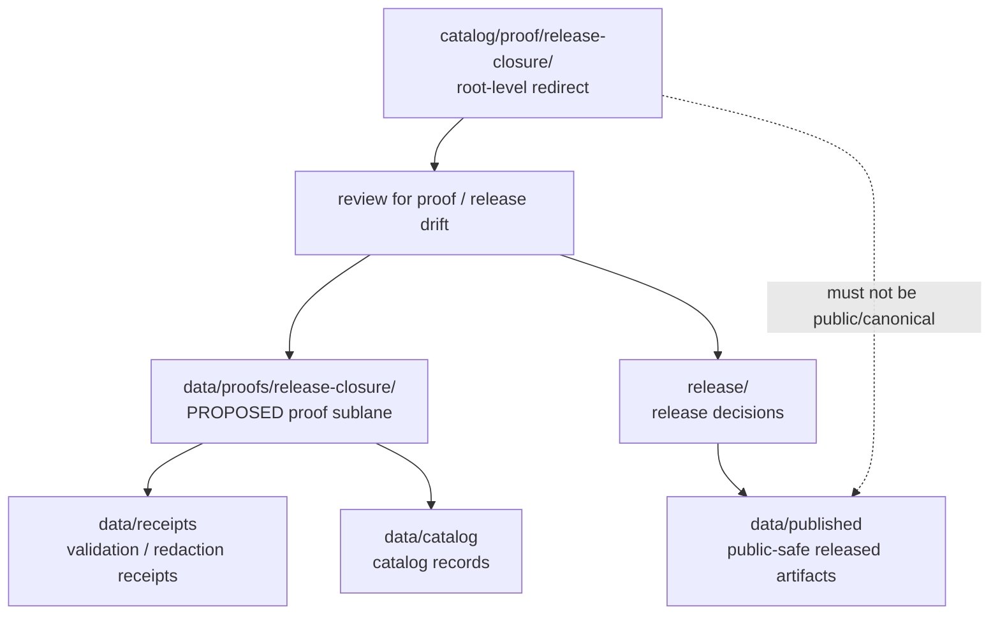

<!-- [KFM_META_BLOCK_V2]
doc_id: kfm://doc/catalog-proof-release-closure-readme
title: catalog/proof/release-closure/ — Release Closure Proof Compatibility Redirect
type: readme
version: v0.1
status: draft
owners: OWNER_TBD — Proof steward · Release steward · Catalog steward · Evidence steward · Data steward · Docs steward
created: 2026-06-16
updated: 2026-06-16
policy_label: public
related:
  - ../README.md
  - ../../../data/README.md
  - ../../../data/proofs/README.md
  - ../../../data/receipts/README.md
  - ../../../data/catalog/README.md
  - ../../../data/published/README.md
  - ../../../release/README.md
  - ../../../schemas/contracts/v1/
  - ../../../contracts/
  - ../../../policy/
  - ../../../docs/doctrine/directory-rules.md
tags: [kfm, catalog, proof, release-closure, release, evidence, evidence-bundle, compatibility-root, redirect, data-proofs, non-authoritative, drift-fence]
notes:
  - "Root-level catalog/proof/release-closure/ is treated as a compatibility/redirect fence, not canonical release-closure proof authority."
  - "Canonical release-closure proof material should be placed under data/proofs/ or an accepted data/proofs/release-closure/ sublane."
  - "ReleaseManifest, PromotionDecision, RollbackCard, CorrectionNotice, and release-state records belong under release/, not under this path."
  - "Do not add EvidenceBundles, proof packs, attestations, receipts, release records, catalog records, or published artifacts here without an ADR/migration note."
  - "Specific current contents, producers, release-closure proof schema maturity, migration status, and CI enforcement remain NEEDS VERIFICATION."
[/KFM_META_BLOCK_V2] -->

<a id="top"></a>

<div align="center">

# Release Closure Proof Compatibility Redirect

`catalog/proof/release-closure/`

**Compatibility / redirect fence for legacy or accidental root-level release-closure proof placement. Canonical proof material belongs under `data/proofs/`, while release decisions and release-state records belong under `release/`.**


[Purpose](#1-purpose) · [Canonical homes](#2-canonical-homes) · [Authority boundary](#3-authority-boundary) · [Allowed contents](#5-allowed-contents) · [Forbidden contents](#6-forbidden-contents) · [Migration](#9-migration-posture) · [Definition of done](#12-definition-of-done)

</div>

---

> [!IMPORTANT]
> **Status:** draft / `NEEDS VERIFICATION`  
> **Path:** `catalog/proof/release-closure/README.md`  
> **Responsibility root:** compatibility redirect / drift fence only  
> **Canonical release-closure proof home:** `data/proofs/` with `data/proofs/release-closure/` as a PROPOSED sublane until accepted and verified  
> **Release decision home:** `release/`  
> **Truth posture:** CONFIRMED README path / CONFIRMED parent `catalog/proof/` is a compatibility redirect / CONFIRMED `data/proofs/README.md` path exists as a stub / PROPOSED `catalog/proof/release-closure/` redirect contract / UNKNOWN current release-closure proof files, proof schema maturity, historical producers, migration status, CI enforcement, and ADR disposition

> [!CAUTION]
> Do not make `catalog/proof/release-closure/` a parallel proof or release authority. KFM release-closure EvidenceBundles, proof packs, closure attestations, and claim-support records must live under the governed proof home. ReleaseManifest, PromotionDecision, RollbackCard, CorrectionNotice, and release-state records must remain under `release/`.

---

## 1. Purpose

`catalog/proof/release-closure/` is a **root-level compatibility redirect** for release-closure proof path drift.

It exists only to prevent accidental or legacy release-closure proof material from becoming a parallel authority outside the KFM lifecycle data and release roots. This folder should not be used for canonical EvidenceBundles, proof packs, closure attestations, release decision records, rollback records, correction records, catalog records, receipts, or published products.

This README does not prove that any release-closure proof material currently exists here, that a migration has been completed, that proof schemas are implemented, or that CI currently blocks writes to this path.

[Back to top](#top)

---

## 2. Canonical homes

Canonical proof material belongs under:

```text
data/proofs/
```

A dedicated release-closure proof sublane may be used when accepted and verified:

```text
data/proofs/release-closure/   # PROPOSED canonical sublane; NEEDS VERIFICATION
```

Release decision and release-state material belongs under:

```text
release/
```

Related support records belong in separate owning roots:

```text
data/receipts/     # receipts and validation/redaction records
data/catalog/      # catalog records and catalog-family indexes
data/published/    # released public-safe products
```

The root-level `catalog/proof/release-closure/` directory is a redirect/fence only.

## 3. Authority boundary

`catalog/proof/release-closure/` has **no canonical proof or release authority**. It may hold only README guidance, migration notes, drift logs, or temporary redirect markers while release-closure proof material is moved into its proper lifecycle home.

```text
WRONG / LEGACY ROOT                         CANONICAL PROOF HOME                    RELEASE AUTHORITY HOME
catalog/proof/release-closure/         -->  data/proofs/release-closure/       -->   release/
compatibility fence only                     or data/proofs/                         release decisions
not authoritative                            closure proofs / proof packs            rollback / correction state
```

A release-closure proof record outside `data/proofs/` should be treated as drift until reviewed and migrated. A release decision record outside `release/` should be treated as release-plane drift until reviewed and migrated.

## 4. Default posture

Anything found under root-level `catalog/proof/release-closure/` should be treated as **NEEDS VERIFICATION** and potentially misplaced.

Do not expose, publish, index, cite, or depend on root-level release-closure proof files as canonical proof or release records. First confirm claim scope, source refs, provenance, rights, sensitivity, evidence resolution, schema validity, lifecycle state, receipts, release state, rollback path, and correction path.

## 5. Allowed contents

| Allowed item | Example | Required posture |
|---|---|---|
| README / redirect docs | `README.md` | Compatibility fence only |
| Migration note | `MIGRATION.md` | Temporary and ADR/review-linked |
| Drift note | `DRIFT.md`, `OPEN-QUESTIONS.md` | Must point to canonical homes and review steps |
| Placeholder marker | `.gitkeep` | Does not authorize proof or release content |

## 6. Forbidden contents

| Forbidden here | Correct home |
|---|---|
| Release-closure EvidenceBundles, proof packs, closure attestations, claim-support records | `data/proofs/` or an accepted sublane under it |
| Citation validation proof material or claim-evidence support | `data/proofs/` and governed validation homes |
| Receipts, validation reports, redaction receipts | `data/receipts/` |
| Catalog records, catalog indexes, STAC/DCAT/PROV records | `data/catalog/` |
| Catalog-derived public products | `data/published/` after governed release |
| Source descriptors, source registry rows, rights rows, sensitivity rows | `data/registry/` or governed registry homes |
| ReleaseManifest, PromotionDecision, RollbackCard, CorrectionNotice, signatures | `release/` |
| Schemas and machine-shape contracts | `schemas/contracts/v1/` |
| Human contracts and object-meaning docs | `contracts/` |
| Policy rules and policy decisions | `policy/` and governed policy-decision homes |
| Source code, scripts, packages, pipelines, build tools | `apps/`, `packages/`, `tools/`, `scripts/`, `pipelines/` |
| Raw, work, quarantine, processed, or published lifecycle data | `data/` lifecycle subtrees |

## 7. Directory shape

Current implementation inventory remains `NEEDS VERIFICATION`.

```text
catalog/proof/release-closure/
├── README.md                 # compatibility redirect / drift fence
├── MIGRATION.md              # PROPOSED only if migration is active
└── DRIFT.md                  # PROPOSED only if misplaced release-closure proof material is found
```

> [!WARNING]
> Do not treat this suggested shape as repo fact. Verify actual contents before making inventory or migration claims.

## 8. Diagram



## 9. Migration posture

If release-closure files are found here:

1. Do not publish or depend on them.
2. Identify whether they are EvidenceBundles, proof packs, closure attestations, claim-support records, receipts, catalog records, release records, source registry rows, or published-output material.
3. Move proof material into `data/proofs/` or an accepted `data/proofs/release-closure/` sublane.
4. Move release decision and release-state material into `release/`.
5. Check sensitivity, rights, provenance, and evidence-resolution requirements before moving or exposing anything.
6. Preserve provenance, source refs, digests, receipts, review notes, rollback path, and correction path.
7. Add a drift register or migration note if the material has already been consumed.
8. Leave root-level `catalog/proof/release-closure/` as a redirect/fence unless an ADR explicitly says otherwise.

## 10. Validation expectations

Useful validation for this folder should cover:

- no EvidenceBundles, proof packs, closure attestations, or claim-support records are stored here;
- no ReleaseManifest, PromotionDecision, RollbackCard, CorrectionNotice, or release-state records are stored here;
- no receipts, catalog records, registry records, policy rules, schemas, source code, or published artifacts are stored here;
- any non-README content is tied to an active migration or drift note;
- CI or review checks flag root-level `catalog/proof/release-closure/` writes;
- links point users to `data/proofs/`, `data/receipts/`, `data/catalog/`, `release/`, and other canonical homes.

## 11. Safe change pattern

For changes under `catalog/proof/release-closure/`:

1. Confirm the change is redirect documentation, migration support, or drift documentation only.
2. Confirm it does not create a parallel proof or release authority.
3. Confirm durable proof records are placed under `data/proofs/`.
4. Confirm release decisions and release-state records are placed under `release/`.
5. Confirm receipts/catalog records are placed under their owning roots.
6. Document migration and rollback if any misplaced material was moved.
7. Update docs and validation rules when behavior materially changes.

## 12. Definition of done

- [ ] Owners are confirmed and `OWNER_TBD` is replaced.
- [ ] Actual root-level `catalog/proof/release-closure/` contents are verified.
- [ ] Any misplaced release-closure proof material is migrated or documented as drift.
- [ ] Any misplaced release-decision material is migrated or documented as drift.
- [ ] `data/proofs/` is confirmed as the canonical proof home in current docs.
- [ ] `release/` is confirmed as the canonical release decision home in current docs.
- [ ] No trust-bearing records live here.
- [ ] No EvidenceBundles, proof packs, receipts, catalog records, release records, published artifacts, schemas, contracts, policy rules, source code, or lifecycle data live here.
- [ ] CI/review behavior is verified or marked `NEEDS VERIFICATION`.

## 13. Open verification items

| Item | Why it matters |
|---|---|
| Confirm actual files under root-level `catalog/proof/release-closure/` | Prevents overclaiming or missing drift |
| Confirm whether any workflow writes here | Required before producer claims |
| Confirm release-closure proof schema maturity | Required before implementation claims |
| Confirm migration status to `data/proofs/` or `release/` | Required before canonical-home claims beyond doctrine |
| Confirm CI/review guard exists | Required before enforcement claims |
| Confirm no trust records are stored here | Required before Directory Rules compliance claims |
| Confirm ADR status for root-level `catalog/proof/release-closure/` | Required before long-term retention claims |

<details>
<summary>Appendix A — no-loss preservation note</summary>

The previous README was empty. This replacement adds a release-closure-proof redirect and anti-parallel-authority contract without claiming release-closure proof files, release decision files, proof implementation maturity, migration work, CI enforcement, producer workflows, or ADR disposition are implemented.

</details>

## Status summary

`catalog/proof/release-closure/` is a root-level compatibility redirect and release-closure proof drift fence. It is not the canonical proof or release decision home.

Proof authority belongs under `data/proofs/`; release decisions belong under `release/`; receipts belong under `data/receipts/`; catalog records belong under `data/catalog/`; released public-safe products belong under `data/published/`.

<p align="right"><a href="#top">Back to top</a></p>
