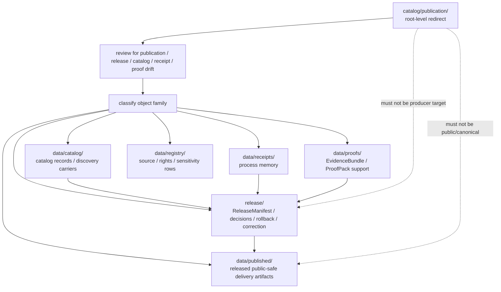

<!-- [KFM_META_BLOCK_V2]
doc_id: kfm://doc/catalog-publication-readme
title: catalog/publication/ — Publication Compatibility Redirect
type: readme
version: v0.2
status: draft
owners: OWNER_TBD — Publication steward · Release steward · Catalog steward · Data steward · Receipt steward · Proof steward · Policy steward · Schema steward · Docs steward
created: 2026-06-16
updated: 2026-07-10
policy_label: public
related:
  - ../README.md
  - ../../data/README.md
  - ../../data/catalog/README.md
  - ../../data/published/README.md
  - ../../data/receipts/README.md
  - ../../data/proofs/README.md
  - ../../data/registry/README.md
  - ../../release/README.md
  - ../../schemas/contracts/v1/
  - ../../contracts/
  - ../../policy/
  - ../../docs/adr/ADR-0011-receipts-vs-proofs-vs-manifests-vs-catalog-separation.md
  - ../../docs/doctrine/directory-rules.md
tags: [kfm, catalog, publication, published, release, compatibility-root, redirect, data-published, release-plane, receipt-proof-catalog-release-separation, non-authoritative, drift-fence, no-public-use]
notes:
  - "Refreshes the root-level catalog/publication compatibility-redirect fence."
  - "Root-level catalog/publication/ is compatibility and drift-control documentation only, not canonical publication authority, release authority, catalog authority, proof authority, receipt authority, schema authority, policy authority, or producer authority."
  - "Published delivery artifacts belong under data/published/ after governed release; release-governance records belong under release/."
  - "Catalog records belong under data/catalog/; receipts belong under data/receipts/; proof support belongs under data/proofs/; source/rights/sensitivity registry rows belong under data/registry/."
  - "ADR-0011 is proposed and is used here only as separation evidence, not accepted-rule proof."
  - "Do not add publication artifacts, release records, receipts, proofs, source registry rows, catalog records, schemas, policy rules, generated outputs, or producer targets here without an ADR/migration note."
  - "Actual current contents beyond this README, historical producers, workflow writes, migration status, publication/release schema maturity, CI/review enforcement, public-client/producer exclusion, hosting readiness, and ADR disposition remain NEEDS VERIFICATION."
  - "v0.2 adds current evidence basis, Directory Rules placement basis, canonical data/published alignment, release/ decision boundary, receipt/proof/catalog/publication separation, minimum safe redirect slice, anti-bypass matrix, migration/rollback posture, and safe language rules without claiming migration or enforcement maturity."
[/KFM_META_BLOCK_V2] -->

<a id="top"></a>

<div align="center">

# Publication Compatibility Redirect

`catalog/publication/`

**Root-level compatibility and drift-control fence for legacy or accidental publication placement. Released public-safe artifacts belong under `data/published/`; release-governance records belong under `release/`; supporting catalog, receipt, proof, and registry records stay in their own roots.**


[Evidence](#0-evidence-basis-for-this-revision) · [Purpose](#1-purpose) · [Canonical homes](#2-canonical-homes) · [Boundary](#3-authority-boundary) · [Allowed](#5-allowed-contents) · [Forbidden](#6-forbidden-contents) · [Migration](#10-migration-posture) · [Definition of done](#17-definition-of-done)

</div>

---

> [!IMPORTANT]
> **Status:** draft / `NEEDS VERIFICATION`  
> **Path:** `catalog/publication/README.md`  
> **Responsibility root:** compatibility redirect / drift fence only  
> **Published artifact home:** `data/published/`  
> **Release-governance home:** `release/`  
> **Catalog home:** `data/catalog/`  
> **Receipt home:** `data/receipts/`  
> **Proof home:** `data/proofs/`  
> **Directory Rules basis:** file location encodes ownership, governance, and lifecycle. Released public-safe delivery artifacts belong under `data/published/`; release-governance records belong under `release/`; catalog records belong under `data/catalog/`; receipts belong under `data/receipts/`; proof support belongs under `data/proofs/`. Root-level `catalog/publication/` is a compatibility redirect only and must not become a parallel publication, release, catalog, receipt, proof, schema, policy, source-registry, pipeline, package, tool, search, hosting, or UI authority.  
> **Truth posture:** CONFIRMED current GitHub README path / CONFIRMED parent root-level `catalog/README.md` exists and treats `catalog/` as compatibility redirect / CONFIRMED `data/published/README.md` exists and treats `data/published/` as released public-safe downstream carrier lane / CONFIRMED `release/README.md` exists and treats `release/` as release-governance root / CONFIRMED `data/catalog/README.md` exists and states catalog records do not approve publication / CONFIRMED `data/receipts/README.md` exists and states receipts are process memory, not proof, catalog, release, or publication approval / CONFIRMED `data/proofs/README.md` exists and treats proof artifacts as support objects, not public truth by placement / CONFIRMED ADR-0011 document exists and states proposed receipt/proof/catalog/publication separation / CONFIRMED Directory Rules document exists / PROPOSED root-level `catalog/publication/` redirect contract / UNKNOWN actual files beyond README, historical producers, workflow writes, migration status, publication schema maturity, release workflow maturity, CI/review guard, public-client/producer exclusion, hosting readiness, and ADR disposition

> [!CAUTION]
> Do not make `catalog/publication/` a parallel publication, release, or catalog authority. KFM published artifacts belong under `data/published/` only after governed release. Release manifests, release decisions, rollback cards, correction notices, withdrawal records, supersession records, signatures, and release-state records belong under `release/`. Catalog records, receipts, proofs, registry rows, schemas, contracts, policies, code, generated previews, and unpublished lifecycle data stay in their own roots.

---

## Quick jump

- [0. Evidence basis for this revision](#0-evidence-basis-for-this-revision)
- [1. Purpose](#1-purpose)
- [2. Canonical homes](#2-canonical-homes)
- [3. Authority boundary](#3-authority-boundary)
- [4. Default posture](#4-default-posture)
- [5. Allowed contents](#5-allowed-contents)
- [6. Forbidden contents](#6-forbidden-contents)
- [7. Directory shape](#7-directory-shape)
- [8. Minimum safe redirect slice](#8-minimum-safe-redirect-slice)
- [9. Diagram](#9-diagram)
- [10. Migration posture](#10-migration-posture)
- [11. Runtime and producer anti-bypass matrix](#11-runtime-and-producer-anti-bypass-matrix)
- [12. Inspection path](#12-inspection-path)
- [13. Validation expectations](#13-validation-expectations)
- [14. Safe change pattern](#14-safe-change-pattern)
- [15. Rollback and correction posture](#15-rollback-and-correction-posture)
- [16. Safe language rules](#16-safe-language-rules)
- [17. Definition of done](#17-definition-of-done)
- [18. Open verification items](#18-open-verification-items)

---

## 0. Evidence basis for this revision

This README is a documentation boundary, not migration proof, release approval proof, publication-hosting proof, or CI enforcement proof. The 2026-07-10 revision updates an existing compatibility README and keeps maturity bounded while aligning root-level `catalog/publication/` with the canonical `data/published/` published-artifact lane, the separate `release/` release-governance root, the separate `data/catalog/` catalog root, the separate `data/receipts/` process-memory root, the separate `data/proofs/` proof-support root, and Directory Rules placement posture.

| Evidence item | Status | What it supports | What it does not prove |
|---|---|---|---|
| `catalog/publication/README.md` exists on `main`. | CONFIRMED | This is an existing README update, not a new path proposal. | It does not prove actual contents beyond the README, historical producers, migration status, CI enforcement, public-client exclusion, hosting readiness, or ADR disposition. |
| `catalog/README.md` exists and treats root-level `catalog/` as a compatibility redirect, not canonical catalog authority. | CONFIRMED document presence and redirect posture | `catalog/publication/` should inherit root-level redirect/fence behavior. | It does not prove all root-level catalog/publication drift has been removed. |
| `data/published/README.md` exists and treats `data/published/` as the released public-safe downstream carrier lane. | CONFIRMED published-lane posture | Published delivery artifacts belong under `data/published/` after governed release. | It does not prove artifact payload bytes, hosting, validators, release-manifest approval, or CI enforcement. |
| `release/README.md` exists and treats `release/` as release-governance root for decisions, manifests, correction, rollback, signatures, and release state. | CONFIRMED release-root posture | Release-governance records belong under `release/`, not root-level `catalog/publication/`. | It does not prove release workflow maturity, singular/plural manifest convention finality, or active release approval. |
| `data/catalog/README.md` exists and states catalog records help discovery but do not make claims true or approve publication. | CONFIRMED catalog-root posture | Catalog records belong under `data/catalog/` and must not be treated as publication approval. | It does not prove concrete catalog inventory, validators, receipts, or route behavior. |
| `data/receipts/README.md` exists and states receipts are process memory and are separate from payloads, proofs, catalogs, release decisions, and public outputs. | CONFIRMED receipt-root posture | Receipts must not be stored or treated as publication authority in this redirect path. | It does not prove emitted receipt inventories, signing, validators, or release integration. |
| `data/proofs/README.md` exists and treats proof artifacts as support objects, not public truth by placement. | CONFIRMED proof-root posture | Proof support belongs under `data/proofs/` and does not become publication by storage path. | It does not prove emitted proof inventories, schemas, validators, fixtures, CI workflows, or release-gate enforcement. |
| `docs/adr/ADR-0011-receipts-vs-proofs-vs-manifests-vs-catalog-separation.md` exists and states the proposed separation rule `receipt ≠ proof ≠ catalog ≠ publication`. | CONFIRMED ADR document presence; PROPOSED decision status | Supports separation language while keeping ADR acceptance bounded. | It does not prove ADR acceptance or validator enforcement. |
| `docs/doctrine/directory-rules.md` exists and states that file location encodes ownership, governance, and lifecycle. | CONFIRMED placement doctrine | Root-level `catalog/publication/` must remain a compatibility fence; publication, release, catalog, receipt, and proof records belong under their owning roots. | It does not prove live repo drift has been fully audited. |

[Back to top](#top)

---

## 1. Purpose

`catalog/publication/` is a **root-level compatibility redirect** for publication path drift.

It exists only to prevent accidental, legacy, generated, copied, or externally imported publication material from becoming a parallel authority outside KFM's published-artifact, release-governance, catalog, receipt, proof, and registry roots.

This folder should not be used for canonical:

- released artifacts, public-safe bundles, map delivery products, tiles, PMTiles, reports, stories, downloads, API payload snapshots, public indexes, allowlists, caveat summaries, digests, or release-resolved pointers;
- ReleaseManifest, PromotionDecision, RollbackCard, CorrectionNotice, release signature, withdrawal, supersession, review, release-decision, or release-state records;
- catalog records, STAC/DCAT/PROV records, CatalogMatrix records, catalog indexes, or discovery carriers;
- process receipts, validation receipts, redaction/generalization receipts, AI receipts, release dry-run receipts, migration receipts, or telemetry receipts;
- EvidenceBundles, ProofPacks, citation-validation bundles, catalog-closure proof, release-readiness proof, or claim-support records;
- source descriptors, rights rows, sensitivity rows, registry rows, schemas, contracts, policy rules, producer code, generated previews, build outputs, or unpublished lifecycle data.

This README does not prove that any publication material currently exists here, that migration has been completed, that producer tools avoid this path, that public clients exclude this path, that publication schemas are implemented, that CI blocks writes here, or that any ADR has finalized long-term retention of this compatibility root.

[Back to top](#top)

---

## 2. Canonical homes

Released public-safe delivery artifacts belong under:

```text
data/published/
```

Release decision and release-state material belongs under:

```text
release/
```

Catalog records and discovery/interchange carriers belong under:

```text
data/catalog/
```

Process-memory receipts belong under:

```text
data/receipts/
```

Proof support belongs under:

```text
data/proofs/
```

Source, rights, sensitivity, and registry rows belong under:

```text
data/registry/
```

The root-level `catalog/publication/` directory is a redirect/fence only.

```text
catalog/publication/  # compatibility redirect only; do not add publication or release records here
data/published/       # canonical released public-safe delivery artifacts
release/              # release-governance records and decisions
data/catalog/         # catalog-stage lifecycle records
data/receipts/        # process-memory records
data/proofs/          # proof-support records
data/registry/        # source, rights, sensitivity, and registry records
```

If a future ADR or migration changes the publication authority model, this README should be updated to cite the accepted target, producer-configuration evidence, validation evidence, and any migration, correction, or rollback records.

---

## 3. Authority boundary

`catalog/publication/` has **no canonical publication authority**, **no release authority**, **no catalog authority**, **no receipt authority**, and **no proof authority**. It may hold only redirect guidance, migration notes, drift logs, or temporary markers while misplaced material is reviewed and moved into its proper owning root.

```text
WRONG / LEGACY ROOT                 PUBLISHED ARTIFACT HOME          RELEASE / SUPPORT HOMES
catalog/publication/           --> data/published/             --> release/
compatibility fence only           released delivery carriers       data/catalog/
not authoritative                  after governed release           data/receipts/
                                                                    data/proofs/
                                                                    data/registry/
```

A published artifact outside `data/published/` should be treated as publication drift until reviewed and migrated. A release decision record outside `release/` should be treated as release-plane drift. A catalog record outside `data/catalog/`, a receipt outside `data/receipts/`, or a proof outside `data/proofs/` should be treated as family drift until reviewed and migrated.

## 4. Default posture

Anything found under root-level `catalog/publication/` should be treated as **NEEDS VERIFICATION** and potentially misplaced.

Do not expose, publish, index, cite, search, cache, export, tile, host, or depend on root-level publication files as canonical published artifacts or release records. First confirm object family, source, provenance, rights, sensitivity, evidence resolution, schema validity, policy decision, lifecycle state, receipt support, proof support, catalog closure, release state, digest/sidecar integrity, rollback path, correction path, and whether the object is actually a published artifact, release-governance record, catalog carrier, receipt, proof, registry row, or unpublished candidate.

## 5. Allowed contents

| Allowed item | Example | Required posture |
|---|---|---|
| README / redirect docs | `README.md` | Compatibility fence only |
| Migration note | `MIGRATION.md` | Temporary and ADR/review-linked |
| Drift note | `DRIFT.md`, `OPEN-QUESTIONS.md` | Must point to canonical homes and review steps |
| Placeholder marker | `.gitkeep` | Does not authorize publication, release, catalog, receipt, proof, policy, schema, or public-output content |

## 6. Forbidden contents

| Forbidden here | Correct home |
|---|---|
| Released artifacts, published map/docs/data bundles, public indexes, allowlists, caveat summaries, digest sidecars, tiles, PMTiles, reports, stories, downloads, API payload snapshots | `data/published/` after governed release |
| ReleaseManifest, PromotionDecision, RollbackCard, CorrectionNotice, release signatures, release decisions, reviews, withdrawals, supersession records, release-state records | `release/` |
| Catalog records, catalog indexes, STAC/DCAT/PROV records, CatalogMatrix records | `data/catalog/` |
| Receipts, validation reports, redaction/generalization receipts, AI receipts, release dry-run receipts, migration receipts | `data/receipts/` |
| EvidenceBundles, ProofPacks, attestations, citation-validation bundles, claim-support records | `data/proofs/` |
| Source descriptors, source registry rows, rights rows, sensitivity rows | `data/registry/` or governed registry homes |
| Schemas and machine-shape contracts | `schemas/contracts/v1/` |
| Human contracts and object-meaning docs | `contracts/` |
| Policy rules and policy decisions | `policy/` and governed policy-decision homes |
| Source code, scripts, packages, pipelines, build tools, producers, preview generators | `apps/`, `packages/`, `tools/`, `scripts/`, `pipelines/` |
| RAW, WORK, QUARANTINE, PROCESSED, CATALOG, TRIPLET, unpublished candidate, or restricted lifecycle data | `data/` lifecycle subtrees |

## 7. Directory shape

Current implementation inventory remains `NEEDS VERIFICATION`.

```text
catalog/publication/
├── README.md                 # compatibility redirect / drift fence
├── MIGRATION.md              # PROPOSED only if migration is active
└── DRIFT.md                  # PROPOSED only if misplaced publication material is found
```

> [!WARNING]
> Do not treat this suggested shape as complete repo inventory. Verify actual contents before making inventory, producer, enforcement, release, publication, hosting, or migration claims.

## 8. Minimum safe redirect slice

A smallest safe `catalog/publication/` state should prove only that the folder prevents drift; it should not contain trust-bearing or public-delivery material.

| Slice item | Minimum requirement | Why it matters |
|---|---|---|
| Redirect README | Points to `data/published/` for released artifacts and `release/` for release governance | Prevents parallel authority |
| No published artifacts | No tiles, PMTiles, reports, stories, downloads, API snapshots, public indexes, allowlists, caveats, or digests | Keeps public delivery in published lifecycle root |
| No release-governance records | No ReleaseManifest, PromotionDecision, RollbackCard, CorrectionNotice, signatures, withdrawals, supersessions, or release decisions | Preserves release root authority |
| No catalog records | No STAC, DCAT, PROV, CatalogMatrix, source descriptor, or catalog index files | Preserves catalog and registry roots |
| No receipt records | No RunReceipt, ValidationReceipt, AIReceipt, migration receipt, release dry-run receipt, or redaction receipt | Preserves receipt/process-memory root |
| No proof records | No EvidenceBundle, ProofPack, release attestation, citation validation, or claim-support files | Preserves proof-support root |
| Drift procedure | Explains how to inspect and migrate misplaced records | Keeps remediation reversible |
| Producer guard | Producers, generators, scripts, and CI should not write durable public artifacts or release records here | Prevents reintroducing drift |
| Public-use guard | Public clients, search services, map runtimes, exports, static hosting, and indexes must not read from this path as canonical | Preserves governed access path |
| Verification backlog | Open items stay visible | Prevents documentation from pretending migration/enforcement is complete |

## 9. Diagram



## 10. Migration posture

If publication files are found here:

1. Do not publish, cite, index, search, cache, export, tile, host, or depend on them.
2. Identify whether they are released artifacts, public indexes, layer/report/story/API payloads, digest sidecars, release manifests, release decisions, rollback/correction records, catalog records, CatalogMatrix/STAC/DCAT/PROV records, receipts, proof support, source registry rows, schemas, policy records, unpublished lifecycle material, generated previews, temporary build artifacts, or producer outputs.
3. Determine whether the file is historical drift, generated drift, copied output, unreviewed local work, or an intentional migration marker.
4. Move or regenerate released public-safe artifacts into `data/published/` only after governed release approval and required sidecar/digest/citation/caveat support.
5. Move release-governance records into `release/`.
6. Move catalog records into `data/catalog/` and source/rights/sensitivity registry records into `data/registry/`.
7. Move receipts into `data/receipts/`.
8. Move proof support into `data/proofs/`.
9. Move schemas, contracts, policy rules, code, and producer outputs into their owning roots.
10. Preserve provenance, source refs, digests, receipts, proof refs, catalog refs, review notes, producer identity, release refs, correction refs, and rollback path.
11. Add a drift register, migration note, or correction note if the misplaced material was previously consumed.
12. Add or update validation checks so producers do not recreate root-level publication drift.
13. Leave `catalog/publication/` as a redirect/fence unless an accepted ADR explicitly changes the authority model.

## 11. Runtime and producer anti-bypass matrix

| Bypass risk | Required behavior | Review signal |
|---|---|---|
| Producer writes published artifacts to `catalog/publication/` | Fail review/CI; write to `data/published/` after release instead | Generator config and output paths checked |
| Producer writes ReleaseManifest or release decisions here | Fail review/CI; write to `release/` instead | Release path check passes |
| Producer writes catalog records here | Fail review/CI; write to `data/catalog/` instead | Catalog path check passes |
| Producer writes receipts here | Fail review/CI; write to `data/receipts/` instead | Receipt path check passes |
| Producer writes proofs here | Fail review/CI; write to `data/proofs/` instead | Proof path check passes |
| Public client reads root-level publication path | Deny; route through governed API/release/public-safe path | Client/search/index/hosting config excludes this path |
| Root-level publication file is treated as canonical | Mark as drift and migrate/regenerate | Migration note references canonical target |
| Unreleased candidate copied here for preview | Remove or quarantine; use governed preview/work paths if accepted | Release and preview review blocks public leakage |
| Restricted detail appears here | Deny, quarantine, redact, generalize, or remove | Sensitivity/publication review passes |
| Schema/profile file stored here | Move to `schemas/` or standards docs as appropriate | Schema-home review passes |
| Policy rule stored here | Move to `policy/` | Policy-root review passes |
| Search/cache/export/tile/static-hosting pipeline consumes this path | Deny as canonical; switch to governed published/release source | Producer and client config reviewed |
| Drift file already consumed downstream | Add correction/migration note and rollback path | Correction path is auditable |
| README claims CI enforcement without run/check evidence | Mark enforcement `NEEDS VERIFICATION` | Current CI evidence cited before pass claims |

## 12. Inspection path

Actual root-level contents, producers, workflow writes, migration status, publication/release schema maturity, hosting readiness, CI/review enforcement, public-client/index exclusion, and current ADR disposition remain `NEEDS VERIFICATION`.

```bash
find catalog/publication -maxdepth 6 -type f | sort
find data/published release data/catalog data/receipts data/proofs data/registry schemas contracts policy docs tools scripts pipelines pipeline_specs .github/workflows -maxdepth 6 -type f 2>/dev/null | grep -Ei 'publish|publication|published|ReleaseManifest|PromotionDecision|RollbackCard|CorrectionNotice|withdraw|supersede|manifest|receipt|proof|EvidenceBundle|ProofPack|CatalogMatrix|stac|dcat|prov|rights|sensitivity|schema|policy|validator|workflow|migration|drift|pmtiles|tile|report|story|api|export|host' | sort
```

## 13. Validation expectations

Useful validation for this folder should cover:

- no released artifacts, PMTiles, map tiles, report payloads, story payloads, API snapshots, public indexes, allowlists, caveat summaries, digest sidecars, or downloads are stored here;
- no ReleaseManifest, PromotionDecision, RollbackCard, CorrectionNotice, release decisions, withdrawals, supersession records, signatures, reviews, or release-state records are stored here;
- no STAC, DCAT, PROV, CatalogMatrix, catalog indexes, source registry records, receipts, proofs, policy rules, schemas, source code, pipelines, tools, producer outputs, or unpublished lifecycle data are stored here;
- any non-README content is tied to an active migration, drift note, or placeholder marker;
- producer tools, scripts, generated outputs, workflows, indexes, search services, public clients, exports, tile jobs, static hosting, and map runtimes do not target `catalog/publication/` as canonical;
- links point users to `data/published/`, `release/`, `data/catalog/`, `data/receipts/`, `data/proofs/`, `data/registry/`, and other owning roots;
- CI or review checks flag root-level `catalog/publication/` writes when enforcement exists;
- CI/pass/enforcement state is not claimed without current evidence.

## 14. Safe change pattern

For changes under `catalog/publication/`:

1. Confirm the change is redirect documentation, migration support, drift documentation, or a non-authoritative placeholder only.
2. Confirm it does not create a parallel publication, release, catalog, receipt, proof, schema, policy, or public-hosting authority.
3. Confirm released public-safe artifacts are placed under `data/published/` only after governed release approval.
4. Confirm release-governance records remain under `release/`.
5. Confirm catalog records remain under `data/catalog/`.
6. Confirm receipts remain under `data/receipts/`.
7. Confirm proof support remains under `data/proofs/`.
8. Confirm registry rows remain under `data/registry/`.
9. Confirm no public client, search index, map runtime, export job, tile job, story/focus/evidence surface, static host, publication producer, release producer, or cache reads this path as canonical.
10. Document migration, correction, and rollback if any misplaced material was moved or previously consumed.
11. Update docs and validation rules when behavior materially changes.

## 15. Rollback and correction posture

If material was added here by mistake, rollback should be small and auditable:

- remove or revert the misplaced file from `catalog/publication/`;
- regenerate or move released public-safe artifacts into `data/published/` only through governed release controls;
- move release-governance records into `release/` through the appropriate release review path;
- move catalog, receipt, proof, registry, schema, contract, policy, code, and producer material into their owning roots;
- preserve digest/provenance notes for anything already referenced;
- add a correction note if public, semi-public, generated downstream, search, export, cache, release, map, story, report, API, or catalog artifacts consumed the misplaced path;
- update producer configuration and tests so the drift is not recreated.

## 16. Safe language rules

Use these terms carefully:

| Phrase | Allowed here? | Safer wording |
|---|---:|---|
| "canonical publication in `catalog/publication/`" | No | "misplaced or legacy publication material requiring review" |
| "published from `catalog/publication/`" | No | "published only after release via `data/published/` and governed release controls" |
| "release decision in `catalog/publication/`" | No | "release-governance records belong under `release/`" |
| "catalog publication approval" | No | "catalog records help discovery; release approval lives under `release/`" |
| "safe public artifact" | Only with release evidence | "candidate or misplaced artifact until release support is verified" |
| "CI blocks this" | Only with current evidence | "CI guard remains NEEDS VERIFICATION" |
| "migration complete" | Only with migration evidence | "migration status remains NEEDS VERIFICATION" |
| "safe to consume" | Only after release/access evidence | "do not consume as canonical from this path" |

## 17. Definition of done

- [ ] Owners are confirmed and `OWNER_TBD` is replaced.
- [ ] Actual root-level `catalog/publication/` contents are verified.
- [ ] Any misplaced publication material is migrated, removed, regenerated under `data/published/`, or documented as drift.
- [ ] Any misplaced release-governance material is migrated, removed, regenerated under `release/`, or documented as drift.
- [ ] Any misplaced catalog, receipt, proof, registry, schema, contract, policy, code, or lifecycle data is moved to its owning root or documented as drift.
- [ ] `data/published/` is confirmed as the canonical published artifact home in current docs and producer configuration.
- [ ] `release/` is confirmed as the canonical release-governance home in current docs and producer configuration.
- [ ] No trust-bearing or public-delivery records live here.
- [ ] No published artifacts, release records, receipts, proofs, catalog records, registry records, schemas, contracts, policy rules, source code, producer outputs, or unpublished lifecycle data live here.
- [ ] Public clients, search, map runtime, static hosting, exports, tiles, story/report/API surfaces, and caches do not read this path as canonical.
- [ ] CI/review behavior is verified or marked `NEEDS VERIFICATION`.

## 18. Open verification items

| Item | Why it matters |
|---|---|
| Confirm actual files under root-level `catalog/publication/` | Prevents overclaiming or missing drift |
| Confirm whether any workflow, script, exporter, tile job, report job, story job, API snapshot job, or static-hosting job writes here | Required before producer claims |
| Confirm publication/release schema maturity | Required before implementation claims |
| Confirm migration status to `data/published/` or `release/` | Required before canonical-home claims beyond doctrine |
| Confirm CI/review guard exists | Required before enforcement claims |
| Confirm no public clients, map runtimes, search indexes, exports, caches, or static-hosting paths consume this directory as canonical | Required before public-use safety claims |
| Confirm no trust records or public artifacts are stored here | Required before Directory Rules compliance claims |
| Confirm ADR status for root-level `catalog/publication/` | Required before long-term retention claims |

<details>
<summary>Appendix A — no-loss preservation note</summary>

The previous README already treated `catalog/publication/` as a compatibility redirect. This refresh preserves that intent while adding current evidence basis, placement posture, family separation, anti-bypass checks, migration and rollback guidance, and safe language rules. It does not claim publication files, release decision files, migration work, CI enforcement, producer workflows, public-client exclusion, hosting readiness, publication schema maturity, or ADR disposition are implemented.

</details>

## Status summary

`catalog/publication/` is a root-level compatibility redirect and publication drift fence. It is not the canonical publication, release decision, catalog, receipt, proof, registry, schema, policy, code, or hosting home.

Published artifacts belong under `data/published/`; release-governance records belong under `release/`; catalog records belong under `data/catalog/`; receipts belong under `data/receipts/`; proof support belongs under `data/proofs/`; source, rights, and sensitivity registry rows belong under `data/registry/`.

<p align="right"><a href="#top">Back to top</a></p>
