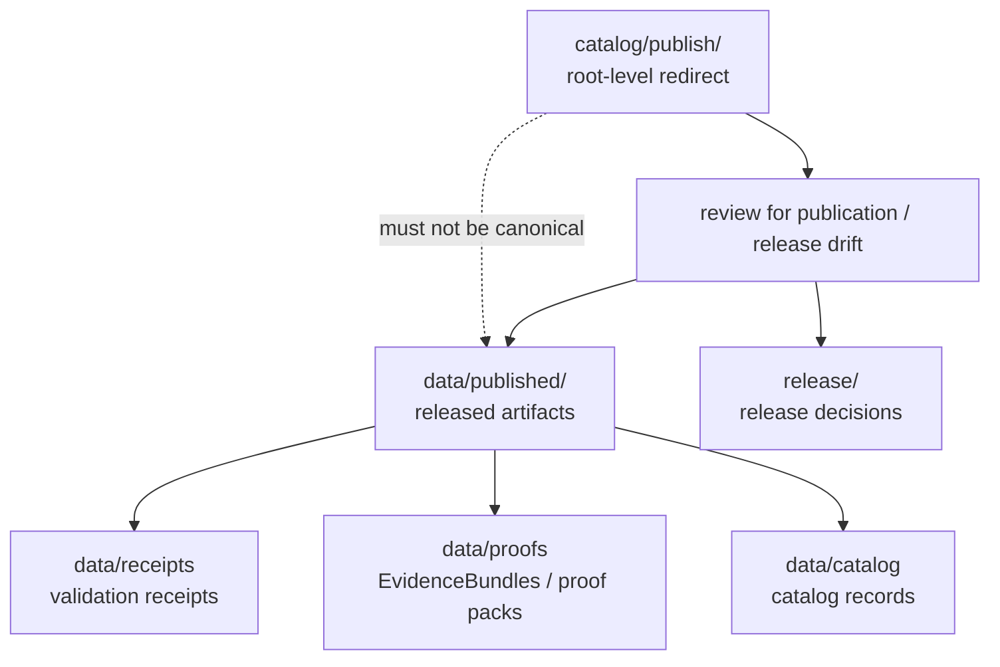

<!-- [KFM_META_BLOCK_V2]
doc_id: kfm://doc/catalog-publish-readme
title: catalog/publish/ — Publish Compatibility Redirect
type: readme
version: v0.1
status: draft
owners: OWNER_TBD — Publication steward · Release steward · Catalog steward · Data steward · Docs steward
created: 2026-06-16
updated: 2026-06-16
policy_label: public
related:
  - ../README.md
  - ../../data/README.md
  - ../../data/catalog/README.md
  - ../../data/published/README.md
  - ../../data/receipts/README.md
  - ../../data/proofs/README.md
  - ../../data/registry/README.md
  - ../../release/README.md
  - ../../schemas/contracts/v1/
  - ../../contracts/
  - ../../policy/
  - ../../docs/doctrine/directory-rules.md
tags: [kfm, catalog, publish, publication, release, compatibility-root, redirect, data-published, release-plane, non-authoritative, drift-fence]
notes:
  - "Root-level catalog/publish/ is treated as a compatibility/redirect fence, not canonical publication or release authority."
  - "Released artifacts belong under data/published/ after governed release."
  - "Release decisions, release manifests, rollback cards, corrections, and signatures belong under release/, not under catalog/publish/."
  - "Do not add published artifacts, release records, receipts, proofs, source registry rows, or catalog records here without an ADR/migration note."
  - "Specific current contents, producers, migration status, publication schema maturity, and CI enforcement remain NEEDS VERIFICATION."
[/KFM_META_BLOCK_V2] -->

<a id="top"></a>

<div align="center">

# Publish Compatibility Redirect

`catalog/publish/`

**Compatibility / redirect fence for legacy or accidental root-level publish placement. Released artifacts belong under `data/published/`, while release decisions and release-state records belong under `release/`.**


[Purpose](#1-purpose) · [Canonical homes](#2-canonical-homes) · [Authority boundary](#3-authority-boundary) · [Allowed contents](#5-allowed-contents) · [Forbidden contents](#6-forbidden-contents) · [Migration](#9-migration-posture) · [Definition of done](#12-definition-of-done)

</div>

---

> [!IMPORTANT]
> **Status:** draft / `NEEDS VERIFICATION`  
> **Path:** `catalog/publish/README.md`  
> **Responsibility root:** compatibility redirect / drift fence only  
> **Published artifact home:** `data/published/`  
> **Release decision home:** `release/`  
> **Truth posture:** CONFIRMED README path / CONFIRMED root-level `catalog/` is a compatibility redirect / CONFIRMED `data/published/README.md` path exists as a stub / CONFIRMED `release/README.md` declares release decisions as canonical / PROPOSED `catalog/publish/` redirect contract / UNKNOWN current publish files, migration status, CI enforcement, and ADR disposition

> [!CAUTION]
> Do not make `catalog/publish/` a parallel publication, release, or catalog authority. KFM published artifacts must live under `data/published/`; release decisions, manifests, rollback, corrections, and signatures must live under `release/`; catalog records must live under `data/catalog/`; receipts and proofs must live under their own roots.

---

## 1. Purpose

`catalog/publish/` is a **root-level compatibility redirect** for publish path drift.

It exists only to prevent accidental or legacy publication material from becoming a parallel authority outside the KFM lifecycle data and release roots. This folder should not be used for canonical published artifacts, release decisions, release manifests, rollback records, correction records, catalog records, receipts, proofs, or source registry material.

This README does not prove that any publish material currently exists here, that a migration has been completed, that publication schemas are implemented, or that CI currently blocks writes to this path.

[Back to top](#top)

---

## 2. Canonical homes

Released artifacts belong under:

```text
data/published/
```

Release decision and release-state material belongs under:

```text
release/
```

Related support records belong in separate owning roots:

```text
data/catalog/      # catalog records and catalog-family indexes
data/receipts/     # receipts and validation records
data/proofs/       # EvidenceBundles and proof packs
data/registry/     # source, rights, and sensitivity registry rows
```

The root-level `catalog/publish/` directory is a redirect/fence only.

## 3. Authority boundary

`catalog/publish/` has **no canonical publication, release, or catalog authority**. It may hold only README guidance, migration notes, drift logs, or temporary redirect markers while misplaced publish material is moved into its proper home.

```text
WRONG / LEGACY ROOT         PUBLISHED ARTIFACT HOME          RELEASE AUTHORITY HOME
catalog/publish/       -->  data/published/             -->  release/
compatibility fence only    released artifacts                release decisions
not authoritative                                             rollback / correction state
```

A published artifact outside `data/published/` should be treated as drift until reviewed and migrated. A release decision record outside `release/` should be treated as release-plane drift until reviewed and migrated.

## 4. Default posture

Anything found under root-level `catalog/publish/` should be treated as **NEEDS VERIFICATION** and potentially misplaced.

Do not cite or depend on root-level publish files as canonical published artifacts or release records. First confirm source, provenance, rights, sensitivity, schema validity, lifecycle state, receipts, proofs, release state, rollback path, and correction path.

## 5. Allowed contents

| Allowed item | Example | Required posture |
|---|---|---|
| README / redirect docs | `README.md` | Compatibility fence only |
| Migration note | `MIGRATION.md` | Temporary and ADR/review-linked |
| Drift note | `DRIFT.md`, `OPEN-QUESTIONS.md` | Must point to canonical homes and review steps |
| Placeholder marker | `.gitkeep` | Does not authorize publication or release content |

## 6. Forbidden contents

| Forbidden here | Correct home |
|---|---|
| Released artifacts and published map/docs/data bundles | `data/published/` |
| ReleaseManifest, PromotionDecision, RollbackCard, CorrectionNotice, signatures | `release/` |
| Catalog records, catalog indexes, STAC/DCAT/PROV records | `data/catalog/` |
| Receipts and validation reports | `data/receipts/` |
| EvidenceBundles, proof packs, attestations | `data/proofs/` |
| Source descriptors, source registry rows, rights rows, sensitivity rows | `data/registry/` or governed registry homes |
| Schemas and machine-shape contracts | `schemas/contracts/v1/` |
| Human contracts and object-meaning docs | `contracts/` |
| Policy rules and policy decisions | `policy/` and governed policy-decision homes |
| Source code, scripts, packages, pipelines, build tools | `apps/`, `packages/`, `tools/`, `scripts/`, `pipelines/` |
| Raw, work, quarantine, processed, or unpublished lifecycle data | `data/` lifecycle subtrees |

## 7. Directory shape

Current implementation inventory remains `NEEDS VERIFICATION`.

```text
catalog/publish/
├── README.md                 # compatibility redirect / drift fence
├── rollback/README.md        # compatibility redirect / drift fence
├── MIGRATION.md              # PROPOSED only if migration is active
└── DRIFT.md                  # PROPOSED only if misplaced publication material is found
```

> [!WARNING]
> Do not treat this suggested shape as repo fact. Verify actual contents before making inventory or migration claims.

## 8. Diagram



## 9. Migration posture

If publish files are found here:

1. Do not depend on them as canonical records.
2. Identify whether they are published artifacts, release records, catalog records, receipts, proofs, source registry rows, or unpublished lifecycle material.
3. Move released artifacts into `data/published/` only if release state and support records are valid.
4. Move release decision and release-state material into `release/`.
5. Move receipts, proofs, catalog records, and registry rows into their owning roots.
6. Check sensitivity, rights, provenance, evidence-resolution, and publication-readiness requirements before moving anything.
7. Preserve provenance, source refs, digests, receipts, review notes, rollback path, and correction path.
8. Add a drift register or migration note if the material has already been consumed.
9. Leave root-level `catalog/publish/` as a redirect/fence unless an ADR explicitly says otherwise.

## 10. Validation expectations

Useful validation for this folder should cover:

- no published artifacts are stored here;
- no ReleaseManifest, PromotionDecision, RollbackCard, CorrectionNotice, or release-state records are stored here;
- no receipts, proofs, catalog records, registry records, policy rules, schemas, source code, or lifecycle data are stored here;
- any non-README content is tied to an active migration or drift note;
- CI or review checks flag root-level `catalog/publish/` writes;
- links point users to `data/published/`, `release/`, `data/catalog/`, `data/receipts/`, `data/proofs/`, and other canonical homes.

## 11. Safe change pattern

For changes under `catalog/publish/`:

1. Confirm the change is redirect documentation, migration support, or drift documentation only.
2. Confirm it does not create a parallel publication, release, or catalog authority.
3. Confirm released artifacts are placed under `data/published/`.
4. Confirm release decisions and release-state records are placed under `release/`.
5. Confirm receipts/proofs/catalog/registry records are placed under their owning roots.
6. Document migration and rollback if any misplaced material was moved.
7. Update docs and validation rules when behavior materially changes.

## 12. Definition of done

- [ ] Owners are confirmed and `OWNER_TBD` is replaced.
- [ ] Actual root-level `catalog/publish/` contents are verified.
- [ ] Any misplaced publication material is migrated or documented as drift.
- [ ] Any misplaced release-decision material is migrated or documented as drift.
- [ ] `data/published/` is confirmed as the canonical published artifact home in current docs.
- [ ] `release/` is confirmed as the canonical release decision home in current docs.
- [ ] No trust-bearing records live here.
- [ ] No published artifacts, release records, receipts, proofs, catalog records, registry records, schemas, contracts, policy rules, source code, or unpublished lifecycle data live here.
- [ ] CI/review behavior is verified or marked `NEEDS VERIFICATION`.

## 13. Open verification items

| Item | Why it matters |
|---|---|
| Confirm actual files under root-level `catalog/publish/` | Prevents overclaiming or missing drift |
| Confirm whether any workflow writes here | Required before producer claims |
| Confirm publication/release schema maturity | Required before implementation claims |
| Confirm migration status to `data/published/` or `release/` | Required before canonical-home claims beyond doctrine |
| Confirm CI/review guard exists | Required before enforcement claims |
| Confirm no trust records are stored here | Required before Directory Rules compliance claims |
| Confirm ADR status for root-level `catalog/publish/` | Required before long-term retention claims |

<details>
<summary>Appendix A — no-loss preservation note</summary>

The previous README was empty. This replacement adds a publish redirect and anti-parallel-authority contract without claiming publication files, release decision files, migration work, CI enforcement, producer workflows, publication schema maturity, or ADR disposition are implemented.

</details>

## Status summary

`catalog/publish/` is a root-level compatibility redirect and publish drift fence. It is not the canonical publication, release decision, or catalog home.

Published artifacts belong under `data/published/`; release decisions belong under `release/`; receipts belong under `data/receipts/`; proofs belong under `data/proofs/`; catalog records belong under `data/catalog/`.

<p align="right"><a href="#top">Back to top</a></p>
