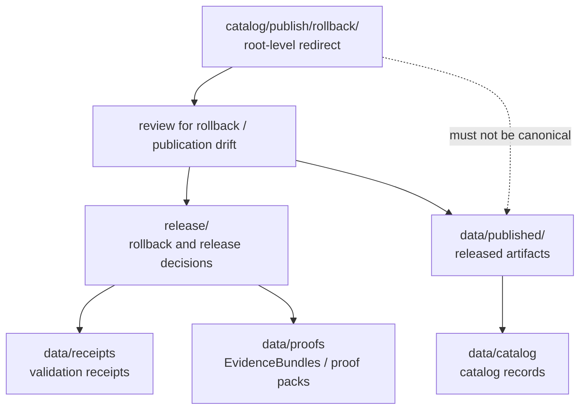

<!-- [KFM_META_BLOCK_V2]
doc_id: kfm://doc/catalog-publish-rollback-readme
title: catalog/publish/rollback/ — Publish Rollback Compatibility Redirect
type: readme
version: v0.1
status: draft
owners: OWNER_TBD — Publication steward · Release steward · Catalog steward · Data steward · Docs steward
created: 2026-06-16
updated: 2026-06-16
policy_label: public
related:
  - ../../README.md
  - ../../../data/README.md
  - ../../../data/catalog/README.md
  - ../../../data/published/README.md
  - ../../../data/receipts/README.md
  - ../../../data/proofs/README.md
  - ../../../release/README.md
  - ../../../schemas/contracts/v1/
  - ../../../contracts/
  - ../../../policy/
  - ../../../docs/doctrine/directory-rules.md
tags: [kfm, catalog, publish, rollback, publication, release, compatibility-root, redirect, data-published, release-plane, non-authoritative, drift-fence]
notes:
  - "Root-level catalog/publish/rollback/ is treated as a compatibility/redirect fence, not canonical rollback or publication authority."
  - "Rollback decisions, rollback cards, corrections, and release-state records belong under release/."
  - "Released artifacts belong under data/published/ only after governed release."
  - "Do not add rollback records, release records, publication artifacts, receipts, proofs, source registry rows, or catalog records here without an ADR/migration note."
  - "Specific current contents, producers, migration status, rollback schema maturity, and CI enforcement remain NEEDS VERIFICATION."
[/KFM_META_BLOCK_V2] -->

<a id="top"></a>

<div align="center">

# Publish Rollback Compatibility Redirect

`catalog/publish/rollback/`

**Compatibility / redirect fence for legacy or accidental root-level publish/rollback placement. Rollback decisions and release-state records belong under `release/`; released artifacts belong under `data/published/`.**


[Purpose](#1-purpose) · [Canonical homes](#2-canonical-homes) · [Authority boundary](#3-authority-boundary) · [Allowed contents](#5-allowed-contents) · [Forbidden contents](#6-forbidden-contents) · [Migration](#9-migration-posture) · [Definition of done](#12-definition-of-done)

</div>

---

> [!IMPORTANT]
> **Status:** draft / `NEEDS VERIFICATION`  
> **Path:** `catalog/publish/rollback/README.md`  
> **Responsibility root:** compatibility redirect / drift fence only  
> **Published artifact home:** `data/published/`  
> **Rollback / release decision home:** `release/`  
> **Truth posture:** CONFIRMED README path / CONFIRMED root-level `catalog/` is a compatibility redirect / CONFIRMED `data/published/README.md` path exists as a stub / CONFIRMED `release/README.md` declares release decisions, rollback cards, corrections, and signatures under `release/` / PROPOSED `catalog/publish/rollback/` redirect contract / UNKNOWN current rollback files, migration status, CI enforcement, and ADR disposition

> [!CAUTION]
> Do not make `catalog/publish/rollback/` a parallel publication, rollback, release, or catalog authority. KFM rollback decisions, rollback cards, corrections, release manifests, and release-state records must live under `release/`; released artifacts must live under `data/published/`; catalog records, receipts, and proofs must live under their own canonical roots.

---

## 1. Purpose

`catalog/publish/rollback/` is a **root-level compatibility redirect** for publish/rollback path drift.

It exists only to prevent accidental or legacy rollback material from becoming a parallel authority outside the KFM release and lifecycle data roots. This folder should not be used for canonical rollback cards, release decisions, correction records, release manifests, published artifacts, catalog records, receipts, proofs, or source registry material.

This README does not prove that any rollback or publication material currently exists here, that a migration has been completed, that rollback schemas are implemented, or that CI currently blocks writes to this path.

[Back to top](#top)

---

## 2. Canonical homes

Rollback and release decision material belongs under:

```text
release/
```

Released artifacts belong under:

```text
data/published/
```

Related support records belong in separate owning roots:

```text
data/catalog/      # catalog records and catalog-family indexes
data/receipts/     # receipts and validation records
data/proofs/       # EvidenceBundles and proof packs
data/registry/     # source, rights, and sensitivity registry rows
```

The root-level `catalog/publish/rollback/` directory is a redirect/fence only.

## 3. Authority boundary

`catalog/publish/rollback/` has **no canonical rollback, release, publication, or catalog authority**. It may hold only README guidance, migration notes, drift logs, or temporary redirect markers while misplaced rollback or publication material is moved into its proper home.

```text
WRONG / LEGACY ROOT                    RELEASE AUTHORITY HOME              PUBLISHED ARTIFACT HOME
catalog/publish/rollback/        -->   release/                       -->  data/published/
compatibility fence only                rollback / correction state         released artifacts
not authoritative                       release decisions
```

A rollback record outside `release/` should be treated as release-plane drift until reviewed and migrated. A released artifact outside `data/published/` should be treated as publication drift until reviewed and migrated.

## 4. Default posture

Anything found under root-level `catalog/publish/rollback/` should be treated as **NEEDS VERIFICATION** and potentially misplaced.

Do not cite or depend on root-level publish/rollback files as canonical rollback, release, or published artifact records. First confirm source, provenance, rights, sensitivity, schema validity, lifecycle state, receipts, proofs, release state, rollback path, and correction path.

## 5. Allowed contents

| Allowed item | Example | Required posture |
|---|---|---|
| README / redirect docs | `README.md` | Compatibility fence only |
| Migration note | `MIGRATION.md` | Temporary and ADR/review-linked |
| Drift note | `DRIFT.md`, `OPEN-QUESTIONS.md` | Must point to canonical homes and review steps |
| Placeholder marker | `.gitkeep` | Does not authorize rollback, publication, release, or catalog content |

## 6. Forbidden contents

| Forbidden here | Correct home |
|---|---|
| RollbackCard, correction, release-decision, release-manifest, or release-state records | `release/` |
| Released artifacts and published map/docs/data bundles | `data/published/` |
| Catalog records, catalog indexes, STAC/DCAT/PROV records | `data/catalog/` |
| Receipts and validation reports | `data/receipts/` |
| EvidenceBundles, proof packs, attestations | `data/proofs/` |
| Source descriptors, source registry rows, rights rows, sensitivity rows | `data/registry/` or governed registry homes |
| Schemas and machine-shape contracts | `schemas/contracts/v1/` |
| Human contracts and object-meaning docs | `contracts/` |
| Policy rules and policy decisions | `policy/` and governed policy-decision homes |
| Source code, scripts, packages, pipelines, build tools | `apps/`, `packages/`, `tools/`, `scripts/`, `pipelines/` |
| Raw, work, quarantine, processed, or unpublished lifecycle data | `data/` lifecycle subtrees |

## 7. Directory shape

Current implementation inventory remains `NEEDS VERIFICATION`.

```text
catalog/publish/rollback/
├── README.md                 # compatibility redirect / drift fence
├── MIGRATION.md              # PROPOSED only if migration is active
└── DRIFT.md                  # PROPOSED only if misplaced rollback/publication material is found
```

> [!WARNING]
> Do not treat this suggested shape as repo fact. Verify actual contents before making inventory or migration claims.

## 8. Diagram



## 9. Migration posture

If rollback or publication files are found here:

1. Do not depend on them as canonical records.
2. Identify whether they are rollback records, release records, published artifacts, catalog records, receipts, proofs, source registry rows, or unpublished lifecycle material.
3. Move rollback and release-state material into `release/`.
4. Move released artifacts into `data/published/` only if release state and support records are valid.
5. Move receipts, proofs, catalog records, and registry rows into their owning roots.
6. Check sensitivity, rights, provenance, evidence-resolution, and publication-readiness requirements before moving anything.
7. Preserve provenance, source refs, digests, receipts, review notes, rollback path, and correction path.
8. Add a drift register or migration note if the material has already been consumed.
9. Leave root-level `catalog/publish/rollback/` as a redirect/fence unless an ADR explicitly says otherwise.

## 10. Validation expectations

Useful validation for this folder should cover:

- no rollback, correction, release-decision, release-manifest, or release-state records are stored here;
- no published artifacts are stored here;
- no receipts, proofs, catalog records, registry records, policy rules, schemas, source code, or lifecycle data are stored here;
- any non-README content is tied to an active migration or drift note;
- CI or review checks flag root-level `catalog/publish/rollback/` writes;
- links point users to `release/`, `data/published/`, `data/catalog/`, `data/receipts/`, `data/proofs/`, and other canonical homes.

## 11. Safe change pattern

For changes under `catalog/publish/rollback/`:

1. Confirm the change is redirect documentation, migration support, or drift documentation only.
2. Confirm it does not create a parallel rollback, publication, release, or catalog authority.
3. Confirm rollback and release-state records are placed under `release/`.
4. Confirm released artifacts are placed under `data/published/`.
5. Confirm receipts/proofs/catalog/registry records are placed under their owning roots.
6. Document migration and rollback if any misplaced material was moved.
7. Update docs and validation rules when behavior materially changes.

## 12. Definition of done

- [ ] Owners are confirmed and `OWNER_TBD` is replaced.
- [ ] Actual root-level `catalog/publish/rollback/` contents are verified.
- [ ] Any misplaced rollback or release-decision material is migrated or documented as drift.
- [ ] Any misplaced publication artifact is migrated or documented as drift.
- [ ] `release/` is confirmed as the canonical rollback and release decision home in current docs.
- [ ] `data/published/` is confirmed as the canonical published artifact home in current docs.
- [ ] No trust-bearing records live here.
- [ ] No rollback records, published artifacts, release records, receipts, proofs, catalog records, registry records, schemas, contracts, policy rules, source code, or unpublished lifecycle data live here.
- [ ] CI/review behavior is verified or marked `NEEDS VERIFICATION`.

## 13. Open verification items

| Item | Why it matters |
|---|---|
| Confirm actual files under root-level `catalog/publish/rollback/` | Prevents overclaiming or missing drift |
| Confirm whether any workflow writes here | Required before producer claims |
| Confirm rollback/publication schema maturity | Required before implementation claims |
| Confirm migration status to `release/` or `data/published/` | Required before canonical-home claims beyond doctrine |
| Confirm CI/review guard exists | Required before enforcement claims |
| Confirm no trust records are stored here | Required before Directory Rules compliance claims |
| Confirm ADR status for root-level `catalog/publish/rollback/` | Required before long-term retention claims |

<details>
<summary>Appendix A — no-loss preservation note</summary>

The previous README was empty. This replacement adds a publish/rollback redirect and anti-parallel-authority contract without claiming rollback files, publication files, migration work, CI enforcement, producer workflows, rollback schema maturity, or ADR disposition are implemented.

</details>

## Status summary

`catalog/publish/rollback/` is a root-level compatibility redirect and publish/rollback drift fence. It is not the canonical rollback, publication, release decision, or catalog home.

Rollback and release decisions belong under `release/`; published artifacts belong under `data/published/`; receipts belong under `data/receipts/`; proofs belong under `data/proofs/`; catalog records belong under `data/catalog/`.

<p align="right"><a href="#top">Back to top</a></p>
