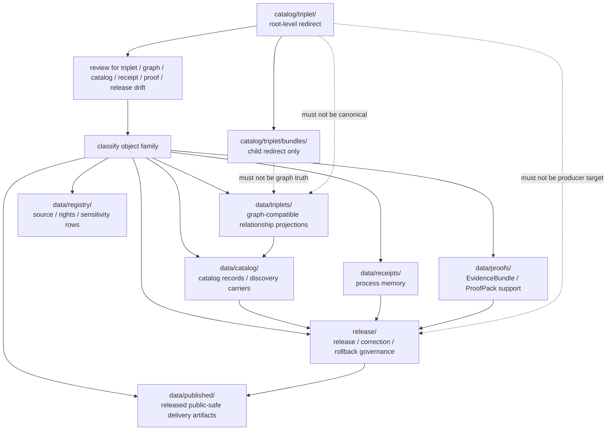

<!-- [KFM_META_BLOCK_V2]
doc_id: kfm://doc/catalog-triplet-readme
title: catalog/triplet/ — Triplet Compatibility Redirect
type: readme
version: v0.2
status: draft
owners: OWNER_TBD — Triplet steward · Graph steward · Catalog steward · Data steward · Evidence steward · Receipt steward · Proof steward · Release steward · Policy steward · Schema steward · Docs steward
created: 2026-06-16
updated: 2026-07-10
policy_label: public
related:
  - ../README.md
  - bundles/README.md
  - ../../data/README.md
  - ../../data/triplets/README.md
  - ../../data/triplets/bundles/README.md
  - ../../data/catalog/README.md
  - ../../data/receipts/README.md
  - ../../data/proofs/README.md
  - ../../data/published/README.md
  - ../../data/registry/README.md
  - ../../release/README.md
  - ../../schemas/contracts/v1/
  - ../../contracts/
  - ../../policy/
  - ../../docs/adr/ADR-0011-receipts-vs-proofs-vs-manifests-vs-catalog-separation.md
  - ../../docs/doctrine/directory-rules.md
tags: [kfm, catalog, triplet, triplets, graph, graph-projection, relationship-projection, bundles, compatibility-root, redirect, data-triplets, receipt-proof-catalog-publication-separation, non-authoritative, drift-fence, no-public-use]
notes:
  - "Refreshes the root-level catalog/triplet compatibility-redirect fence."
  - "Root-level catalog/triplet/ is compatibility and drift-control documentation only, not canonical triplet authority, graph authority, catalog authority, receipt authority, proof authority, release authority, publication authority, schema authority, policy authority, producer authority, hosting authority, or UI authority."
  - "Canonical graph-compatible relationship projections belong under data/triplets/. Dedicated bundle placement remains under data/triplets/ authority and requires target-ref verification before use."
  - "The child catalog/triplet/bundles/ README is a child compatibility redirect, not a trust-bearing graph bundle store."
  - "Catalog records belong under data/catalog/; receipts belong under data/receipts/; proof support belongs under data/proofs/; release-governance records belong under release/; published delivery artifacts belong under data/published/ after governed release."
  - "ADR-0011 is proposed and is used here only as separation evidence, not accepted-rule proof."
  - "Do not add triplet records, graph assertion sets, relationship exports, EvidenceBundles, receipts, release records, catalog records, schemas, policy rules, generated outputs, public artifacts, or producer targets here without an ADR/migration note."
  - "Actual current contents beyond README files, historical producers, workflow writes, migration status, triplet schema maturity, graph-export maturity, CI/review enforcement, public-client/producer exclusion, dedicated bundle sublane maturity, and ADR disposition remain NEEDS VERIFICATION."
  - "v0.2 adds current evidence basis, Directory Rules placement basis, canonical data/triplets alignment, child bundle redirect posture, family-separation posture, minimum safe redirect slice, anti-bypass matrix, migration/rollback posture, and safe language rules without claiming migration or enforcement maturity."
[/KFM_META_BLOCK_V2] -->

<a id="top"></a>

<div align="center">

# Triplet Compatibility Redirect

`catalog/triplet/`

**Root-level compatibility and drift-control fence for legacy or accidental triplet placement. Canonical graph-compatible relationship projections belong under `data/triplets/`; supporting catalog, receipt, proof, release, publication, and registry records stay in their own roots.**


[Evidence](#0-evidence-basis-for-this-revision) · [Purpose](#1-purpose) · [Canonical homes](#2-canonical-homes) · [Boundary](#3-authority-boundary) · [Allowed](#5-allowed-contents) · [Forbidden](#6-forbidden-contents) · [Child lanes](#8-child-redirect-lanes) · [Migration](#10-migration-posture) · [Definition of done](#17-definition-of-done)

</div>

---

> [!IMPORTANT]
> **Status:** draft / `NEEDS VERIFICATION`  
> **Path:** `catalog/triplet/README.md`  
> **Responsibility root:** compatibility redirect / drift fence only  
> **Canonical triplet home:** `data/triplets/`  
> **Dedicated bundle placement:** must remain under `data/triplets/` authority if created or accepted  
> **Catalog home:** `data/catalog/`  
> **Receipt home:** `data/receipts/`  
> **Proof home:** `data/proofs/`  
> **Release-governance home:** `release/`  
> **Published artifact home:** `data/published/`  
> **Directory Rules basis:** file location encodes ownership, governance, and lifecycle. Graph-compatible relationship projections belong under `data/triplets/`; catalog records belong under `data/catalog/`; receipts belong under `data/receipts/`; proof support belongs under `data/proofs/`; release decisions, manifests, correction, rollback, withdrawal, supersession, and signatures belong under `release/`; released public-safe delivery artifacts belong under `data/published/`. Root-level `catalog/triplet/` is a compatibility redirect only and must not become a parallel triplet, graph, catalog, receipt, proof, release, publication, schema, policy, source-registry, pipeline, package, tool, search, hosting, or UI authority.  
> **Truth posture:** CONFIRMED current GitHub README path / CONFIRMED parent root-level `catalog/README.md` exists and treats `catalog/` as compatibility redirect / CONFIRMED child `catalog/triplet/bundles/README.md` exists as a child compatibility redirect / CONFIRMED `data/triplets/README.md` exists and treats `data/triplets/` as the canonical graph-compatible relationship projection lane / CONFIRMED `data/catalog/README.md` exists and treats catalog as paired CATALOG-stage data, not release approval / CONFIRMED `data/receipts/README.md` exists and marks receipts as process memory / CONFIRMED `data/proofs/README.md` exists and treats proof artifacts as support objects, not public truth by placement / CONFIRMED `release/README.md` exists and treats `release/` as release-governance root / CONFIRMED ADR-0011 document exists and states proposed receipt/proof/catalog/publication separation / CONFIRMED Directory Rules document exists / PROPOSED root-level `catalog/triplet/` redirect contract / UNKNOWN actual files beyond README files, historical producers, workflow writes, migration status, triplet schema maturity, graph-export maturity, CI/review guard, public-client/producer exclusion, dedicated bundle sublane maturity, and ADR disposition

> [!CAUTION]
> Do not make `catalog/triplet/` a parallel graph, triplet, proof, release, or catalog authority. KFM triplet records, graph assertion sets, relationship projection exports, graph deltas, bundles, and claim-support graph material belong under `data/triplets/` or an accepted sublane under that data-lifecycle authority. Triplets are projections, not root truth. Evidence support, receipts, catalog records, release decisions, published artifacts, schemas, contracts, policies, source registries, code, generated previews, and unpublished lifecycle data stay in their own roots.

---

## Quick jump

- [0. Evidence basis for this revision](#0-evidence-basis-for-this-revision)
- [1. Purpose](#1-purpose)
- [2. Canonical homes](#2-canonical-homes)
- [3. Authority boundary](#3-authority-boundary)
- [4. Default posture](#4-default-posture)
- [5. Allowed contents](#5-allowed-contents)
- [6. Forbidden contents](#6-forbidden-contents)
- [7. Directory shape](#7-directory-shape)
- [8. Child redirect lanes](#8-child-redirect-lanes)
- [9. Minimum safe redirect slice](#9-minimum-safe-redirect-slice)
- [10. Migration posture](#10-migration-posture)
- [11. Runtime and producer anti-bypass matrix](#11-runtime-and-producer-anti-bypass-matrix)
- [12. Diagram](#12-diagram)
- [13. Inspection path](#13-inspection-path)
- [14. Validation expectations](#14-validation-expectations)
- [15. Safe change pattern](#15-safe-change-pattern)
- [16. Rollback and correction posture](#16-rollback-and-correction-posture)
- [17. Definition of done](#17-definition-of-done)
- [18. Open verification items](#18-open-verification-items)
- [19. Safe language rules](#19-safe-language-rules)

---

## 0. Evidence basis for this revision

This README is a documentation boundary, not migration proof, graph-export proof, triplet-schema proof, release approval proof, publication-hosting proof, or CI enforcement proof. The 2026-07-10 revision updates an existing compatibility README and keeps maturity bounded while aligning root-level `catalog/triplet/` with the canonical `data/triplets/` graph-compatible relationship projection lane, the paired `data/catalog/` catalog lane, the separate `data/receipts/` process-memory root, the separate `data/proofs/` proof-support root, the `release/` release-governance root, and Directory Rules placement posture.

| Evidence item | Status | What it supports | What it does not prove |
|---|---|---|---|
| `catalog/triplet/README.md` exists on `main`. | CONFIRMED | This is an existing README update, not a new path proposal. | It does not prove actual contents beyond the README, historical producers, migration status, CI enforcement, public-client exclusion, graph-export maturity, or ADR disposition. |
| `catalog/README.md` exists and treats root-level `catalog/` as a compatibility redirect, not canonical catalog authority. | CONFIRMED root redirect posture | `catalog/triplet/` should inherit root-level redirect/fence behavior. | It does not prove all root-level catalog/triplet drift has been removed. |
| `catalog/triplet/bundles/README.md` exists as a child redirect. | CONFIRMED child redirect path | `bundles/` is a child compatibility lane, not a graph-bundle authority. | It does not prove child migration, producer exclusion, enforcement, or dedicated canonical bundle-lane maturity. |
| `data/triplets/README.md` exists and treats `data/triplets/` as the parent lane for graph-compatible relationship projections at the `CATALOG / TRIPLET` lifecycle stage. | CONFIRMED canonical triplets-lane posture | Canonical graph-compatible relationship projections belong under `data/triplets/`. | It does not prove concrete inventories, schemas, validators, graph-build receipts, release approvals, or public route behavior. |
| `data/catalog/README.md` exists and states catalog records help discovery but do not make claims true, replace EvidenceBundle support, or approve publication. | CONFIRMED catalog-root posture | Catalog records belong under `data/catalog/` and must not be treated as triplet proof, graph authority, or publication approval. | It does not prove concrete catalog inventory, validators, receipts, or route behavior. |
| `data/receipts/README.md` exists and marks receipts as process-memory artifacts. | CONFIRMED receipt-root posture | Graph-build, validation, migration, AI, and release-support receipts belong under `data/receipts/`. | It does not prove emitted receipt inventories, signing, validators, or release integration. |
| `data/proofs/README.md` exists and treats proof artifacts as support objects, not public truth by placement. | CONFIRMED proof-root posture | EvidenceBundle/ProofPack support belongs under `data/proofs/`, not this redirect path. | It does not prove emitted proof inventories, schemas, validators, fixtures, CI workflows, or release-gate enforcement. |
| `release/README.md` exists and treats `release/` as release-governance root. | CONFIRMED release-root posture | Release decisions, correction, rollback, withdrawal, supersession, and signatures belong under `release/`. | It does not prove release workflow maturity or active release approval. |
| `docs/adr/ADR-0011-receipts-vs-proofs-vs-manifests-vs-catalog-separation.md` exists and states the proposed separation rule `receipt ≠ proof ≠ catalog ≠ publication`. | CONFIRMED ADR document presence; PROPOSED decision status | Supports family-separation language while keeping ADR acceptance bounded. | It does not prove ADR acceptance or validator enforcement. |
| `docs/doctrine/directory-rules.md` exists and states that file location encodes ownership, governance, and lifecycle. | CONFIRMED placement doctrine | Root-level `catalog/triplet/` must remain a compatibility fence; triplets, catalog, receipts, proofs, release records, and published artifacts belong under their owning roots. | It does not prove live repo drift has been fully audited. |

[Back to top](#top)

---

## 1. Purpose

`catalog/triplet/` is a **root-level compatibility redirect** for triplet path drift.

It exists only to prevent accidental, legacy, generated, copied, or externally imported graph/triplet material from becoming a parallel authority outside KFM's governed lifecycle data and release roots.

This folder should not be used for canonical:

- triplet records, graph assertion sets, graph deltas, relationship projection exports, graph-compatible relationship snapshots, graph export packages, or bundle payloads;
- claim-support graph material, citation-bearing relationship sets, proof-backed graph extracts, inferred relationship bundles, or AI-generated relationship projections;
- catalog records, STAC/DCAT/PROV records, CatalogMatrix records, catalog indexes, source descriptors, or discovery carriers;
- process receipts, graph-build receipts, validation receipts, migration receipts, rollback receipts, release dry-run receipts, AI receipts, or telemetry receipts;
- EvidenceBundles, ProofPacks, citation-validation bundles, catalog-closure proof, release-readiness proof, graph integrity proof, rollback proof, correction proof, or claim-support records;
- release manifests, promotion decisions, rollback cards, correction notices, withdrawal notices, supersession records, signatures, release-state records, public-safe artifacts, reports, stories, tiles, PMTiles, API payload snapshots, public indexes, allowlists, caveat summaries, or digest sidecars;
- source descriptors, rights rows, sensitivity rows, registry rows, schemas, contracts, policy rules, producer code, generated previews, build outputs, or unpublished lifecycle data.

This README does not prove that any triplet material currently exists here, that migration has been completed, that producer tools avoid this path, that public clients exclude this path, that triplet schemas are implemented, that CI blocks writes here, or that any ADR has finalized long-term retention of this compatibility root.

[Back to top](#top)

---

## 2. Canonical homes

Graph-compatible relationship projections belong under:

```text
data/triplets/
```

A dedicated bundle sublane may become an accepted location only under the `data/triplets/` authority and only when the target ref confirms it:

```text
data/triplets/bundles/  # NEEDS VERIFICATION unless target-ref evidence confirms the lane
```

Catalog records and discovery/interchange carriers belong under:

```text
data/catalog/
```

Process-memory receipts belong under:

```text
data/receipts/
```

Proof support belongs under:

```text
data/proofs/
```

Release-governance material belongs under:

```text
release/
```

Released public-safe delivery artifacts belong under:

```text
data/published/
```

Source, rights, sensitivity, and registry rows belong under:

```text
data/registry/
```

The root-level `catalog/triplet/` directory is a redirect/fence only.

```text
catalog/triplet/  # compatibility redirect only; do not add triplet or graph records here
data/triplets/    # graph-compatible relationship projections
data/catalog/     # catalog-stage lifecycle records
data/receipts/    # process-memory records
data/proofs/      # proof-support records
release/          # release, correction, rollback, withdrawal, supersession, and governance records
data/published/   # released public-safe delivery artifacts
data/registry/    # source, rights, sensitivity, and registry records
```

If a future ADR or migration changes triplet placement, this README should be updated to cite the accepted target, producer-configuration evidence, validation evidence, and any migration, correction, or rollback records.

## 3. Authority boundary

`catalog/triplet/` has **no canonical triplet authority**, **no graph authority**, **no catalog authority**, **no receipt authority**, **no proof authority**, **no release authority**, and **no publication authority**. It may hold only redirect guidance, child redirect READMEs, migration notes, drift logs, or temporary markers while misplaced material is reviewed and moved into its proper owning root.

```text
WRONG / LEGACY ROOT          TRIPLET / GRAPH HOME             SUPPORT HOMES
catalog/triplet/        -->  data/triplets/              -->  data/catalog/
compatibility fence only     relationship projections         data/receipts/
not authoritative            graph deltas / exports           data/proofs/
                                                            release/
                                                            data/published/
                                                            data/registry/
```

A triplet record outside `data/triplets/` should be treated as triplet-family drift. A catalog record outside `data/catalog/`, a receipt outside `data/receipts/`, a proof outside `data/proofs/`, a release record outside `release/`, or a public artifact outside `data/published/` should be treated as family drift until reviewed and migrated.

## 4. Default posture

Anything found under root-level `catalog/triplet/` should be treated as **NEEDS VERIFICATION** and potentially misplaced.

Do not expose, publish, index, cite, search, cache, export, tile, host, or depend on root-level triplet files as canonical graph or triplet records. First confirm object family, source, provenance, rights, sensitivity, evidence resolution, schema validity, policy decision, lifecycle state, receipt support, proof support, catalog closure, release state, digest/sidecar integrity, rollback path, correction path, and whether the object is actually a triplet projection, graph export, catalog carrier, receipt, proof, registry row, release-governance record, published artifact, or unpublished candidate.

## 5. Allowed contents

| Allowed item | Example | Required posture |
|---|---|---|
| README / redirect docs | `README.md` | Compatibility fence only |
| Child redirect README | `bundles/README.md` | Child compatibility guidance only |
| Migration note | `MIGRATION.md` | Temporary and ADR/review-linked |
| Drift note | `DRIFT.md`, `OPEN-QUESTIONS.md` | Must point to canonical homes and review steps |
| Placeholder marker | `.gitkeep` | Does not authorize triplet, graph, catalog, receipt, proof, release, policy, schema, or public-output content |

## 6. Forbidden contents

| Forbidden here | Correct home |
|---|---|
| Triplet records, graph assertion sets, relationship projection exports, graph deltas, graph snapshots, graph export packages, or bundle payloads | `data/triplets/` or an accepted sublane under it |
| Claim-support graph material, citation-bearing graph extracts, graph integrity proof | `data/triplets/` and `data/proofs/` as appropriate |
| Catalog records, catalog indexes, STAC/DCAT/PROV records, CatalogMatrix records | `data/catalog/` |
| Receipts, graph-build receipts, validation receipts, redaction/generalization receipts, AI receipts, release dry-run receipts, rollback receipts, migration receipts | `data/receipts/` |
| EvidenceBundles, ProofPacks, attestations, citation-validation bundles, release-readiness proof, rollback proof, correction proof, claim-support records | `data/proofs/` |
| ReleaseManifest, PromotionDecision, release decision, RollbackCard, CorrectionNotice, withdrawal, supersession, signature, release-state record | `release/` |
| Released artifacts, public-safe graph exports, reports, stories, downloads, API payload snapshots, public indexes, allowlists, caveat summaries, digest sidecars, tiles, PMTiles | `data/published/` after governed release |
| Source descriptors, source registry rows, rights rows, sensitivity rows | `data/registry/` or governed registry homes |
| Schemas and machine-shape contracts | `schemas/contracts/v1/` |
| Human contracts and object-meaning docs | `contracts/` |
| Policy rules and policy decisions | `policy/` and governed policy-decision homes |
| Source code, scripts, packages, pipelines, build tools, producers, preview generators | `apps/`, `packages/`, `tools/`, `scripts/`, `pipelines/` |
| RAW, WORK, QUARANTINE, PROCESSED, CATALOG, TRIPLET, unpublished candidate, or restricted lifecycle data | `data/` lifecycle subtrees |

## 7. Directory shape

Current implementation inventory remains `NEEDS VERIFICATION`.

```text
catalog/triplet/
├── README.md                 # compatibility redirect / drift fence
├── bundles/README.md         # child compatibility redirect / drift fence when present
├── MIGRATION.md              # PROPOSED only if migration is active
└── DRIFT.md                  # PROPOSED only if misplaced triplet material is found
```

> [!WARNING]
> Do not treat this suggested shape as complete repo inventory. Verify actual contents before making inventory, producer, enforcement, triplet-schema, graph-export, hosting, or migration claims.

## 8. Child redirect lanes

Child lanes under root-level `catalog/triplet/` are compatibility guidance only unless an accepted ADR or migration note says otherwise.

| Child lane | Status | Canonical target | Boundary |
|---|---|---|---|
| `catalog/triplet/bundles/` | Compatibility redirect path when present | `data/triplets/` or an accepted `data/triplets/` child lane | Must not store triplet bundles, graph exports, receipts, proofs, catalog records, release records, public artifacts, schemas, policies, or producer output. |

A child redirect README may be updated before this parent. Treat any child state as target-ref evidence only; do not claim a dedicated canonical bundle sublane under `data/triplets/` exists unless that path is verified.

## 9. Minimum safe redirect slice

A smallest safe `catalog/triplet/` state should prove only that the folder prevents drift; it should not contain graph, trust-bearing, or public-delivery material.

| Slice item | Minimum requirement | Why it matters |
|---|---|---|
| Redirect README | Points to `data/triplets/` for graph-compatible projections | Prevents parallel graph authority |
| No triplet records | No graph export packages, graph deltas, relationship projection bundles, triplet records, or graph snapshots | Preserves data lifecycle triplet root |
| No catalog records | No STAC, DCAT, PROV, CatalogMatrix, source descriptor, or catalog index files | Preserves catalog and registry roots |
| No receipt records | No graph-build receipt, validation receipt, AI receipt, migration receipt, release dry-run receipt, rollback receipt, or redaction receipt | Preserves receipt/process-memory root |
| No proof records | No EvidenceBundle, ProofPack, release attestation, citation validation, rollback proof, correction proof, or claim-support files | Preserves proof-support root |
| No release/public artifacts | No ReleaseManifest, release decision, RollbackCard, published graph export, public index, PMTiles, report, story, API snapshot, or digest | Preserves release and published roots |
| Child-lane guard | `bundles/` remains compatibility-only | Prevents nested drift from hardening into graph authority |
| Drift procedure | Explains how to inspect and migrate misplaced records | Keeps remediation reversible |
| Producer guard | Producers, generators, scripts, and CI should not write durable graph material here | Prevents reintroducing drift |
| Public-use guard | Public clients, search services, map runtimes, exports, static hosting, and indexes must not read from this path as canonical | Preserves governed access path |
| Verification backlog | Open items stay visible | Prevents documentation from pretending migration/enforcement is complete |

## 10. Migration posture

If triplet files are found here:

1. Do not publish, cite, index, search, cache, export, tile, host, or depend on them.
2. Identify whether they are triplet records, graph assertion sets, graph deltas, relationship projection exports, public graph exports, catalog records, CatalogMatrix/STAC/DCAT/PROV records, receipts, proof support, source registry rows, schemas, policy records, release records, published-output material, unpublished lifecycle material, generated previews, temporary build artifacts, or producer outputs.
3. Determine whether the file is historical drift, generated drift, copied output, unreviewed local work, or an intentional migration marker.
4. Move triplet projection material into `data/triplets/` or an accepted sublane under it.
5. Move catalog records into `data/catalog/` and source/rights/sensitivity registry records into `data/registry/`.
6. Move receipts into `data/receipts/`.
7. Move proof support into `data/proofs/`.
8. Move release-governance records into `release/`.
9. Move or regenerate released public-safe graph artifacts into `data/published/` only after governed release approval and required sidecar/digest/citation/caveat support.
10. Move schemas, contracts, policy rules, code, and producer outputs into their owning roots.
11. Preserve provenance, source refs, digests, graph-build receipts, proof refs, catalog refs, review notes, producer identity, release refs, correction refs, and rollback path.
12. Add a drift register, migration note, or correction note if the misplaced material was previously consumed.
13. Add or update validation checks so producers do not recreate root-level triplet drift.
14. Leave `catalog/triplet/` as a redirect/fence unless an accepted ADR explicitly changes the authority model.

## 11. Runtime and producer anti-bypass matrix

| Bypass risk | Required behavior | Review signal |
|---|---|---|
| Producer writes triplet records or bundles to `catalog/triplet/` | Fail review/CI; write to `data/triplets/` or an accepted sublane instead | Producer config and output paths checked |
| Producer writes catalog records here | Fail review/CI; write to `data/catalog/` instead | Catalog path check passes |
| Producer writes receipts here | Fail review/CI; write to `data/receipts/` instead | Receipt path check passes |
| Producer writes proofs here | Fail review/CI; write to `data/proofs/` instead | Proof path check passes |
| Producer writes release records here | Fail review/CI; write to `release/` instead | Release path check passes |
| Producer writes public graph exports here | Fail review/CI; write to `data/published/` only after release | Published path and release-state checks pass |
| Public client reads root-level triplet path | Deny; route through governed API/release/public-safe path | Client/search/index/hosting config excludes this path |
| Root-level triplet file is treated as canonical graph truth | Mark as drift; resolve evidence/proof/catalog/release support before use | Migration note references canonical target |
| Claim-bearing relationship lacks EvidenceBundle support | Hold, restrict, or abstain; do not cite root-level triplet material as evidence | EvidenceRef/proof validation passes |
| Sensitive relationship join appears here | Deny, quarantine, redact, generalize, aggregate, or remove | Sensitivity/publication review passes |
| AI-generated relationship projection appears here | Treat as candidate or generated carrier only; route to work/quarantine/review lanes | AI boundary and evidence-review checks pass |
| Schema/profile file stored here | Move to `schemas/` or standards docs as appropriate | Schema-home review passes |
| Policy rule stored here | Move to `policy/` | Policy-root review passes |
| Search/cache/export/tile/static-hosting pipeline consumes this path | Deny as canonical; switch to governed triplet/release/published source | Producer and client config reviewed |
| Drift file already consumed downstream | Add correction/migration note and rollback path | Correction path is auditable |
| README claims CI enforcement without run/check evidence | Mark enforcement `NEEDS VERIFICATION` | Current CI evidence cited before pass claims |

## 12. Diagram



## 13. Inspection path

Actual root-level contents, producers, workflow writes, migration status, triplet schema maturity, graph-export maturity, hosting readiness, CI/review enforcement, public-client/index exclusion, dedicated bundle sublane status, and current ADR disposition remain `NEEDS VERIFICATION`.

```bash
find catalog/triplet -maxdepth 6 -type f | sort
find data/triplets data/catalog data/receipts data/proofs data/published data/registry release schemas contracts policy docs tools scripts pipelines pipeline_specs .github/workflows -maxdepth 6 -type f 2>/dev/null | grep -Ei 'triplet|triple|graph|relationship|bundle|export|delta|catalog|receipt|proof|EvidenceBundle|ProofPack|ReleaseManifest|PromotionDecision|RollbackCard|CorrectionNotice|manifest|stac|dcat|prov|rights|sensitivity|schema|policy|validator|workflow|migration|drift|published|api|search|host' | sort
```

## 14. Validation expectations

Useful validation for this folder should cover:

- no triplet records, graph assertion sets, relationship projection exports, graph deltas, graph snapshots, graph export packages, or bundle payloads are stored here;
- no catalog records, STAC, DCAT, PROV, CatalogMatrix records, source registry rows, receipts, proofs, policy rules, schemas, source code, pipelines, tools, producer outputs, release records, public artifacts, or unpublished lifecycle data are stored here;
- any non-README content is tied to an active migration, drift note, or placeholder marker;
- child redirect lanes do not store graph, proof, receipt, catalog, release, schema, policy, or public-output records;
- producer tools, scripts, generated outputs, workflows, indexes, search services, public clients, exports, tile jobs, static hosting, map runtimes, graph runtimes, story/focus/evidence surfaces, and caches do not target `catalog/triplet/` as canonical;
- links point users to `data/triplets/`, `data/catalog/`, `data/receipts/`, `data/proofs/`, `release/`, `data/published/`, `data/registry/`, and other owning roots;
- dedicated bundle sublane claims are not made until `data/triplets/bundles/` or an accepted equivalent is verified;
- CI or review checks flag root-level `catalog/triplet/` writes when enforcement exists;
- CI/pass/enforcement state is not claimed without current evidence.

## 15. Safe change pattern

For changes under `catalog/triplet/`:

1. Confirm the change is redirect documentation, migration support, drift documentation, child redirect documentation, or a non-authoritative placeholder only.
2. Confirm it does not create a parallel triplet, graph, catalog, receipt, proof, release, publication, schema, policy, or public-hosting authority.
3. Confirm durable triplet projection records are placed under `data/triplets/` or an accepted sublane under it.
4. Confirm catalog records remain under `data/catalog/`.
5. Confirm receipts remain under `data/receipts/`.
6. Confirm proof support remains under `data/proofs/`.
7. Confirm release-governance records remain under `release/`.
8. Confirm released public-safe graph artifacts are placed under `data/published/` only after governed release approval.
9. Confirm registry rows remain under `data/registry/`.
10. Confirm no public client, search index, map runtime, graph runtime, export job, tile job, story/focus/evidence surface, static host, publication producer, release producer, or cache reads this path as canonical.
11. Document migration, correction, and rollback if any misplaced material was moved or previously consumed.
12. Update docs and validation rules when behavior materially changes.

## 16. Rollback and correction posture

If material was added here by mistake, rollback should be small and auditable:

- remove or revert the misplaced file from `catalog/triplet/`;
- move triplet projection material into `data/triplets/` or an accepted child lane under it;
- move catalog, receipt, proof, registry, schema, contract, policy, code, and producer material into their owning roots;
- move release-governance records into `release/` through the appropriate release review path;
- regenerate or move released public-safe graph artifacts into `data/published/` only through governed release controls;
- preserve digest/provenance notes for anything already referenced;
- add a correction note if public, semi-public, generated downstream, search, export, cache, release, map, story, report, API, graph, or catalog artifacts consumed the misplaced path;
- update producer configuration and tests so the drift is not recreated.

## 17. Definition of done

- [ ] Owners are confirmed and `OWNER_TBD` is replaced.
- [ ] Actual root-level `catalog/triplet/` contents are verified.
- [ ] Actual child contents under `catalog/triplet/bundles/` are verified.
- [ ] Any misplaced triplet or graph material is migrated or documented as drift.
- [ ] `data/triplets/` is confirmed as the canonical triplet home in current docs.
- [ ] Any dedicated bundle sublane under `data/triplets/` is verified before use.
- [ ] No trust-bearing records live here.
- [ ] No triplet records, graph assertion sets, bundles, receipts, proofs, catalog records, release records, published artifacts, schemas, contracts, policy rules, source code, producer outputs, or lifecycle data live here.
- [ ] CI/review behavior is verified or marked `NEEDS VERIFICATION`.
- [ ] Public clients, indexes, map runtimes, graph runtimes, exports, static hosts, story/focus/evidence surfaces, and caches exclude this path as canonical.

## 18. Open verification items

| Item | Why it matters |
|---|---|
| Confirm actual files under root-level `catalog/triplet/` | Prevents overclaiming or missing drift |
| Confirm actual child files under `catalog/triplet/bundles/` | Prevents child redirect from becoming graph authority |
| Confirm whether `data/triplets/bundles/` exists or should be created | Required before dedicated bundle-lane claims |
| Confirm whether any workflow writes here | Required before producer claims |
| Confirm triplet schema and graph-export maturity | Required before implementation claims |
| Confirm migration status to `data/triplets/` | Required before canonical-home claims beyond doctrine |
| Confirm CI/review guard exists | Required before enforcement claims |
| Confirm no trust records are stored here | Required before Directory Rules compliance claims |
| Confirm ADR status for root-level `catalog/triplet/` and child `bundles/` | Required before long-term retention claims |

## 19. Safe language rules

Use careful wording for this path:

| Avoid saying | Say instead |
|---|---|
| "Triplet bundles are in `catalog/triplet/`." | "Root-level `catalog/triplet/` is a compatibility redirect; canonical triplet material belongs under `data/triplets/`." |
| "This graph export is approved because it is in the catalog triplet path." | "Graph export approval requires evidence, policy, receipts, proofs, review, release state, correction path, and rollback support." |
| "Triplets prove the relationship." | "Triplets are graph-compatible relationship projections and require EvidenceBundle/proof support for claim-bearing use." |
| "The bundle sublane exists." | "The bundle sublane is `NEEDS VERIFICATION` until target-ref evidence confirms its README/path and authority boundary." |
| "CI blocks misuse here." | "CI/review enforcement is `NEEDS VERIFICATION` unless current run/check evidence is cited." |

<details>
<summary>Appendix A — no-loss preservation note</summary>

The previous v0.1 README already established `catalog/triplet/` as a compatibility redirect and warned against parallel triplet authority. This v0.2 update preserves that boundary while adding current evidence basis, Directory Rules placement posture, child `bundles/` redirect posture, family separation, no-public-use safeguards, producer anti-bypass expectations, migration/rollback posture, and safe language rules. It does not claim triplet files, migration work, CI enforcement, producer workflows, triplet schema maturity, graph-export maturity, or ADR disposition are implemented.

</details>

## Status summary

`catalog/triplet/` is a root-level compatibility redirect and triplet drift fence. It is not the canonical triplet, graph, proof, release, publication, or catalog home.

Triplet authority belongs under `data/triplets/`; catalog records belong under `data/catalog/`; receipts belong under `data/receipts/`; proofs belong under `data/proofs/`; release decisions belong under `release/`; published artifacts belong under `data/published/`.

<p align="right"><a href="#top">Back to top</a></p>
