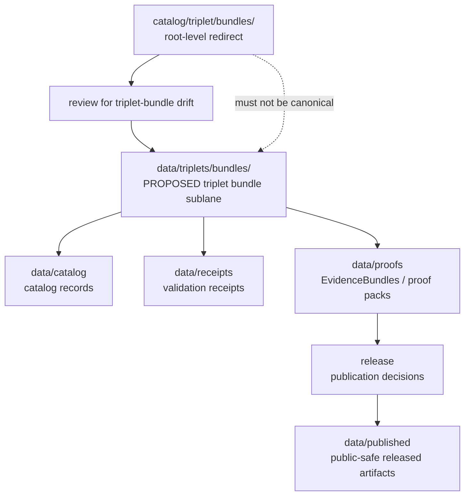

<!-- [KFM_META_BLOCK_V2]
doc_id: kfm://doc/catalog-triplet-bundles-readme
title: catalog/triplet/bundles/ — Triplet Bundle Compatibility Redirect
type: readme
version: v0.1
status: draft
owners: OWNER_TBD — Triplet steward · Catalog steward · Data steward · Evidence steward · Docs steward
created: 2026-06-16
updated: 2026-06-16
policy_label: public
related:
  - ../../README.md
  - ../../../data/README.md
  - ../../../data/triplets/README.md
  - ../../../data/catalog/README.md
  - ../../../data/receipts/README.md
  - ../../../data/proofs/README.md
  - ../../../data/published/README.md
  - ../../../data/registry/README.md
  - ../../../release/README.md
  - ../../../schemas/contracts/v1/
  - ../../../contracts/
  - ../../../policy/
  - ../../../docs/doctrine/directory-rules.md
tags: [kfm, catalog, triplet, triplets, bundles, compatibility-root, redirect, data-triplets, non-authoritative, drift-fence]
notes:
  - "Root-level catalog/triplet/bundles/ is treated as a compatibility/redirect fence, not canonical triplet-bundle authority."
  - "Canonical triplet material belongs under data/triplets/ unless a future ADR changes the triplet authority model."
  - "Do not add triplet bundles, graph assertions, EvidenceBundles, receipts, release records, catalog records, or published artifacts here without an ADR/migration note."
  - "Specific current contents, parent path status, producers, bundle schema maturity, migration status, and CI enforcement remain NEEDS VERIFICATION."
[/KFM_META_BLOCK_V2] -->

<a id="top"></a>

<div align="center">

# Triplet Bundle Compatibility Redirect

`catalog/triplet/bundles/`

**Compatibility / redirect fence for legacy or accidental root-level triplet-bundle placement. Canonical triplet material belongs under `data/triplets/`, not this root-level `catalog/triplet/bundles/` folder.**


[Purpose](#1-purpose) · [Canonical homes](#2-canonical-homes) · [Authority boundary](#3-authority-boundary) · [Allowed contents](#5-allowed-contents) · [Forbidden contents](#6-forbidden-contents) · [Migration](#9-migration-posture) · [Definition of done](#12-definition-of-done)

</div>

---

> [!IMPORTANT]
> **Status:** draft / `NEEDS VERIFICATION`  
> **Path:** `catalog/triplet/bundles/README.md`  
> **Responsibility root:** compatibility redirect / drift fence only  
> **Canonical triplet home:** `data/triplets/`  
> **Truth posture:** CONFIRMED README path / CONFIRMED root-level `catalog/` is a compatibility redirect / CONFIRMED `data/triplets/README.md` path exists as a stub / PROPOSED `catalog/triplet/bundles/` redirect contract / UNKNOWN current triplet bundle files, parent `catalog/triplet/` README status, bundle schema maturity, historical producers, migration status, CI enforcement, and ADR disposition

> [!CAUTION]
> Do not make `catalog/triplet/bundles/` a parallel triplet or graph authority. KFM triplet bundles, graph assertion sets, derived relationship bundles, and claim-support graph material must live under the governed triplet home, with catalog records, proofs, receipts, release decisions, and published artifacts in their own canonical roots.

---

## 1. Purpose

`catalog/triplet/bundles/` is a **root-level compatibility redirect** for triplet-bundle path drift.

It exists only to prevent accidental or legacy triplet bundle material from becoming a parallel authority outside the KFM lifecycle data root. This folder should not be used for canonical triplet bundles, graph assertions, derived relationship exports, claim-support graph material, catalog records, receipts, proofs, release records, or published artifacts.

This README does not prove that any triplet bundle material currently exists here, that a migration has been completed, that triplet bundle schemas are implemented, or that CI currently blocks writes to this path.

[Back to top](#top)

---

## 2. Canonical homes

Canonical triplet material belongs under:

```text
data/triplets/
```

A dedicated bundle sublane may be used when accepted and verified:

```text
data/triplets/bundles/   # PROPOSED canonical sublane; NEEDS VERIFICATION
```

Related support records belong in separate owning roots:

```text
data/catalog/      # catalog records and catalog-family indexes
data/receipts/     # receipts and validation records
data/proofs/       # EvidenceBundles and proof packs
release/           # release decisions, rollback, and correction records
data/published/    # released public-safe products
```

The root-level `catalog/triplet/bundles/` directory is a redirect/fence only.

## 3. Authority boundary

`catalog/triplet/bundles/` has **no canonical triplet-bundle authority**. It may hold only README guidance, migration notes, drift logs, or temporary redirect markers while triplet bundle material is moved into its proper lifecycle home.

```text
WRONG / LEGACY ROOT                    CANONICAL TRIPLET HOME              SUPPORTING AUTHORITY HOMES
catalog/triplet/bundles/          -->  data/triplets/bundles/        -->  data/catalog/
compatibility fence only                or data/triplets/                  data/receipts/
not authoritative                       triplet bundles / graph sets       data/proofs/
                                                                              release/
                                                                              data/published/
```

A triplet bundle outside `data/triplets/` should be treated as drift until reviewed and migrated.

## 4. Default posture

Anything found under root-level `catalog/triplet/bundles/` should be treated as **NEEDS VERIFICATION** and potentially misplaced.

Do not cite or depend on root-level triplet bundle files as canonical triplet or graph records. First confirm source, provenance, rights, sensitivity, evidence support, schema validity, lifecycle state, receipts, proofs, release state, rollback path, and correction path.

## 5. Allowed contents

| Allowed item | Example | Required posture |
|---|---|---|
| README / redirect docs | `README.md` | Compatibility fence only |
| Migration note | `MIGRATION.md` | Temporary and ADR/review-linked |
| Drift note | `DRIFT.md`, `OPEN-QUESTIONS.md` | Must point to canonical homes and review steps |
| Placeholder marker | `.gitkeep` | Does not authorize triplet bundle content |

## 6. Forbidden contents

| Forbidden here | Correct home |
|---|---|
| Triplet bundles, graph assertion sets, derived relationship exports | `data/triplets/` or an accepted sublane under it |
| Claim-support graph material | `data/triplets/` and `data/proofs/` as appropriate |
| Catalog records, catalog indexes, STAC/DCAT/PROV records | `data/catalog/` |
| Receipts and validation reports | `data/receipts/` |
| EvidenceBundles, proof packs, attestations | `data/proofs/` |
| ReleaseManifest, PromotionDecision, RollbackCard, CorrectionNotice, signatures | `release/` |
| Released public-safe artifacts | `data/published/` |
| Source descriptors, source registry rows, rights rows, sensitivity rows | `data/registry/` or governed registry homes |
| Schemas and machine-shape contracts | `schemas/contracts/v1/` |
| Human contracts and object-meaning docs | `contracts/` |
| Policy rules and policy decisions | `policy/` and governed policy-decision homes |
| Source code, scripts, packages, pipelines, build tools | `apps/`, `packages/`, `tools/`, `scripts/`, `pipelines/` |
| Raw, work, quarantine, processed, or published lifecycle data | `data/` lifecycle subtrees |

## 7. Directory shape

Current implementation inventory remains `NEEDS VERIFICATION`.

```text
catalog/triplet/bundles/
├── README.md                 # compatibility redirect / drift fence
├── MIGRATION.md              # PROPOSED only if migration is active
└── DRIFT.md                  # PROPOSED only if misplaced triplet bundle material is found
```

> [!WARNING]
> Do not treat this suggested shape as repo fact. Verify actual contents before making inventory or migration claims.

## 8. Diagram



## 9. Migration posture

If triplet bundle files are found here:

1. Do not depend on them as canonical records.
2. Identify whether they are triplet bundles, graph assertion sets, derived relationship exports, catalog records, receipts, proofs, source registry rows, release records, or published-output material.
3. Move triplet material into `data/triplets/` or an accepted `data/triplets/bundles/` sublane.
4. Move catalog, receipt, proof, release, and published-output material into their owning roots.
5. Check sensitivity, rights, provenance, evidence-resolution, and publication-readiness requirements before moving anything.
6. Preserve provenance, source refs, digests, receipts, review notes, rollback path, and correction path.
7. Add a drift register or migration note if the material has already been consumed.
8. Leave root-level `catalog/triplet/bundles/` as a redirect/fence unless an ADR explicitly says otherwise.

## 10. Validation expectations

Useful validation for this folder should cover:

- no triplet bundles, graph assertion sets, or derived relationship exports are stored here;
- no receipts, proofs, catalog records, release records, registry records, policy rules, schemas, source code, published artifacts, or lifecycle data are stored here;
- any non-README content is tied to an active migration or drift note;
- CI or review checks flag root-level `catalog/triplet/bundles/` writes;
- links point users to `data/triplets/`, `data/catalog/`, `data/receipts/`, `data/proofs/`, `release/`, and other canonical homes.

## 11. Safe change pattern

For changes under `catalog/triplet/bundles/`:

1. Confirm the change is redirect documentation, migration support, or drift documentation only.
2. Confirm it does not create a parallel triplet, graph, proof, release, or catalog authority.
3. Confirm durable triplet bundle records are placed under `data/triplets/`.
4. Confirm receipts/proofs/catalog/release records are placed under their owning roots.
5. Document migration and rollback if any misplaced material was moved.
6. Update docs and validation rules when behavior materially changes.

## 12. Definition of done

- [ ] Owners are confirmed and `OWNER_TBD` is replaced.
- [ ] Actual root-level `catalog/triplet/bundles/` contents are verified.
- [ ] Any misplaced triplet bundle material is migrated or documented as drift.
- [ ] `data/triplets/` is confirmed as the canonical triplet home in current docs.
- [ ] No trust-bearing records live here.
- [ ] No triplet bundles, graph assertion sets, receipts, proofs, catalog records, release records, published artifacts, schemas, contracts, policy rules, source code, or lifecycle data live here.
- [ ] CI/review behavior is verified or marked `NEEDS VERIFICATION`.

## 13. Open verification items

| Item | Why it matters |
|---|---|
| Confirm actual files under root-level `catalog/triplet/bundles/` | Prevents overclaiming or missing drift |
| Confirm parent `catalog/triplet/` disposition | Required before parent-level path claims |
| Confirm whether any workflow writes here | Required before producer claims |
| Confirm triplet bundle schema maturity | Required before implementation claims |
| Confirm migration status to `data/triplets/` | Required before canonical-home claims beyond doctrine |
| Confirm CI/review guard exists | Required before enforcement claims |
| Confirm no trust records are stored here | Required before Directory Rules compliance claims |
| Confirm ADR status for root-level `catalog/triplet/bundles/` | Required before long-term retention claims |

<details>
<summary>Appendix A — no-loss preservation note</summary>

The previous README was empty. This replacement adds a triplet-bundle redirect and anti-parallel-authority contract without claiming triplet bundle files, parent path maturity, migration work, CI enforcement, producer workflows, triplet schema maturity, or ADR disposition are implemented.

</details>

## Status summary

`catalog/triplet/bundles/` is a root-level compatibility redirect and triplet-bundle drift fence. It is not the canonical triplet, graph, proof, release, or catalog home.

Triplet authority belongs under `data/triplets/`; catalog records belong under `data/catalog/`; receipts belong under `data/receipts/`; proofs belong under `data/proofs/`; release decisions belong under `release/`; published artifacts belong under `data/published/`.

<p align="right"><a href="#top">Back to top</a></p>
