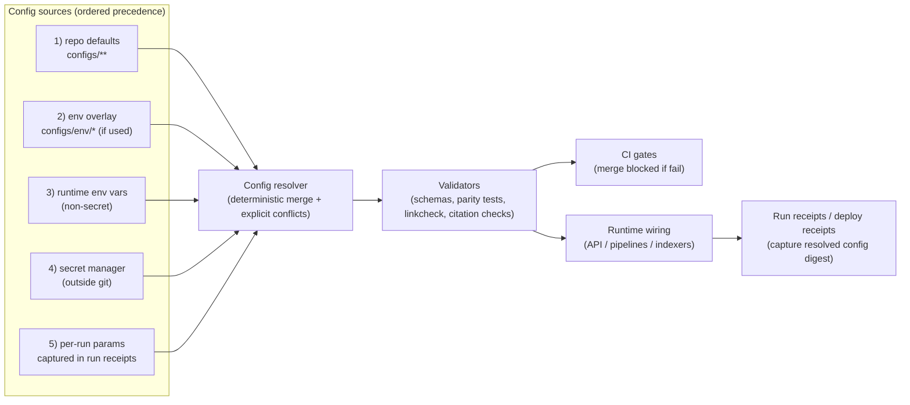

<!-- [KFM_META_BLOCK_V2]
doc_id: kfm://doc/9f8d0a2c-6d1e-4b22-a51d-0d7ac820e4e1
title: configs — Governed configuration registry
type: standard
version: v2
status: draft
owners: TBD (set via CODEOWNERS)
created: 2026-02-22
updated: 2026-03-01
policy_label: restricted
related:
  - ../README.md
  - ../.github/README.md
tags:
  - kfm
  - configs
  - governance
  - policy-as-code
  - contracts
  - promotion-contract
notes:
  - Policy-bearing configuration MUST be reviewed, tested, and promotion-gated.
  - This README is fail-closed: repo-specific wiring is UNKNOWN until validated in CI and confirmed via tree/paths.
  - Prefer machine-readable registries + schema validation over tribal knowledge.
  - Alignment: Promotion Contract v1 gate labels (A–F required, G optional-but-recommended) follow KFM governance snapshots (GDG vNext). Implementations may add extra QA checks, but must not weaken fail-closed behavior.
[/KFM_META_BLOCK_V2] -->

<a id="top"></a>

# configs/ — Governed configuration registry

**Purpose:** Governed, version-controlled configuration that drives **policy enforcement**, **contract validation**, **promotion gates**, and **runtime wiring** across Kansas Frontier Matrix (KFM) — without shipping secrets.

**Status:** draft • **Owners:** TBD via `CODEOWNERS` • **Policy label:** restricted  
**Core posture:** default-deny • fail-closed • deterministic resolution • audit-ready • reversible changes


> [!WARNING]
> `configs/` is **behavioral surface area**.
> If a config change can alter **allow/deny**, **obligations**, **rights**, **sensitivity**, **promotion gates**, **evidence resolution**, or **contract validation**, it is governance-critical and MUST be validated + reviewed as production configuration.

---

## Navigation

- [Directory contract](#directory-contract)
- [Where this fits in the repo](#where-this-fits-in-the-repo)
- [Truth status legend](#truth-status-legend)
- [Alignment anchors](#alignment-anchors)
- [Quick start](#quick-start)
- [Repo reality check](#repo-reality-check)
- [Scope](#scope)
- [KFM invariants this directory must support](#kfm-invariants-this-directory-must-support)
- [Recommended layout](#recommended-layout)
- [Config registry](#config-registry)
- [Conventions](#conventions)
- [Config precedence and resolution](#config-precedence-and-resolution)
- [Validation and CI gates](#validation-and-ci-gates)
- [Secrets and sensitive values](#secrets-and-sensitive-values)
- [Ownership and review routing](#ownership-and-review-routing)
- [Change management](#change-management)
- [Definition of Done](#definition-of-done)
- [Appendix](#appendix)
- [Source references](#source-references)

---

## Directory contract

| Contract item | Requirement |
|---|---|
| Purpose | Governed configuration that can change system behavior without changing core code |
| Acceptable inputs | Small, reviewable, machine-validated config files (YAML/JSON/TOML/etc.) that drive policy, contracts, promotion gates, pipeline wiring, UI wiring, observability, deployment config **templates** |
| Exclusions | **Secrets**, private keys, raw restricted coordinates, PII, large datasets, opaque binaries, ad-hoc scripts without tests |
| Review posture | **Fail closed** for governance-critical changes; steward/owner review required |
| Promotion posture | Config changes that affect publishability, access, identity, evidence resolution, or citation verification MUST be promotion-gated and auditable |
| Audit posture | Resolved config set SHOULD be captured (by digest) in run receipts and/or deployment receipts |

> [!NOTE]
> If the real repo structure differs from this README, update the **Config registry** first. Don’t “fix” drift by weakening gates.

---

## Where this fits in the repo

`configs/` is the **wiring layer**: it selects, constrains, and parameterizes behavior across the system.

**Keep boundaries clean (fail closed):**
- **`contracts/`**: definitions of schemas and API contracts (OpenAPI, JSON Schema, controlled vocabs).
- **`policy/`**: policy engine code + fixtures/tests (allow/deny + obligations).
- **`data/`**: dataset registry, dataset specs, truth-path artifacts (raw/work/processed/catalogs), and promotion receipts/manifests.
- **`configs/`**: non-secret, reviewable configuration that *selects* contract/policy versions, defines gate thresholds, and wires runtime defaults.

> [!IMPORTANT]
> If a rule changes **enforcement semantics**, it belongs in `policy/` (and must have fixtures).
> If a rule changes **shape/compatibility**, it belongs in `contracts/` (and must be versioned).
> If a file changes **wiring/thresholds/defaults**, it may belong in `configs/` — but MUST be validated and ownership-routed.

---

## Truth status legend

- **CONFIRMED (design):** required KFM posture (must hold regardless of stack)
- **UNKNOWN (repo):** not verified in this repository yet (treat as TODO)
- **PROPOSED:** recommended pattern/template (adopt only after verification)

This README intentionally includes **PROPOSED** structure to support bootstrapping, while keeping repo-specific facts **UNKNOWN** until verified.

---

## Alignment anchors

These anchors are the “don’t drift” constraints that `configs/` must support:

- **Promotion Contract v1 gate labels:** A–F required; G optional-but-recommended. (See: KFM governance snapshots / GDG vNext.)
- **Policy-as-code parity:** CI and runtime must share the same semantics (or at least the same fixtures+outcomes).
- **Evidence resolver contract:** EvidenceRefs must resolve without guessing; policy must be applied; result must be usable in a bounded call budget from UI (and must not leak restricted existence).

> [!NOTE]
> `configs/` is where “alignment drift” usually sneaks in: different envs, different validators, different policy semantics. Treat drift as a release blocker.

---

## Quick start

1. Identify which **contract surface** your change touches:
   - policy decisions / obligations
   - schemas / profiles / cross-link rules
   - promotion gates / thresholds
   - runtime wiring (flags, caching, indexing)
   - UI wiring (layer registries, view-state schema versions)
   - evidence resolution / citation verification knobs
2. Make the smallest change that is **testable** and **reversible**.
3. Add or update **fixtures/tests** that prove the new behavior.
4. Ensure validation passes locally and in CI.
5. If the change alters **allow/deny**, **obligations**, **rights enforcement**, **sensitivity behavior**, **evidence resolver behavior**, **citation verification**, or **promotion gates**, route for **steward review** and fail closed until approved.

> [!TIP]
> Treat every config change as a behavior change. If you can’t explain how decisions change, you likely can’t validate it.

---

## Repo reality check

This README describes a **target posture**. Before treating any statement here as CONFIRMED (repo), verify the repo actually contains:

- [ ] `CODEOWNERS` routes reviews for governance-critical config paths
- [ ] CI checks validate configs (schemas + policy parity + linkcheck + secret scanning)
- [ ] a deterministic config resolver that **fails on conflicts** (no silent precedence)
- [ ] runtime components apply the **same policy semantics** as CI (parity)
- [ ] story publish + Focus Mode workflows enforce **resolvable citations** (no “trust me” links)

Minimum verification steps (copy/paste):

```bash
# 0) Capture commit hash and root tree (so doc statements can cite repo reality)
git rev-parse HEAD
tree -L 3 || find . -maxdepth 3 -type d -print

# 1) Inspect actual layout
find configs -maxdepth 3 -type d -print

# 2) Find ownership rules
ls -la .github/CODEOWNERS 2>/dev/null || ls -la CODEOWNERS 2>/dev/null

# 3) Locate CI workflows that validate configs
ls -la .github/workflows 2>/dev/null || true

# 4) Search for config resolver / loader
rg -n "config resolver|loadConfig|resolveConfig|CONFIG_|feature_flag|policy_label" -S . || true

# 5) Find promotion-gate checks (verify gate labels + mapping to checks)
rg -n "Promotion Contract|gate_[a-g]|Gate [A-G]|spec_hash|policy parity|linkcheck|receipt|manifest|evidence resolve|citation" .github/workflows -S || true
```

> [!IMPORTANT]
> If validation, ownership routing, deterministic resolution, or citation-resolvability gates are missing, treat `configs/` as **unsafe** until those controls exist.

---

## Scope

### What lives here

`configs/` holds configuration that changes **system behavior** without changing core code. Treat these files as **governed artifacts**: reviewable, testable, and promotion-gated.

Common categories:

- **Policy-bearing inputs** (configuration *about* policy)
  - policy label definitions (meaning, display text, export posture)
  - obligation catalogs (generalize geometry, suppress export, watermark, require notice)
  - sensitivity/risk rubrics (machine + human readable)
  - policy parity fixtures (synthetic allow/deny expectations)

- **Contract wiring**
  - which schema/profile versions are active in an environment
  - validator knobs and cross-link/lint rules
  - controlled vocabulary selection and enforcement switches

- **Promotion Contract wiring**
  - gate definitions, required artifacts, failure modes
  - “what must be true to promote” per dataset class and per policy label

- **Runtime wiring** (non-secret defaults)
  - feature flags
  - caching rules (including auth/policy-aware cache keying)
  - indexing configuration (search/vector/graph projections)
  - rate limits / safety knobs for public endpoints (as references; enforcement is in runtime)
  - **ConfigMap templates** (non-secret): e.g., K8s configmaps or env templates that influence runtime wiring

- **Pipeline wiring** (non-secret)
  - schedules, dataset class defaults, allowed transforms
  - resource classes and safe defaults (timeouts, retries)
  - QA threshold defaults (where the pipeline/spec expects them)

- **UI wiring** (non-secret)
  - layer registry defaults, UI policy badge rules, view-state schema versions
  - citation scheme allowlists (display-only; enforcement is server-side)
  - *NOTE:* UI must never become the enforcement point; it renders what the governed API returns.

- **Observability wiring**
  - telemetry redaction rules (client + server)
  - log field allowlists/denylists (policy-safe)
  - metric naming conventions and SLO thresholds

### What does not live here

- **Secrets** (tokens, passwords, private keys, credentialed connection strings)
- **Raw restricted coordinates** or sensitive-location datasets
- **PII** or private individual details
- **Large datasets** or derived artifacts (those belong in truth path zones with run receipts)
- **Ad-hoc scripts** without tests (put tooling under `tools/`)

> [!WARNING]
> If it would be unsafe to paste into a public issue, it does not belong in `configs/`.

---

## KFM invariants this directory must support

Configuration exists to make KFM’s posture enforceable:

### Trust membrane (CONFIRMED design)
- Apps/clients MUST NOT access DB/object storage directly.
- Enforcement MUST happen behind governed APIs (policy + evidence + audit).
- Config MUST NOT enable bypass routes (including caching or error behaviors that leak restricted existence).

### Policy-as-code parity (CONFIRMED design)
- Policy semantics MUST match between CI and runtime (fixture outcomes match).
- If CI and runtime disagree, CI guarantees are meaningless → release blocker.

### Evidence resolution contract surface (CONFIRMED design)
- Evidence resolution MUST be deterministic and policy-aware.
- EvidenceRefs MUST resolve without guessing (catalog cross-links + resolvers must be strict).
- The resolver MUST return allow/deny + obligations, and only include artifact links if allowed.
- The resolver MUST be usable from UI in a bounded number of calls (avoid chatty UI→API loops).

### Promotion Contract v1 gates (A–F required; G optional-but-recommended) (CONFIRMED design)

Config must support deterministic, fail-closed promotion gates:

- **Gate A — Identity & versioning:** dataset_id + dataset_version_id; deterministic spec_hash inputs; content digests; drift detection
- **Gate B — Licensing & rights metadata:** license/rights completeness + upstream terms snapshot + export posture consistency
- **Gate C — Sensitivity classification & redaction plan:** policy_label + obligations; default-deny preserved; generalized derivative strategy where required
- **Gate D — Catalog triplet validation:** DCAT/STAC/PROV schema validation + required cross-links + EvidenceRefs resolve without guessing
- **Gate E — Run receipt and checksums:** run receipt exists, is schema-valid, contains checksums/digests, and references validation outputs; failures block promotion
- **Gate F — Policy tests and contract tests:** policy fixtures (allow/deny/obligations) pass; schema/profile contract tests pass; evidence resolver contract tests pass
- **Gate G — Production posture (optional but recommended):** promotion manifest/release record, supply-chain attestations (SBOM/provenance), plus smoke checks (perf/accessibility) as required by environment policy

> [!NOTE]
> Many implementations treat “QA & thresholds” as a distinct lane/check (often stored in WORK/Quarantine).
> Regardless of labeling: QA outcomes MUST be versioned, referenced by receipts/manifests, and fail-closed when thresholds are not met.

### Evidence-first + cite-or-abstain (CONFIRMED design)
- Any surfaced layer/story/answer MUST map back to resolvable evidence bundles and policy decisions.
- If citations cannot be verified, the system MUST abstain or reduce scope.

### Deterministic identity/hashing (CONFIRMED design)
- Inputs to identity/hashing MUST be stable and versioned.
- Identity hashing SHOULD use canonicalization to avoid nondeterministic drift (e.g., canonical JSON) and must be recomputed in CI for drift detection.
- Any change that affects identity inputs MUST have tests proving intended behavior.

---

## Recommended layout

> [!NOTE]
> This is a **PROPOSED** buildable layout. Align it to repo reality and keep the Config registry current.

```text
configs/
├─ README.md
│
├─ registry/                                     # Machine-readable registries + schemas + fixtures (small)
│  ├─ README.md                                  # Registry contract: what MUST be listed + how CI validates it
│  ├─ configs.v1.json                            # Canonical registry (entries for every governed config area/file)
│  ├─ schemas/                                   # Schemas for registries + config shapes (or pointers to contracts/)
│  │  ├─ kfm.config_registry.v1.schema.json
│  │  ├─ kfm.policy_labels.v1.schema.json
│  │  ├─ kfm.obligations_catalog.v1.schema.json
│  │  ├─ kfm.promotion_gates.v1.schema.json
│  │  ├─ kfm.linkcheck_rules.v1.schema.json
│  │  ├─ kfm.feature_flags.v1.schema.json
│  │  ├─ kfm.rate_limits.v1.schema.json
│  │  ├─ kfm.ui_layer_registry.v1.schema.json
│  │  ├─ kfm.view_state_schema.v1.schema.json
│  │  └─ kfm.redaction_rules.v1.schema.json
│  ├─ fixtures/                                  # Fixtures for CI validation (valid/invalid; deterministic)
│  │  ├─ valid/
│  │  ├─ invalid/
│  │  └─ README.md
│  └─ _generated/                                # OPTIONAL: generated indexes used by CI/tools (policy decides commit vs ignore)
│     ├─ configs.index.v1.json
│     └─ checksums.v1.json
│
├─ policy/                                       # Policy-bearing configuration (NOT secrets; NOT policy engine code)
│  ├─ README.md
│  ├─ labels/
│  ├─ obligations/
│  ├─ rubrics/
│  └─ fixtures/                                  # Policy parity fixtures (synthetic allow/deny/obligation expectations)
│
├─ contracts/                                    # Contract wiring (version selection + validator knobs)
│  ├─ README.md
│  ├─ profiles/
│  ├─ vocab/
│  └─ linkcheck/
│
├─ promotion/                                    # Promotion Contract wiring
│  ├─ README.md
│  ├─ gates/                                     # Gate definitions + required artifacts + failure codes
│  │  ├─ README.md
│  │  ├─ gates.v1.yaml                           # Canonical gate set (A–F) + required checks (+ optional G)
│  │  ├─ gate_a_identity.v1.yaml
│  │  ├─ gate_b_rights.v1.yaml
│  │  ├─ gate_c_sensitivity.v1.yaml
│  │  ├─ gate_d_catalogs.v1.yaml
│  │  ├─ gate_e_receipts_checksums.v1.yaml
│  │  ├─ gate_f_policy_contract_tests.v1.yaml
│  │  ├─ gate_g_production_posture.v1.yaml       # OPTIONAL: promotion manifest + attestations + smoke checks
│  │  └─ gate_codes.v1.yaml
│  ├─ templates/                                 # Manifest/receipt templates (if not stored elsewhere)
│  │  ├─ README.md
│  │  ├─ promotion_manifest.v1.json              # OPTIONAL: release record referencing artifacts+digests+approvals
│  │  ├─ run_receipt.v1.json                     # Template for Run Receipt (pipeline/index/story/focus)
│  │  ├─ run_manifest.v1.json                    # OPTIONAL: promotion-focused rollup (if adopted)
│  │  ├─ audit_entry.v1.json                     # Optional template for audit ledger entries
│  │  ├─ qa_report.v1.json                       # Optional template for QA summary objects referenced by receipts
│  │  └─ story_publish_receipt.v1.json           # Optional specialized receipt for story publishing
│  └─ classes/
│     ├─ README.md
│     ├─ classes.v1.yaml
│     ├─ vector.v1.yaml
│     ├─ raster.v1.yaml
│     ├─ documents.v1.yaml
│     ├─ timeseries.v1.yaml
│     └─ sensitive_location.v1.yaml
│
├─ runtime/
│  ├─ README.md
│  ├─ feature_flags/
│  ├─ caching/
│  ├─ indexing/
│  └─ rate_limits/
│
├─ pipelines/
│  ├─ README.md
│  ├─ schedules/
│  ├─ runners/
│  └─ dataset_defaults/
│
├─ ui/
│  ├─ README.md
│  ├─ layers/
│  ├─ view_state/
│  └─ policy_badges/
│
├─ observability/
│  ├─ README.md
│  ├─ logging/
│  ├─ metrics/
│  └─ redaction/
│
└─ env/
   ├─ README.md                                  # Examples only; secrets live elsewhere
   ├─ dev.example.env
   ├─ staging.example.env
   └─ prod.example.env
```

> [!IMPORTANT]
> If your repo already has top-level `policy/` and `contracts/` as sources of truth, avoid duplication:
> - keep policy *rules* and schema *definitions* where they live,
> - keep only **wiring + selection + registries + parity fixtures** under `configs/`.

---

## Config registry

The registry is how we prevent config sprawl and “unknown behavior.”

### Machine-readable registry (PROPOSED)

Store a canonical registry that CI can validate:

- `configs/registry/configs.v1.json`

Template:

```json
{
  "kfm_config_registry_version": "v1",
  "updated": "2026-03-01",
  "entries": [
    {
      "id": "policy.labels",
      "path": "configs/policy/labels/",
      "format": "yaml",
      "behavior_class": "governance-critical",
      "validators": ["configs-lint", "policy-parity"],
      "owners": ["@kfm-governance"],
      "notes": "Defines policy labels and semantics used by API + evidence resolver + UI badges."
    }
  ]
}
```

### Registry table (human)

Keep this table consistent with the machine registry if you adopt it.

| Area | Path (relative) | Format | Used by | CI validation | Change class |
|---|---|---|---|---|---|
| Policy labels | `policy/labels/` | YAML/JSON | API + evidence resolver + UI badges | **Required** | Governance-critical |
| Obligations | `policy/obligations/` | YAML/JSON | API + pipelines + exports | **Required** | Governance-critical |
| Policy fixtures | `policy/fixtures/` | JSON | CI + runtime parity | **Required** | Governance-critical |
| Profiles wiring | `contracts/profiles/` | YAML/JSON | catalog validators | **Required** | Contract-breaking (sometimes) |
| Linkcheck rules | `contracts/linkcheck/` | YAML/JSON | CI linkcheck + EvidenceRef resolver tests | **Required** | Contract-breaking (sometimes) |
| Gate definitions | `promotion/gates/` | YAML/JSON | promotion lanes | **Required** | Governance-critical |
| Receipts/manifests templates | `promotion/templates/` | JSON | promotion + audit tooling | **Required (schema)** | Governance-critical |
| Feature flags | `runtime/feature_flags/` | YAML/JSON | API + UI | **Required (lint)** | Runtime behavior |
| UI layers | `ui/layers/` | YAML/JSON | UI + API (display metadata) | **Required (lint)** | UX behavior |
| Env examples | `env/*.example.env` | dotenv | local dev | **Required (secret scan)** | Docs-only |

### Registry Definition of Done

- [ ] Every config area has an owner via `CODEOWNERS`.
- [ ] Every config area has at least one validator running in CI.
- [ ] Governance-critical entries have fixtures proving allow/deny/obligation outcomes.
- [ ] Any config that affects publishability maps to Promotion Contract v1 gates (A–F required; optional G as adopted).
- [ ] The registry is updated in the same PR that adds/moves/deprecates config.

---

## Conventions

### Formats

- Prefer YAML for human-authored config; JSON for fixtures and machine-to-machine artifacts.
- Keep files small and composable.
- Avoid YAML anchors/aliases unless the repo explicitly standardizes them.
- Every config SHOULD have a stable schema or lint rules.

> [!TIP]
> If a config has no validator, it is code without tests.

### Identifiers and versioning

- Contract-bearing config SHOULD be versioned (e.g., `v1`, `2026-02`, semver).
- Policy labels are controlled vocabulary; changing meaning is breaking behavior.
- Any identifier that flows into dataset identity/spec hashing MUST be stable and tested.

### Canonicalization and hashing

- When hashing config inputs (for spec_hash or drift detection), canonicalize first (stable key ordering, consistent whitespace).
- Prefer a standardized canonical JSON scheme when applicable (e.g., JCS-style canonicalization) and recompute in CI.

### Secret references

If a config must reference a secret, store only a **secret identifier**, never the secret value:

- `secret_ref: KFM_API_KEY`
- `secret_ref: kfm/<env>/<service>/token`

---

## Config precedence and resolution

Config resolution MUST be deterministic and reproducible for audits.

### Recommended precedence (PROPOSED)

1. Repository defaults in `configs/**`
2. Environment overlay (dev/stage/prod) **if used** (examples unless explicitly promoted)
3. Runtime environment variables (non-secret)
4. Secret manager injection (outside git)
5. Per-run parameters (pipeline/story/focus) captured in run receipts

If two sources conflict, resolution MUST be explicit and documented. If required config is missing, **fail closed**.

### Resolution and enforcement flow



> [!WARNING]
> A resolver that “picks one silently” breaks auditability. Conflicts MUST surface as errors unless explicitly overridden with tests and documentation.

---

## Validation and CI gates

This directory is only safe if it is continuously validated.

### Required validations (minimum)

- **Schema/lint:** configs validate against schemas or strict lint rules
- **Policy parity:** fixtures prove expected allow/deny/obligations (CI + runtime parity)
- **Linkcheck:** cross-link rules ensure EvidenceRef and catalog links are resolvable deterministically
- **Citation resolvability:** story citations and Focus Mode citations must resolve via the evidence resolver contract (no guessing)
- **QA thresholds (where applicable):** QA report format is validated and thresholds are versioned; failures quarantine/promotion-block
- **Secret scanning:** blocks committed credentials
- **Anti-skip summary:** a final always-runs job fails if any required config gate did not run

> [!IMPORTANT]
> Required checks MUST NOT be skippable via `paths:` filters or `if:` conditions.
> Prefer a single “gate-summary” status check as the merge requirement (see `.github/README.md` if present).

### Promotion Contract v1 mapping (A–F required; G optional-but-recommended)

| Gate | What configs influence | What CI should verify (examples) |
|---|---|---|
| A Identity/versioning | spec-hash inputs, version naming rules | hash drift tests; naming lint |
| B Rights/licensing | license rules, attribution requirements | rights rubrics validated; export rules consistent |
| C Sensitivity | policy labels, default obligations | deny-by-default preserved; generalization plan tested; policy-safe errors enforced |
| D Catalog triplet | profile selection, link rules, EvidenceRef schemes | profiles validate; linkcheck passes; EvidenceRefs resolve without guessing |
| E Run receipt + checksums | receipt required fields; digest rules; QA/report linkage | receipt schema validation; required digests present; checks interpreted fail-closed |
| F Policy + contract tests | parity fixtures; contract/profile tests; evidence resolver contract tests | policy fixtures pass; schema/profile tests pass; resolver tests pass |
| G Production posture (optional) | promotion manifest schema; attestations/supply-chain; smoke checks | manifest schema valid; attestation verification (if enabled); perf/a11y smoke checks |

### Suggested local commands (PROPOSED)

Replace these placeholders with real repo commands once wiring exists:

```bash
make lint-configs
make validate-config-schemas
make test-policy-parity
make linkcheck-catalogs
make test-citation-resolve
make scan-secrets
```

---

## Secrets and sensitive values

**Never commit secrets.** Use environment injection and secret managers.

Also prohibited in `configs/`:
- raw restricted geometry / sensitive site coordinates
- PII or reidentifiable personal attributes

If sensitivity handling is unclear, default to deny and route for governance review.

---

## Ownership and review routing

`CODEOWNERS` SHOULD require review for governance-critical config changes. Example (placeholders):

```text
# Governance-critical policy inputs
configs/policy/**        @kfm-governance

# Promotion gates + manifests
configs/promotion/**     @kfm-governance @kfm-platform

# Contract wiring
configs/contracts/**     @kfm-standards @kfm-platform

# Runtime knobs
configs/runtime/**       @kfm-platform

# UI wiring
configs/ui/**            @kfm-frontend @kfm-governance

# Observability
configs/observability/** @kfm-platform
```

> [!NOTE]
> Replace the placeholder teams with real owners. Ownership is only real once CODEOWNERS is enforced via branch protection/rulesets.

---

## Change management

### Change classes

Use PR labels or title prefixes for `configs/` changes:

| Class | Meaning | Extra requirements |
|---|---|---|
| Docs-only | README/examples; no behavior change | lint + secret scan |
| Runtime behavior | flags/caches/index knobs | smoke checks for affected components |
| Contract-breaking | profile/schema selection rules | version bump + migration notes |
| Governance-critical | allow/deny, obligations, sensitivity defaults, gate thresholds, citation resolver rules | steward review + parity fixtures |

### Rollback expectations

Every governance-critical config change MUST include a rollback plan:
- revert commit/PR
- restore prior config version
- confirm parity tests and linkcheck pass on rollback

### Deprecation and migrations

- Deprecations MUST be explicit (document in-file and/or ADR/changelog).
- Keep old versions readable long enough for reproducibility/audits.
- Remove deprecated configs only when receipts prove successful migration.

---

## Definition of Done

Use this checklist in PRs touching `configs/`.

- [ ] Change is scoped and reversible (rollback described)
- [ ] Config registry updated (table + machine registry if adopted)
- [ ] Validators updated/added (schemas/lint/parity/linkcheck/citation/QA as applicable)
- [ ] Governance-critical changes include fixtures proving new behavior
- [ ] CI validations pass (and anti-skip summary passes)
- [ ] No secrets committed (scan passes)
- [ ] Required owners reviewed (CODEOWNERS)
- [ ] Any contract-breaking change includes migration notes

---

## Appendix

<details>
<summary><strong>PROPOSED: Minimal policy label file shape</strong></summary>

Example: `configs/policy/labels/labels.v1.yaml`

```yaml
version: v1
labels:
  public:
    description: "Publicly viewable and exportable under license terms."
    export: allowed
  public_generalized:
    description: "Public viewable; geometry generalized by obligation."
    export: allowed
    obligations: ["generalize_geometry", "show_generalization_notice"]
  restricted:
    description: "Access restricted by role; deny by default."
    export: denied
  restricted_sensitive_location:
    description: "Sensitive location; deny public access; generalized derivative required for public surfaces."
    export: denied
```

</details>

<details>
<summary><strong>PROPOSED: Obligation catalog shape</strong></summary>

Example: `configs/policy/obligations/obligations.v1.yaml`

```yaml
version: v1
obligations:
  generalize_geometry:
    kind: transform
    parameters:
      method: "grid_snap"
      cell_meters: 1000
  suppress_export:
    kind: enforcement
    parameters:
      export: false
  show_generalization_notice:
    kind: ui_notice
    parameters:
      message: "Geometry generalized due to policy."
```

</details>

<details>
<summary><strong>PROPOSED: Promotion manifest shape (v1)</strong></summary>

A promotion manifest (sometimes called “release manifest”) is an immutable record of what was promoted
(artifact paths + digests + catalogs + QA + policy decision + approvals). Keep it policy-safe and digest-addressed.

</details>

---

## Source references

This README is aligned to KFM governance snapshots and delivery briefings (internal). When discrepancies arise,
prefer the governance snapshots for **gate labels and invariants**, and treat briefings as implementation guidance.

<p align="right"><a href="#top">Back to top ↑</a></p>
