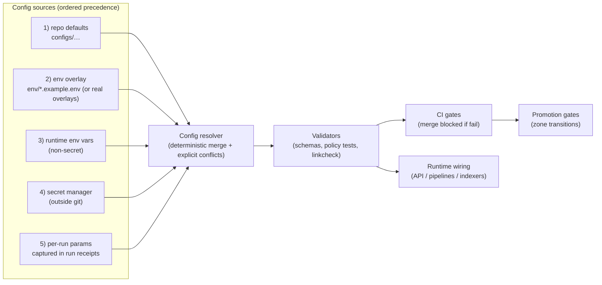

<!-- [KFM_META_BLOCK_V2]
doc_id: kfm://doc/9f8d0a2c-6d1e-4b22-a51d-0d7ac820e4e1
title: configs — Governed configuration registry
type: standard
version: v1
status: draft
owners: TBD (set via CODEOWNERS)
created: 2026-02-22
updated: 2026-02-23
policy_label: restricted
related:
  - configs/README.md
tags:
  - kfm
  - configs
notes:
  - Policy-bearing configuration MUST be reviewed, tested, and promotion-gated.
  - Confirm `policy_label` during governance review.
[/KFM_META_BLOCK_V2] -->

# configs — Governed configuration registry

Governed, version-controlled configuration that drives **policy enforcement**, **contract validation**, **promotion gates**, and **runtime wiring** across Kansas Frontier Matrix (KFM).

**Status:** draft  
**Owners:** TBD (set via `CODEOWNERS`)  
**Principles:** map-first • time-aware • governed • evidence-first • cite-or-abstain


---

## Navigation

- [Quick start](#quick-start)
- [Where this fits in the repo](#where-this-fits-in-the-repo)
- [Repo reality check](#repo-reality-check)
- [Scope](#scope)
  - [What lives here](#what-lives-here)
  - [What does not live here](#what-does-not-live-here)
- [KFM invariants this directory must support](#kfm-invariants-this-directory-must-support)
- [Recommended layout](#recommended-layout)
  - [Config registry](#config-registry)
- [Conventions](#conventions)
  - [Formats](#formats)
  - [Identifiers and versioning](#identifiers-and-versioning)
  - [Secret references](#secret-references)
- [Config precedence and resolution](#config-precedence-and-resolution)
- [Validation and CI gates](#validation-and-ci-gates)
  - [Required checks matrix](#required-checks-matrix)
  - [Suggested local commands](#suggested-local-commands)
- [Secrets and sensitive values](#secrets-and-sensitive-values)
- [Ownership and review routing](#ownership-and-review-routing)
- [Change management](#change-management)
  - [Change classes](#change-classes)
  - [Versioning guidance](#versioning-guidance)
  - [Deprecation and migrations](#deprecation-and-migrations)
- [Definition of Done](#definition-of-done)
- [Appendix](#appendix)

---

## Quick start

1. Identify which **contract surface** your change touches:
   - policy decision or obligation
   - schema/contract
   - promotion gate
   - environment/runtime wiring
2. Make the smallest change that is **testable** and **reversible**.
3. Add or update **fixtures/tests** that prove the new behavior.
4. Ensure validation passes locally and in CI.
5. If the change alters **allow/deny**, **obligations**, **rights enforcement**, or **sensitivity behavior**, route for **steward review** (fail closed until approved).

> **TIP**
> Treat every config change as a behavior change. If you can’t describe how the system’s decisions change, you probably can’t test it.

---

## Where this fits in the repo

This directory sits on the policy boundary between **code** and **operations**:

- **Code** implements enforcement (policy engines, validators, resolvers, gates).
- **Configs** decide *what gets enforced* (labels, obligations, thresholds, profiles, flags).

### Directory contract

| Contract item | Requirement |
|---|---|
| Purpose | Governed configuration that can change system behavior without changing core code |
| Acceptable inputs | Small, reviewable, machine-validated files (YAML/JSON/TOML/etc.) that drive policy, contracts, gates, and safe runtime wiring |
| Exclusions | Secrets, private keys, raw restricted coordinates, PII, large datasets, ad-hoc scripts without tests |
| Review posture | **Fail closed** for policy-bearing changes; steward review required for governance-critical changes |
| Promotion posture | Config changes that affect publishability or access MUST be promotion-gated and auditable |

> **NOTE**
> If the real repo structure differs from this README, treat the README as *out of date* and update the **Config registry** table first.

### Repo reality check

This README intentionally describes a *target posture*. Before treating any statement here as **Confirmed**, verify the repo actually contains the artifacts that make it true:

- [ ] A `CODEOWNERS` file that routes reviews for `configs/policy/**`, `configs/promotion/**`, and `configs/contracts/**`
- [ ] CI checks that run (at least): schema validation, policy parity tests, linkcheck, and secret scanning
- [ ] A deterministic config resolver that **fails on conflicts** (no silent precedence)
- [ ] Runtime components that apply the same policy semantics as CI (parity)

Minimum verification steps (copy/paste):

```bash
# 1) Inspect actual layout
find configs -maxdepth 3 -type d -print

# 2) Find ownership rules (GitHub/GitLab)
ls -la .github/CODEOWNERS 2>/dev/null || ls -la CODEOWNERS 2>/dev/null

# 3) Locate CI workflows/pipelines that validate configs
ls -la .github/workflows 2>/dev/null || true

# 4) Run local validations (replace with real commands once wired)
make validate-schemas && make test-policy && make linkcheck-catalogs && make scan-secrets
```

---

## Scope

### What lives here

This directory is for configuration that changes **system behavior** without changing core code. Treat these files as **governed artifacts**: reviewable, testable, and promotion-gated.

Typical contents include:

- **Policy-as-code artifacts**
  - policy labels
  - obligations (redaction/generalization requirements)
  - allow/deny fixtures and test cases
- **Contract artifacts**
  - schema profiles for catalogs and provenance
  - API request/response schemas
  - lint rules for cross-links and resolvability
- **Promotion Contract wiring**
  - gate definitions and thresholds
  - promotion manifest templates
  - policy/rights/sensitivity checks configuration
- **Runtime wiring**
  - feature flags
  - indexing options
  - cache controls
  - environment overlays (dev/stage/prod) as *examples only*

> **NOTE**
> This README is a registry and a contract. Keep it accurate. If the repo’s real structure differs, **update the “Config registry” table** and the layout section.

### What does not live here

- **Secrets** (tokens, passwords, private keys, connection strings with credentials)
- **Restricted coordinates** or raw sensitive-location data
- **PII** or private individual details
- **Large datasets** or derived artifacts (those belong in data lifecycle zones, governed by run receipts and promotion)
- **Ad-hoc scripts** without tests (put tooling under `tools/` or equivalent)

> **WARNING**
> If it would be unsafe to paste into a public issue, it does not belong in `configs/`.

---

## KFM invariants this directory must support

Configuration in this directory exists to make KFM’s posture enforceable. At minimum:

### Trust membrane

- Frontend and external clients **MUST NOT** access databases/object storage directly.
- Backend core logic **MUST NOT** bypass repository interfaces to reach storage.
- Access **MUST** flow through governed APIs that apply policy, redaction, and logging consistently.

### Policy-as-code parity

- Policy semantics **MUST** match between CI and runtime (or fixtures/outcomes must match).
- If CI and runtime disagree, CI guarantees are meaningless—treat as a **release blocker**.

### Promotion Contract gates

- Dataset outputs **MUST** move through governed zones; promotion **MUST** be blocked unless required gates pass.
- Gates **MUST** be deterministic and **fail closed**.

### Catalog triplet as contract surface

- Catalogs/provenance are not “nice metadata”; they are the canonical interface between pipeline outputs and runtime.
- Profiles and cross-link rules **MUST** be strict and validated.

### Evidence-first and cite-or-abstain

- Any surfaced layer/story/answer **MUST** map back to resolvable evidence bundles and policy decisions.
- If citations cannot be verified, the system **MUST** abstain or reduce scope.

### Rights and sensitivity enforcement

- Rights metadata and attribution **MUST** be enforced in exports and publishing.
- Sensitive-location handling defaults to **deny** or to publish-safe generalized derivatives when allowed.

### Deterministic identity and hashing

- Dataset version identity **MUST** be stable, based on canonical specifications; prevent “hash drift.”
- Any change that affects identity inputs **MUST** have tests proving intended behavior.

---

## Recommended layout

This is a **buildable target** layout for `configs/`. Adjust to match the repo, but keep the separation between policy, contracts, promotion gates, and runtime wiring.

```text
configs/
  README.md

  policy/                       # policy-as-code inputs (governed)
    labels/                     # policy labels + meanings
    obligations/                # obligation definitions (generalize geometry, suppress export, etc.)
    fixtures/                   # allow/deny + obligations test cases
    tests/                      # policy unit tests (engine-specific)
    rubrics/                    # licensing + sensitivity rubrics (human-readable + machine-usable)

  contracts/                    # machine-validated contract artifacts
    schemas/                    # JSON Schema (or equivalent) for DCAT/STAC/PROV + API DTOs
    profiles/                   # profile constraints (required fields, controlled vocab, etc.)
    linkcheck/                  # cross-link rules for DCAT/STAC/PROV + EvidenceRefs

  promotion/                    # promotion contract wiring
    gates/                      # gate definitions, thresholds, required artifacts
    templates/                  # promotion manifests, run receipt templates (if stored here)
    ci/                         # CI config for promotion gating (optional)

  runtime/                      # runtime wiring (non-secret)
    feature_flags/
    indexing/
    caching/

  env/                          # example overlays (no secrets)
    dev.example.env
    staging.example.env
    prod.example.env
```

### Config registry

Update this table whenever you add, move, or deprecate config files.

| Area | Path (relative) | Format | Used by | CI validation | Default owner | Change class |
|---|---|---|---|---|---|---|
| Policy labels | `policy/labels/` | YAML / JSON | API + evidence resolver | **Required** | Steward | Governance-critical |
| Obligations | `policy/obligations/` | YAML / JSON | API + pipelines | **Required** | Steward | Governance-critical |
| Policy fixtures | `policy/fixtures/` | JSON | CI + runtime parity tests | **Required** | Steward + Eng | Governance-critical |
| Schemas | `contracts/schemas/` | JSON Schema | CI + runtime validators | **Required** | API/Standards | Contract-breaking (sometimes) |
| Profiles | `contracts/profiles/` | MD + machine file | Catalog validators | **Required** | Standards | Contract-breaking (sometimes) |
| Linkcheck rules | `contracts/linkcheck/` | Config | CI link-checker | **Required** | Platform | Contract-breaking (sometimes) |
| Gate definitions | `promotion/gates/` | YAML / JSON | Promotion step | **Required** | Steward + Eng | Governance-critical |
| Feature flags | `runtime/feature_flags/` | YAML / JSON | API + UI | **Required (lint)** | Platform | Runtime behavior |
| Env examples | `env/*.example.env` | dotenv | Local dev | **Required (secret scan)** | Platform | Docs-only |

> **NOTE**
> Ownership is enforced via `CODEOWNERS`. The “Default owner” column is guidance; the repo is the source of truth once CODEOWNERS is configured.

---

## Conventions

### Formats

- Prefer **YAML** for human-authored config; prefer **JSON** for fixtures and machine-to-machine artifacts.
- Keep files **small and composable**. If a file needs scrolling, it probably needs splitting.
- Avoid YAML features that can create ambiguity in reviews (anchors/aliases) unless the repo explicitly standardizes them.
- Every config SHOULD have a stable **schema** (even if that schema is “lightweight” via lint rules).

> **TIP**
> If a config has no validator, it is *code without tests*.

### Identifiers and versioning

- Files that define a **contract surface** SHOULD include an explicit version (e.g., `v1`, `2026-02`, or semver), and be stored as immutable once published.
- Policy labels SHOULD be treated as **controlled vocabulary**. Changing meaning is breaking behavior.
- Any identifier that flows into **dataset identity hashing** MUST be stable and tested.

### Secret references

If you must reference a secret from a config file, store only an identifier such as:

- `secret_ref: MY_SERVICE_TOKEN`
- `secret_ref: kfm/namespace/service/token`

Never store the secret value.

---

## Config precedence and resolution

Config resolution MUST be deterministic and reproducible for audits.

### Recommended precedence

1. Repository defaults in `configs/…`
2. Environment overlay (dev/stage/prod) **if present** (examples only unless explicitly promoted)
3. Runtime environment variables (non-secret)
4. Secret manager injection (outside git)
5. Per-run parameters (pipeline/focus) captured in **run receipts**

If two sources conflict, resolution MUST be explicit and documented. If required config is missing, **fail closed**.

### Resolution and enforcement flow



> **WARNING**
> A config merge that “picks one silently” is not deterministic governance. Conflicts MUST surface as errors unless explicitly overridden in a documented, test-covered way.

---

## Validation and CI gates

This directory is only safe if it is continuously validated. At minimum CI should enforce:

### Policy checks

- Policy fixtures execute under the same semantics as runtime.
- Default-deny behavior is preserved unless explicitly changed.
- Obligations are testable: any obligation change MUST include a fixture proving it.

### Contract checks

- Schema validation for:
  - catalog records
  - provenance bundles
  - API request/response DTOs
- Controlled vocabulary validation where applicable
- Cross-link checking:
  - DCAT ↔ STAC ↔ PROV links resolve deterministically
  - EvidenceRef schemes resolve without guessing

### Promotion gating checks

- Promotion manifests reference required artifacts and digests
- Rights and sensitivity metadata required by gates are present
- Gate failures block merge and block promotion

### Required checks matrix

| Check | Why it exists | Gate |
|---|---|---|
| Schema validation | Prevent contract drift and publish invalid artifacts | Required |
| Policy parity tests | Ensure CI and runtime semantics match | Required |
| Linkcheck (cross-refs) | Ensure evidence links resolve deterministically | Required |
| Secret scanning | Prevent credential leakage | Required |
| Formatting/lint | Reduce review ambiguity and enforce conventions | Required |

### Suggested local commands

> Replace these placeholders with real repo commands when available.

```bash
# Schema validation
make validate-schemas

# Policy tests
make test-policy

# Link checking
make linkcheck-catalogs

# Secret scanning (should already run in CI)
make scan-secrets

# Optional: formatting/lint (YAML/JSON)
make lint-configs
```

---

## Secrets and sensitive values

**Never commit secrets.** Use:

- environment variables injected at runtime
- secret managers
- platform-native secrets (Kubernetes/OpenShift secrets, etc.)

If a config file needs a reference to a secret, store only a **secret key name** (identifier), not the secret value.

Also: do not store exact coordinates or restricted site details in config. Use policy labels + obligations to enforce generalization and access control.

> **NOTE**
> If sensitivity handling is unclear, default to deny and mark the change *needs governance review*.

---

## Ownership and review routing

`CODEOWNERS` SHOULD enforce required reviews for policy-bearing configuration. Example:

```text
# Policy-as-code
configs/policy/**     @kfm-stewards

# Promotion gates
configs/promotion/**  @kfm-stewards @kfm-platform

# Contract artifacts
configs/contracts/**  @kfm-standards @kfm-platform
```

> **NOTE**
> The teams above are placeholders. Replace with real GitHub teams / groups.

---

## Change management

### Review rules

Some changes are governance-critical and require steward review:

- changes to allow/deny logic
- changes to obligations
- changes to sensitivity defaults or generalization behavior
- changes to licensing/risk rubrics
- changes to promotion gate criteria
- changes to schema profiles that affect what is publishable

**Recommended repo controls:**
- `CODEOWNERS` required reviews for:
  - `configs/policy/**`
  - `configs/promotion/**`
  - `configs/contracts/**`
- required status checks for all validators listed above
- merge queue / protected branch for mainline

### Change classes

Use these labels in PR titles (or PR labels) when changing `configs/`:

| Class | Meaning | Extra requirements |
|---|---|---|
| Docs-only | Comments/README/examples; no behavior change | Lint + secret scan |
| Runtime behavior | Feature flags, caches, indexing knobs | Tests or smoke checks for affected components |
| Contract-breaking | Schemas/profiles/link rules | Version bump + migration notes |
| Governance-critical | Allow/deny, obligations, gate thresholds, sensitivity defaults | Steward review + fixtures proving behavior |

### Versioning guidance

- Schemas and profiles MUST be versioned.
- Breaking changes require explicit version bumps and a migration strategy.
- Keep old versions readable long enough to support reproducibility and audit.

### Deprecation and migrations

- Deprecations MUST be explicit (documented in-file and/or in a changelog/ADR).
- Provide a migration window where both old and new versions validate (when feasible).
- Remove deprecated configs only after:
  - no active published artifacts depend on them, and
  - receipts prove successful migration.

---

## Definition of Done

Use this checklist in PRs that touch `configs/`.

- [ ] Change is scoped and reversible (rollback path described)
- [ ] Config registry table updated (paths/owners/validation)
- [ ] Fixtures/tests updated or added to prove new behavior
- [ ] CI validations pass (schemas, policy tests, linkcheck, secret scan, lint)
- [ ] No secrets committed (confirmed by scan)
- [ ] If change affects governance outcomes, steward review completed
- [ ] Any behavior change is documented in the relevant standard, ADR, or changelog

---

## Appendix

<details>
<summary>Optional metadata block for governed config docs</summary>

If you store additional governed documentation inside `configs/` (rubrics, standards, etc.), prefer a structured metadata block rather than YAML frontmatter.

```text
[KFM_META_BLOCK_V2]
doc_id: kfm://doc/<uuid>
title: <Title>
type: <guide|standard|dataset_spec|adr|run_receipt>
version: v1
status: draft|review|published
owners: <team or names>
created: YYYY-MM-DD
updated: YYYY-MM-DD
policy_label: public|restricted|...
related:
  - kfm://dataset/<slug>@<version>
tags:
  - kfm
  - configs
notes:
  - <short notes>
[/KFM_META_BLOCK_V2]
```

</details>

---

[Back to top](#configs--governed-configuration-registry)
