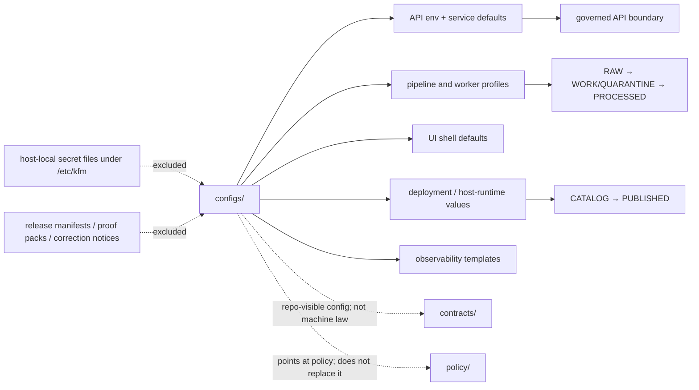

<!-- [KFM_META_BLOCK_V2]
doc_id: kfm://doc/TODO-VERIFY-UUID
title: configs/
type: standard
version: v1
status: review
owners: TODO(verify platform/config owners)
created: TODO(verify YYYY-MM-DD)
updated: TODO(verify YYYY-MM-DD)
policy_label: TODO(verify directory classification)
related: [TODO(verify related paths: ../README.md, ../contracts/, ../policy/, ../infra/, ../scripts/, ../migrations/, ../tests/)]
tags: [kfm, configs, runtime, pipelines, ui, deployment]
notes: [Grounded primarily in the March 2026 KFM configuration/runtime corpus; continuity docs document a configs/ repo family, but exact mounted repo tree, sibling paths, owners, and live configs/ contents still require direct repo verification before merge.]
[/KFM_META_BLOCK_V2] -->

<a id="top"></a>

# configs/

Repo-visible configuration templates and non-secret value surfaces for KFM runtime, pipelines, UI, observability, and deployment.

**Status:** experimental  
**Owners:** TODO(verify platform / config owners)  
**Path:** `configs/README.md`


**Quick jump:** [Scope](#scope) · [Repo fit](#repo-fit) · [Accepted inputs](#accepted-inputs) · [Exclusions](#exclusions) · [Directory tree](#directory-tree-working-shape-not-mounted-fact) · [Quickstart](#quickstart) · [Usage rules](#usage-rules) · [Diagram](#diagram) · [Reference tables](#reference-tables) · [Task list](#task-list--definition-of-done) · [FAQ](#faq) · [Appendix](#appendix)

> [!IMPORTANT]
> This README is **source-grounded but repo-constrained**. The current session exposed the March 2026 KFM PDF corpus and related continuity materials, not a mounted repository checkout. Treat exact sibling paths, subdirectory names, owners, and validation commands below as **merge-ready after direct repo verification**, not as already-confirmed filesystem fact.

## Scope

In the current KFM doctrine, **configuration** is a governed control surface over authority, visibility, movement, trust, and runtime behavior. That is broader than “app settings.” It includes bind and exposure rules, runtime profiles, store-role separation, standards/profile pins, observability joins, release-facing toggles, and the controls that decide whether the system fails closed or continues safely.

This `configs/` README covers the **repo-visible subset** of that broader configuration domain:

- non-secret templates
- reviewed defaults
- operator-facing examples
- deployment and runtime value surfaces
- config-backed behavior that remains subordinate to contracts, policy, review, and release state

`configs/` should therefore help KFM behave predictably **without** becoming a shadow source of truth.

It must not quietly replace:

- authoritative contracts
- executable policy bundles
- canonical metadata or release artifacts
- secret-bearing host files
- machine-local state
- review, correction, or promotion evidence

### Truth posture for this README

| Label | How it applies here |
| --- | --- |
| **CONFIRMED** | Recent KFM configuration doctrine defines configuration as a governed control layer over authority, visibility, movement, trust, and runtime behavior. The same March 2026 layer also preserves the canonical path, trust membrane, authoritative-versus-derived split, and fail-closed behavior as configuration-relevant invariants. |
| **INFERRED** | Candidate sibling links and the internal `configs/` working tree below are aligned to the corpus and continuity materials, but not reverified against a mounted repo checkout in this session. |
| **PROPOSED** | Host-side environment-file patterns, loopback-focused service examples, systemd-oriented override snippets, and notebook-style config examples such as observability, sensor, or correction defaults. |
| **UNKNOWN** | Exact owners, exact mounted `configs/` contents, exact repo validation commands, and the live repository’s literal directory structure. |
| **NEEDS VERIFICATION** | Any literal path, filename, env key usage, sibling relationship, or CI command that depends on unmounted repo state rather than directly visible source material. |

## Repo fit

| Field | Value |
| --- | --- |
| Path | `configs/README.md` |
| Directory role | Repo-visible home for non-secret configuration templates, reviewed defaults, and operator-facing value surfaces |
| Doctrinal baseline | `KFM_Configuration_Reference_Refined_2026-03-19.pdf` plus adjacent March 2026 configuration, contract, policy, testing, security, runtime, and package references |
| Continuity repo signal | Earlier continuity documentation explicitly describes `configs/` as the lane for configuration templates such as env, pipelines, UI, and ConfigMap-style values |
| Main consumers | governed API bring-up, workers and pipelines, UI shells, host/runtime services, deployment surfaces, observability joins |
| Review posture | Treat behavior-significant config edits as architecture-significant when they alter exposure, publication, trust-visible UX, release linkage, runtime negative states, or correction behavior |

### Upstream / downstream links

| Relationship | Paths | Status |
| --- | --- | --- |
| Candidate upstream doctrine and control surfaces | [`../README.md`](../README.md) · [`../contracts/`](../contracts/) · [`../policy/`](../policy/) · [`../infra/`](../infra/) · [`../scripts/`](../scripts/) · [`../tools/`](../tools/) | continuity-documented, **NEEDS VERIFICATION** against the mounted repo |
| Candidate downstream consumers | [`../apps/api/`](../apps/api/) · [`../apps/ui/`](../apps/ui/) · [`../packages/ingest/`](../packages/ingest/) · [`../packages/catalog/`](../packages/catalog/) · [`../tests/`](../tests/) | continuity-documented and doctrine-consistent, but **NEEDS VERIFICATION** against the mounted repo |
| Host-side companion surfaces | `/etc/kfm/*.env` · systemd unit/drop-ins · loopback/runtime bind settings | supported by runtime guidance; **not** evidence that these paths are versioned repo content |

## Accepted inputs

| Category | Typical contents | Why it belongs here |
| --- | --- | --- |
| Environment and service templates | `.env.example`-style files, non-secret service defaults, bind and path examples | These shape runtime without becoming secrets or machine law |
| Pipeline and worker profiles | ingest/build/publish/projection profiles, thresholds, cadence settings, feature-safe toggles | Pipelines should depend on explicit, reviewed config rather than tribal defaults |
| UI and surface defaults | feature flags, rendering defaults, evidence-visible shell behavior, non-secret presentation toggles | KFM surfaces need configurable behavior without hard-coding every product choice |
| Deployment and host-runtime values | ConfigMap-style values, loopback/host runtime parameters, service defaults, rollout-facing settings | These parameterize deployment posture without redefining project law |
| Observability templates | collector/exporter defaults, log field maps, join-key templates, trace-to-receipt glue | Observability is part of KFM trust when it preserves release, audit, and runtime joins |
| Source- or correction-adjacent defaults | non-secret JSON/YAML parameter files for approved workflows when the repo deliberately centralizes them here | Some KFM note-backed patterns place per-source or correction defaults under `configs/` |

### What belongs here in practice

- example environment files
- reviewed non-secret defaults
- pipeline/profile YAML, JSON, or TOML
- deployment value files
- loopback-safe service examples
- collector/logger configuration that carries no secrets
- stable parameter files intentionally treated as reviewed config

## Exclusions

| Do **not** keep here | Put it instead | Why |
| --- | --- | --- |
| Secrets, tokens, private keys, real credentials | secret manager, host-local protected files such as `/etc/kfm/*.env`, or other non-repo secret surfaces | Versioned `configs/` must stay non-secret |
| JSON Schemas, OpenAPI contracts, standards profiles treated as machine law | [`../contracts/`](../contracts/) | Contracts need first-class review and test surfaces |
| Executable Rego/Conftest bundles, reason registries, obligation registries | [`../policy/`](../policy/) | Policy should not hide inside ordinary runtime templates |
| Release manifests, proof packs, correction notices, attestation bundles | release/proof location *(verify exact path)* | Trust-bearing publication evidence is not ordinary config |
| Database migrations | [`../migrations/`](../migrations/) | Schema evolution needs migration review and replay discipline |
| Generated local churn, caches, temp files, runtime state | ignored local state, cache, or runtime directories | Reviewable config should remain stable and intentional |
| Direct canonical data, RAW/WORK/PROCESSED content, or derived outputs | canonical stores, stage roots, or derived-store locations | Config may point at these layers, but it does not replace them |

> [!WARNING]
> The broader KFM configuration doctrine is **wider** than this directory. Some configuration-bearing material belongs in `contracts/`, `policy/`, release artifacts, or host-local runtime surfaces. Do not collapse those boundaries just because the settings “feel like config.”

## Directory tree (working shape, not mounted fact)

```text
configs/
├── README.md
├── env/                # .env examples and non-secret service defaults
├── pipelines/          # ingest / build / publish / projection profiles
├── ui/                 # shell and feature defaults without secrets
├── deployment/         # ConfigMap-style or host/runtime values
├── observability/      # collector / logger defaults, if standardized here
└── feature_flags/      # optional rollout or canary controls, if the repo adopts them here
```

This is a **working shape**, not a claim that the mounted repo already contains these exact subdirectories.

What the source corpus establishes strongly is the role split:

- `configs/` for repo-visible, non-secret, reviewable configuration surfaces
- `contracts/` for machine-readable law
- `policy/` for executable governance
- release/proof locations for trust-bearing publication artifacts
- host-local secret surfaces for credentials and other restricted values

## Quickstart

1. Inspect the real directory before editing.
2. Identify the consumer of the setting you want to change.
3. Confirm the change belongs in repo-visible config rather than contracts, policy, secrets, or release artifacts.
4. Re-run the repo’s actual validation path before merge.

```bash
# Inspect the visible config surface.
find configs -maxdepth 3 -type f | sort

# Search for KFM-specific config keys and nearby consumers.
grep -R "KFM_" configs || true
git grep -nE "KFM_(ARTIFACT_ROOT|POLICY_DIR|DB_DSN|MODEL_ADAPTER_URL|PUBLISHED_ONLY|CITATIONS_REQUIRED|BIND)" .
```

Illustrative runtime template shape:

```dotenv
# Example only — these keys are documented in the March 2026 runtime/config guides,
# but exact repo filenames and live usage still need repo verification.

KFM_ARTIFACT_ROOT=/srv/kfm
KFM_POLICY_DIR=/etc/kfm/policy
KFM_DB_DSN=unix:///var/run/postgresql/.s.PGSQL.5432
KFM_MODEL_ADAPTER_URL=http://127.0.0.1:11434
KFM_PUBLISHED_ONLY=true
KFM_CITATIONS_REQUIRED=true
KFM_BIND=127.0.0.1:8080
```

Illustrative host-side Ollama override surface:

```ini
# Example only — host-local, not repo-secret content.
# Verify actual unit names and deployment posture before use.

[Service]
Environment="OLLAMA_HOST=127.0.0.1:11434"
Environment="OLLAMA_MODELS=/var/lib/ollama/models"
```

> [!NOTE]
> Host-local secret-bearing environment files belong **outside** versioned `configs/`. Recent KFM host guidance proposes root-owned files such as `/etc/kfm/kfm-api.env`, `/etc/kfm/kfm-worker.env`, and `/etc/kfm/kfm-publish.env`, plus an Ollama override file or systemd drop-ins for real deployment values.

## Usage rules

### 1) Keep `configs/` non-secret and reviewable

Commit:

- examples
- defaults
- reviewed value surfaces
- non-secret parameter files
- config that benefits from diffable review

Do **not** commit:

- real credentials
- one-machine overrides pretending to be team defaults
- release proof objects
- policy logic hidden as “just another flag”

### 2) Treat `configs/` as subordinate to law

If a file defines schema law, policy evaluation semantics, promotion rules, correction semantics, or canonical response envelopes, it probably belongs outside `configs/` in a contract or policy surface.

### 3) Configuration changes can change trust

A config edit can change:

- who can connect
- what gets published
- whether evidence remains visible
- whether a runtime fails closed
- whether a surface is stale-visible, denied, or generalized
- whether derived stores stay separate from authority

Review config with the same seriousness as code when it affects those boundaries.

### 4) Preserve runtime boundaries in defaults

Early KFM runtime guidance repeatedly prefers:

- loopback-only binds for the governed API and model runtime
- no direct client path to canonical stores
- dedicated service accounts
- explicit path separation between canonical and derived layers
- fail-closed behavior when policy, evidence, or release context is missing

`configs/` is a legitimate place for **templates** that express those defaults. It is not the place to weaken them casually.

### 5) Keep one canonical home per concern

Avoid repeating the same rule across:

- `configs/`
- `contracts/`
- `policy/`
- deployment overlays
- application code
- runbooks

One concern should have one canonical owner. References are cheaper than drift.

### 6) Snapshot or reference config when outputs depend on it

If a release artifact, derived surface, or published answer depends materially on configuration, the relevant configuration should be referenceable from the surrounding manifests, receipts, or provenance records.

> [!CAUTION]
> A convenient config pattern that weakens the canonical path, the trust membrane, the authoritative-versus-derived split, or fail-closed behavior is not convenience. It is configuration debt.

## Diagram


```mermaid
flowchart LR
  A[configs/] --> B[API env + service defaults]
  A --> C[pipeline and worker profiles]
  A --> D[UI shell defaults]
  A --> E[deployment / host-runtime values]
  A --> F[observability templates]

  B --> G[governed API boundary]
  C --> H[RAW → WORK/QUARANTINE → PROCESSED]
  E --> I[CATALOG → PUBLISHED]

  A -. repo-visible config; not machine law .-> J[contracts/]
  A -. points at policy; does not replace it .-> K[policy/]
  L[host-local secret files under /etc/kfm] -. excluded .-> A
  M[release manifests / proof packs / correction notices] -. excluded .-> A
```

## Reference tables

### Config lanes at a glance

| Lane | Typical contents | Primary consumers | Status |
| --- | --- | --- | --- |
| `env/` | `.env.example`, bind and path defaults, service env templates | API, workers, local runtime | document-grounded |
| `pipelines/` | cadence, thresholds, job profiles, per-run defaults | ingest/build/publish/projection workers | document-grounded |
| `ui/` | surface defaults, feature flags, trust-visible presentation settings | web shell and app surfaces | document-grounded |
| `deployment/` | ConfigMap-style values, host/runtime parameters, rollout-facing settings | deploy/reconcile surfaces | document-grounded |
| `observability/` | `otel.yaml`, log field maps, trace/join-key defaults | services, collectors, dashboards | **PROPOSED** note-backed lane |
| `feature_flags/` | canary/ramp controls, rollout percentages, safe toggles | pipeline controllers, UIs, staged release flows | **PROPOSED** note-backed lane |

### Placement rules at a glance

| Concern | Preferred home | Rule |
| --- | --- | --- |
| Non-secret runtime defaults | `configs/` | Keep them reviewable and diffable |
| Contracts and outward schema law | `contracts/` | Machine-readable, testable, versioned |
| Executable policy bundles and registries | `policy/` | Separately reviewable, deny-by-default capable |
| Secret-bearing deployment values | host-local secret surfaces | Never commit them into repo-visible config |
| Release evidence and correction artifacts | release/proof locations | Trust-bearing artifacts are not ordinary config |
| Generated local or transient state | local runtime/cache locations | Do not turn machine-local churn into repo state |

### Observability join keys worth preserving

| Key | Why keep it joinable |
| --- | --- |
| `release_id` | Explains which released scope a runtime or pipeline action depended on |
| `dataset_version_id` | Reconnects runtime behavior to a concrete dataset version |
| `decision_id` / `review_id` | Preserves governance and steward-review traceability |
| `bundle_id` / `projection_id` | Keeps EvidenceBundle and derived-surface lineage inspectable |
| `request_id` / `trace_ref` | Makes request-to-runtime investigation reconstructable |
| `audit_ref` | Bridges logs, receipts, and policy/runtime evidence |

### Review questions

| Question | Why it matters |
| --- | --- |
| Is this file a reviewed value surface, or is it secretly contract/policy law? | Prevents role drift |
| Is the file non-secret? | Prevents credential leakage |
| Does the change alter exposure, publication, or trust-visible UX? | Marks config as architecture-significant |
| Does the setting preserve the authoritative-versus-derived split? | Prevents convenience layers from becoming truth |
| Is there already another canonical home for this concern? | Prevents duplication and drift |
| Can a receipt, manifest, or correction path point back to this config when needed? | Preserves replayability and accountability |

## Task list / definition of done

- [ ] No secrets, tokens, or private credentials are committed
- [ ] Every new config file documents its primary consumer
- [ ] Behavior-significant config edits are reviewed like code changes
- [ ] Contract or policy implications are reflected in `contracts/` or `policy/`, not hidden here
- [ ] Host-local secret-bearing files stay outside repo-visible `configs/`
- [ ] Loopback/default exposure posture is preserved unless an intentional trust review says otherwise
- [ ] Any config that materially shapes outputs can be tied back to manifests, receipts, or release evidence
- [ ] Candidate sibling links and directory names are verified against the real repo before merge
- [ ] The README stays aligned with the repo’s actual validation and deployment path

## FAQ

### Why does this README draw such a hard line between `configs/`, `contracts/`, and `policy/`?

Because KFM’s trust model depends on visible separation between value surfaces, machine law, and executable governance. Folding them together makes review, rollback, and correction harder.

### Is all KFM configuration supposed to live under `configs/`?

No. The broader KFM configuration doctrine is wider than this one directory. This README only covers the repo-visible, non-secret subset.

### Can `configs/` change public behavior?

Yes. Exposure, release scope, stale-state handling, and runtime failure behavior can all be altered by config. That is why config edits deserve architectural review.

### Can secrets live here if they are only for local development?

No. Use example files in the repo; keep real secret-bearing values in protected host-local or secret-manager surfaces.

### Are the paths and subdirectories in this README fully confirmed?

No. The directory role is source-grounded, but the current session did not expose a mounted repo tree. Path-level claims remain **NEEDS VERIFICATION** until direct repo inspection.

### Why include `observability/` or `feature_flags/` if they are not confirmed as mounted directories?

Because the current corpus is strong enough to show those lanes as plausible, reviewed configuration homes in KFM-style workflows. They stay labeled **PROPOSED** until the repo proves them.

## Appendix

<details>
<summary><strong>Documented config examples from the current corpus</strong></summary>

| Example | What it shows | Status |
| --- | --- | --- |
| `/etc/kfm/kfm-api.env`, `/etc/kfm/kfm-worker.env`, `/etc/kfm/kfm-publish.env`, `/etc/kfm/ollama.override.env` | Host-local environment-file pattern for a systemd-first KFM runtime | **PROPOSED** host-guide pattern |
| `KFM_ARTIFACT_ROOT`, `KFM_POLICY_DIR`, `KFM_DB_DSN`, `KFM_MODEL_ADAPTER_URL`, `KFM_PUBLISHED_ONLY`, `KFM_CITATIONS_REQUIRED`, `KFM_BIND` | Illustrative runtime env keys named in the Ubuntu/runtime guidance | **PROPOSED** key set |
| `configs/observability/otel.yaml`, `configs/observability/logfmt.json` | Note-backed observability config lane for trace/log joins | **PROPOSED** note-backed example |
| `configs/sensors/ks-example-001.json` | Note-backed per-source config file example | **PROPOSED** note-backed example |
| `configs/correction/defaults/epa_pm25_v1.3.0.json` | Note-backed correction/default parameter file example | **PROPOSED** note-backed example |
| `configs/feature_flags/pipelineX.yml` | Note-backed canary/ramp control surface for staged rollout | **PROPOSED** note-backed example |

These examples are useful because they show what KFM config surfaces are *for* without pretending the mounted repo already contains them.

</details>

<details>
<summary><strong>Why this README separates the broader configuration doctrine from the <code>configs/</code> directory</strong></summary>

Recent KFM configuration doctrine defines configuration broadly: it includes runtime profiles, bind rules, store-role separation, standards pins, policy and evidence-path settings, observability joins, CI/CD gates, and thin-slice proof settings.

A directory README has to do a narrower job. It should answer:

- what belongs in `configs/`
- what does **not** belong in `configs/`
- which examples are strong enough to preserve
- where verification must happen before merge

This README resolves that tension with one simple rule:

- **broader configuration doctrine** explains how KFM control surfaces work
- **`configs/`** stores the repo-visible, non-secret, reviewable subset
- **host-local secrets**, **contracts**, **policy**, and **proof artifacts** stay elsewhere

That keeps the directory useful without pretending it is the whole configuration system.

</details>

[Back to top](#top)
