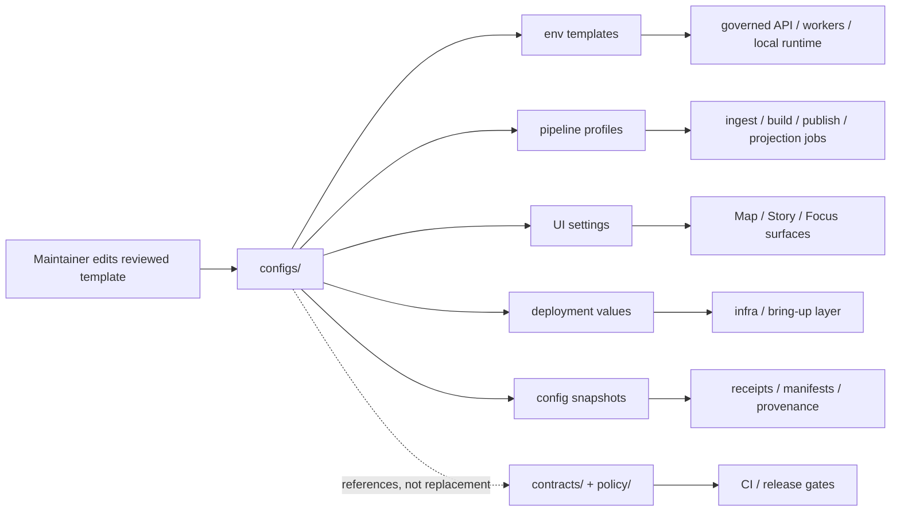

<!-- [KFM_META_BLOCK_V2]
doc_id: kfm://doc/TODO-VERIFY-UUID
title: configs/
type: standard
version: v1
status: draft
owners: TODO(verify config/platform owners)
created: YYYY-MM-DD
updated: YYYY-MM-DD
policy_label: TODO(verify directory classification)
related: [TODO(verify ../README.md), TODO(verify ../contracts/), TODO(verify ../policy/), TODO(verify ../infra/), TODO(verify ../scripts/)]
tags: [kfm, configs, runtime, pipelines, ui, deployment]
notes: [Current session exposed PDF corpus only; exact repo tree, sibling paths, and directory contents need verification before merge.]
[/KFM_META_BLOCK_V2] -->

<a id="top"></a>

# configs/

Configuration templates and non-secret value surfaces for KFM runtime, pipeline, UI, and deployment behavior.

**Status:** experimental  
**Owners:** TODO(verify platform / config owners)


**Quick jump:** [Scope](#scope) · [Repo fit](#repo-fit) · [Accepted inputs](#accepted-inputs) · [Exclusions](#exclusions) · [Directory tree](#directory-tree-doc-grounded-working-shape) · [Quickstart](#quickstart) · [Usage rules](#usage-rules) · [Diagram](#diagram) · [Task list](#task-list--definition-of-done) · [FAQ](#faq) · [Appendix](#appendix-known-placement-tensions)

> [!IMPORTANT]
> This README is source-grounded, but the current session did **not** expose a mounted KFM repo tree. The path relationships, tree, and examples below are designed to be commit-ready **after** repo verification, not treated as already confirmed filesystem fact.

## Scope

`configs/` is the reviewed home for configuration **templates**, value surfaces, and runtime-facing defaults that shape KFM behavior without becoming a shadow source of truth.

In KFM terms, this directory exists to support the governed path, not bypass it. Configuration may influence runtime, pipelines, UI behavior, deployment posture, and reproducibility, but it must not quietly replace:

- authoritative contracts
- executable policy bundles
- dataset/source registry entries
- release evidence
- secrets or machine-local state

That distinction matters because KFM’s trust model depends on keeping **templates and values** separate from **law and proof**.

## Repo fit

| Field | Value |
| --- | --- |
| Path | `configs/README.md` |
| Directory role | Configuration templates for env, pipelines, UI, deployment values, and other non-secret runtime-facing inputs |
| Upstream | [`../README.md`](../README.md) · [`../contracts/`](../contracts/) · [`../policy/`](../policy/) · [`../infra/`](../infra/) · [`../scripts/`](../scripts/) *(doc-grounded, NEEDS VERIFICATION)* |
| Downstream | [`../apps/api/`](../apps/api/) · [`../apps/ui/`](../apps/ui/) · [`../packages/ingest/`](../packages/ingest/) · [`../tests/`](../tests/) *(doc-grounded, NEEDS VERIFICATION)* |
| Trust rule | `configs/` may shape behavior, but it must not become an unreviewed backdoor around the trust membrane, promotion gates, or evidence rules |

## Accepted inputs

| Category | Typical contents | Why it belongs here |
| --- | --- | --- |
| Environment templates | bind hosts, ports, DSN/socket hints, artifact-root paths, published-only flags, citations-required flags | These are runtime-facing defaults and operator-reviewed inputs |
| Pipeline profiles | ingest, build, publish, projection, timeout, threshold, and cadence settings | Pipelines need explicit, reviewable configuration instead of tribal defaults |
| UI configuration | non-secret surface defaults, feature toggles, rendering defaults, trust-visible presentation settings | KFM surfaces must stay configurable without hard-coding every behavior |
| Deployment value templates | ConfigMap-like values, environment overlays, non-secret deployment knobs | These belong near config because they parameterize runtime, not system law |
| Config snapshots | version-pinned config captures referenced by receipts, manifests, or provenance | Reproducibility depends on capturing which config shaped an output |

## Exclusions

| Do **not** keep here | Put it instead | Why |
| --- | --- | --- |
| JSON Schemas, OpenAPI contracts, canonical envelopes | [`../contracts/`](../contracts/) | Contracts must remain first-class, machine-readable, and independently reviewable |
| Authoritative OPA/Rego policy bundles, reason codes, obligation registries | [`../policy/`](../policy/) or repo-standardized policy location | Policy should not hide inside ordinary runtime templates |
| Dataset/source registry entries | [`../data/registry/`](../data/registry/) | Source onboarding is a contract, not ad hoc config |
| Release manifests, proof packs, receipts, correction notices | release/proof location *(verify exact path)* | Publication evidence is not ordinary configuration |
| Database migrations | [`../migrations/`](../migrations/) | Schema evolution should remain migration-reviewed |
| Secrets, tokens, machine-local overrides, workstation-only files | untracked local secret surface / secret manager | Never commit secrets into reviewed config |

> [!WARNING]
> If the repo currently contains paths like `configs/contracts/policy/opa/`, treat them as **NEEDS VERIFICATION** until maintainers confirm whether they are intentional long-term placement or transitional layout.

## Directory tree (doc-grounded working shape)

```text
configs/
├── README.md
├── env/                # environment and bind/path templates
├── pipelines/          # ingest/build/publish/projection profiles
├── ui/                 # non-secret map/story/focus configuration
├── deployment/         # ConfigMap/value-style deployment inputs
├── local/              # local-runtime overrides and workstation examples
└── snapshots/          # version-pinned config captures referenced by receipts/manifests
```

This is a **doc-grounded working shape**, not a claim that the mounted repo already contains these exact subdirectories. The important invariant is the separation of concerns:

- `configs/` for templates and value surfaces
- `contracts/` for schemas and wire contracts
- `policy/` for executable policy
- release/proof locations for publication evidence

## Quickstart

1. Inspect the directory before editing.
2. Find the consumer of the setting you plan to change.
3. Validate that the change does not silently move law, policy, or evidence rules into template-only config.
4. Re-run the repo’s normal validation path before merge.

```bash
# Review the current config surface.
find configs -maxdepth 3 -type f | sort

# Search for runtime-impacting keys or KFM-specific settings.
grep -R "KFM_" configs || true

# Documented policy-gate pattern from KFM design notes.
# VERIFY actual placement before using it as repo truth.
conftest test run_receipt.json --policy ./configs/contracts/policy/opa
```

Illustrative runtime-template shape:

```dotenv
# Example only — keys are source-grounded, filenames/placement need verification.
KFM_BIND_HOST=127.0.0.1
KFM_BIND_PORT=8080
KFM_ARTIFACT_ROOT=/srv/kfm
KFM_PUBLISHED_ONLY=true
KFM_REQUIRE_STRUCTURED_OUTPUT=true
KFM_REQUIRE_CITATIONS=true
```

## Usage rules

### 1) Keep this directory template-first

Commit:

- examples
- defaults
- reviewed value surfaces
- reproducibility-linked snapshots

Do **not** commit:

- secrets
- operator-only ad hoc files
- one-machine overrides
- unpublished proof objects pretending to be config

### 2) Keep contracts and policy explicit

If a file defines:

- schema shape
- response envelope law
- reason/obligation registry
- promotion gate logic
- policy evaluation semantics

it should usually live outside `configs/` in a first-class contract or policy location.

### 3) Treat config changes as behavioral changes

A config change can affect:

- what the API exposes
- what a pipeline publishes
- how UI trust cues appear
- whether a runtime remains loopback-only
- whether citations are required

That means config changes deserve the same review seriousness as code when they change public behavior, admissibility, or release posture.

### 4) Snapshot config when outputs depend on it

If a pipeline result, release artifact, or runtime answer depends materially on configuration, the relevant config snapshot should be referenceable from receipts, manifests, or provenance records.

### 5) Prefer one canonical home per concern

Do not duplicate the same rule across:

- `configs/`
- `contracts/`
- `policy/`
- deployment overlays
- app code

One concern should have one canonical owner, with references outward instead of drift.

## Diagram


```mermaid
flowchart LR
  A[Maintainer edits reviewed template] --> B[configs/]
  B --> C[env templates]
  B --> D[pipeline profiles]
  B --> E[UI settings]
  B --> F[deployment values]
  B --> G[config snapshots]

  C --> H[governed API / workers / local runtime]
  D --> I[ingest / build / publish / projection jobs]
  E --> J[Map / Story / Focus surfaces]
  F --> K[infra / bring-up layer]
  G --> L[receipts / manifests / provenance]

  B -. references, not replacement .-> M[contracts/ + policy/]
  M --> N[CI / release gates]
```

## Tables

### Consumer map

| Config lane | Primary consumers | Typical examples | Non-secret? |
| --- | --- | --- | --- |
| `env/` | API, workers, local runtime | bind rules, socket/DSN hints, artifact roots, published-only flags | Yes |
| `pipelines/` | ingest/build/publish/projection jobs | profile selection, thresholds, timeouts, cadence | Yes |
| `ui/` | frontend surfaces | feature defaults, rendering/profile toggles, calm-failure presentation defaults | Yes |
| `deployment/` | infra / ConfigMap-like injection | runtime value templates, deployment-scoped inputs | Yes |
| `snapshots/` | receipts/manifests/provenance | version-pinned config captures | Yes |

### Placement rules at a glance

| Concern | Preferred home | Rule |
| --- | --- | --- |
| Runtime and template values | `configs/` | Keep them reviewable and non-secret |
| Wire contracts and schema law | `contracts/` | Machine-readable, diffable, testable |
| Executable policy and registries | `policy/` | Versioned, explicit, independently gated |
| Source onboarding facts | `data/registry/` | Intake is a contract, not loose config |
| Publication evidence | release/proof location | Evidence should not masquerade as config |

## Task list / definition of done

- [ ] No secrets or machine-local-only values are committed
- [ ] Every new config file names its primary consumer in comments or adjacent docs
- [ ] Config that materially changes outputs is snapshot-able and referenceable from receipts/manifests
- [ ] Contract or policy implications are reflected in `contracts/` or `policy/`, not hidden here
- [ ] Validation or Conftest patterns are updated when config changes alter gates
- [ ] UI-facing config changes preserve trust cues, accessibility, and calm failure
- [ ] Sibling paths and file examples are verified against the mounted repo tree before merge

## FAQ

### Why is `configs/` not the home for every rule?

Because KFM needs a visible separation between **value surfaces** and **governed law**. Config shapes behavior; contracts and policy define what is allowed.

### Can `configs/` change public behavior?

Yes. That is exactly why changes here must be reviewed, tested, and documented like real architectural changes.

### Can secrets live here?

No. Keep secrets out of versioned config and out of repo-readable templates.

### What if the repo already has policy under `configs/`?

Keep the current layout only if maintainers explicitly standardize it. Otherwise treat it as transitional and plan a move to a first-class `policy/` home.

### Should generated config snapshots be checked in?

Only when the repo intentionally versions them as reproducibility artifacts. Do not check in noisy or machine-local churn.

## Appendix: known placement tensions

<details>
<summary>Why this README draws a harder line between <code>configs/</code>, <code>contracts/</code>, and <code>policy/</code></summary>

The source set is directionally consistent but not perfectly uniform:

1. One repo-shape source describes `configs/` as the home for configuration templates covering env, pipelines, UI, and ConfigMaps.
2. The contract/artifact deepening pass separates `contracts/` and `policy/` as first-class top-level families.
3. A design note shows a concrete Conftest path under `configs/contracts/policy/opa/`.
4. Runtime realization notes also show dedicated config surfaces such as `kfm.env` and an Ollama override.

This README normalizes those signals as follows:

- keep **templates and value surfaces** in `configs/`
- keep **authoritative contracts** in `contracts/`
- keep **authoritative policy bundles and registries** in `policy/`
- allow documented exceptions only when maintainers intentionally standardize them

That keeps the directory readable, reviewable, and aligned with KFM’s fail-closed posture instead of letting policy and contract law drift into template sprawl.
</details>

[Back to top](#top)