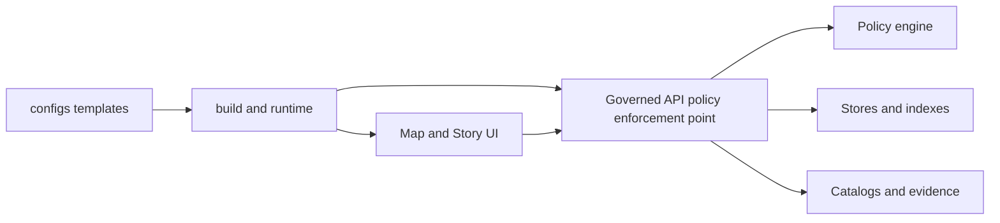

<!-- [KFM_META_BLOCK_V2]
doc_id: kfm://doc/7d0ae54f-92cf-4df0-ba76-42fbc811c788
title: configs/ — Configuration templates
type: standard
version: v1
status: draft
owners: TBD
created: 2026-03-03
updated: 2026-03-03
policy_label: restricted
related:
  - ../docs/
  - ../contracts/
  - ../policy/
tags: [kfm, configs]
notes:
  - Directory README for configuration templates (.env templates, pipeline/UI configs, non-secret deploy configs).
  - Evidence discipline: claims are tagged Confirmed / Proposed / Unknown.
[/KFM_META_BLOCK_V2] -->

<div align="center">

# ⚙️ `configs/`
Configuration templates for KFM (environment, pipelines, UI, and non-secret deployment config)

**Status:** Draft • **Owners:** TBD


</div>

## Navigation
- [Overview](#overview)
- [Where this fits](#where-this-fits)
- [What belongs here](#what-belongs-here)
- [What must not go here](#what-must-not-go-here)
- [Directory layout](#directory-layout)
- [How configs flow](#how-configs-flow)
- [Conventions](#conventions)
- [Validation and CI hooks](#validation-and-ci-hooks)
- [Examples](#examples)
- [Unknowns and verification steps](#unknowns-and-verification-steps)

---

## Overview

**Evidence tags used in this README**

- **[Confirmed]** Supported by KFM design/briefing documents.
- **[Proposed]** A recommended convention (safe default) but not guaranteed to match current repo state.
- **[Unknown]** Not verified here; includes minimal steps to confirm.

**What `configs/` is**

- **[Confirmed]** A home for configuration templates: environment, pipelines, and UI configs, including `.env` templates, pipeline configs, and Kubernetes ConfigMaps.  
- **[Confirmed]** The repo uses JSON/YAML configs for behavior (example: `configs/ui/story/rendering.json` for UI story rendering/behavior).

> [!NOTE]
> **[Confirmed] Trust membrane rule:** configs must not enable “direct-to-store” access from clients/UI. Client access is expected to go through the governed API (policy enforcement point).  
> If a config would bypass policy evaluation, it’s invalid by definition.

[Back to top](#navigation)

---

## Where this fits

- **[Confirmed]** `configs/` is a top-level directory alongside `contracts/`, `policy/`, `data/`, `apps/`, `packages/`, `infra/`, etc.
- **[Proposed]** `configs/` should remain **templates + defaults**; environment-specific *instances* should live in deployment tooling (e.g., CI secrets, K8s Secrets, Vault) or as local, uncommitted overrides.

[Back to top](#navigation)

---

## What belongs here

Use `configs/` for **repo-tracked**, reviewable configuration that is safe to publish and safe to validate.

### Accepted inputs
- **[Confirmed]** `.env` template files (examples / defaults).
- **[Confirmed]** Pipeline configuration files (run specs, lane configs, or similar).
- **[Confirmed]** Kubernetes ConfigMap-style configs (non-secret values).
- **[Confirmed]** UI configuration files (JSON/YAML) that affect rendering, story behavior, feature display, etc.

### Recommended inputs
- **[Proposed]** JSON Schema and/or OpenAPI references for config validation (or pointers to `contracts/`).
- **[Proposed]** Versioned config documents (include `schema_version` or `config_version`).
- **[Proposed]** “Policy posture” flags where relevant (e.g., `default_deny: true`, or explicit “fail closed” toggles).

[Back to top](#navigation)

---

## What must not go here

- **[Proposed]** Secrets, API keys, private tokens, database passwords, private endpoints, or any credential material.  
  - Use: secret manager, CI protected variables, K8s Secrets, or `.env.local` (gitignored).
- **[Proposed]** Personal data (PII), restricted coordinates, or any sensitive payloads.
- **[Proposed]** Generated artifacts (tiles, catalogs, run receipts, provenance bundles). Those belong in lifecycle zones (`data/` and/or release artifacts), not configuration.

> [!WARNING]
> **[Confirmed] Fail-closed mindset:** if a required config is missing, malformed, or violates policy assumptions, the correct behavior is to *block* the action (build/deploy/publish), not to guess defaults.

[Back to top](#navigation)

---

## Directory layout

**[Unknown]** The exact sub-tree under `configs/` depends on the current repo state. Below is an **intended** layout that keeps templates organized.

```text
configs/
  env/                       # [Proposed] .env templates and environment overlays
    .env.example             # [Proposed] copy to .env.local (gitignored)
  pipelines/                  # [Proposed] pipeline run specs and lane configs
    spec.json                 # [Proposed] deterministic spec-hash input (if used)
  ui/                         # [Proposed] UI runtime config (rendering, layers, stories)
    story/
      rendering.json          # [Confirmed] example UI behavior config path
  k8s/                        # [Proposed] ConfigMap templates (non-secret)
    app-configmap.yaml        # [Proposed]
```

**[Unknown] Minimum verification step:** run `tree configs/` and confirm what exists before moving files.

[Back to top](#navigation)

---

## How configs flow


```mermaid
flowchart LR
  cfg[configs templates] --> build[build and runtime]
  build --> ui[Map and Story UI]
  build --> pep[Governed API policy enforcement point]
  ui --> pep
  pep --> policy[Policy engine]
  pep --> stores[Stores and indexes]
  pep --> cats[Catalogs and evidence]
```

- **[Confirmed]** UI should call the governed API; it should not call storage or databases directly.  
- **[Proposed]** Treat config changes like code changes: PR review, schema checks, policy checks, and reproducible defaults.

[Back to top](#navigation)

---

## Conventions

### 1) Template vs instance
- **[Proposed]** Repo contains **templates** only (examples, defaults, non-secret deploy config).
- **[Proposed]** Local dev instances should be `.env.local` / `.env.dev.local` (gitignored).
- **[Proposed]** Production instances should be assembled by deployment tooling (CI + infra).

### 2) Naming and intent
- **[Proposed]** Prefer names that encode scope:
  - `*.example` for copy-as-start templates
  - `*.schema.json` only under `contracts/` (or referenced from `configs/`)
  - `dev.*`, `staging.*`, `prod.*` overlays only if they are non-secret

### 3) Version fields
- **[Proposed]** Each major config file should include:
  - `config_version`
  - `schema_ref` (relative path into `contracts/`)
  - `last_reviewed` (date)
  - `owner` (team or handle)

### 4) Evidence discipline in configs
- **[Proposed]** If a config encodes domain claims (e.g., thresholds, allowlists), add a comment header:
  - `confirmed_source:` (doc ID, ADR, ticket)
  - `risk_if_wrong:` short statement
  - `verification:` command(s) to validate

[Back to top](#navigation)

---

## Validation and CI hooks

- **[Confirmed]** Governance and promotion checks are expected to be **fail closed** when gates/policy are missing.  
- **[Proposed]** Add (or keep) a CI job that:
  - Validates JSON/YAML syntax for `configs/**`
  - Validates against JSON Schemas (when available)
  - Runs Conftest/OPA rules for known invariants (e.g., “no direct store endpoints in UI configs”)

### Definition of Done for a new config file
- [ ] **[Proposed]** File is non-secret and safe to publish.
- [ ] **[Proposed]** File is validated (schema or typed loader + unit test).
- [ ] **[Proposed]** Default behavior is safe (deny-by-default when relevant).
- [ ] **[Proposed]** Consumer documented (which service reads it, and how).
- [ ] **[Proposed]** Rollback story: “revert config commit” or “switch config version”.

[Back to top](#navigation)

---

## Examples

> These examples are **templates**. Adjust keys to match your actual loaders/schemas.

### `.env` template (example)

```dotenv
# .env.example  (template only — do not commit secrets)
KFM_ENV=dev
KFM_LOG_LEVEL=info

# API base URL used by UI during local dev
KFM_API_BASE_URL=http://localhost:8000
```

### UI story rendering config (skeleton)

```json
{
  "config_version": "v1",
  "schema_ref": "contracts/schemas/ui/story_rendering.schema.json",
  "default_deny": true,
  "story": {
    "render_mode": "evidence_first",
    "show_policy_badges": true,
    "show_dataset_version": true
  }
}
```

### Kubernetes ConfigMap template (non-secret)

```yaml
apiVersion: v1
kind: ConfigMap
metadata:
  name: kfm-app-config
data:
  KFM_ENV: "staging"
  KFM_LOG_LEVEL: "info"
```

[Back to top](#navigation)

---

## Unknowns and verification steps

These items are intentionally marked **Unknown** until verified against the live repo:

1) **[Unknown] Actual `configs/` subdirectories and filenames**  
   **Verify:** `find configs -maxdepth 3 -type f -print`

2) **[Unknown] Which config schemas exist (if any)**  
   **Verify:** `find contracts -maxdepth 4 -name "*config*.schema.json" -o -name "*schema*.json"`

3) **[Unknown] Which services load which configs**  
   **Verify:** search for `configs/` references: `rg "configs/" -n apps packages`

4) **[Unknown] Current CI validation coverage for `configs/**`**  
   **Verify:** inspect workflows: `ls .github/workflows` and look for schema/conftest steps.

> [!TIP]
> Keep changes small and reversible: add one config + one loader + one validator + one test per PR.

[Back to top](#navigation)
