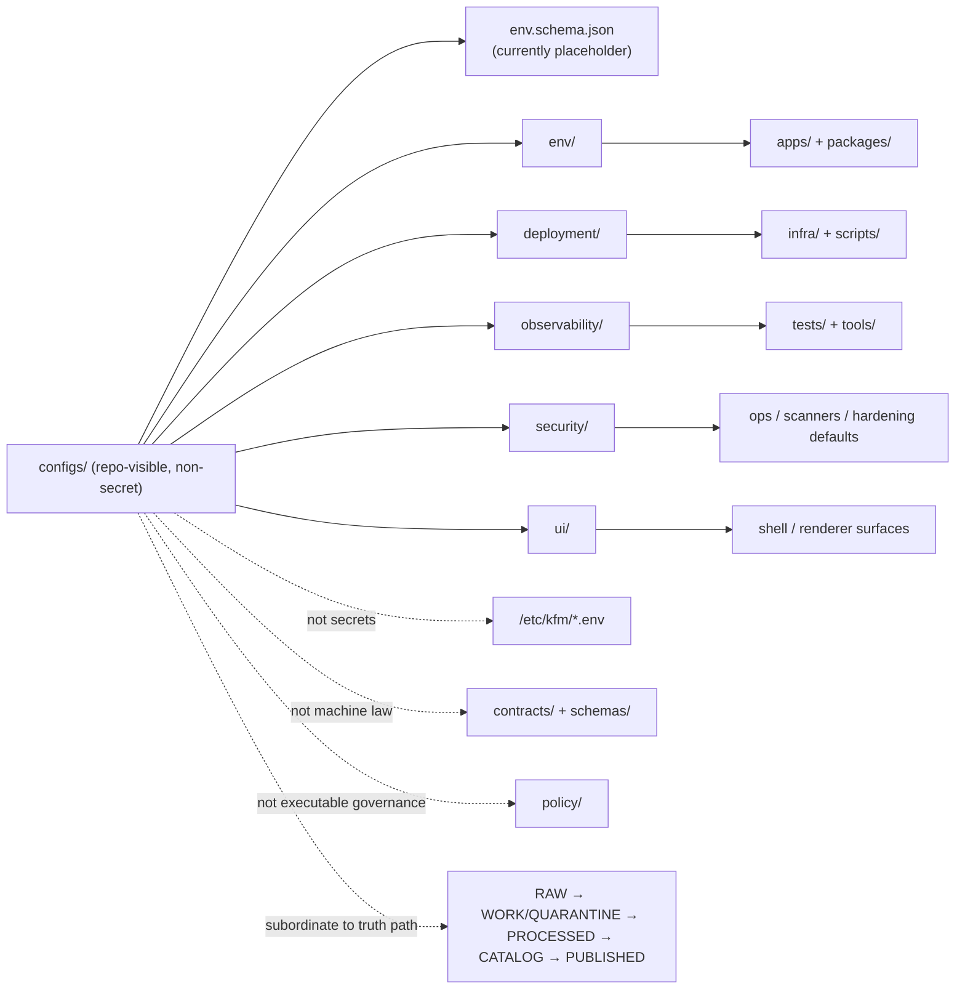

<!-- [KFM_META_BLOCK_V2]
doc_id: kfm://doc/TODO-VERIFY-UUID
title: configs/
type: standard
version: v1
status: review
owners: @bartytime4life
created: TODO(verify YYYY-MM-DD from git history)
updated: TODO(verify YYYY-MM-DD from git history)
policy_label: TODO(verify directory classification)
related: [../README.md, ../apps/, ../packages/, ../contracts/README.md, ../schemas/README.md, ../policy/README.md, ../infra/, ../tests/README.md, ../tools/README.md, ../scripts/README.md, ../migrations/, ../examples/, ./deployment/README.md, ./env/README.md, ./observability/README.md, ./security/README.md, ./ui/README.md, ./env.schema.json]
tags: [kfm, configs, runtime, deployment, observability, trust-boundaries]
notes: [Owners are confirmed from .github/CODEOWNERS on public main. The current public tree confirms deployment/, env/, observability/, security/, ui/, and env.schema.json. UUID, git-history dates, and policy label still need direct verification before merge.]
[/KFM_META_BLOCK_V2] -->

<a id="top"></a>

# configs/

_Repo-visible, non-secret configuration surfaces for KFM runtime wiring, deployment, observability, UI defaults, and scan-facing security thresholds._

> **Status:** experimental  
> **Owners:** `@bartytime4life`  
> **Path:** `configs/README.md`  
> **Current public tree state:** `deployment/`, `env/`, `observability/`, `security/`, `ui/`, and `env.schema.json` are present on `main`; the child lanes are currently README-led scaffolds and `env.schema.json` is a placeholder.  
>        
> **Quick jump:** [Scope](#scope) · [Repo fit](#repo-fit) · [Accepted inputs](#accepted-inputs) · [Exclusions](#exclusions) · [Directory tree](#directory-tree) · [Quickstart](#quickstart) · [Usage rules](#usage-rules) · [Diagram](#diagram) · [Reference tables](#reference-tables) · [Task list](#task-list--definition-of-done) · [FAQ](#faq) · [Appendix](#appendix)

> [!IMPORTANT]
> This README is grounded in two evidence layers at once: March 2026 KFM doctrine and the current public `main` tree. The root `configs/` lane and its child directories are no longer hypothetical; they are visible in the public repo. What still needs verification is deeper than lane existence: exact runtime consumers, branch-local differences, validation wiring, and how much of the lane is still scaffold versus actively consumed.

## Scope

In KFM, configuration is not a miscellaneous settings bucket. It is a **trust-bearing operational surface**. It influences how governed services bind, where workers run, how observability joins are emitted, how the shell presents already-governed state, and whether fail-closed behavior survives deployment changes.

This `configs/` lane covers the **repo-visible, non-secret subset** of that space:

- environment schema and examples
- deployment/runtime value surfaces
- observability defaults worth diffing in Git
- UI-facing defaults that do not become policy or contract law
- non-secret security thresholds, waivers, and scan-facing settings

It does **not** flatten KFM’s stronger seams. Contracts, executable policy bundles, canonical truth objects, release-proof artifacts, and secret-bearing host files remain separate on purpose.

### Truth posture for this README

| Label | How it applies here |
| --- | --- |
| **CONFIRMED** | The current public `main` tree contains `configs/README.md`, `configs/env.schema.json`, and the child lanes `deployment/`, `env/`, `observability/`, `security/`, and `ui/`. |
| **INFERRED** | The lane’s intended role is repo-visible, non-secret runtime/deployment/observability/UI/security wiring subordinate to stronger law-bearing surfaces. |
| **PROPOSED** | Future file additions inside the child lanes, deeper validator commands, and any expansion beyond the current scaffold state. |
| **UNKNOWN** | Exact runtime loader paths, exact CI enforcement depth, non-public consumers, and any branch-local divergence from the inspected public tree. |
| **NEEDS VERIFICATION** | UUID, git-history dates, policy label, and the repo’s final single-authority decision for machine-law schemas between `contracts/` and `schemas/`. |

## Repo fit

| Field | Value |
| --- | --- |
| Path | `configs/README.md` |
| Directory role | Repo-visible home for non-secret configuration surfaces and reviewed runtime wiring |
| Current public snapshot | Root README + `env.schema.json` + five child lanes: `deployment/`, `env/`, `observability/`, `security/`, `ui/` |
| Main consumers | `../apps/`, `../packages/`, `../infra/`, `../tests/`, `../tools/`, `../scripts/` |
| Governing posture | Config remains subordinate to contracts, policy, review, release state, and correction discipline |
| Review posture | Treat config edits as architecture-significant when they alter exposure, policy behavior, citation behavior, release scope, stale-state behavior, or trust-visible UX |

### Upstream / downstream links

| Relationship | Paths | Status |
| --- | --- | --- |
| Root context | [`../README.md`](../README.md) | **CONFIRMED** |
| Runtime consumers | [`../apps/`](../apps/) · [`../packages/`](../packages/) · [`../infra/`](../infra/) | **CONFIRMED** |
| Verification and tooling companions | [`../tests/README.md`](../tests/README.md) · [`../tools/README.md`](../tools/README.md) · [`../scripts/README.md`](../scripts/README.md) | **CONFIRMED** |
| Governance and law-bearing surfaces | [`../contracts/README.md`](../contracts/README.md) · [`../schemas/README.md`](../schemas/README.md) · [`../policy/README.md`](../policy/README.md) | **CONFIRMED**, but singular schema authority still **NEEDS VERIFICATION** |
| Neighboring operational lanes | [`../migrations/`](../migrations/) · [`../examples/`](../examples/) | **CONFIRMED** |
| Local child lanes | [`./deployment/README.md`](./deployment/README.md) · [`./env/README.md`](./env/README.md) · [`./observability/README.md`](./observability/README.md) · [`./security/README.md`](./security/README.md) · [`./ui/README.md`](./ui/README.md) | **CONFIRMED** |
| Host-local companions | `/etc/kfm/*.env` | Documented runtime pattern; not a repo path |

## Accepted inputs

| Path or class | Current public state | What belongs here | Why it belongs here |
| --- | --- | --- | --- |
| `env.schema.json` | **CONFIRMED file**, currently placeholder content | process-start environment schema and early validation anchor | Keeps runtime wiring explicit and machine-checkable once populated |
| `env/` | **CONFIRMED lane**, current public view is README-led | non-secret env examples, defaults, and environment guidance | Lets contributors wire runtimes without committing secrets |
| `deployment/` | **CONFIRMED lane**, current public view is README-led | deploy-facing values, overlays, and runtime-profile defaults | Keeps environment-specific wiring reviewable and diffable |
| `observability/` | **CONFIRMED lane**, current public view is README-led | collector/exporter config, log field maps, join-key defaults, trace/receipt helpers | Preserves operational evidence without burying it in app code |
| `ui/` | **CONFIRMED lane**, current public view is README-led | declarative shell/renderer defaults and accessibility-safe presentation behavior | Lets the shell vary presentation without moving governance into the frontend |
| `security/` | **CONFIRMED lane**, current public view is README-led | non-secret thresholds, waivers, scanner-facing config, and hardening defaults | Useful when clearly separated from executable policy and secret material |

### What belongs here in practice

- non-secret env examples and defaults
- early-start configuration schemas
- deployment/runtime value surfaces
- observability settings with named consumers
- UI-facing declarative defaults
- non-secret operational thresholds
- documentation-backed configuration examples that help contributors wire the system correctly

## Exclusions

| Do **not** keep here | Put it instead | Why |
| --- | --- | --- |
| Credentials, tokens, private keys, live DSNs with secrets | host-local secret files or secret manager surfaces such as `/etc/kfm/*.env` | `configs/` must stay repo-visible and non-secret |
| Executable deny/allow logic, policy bundles, reason/obligation evaluation, policy tests | [`../policy/README.md`](../policy/README.md) | Governance must remain explicit, testable, and separately reviewable |
| Machine-law schemas, OpenAPI contracts, controlled vocabularies, contract fixtures | the repo’s authoritative schema/contract home in [`../contracts/README.md`](../contracts/README.md) or [`../schemas/README.md`](../schemas/README.md) | `configs/` must not become a third schema authority |
| Database migrations | [`../migrations/`](../migrations/) | Schema evolution needs replay discipline |
| Generated caches, temp files, build output, local state | ignored runtime/build/cache locations | Reviewable config should remain intentional and stable |
| Canonical truth objects or release-backed evidence artifacts | governed data / catalog / release-proof surfaces | Config may point at them, but does not replace them |
| Frontend-only heuristics that become trust logic | shell code or governed API, depending on the concern | Trust behavior must not hide in convenience toggles |

> [!WARNING]
> The public repo currently exposes both `contracts/` and `schemas/`. Until the singular machine-law authority is explicitly settled, `configs/` should not accumulate contract-like files “temporarily.”

## Directory tree

```text
configs/
├── README.md
├── env.schema.json                  # CONFIRMED file; current public content is {}
├── deployment/
│   └── README.md                    # CONFIRMED scaffold lane
├── env/
│   └── README.md                    # CONFIRMED scaffold lane
├── observability/
│   └── README.md                    # CONFIRMED scaffold lane
├── security/
│   └── README.md                    # CONFIRMED scaffold lane
└── ui/
    └── README.md                    # CONFIRMED scaffold lane
```

How to read this tree:

- The **root lane and child lanes are current public facts**, not just doctrinal expectations.
- `env.schema.json` is also a **current public fact**, but its current contents are only `{}`. Treat it as a placeholder until a real schema and validator path land.
- The child lanes are present **scaffold-first**. Their existence is confirmed; their deeper file inventories are still intentionally small.
- Growing a child lane should be deliberate: name the consumer, name the validator, and keep the file subordinate to stronger law-bearing surfaces.

## Quickstart

1. Inspect the live `configs/` tree before editing anything.
2. Decide whether the change is truly configuration, or whether it belongs in `contracts/`, `schemas/`, `policy/`, `migrations/`, or host-local secret surfaces.
3. Make the smallest useful non-secret change.
4. Run the repo’s **actual** validation path before merge.

```bash
# Inspect the current config lane.
find configs -maxdepth 3 -type f | sort
```

```bash
# Trace likely config consumers and named config seams.
git grep -nE 'env\.schema|KFM_(ARTIFACT_ROOT|POLICY_DIR|DB_DSN|MODEL_ADAPTER_URL|PUBLISHED_ONLY|CITATIONS_REQUIRED|BIND)|trace_id|audit_ref|otel|logfmt' -- .
```

```bash
# Look for overlap with contract, schema, and policy surfaces before adding new files.
git grep -nE '(decision_envelope|evidence_bundle|runtime_response_envelope|correction_notice|reason_codes|obligation_codes|published_only|citations_required)' -- contracts schemas policy apps packages infra tests tools scripts
```

Illustrative environment key surface:

```dotenv
# Illustrative names from KFM runtime/config guidance.
# Verify the merge target before treating these as active implementation keys.

KFM_ARTIFACT_ROOT=/srv/kfm
KFM_POLICY_DIR=/etc/kfm/policy
KFM_DB_DSN=unix:///var/run/postgresql/.s.PGSQL.5432
KFM_MODEL_ADAPTER_URL=http://127.0.0.1:11434
KFM_PUBLISHED_ONLY=true
KFM_CITATIONS_REQUIRED=true
KFM_BIND=127.0.0.1:8080
```

> [!NOTE]
> The stronger host-runtime pattern keeps secret-bearing files outside the repo, under root-owned paths such as `/etc/kfm/kfm-api.env`, `/etc/kfm/kfm-worker.env`, `/etc/kfm/kfm-publish.env`, and an Ollama override or systemd drop-in.

## Usage rules

### 1) Keep `configs/` non-secret and reviewable

Commit examples, schemas, defaults, and reviewed value surfaces.  
Do **not** commit live credentials, one-machine hacks, or secret-bearing host files.

### 2) Keep configuration subordinate to law

Configuration expresses wiring, defaults, thresholds, and runtime shape.  
It must not quietly become the place where contract law, evidence law, or publication governance actually lives.

### 3) Review trust-affecting config like code

A small config diff can widen network exposure, weaken citation behavior, loosen publication scope, or hide a stale state. In KFM, those are architecture changes.

### 4) Load config explicitly and validate it early

Hidden fallback defaults are especially dangerous in governed systems. Configuration should be parsed, validated, and rejected early rather than silently tolerated.

### 5) Do not create a third schema authority

The repo already exposes both `contracts/` and `schemas/`. Until that authority is formally narrowed, `configs/` should stay out of machine-law territory.

### 6) Expand scaffold lanes deliberately

A child lane should gain substantive files only when three things are visible together:

- the primary consumer
- the validation or lint path
- the reason this file does **not** belong in a stronger home

### 7) Preserve package and route boundaries

Config should reinforce the separation of shell, renderer, style, server, workers, contracts, policy, and evidence resolution — not blur them.

> [!CAUTION]
> Any toggle that weakens citation, publication, rights handling, scope handling, or stale-state visibility is not a convenience setting. It is a governance change.

## Diagram


```mermaid
flowchart LR
    C["configs/ (repo-visible, non-secret)"]

    C --> ES["env.schema.json\n(currently placeholder)"]
    C --> E["env/"]
    C --> D["deployment/"]
    C --> O["observability/"]
    C --> S["security/"]
    C --> U["ui/"]

    E --> AP["apps/ + packages/"]
    D --> INF["infra/ + scripts/"]
    O --> T["tests/ + tools/"]
    U --> SHELL["shell / renderer surfaces"]
    S --> OPS["ops / scanners / hardening defaults"]

    C -. "not secrets" .-> HOST["/etc/kfm/*.env"]
    C -. "not machine law" .-> LAW["contracts/ + schemas/"]
    C -. "not executable governance" .-> POLICY["policy/"]
    C -. "subordinate to truth path" .-> FLOW["RAW → WORK/QUARANTINE → PROCESSED → CATALOG → PUBLISHED"]
```

## Reference tables

### Current lane snapshot

| Path | Current public state | Intended role | Notes |
| --- | --- | --- | --- |
| `configs/README.md` | **CONFIRMED** | root lane doctrine and contributor guidance | already present on public `main` |
| `configs/env.schema.json` | **CONFIRMED file** | env/config schema anchor | current public content is `{}` |
| `configs/deployment/README.md` | **CONFIRMED** | deployment-lane guidance | current public lane appears scaffold-first |
| `configs/env/README.md` | **CONFIRMED** | environment-lane guidance | current public lane appears scaffold-first |
| `configs/observability/README.md` | **CONFIRMED** | observability-lane guidance | current public lane appears scaffold-first |
| `configs/security/README.md` | **CONFIRMED** | security-lane guidance | current public lane appears scaffold-first |
| `configs/ui/README.md` | **CONFIRMED** | UI-configuration guidance | current public lane appears scaffold-first |

### “What lives where” matrix

| Concern | Preferred home | Must not hide in |
| --- | --- | --- |
| Source admission rules | `contracts/` + `policy/` | UI config or ad hoc scripts |
| Contract fixtures and schema law | current authoritative schema/contract lane | `configs/` |
| Canonical write logic | workers / canonical-model packages | browser code |
| Evidence resolution | governed API and resolver packages | renderer components |
| Styles, sprites, portrayal assets | style registry / delivery assets | canonical business tables as unexplained blobs |
| Trust cues | shell payloads and shared UI state | implicit frontend heuristics only |
| Secrets | secret store or host-local env refs | repo history or client bundles |
| Projection rebuild logic | projection workers | public routes |
| Review actions | governed API + review surface | hidden admin scripts |

### Review triggers

| Change trigger | Treat as | Why |
| --- | --- | --- |
| Bind address, listening port, proxy boundary, or exposure scope change | security + architecture review | Alters trust and attack surface |
| Citation / published-only / release-scope toggle | governance-significant change | Can weaken public trust behavior |
| New worker or scheduler config | runtime + provenance review | Can alter rebuild, correction, or freshness semantics |
| New observability join key or retention setting | ops + audit review | Can affect traceability |
| New threshold / waiver config | operational risk review | Tolerance drift can silently weaken gates |
| Turning `env.schema.json` into an active validator surface | schema + CI review | Empty placeholder → authoritative gate is a major state change |

## Task list / definition of done

- [ ] No secrets, tokens, or private credentials are committed
- [ ] Every new config file names its primary consumer
- [ ] New files are placed in the correct lane instead of drifting into `configs/` as a catch-all
- [ ] `configs/` does not encode contract law or executable policy logic that belongs elsewhere
- [ ] Host-local secret-bearing files stay outside versioned `configs/`
- [ ] `env.schema.json` is either still intentionally placeholder or is backed by a real validation path
- [ ] Any trust-affecting toggle is documented as a governance-significant change
- [ ] Scaffold lanes only gain substantive files with named consumers and validators
- [ ] Owners, UUID, dates, and policy label in the meta block are verified or intentionally left as placeholders
- [ ] Neighboring docs and lane links are rechecked against the target merge branch

## FAQ

### Is `configs/` actually confirmed now?

Yes. The current public `main` tree confirms the root lane and its child directories.

### Are the child lanes active implementation surfaces?

They are **real lanes**, but the current public tree shows them as scaffold-first, README-led directories. Presence is confirmed; deep usage still depends on the target checkout.

### Why mention both `contracts/` and `schemas/`?

Because the repo currently exposes both. Until their singular authority split is explicitly resolved, this README should not pretend only one of them exists.

### Is `env.schema.json` authoritative today?

The file exists, but its current public contents are only `{}`. Treat it as a placeholder until a validator path and active consumers are surfaced.

### Why mention `/etc/kfm/*.env` in a repo README?

Because KFM’s runtime guidance explicitly separates repo-visible configuration from secret-bearing local environment files.

### Can `configs/` change user-visible behavior?

Yes. Bind scope, published-only behavior, shell defaults, stale-state handling, and observability can all change visible system behavior. That is why config deserves review discipline.

## Appendix

<details>
<summary><strong>Current public snapshot used for this README</strong></summary>

| Path | Public-main observation |
| --- | --- |
| `configs/` | root lane exists |
| `configs/deployment/` | present |
| `configs/env/` | present |
| `configs/observability/` | present |
| `configs/security/` | present |
| `configs/ui/` | present |
| `configs/env.schema.json` | present and currently `{}` |
| `.github/CODEOWNERS` | `/configs/` covered by `@bartytime4life` |

</details>

<details>
<summary><strong>Documented runtime patterns in the March 2026 source corpus</strong></summary>

| Example | What it shows | Status |
| --- | --- | --- |
| `/etc/kfm/kfm-api.env` | host-local API environment file pattern | documented runtime pattern |
| `/etc/kfm/kfm-worker.env` | host-local worker environment file pattern | documented runtime pattern |
| `/etc/kfm/kfm-publish.env` | host-local publish/runtime environment file pattern | documented runtime pattern |
| `/etc/kfm/ollama.override.env` | local model runtime override pattern | documented runtime pattern |
| `KFM_ARTIFACT_ROOT`, `KFM_POLICY_DIR`, `KFM_DB_DSN`, `KFM_MODEL_ADAPTER_URL`, `KFM_PUBLISHED_ONLY`, `KFM_CITATIONS_REQUIRED`, `KFM_BIND` | illustrative environment-key family | documented as illustrative / still verify against merge target |

</details>

<details>
<summary><strong>Verification checklist before merge</strong></summary>

1. Confirm the target branch still matches the public `main` tree inspected for this draft.
2. Verify `git log` dates for `configs/README.md` before replacing the meta-block placeholders.
3. Confirm whether `env.schema.json` is intentionally placeholder or should now carry a real schema.
4. Verify whether any child lane has gained substantive files beyond its current README-led scaffold.
5. Verify whether the authoritative machine-law home is `contracts/`, `schemas/`, or a formally split arrangement.
6. Check whether any config toggles now influence trust behavior strongly enough to deserve more explicit documentation.
7. Reconfirm owner coverage if CODEOWNERS becomes narrower than the current global `/configs/` assignment.

</details>

[Back to top](#top)
