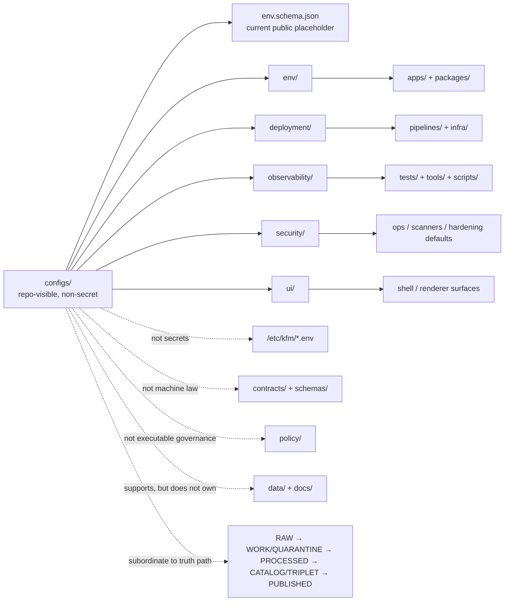

<!-- [KFM_META_BLOCK_V2]
doc_id: kfm://doc/TODO-assign-uuid
title: configs/
type: standard
version: v1
status: draft
owners: @bartytime4life
created: TODO: verify original creation date
updated: 2026-04-22
policy_label: TODO: confirm public|restricted
related: [../README.md, ../apps/, ../packages/README.md, ../pipelines/README.md, ../infra/README.md, ../data/README.md, ../docs/README.md, ../contracts/README.md, ../schemas/README.md, ../policy/README.md, ../tests/README.md, ../tools/README.md, ../scripts/README.md]
tags: [kfm, configs, configuration, governance, local-runtime, non-secret]
notes: [doc_id policy_label and original created date require verification; public main baseline inspected 2026-04-22; mounted checkout was not available in the authoring session]
[/KFM_META_BLOCK_V2] -->

<a id="top"></a>

# configs/

Repo-visible, non-secret configuration surfaces for KFM runtime wiring, deployment, observability, UI defaults, and scan-facing security thresholds.

> [!IMPORTANT]
> **Status:** experimental  
> **Owners:** `@bartytime4life`  
> **Path:** `configs/README.md`  
> **Current public baseline inspected:** 2026-04-22 on public `main`; verify target-branch parity before merge.  
> **Repo fit:** parent configuration lane under [`../README.md`](../README.md); companion surfaces include [`../apps/`](../apps/), [`../packages/README.md`](../packages/README.md), [`../pipelines/README.md`](../pipelines/README.md), and [`../infra/`](../infra/).


**Quick jump:** [Scope](#scope) · [Repo fit](#repo-fit) · [Accepted inputs](#accepted-inputs) · [Exclusions](#exclusions) · [Directory tree](#directory-tree) · [Quickstart](#quickstart) · [Usage rules](#usage-rules) · [Diagram](#diagram) · [Reference tables](#reference-tables) · [Task list](#task-list--definition-of-done) · [FAQ](#faq) · [Appendix](#appendix)

---

## Scope

In KFM, configuration is not a miscellaneous settings bucket. It is a **trust-bearing operational surface**: config can change how services bind, how workers locate governed artifacts, how observability joins are emitted, how the shell presents already-governed state, and whether fail-closed behavior survives deployment changes.

This directory covers the repo-visible, non-secret part of that space:

- environment schema and example values
- deployment/runtime value surfaces
- observability defaults worth reviewing in Git
- UI-facing defaults that do **not** become policy or contract law
- non-secret security thresholds, waivers, and scan-facing settings
- documented references to host-local runtime files such as `/etc/kfm/*.env`

It does **not** flatten KFM’s stronger seams. Contracts, executable policy bundles, canonical truth objects, release-proof artifacts, source registries, and secret-bearing host files stay separate on purpose.

### Truth posture for this README

| Label | How it applies here |
| --- | --- |
| **CONFIRMED** | Public `main` has `configs/README.md`; current public `configs/env.schema.json` is present and currently `{}`; current public ownership coverage includes `/configs/ @bartytime4life`. |
| **INFERRED** | The lane’s intended role is repo-visible, non-secret runtime/deployment/observability/UI/security wiring subordinate to stronger law-bearing surfaces. |
| **PROPOSED** | Future substantive config files, deeper validators, active consumers, and any expansion beyond scaffold-first README surfaces. |
| **UNKNOWN** | Exact runtime loader paths, exact CI enforcement depth, non-public consumers, branch-local divergence, and whether target-branch child-lane inventories differ from public `main`. |
| **NEEDS VERIFICATION** | Canonical `doc_id`, original creation date, explicit `policy_label`, and the final single-authority decision for machine-law schemas between `contracts/` and `schemas/`. |

[Back to top](#top)

---

## Repo fit

| Field | Value |
| --- | --- |
| Path | `configs/README.md` |
| Directory role | Repo-visible home for non-secret configuration surfaces and reviewed runtime wiring |
| Current public snapshot | `README.md`, `env.schema.json`, and child lanes documented under the `configs/` family; verify exact child-lane inventory against the target checkout before merge |
| Primary companion surfaces | [`../apps/`](../apps/), [`../packages/README.md`](../packages/README.md), [`../pipelines/README.md`](../pipelines/README.md), [`../infra/`](../infra/), [`../tests/README.md`](../tests/README.md), [`../tools/README.md`](../tools/README.md), [`../scripts/README.md`](../scripts/README.md) |
| Evidence and doctrine neighbors | [`../data/README.md`](../data/README.md), [`../docs/README.md`](../docs/README.md) |
| Law-bearing neighbors | [`../contracts/README.md`](../contracts/README.md), [`../schemas/README.md`](../schemas/README.md), [`../policy/README.md`](../policy/README.md) |
| Governing posture | Config remains subordinate to contracts, policy, review, release state, EvidenceBundle resolution, correction discipline, and the RAW → WORK/QUARANTINE → PROCESSED → CATALOG/TRIPLET → PUBLISHED truth path |
| Review posture | Treat config edits as architecture-significant when they alter exposure, policy behavior, citation behavior, release scope, stale-state behavior, observability, or trust-visible UX |

### Upstream / downstream links

| Relationship | Paths | Status |
| --- | --- | --- |
| Root context | [`../README.md`](../README.md) | CONFIRMED in public repo context; verify target branch |
| Evidence and doctrine neighbors | [`../data/README.md`](../data/README.md) · [`../docs/README.md`](../docs/README.md) | CONFIRMED in public repo context; verify target branch |
| Runtime and execution companions | [`../apps/`](../apps/) · [`../packages/README.md`](../packages/README.md) · [`../pipelines/README.md`](../pipelines/README.md) · [`../infra/`](../infra/) | CONFIRMED path family / INFERRED active consumption |
| Verification and tooling companions | [`../tests/README.md`](../tests/README.md) · [`../tools/README.md`](../tools/README.md) · [`../scripts/README.md`](../scripts/README.md) | CONFIRMED in public repo context; verify target branch |
| Governance and law-bearing surfaces | [`../contracts/README.md`](../contracts/README.md) · [`../schemas/README.md`](../schemas/README.md) · [`../policy/README.md`](../policy/README.md) | CONFIRMED path family; singular machine-law authority still NEEDS VERIFICATION |
| Neighboring operational lanes | [`../migrations/`](../migrations/) · [`../examples/`](../examples/) | CONFIRMED path family; verify current contents |
| Host-local companions | `/etc/kfm/*.env` | Documented runtime pattern; not a repo path |

> [!NOTE]
> `configs/` should make configuration visible without becoming the place where KFM hides secrets, policy decisions, schema law, publication truth, or runtime state.

[Back to top](#top)

---

## Accepted inputs

| Path or class | Current status | What belongs here | Why it belongs here |
| --- | --- | --- | --- |
| `env.schema.json` | CONFIRMED file; current public content is `{}` | process-start environment schema and early validation anchor | Keeps runtime wiring explicit and machine-checkable once populated |
| `env/` | CONFIRMED lane family in public documentation; verify target branch | non-secret env examples, defaults, and environment guidance | Lets contributors wire runtimes without committing secrets |
| `deployment/` | CONFIRMED lane family in public documentation; verify target branch | deploy-facing values, overlays, and runtime-profile defaults | Keeps environment-specific wiring reviewable and diffable |
| `observability/` | CONFIRMED lane family in public documentation; verify target branch | collector/exporter config, log field maps, join-key defaults, trace/receipt helpers | Preserves operational evidence without burying it in app code |
| `ui/` | CONFIRMED lane family in public documentation; verify target branch | declarative shell/renderer defaults and accessibility-safe presentation behavior | Lets the shell vary presentation without moving governance into the frontend |
| `security/` | CONFIRMED lane family in public documentation; verify target branch | non-secret thresholds, waivers, scanner-facing config, and hardening defaults | Useful when separated from executable policy and secret material |
| documented host-local references | PROPOSED / NEEDS VERIFICATION per target runtime | filenames, service names, or secret-manager references without secret values | Allows reviewers to understand expected runtime wiring without leaking credentials |

### What belongs here in practice

- non-secret env examples and defaults
- early-start configuration schemas
- deployment/runtime value surfaces
- observability settings with named consumers
- UI-facing declarative defaults that preserve trust-visible UX
- non-secret operational thresholds and scanner-facing settings
- references to host-local secret files, never secret contents
- documentation-backed configuration examples that help contributors wire the system correctly

A good config file normally answers four questions quickly:

| Question | Required answer |
| --- | --- |
| Who reads it? | a named app, worker, tool, pipeline, UI surface, or deploy target |
| What does it affect? | binding, environment shape, observability, deployment, UI presentation, scan threshold, or runtime wiring |
| What validates it? | schema, lint, smoke check, policy test, manual review, or explicit NEEDS VERIFICATION |
| What rolls it back? | a documented revert path, profile reset, host-local rollback, or release-safe fallback |

[Back to top](#top)

---

## Exclusions

| Do **not** keep here | Put it instead | Why |
| --- | --- | --- |
| Credentials, tokens, private keys, live DSNs with secrets | host-local secret files, deployment platform secrets, or secret-manager references | `configs/` must stay repo-visible and non-secret |
| Executable deny/allow logic, policy bundles, reason/obligation evaluation, policy tests | [`../policy/README.md`](../policy/README.md) | Governance must remain explicit, testable, and separately reviewable |
| Machine-law schemas, OpenAPI contracts, controlled vocabularies, contract fixtures | authoritative schema/contract home in [`../contracts/README.md`](../contracts/README.md) or [`../schemas/README.md`](../schemas/README.md) | `configs/` must not become a third schema authority |
| Source descriptors, source-admission decisions, rights records, source-role authority | [`../data/README.md`](../data/README.md), `../data/registry/`, contracts, and policy lanes | Source authority is a governed evidence surface, not a convenience config |
| Database migrations | [`../migrations/`](../migrations/) | Schema evolution needs replay discipline |
| Pipeline orchestration logic, watcher code, scheduler behavior | [`../pipelines/README.md`](../pipelines/README.md) or deployable runtime surfaces | Config may parameterize execution; it must not become execution logic |
| Generated caches, temp files, build output, runtime sockets, local state | ignored runtime/build/cache locations such as `/run/kfm/` or `/var/lib/kfm/` | Reviewable config should remain intentional and stable |
| RAW, WORK, QUARANTINE, PROCESSED, CATALOG, TRIPLET, or PUBLISHED lifecycle data | governed data lifecycle paths | Config may point at lifecycle locations; it must not hold lifecycle data |
| Release-backed evidence artifacts, run manifests, attestations, proof packs, or canonical truth objects | governed data, catalog, proof, receipt, or release surfaces | Config may reference them; it does not replace them |
| Frontend-only heuristics that become trust logic | shell code, governed API, contracts, or policy depending on the concern | Trust behavior must not hide in convenience toggles |

> [!WARNING]
> The repo exposes both `contracts/` and `schemas/`. Until the single-authority split is explicitly settled, `configs/` should not accumulate contract-like files “temporarily.”

[Back to top](#top)

---

## Directory tree

Current verified public baseline plus target-branch verification note:

```text
configs/
├── README.md                         # this directory contract
├── env.schema.json                   # CONFIRMED file; current public content is {}
├── deployment/                       # deployment-facing configuration lane
├── env/                              # non-secret environment guidance lane
├── observability/                    # logging / traces / audit-reference config lane
├── security/                         # scan-facing and hardening-default config lane
└── ui/                               # shell / renderer / presentation-default config lane
```

How to read this tree:

- The root lane and `env.schema.json` are current public facts.
- `env.schema.json` currently being `{}` means it is a placeholder until a real schema, consumer, and validator path land.
- Child-lane presence and exact file inventories must be checked against the target branch before merge.
- Growing a child lane should be deliberate: name the consumer, name the validator, and keep the file subordinate to stronger law-bearing surfaces.

[Back to top](#top)

---

## Quickstart

Use this sequence before changing anything under `configs/`.

1. Inspect the live `configs/` tree in the target checkout.
2. Re-read the neighboring lane contracts that this directory must stay subordinate to.
3. Decide whether the change is truly configuration, or whether it belongs in `contracts/`, `schemas/`, `policy/`, `pipelines/`, `migrations/`, `infra/`, `data/registry/`, or host-local secret surfaces.
4. Make the smallest useful non-secret change.
5. Run the repo’s actual validation path before merge.

```bash
# Inspect the current config lane.
find configs -maxdepth 3 -type f | sort
```

```bash
# Re-read the nearest owning and companion docs before claiming new config scope.
sed -n '1,220p' README.md
sed -n '1,220p' data/README.md
sed -n '1,220p' docs/README.md
sed -n '1,220p' pipelines/README.md
sed -n '1,220p' infra/README.md
sed -n '1,220p' policy/README.md
sed -n '1,220p' contracts/README.md
sed -n '1,220p' schemas/README.md
sed -n '1,220p' tests/README.md
sed -n '1,220p' tools/README.md
sed -n '1,220p' scripts/README.md
```

```bash
# Trace likely config consumers and named config seams.
git grep -nE 'env\.schema|KFM_(ARTIFACT_ROOT|POLICY_DIR|DB_DSN|MODEL_ADAPTER_URL|PUBLISHED_ONLY|CITATIONS_REQUIRED|BIND)|trace_id|audit_ref|otel|logfmt' -- apps packages pipelines infra tests tools scripts
```

```bash
# Look for overlap with contract, schema, policy, and release-bearing surfaces before adding new files.
git grep -nE '(decision_envelope|evidence_bundle|runtime_response_envelope|correction_notice|reason_codes|obligation_codes|published_only|citations_required|release_manifest|run_manifest|attestation)' -- contracts schemas policy apps packages pipelines infra tests tools scripts
```

```bash
# Lightweight local secret-pattern sanity check.
# This is not a substitute for the repo's actual secret-scanning workflow.
grep -RInE '(password|passwd|secret|token|api[_-]?key|private[_-]?key|BEGIN (RSA|OPENSSH|PRIVATE) KEY)' configs || true
```

Illustrative environment key surface:

```dotenv
# Illustrative names from current config guidance.
# Verify the merge target before treating these as active implementation keys.

KFM_ARTIFACT_ROOT=/srv/kfm
KFM_POLICY_DIR=/etc/kfm/policy
KFM_DB_DSN=unix:///var/run/postgresql/.s.PGSQL.5432
KFM_MODEL_ADAPTER_URL=http://127.0.0.1:11434
KFM_PUBLISHED_ONLY=true
KFM_CITATIONS_REQUIRED=true
KFM_BIND=127.0.0.1:8080
```

> [!NOTE]
> The stronger host-runtime pattern keeps secret-bearing files outside the repo, under root-owned paths such as `/etc/kfm/kfm-api.env`, `/etc/kfm/kfm-worker.env`, `/etc/kfm/kfm-publish.env`, and local runtime override files. Treat those as runtime examples, not merge-verified repo facts.

[Back to top](#top)

---

## Usage rules

### 1. Keep `configs/` non-secret and reviewable

Commit examples, schemas, defaults, reviewed value surfaces, and documented references.

Do **not** commit live credentials, private tokens, one-machine hacks, secret-bearing host files, or files copied from `/etc/kfm/`.

### 2. Keep configuration subordinate to law

Configuration expresses wiring, defaults, thresholds, runtime shape, and presentation defaults.

It must not quietly become the place where contract law, evidence law, source authority, rights decisions, or publication governance actually lives.

### 3. Review trust-affecting config like code

A small config diff can widen network exposure, weaken citation behavior, loosen publication scope, change stale-state visibility, or alter Evidence Drawer behavior. In KFM, those are architecture changes.

### 4. Load config explicitly and validate it early

Hidden fallback defaults are especially dangerous in governed systems. Configuration should be parsed, validated, and rejected early rather than silently tolerated.

### 5. Do not create a third schema authority

The repo already exposes both `contracts/` and `schemas/`. Until that authority is formally narrowed, `configs/` should stay out of machine-law territory.

### 6. Expand scaffold lanes deliberately

A child lane should gain substantive files only when three things are visible together:

- the primary consumer
- the validation or lint path
- the reason this file does **not** belong in a stronger home

### 7. Preserve package, pipeline, and route boundaries

Config should reinforce the separation of shell, renderer, style, server, workers, pipelines, contracts, policy, and evidence resolution. It should not blur them.

> [!CAUTION]
> Any toggle that weakens citation, publication, rights handling, scope handling, or stale-state visibility is not a convenience setting. It is a governance change.

[Back to top](#top)

---

## Diagram


```mermaid
flowchart LR
  C["configs/<br/>repo-visible, non-secret"] --> ES["env.schema.json<br/>current public placeholder"]
  C --> E["env/"]
  C --> D["deployment/"]
  C --> O["observability/"]
  C --> S["security/"]
  C --> U["ui/"]

  E --> AP["apps/ + packages/"]
  D --> PX["pipelines/ + infra/"]
  O --> TV["tests/ + tools/ + scripts/"]
  U --> SHELL["shell / renderer surfaces"]
  S --> OPS["ops / scanners / hardening defaults"]

  C -. "not secrets" .-> HOST["/etc/kfm/*.env"]
  C -. "not machine law" .-> LAW["contracts/ + schemas/"]
  C -. "not executable governance" .-> POLICY["policy/"]
  C -. "supports, but does not own" .-> DD["data/ + docs/"]
  C -. "subordinate to truth path" .-> FLOW["RAW → WORK/QUARANTINE → PROCESSED → CATALOG/TRIPLET → PUBLISHED"]
```

Read the diagram this way:

- `configs/` is a reviewable wiring surface, not a truth store.
- Host-local files may be referenced, but secret-bearing values stay out of Git.
- Contract, schema, policy, and data lifecycle surfaces outrank convenience config.
- Config can support the governed shell and runtime, but it must not bypass EvidenceBundle resolution, policy checks, review state, or release state.

[Back to top](#top)

---

## Reference tables

### Current lane snapshot

| Path | Current public state | Intended role | Notes |
| --- | --- | --- | --- |
| `configs/README.md` | CONFIRMED | root lane doctrine and contributor guidance | revise alongside any material lane expansion |
| `configs/env.schema.json` | CONFIRMED file | environment/config schema anchor | current public content is `{}` |
| `configs/deployment/` | CONFIRMED lane family in public documentation | deployment-lane guidance | verify target-branch contents |
| `configs/env/` | CONFIRMED lane family in public documentation | environment-lane guidance | verify target-branch contents |
| `configs/observability/` | CONFIRMED lane family in public documentation | observability-lane guidance | verify target-branch contents |
| `configs/security/` | CONFIRMED lane family in public documentation | security-lane guidance | verify target-branch contents |
| `configs/ui/` | CONFIRMED lane family in public documentation | UI-configuration guidance | verify target-branch contents |

### What lives where

| Concern | Preferred home | Must not hide in |
| --- | --- | --- |
| Source admission rules | `contracts/` + `policy/` + `data/registry/` | UI config or ad hoc scripts |
| Contract fixtures and schema law | current authoritative schema/contract lane | `configs/` |
| Canonical write logic | workers / canonical-model packages | browser code or config toggles |
| Pipeline orchestration and scheduling | `pipelines/` or deployable runtime surfaces | silent config knobs with no validator path |
| Evidence resolution | governed API and resolver packages | renderer components or UI config |
| Styles, sprites, portrayal assets | style registry / delivery assets | canonical business tables as unexplained blobs |
| Trust cues | shell payloads and shared UI state | implicit frontend heuristics only |
| Secrets | secret store or host-local env refs | repo history or client bundles |
| Projection rebuild logic | projection workers | public routes |
| Review actions | governed API + review surface | hidden admin scripts |
| Runtime model adapter values | governed runtime config + policy-bound adapter | public clients or free-form model calls |

### Review triggers

| Change trigger | Treat as | Why |
| --- | --- | --- |
| Bind address, listening port, proxy boundary, or exposure scope change | security + architecture review | Alters trust and attack surface |
| Citation / published-only / release-scope toggle | governance-significant change | Can weaken public trust behavior |
| New worker or scheduler config | runtime + provenance review | Can alter rebuild, correction, or freshness semantics |
| Pipeline parameter or staging/publish path change | execution + release review | Can alter promotion behavior and artifact routing |
| New observability join key or retention setting | ops + audit review | Can affect traceability |
| New threshold / waiver config | operational risk review | Tolerance drift can silently weaken gates |
| Turning `env.schema.json` into an active validator surface | schema + CI review | Empty placeholder → authoritative gate is a major state change |
| UI default that hides trust cues, freshness, review state, or sensitivity | UX + policy review | Trust cues are part of interpretation |

[Back to top](#top)

---

## Task list / definition of done

- [ ] No secrets, tokens, private credentials, or live secret-bearing DSNs are committed.
- [ ] Every new config file names its primary consumer.
- [ ] Every new config file names its validation or review path.
- [ ] New files are placed in the correct lane instead of drifting into `configs/` as a catch-all.
- [ ] `configs/` does not encode contract law or executable policy logic that belongs elsewhere.
- [ ] Source-admission, rights, sensitivity, and publication rules remain in governed source/policy/contract surfaces.
- [ ] Pipeline logic and deploy mechanics stay in their owning lanes.
- [ ] Host-local secret-bearing files stay outside versioned `configs/`.
- [ ] `env.schema.json` is either still intentionally placeholder or is backed by a real validation path.
- [ ] Any trust-affecting toggle is documented as a governance-significant change.
- [ ] Scaffold lanes only gain substantive files with named consumers and validators.
- [ ] `doc_id`, original `created` date, and explicit `policy_label` in the meta block are verified or intentionally left as placeholders.
- [ ] Owners in the meta block match CODEOWNERS or the target branch’s narrower ownership rule.
- [ ] Neighboring docs and lane links are rechecked against the target merge branch.
- [ ] A rollback path exists for each config change that can alter exposure, release behavior, citation behavior, or runtime binding.

[Back to top](#top)

---

## FAQ

### Is `configs/` confirmed now?

The public repo confirms the root lane and `env.schema.json`. Child-lane presence should still be rechecked against the target branch because the authoring session did not include a mounted checkout.

### Are the child lanes active implementation surfaces?

They are real configuration lanes in the public repo context, but active runtime consumption still depends on target-checkout evidence. Do not describe loader behavior, CI enforcement, or runtime consumers as CONFIRMED unless the working checkout proves them.

### Why mention both `contracts/` and `schemas/`?

Because the repo exposes both. Until their authority split is explicitly resolved, this README should not pretend only one exists.

### Why mention `pipelines/`, `data/`, and `docs/` here?

Because config often parameterizes runtime and publication behavior across those neighboring lanes, even though it does not own truth objects, source authority, or orchestration logic.

### Is `env.schema.json` authoritative today?

The file exists, but its current public contents are only `{}`. Treat it as a placeholder until a validator path and active consumers are surfaced.

### Why mention `/etc/kfm/*.env` in a repo README?

Because KFM separates repo-visible configuration from secret-bearing local environment files. The repo may document expected host-local files without storing their contents.

### Can `configs/` change user-visible behavior?

Yes. Bind scope, published-only behavior, shell defaults, stale-state handling, observability, and UI defaults can all change visible system behavior. That is why config deserves review discipline.

### Can `configs/` ever contain policy-like thresholds?

Only when they are non-secret, scanner-facing or operational thresholds with a named consumer and validator. They must not replace executable policy, rights logic, publication gates, or reason/obligation semantics.

[Back to top](#top)

---

## Appendix

<details>
<summary><strong>Current public snapshot used for this revision</strong></summary>

| Path | Public-main observation |
| --- | --- |
| `configs/README.md` | present |
| `configs/env.schema.json` | present and currently `{}` |
| `.github/CODEOWNERS` | `/configs/` covered by `@bartytime4life` |
| `configs/deployment/` | documented child lane; verify target-branch inventory |
| `configs/env/` | documented child lane; verify target-branch inventory |
| `configs/observability/` | documented child lane; verify target-branch inventory |
| `configs/security/` | documented child lane; verify target-branch inventory |
| `configs/ui/` | documented child lane; verify target-branch inventory |

</details>

<details>
<summary><strong>Illustrative runtime patterns currently documented in this lane</strong></summary>

| Example | What it shows | Status |
| --- | --- | --- |
| `/etc/kfm/kfm-api.env` | host-local API environment file pattern | documented example · verify against merge target |
| `/etc/kfm/kfm-worker.env` | host-local worker environment file pattern | documented example · verify against merge target |
| `/etc/kfm/kfm-publish.env` | host-local publish/runtime environment file pattern | documented example · verify against merge target |
| `/etc/kfm/ollama.override.env` | local model runtime override pattern | documented example · verify against merge target |
| `KFM_ARTIFACT_ROOT` | artifact-root pointer | illustrative only |
| `KFM_POLICY_DIR` | policy-directory pointer | illustrative only |
| `KFM_DB_DSN` | database connection pointer | illustrative only; never commit live secret-bearing DSNs |
| `KFM_MODEL_ADAPTER_URL` | model-adapter URL pointer | illustrative only; must remain behind governed API boundaries |
| `KFM_PUBLISHED_ONLY` | public-read posture | illustrative only; trust-affecting |
| `KFM_CITATIONS_REQUIRED` | cite-or-abstain posture | illustrative only; trust-affecting |
| `KFM_BIND` | bind-address / listener posture | illustrative only; exposure-affecting |

</details>

<details>
<summary><strong>Verification checklist before merge</strong></summary>

1. Confirm the target branch still matches the public `main` tree inspected for this draft.
2. Reconfirm the public-main `git log` dates if the target merge branch has moved since this revision’s snapshot.
3. Confirm whether `env.schema.json` is intentionally placeholder or should now carry a real schema.
4. Verify whether any child lane has gained substantive files beyond the public README-led surfaces.
5. Verify whether the authoritative machine-law home is `contracts/`, `schemas/`, or a formally split arrangement.
6. Check whether any config toggles now influence trust behavior strongly enough to deserve more explicit documentation.
7. Reconfirm owner coverage if CODEOWNERS becomes narrower than the current `/configs/` assignment.
8. Run the repo’s actual documentation, schema, policy, and secret-scanning checks.
9. Recheck every relative link from `configs/README.md` in the target checkout.
10. Replace placeholder meta-block fields only with confirmed values.

</details>

[Back to top](#top)
