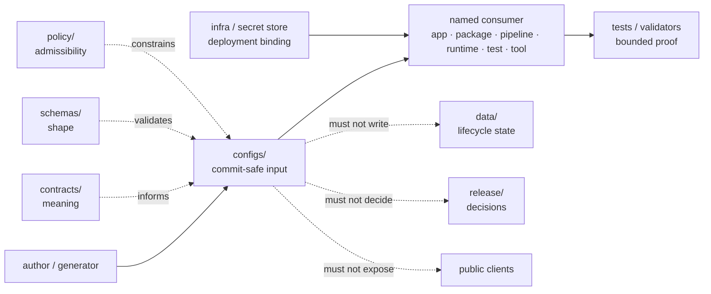

<!-- [KFM_META_BLOCK_V2]
doc_id: kfm://doc/configs-readme
title: configs/ — Canonical Commit-Safe Configuration Root
type: README
version: v0.4
status: draft; repository-grounded; canonical-config-root; mixed-maturity; no-secret-store; bounded-consumer-binding; non-authoritative
owner: "NEEDS VERIFICATION — CODEOWNERS routes /configs/ to @bartytime4life; no accepted configuration steward, security steward, required-review rule, or independent approval control was verified"
created: 2026-06-16
updated: 2026-07-23
supersedes: v0.3 documentation at the same path; no configuration payload, consumer, schema, contract, policy, test, workflow, deployment binding, runtime behavior, release object, or public behavior is superseded
policy_label: repository-facing; configuration; non-secret; commit-safe; consumer-bound; fail-closed; no-live-binding; non-publisher
current_path: configs/README.md
owning_root: configs/
responsibility: own safe, reviewable, non-secret configuration defaults, templates, examples, local-override guidance, and configuration-facing documentation without becoming semantic, schema, policy, source, evidence, lifecycle, release, runtime, deployment, or publication authority
truth_posture: cite-or-abstain; a committed configuration file proves only that bytes exist at a revision unless a named consumer, loader, precedence rule, schema, tests, workflow evidence, and deployment or runtime evidence establish more
evidence_snapshot:
  repository: bartytime4life/Kansas-Frontier-Matrix
  repository_id: "1059091169"
  visibility: public
  base_ref: main
  base_commit: f4f48a7edbc4080267d50943223ab56d4f1ef154
  prior_blob: 129c20163580bef696cf90fec79e063d9c9a5f08
  directory_rules_doctrine_blob: 2affb080e6f0043867c64c7f06c1ca52030fbd55
  directory_rules_architecture_blob: 18653c00ba193a4afaa3e07a0924452807fb98ef
  configs_domains_readme_blob: 0c4a7e7090dd9a8aabb01efc01ef073484bf0e08
  configs_maplibre_readme_blob: a216d1b1f2203f781846512ea2cca7ac163adc4b
  configs_templates_readme_blob: b1ab4ef69a6f5e74e7988ac8b3acb1ebb14cfcae
  configs_dev_readme_blob: e05de7866a7f2423f462002a687f79c967973ac1
  configs_local_readme_blob: 16f0c64baa482db3b146aa2a8d62a9b7baf3fede
  configs_examples_readme_blob: c040064e4aea09e4e87658faf37f57b4e13a96f8
  configs_test_readme_blob: 06c635480879e3c449fbd5f8c5b205c87f7bf9db
  maplibre_perf_envelope_blob: 2833f99b5316df91e71c0f8913bb06d70917abcf
  maplibre_workflow_blob: bfb36a84ba72bec68d964976dc7964cde7f5d603
  maplibre_schema_blob: 511e7f34ca84390fd5d000326ab33c46c3050fc4
  gitignore_blob: 50e0e0e2485e6dbd6b7e1c2767350b459335b22b
  env_example_blob: 50e972a4c5c009ed89097753932fc328039c1aec
  secrets_standard_blob: 562b654e101ca3c52e32b85f7acdaea9f589ab5c
  incident_response_blob: ee0b4ceb6d20858297dfd8308afbfb0cc50d2ea6
  codeowners_blob: dd2a84aa514d8ecd9208bc347f90f9a2ed37dd61
  makefile_blob: 51537af34ee065c2de571134688415042b83b22a
related:
  - ../CONTRIBUTING.md
  - ../.github/CODEOWNERS
  - ../.gitignore
  - ../.env.example
  - ../docs/doctrine/directory-rules.md
  - ../docs/architecture/directory-rules.md
  - ../docs/security/SECRETS.md
  - ../docs/security/INCIDENT_RESPONSE.md
  - ../contracts/README.md
  - ../schemas/README.md
  - ../policy/README.md
  - ../tests/README.md
  - ../fixtures/README.md
  - ../tools/README.md
  - ../apps/README.md
  - ../runtime/README.md
  - ../infra/README.md
  - ../pipelines/README.md
  - ../pipeline_specs/README.md
  - ../data/README.md
  - ../release/README.md
notes:
  - "This is a same-path Markdown modernization. It creates no sibling README, configuration payload, secret, schema, contract, policy rule, fixture, validator, test, workflow, deployment binding, receipt, proof, release record, runtime behavior, or publication state."
  - "Directory Rules §15 controls the first twelve H2 sections in this root README."
  - "The repository contains two Directory Rules artifacts with unresolved identity/placement tension. This README follows the section contract shared by the live rules and does not resolve that conflict."
  - "The current configuration inventory is a bounded named-path snapshot assembled from current repository search and direct reads, not a full recursive tree attestation."
  - "Only the MapLibre performance envelope has bounded executable consumer references. Generic configuration loading, precedence, schema binding, config-wide semantic validation, and dedicated repository secret scanning were not established."
  - "Legacy anchors from v0.3 are retained through explicit compatibility anchors."
[/KFM_META_BLOCK_V2] -->

<a id="top"></a>

# `configs/` — Canonical Commit-Safe Configuration Root

[](#status)
[](#authority-level)
[](#secrets-sensitive-values-endpoints-and-local-overrides)
[](#consumer-binding-precedence-and-overrides)
[](#authority-level)

> **One-line purpose.** `configs/` owns safe, reviewable, non-secret configuration defaults, templates, examples, local-override guidance, and configuration-facing documentation for named consumers—without becoming schema, policy, source, evidence, lifecycle, release, runtime, deployment, or publication authority.

**Quick navigation:** [Purpose](#purpose) · [Authority](#authority-level) · [Status](#status) · [Belongs](#what-belongs-here) · [Does not belong](#what-does-not-belong-here) · [Inputs](#inputs) · [Outputs](#outputs) · [Validation](#validation) · [Review](#review-burden) · [Related roots](#related-folders) · [ADRs](#adrs) · [Last reviewed](#last-reviewed) · [Lanes](#configuration-lane-index) · [File contract](#minimum-per-file-configuration-contract) · [Consumers](#consumer-binding-precedence-and-overrides) · [Security](#secrets-sensitive-values-endpoints-and-local-overrides) · [Failures](#failure-semantics-and-negative-cases) · [Rollback](#migration-correction-and-rollback) · [Open work](#open-verification-register)

> [!IMPORTANT]
> A configuration file is an **input to a named consumer**, not proof of consumer behavior. Presence, successful parsing, a friendly filename, a static badge, or a green unrelated workflow does not establish that the file is loaded, validated semantically, deployed, release-approved, or safe for public use.

> [!CAUTION]
> `configs/` is **not a secret store**. Real credentials, tokens, passwords, private keys, cookies, signed URLs, confidential endpoints, restricted identifiers, sensitive source details, and deployment-only values are forbidden—even in files labeled `local`, `dev`, `test`, or `example`. A committed real secret is a security incident: fail closed, rotate or revoke, audit exposure, and follow the repository incident-response process.

---

<a id="1-purpose"></a>

## Purpose

`configs/` is KFM's canonical responsibility root for **commit-safe configuration material**.

It exists to make configuration inspectable and reviewable while keeping implementation and governance authorities separate. A useful configuration surface helps a maintainer answer:

- what value is configurable;
- which named app, package, pipeline, pipeline specification, runtime adapter, test harness, tool, or workflow consumes it;
- whether the file is a default, template, example, threshold declaration, local override, or compatibility surface;
- which values are safe defaults, obvious mock values, placeholders, or references-by-name;
- which semantic contract owns field meaning;
- which schema checks machine shape;
- which policy or release state constrains use;
- which environment or operator supplies deployment-only values;
- which loader and precedence rules apply;
- which negative states fail closed;
- how the configuration is validated, deprecated, corrected, and rolled back.

This root serves configuration maintainers, consumer owners, security reviewers, domain stewards, test and validation owners, developer-experience maintainers, runtime and infrastructure operators, and reviewers checking that configuration does not become hidden authority.

A configuration file may influence behavior. It does not make the behavior true, safe, reviewed, released, or published.

[Back to top](#top)

---

<a id="2-authority"></a>
<a id="3-directory-rules-basis"></a>
<a id="4-authority-boundary"></a>

## Authority level

**Canonical responsibility root for safe configuration defaults and templates; non-authoritative for truth and governance.**

| Field | Authority posture |
|---|---|
| **Directory class** | Canonical responsibility root |
| **Primary responsibility** | Commit-safe, non-secret configuration defaults, templates, examples, threshold declarations, local-override guidance, and config-facing documentation |
| **May own** | Small JSON/YAML/TOML/text defaults, `.template` and `.example` files, references-by-name, named consumer metadata, config migration notes, deprecation guidance, validation instructions |
| **Must not own** | Secrets, semantic contracts, machine schemas, policy rules, source registry records, evidence, lifecycle data, receipts, proofs, release decisions, runtime adapters, infrastructure definitions, application code, pipeline logic, pipeline specifications, generated artifacts, or public data |
| **Truth posture** | Cite or abstain; configuration bytes prove only configuration bytes unless current consumer and runtime evidence establish more |
| **Public-path posture** | Public clients must not treat `configs/` as a data, evidence, policy, release, or runtime interface |
| **Promotion posture** | A config change is not lifecycle promotion, release, deployment, or publication |

### Responsibility split

| Question | Owning surface | Relationship to `configs/` |
|---|---|---|
| What does a field or object mean? | [`contracts/`](../contracts/README.md) | Configuration references the semantic contract; it does not redefine it |
| What shape is machine-valid? | [`schemas/`](../schemas/README.md) | Schema validates configuration where an accepted schema exists |
| May a value, source, operation, or exposure proceed? | [`policy/`](../policy/README.md) | Policy decides admissibility; configuration cannot override it |
| Which values are deployment-bound? | [`infra/`](../infra/README.md) and environment-specific secret/configuration systems | Configuration may use placeholders or references-by-name only |
| What runtime wiring exists? | [`runtime/`](../runtime/README.md) and named consumers | Runtime owns adapters and service wiring; config provides bounded inputs |
| What code loads the file? | [`apps/`](../apps/README.md), packages, pipelines, runtime, tools, or tests | The consumer must document the exact load path and precedence |
| What is a durable pipeline definition? | [`pipeline_specs/`](../pipeline_specs/README.md) | A pipeline spec is not demoted into generic configuration |
| What is executable pipeline logic? | [`pipelines/`](../pipelines/README.md) | Configuration does not implement processing |
| What proves behavior? | [`tests/`](../tests/README.md), [`fixtures/`](../fixtures/README.md), and validators | Passing scoped checks supports only their declared assertions |
| What lifecycle state exists? | [`data/`](../data/README.md) | Configuration never stores canonical lifecycle records |
| What is released, corrected, or rolled back? | [`release/`](../release/README.md) | A template may illustrate a manifest shape; release instances and decisions remain outside this root |

> [!WARNING]
> A file named `release_manifest.template.yaml`, `source_descriptor.template.yaml`, or similar is an illustrative configuration template. Its filename and fields do not create a release, admit a source, close evidence, or establish authority.

[Back to top](#top)

---

## Status

### Repository snapshot

| Field | Current value |
|---|---|
| Repository | `bartytime4life/Kansas-Frontier-Matrix` |
| Visibility | Public |
| Base ref | `main` |
| Base commit | `f4f48a7edbc4080267d50943223ab56d4f1ef154` |
| Prior README blob | `129c20163580bef696cf90fec79e063d9c9a5f08` |
| README status | Draft, repository-grounded, mixed maturity |
| CODEOWNERS route | `/configs/` → `@bartytime4life` |
| Accepted configuration steward | **NEEDS VERIFICATION** |
| Generic config loader or precedence contract | **UNKNOWN** |
| Generic config-wide validator | **NOT ESTABLISHED** |
| Dedicated repository secret-scanning implementation | **NOT ESTABLISHED by bounded search**; platform settings remain **UNKNOWN** |
| Release or publication effect | None |

### Material corrections from v0.3

- The prior root inventory was pinned to an older commit and showed only the Habitat domain sublane. Current named-path inspection confirms README-backed configuration lanes for all thirteen canonical domain slugs.
- `configs/local/` is not a shared tracked-template lane. Repository ignore rules exclude every child path except `configs/local/README.md`; local overrides are intentionally untracked.
- `configs/maplibre/perf-envelope.v1.json` has bounded references from named scripts and a path-scoped workflow, but the current schema accepts any object and the workflow records explicit runtime/governance holds. It is not proof of complete semantic validation or production performance.
- The five root configuration templates remain placeholder-oriented. Their presence is confirmed; named production consumers and semantic validators were not established by bounded search.
- `make validate` runs aggregate schema validators and schema/contract tests; it does not provide generic `configs/` validation.
- The repository contains two Directory Rules artifacts with unresolved placement/identity tension. Both carry the same required root-README section contract; this README does not decide which path is canonical.

<a id="7-current-tracked-directory-shape"></a>

### Bounded named-path inventory

The following paths were confirmed through current repository search and direct reads. This is **not** a full recursive tree attestation; differently named, unindexed, ignored, generated, or branch-local files remain outside the claim.

```text
configs/
├── README.md
├── dev/
│   └── README.md
├── domains/
│   ├── README.md
│   ├── agriculture/README.md
│   ├── archaeology/README.md
│   ├── atmosphere/README.md
│   ├── fauna/README.md
│   ├── flora/README.md
│   ├── geology/README.md
│   ├── habitat/
│   │   ├── .gitkeep
│   │   └── README.md
│   ├── hazards/README.md
│   ├── hydrology/README.md
│   ├── people-dna-land/README.md
│   ├── roads-rail-trade/README.md
│   ├── settlements-infrastructure/README.md
│   └── soil/README.md
├── examples/
│   └── README.md
├── local/
│   └── README.md                       # only tracked path; child overrides are ignored
├── maplibre/
│   ├── README.md
│   └── perf-envelope.v1.json
├── templates/
│   ├── README.md
│   ├── dataset_manifest.template.yaml
│   ├── layer_manifest.template.yaml
│   ├── release_manifest.template.yaml
│   ├── source_descriptor.template.yaml
│   └── viewer_style.template.json
└── test/
    └── README.md
```

### Maturity matrix

| Capability | Status | Safe conclusion |
|---|---:|---|
| Root placement | **CONFIRMED** | `configs/` is repository-present and documented as the configuration responsibility root |
| Root and child README coverage | **CONFIRMED for named paths** | Primary lanes and thirteen domain lanes have boundary documentation |
| Shared template payloads | **CONFIRMED / scaffold-level** | Five placeholder-oriented templates exist; consumer binding remains limited |
| MapLibre performance payload | **CONFIRMED / bounded consumer binding** | One JSON threshold file is referenced by named scripts/workflow surfaces |
| Generic config payloads in `dev`, `test`, or `examples` | **NOT ESTABLISHED** | The inspected lanes are README-only at their bounded snapshots |
| Tracked local override payloads | **DENIED by repository ignore rule** | Only the local README is tracked; ignored local files remain workstation-local and unknown |
| Domain executable configuration payloads | **NOT ESTABLISHED** | Domain lanes are README-backed boundaries; payload and consumer maturity remain unverified |
| Generic loader and precedence | **UNKNOWN** | No repository-wide merge order or environment override contract was verified |
| Generic schema alignment | **NEEDS VERIFICATION** | Shape authority and per-file schema bindings are incomplete or absent |
| Generic secret scanning | **NEEDS VERIFICATION** | Doctrine is explicit; dedicated repository enforcement was not established by bounded search |
| Deployment integration | **UNKNOWN** | Presence under `configs/` does not establish deployment binding |
| Release/publication | **NONE** | Configuration files do not approve or publish KFM artifacts |

[Back to top](#top)

---

<a id="5-allowed-contents"></a>

## What belongs here

| Accepted content | Required posture |
|---|---|
| Safe defaults for a named consumer | Non-secret, bounded, reviewable, and accompanied by consumer/load-path evidence |
| Reusable templates | Obvious placeholders; must not be mistaken for source, evidence, release, or lifecycle instances |
| Commit-safe examples | Clearly illustrative or mock; never production-bound by filename alone |
| Threshold or budget declarations | Versioned, consumer-bound, with units, failure semantics, tests, and rollback |
| References-by-name | Identifiers such as environment variable names or secret-store handles; never resolved secret values |
| Local-override guidance | Documents ignored, machine-local overrides without making them shared or authoritative |
| Domain-scoped configuration boundaries | Safe defaults/templates for named domain consumers; domain truth and source admission remain elsewhere |
| Config-facing documentation | Field explanations, precedence notes, migration notes, deprecation notes, validation instructions |
| Compatibility aliases | Temporary, documented, one-way, deprecation-dated, and prevented from evolving independently |
| Public verifier material | Public keys or verification references only when the security contract permits repository storage |

### Admission test

A proposed file belongs under `configs/` only when all of these are true:

1. Its primary responsibility is configuration rather than semantic meaning, machine shape, policy, runtime wiring, deployment, or lifecycle state.
2. It is safe to commit to a public repository.
3. A named consumer or clearly bounded future consumer is identified.
4. Deployment-only and sensitive values remain placeholders or references-by-name.
5. The file does not duplicate another authority root.
6. Validation and failure behavior are documented or explicitly marked `NEEDS VERIFICATION`.
7. Removal or rollback is possible without hiding behavior.

[Back to top](#top)

---

<a id="6-forbidden-contents"></a>

## What does NOT belong here

| Prohibited content | Correct responsibility |
|---|---|
| Real credentials, tokens, passwords, private keys, cookies, signed URLs, or secret values | Approved environment-specific secret store; never the repository |
| Production host binding, firewall, reverse-proxy, VPN, Kubernetes, Terraform, or access-control definitions | [`infra/`](../infra/README.md) |
| Runtime adapters, model clients, service harnesses, or runtime state | [`runtime/`](../runtime/README.md) |
| Semantic object or field meaning | [`contracts/`](../contracts/README.md) |
| JSON Schema or other machine-shape authority | [`schemas/`](../schemas/README.md) |
| Allow/deny/restrict/abstain rules or policy decisions | [`policy/`](../policy/README.md) |
| SourceDescriptor instances, source activation records, or source registry rows | Governed source registry under `data/registry/` |
| EvidenceBundles, receipts, proof packs, or validation records | Governed evidence/receipt/proof homes under `data/` |
| RAW, WORK, QUARANTINE, PROCESSED, CATALOG/TRIPLET, or PUBLISHED data | Correct lifecycle lane under [`data/`](../data/README.md) |
| ReleaseManifest instances, PromotionDecisions, correction notices, withdrawal records, or rollback cards | [`release/`](../release/README.md) |
| Application or package source code | `apps/` or `packages/` |
| Executable pipeline logic | [`pipelines/`](../pipelines/README.md) |
| Durable declarative pipeline specifications | [`pipeline_specs/`](../pipeline_specs/README.md) |
| Test assertions or fixture authority | [`tests/`](../tests/README.md) and [`fixtures/`](../fixtures/README.md) |
| Generated build, coverage, lint, screenshot, or QA artifacts | `artifacts/` within its compatibility boundary |
| Operator-specific absolute paths, private endpoint inventories, sensitive geometry, or restricted source details | Environment-specific operational systems or governed sensitive-data lanes |

> [!NOTE]
> A configuration value may refer to an endpoint, source, schema, policy, or release object. The reference does not transfer ownership of that object into `configs/`.

[Back to top](#top)

---

## Inputs

Configuration files should be derived from explicit, reviewable inputs:

| Input | Required use |
|---|---|
| Named consumer implementation | Establishes the loader, supported keys, defaults, error behavior, and precedence |
| Semantic contract | Defines field intent and invariants |
| Machine schema | Defines types, required fields, enums, formats, and unknown-key behavior |
| Policy and sensitivity requirements | Constrains endpoints, exposure, source use, geoprivacy, and public behavior |
| Security and secrets doctrine | Determines which values are forbidden, placeholders, or references-by-name |
| Deployment requirements | Define external binding without moving deployment authority into `configs/` |
| Tests and fixtures | Exercise positive, negative, stale, missing, conflicting, and unsafe states |
| Migration/deprecation records | Preserve compatibility and rollback |
| Maintainer review | Confirms ownership, operational consequence, and change burden |

### Inputs that are not sufficient by themselves

- a planning document that names a proposed path;
- a filename such as `production.yaml`;
- a README assertion that a consumer exists;
- a sample copied from a vendor;
- a successful syntax parse;
- a configuration template with `TBD` fields;
- a local workstation file;
- an environment variable present on one machine;
- a passing workflow unrelated to the configuration;
- a map, screenshot, benchmark, or generated summary.

[Back to top](#top)

---

<a id="8-diagram"></a>

## Outputs

`configs/` directly emits or supports:

- committed safe defaults and templates;
- configuration examples and documentation;
- named inputs to consumers;
- reviewable threshold declarations;
- migration/deprecation guidance;
- local-override conventions;
- validation instructions and expected failure posture.

It does **not** emit evidence, policy decisions, lifecycle promotion, release approval, deployment, runtime truth, or publication.


```mermaid
flowchart LR
    AUTHOR["author / generator"] --> CFG["configs/\ncommit-safe input"]
    CONTRACT["contracts/\nmeaning"] -. "informs" .-> CFG
    SCHEMA["schemas/\nshape"] -. "validates" .-> CFG
    POLICY["policy/\nadmissibility"] -. "constrains" .-> CFG
    CFG --> CONSUMER["named consumer\napp · package · pipeline · runtime · test · tool"]
    CONSUMER --> TESTS["tests / validators\nbounded proof"]
    INFRA["infra / secret store\ndeployment binding"] --> CONSUMER
    CFG -. "must not write" .-> DATA["data/\nlifecycle state"]
    CFG -. "must not decide" .-> RELEASE["release/\ndecisions"]
    CFG -. "must not expose" .-> PUBLIC["public clients"]
```

Read the diagram as a responsibility map, not as proof that every arrow is implemented.

[Back to top](#top)

---

<a id="9-validation-expectations"></a>

## Validation

### Current repository evidence

| Validation surface | Current evidence | What it proves | What it does not prove |
|---|---|---|---|
| Root `Makefile` | `make validate` runs aggregate schema validators and schema/contract tests | Repository-wide named targets exist | Generic `configs/` validation, secret scanning, consumer loading, or deployment |
| MapLibre performance workflow | Path-scoped workflow performs script syntax checks, selected negative tests, and readiness assertions | Bounded command-bearing checks for the MapLibre performance lane | Browser performance, visual equivalence, semantic schema completeness, release, or publication |
| MapLibre envelope validator | Python wrapper invokes the JSON Schema runner | A validator entry point exists | Strong validation: the current schema accepts any object |
| `perf-envelope.v1.json` | JSON payload with threshold fields and public-safe posture | The bounded payload exists | Threshold fitness, runtime use, or publication blocking in production |
| Root templates | Five YAML/JSON placeholder templates exist | Template bytes and placeholder intent exist | Consumer binding, contract/schema alignment, source admission, or release readiness |
| `configs/local/` ignore rule | `.gitignore` excludes local children except the README | Shared Git history should not include normal local overrides | Local files are safe, encrypted, validated, or absent |
| Secret doctrine | `docs/security/SECRETS.md` explicitly forbids real secrets in the repository | Normative repository guidance exists | Dedicated repository-owned scanning coverage or platform secret-scanning settings |
| Generic config loader | Not established | Nothing beyond absence of evidence | No repo-wide precedence, environment merge, or unknown-key contract may be claimed |

### Minimum checks for a configuration change

Every material configuration change should identify and run the applicable checks:

1. **Syntax:** parse every changed JSON, YAML, TOML, or environment-example file with the intended parser.
2. **Schema:** validate against the accepted schema; reject schema drift rather than silently accepting unknown keys.
3. **Consumer:** prove the named consumer loads the exact path and interprets fields as documented.
4. **Precedence:** test the declared default, environment, local override, and command-line ordering.
5. **Negative cases:** missing required value, unknown key, invalid enum, stale version, unsafe endpoint, denied network, secret-like value, malformed file, and conflicting alias.
6. **Security:** scan for real credentials, private keys, signed URLs, sensitive identifiers, private hosts, and accidental operational material.
7. **Boundary:** confirm the file does not become schema, policy, lifecycle, release, or deployment authority.
8. **Determinism:** where configuration influences proof or release, record units, versions, hashes, ordering, and stable failure semantics.
9. **Rollback:** verify the prior configuration and consumer pair can be restored.
10. **Documentation:** update the relevant lane README and consumer documentation.

### Suggested scoped inspection commands

These commands are examples to adapt to the affected files. They are not a claim that a generic config validation target currently exists.

```bash
# Inventory tracked configuration material.
git ls-files configs .env.example

# Review common secret-bearing patterns. A clean grep is not a complete secret scan.
git grep -nEI \
  '(BEGIN (RSA|OPENSSH|EC) PRIVATE KEY|api[_-]?key\s*[:=]|token\s*[:=]|password\s*[:=]|secret\s*[:=])' \
  -- configs .env.example

# Confirm local overrides remain ignored.
git check-ignore -v configs/local/example.local.yaml

# Run the bounded MapLibre envelope wrapper.
python tools/validators/maplibre/validate_perf_envelope.py \
  configs/maplibre/perf-envelope.v1.json

# Run repository targets whose declared scope applies.
make validate
make maplibre-govern
```

> [!CAUTION]
> The current MapLibre performance schema is permissive. A passing wrapper invocation proves syntax and acceptance by that scaffold; it does not prove threshold semantics, contract alignment, runtime use, release eligibility, or publication safety.

[Back to top](#top)

---

## Review burden

### Confirmed routing

[`.github/CODEOWNERS`](../.github/CODEOWNERS) routes `/configs/` changes to `@bartytime4life`.

That routing is not a `StewardshipAssignment`, `ReviewRecord`, `PolicyDecision`, security approval, release approval, independent review, or proof that branch protection enforced a review.

### Review by change class

| Change class | Minimum review concerns |
|---|---|
| README-only clarification | Configuration boundary, link integrity, no implementation overclaim |
| New or changed shared default | Config owner, named consumer owner, schema/test owner |
| Secret reference or environment-variable contract | Security reviewer, consumer owner, infra/runtime owner |
| Endpoint, network, host, CORS, cache, or proxy setting | Security + infra + consumer review; deny-by-default posture |
| Domain-scoped setting | Config owner + affected domain steward + sensitivity/policy reviewer when material |
| MapLibre threshold or renderer-facing setting | Map/runtime owner + validation/performance owner + release reviewer when used by release gates |
| Test selection, skip, retry, network, or side-effect setting | Test/QA owner + security reviewer + affected subsystem owner |
| Compatibility alias or path migration | Consumer owners + docs/config owner + migration/rollback review |
| Production or public-exposure implication | Separate policy, security, release, and deployment evidence; config review alone is insufficient |

Material changes should separate authorship from policy-significant approval when repository maturity supports that control.

[Back to top](#top)

---

## Related folders

| Surface | Relationship |
|---|---|
| [`dev/`](dev/README.md) | Safe development defaults/templates for named consumers; currently documentation-only at its bounded snapshot |
| [`local/`](local/README.md) | Ignored workstation-local overrides; not shared configuration or a secret store |
| [`examples/`](examples/README.md) | Commit-safe illustrative configuration examples; not live binding |
| [`templates/`](templates/README.md) | Reusable placeholder-based templates; not schema or release authority |
| [`test/`](test/README.md) | Safe test-configuration guidance; tests and fixtures remain elsewhere |
| [`domains/`](domains/README.md) | Domain-scoped configuration boundaries across thirteen README-backed lanes |
| [`maplibre/`](maplibre/README.md) | MapLibre configuration boundary with one bounded performance-envelope payload and partial consumer binding |
| [`.env.example`](../.env.example) | Root environment-variable example using safe local defaults and localhost bindings |
| [`.gitignore`](../.gitignore) | Excludes real `.env*` files and `configs/local/*` while retaining documented examples/README |
| [Secrets standard](../docs/security/SECRETS.md) | Governs secret classes, references-by-name, CI credentials, telemetry, and leak posture |
| [Incident response](../docs/security/INCIDENT_RESPONSE.md) | Governs containment, correction, rollback, notification, and audit after a security incident |
| [Directory Rules — doctrine path](../docs/doctrine/directory-rules.md) | Current repository placement doctrine used for this root contract |
| [Directory Rules — architecture path](../docs/architecture/directory-rules.md) | Separate live artifact with unresolved path/identity tension |
| [`runtime/service_configs/`](../runtime/service_configs/README.md) | Runtime service wiring and harness configuration; not the generic commit-safe defaults root |
| [`infra/`](../infra/README.md) | Deployment, host, network, exposure, and operational control |
| [`contracts/`](../contracts/README.md) | Semantic meaning |
| [`schemas/`](../schemas/README.md) | Machine shape |
| [`policy/`](../policy/README.md) | Admissibility |
| [`tests/`](../tests/README.md) and [`fixtures/`](../fixtures/README.md) | Enforceability and deterministic examples |
| [`data/`](../data/README.md) | Lifecycle, registry, receipt, proof, catalog, and published records |
| [`release/`](../release/README.md) | Release, correction, withdrawal, and rollback decisions |
| [`CONTRIBUTING.md`](../CONTRIBUTING.md) | Focused branch, draft PR, validation, evidence, and reversible-change expectations |

[Back to top](#top)

---

## ADRs

No accepted configuration-root-specific ADR was verified for this update.

- [`ADR-0001 — Schema Home`](../docs/adr/ADR-0001-schema-home--schemas-contracts-v1-is-canonical.md) is **proposed**. It informs the machine-shape boundary but does not make every configuration schema complete or accepted.
- [`ADR-0003 — policy/ is canonical`](../docs/adr/ADR-0003-policy-singular-is-canonical-(policies-is-compatibility).md) is **proposed**. Configuration cannot become policy authority regardless of the final policy-root decision.
- [`ADR-0006 — MapLibre adapter boundary`](../docs/adr/ADR-0006-maplibre-boundary--only-maplibreadapter-imports-maplibre.md) is draft with effective status **proposed**. The current MapLibre configuration lane may support bounded tooling, but it does not accept the adapter decision or prove renderer runtime maturity.

An accepted ADR and migration plan are required before:

- adding, removing, or renaming the canonical `configs/` root;
- promoting another root or path to parallel configuration authority;
- moving deployment or secret authority into `configs/`;
- changing schema-home or policy-home authority;
- introducing a repository-wide precedence contract that materially changes existing consumers without compatible migration;
- turning configuration presence into a release or publication gate without reviewed contracts, schemas, tests, and rollback.

The unresolved Directory Rules path/identity conflict remains outside this README's authority.

[Back to top](#top)

---

## Last reviewed

**2026-07-23**

Evidence snapshot: `bartytime4life/Kansas-Frontier-Matrix` at `main@f4f48a7edbc4080267d50943223ab56d4f1ef154`, prior target blob `129c20163580bef696cf90fec79e063d9c9a5f08`.

Review this README again when any of these conditions occurs:

- six months pass without review;
- a top-level configuration lane is added, moved, renamed, consolidated, or retired;
- a non-README payload appears under `dev/`, `test/`, `examples/`, or a domain lane;
- a generic configuration loader, schema family, validator, or precedence contract is established;
- secret-scanning or platform protection evidence changes;
- `.gitignore` or `.env.example` changes the local/secret boundary;
- MapLibre configuration, schema authority, consumer binding, workflow behavior, or release use changes;
- configuration begins to influence public exposure, source activation, policy decisions, or release gates;
- Directory Rules or an accepted ADR changes configuration placement;
- a configuration-related incident, correction, or rollback exposes a gap in this contract.

[Back to top](#top)

---

## Configuration lane index

| Lane | Confirmed tracked posture | Intended responsibility | Key limitation |
|---|---|---|---|
| [`dev/`](dev/README.md) | README-only bounded finding | Shared safe development defaults/templates | No loader or payload established |
| [`local/`](local/README.md) | README tracked; children ignored | Machine-local overrides | Ignored does not mean safe or validated |
| [`examples/`](examples/README.md) | README-only bounded finding | Illustrative commit-safe examples | No consumer binding established |
| [`templates/`](templates/README.md) | README + five placeholder payloads | Reusable configuration templates | Authority-shaped names do not create source/release objects |
| [`test/`](test/README.md) | README-only bounded finding | Test-runner/configuration guidance | No test or CI proof |
| [`domains/`](domains/README.md) | Parent + thirteen domain READMEs; Habitat `.gitkeep` | Domain-scoped config boundaries | Executable payloads and consumers not established |
| [`maplibre/`](maplibre/README.md) | README + `perf-envelope.v1.json` | Bounded MapLibre performance configuration | Partial consumers; schema permissive; runtime/release held |

### Domain lane snapshot

The thirteen README-backed domain lanes are:

`agriculture`, `archaeology`, `atmosphere`, `fauna`, `flora`, `geology`, `habitat`, `hazards`, `hydrology`, `people-dna-land`, `roads-rail-trade`, `settlements-infrastructure`, and `soil`.

Their presence is a navigation and boundary fact. It is not proof that domain configuration payloads are loaded, validated, deployed, or safe for public use.

[Back to top](#top)

---

## Minimum per-file configuration contract

The following contract is **PROPOSED** for new or materially changed configuration payloads unless a more specific accepted contract applies.

| Field or concern | Required question |
|---|---|
| Stable identity | What config ID, path, and version distinguish this surface? |
| Configuration class | Default, template, example, threshold, local override, compatibility alias, or generated candidate? |
| Named consumer | Which exact app, package, pipeline, pipeline spec, runtime adapter, test, tool, or workflow reads it? |
| Loader evidence | Where is the load/import/read path, and how is failure reported? |
| Precedence | Which source wins among built-in defaults, tracked config, environment, local override, CLI, or remote control plane? |
| Environment scope | Local, development, test, review, staging, production, or environment-neutral? |
| Semantic contract | Which contract defines field intent and invariants? |
| Schema | Which schema validates shape, unknown keys, formats, and version? |
| Policy | Which rights, sensitivity, access, source, network, or release policy constrains use? |
| Safe defaults | Which values are safe to commit and why? |
| External values | Which values must be injected outside the repository, by reference only? |
| Network posture | No-network, localhost-only, allowlisted, mediated, or denied? |
| Error posture | What happens when the file is absent, malformed, stale, conflicting, or contains an unknown key? |
| Test coverage | Which positive and negative fixtures/assertions exercise it? |
| Deprecation | How are aliases, old keys, and old versions warned, sunset, and removed? |
| Rollback | Which prior config/consumer pair restores behavior? |
| Ownership | Which verified maintainer and reviewers own operational consequence? |

Do not add empty metadata merely to appear complete. Mark unresolved fields `NEEDS VERIFICATION`, narrow the configuration, or delay activation.

[Back to top](#top)

---

## Consumer binding, precedence, and overrides

### Current posture

A repository-wide configuration loader, merge order, unknown-key rule, and environment precedence contract were **not established** by the inspected evidence.

Therefore:

- do not say a file is active merely because it is under `configs/`;
- do not assume every consumer searches this root;
- do not assume environment variables override tracked defaults;
- do not assume `configs/local/` is auto-loaded;
- do not assume templates are copied or rendered;
- do not assume unknown keys are ignored or rejected;
- do not infer production behavior from development or test examples.

### Required consumer declaration

A consumer-bound configuration should document:

```text
consumer:
  id: <verified app/package/pipeline/runtime/test/tool>
  config_path: <exact repo path>
  loader_path: <exact implementation path>
  environment_scope: <declared scope>
  precedence: <ordered sources>
  schema_ref: <accepted schema or NEEDS VERIFICATION>
  contract_ref: <semantic contract or NEEDS VERIFICATION>
  failure_mode: <finite, observable behavior>
  tests:
    - <positive>
    - <negative>
  rollback_target: <prior config/consumer pair>
```

This is illustrative documentation, not a repository schema.

### Precedence discipline

Each consumer must define its own exact precedence until KFM accepts a repository-wide contract. Safe defaults:

- make the order explicit and deterministic;
- log the class and source of an override without logging secret values;
- reject ambiguous duplicate keys where practical;
- treat unknown environment-specific values as an error rather than silently falling back;
- keep local overrides out of shared CI and releases unless the consumer explicitly declares them;
- prevent browser-visible configuration from exposing internal endpoints, credentials, or restricted handles;
- test parity between local, CI, and deployment paths where parity is claimed.

[Back to top](#top)

---

## Secrets, sensitive values, endpoints, and local overrides

### Allowed representations

- obvious placeholders such as `<REQUIRED_OUTSIDE_REPOSITORY>`;
- references-by-name such as `${SOURCE_API_KEY}` or a secret-store key identifier;
- public verifier material when approved;
- localhost defaults for explicitly local development;
- clearly synthetic hostnames and mock identifiers;
- public, reviewed endpoints when the consumer and policy allow them.

### Forbidden representations

- resolved secret values;
- private key blocks;
- real bearer tokens, cookies, session secrets, or passwords;
- signed URLs or embedded credentials;
- private internal hostnames or infrastructure inventory without approved need;
- exact restricted locations or sensitive source metadata;
- operator home directories or machine-specific absolute paths in shared files;
- production account, tenant, bucket, database, or registry identifiers that create exposure risk;
- browser-readable runtime or model-service credentials.

### Local overrides

[`.gitignore`](../.gitignore) excludes `configs/local/*` and re-includes only the local README. This preserves a workstation-local override boundary, but it does not make ignored files safe.

Local files may still leak through:

- shell history;
- process listings;
- logs and telemetry;
- screenshots;
- editor synchronization;
- backups;
- support bundles;
- copied patches;
- archives;
- accidental force-adds.

Prefer secret-store or environment injection by reference. Do not make an ignored file the only place a shared workflow can run.

### Incident posture

When a real secret or protected operational value appears in tracked configuration:

1. fail closed and stop further use;
2. rotate or revoke the value immediately;
3. audit repository history, logs, artifacts, caches, and downstream copies;
4. preserve incident evidence without redisclosing the secret;
5. follow [KFM Security Incident Response](../docs/security/INCIDENT_RESPONSE.md);
6. correct documentation, consumers, and templates;
7. record rollback, correction, or withdrawal impact when public or released surfaces were affected.

Deleting the current line is not sufficient remediation because Git history and downstream copies may retain the value.

[Back to top](#top)

---

## Formats, placeholders, and versioning

### Format guidance

| Format | Use | Caution |
|---|---|---|
| JSON | Strict machine input and threshold declarations | No comments; schema and unknown-key behavior should be explicit |
| YAML | Human-reviewable templates and structured defaults | Parser differences, duplicate keys, implicit types, and unsafe tags require discipline |
| TOML | Tool/runtime settings when the named consumer supports it | Consumer/version binding must be explicit |
| `.env.example` | Environment variable names and safe illustrative values | Never store resolved secrets; browser-exposed prefixes require security review |
| Markdown | Configuration-facing contracts, migration notes, and validation guidance | Documentation cannot substitute for executable checks |

### Naming

Prefer names that expose class and version:

```text
<consumer>.<class>.v<major>.json
<consumer>.<class>.template.yaml
<consumer>.<class>.example.toml
```

Existing filenames remain valid until a reviewed migration says otherwise.

### Placeholder rules

A placeholder must be unmistakable and fail safely. Avoid plausible production-looking values. Use forms such as:

```text
<REQUIRED_OUTSIDE_REPOSITORY>
NEEDS_VERIFICATION
example.invalid
127.0.0.1
mock
```

`TBD` communicates incompleteness but does not by itself guarantee fail-closed parsing. A consumer must reject unresolved required placeholders before operational use.

### Versioning and deprecation

Version when a change alters consumer interpretation, defaults, units, enum meaning, required keys, precedence, security posture, or failure behavior. Record:

- prior path/version;
- new path/version;
- compatibility period;
- consumer migration;
- fixture parity;
- warning or rejection behavior;
- sunset condition;
- rollback target.

[Back to top](#top)

---

## Failure semantics and negative cases

| Condition | Required safe posture |
|---|---|
| File absent | Consumer uses a documented safe built-in default or fails explicitly; no hidden production fallback |
| Parse failure | `ERROR`; do not continue with partial or guessed values |
| Schema mismatch | Fail validation; do not coerce consequential fields silently |
| Unknown key | Reject or explicitly report according to the accepted contract; silent ignore is not assumed |
| Duplicate key | Reject where the parser permits detection |
| Unresolved placeholder | Fail before operational use |
| Missing external secret | Fail closed; never substitute an empty, public, or cached secret |
| Secret-like tracked value | Security incident hold and rotation/audit workflow |
| Unsafe or unreviewed endpoint | Deny connection until security, rights, source, and network posture are reviewed |
| Local override in CI/release | Deny unless the consumer contract explicitly admits and records it |
| Config/policy conflict | Policy wins; configuration cannot weaken policy |
| Config/schema conflict | Treat as drift; do not let the config redefine shape |
| Config/release conflict | Release record wins; config presence cannot promote an artifact |
| Consumer not found | Mark use `UNKNOWN` or `NEEDS VERIFICATION`; do not claim activation |
| Stale/deprecated version | Warn or fail according to a reviewed sunset contract; never silently revive |
| Alias points to divergent content | Block and migrate; compatibility surfaces must not evolve independently |
| Sensitive domain value is under-specified | Deny, hold, generalize, or require steward review according to policy |

Negative tests are part of the contract. A configuration path without failure-state coverage is not ready for consequential use merely because the positive case parses.

[Back to top](#top)

---

<a id="10-migration-posture"></a>

## Migration, correction, and rollback

### Misplaced material

When material under `configs/` owns another responsibility:

1. stop treating the path as authority;
2. identify the correct responsibility root;
3. inspect current consumers and references;
4. open a drift entry when the misplaced path is already consumed;
5. use a focused migration with compatibility only when required;
6. update code, docs, schemas, policy, tests, workflows, and examples together;
7. record deprecation and sunset behavior;
8. verify rollback.

Examples:

| Misplaced item | Migration target |
|---|---|
| Real secret | Revoke/rotate; move only a reference-by-name into config; bind through approved secret system |
| Runtime service wiring | `runtime/service_configs/` or the verified runtime lane |
| Deployment topology | `infra/` |
| Pipeline definition | `pipeline_specs/` |
| Schema-shaped authority | `schemas/` |
| Policy rule | `policy/` |
| SourceDescriptor instance | governed source registry |
| Release manifest instance | `release/manifests/` |
| Proof or receipt | governed `data/proofs/` or `data/receipts/` lane |
| Generated report | `artifacts/` within its compatibility class |

### Documentation rollback

This README is rolled back by reverting its same-path documentation commit and restoring the prior blob.

### Configuration rollback

A configuration rollback must restore a **reviewed config/consumer pair**, not just old bytes. Check:

- consumer compatibility;
- schema version;
- environment/secret references;
- migration aliases;
- tests and negative cases;
- caches or generated derivatives;
- release and correction impact if the config affected released behavior.

A config rollback is not automatically a KFM release rollback. Release rollback requires the governed release system and its own records.

[Back to top](#top)

---

<a id="11-safe-change-pattern"></a>

## Safe change pattern

For any change under `configs/`:

1. Pin the base commit and read the target plus its lane README.
2. Confirm there is no overlapping branch or pull request for the exact path.
3. Classify the file: default, template, example, threshold, local override, or compatibility surface.
4. Name the consumer and verify the loader path.
5. Identify semantic contract, schema, policy, test, and deployment relationships.
6. Prove the file is safe to commit; use placeholders and references-by-name.
7. Define deterministic precedence and failure behavior.
8. Add or update positive and negative tests.
9. Run syntax, schema, consumer, boundary, and secret checks.
10. Keep lifecycle, release, proof, and deployment objects in their owning roots.
11. Update documentation and migration notes.
12. Record rollback.
13. Use a focused branch and draft pull request.
14. Do not merge, deploy, activate a source, release, or publish as part of configuration documentation alone.

### Change-impact crosswalk

| If the change affects… | Also inspect or update… |
|---|---|
| Field meaning | Contract |
| Required key/type/enum | Schema + valid/invalid fixtures |
| Allow/deny or exposure | Policy + negative tests |
| Loader path/precedence | Consumer code + integration tests + docs |
| Endpoint/network access | Security + infra + policy + no-network tests |
| Source activation | Source registry + policy + connector + receipts |
| Map style/layer/tile behavior | Map/runtime consumer + manifests + release boundary |
| Release gate or threshold | Proof/release contracts, tests, rollback |
| Local override behavior | `.gitignore`, `.env.example`, developer docs, CI parity |
| Path or filename | References, deprecation, migration, rollback |

[Back to top](#top)

---

<a id="12-definition-of-done"></a>

## Definition of done

### Root documentation

- [x] `configs/` responsibility is explicit.
- [x] The required Directory Rules §15 sections appear in order.
- [x] Secret, schema, policy, lifecycle, release, runtime, and deployment boundaries are explicit.
- [x] The current named-path inventory is recorded as bounded evidence rather than a complete tree claim.
- [x] `configs/local/` tracking behavior is documented accurately.
- [x] The MapLibre payload's partial consumer binding and permissive schema are visible.
- [x] Legacy v0.3 anchors are retained.
- [ ] Accepted configuration stewardship and independent review controls are established.
- [ ] The Directory Rules duplicate-path/identity conflict is resolved by the appropriate governance process.

### Per configuration payload

A consequential payload is not done until applicable items are complete:

- [ ] named consumer and loader path verified;
- [ ] precedence and environment scope documented;
- [ ] contract and schema references verified;
- [ ] safe defaults and external value injection separated;
- [ ] no real secrets or protected operational material;
- [ ] syntax and semantic validation pass;
- [ ] positive and negative tests pass;
- [ ] unknown-key, missing-value, stale-version, and conflict behavior verified;
- [ ] network and endpoint posture reviewed;
- [ ] migration/deprecation and rollback recorded;
- [ ] docs updated;
- [ ] release/publication implications handled in their governing roots.

A checked README box is not proof that an external consumer or deployment satisfies the condition. Use current executable evidence.

[Back to top](#top)

---

<a id="13-open-verification-items"></a>

## Open verification register

- Complete recursive tracked inventory of `configs/`, including file counts, formats, sizes, aliases, and history.
- Accepted configuration steward, security reviewer, validation owner, and consumer ownership assignments.
- Repository-wide consumer map from every configuration payload to loader/import/read paths.
- Generic configuration identity, metadata, versioning, and deprecation contract.
- Generic loader and deterministic precedence behavior across defaults, environment variables, local overrides, CLI values, and remote control planes.
- Config-to-contract and config-to-schema coverage, including unknown-key behavior.
- Dedicated config-wide syntax and semantic validation command.
- Dedicated repository secret-scanning implementation and GitHub platform protection status.
- Review of all tracked templates for placeholder safety, semantic adequacy, and risk of being mistaken for authority-shaped instances.
- Current ignored `configs/local/` practices, documentation, and leak-prevention guidance.
- Domain-lane payload inventory and consumer binding beyond README paths.
- MapLibre performance schema authority, semantic completeness, runtime fixture coverage, and actual workflow pass history.
- Whether MapLibre threshold changes participate in any accepted release gate.
- Configuration-driven network endpoint inventory and allowlist/deny-by-default controls.
- Browser-exposed environment/configuration prefixes and client-side secret/exposure risk.
- Deployment binding across `infra/`, runtime, apps, CI environments, and external secret systems.
- Compatibility and migration posture for any `config/` singular-path reference or other aliases.
- Directory Rules path/identity resolution and downstream link repair.
- Branch protection, required checks, CODEOWNERS enforcement, and independent review thresholds.
- Correction and rollback evidence for configuration incidents affecting released behavior.

> [!NOTE]
> This README is a repository-grounded configuration boundary. It does not claim that every configuration path has been recursively inventoried, every template is semantically mature, every consumer is wired, every secret scan runs, every schema is authoritative, every workflow passes, or any configuration is deployed, released, or published.

[Back to top](#top)

---

<details>
<summary>Appendix A — no-loss and anchor-preservation ledger</summary>

### Retained

- `configs/` as the canonical home for safe non-secret defaults and templates.
- Explicit prohibition on deployment-only confidential values.
- Separation from contracts, schemas, policy, apps, runtime, infra, pipelines, lifecycle data, release records, and generated artifacts.
- Existing tracked inventory, MapLibre threshold context, migration posture, safe-change sequence, definition of done, and verification backlog.
- Document identity `kfm://doc/configs-readme` and same-path lineage.

### Repaired or narrowed

- Reordered the root contract to Directory Rules §15.
- Replaced the stale older inventory snapshot with a bounded current named-path inventory.
- Corrected `configs/local/` from shared template language to ignored workstation-local override posture.
- Distinguished the MapLibre envelope's bounded consumer references from complete semantic/runtime validation.
- Exposed the permissive MapLibre schema and explicit workflow holds.
- Narrowed generic consumer, precedence, validation, secret-scanning, deployment, and CI claims to the evidence inspected.
- Replaced placeholder owner roles with the verified CODEOWNERS route plus explicit governance limits.

### Added

- Inputs and outputs contracts.
- Current maturity matrix.
- Minimum per-file configuration contract.
- Consumer-binding and precedence discipline.
- Secret, endpoint, and local-override incident posture.
- Format, placeholder, versioning, failure-state, migration, correction, and rollback guidance.
- Review-by-change-class matrix and expanded open verification register.
- Compatibility anchors for the v0.3 numbered sections.

### Legacy anchor map

| Prior anchor | Current destination |
|---|---|
| `#1-purpose` | Purpose |
| `#2-authority` | Authority level |
| `#3-directory-rules-basis` | Authority level / placement basis |
| `#4-authority-boundary` | Authority level / responsibility split |
| `#5-allowed-contents` | What belongs here |
| `#6-forbidden-contents` | What does NOT belong here |
| `#7-current-tracked-directory-shape` | Status / bounded inventory |
| `#8-diagram` | Outputs / responsibility diagram |
| `#9-validation-expectations` | Validation |
| `#10-migration-posture` | Migration, correction, and rollback |
| `#11-safe-change-pattern` | Safe change pattern |
| `#12-definition-of-done` | Definition of done |
| `#13-open-verification-items` | Open verification register |
| `#status-summary` | Status summary below |

</details>

---

<a id="status-summary"></a>

## Status summary

`configs/` is the canonical repository root for commit-safe, non-secret configuration defaults, templates, examples, threshold declarations, local-override guidance, and configuration-facing documentation. It is not a secret store, schema registry, contract root, policy engine, source registry, evidence store, lifecycle store, release system, runtime, deployment system, generated-artifact root, or public interface.

Only bounded MapLibre performance consumers were confirmed for a tracked payload in this review. Generic configuration loading, precedence, schema alignment, semantic validation, secret-scanning enforcement, deployment binding, and operational use remain `UNKNOWN` or `NEEDS VERIFICATION`.

[Back to top](#top)
