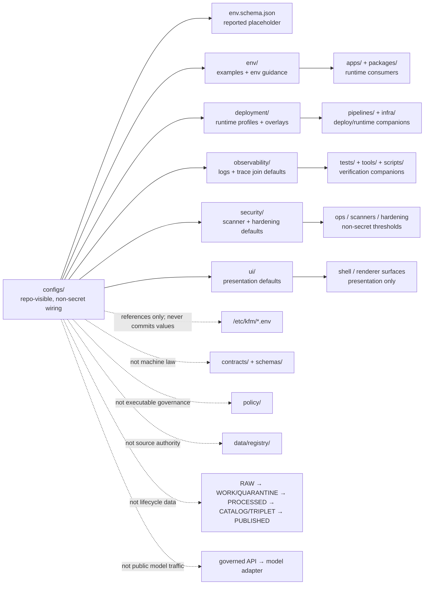
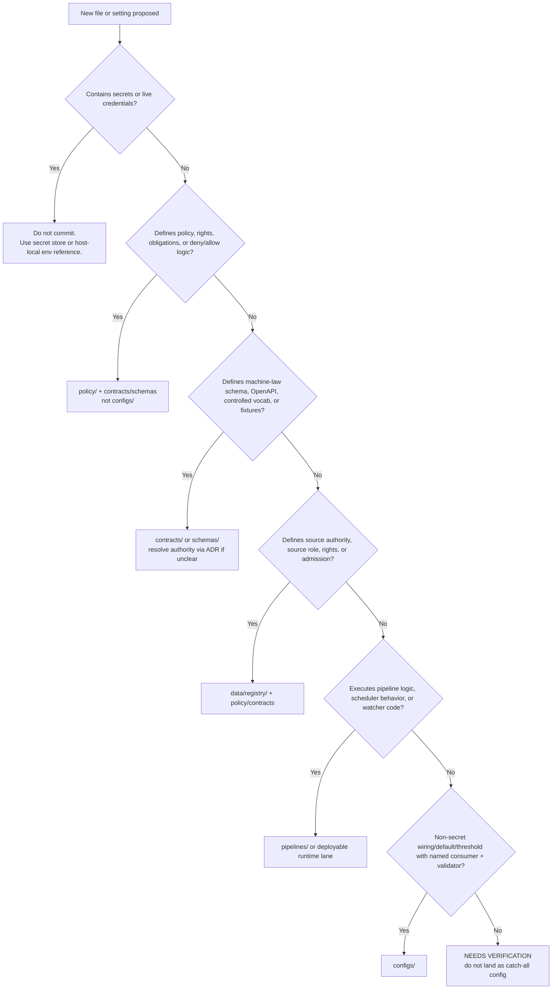

<!-- [KFM_META_BLOCK_V2]
doc_id: kfm://doc/TODO-assign-uuid
title: configs/
type: standard
version: v1
status: draft
owners: @bartytime4life
created: TODO: verify original creation date
updated: 2026-04-26
policy_label: TODO: confirm public|restricted
related: [../README.md, ../apps/, ../packages/README.md, ../pipelines/README.md, ../infra/README.md, ../data/README.md, ../docs/README.md, ../contracts/README.md, ../schemas/README.md, ../policy/README.md, ../tests/README.md, ../tools/README.md, ../scripts/README.md]
tags: [kfm, configs, configuration, governance, local-runtime, non-secret]
notes: [doc_id policy_label and original created date require verification; source draft reported public main baseline inspected 2026-04-22; target checkout parity still requires verification before merge; do not treat this README as proof of runtime consumers]
[/KFM_META_BLOCK_V2] -->

<a id="top"></a>

# configs/

<p align="center">
  <strong>Repo-visible, non-secret configuration surfaces for KFM runtime wiring, deployment defaults, observability joins, UI presentation defaults, and scan-facing thresholds.</strong>
</p>

<p align="center">
  
  
  
  
  
  
</p>

<p align="center">
  <a href="#scope">Scope</a> ·
  <a href="#repo-fit">Repo fit</a> ·
  <a href="#accepted-inputs">Accepted inputs</a> ·
  <a href="#exclusions">Exclusions</a> ·
  <a href="#directory-map">Directory map</a> ·
  <a href="#quickstart">Quickstart</a> ·
  <a href="#usage-rules">Usage rules</a> ·
  <a href="#review-triggers">Review triggers</a> ·
  <a href="#validation">Validation</a> ·
  <a href="#definition-of-done">Definition of done</a> ·
  <a href="#faq">FAQ</a>
</p>

---

> [!IMPORTANT]
> **Status:** experimental directory README.  
> **Path:** `configs/README.md`  
> **Owner:** `@bartytime4life` from the source draft; re-check against target-branch CODEOWNERS before merge.  
> **Evidence boundary:** this README may describe directory doctrine and public-baseline observations from the source draft, but it does **not** prove active runtime loaders, CI enforcement, route behavior, deployment posture, or non-public consumers.  
> **Core rule:** `configs/` is a reviewable wiring surface. It is not a secret store, policy engine, source registry, contract authority, lifecycle data store, release-proof store, or canonical truth source.

> [!CAUTION]
> Config changes can alter exposure, citation behavior, stale-state visibility, review posture, model-adapter routing, and public UX. Treat trust-affecting config like code and route it through the same evidence, policy, review, and rollback discipline expected of KFM implementation changes.

## Scope

In KFM, configuration is not a miscellaneous settings bucket. It is a **trust-bearing operational surface**: configuration can change how services bind, how workers locate governed artifacts, how observability joins are emitted, how the shell presents already-governed state, and whether fail-closed behavior survives deployment changes.

This directory covers the repo-visible, non-secret part of that space:

| Configuration concern | Belongs here when it is... | Does **not** become... |
| --- | --- | --- |
| Environment shape | a non-secret schema, example, default, or documented host-local reference | a committed secret-bearing env file |
| Deployment/runtime values | reviewable defaults, overlays, service-profile values, or non-secret runtime hints | deployment logic, credentials, or one-machine state |
| Observability defaults | log/trace field maps, join-key defaults, collector hints, or audit-reference wiring | proof objects, dashboards-as-truth, or raw logs as canonical evidence |
| UI defaults | declarative presentation defaults that preserve trust-visible UX | policy, evidence resolution, or frontend-only governance |
| Security thresholds | non-secret scanner-facing thresholds, hardening defaults, or reviewed waivers | executable policy, rights decisions, or secret material |
| Host-local references | file names, service names, or secret-manager pointers without values | committed `/etc/kfm/*.env` contents |

It does **not** flatten KFM’s stronger seams. Contracts, executable policy bundles, canonical truth objects, release-proof artifacts, source registries, and secret-bearing host files stay separate on purpose.

### Truth posture for this README

| Label | How it applies here |
| --- | --- |
| **CONFIRMED** | The source draft reports public `main` has `configs/README.md`, `configs/env.schema.json` exists and is currently `{}`, and `/configs/` is covered by `@bartytime4life`; verify target branch before merge. |
| **INFERRED** | The lane’s intended role is repo-visible, non-secret runtime/deployment/observability/UI/security wiring subordinate to stronger law-bearing surfaces. |
| **PROPOSED** | Future substantive config files, deeper validators, active consumers, and any expansion beyond README/scaffold surfaces. |
| **UNKNOWN** | Exact runtime loader paths, CI enforcement depth, non-public consumers, branch-local divergence, deployment behavior, and target-branch child-lane inventories. |
| **NEEDS VERIFICATION** | Canonical `doc_id`, original `created` date, explicit `policy_label`, owner coverage, badge claims, live links, and the final single-authority decision for machine-law schemas between `contracts/` and `schemas/`. |

<p align="right"><a href="#top">Back to top ↑</a></p>

---

## Repo fit

| Field | Value |
| --- | --- |
| Path | `configs/README.md` |
| Directory role | Repo-visible home for non-secret configuration surfaces and reviewed runtime wiring |
| Current public snapshot from source draft | `README.md`, `env.schema.json`, and child lanes documented under the `configs/` family; verify exact child-lane inventory against the target checkout before merge |
| Primary companion surfaces | [`../apps/`](../apps/), [`../packages/README.md`](../packages/README.md), [`../pipelines/README.md`](../pipelines/README.md), [`../infra/`](../infra/), [`../tests/README.md`](../tests/README.md), [`../tools/README.md`](../tools/README.md), [`../scripts/README.md`](../scripts/README.md) |
| Evidence and doctrine neighbors | [`../data/README.md`](../data/README.md), [`../docs/README.md`](../docs/README.md) |
| Law-bearing neighbors | [`../contracts/README.md`](../contracts/README.md), [`../schemas/README.md`](../schemas/README.md), [`../policy/README.md`](../policy/README.md) |
| Governing posture | Config remains subordinate to contracts, policy, review state, release state, EvidenceBundle resolution, correction discipline, and the `RAW → WORK/QUARANTINE → PROCESSED → CATALOG/TRIPLET → PUBLISHED` truth path |
| Review posture | Treat config edits as architecture-significant when they alter exposure, policy behavior, citation behavior, release scope, stale-state behavior, observability, or trust-visible UX |

### Upstream / downstream links

| Relationship | Paths | Status |
| --- | --- | --- |
| Root context | [`../README.md`](../README.md) | Reported public repo context; verify target branch |
| Evidence and doctrine neighbors | [`../data/README.md`](../data/README.md) · [`../docs/README.md`](../docs/README.md) | Reported public repo context; verify target branch |
| Runtime and execution companions | [`../apps/`](../apps/) · [`../packages/README.md`](../packages/README.md) · [`../pipelines/README.md`](../pipelines/README.md) · [`../infra/`](../infra/) | Path family reported; active consumption remains UNKNOWN until target checkout proves it |
| Verification and tooling companions | [`../tests/README.md`](../tests/README.md) · [`../tools/README.md`](../tools/README.md) · [`../scripts/README.md`](../scripts/README.md) | Reported public repo context; verify target branch |
| Governance and law-bearing surfaces | [`../contracts/README.md`](../contracts/README.md) · [`../schemas/README.md`](../schemas/README.md) · [`../policy/README.md`](../policy/README.md) | Path family reported; singular machine-law authority still NEEDS VERIFICATION |
| Neighboring operational lanes | [`../migrations/`](../migrations/) · [`../examples/`](../examples/) | Path family reported; verify current contents |
| Host-local companions | `/etc/kfm/*.env` | Documented runtime pattern; not a repo path |

> [!NOTE]
> `configs/` should make configuration visible without becoming the place where KFM hides secrets, policy decisions, schema law, source authority, publication truth, or runtime state.

<p align="right"><a href="#top">Back to top ↑</a></p>

---

## Accepted inputs

| Path or class | Current status | What belongs here | Why it belongs here |
| --- | --- | --- | --- |
| `env.schema.json` | CONFIRMED in source draft; current public content reported as `{}` | Process-start environment schema and early validation anchor | Keeps runtime wiring explicit and machine-checkable once populated |
| `env/` | Reported child lane; verify target branch | Non-secret env examples, defaults, and environment guidance | Lets contributors wire runtimes without committing secrets |
| `deployment/` | Reported child lane; verify target branch | Deploy-facing values, overlays, and runtime-profile defaults | Keeps environment-specific wiring reviewable and diffable |
| `observability/` | Reported child lane; verify target branch | Collector/exporter config, log field maps, join-key defaults, trace/receipt helpers | Preserves operational evidence without burying it in app code |
| `ui/` | Reported child lane; verify target branch | Declarative shell/renderer defaults and accessibility-safe presentation behavior | Lets the shell vary presentation without moving governance into the frontend |
| `security/` | Reported child lane; verify target branch | Non-secret thresholds, waivers, scanner-facing config, and hardening defaults | Useful when separated from executable policy and secret material |
| Documented host-local references | PROPOSED / NEEDS VERIFICATION per target runtime | Filenames, service names, secret-manager references, or local override names without secret values | Lets reviewers understand expected runtime wiring without leaking credentials |

### Practical admission test

A file belongs in `configs/` only when a reviewer can answer these four questions without guessing.

| Question | Required answer |
| --- | --- |
| Who reads it? | A named app, worker, tool, pipeline, UI surface, scanner, deploy target, or runtime profile |
| What does it affect? | Binding, environment shape, observability, deployment, UI presentation, scan threshold, or runtime wiring |
| What validates it? | Schema, lint, smoke check, policy test, manual review, or explicit NEEDS VERIFICATION |
| What rolls it back? | A documented revert path, profile reset, host-local rollback, cache invalidation, or release-safe fallback |

### Preferred file-level mini-contract

Use a lightweight header or nearby README note for substantive config files. Keep it human-reviewable; do not turn it into a second schema system.

```yaml
# Illustrative only — adapt to repo conventions before use.
kfm_config_note:
  consumer: TODO: name the app, worker, tool, pipeline, scanner, or UI surface
  effect: TODO: describe what behavior changes
  validator: TODO: name schema/lint/test/manual review path
  rollback: TODO: describe revert/profile reset/cache invalidation path
  secrets: false
  trust_affecting: TODO: true|false and why
```

<p align="right"><a href="#top">Back to top ↑</a></p>

---

## Exclusions

| Do **not** keep here | Put it instead | Why |
| --- | --- | --- |
| Credentials, tokens, private keys, live DSNs with secrets | Host-local secret files, deployment platform secrets, or secret-manager references | `configs/` must stay repo-visible and non-secret |
| Executable deny/allow logic, policy bundles, reason/obligation evaluation, policy tests | [`../policy/README.md`](../policy/README.md) | Governance must remain explicit, testable, and separately reviewable |
| Machine-law schemas, OpenAPI contracts, controlled vocabularies, contract fixtures | Authoritative schema/contract home in [`../contracts/README.md`](../contracts/README.md) or [`../schemas/README.md`](../schemas/README.md) | `configs/` must not become a third schema authority |
| Source descriptors, source-admission decisions, rights records, source-role authority | [`../data/README.md`](../data/README.md), `../data/registry/`, contracts, and policy lanes | Source authority is a governed evidence surface, not convenience config |
| Database migrations | [`../migrations/`](../migrations/) | Schema evolution needs replay discipline |
| Pipeline orchestration logic, watcher code, scheduler behavior | [`../pipelines/README.md`](../pipelines/README.md) or deployable runtime surfaces | Config may parameterize execution; it must not become execution logic |
| Generated caches, temp files, build output, runtime sockets, local state | Ignored runtime/build/cache locations such as `/run/kfm/` or `/var/lib/kfm/` | Reviewable config should remain intentional and stable |
| RAW, WORK, QUARANTINE, PROCESSED, CATALOG, TRIPLET, or PUBLISHED lifecycle data | Governed data lifecycle paths | Config may point at lifecycle locations; it must not hold lifecycle data |
| Release-backed evidence artifacts, run manifests, attestations, proof packs, or canonical truth objects | Governed data, catalog, proof, receipt, or release surfaces | Config may reference them; it does not replace them |
| Frontend-only heuristics that become trust logic | Shell code, governed API, contracts, or policy depending on the concern | Trust behavior must not hide in convenience toggles |
| Direct model-runtime prompts, free-form AI behavior, or public model endpoint values | Governed API/runtime adapter configuration plus policy-bound AI contracts | AI remains interpretive and must stay behind the governed boundary |

> [!WARNING]
> The repo exposes both `contracts/` and `schemas/` in the source draft. Until the single-authority split is explicitly settled, `configs/` should not accumulate contract-like files “temporarily.”

<p align="right"><a href="#top">Back to top ↑</a></p>

---

## Directory map

Current source-draft baseline plus target-branch verification note:

```text
configs/
├── README.md                         # this directory contract
├── env.schema.json                   # CONFIRMED in source draft; public content reported as {}
├── deployment/                       # deployment-facing configuration lane
├── env/                              # non-secret environment guidance lane
├── observability/                    # logging / traces / audit-reference config lane
├── security/                         # scan-facing and hardening-default config lane
└── ui/                               # shell / renderer / presentation-default config lane
```

How to read this tree:

- The root lane and `env.schema.json` are reported public-baseline facts from the source draft.
- `env.schema.json` being `{}` means it is a placeholder until a real schema, consumer, and validator path land.
- Child-lane presence and exact file inventories must be checked against the target branch before merge.
- Growing a child lane should be deliberate: name the consumer, name the validator, and keep the file subordinate to stronger law-bearing surfaces.

<p align="right"><a href="#top">Back to top ↑</a></p>

---

## Boundary diagram


```mermaid
flowchart LR
  C["configs/<br/>repo-visible, non-secret wiring"]

  C --> ES["env.schema.json<br/>reported placeholder"]
  C --> E["env/<br/>examples + env guidance"]
  C --> D["deployment/<br/>runtime profiles + overlays"]
  C --> O["observability/<br/>logs + trace join defaults"]
  C --> S["security/<br/>scanner + hardening defaults"]
  C --> U["ui/<br/>presentation defaults"]

  E --> AP["apps/ + packages/<br/>runtime consumers"]
  D --> PX["pipelines/ + infra/<br/>deploy/runtime companions"]
  O --> TV["tests/ + tools/ + scripts/<br/>verification companions"]
  U --> SHELL["shell / renderer surfaces<br/>presentation only"]
  S --> OPS["ops / scanners / hardening<br/>non-secret thresholds"]

  C -. "references only; never commits values" .-> HOST["/etc/kfm/*.env"]
  C -. "not machine law" .-> LAW["contracts/ + schemas/"]
  C -. "not executable governance" .-> POLICY["policy/"]
  C -. "not source authority" .-> REG["data/registry/"]
  C -. "not lifecycle data" .-> FLOW["RAW → WORK/QUARANTINE → PROCESSED → CATALOG/TRIPLET → PUBLISHED"]
  C -. "not public model traffic" .-> AI["governed API → model adapter"]
```

Read the diagram this way:

- `configs/` is a reviewable wiring surface, not a truth store.
- Host-local files may be referenced, but secret-bearing values stay out of Git.
- Contract, schema, policy, registry, and lifecycle surfaces outrank convenience config.
- Config can support the governed shell and runtime, but it must not bypass EvidenceBundle resolution, policy checks, review state, release state, or governed AI boundaries.

<p align="right"><a href="#top">Back to top ↑</a></p>

---

## Quickstart

Use this sequence before changing anything under `configs/`.

1. Inspect the live `configs/` tree in the target checkout.
2. Re-read the neighboring lane contracts that this directory must stay subordinate to.
3. Decide whether the change is truly configuration, or whether it belongs in `contracts/`, `schemas/`, `policy/`, `pipelines/`, `migrations/`, `infra/`, `data/registry/`, or host-local secret surfaces.
4. Make the smallest useful non-secret change.
5. Run the repo’s actual validation path before merge.
6. Document rollback for every trust-affecting config change.

```bash
# Inspect the current config lane.
find configs -maxdepth 3 -type f | sort
```

```bash
# Re-read the nearest owning and companion docs before claiming new config scope.
sed -n '1,220p' README.md
sed -n '1,220p' data/README.md
sed -n '1,220p' docs/README.md
sed -n '1,220p' pipelines/README.md
sed -n '1,220p' infra/README.md
sed -n '1,220p' policy/README.md
sed -n '1,220p' contracts/README.md
sed -n '1,220p' schemas/README.md
sed -n '1,220p' tests/README.md
sed -n '1,220p' tools/README.md
sed -n '1,220p' scripts/README.md
```

```bash
# Trace likely config consumers and named config seams.
git grep -nE 'env\.schema|KFM_(ARTIFACT_ROOT|POLICY_DIR|DB_DSN|MODEL_ADAPTER_URL|PUBLISHED_ONLY|CITATIONS_REQUIRED|BIND)|trace_id|audit_ref|otel|logfmt' -- apps packages pipelines infra tests tools scripts
```

```bash
# Look for overlap with contract, schema, policy, and release-bearing surfaces before adding new files.
git grep -nE '(decision_envelope|evidence_bundle|runtime_response_envelope|correction_notice|reason_codes|obligation_codes|published_only|citations_required|release_manifest|run_manifest|attestation)' -- contracts schemas policy apps packages pipelines infra tests tools scripts
```

```bash
# Lightweight local secret-pattern sanity check.
# This is not a substitute for the repo's actual secret-scanning workflow.
grep -RInE '(password|passwd|secret|token|api[_-]?key|private[_-]?key|BEGIN (RSA|OPENSSH|PRIVATE) KEY)' configs || true
```

Illustrative environment key surface:

```dotenv
# Illustrative names from current config guidance.
# Verify the merge target before treating these as active implementation keys.

KFM_ARTIFACT_ROOT=/srv/kfm
KFM_POLICY_DIR=/etc/kfm/policy
KFM_DB_DSN=unix:///var/run/postgresql/.s.PGSQL.5432
KFM_MODEL_ADAPTER_URL=http://127.0.0.1:11434
KFM_PUBLISHED_ONLY=true
KFM_CITATIONS_REQUIRED=true
KFM_BIND=127.0.0.1:8080
```

> [!NOTE]
> The stronger host-runtime pattern keeps secret-bearing files outside the repo, under root-owned paths such as `/etc/kfm/kfm-api.env`, `/etc/kfm/kfm-worker.env`, `/etc/kfm/kfm-publish.env`, and local runtime override files. Treat those as runtime examples, not merge-verified repo facts.

<p align="right"><a href="#top">Back to top ↑</a></p>

---

## Usage rules

### 1. Keep `configs/` non-secret and reviewable

Commit examples, schemas, defaults, reviewed value surfaces, and documented references.

Do **not** commit live credentials, private tokens, one-machine hacks, secret-bearing host files, files copied from `/etc/kfm/`, or model-provider secrets.

### 2. Keep configuration subordinate to law

Configuration expresses wiring, defaults, thresholds, runtime shape, and presentation defaults.

It must not quietly become the place where contract law, evidence law, source authority, rights decisions, publication governance, or policy obligations actually live.

### 3. Review trust-affecting config like code

A small config diff can widen network exposure, weaken citation behavior, loosen publication scope, change stale-state visibility, alter Evidence Drawer behavior, or route model traffic differently. In KFM, those are architecture changes.

### 4. Load config explicitly and validate it early

Hidden fallback defaults are especially dangerous in governed systems. Configuration should be parsed, validated, and rejected early rather than silently tolerated.

### 5. Do not create a third schema authority

The repo already exposes both `contracts/` and `schemas/` in the source draft. Until that authority is formally narrowed, `configs/` should stay out of machine-law territory.

### 6. Expand scaffold lanes deliberately

A child lane should gain substantive files only when three things are visible together:

- the primary consumer
- the validation or lint path
- the reason this file does **not** belong in a stronger home

### 7. Preserve package, pipeline, and route boundaries

Config should reinforce the separation of shell, renderer, style, server, workers, pipelines, contracts, policy, and evidence resolution. It should not blur them.

### 8. Make negative outcomes first-class

Config validation failures should fail visibly. Prefer explicit `ABSTAIN`, `DENY`, or `ERROR` pathways in downstream governed surfaces over silent permissive defaults when evidence, policy, rights, or runtime state is unclear.

> [!CAUTION]
> Any toggle that weakens citation, publication, rights handling, scope handling, stale-state visibility, exact-location safety, or governed-AI boundaries is not a convenience setting. It is a governance change.

<p align="right"><a href="#top">Back to top ↑</a></p>

---

## Review triggers

| Change trigger | Treat as | Why |
| --- | --- | --- |
| Bind address, listening port, reverse-proxy boundary, VPN exposure, or CORS posture | Security + architecture review | Alters trust and attack surface |
| Citation, published-only, release-scope, or evidence-required toggle | Governance-significant change | Can weaken public trust behavior |
| Model adapter URL, model runtime host, embedding endpoint, or inference provider value | Governed-AI + security review | Model runtimes must remain behind governed API boundaries |
| Worker, scheduler, watcher, or queue config | Runtime + provenance review | Can alter rebuild, correction, or freshness semantics |
| Pipeline parameter or staging/publish path change | Execution + release review | Can alter promotion behavior and artifact routing |
| New observability join key, retention setting, or audit-reference field | Ops + audit review | Can affect traceability and incident reconstruction |
| New threshold or waiver config | Operational risk review | Tolerance drift can silently weaken gates |
| Turning `env.schema.json` into an active validator surface | Schema + CI review | Empty placeholder → authoritative gate is a major state change |
| UI default that hides trust cues, freshness, review state, or sensitivity | UX + policy review | Trust cues are part of interpretation |
| Host-local path naming convention change | Ops + rollback review | Can break service startup, local overrides, or incident recovery |

### Trust-affecting toggle examples

| Example key | Why it is sensitive | Minimum review expectation |
| --- | --- | --- |
| `KFM_PUBLISHED_ONLY` | Can alter whether public surfaces see only governed released state | Policy/release review plus explicit rollback |
| `KFM_CITATIONS_REQUIRED` | Can alter cite-or-abstain behavior | Evidence/governance review plus tests or manual verification |
| `KFM_MODEL_ADAPTER_URL` | Can route inference to a different provider/runtime | Security/governed-AI review; no direct public client traffic |
| `KFM_BIND` | Can expose a service beyond localhost | Security review; reverse-proxy/VPN posture documented |
| `KFM_POLICY_DIR` | Can point runtime to a different policy bundle | Policy integrity review; hash/version checks where practical |
| `KFM_ARTIFACT_ROOT` | Can move artifact reads/writes | Lifecycle/release review; ensure no RAW/WORK public bypass |

<p align="right"><a href="#top">Back to top ↑</a></p>

---

## Placement decision tree


```mermaid
flowchart TD
  A["New file or setting proposed"] --> B{"Contains secrets or live credentials?"}
  B -->|Yes| H["Do not commit.<br/>Use secret store or host-local env reference."]
  B -->|No| C{"Defines policy, rights, obligations, or deny/allow logic?"}
  C -->|Yes| P["policy/ + contracts/schemas<br/>not configs/"]
  C -->|No| D{"Defines machine-law schema, OpenAPI, controlled vocab, or fixtures?"}
  D -->|Yes| L["contracts/ or schemas/<br/>resolve authority via ADR if unclear"]
  D -->|No| E{"Defines source authority, source role, rights, or admission?"}
  E -->|Yes| R["data/registry/ + policy/contracts"]
  E -->|No| F{"Executes pipeline logic, scheduler behavior, or watcher code?"}
  F -->|Yes| X["pipelines/ or deployable runtime lane"]
  F -->|No| G{"Non-secret wiring/default/threshold with named consumer + validator?"}
  G -->|Yes| Cfg["configs/"]
  G -->|No| N["NEEDS VERIFICATION<br/>do not land as catch-all config"]
```

<p align="right"><a href="#top">Back to top ↑</a></p>

---

## Reference tables

### Current lane snapshot

| Path | Current public state from source draft | Intended role | Notes |
| --- | --- | --- | --- |
| `configs/README.md` | CONFIRMED in source draft | Root lane doctrine and contributor guidance | Revise alongside any material lane expansion |
| `configs/env.schema.json` | CONFIRMED file in source draft | Environment/config schema anchor | Current public content reported as `{}` |
| `configs/deployment/` | Reported lane family | Deployment-lane guidance | Verify target-branch contents |
| `configs/env/` | Reported lane family | Environment-lane guidance | Verify target-branch contents |
| `configs/observability/` | Reported lane family | Observability-lane guidance | Verify target-branch contents |
| `configs/security/` | Reported lane family | Security-lane guidance | Verify target-branch contents |
| `configs/ui/` | Reported lane family | UI-configuration guidance | Verify target-branch contents |

### What lives where

| Concern | Preferred home | Must not hide in |
| --- | --- | --- |
| Source admission rules | `contracts/` + `policy/` + `data/registry/` | UI config or ad hoc scripts |
| Contract fixtures and schema law | Current authoritative schema/contract lane | `configs/` |
| Canonical write logic | Workers / canonical-model packages | Browser code or config toggles |
| Pipeline orchestration and scheduling | `pipelines/` or deployable runtime surfaces | Silent config knobs with no validator path |
| Evidence resolution | Governed API and resolver packages | Renderer components or UI config |
| Styles, sprites, portrayal assets | Style registry / delivery assets | Canonical business tables as unexplained blobs |
| Trust cues | Shell payloads and shared UI state | Implicit frontend heuristics only |
| Secrets | Secret store or host-local env refs | Repo history or client bundles |
| Projection rebuild logic | Projection workers | Public routes |
| Review actions | Governed API + review surface | Hidden admin scripts |
| Runtime model adapter values | Governed runtime config + policy-bound adapter | Public clients or free-form model calls |

### Config review classes

| Class | Examples | Review posture |
| --- | --- | --- |
| Routine wiring | Non-secret display defaults, local sample values, log-format examples | Normal review; link consumer and validator |
| Runtime-affecting | Bind scope, artifact root, worker queues, model adapter, policy directory | Architecture/security review; rollback required |
| Trust-affecting | Published-only, citations-required, stale-state visibility, sensitivity display | Governance/policy review; tests or explicit manual verification required |
| Authority-adjacent | Anything that resembles schema law, source authority, policy logic, release gates | Move to stronger lane or create ADR before landing |

<p align="right"><a href="#top">Back to top ↑</a></p>

---

## Validation

No single generic command proves `configs/` is safe. Use layered checks and prefer the repo’s actual validation workflow when available.

### Baseline checks

```bash
# 1. Confirm intended files are visible and small enough to review.
find configs -maxdepth 3 -type f -print | sort
```

```bash
# 2. Check for accidental secret-like material.
# Keep this lightweight check as a local sanity pass; use the repo's official secret scanner before merge.
grep -RInE '(password|passwd|secret|token|api[_-]?key|private[_-]?key|BEGIN (RSA|OPENSSH|PRIVATE) KEY)' configs || true
```

```bash
# 3. Check for accidental policy/contract/proof drift into configs/.
grep -RInE '(EvidenceBundle|DecisionEnvelope|PolicyDecision|ReleaseManifest|SourceDescriptor|rights|obligation|reason_code|canonical_truth|proof_pack|attestation)' configs || true
```

```bash
# 4. Confirm links from this README after target checkout is available.
# Replace with repo-native markdown/link checker if one exists.
python - <<'PY'
from pathlib import Path
readme = Path('configs/README.md')
print(f'{readme}: {readme.exists()}')
PY
```

### Validator expectations

| Validation area | Expected posture |
| --- | --- |
| Secret scanning | No live credentials, tokens, keys, or secret-bearing DSNs in `configs/` |
| Schema/config checks | Any active schema file has named consumers and a validation path |
| Policy separation | Deny/allow logic and obligations remain in `policy/` and contract surfaces |
| Contract separation | Machine-law schemas and API contracts remain in the authoritative schema/contract lane |
| Link checks | Repo-relative links resolve in the target checkout or are explicitly marked TODO/NEEDS VERIFICATION |
| Trust toggle review | Trust-affecting toggles have review notes and rollback plans |
| Consumer traceability | New config files name the app/tool/pipeline/UI surface that reads them |

<p align="right"><a href="#top">Back to top ↑</a></p>

---

## Rollback and correction posture

Config rollback is not just “revert the file” when config affects exposure, release behavior, Evidence Drawer behavior, model routing, policy bundle selection, or artifact locations.

| Change kind | Rollback should include |
| --- | --- |
| Bind/exposure change | Revert config, reload service, confirm listener, re-check reverse proxy/VPN/firewall posture |
| Artifact-root change | Revert pointer, invalidate affected caches, confirm no RAW/WORK/QUARANTINE data became public |
| Published-only or citation toggle | Revert toggle, rerun relevant smoke checks, confirm public surfaces cite or abstain |
| Policy directory change | Repoint to previous bundle, verify policy version/hash where available, rerun policy fixtures |
| Model adapter change | Repoint adapter, confirm no direct public model traffic, clear Focus/model caches where applicable |
| UI trust cue default | Restore trust-visible defaults, verify Evidence Drawer/freshness/review state display |
| Observability join-key change | Restore join-key shape, verify trace/log correlation, preserve incident notes if affected |

When a config mistake affected public or semi-public output, preserve correction lineage instead of silently overwriting history.

<p align="right"><a href="#top">Back to top ↑</a></p>

---

## Definition of done

- [ ] No secrets, tokens, private credentials, or live secret-bearing DSNs are committed.
- [ ] Every new config file names its primary consumer.
- [ ] Every new config file names its validation or review path.
- [ ] Every new config file has a rollback path proportional to its risk.
- [ ] New files are placed in the correct lane instead of drifting into `configs/` as a catch-all.
- [ ] `configs/` does not encode contract law or executable policy logic that belongs elsewhere.
- [ ] Source-admission, rights, sensitivity, and publication rules remain in governed source/policy/contract surfaces.
- [ ] Pipeline logic and deploy mechanics stay in their owning lanes.
- [ ] Host-local secret-bearing files stay outside versioned `configs/`.
- [ ] `env.schema.json` is either still intentionally placeholder or is backed by a real validation path.
- [ ] Any trust-affecting toggle is documented as a governance-significant change.
- [ ] Scaffold lanes only gain substantive files with named consumers and validators.
- [ ] `doc_id`, original `created` date, and explicit `policy_label` in the meta block are verified or intentionally left as placeholders.
- [ ] Owners in the meta block match CODEOWNERS or the target branch’s narrower ownership rule.
- [ ] Neighboring docs and lane links are rechecked against the target merge branch.
- [ ] A rollback path exists for each config change that can alter exposure, release behavior, citation behavior, model routing, or runtime binding.

<p align="right"><a href="#top">Back to top ↑</a></p>

---

## FAQ

### Is `configs/` confirmed now?

The source draft reports the public repo confirms the root lane and `env.schema.json`. Child-lane presence should still be rechecked against the target branch because the authoring context did not include a mounted checkout.

### Are the child lanes active implementation surfaces?

They are documented configuration lanes in the public repo context described by the source draft. Active runtime consumption still depends on target-checkout evidence. Do not describe loader behavior, CI enforcement, or runtime consumers as CONFIRMED unless the working checkout proves them.

### Why mention both `contracts/` and `schemas/`?

Because the source draft says the repo exposes both. Until their authority split is explicitly resolved, this README should not pretend only one exists.

### Why mention `pipelines/`, `data/`, and `docs/` here?

Because config often parameterizes runtime and publication behavior across those neighboring lanes, even though it does not own truth objects, source authority, orchestration logic, or doctrine.

### Is `env.schema.json` authoritative today?

The file is reported present, but its current public contents are only `{}`. Treat it as a placeholder until a validator path and active consumers are surfaced.

### Why mention `/etc/kfm/*.env` in a repo README?

Because KFM separates repo-visible configuration from secret-bearing local environment files. The repo may document expected host-local files without storing their contents.

### Can `configs/` change user-visible behavior?

Yes. Bind scope, published-only behavior, shell defaults, stale-state handling, observability, and UI defaults can all change visible system behavior. That is why config deserves review discipline.

### Can `configs/` ever contain policy-like thresholds?

Only when they are non-secret, scanner-facing or operational thresholds with a named consumer and validator. They must not replace executable policy, rights logic, publication gates, or reason/obligation semantics.

### Can model runtime values live here?

Only as non-secret, governed-runtime wiring with clear boundaries. Public clients must not talk directly to model runtimes, and model output must not become proof.

<p align="right"><a href="#top">Back to top ↑</a></p>

---

## Appendix

<details>
<summary><strong>Current public snapshot used for this revision</strong></summary>

| Path | Public-main observation reported by source draft |
| --- | --- |
| `configs/README.md` | present |
| `configs/env.schema.json` | present and currently `{}` |
| `.github/CODEOWNERS` | `/configs/` covered by `@bartytime4life` |
| `configs/deployment/` | documented child lane; verify target-branch inventory |
| `configs/env/` | documented child lane; verify target-branch inventory |
| `configs/observability/` | documented child lane; verify target-branch inventory |
| `configs/security/` | documented child lane; verify target-branch inventory |
| `configs/ui/` | documented child lane; verify target-branch inventory |

</details>

<details>
<summary><strong>Illustrative runtime patterns currently documented in this lane</strong></summary>

| Example | What it shows | Status |
| --- | --- | --- |
| `/etc/kfm/kfm-api.env` | Host-local API environment file pattern | documented example · verify against merge target |
| `/etc/kfm/kfm-worker.env` | Host-local worker environment file pattern | documented example · verify against merge target |
| `/etc/kfm/kfm-publish.env` | Host-local publish/runtime environment file pattern | documented example · verify against merge target |
| `/etc/kfm/ollama.override.env` | Local model runtime override pattern | documented example · verify against merge target |
| `KFM_ARTIFACT_ROOT` | Artifact-root pointer | illustrative only |
| `KFM_POLICY_DIR` | Policy-directory pointer | illustrative only |
| `KFM_DB_DSN` | Database connection pointer | illustrative only; never commit live secret-bearing DSNs |
| `KFM_MODEL_ADAPTER_URL` | Model-adapter URL pointer | illustrative only; must remain behind governed API boundaries |
| `KFM_PUBLISHED_ONLY` | Public-read posture | illustrative only; trust-affecting |
| `KFM_CITATIONS_REQUIRED` | Cite-or-abstain posture | illustrative only; trust-affecting |
| `KFM_BIND` | Bind-address / listener posture | illustrative only; exposure-affecting |

</details>

<details>
<summary><strong>Verification checklist before merge</strong></summary>

1. Confirm the target branch still matches the public `main` tree inspected for the source draft.
2. Reconfirm the public-main `git log` dates if the target merge branch has moved since the source draft’s snapshot.
3. Confirm whether `env.schema.json` is intentionally placeholder or should now carry a real schema.
4. Verify whether any child lane has gained substantive files beyond the public README-led surfaces.
5. Verify whether the authoritative machine-law home is `contracts/`, `schemas/`, or a formally split arrangement.
6. Check whether any config toggles now influence trust behavior strongly enough to deserve more explicit documentation.
7. Reconfirm owner coverage if CODEOWNERS becomes narrower than the current `/configs/` assignment.
8. Run the repo’s actual documentation, schema, policy, and secret-scanning checks.
9. Recheck every relative link from `configs/README.md` in the target checkout.
10. Replace placeholder meta-block fields only with confirmed values.
11. Verify no direct public model-runtime path or unpublished lifecycle path can be reached through ordinary UI/API config.
12. Confirm rollback notes for any config change that alters exposure, citation behavior, release scope, policy bundle selection, or model routing.

</details>

<details>
<summary><strong>Maintainer handoff notes</strong></summary>

| Item | Status | Action |
| --- | --- | --- |
| `doc_id` | NEEDS VERIFICATION | Assign canonical KFM doc ID before publishing |
| `created` | NEEDS VERIFICATION | Replace placeholder only with verified original creation date |
| `policy_label` | NEEDS VERIFICATION | Confirm `public`, `restricted`, or narrower label before publishing |
| CODEOWNERS | NEEDS VERIFICATION | Confirm owner coverage in target checkout |
| `env.schema.json` | NEEDS VERIFICATION | Keep placeholder if no active validator exists; otherwise document consumer + validator |
| `contracts/` vs `schemas/` | CONFLICTED / NEEDS VERIFICATION | Resolve by ADR or canonical-home doc before adding contract-like config |
| Runtime consumers | UNKNOWN | Do not claim active consumption until target checkout proves it |

</details>

<p align="right"><a href="#top">Back to top ↑</a></p>
