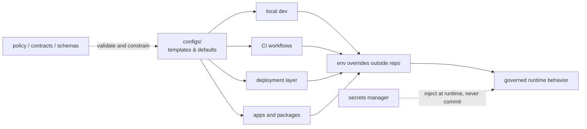

<!-- [KFM_META_BLOCK_V2]
doc_id: kfm://doc/041edca0-ac73-47da-a2d2-977a4edcd5d6
title: configs
type: standard
version: v1
status: draft
owners: bartytime4life (verify .github/CODEOWNERS)
created: 2026-03-07
updated: 2026-03-07
policy_label: public
related: [/README.md, /.github/CODEOWNERS, /apps/, /contracts/, /infra/, /migrations/, /packages/, /policy/, /schemas/, /scripts/]
tags: [kfm, configs, governance, environments]
notes: [directory README, docs are a production surface, environment-safe configuration only]
[/KFM_META_BLOCK_V2] -->

# configs
Environment-safe configuration for local development, CI, deployments, and UI/runtime defaults.

> **Status:** draft  
> **Owners:** `@bartytime4life` (current repo-wide default owner; verify `../.github/CODEOWNERS`)  
>      
> **Quick links:** [Purpose](#purpose) · [Current state](#current-state) · [Repo fit](#repo-fit) · [Accepted inputs](#accepted-inputs) · [Exclusions](#exclusions) · [Directory tree](#directory-tree) · [Quickstart](#quickstart) · [Config flow](#config-flow) · [Definition of done](#definition-of-done) · [FAQ](#faq)

## Purpose

This directory is the configuration surface for **reusable, non-secret, reviewable** settings that shape how KFM runs across local development, CI, automation, deployments, and user-facing defaults.

The goal is to keep configuration:

- **explicit** rather than hidden in ad hoc scripts
- **environment-safe** rather than secret-bearing
- **reviewable** rather than machine-local
- **portable** across local, CI, and deployment contexts
- **aligned** with the repo’s governed, evidence-first posture

[Back to top](#configs)

## Current state

| Status | Statement |
|---|---|
| **CONFIRMED** | The public repo currently exposes `configs/` as a top-level directory. |
| **CONFIRMED** | The current `configs/README.md` states that this directory is for shared configuration and must not hard-code secrets. |
| **CONFIRMED** | On the public `main` branch at drafting time, `configs/` currently contains only `README.md`. |
| **PROPOSED** | `configs/` should become the canonical home for reusable templates and defaults for environments, pipelines, deployments, and UI/runtime settings. |
| **UNKNOWN** | Exact branch-local config inventory, secret-manager wiring, and precedence rules enforced by running services still need verification in a checked-out working tree. |

## Repo fit

**Path:** `/configs/README.md`

**Repo role:** directory contract for safe configuration storage and usage.

**Upstream dependencies:**

- [`../README.md`](../README.md) for repo-wide posture and trust rules
- [`../.github/CODEOWNERS`](../.github/CODEOWNERS) for review routing
- [`../apps/`](../apps/) for runtime consumers
- [`../packages/`](../packages/) for shared libraries that may read config
- [`../infra/`](../infra/) for deployment-layer wiring
- [`../scripts/`](../scripts/) for automation consumers

**Downstream effects:**

- local development startup and overrides
- CI behavior and promotion automation
- deployment manifests and runtime flags
- UI and service defaults that should stay stable across environments

**Use this directory for:**

- environment-safe template files
- non-secret defaults and feature flags
- pipeline and job settings that are intended for review
- deployment-facing configuration fragments that are safe to version
- documented config examples for contributors and automation

**Do not use this directory for:**

- secrets, credentials, tokens, private keys, kubeconfigs with live access, or live `.env` files
- generated receipts, release artifacts, or catalog outputs
- policy bundles that belong in [`../policy/`](../policy/)
- migrations that belong in [`../migrations/`](../migrations/)
- operational scripts that belong in [`../scripts/`](../scripts/)
- contract or schema definitions that belong in [`../contracts/`](../contracts/) or [`../schemas/`](../schemas/)

[Back to top](#configs)

## Accepted inputs

This directory may contain the following **reviewable** configuration material.

| Input class | Examples | Notes |
|---|---|---|
| Environment templates | `dev.yaml`, `ci.yaml`, `staging.example.env` | Templates only; never real secrets. |
| Pipeline config | job defaults, ingest profile templates, promotion toggles | Should remain reproducible and documented. |
| Deployment config fragments | Helm values templates, Compose overrides, service defaults | Safe-to-version fragments only. |
| UI/runtime settings | layer defaults, timeout defaults, display options, feature flags | Must not embed secrets or policy bypasses. |
| Example config | `.env.example`, sample JSON/YAML/TOML files | Use placeholders and comments, not live values. |
| Validation-facing config | lint config, formatter config, non-secret tool config | Prefer machine-readable and documented defaults. |

## Exclusions

These items do **not** belong here.

| Exclusion | Why it stays out | Put it here instead |
|---|---|---|
| Secrets, tokens, credentials, API keys | Secret material must not be committed. | Secret manager or environment injection outside the repo. |
| Generated runtime state | Not source-of-truth configuration. | Runtime storage, cache, or artifact paths. |
| Policy rules and fixtures | They are governance logic, not generic config. | [`../policy/`](../policy/) |
| Migrations | They mutate state and need their own lifecycle. | [`../migrations/`](../migrations/) |
| Scripts and one-off automation | Behavior belongs with code, not config. | [`../scripts/`](../scripts/) |
| Contracts and schemas | They define interfaces, not environment settings. | [`../contracts/`](../contracts/), [`../schemas/`](../schemas/) |
| Receipts / provenance / release bundles | Generated governance artifacts belong in governed data lanes. | `../data/` release and catalog paths |

## Directory tree

### Current public shape (**CONFIRMED**)

```text
configs/
└── README.md
```

### Suggested future layout (**PROPOSED**)

```text
configs/
├── README.md
├── environments/
│   ├── local/
│   ├── ci/
│   ├── staging/
│   └── production/
├── pipelines/
│   ├── ingest/
│   ├── promotion/
│   └── validation/
├── deployments/
│   ├── compose/
│   ├── helm/
│   └── k8s/
├── ui/
│   ├── map-explorer/
│   └── focus-mode/
└── examples/
    ├── .env.example
    ├── service.config.example.yaml
    └── pipeline.config.example.json
```

The proposed layout is intentionally conservative: organize by **how configuration is consumed**, not by whichever service happened to create the first file.

## Quickstart

### Inspect the current directory

```bash
find configs -maxdepth 3 -type f | sort
```

### Do a basic secret smell test

```bash
grep -RInE "(secret|token|password|passwd|api[_-]?key|private[_-]?key)" configs || true
```

### Keep templates explicit

```bash
cp configs/examples/.env.example .env.local
# fill values locally; do not commit the resulting file
```

### Prefer clear precedence

A good working rule is:

1. committed base template
2. committed environment-safe overlay
3. environment variables injected outside the repo
4. secret manager values injected at runtime

Do **not** reverse this by hiding durable defaults inside shell scripts or undocumented deployment settings.

## Config flow


```mermaid
flowchart LR
    A[configs/<br/>templates & defaults] --> B[local dev]
    A --> C[CI workflows]
    A --> D[deployment layer]
    A --> E[apps and packages]

    B --> F[env overrides outside repo]
    C --> F
    D --> F
    E --> F

    F --> G[governed runtime behavior]

    H[policy / contracts / schemas] -. validate and constrain .-> A
    I[secrets manager] -. inject at runtime, never commit .-> G
```

## Configuration rules

| Rule | Why it matters |
|---|---|
| Keep secrets out of versioned config. | Prevents immediate trust failure and accidental leakage. |
| Prefer templates plus documented overrides. | Makes behavior reproducible and reviewable. |
| Name files for scope and environment. | Reduces ambiguity during promotion and incident response. |
| Keep config machine-readable. | Enables validation and automation. |
| Treat config changes as behavior changes. | Docs, tests, and review gates must update with them. |
| Avoid duplication across environments. | Reduces drift and unclear precedence. |
| Keep policy decisions in `policy/`, not hidden here. | Preserves the trust membrane and separation of concerns. |

## Definition of done

A configuration change touching this directory should not be treated as “finished” until the following are true.

- [ ] The file is **environment-safe** and contains no secret material.
- [ ] Ownership and review routing are clear.
- [ ] The consumer of the config is named in docs or code comments.
- [ ] Precedence between defaults and overrides is documented.
- [ ] Validation or linting exists where practical.
- [ ] The change does not move policy decisions out of `policy/`.
- [ ] The change does not duplicate schema/contract concerns from `contracts/` or `schemas/`.
- [ ] Examples use placeholders, not live values.
- [ ] Any behavior change caused by the config update is reflected in docs and tests.

## FAQ

### Why keep secrets out of `configs/` instead of using encrypted files here?

Because the repo posture is fail-closed and review-first. Real secrets should be injected by environment or secret manager, not normalized as versioned content that reviewers must mentally decrypt or trust.

### When should a file live in `configs/` instead of `infra/`?

Put it in `configs/` when it is a **reusable input** to multiple runtime or automation surfaces and is safe to version. Put it in `infra/` when it is infrastructure-as-code or an environment provisioning definition.

### When should a file live in `configs/` instead of `policy/`?

If it changes **settings**, it may belong here. If it changes **allow/deny or governance logic**, it belongs in `policy/`.

### Should generated `.env` files be committed?

No. Commit only examples such as `.env.example` or other placeholder templates.

### Can UI defaults live here?

Yes, if they are non-secret and meant to be stable, reviewable defaults for surfaces such as Map Explorer or Focus Mode.

[Back to top](#configs)

## Appendix

<details>
<summary>Suggested naming and review conventions</summary>

### Naming conventions

- Prefer lowercase kebab-case or dot-suffixed names that signal intent:
  - `map-explorer.defaults.yaml`
  - `focus-mode.flags.json`
  - `promotion.dev.yaml`
  - `.env.example`

- Prefer extensions that match actual parser behavior:
  - `.yaml` / `.yml` for nested human-edited config
  - `.json` for machine-generated or machine-validated config
  - `.toml` for tool config when the tool expects it
  - `.env.example` only for examples, never live env material

### Review prompts

Before merging a config change, ask:

1. What runtime or workflow consumes this?
2. Could this file leak secrets or sensitive endpoints?
3. Is the precedence order obvious?
4. Does the same concern already exist in `infra/`, `policy/`, `contracts/`, or `schemas/`?
5. Will a contributor know how to use or override it safely?

### Minimal example template

```yaml
# configs/examples/service.config.example.yaml
service_name: example
environment: local

timeouts:
  request_ms: 5000

features:
  enable_preview: false

# Secrets belong in environment injection, not here:
# API_TOKEN=
# DATABASE_URL=
```

</details>

[Back to top](#configs)
